# 1. Obsidian 特点

1. 支持markdown
2. 双链笔记的先驱
3. 丰富的插件系统
4. 强大的自定义模板
5. 纯文本
6. 本地化资料库
7. 支持发布
8. 支持同步
9. ......

# 2. Obsidian 定位

## 2.1 Obsidian 不是什么

- 不是信息收集工具
- 不是 Word
- 不是时间管理工具

## 2.2 Obsidian 是什么

- 码字工具
- **深度**知识管理工具
  - **内容**为基础
  - **链接**为核心

# 3. 我用 Obsidian 干什么

- 写作
- 建立深度知识库
  - 关联知识点
  - 发现新知识点
- 建立索引
- 写清单日记

# 4. 认识 Obsidian

## 4.1 界面认识

- 创建新库(资料库)
- 开启实时预览
- Obsidian 资料库之间是不互通的
- 不同资料库之间共用插件、主题等: 将 .obsidian 文件夹复制一份到新的资料库即可
- 界面
  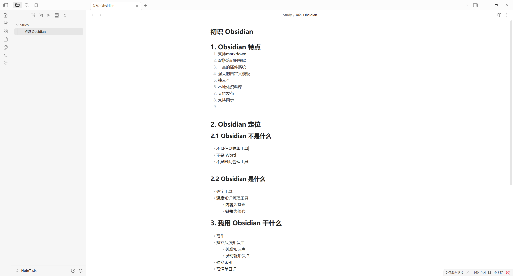


## 4.2 Obsidian 设置

- 切换中英文
- 外观
- 文件与链接
- 目录：核心插件
- 日记
- 模板

## 4.3 知识管理的步骤

- 学习知识
- 保存知识
- 使用知识
- 共享知识
- 创新知识

# 5. markdown语法

补充：待办清单

```
`- [ ] ` ----> 未完成
`- [X] ` / `- [x] ` ----> 已完成
```

- [ ] 

- [x] 

# 6. **双链功能

- 什么是双链
- 双链的意义
- 如何运用双链
- Obsidian 带来的新思维

## 6.1 什么是双链

链接

- 入链(反向链接)
- 出链


> 注意：在**阅读模式下**，鼠标放到链接上可以预览链接到的文本的信息


在 Obsidian 中创建指向其他笔记的链接：注意只能链接本资料库的数据

```
测试链接到文章 [[Python]]
测试链接到文章的标题 [[Python#Python 简介]]
测试链接到文章的某一个文本块 [[Python#^ce46c4]]
测试自定义连接块[[Python#^memo20260728]]
```

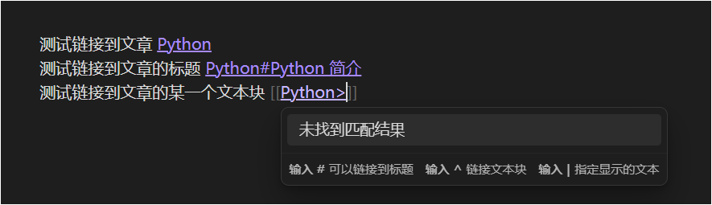


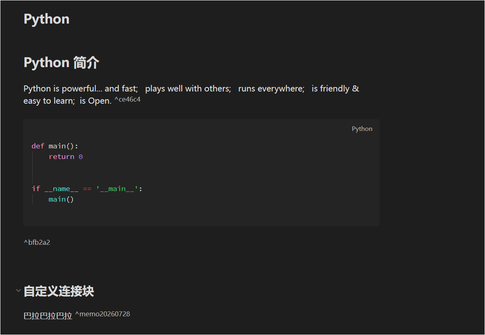


```
# 对链接起别名
测试链接到文章 [[Python|Python教程]]
测试链接到文章的标题 [[Python#Python 简介|python 简介]]
测试链接到文章的某一个文本块 [[Python#^ce46c4|官网首页简介]]
测试链接到文章的某一个文本块 [[Python#^bfb2a2|代码块测试]]

测试自定义连接块[[Python#^memo20260728|自定义连接块]]
```

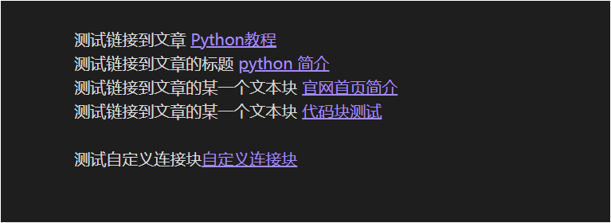

直接展示出来链接到的文本信息：

```
![[Python#Python 列表|Python列表]]
```

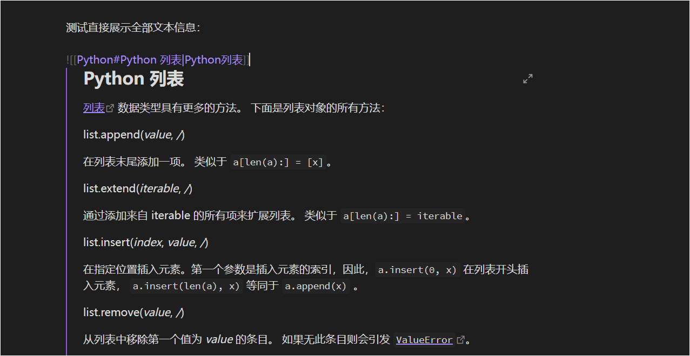

# 7. 双链的意义

- 线性笔记 VS. 知识网络
- 管理知识片段

# 8. Obsidian 给我们带来的新思维

> 基于方法使用工具
>
> 基于思维提炼方法

- 链接 -> 关联思维
  - 这意味着
    - 花更多功夫整理有价值的笔记
- 片段 -> 整合思维
  - 这意味着
    - 多整理有价值的片段
    - 片段成文

# 9. Obsidian 的技巧和设置

- 模板
- 内容同步
- 命令面板
- 快捷键

## 9.1 模板

- 结构相同
- 内容不同

什么情况下需要模板：

高频重复性笔记。

开启核心插件 -- 模板、日记


### 9.1.1 日记模板

```
YYYYMMDD_ddd
```

显示效果：

```
20260729_周三
```

日记模板：

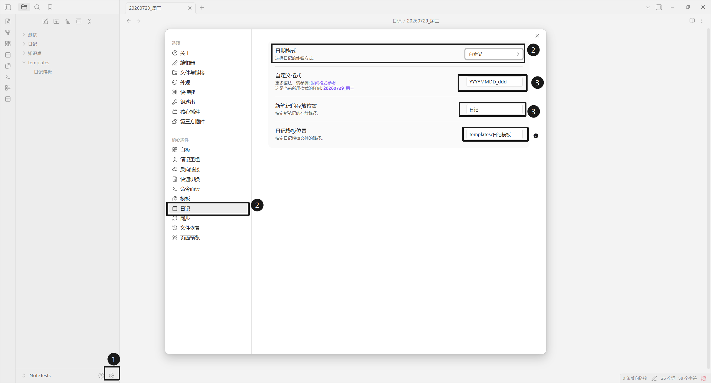

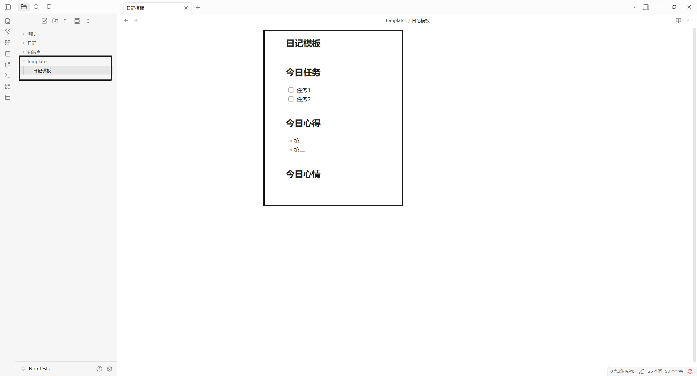

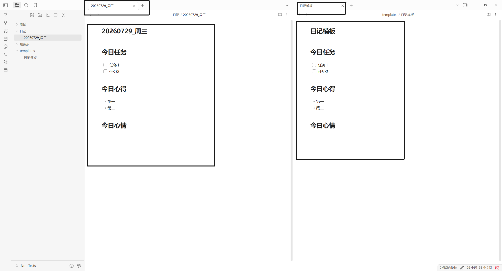

### 9.1.2 其他模板

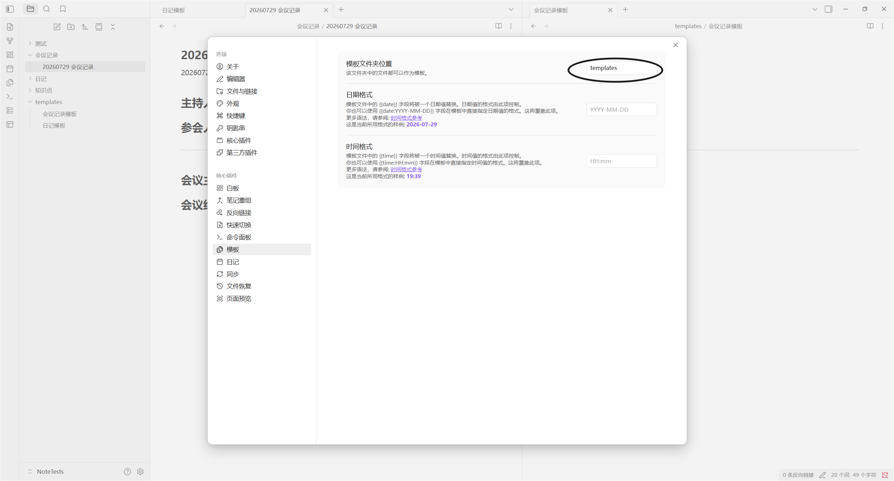

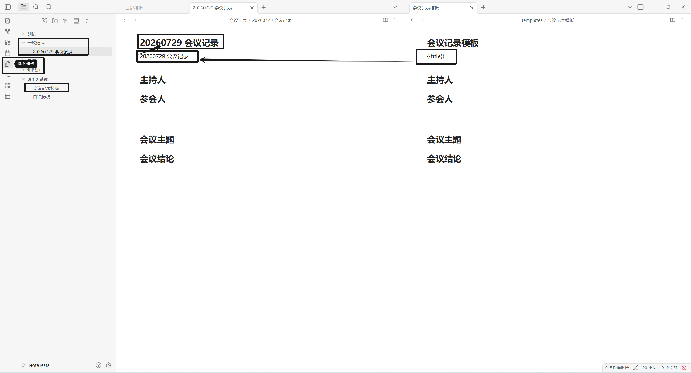

详细的占位符可查看Obsidian帮助文档 `https://obsidian.md/zh/help/`

## 9.2 同步

所有内容都是以文件夹+文件的方式保存的。

建议：一定要同步 .obsidian 文件夹

## 9.3 命令面板

...

## 9.4 快捷键

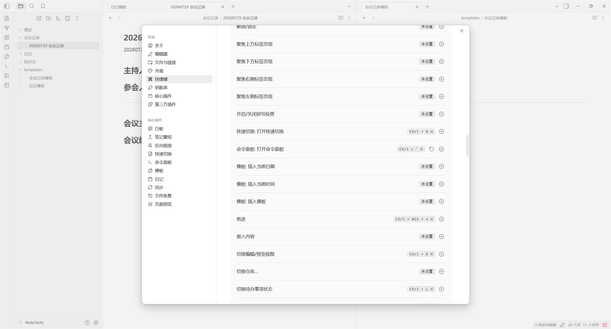

建议：为设置的快捷键列出清单。

# 10. 插件

- `Excalidraw` -- 绘图
- `File Explorer Note Count` -- 展示笔记数量
- `Recent Files`

- `Pandoc Plugin`
- `Minimal Theme Settings`

- 推荐插件
  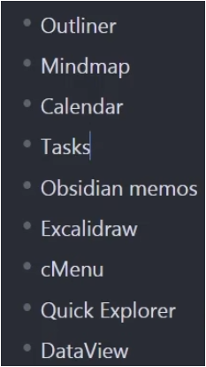
- `proxy github` -- 无需梯子即可访问 github


# 11. 搜索

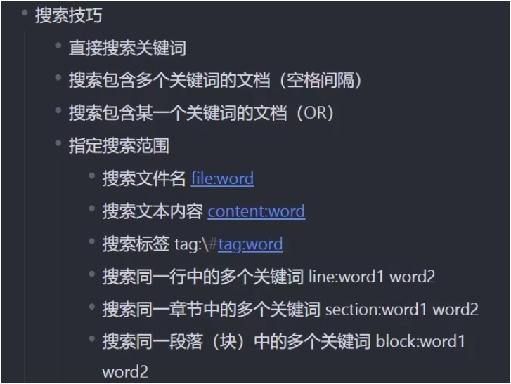


保存搜索结果：

````
```query
计算机 Python
```
````

按照上述代码框内的内容写，展示效果如下：下面这些都可以点击跳转。

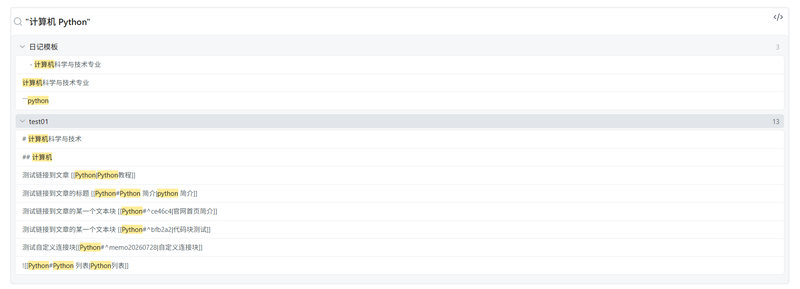

# 12. dataview 插件

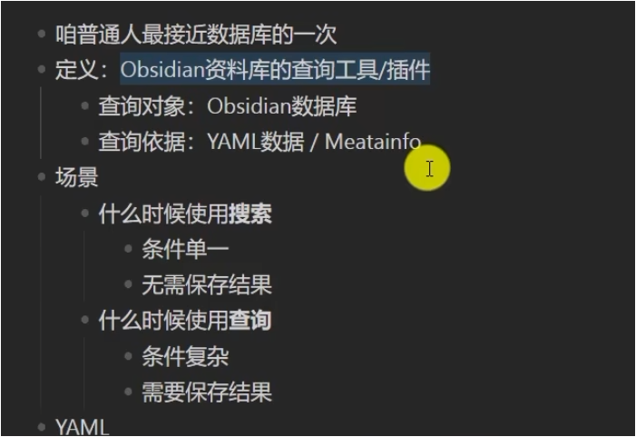


````
```dataview
list
from "知识点"
```
````

效果：查询出的数据可以直接跳转


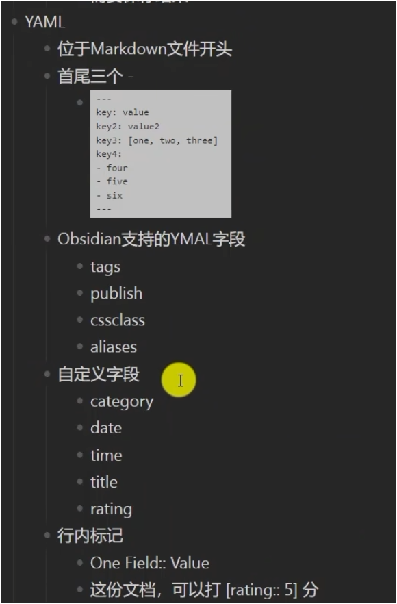

在文档最开头写三个 `-` 按回车后可以自定义本文档元数据：

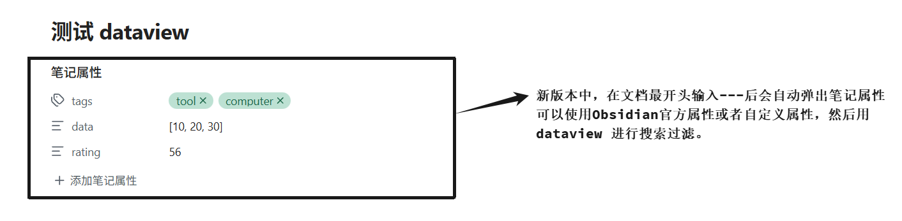

dataview 的查询方法：

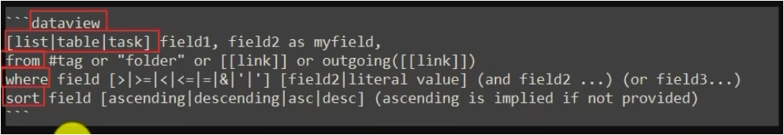

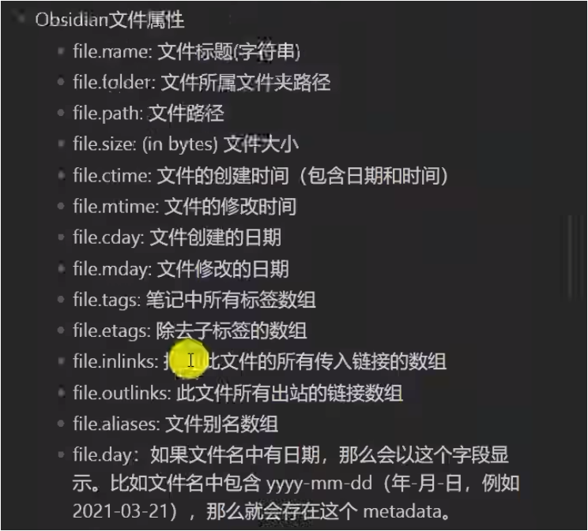

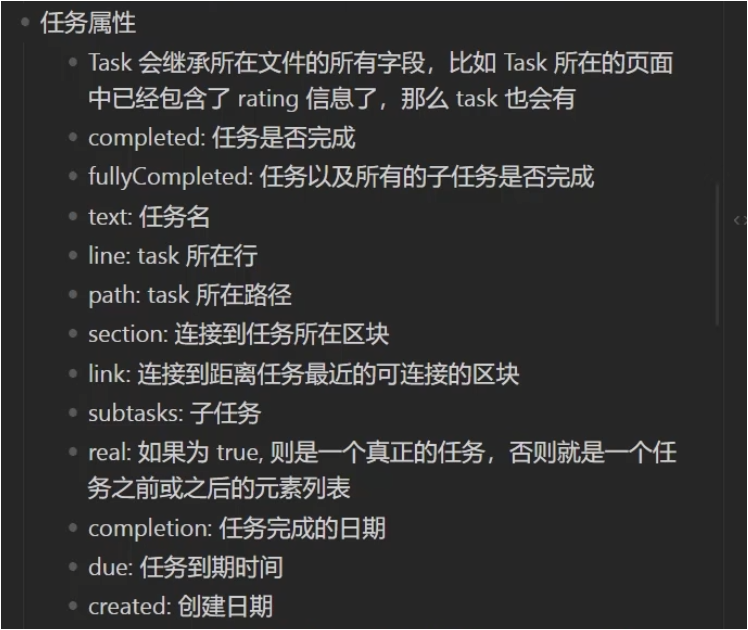


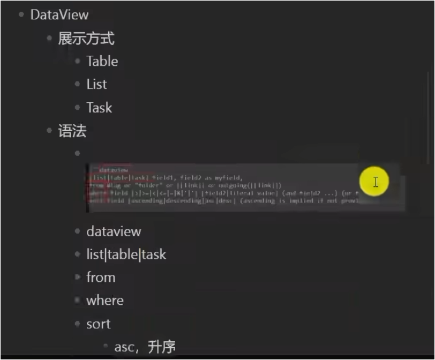

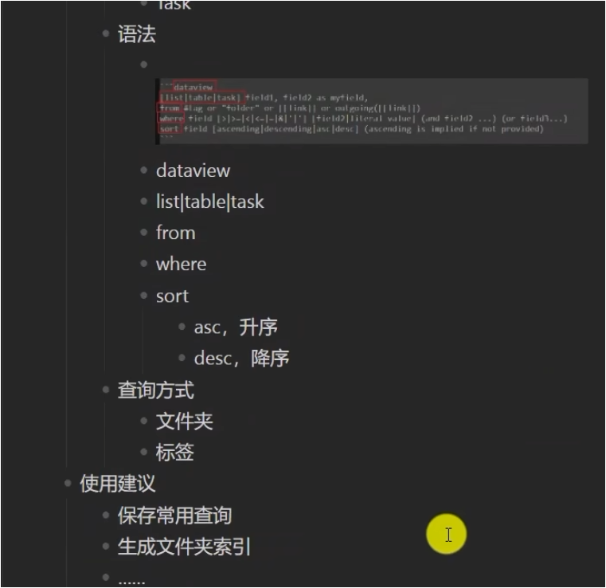


