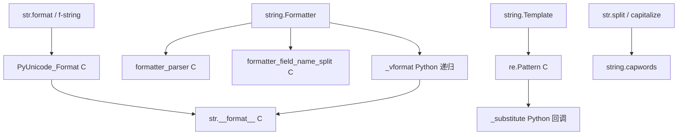

---
aliases:
  - course of study
  - course
tags:
  - tutorial
  - computer-science
category: knowledge
datetime: " 2026-08-14 23:08:49 周五"
author: wephiles
rating: "0"
---
<h1 style="text-align: center;">string</h1>

> 本文以 CPython 3.11/3.12 源码为参考。
> 注意：`string` 是 Python 标准库中的**字符串工具模块**，不是 `str` 类型本身。真正的字符串对象由 C 层 `Objects/unicodeobject.c` 实现，`string` 模块构建在 `str` 之上，提供常量、格式化框架与安全模板。

# 1. 宏观架构和设计哲学

## 1.1 核心抽象与本质问题

`string` 模块解决的本质问题不是“~~如何表示字符串~~”，而是：==字符串处理中高频、通用、易出错的模式，应该被标准化、集中化、可扩展化==。

它定义了四类核心抽象：

| 抽象         | 类型           | 作用                                                         |
| :----------- | :------------- | :----------------------------------------------------------- |
| 字符分类常量 | `str` 常量     | `ascii_letters`、`digits`、`hexdigits`、`octdigits`、`punctuation`、`printable`、`whitespace` 等 |
| 格式化框架   | `Formatter` 类 | 实现 PEP 3101 格式化协议的可扩展入口                         |
| 安全模板     | `Template` 类  | 基于 `$` 占位符的轻量模板引擎                                |
| 辅助函数     | `capwords`     | 对标 C `capwords()` 的便捷封装                               |

这些抽象的背后，是 `CPython` 一直以来的设计倾向：**把“机制”交给语言核心，把“策略”交给标准库**。

- `str.format()`、f-string 是语言核心机制，追求性能。
- `string.Formatter` 是标准库框架，追求可扩展性。
- `string.Template` 是安全策略，追求输入不可信时的下限保障。

## 1.2 设计哲学

### 1.2.1 薄封装, 不与 `str` 竞争

`string` 模块没有重新实现 `upper()`、`lower()`、`split()` 等能力。它的常量只是简单字符串，`capwords` 也只是组合 `split()` 与 `capitalize()`：

```python
# Lib/string.py
def capwords(s, sep=None):
    return (sep or ' ').join(x.capitalize() for x in s.split(sep))
```

这体现了 `“batteries included, but don't reinvent the battery”` 的哲学。

### 1.2.2 扩展优于修改

`Formatter` 被设计为可子类化。它不是让你修改标准库源码，而是通过覆盖特定钩子方法改变格式化行为。这是典型的 **框架思维**：

```python
class MyFormatter(string.Formatter):
    def format_field(self, value, format_spec):
        ...
```

### 1.2.3 安全默认

`Template` 只允许 `$identifier` 和 `${identifier}`，不执行任意表达式、不调用函数、不访问属性链。因此它比 `str.format` 和 `f-string` 更适合处理 **用户提供的模板**。

`str.format("{obj.__class__.__mro__}")` 是潜在的信息泄露，而 `Template` 从根本上削弱了这种能力。

### 1.2.4 与语言演化分工

- `str.format` / `f-string`：语言级、编译优化、不可扩展语法。
- `string.Formatter`：框架级、可扩展、纯 `Python/C` 混合。
- `string.Template`：安全级、功能极简、不可信输入可用。

## 1.3 主要设计模式

`string` 模块及其源码中主要运用了以下设计模式：

### 1.3.1 模板方法模式

`Formatter.vformat()` 定义了完整格式化流程：

```python
parse → get_field → convert_field → _vformat(format_spec) → format_field → join
```

子类可以覆盖 `parse`、`get_field`、`get_value`、`convert_field`、`format_field`、`check_unused_args` 等任一环节。

### 1.3.2 策略模式

通过子类化 `Formatter`，可以在运行时替换格式化策略。这比 `str.format` 的固定策略更灵活。

### 1.3.3 元类模式

`_TemplateMetaclass` 根据类属性 `delimiter`、`idpattern`、`braceidpattern` 动态生成并编译正则 `pattern`。这种把“配置”转化为“编译产物”的方式，在类创建时一次性完成，避免每次替换都重新解析模板语法。

### 1.3.4 生成器/迭代器模式

`Formatter.parse()` 返回生成器，逐段输出 `(literal_text, field_name, format_spec, conversion)`，避免一次性构造完整解析树。

### 1.3.5 组合模式

`get_field()` 通过 `formatter_field_name_split()` 将字段名拆解为“首字段 + 后续属性/索引链”，实现对 `a.b[0].c` 的递归访问。

# 2. 核心用法与实战

## 2.1 字符常量

```python
import string

print(string.ascii_letters)
# abcdefghijklmnopqrstuvwxyzABCDEFGHIJKLMNOPQRSTUVWXYZ

print(string.digits)
# 0123456789

print(string.hexdigits)
# 0123456789abcdefABCDEF

print(string.octdigits)
# 01234567

print(string.punctuation)
# !"#$%&'()*+,-./:;<=>?@[\]^_`{|}~

print(string.whitespace)
# ' \t\n\r\x0b\x0c'  只包含 ASCII 空白
```

**关键点**：这些常量只是普通字符串。`string.whitespace` 不等于 `str.isspace()` 判断的全部空白集合，这在第 6、7 节会展开。

## 2.2 `Formatter`：可扩展格式化框架

### 2.2.1 基础用法

`Formatter` 是 `str.format()` 的框架版本：

```python
import string

f = string.Formatter()

# 基本字段
print(f.format("Hello, {0}! You have {1} messages.", "Alice", 3))
# Hello, Alice! You have 3 messages.

# 字段名 + 属性 + 索引
print(f.format("{0.name} has {0.messages[0]} new messages.",
               type("User", (), {"name": "Bob", "messages": [5]})()))
# Bob has 5 new messages.

# 格式说明 + 转换
print(f.format("{0!r:<10} | {1:0>5}", "x", 42))
# 'x'        | 00042
```

### 2.2.2 进阶用法 -- 自定义 `Formatter`

```python
import string
from datetime import datetime

class MyFormatter(string.Formatter):
    def format_field(self, value, format_spec):
        # 自定义格式：以 'L' 结尾表示取长度
        if format_spec.endswith('L'):
            value = len(value)
            format_spec = format_spec[:-1]
        return super().format_field(value, format_spec)

    def convert_field(self, value, conversion):
        # 自定义转换 'd'：把 datetime 转成日期字符串
        if conversion == 'd' and isinstance(value, datetime):
            return value.date().isoformat()
        return super().convert_field(value, conversion)

f = MyFormatter()
print(f.format("{items!d} -> {items:L>3}", items=[1, 2, 3]))
# 2026-08-14 -> 003
```

## 2.2.3 底层运行原理

`Formatter` 的格式化流程如下：

```python
format_string
      │
      ▼
parse(format_string)        # C 层拆分为 literal_text / field_name / format_spec / conversion
      │
      ▼
对每个 field_name:
  get_field(field_name)     # C 层拆分 field_name，解析属性/索引
  get_value(first)          # 取出首个字段值
  逐个 getattr / __getitem__
      │
      ▼
convert_field(obj, conv)    # 处理 !r !s !a
      │
      ▼
若 format_spec 非空：
  _vformat(format_spec)     # 递归解析嵌套字段
      │
      ▼
format_field(obj, spec)     # 调用 obj.__format__(spec)
      │
      ▼
join 所有片段
```

## 2.3  `Template`：安全模板替换

### 2.3.1 基础用法

```python
from string import Template

t = Template("Hi $name, your balance is $$100. Total: ${amount}€")
print(t.substitute(name="Alice", amount=42))
# Hi Alice, your balance is $100. Total: 42€

# 使用映射
mapping = {"name": "Bob", "amount": 7}
print(t.safe_substitute(mapping))
# Hi Bob, your balance is $100. Total: 7€
```

### 2.3.2 关键语义

- `$$` 转义为字面 `$`
- `$identifier` 匹配普通标识符
- `${identifier}` 允许花括号明确边界
- `substitute()` 缺少键或格式非法时抛异常
- `safe_substitute()` 缺少键时保留原占位符

### 2.3.3 关键语义

- `$$` 转义为字面 `$`
- `$identifier` 匹配普通标识符
- `${identifier}` 允许花括号明确边界
- `substitute()` 缺少键或格式非法时抛异常
- `safe_substitute()` 缺少键时保留原占位符

### 2.3.4 进阶：自定义分隔符与标识符

```python
from string import Template

class ShellTemplate(Template):
    delimiter = '%'
    idpattern = r'[A-Z_][A-Z0-9_]*'

t = ShellTemplate("export PATH=%PATH:%HOME/bin")
print(t.substitute(PATH="/usr/bin", HOME="/home/me"))
# export PATH=/usr/bin:/home/me/bin
```

较新版本还支持 `braceidpattern`，可单独控制 `${...}` 内部模式。

### 2.3.5 底层运行原理

`Template` 在类创建时由 `_TemplateMetaclass` 生成并编译正则。`substitute()` 本质上等价于：

```python
compiled_pattern.sub(callback, self.template)
```

它不解析表达式，不递归求值，只做正则替换。这是它安全性高、但性能较低的根本原因。

## 2.4  `capwords`

```python
import string

print(string.capwords("  hello   world  python  "))
# Hello World Python
```

注意：当 `sep=None` 时，`capwords` 使用 `str.split()`，会先把连续空白压缩，因此结果中单词间只有一个空格。如果传入 `sep`，行为不同：

```python
print(string.capwords("one,  two,three", sep=","))
# One,  two,Three
```

# 3. 竞品分析与选型指南

## 3.1 Python 生态内

| 库 / 方案          | 功能     | 性能 | 易用性 | 社区活跃度 | 适用场景                  |
| :----------------- | :------- | :--- | :----- | :--------- | :------------------------ |
| `str.format()`     | 强       | 高   | 高     | 语言级     | 通用格式化                |
| `f-string`         | 强       | 最高 | 高     | 语言级     | 固定文本 + 表达式         |
| `string.Formatter` | 可扩展   | 中低 | 中     | 标准库     | 自定义格式化框架          |
| `string.Template`  | 弱       | 低   | 高     | 标准库     | 不可信模板、简单替换      |
| `Jinja2`           | 极强     | 高   | 中     | 非常活跃   | HTML/文本模板、控制流、宏 |
| `Mako`             | 强       | 高   | 中     | 活跃       | Python 风格模板、高性能   |
| `re`               | 正则替换 | 中   | 低     | 语言级     | 复杂模式提取              |

## 3.2 其他语言生态

| 语言         | 方案                              | 特点                                   |
| :----------- | :-------------------------------- | :------------------------------------- |
| `JavaScript` | Template literals                 | 运行时插值，支持表达式，无内置安全模板 |
| `Java`       | `String.format` / `MessageFormat` | `MessageFormat` 支持国际化但性能差     |
| `C#`         | String interpolation              | 编译期解析，类型安全，高性能           |
| `Rust`       | `format!`                         | 编译期宏，零运行时代价，类型安全       |
| `Ruby`       | String interpolation              | 运行时插值                             |
| `PHP`        | `sprintf` / heredoc               | 功能较弱                               |

## 3.3 选型建议

### 3.3.1 首选 `string.Template` 的场景

- 模板字符串来自用户输入或配置文件
- 只做简单占位符替换
- 安全优先，不希望模板中执行任意属性访问
- 例如：邮件模板中的 `$name`、`$order_id`

### 3.3.2 首选 f-string / `str.format` 的场景

- 格式字符串在源码中固定
- 性能敏感
- 需要表达式、属性访问、索引、格式说明
- 例如：日志格式化、数值格式输出

### 3.3.3 首选 `string.Formatter` 的场景

- 需要自定义格式化协议
- 需要控制字段解析、值获取、格式化行为
- 框架/库作者希望暴露格式化钩子

### 3.3.4 首选 `Jinja2` 的场景

- 完整模板语言：循环、条件、继承、宏
- HTML 渲染、邮件正文、代码生成
- 需要模板沙箱或自定义过滤器

### 3.3.5 首选 `gettext` / `Babel` / ICU 的场景

- 国际化、复数规则、地区格式
- 这是 `string.Template` 和 `str.format` 无法覆盖的维度

# 4. C 语言底层实现细节

## 4.1 `string` 模块并非纯 Python

很多人以为 `string` 是纯 Python 模块，这是一个常见误解。实际上，`CPython` 的 `string.py` 顶部有：

```python
from _string import formatter_parser, formatter_field_name_split
```

`_string` 是一个 **C 扩展模块**。它提供两个关键函数：

- `formatter_parser(format_string)`：把格式字符串拆成 `(literal_text, field_name, format_spec, conversion)` 元组。
- `formatter_field_name_split(field_name)`：把字段名拆成 `(first, rest)`，其中 `rest` 是 `(is_attr, name)` 列表。

`Formatter.parse()` 和 `Formatter.get_field()` 都直接委托给这两个 C 函数：

```python
class Formatter:
    def parse(self, format_string):
        return formatter_parser(format_string)

    def get_field(self, field_name, args, kwargs):
        first, rest = formatter_field_name_split(field_name)
        obj = self.get_value(first, args, kwargs)
        for is_attr, i in rest:
            obj = getattr(obj, i) if is_attr else obj[i]
        return obj
```

因此，`string.Formatter` 的解析器是 C 加速的，这避免了 Python 层逐字符扫描格式字符串。

## 4.2 `str` 对象的 C 实现

`string` 模块的能力最终依赖 `str` 的 C 实现：

- 文件：`Objects/unicodeobject.c`
- 头文件：`Include/cpython/unicodeobject.h`

### 4.2.1 PEP 393 灵活字符串表示

`CPython 3.3+` 使用 PEP 393 的字符串存储方案。一个 `str` 对象在 C 层是：

```python
typedef struct {
    PyObject_HEAD
    Py_ssize_t length;
    Py_UCS1 *data;   // 可能指向 1/2/4 字节单位
    Py_hash_t hash;
    int state;
    unsigned int kind: 2;
    unsigned int compact: 1;
    unsigned int ascii: 1;
    unsigned int ready: 1;
} PyUnicodeObject;
```

- `kind` 可以是 `PyUnicode_1BYTE_KIND`、`2BYTE_KIND`、`4BYTE_KIND`
- 全 ASCII 字符串使用 1 字节/字符，内存紧凑
- 哈希在首次调用 `hash()` 后缓存

这解释了为什么纯 `ASCII` 字符串在 Python 中非常高效。

### 4.2.2 格式化在 C 层完成

`str.format()` 最终调用 C 层 `PyUnicode_Format()`。C 实现负责：

- 解析格式说明 `[[fill]align][sign][z][#][0][width][grouping_option][.precision][type]`
- 调用对象的 `__format__` 或 C 快速路径
- 内存管理：使用 `_PyUnicodeWriter` 增量写入，避免反复分配和拼接

`string.Formatter` 的 `format_field()` 调用 `value.__format__(format_spec)`，最终还是进入 C 层。

## 4.3 `Template` 的 C 层正则

`Template` 使用 `re` 模块。`re` 是 C 扩展 `_sre` 的 Python 封装：

- 源码：`Modules/_sre.c`、`Modules/sre_lib.h`
- 正则先编译为字节码，再由 C 状态机执行
- 支持快速搜索、缓存已编译模式

但注意：`Template.substitute()` 中：

```python
return self.pattern.sub(self._substitute, self.template)
```

`re.Pattern.sub()` 在 C 层执行匹配，但**每次匹配成功后都会回调 Python 函数 `_substitute`**。这种 Python/C 边界切换是性能瓶颈之一。

## 4.4 性能瓶颈在 C 层如何解决

| 瓶颈                 | 解决方案                                                     |
| :------------------- | :----------------------------------------------------------- |
| 字符串拼接导致 O(n²) | `_PyUnicodeWriter` 使用缓冲，`_vformat` 使用 `list` + `join` |
| 格式解析慢           | `_string` 模块用 C 实现 `formatter_parser`                   |
| 正则匹配慢           | `_sre` C 状态机；`Template` 类创建时编译一次                 |
| 属性/索引解析慢      | `formatter_field_name_split` 在 C 层一次性拆解               |
| 哈希计算             | `str` 哈希缓存                                               |

但 `string.Formatter` 的字段递归展开和 `Template` 的回调替换仍在 Python 层，所以性能上限低于 f-string。

# 5. 源码阅读指南

## 5.1 入口文件

下载 `CPython` 源码后，从以下文件入手：

| 文件                      | 内容                                     |
| :------------------------ | :--------------------------------------- |
| `Lib/string.py`           | `string` 模块全部 Python 代码，约 300 行 |
| `Modules/_string.c`       | `_string` C 扩展，格式化解析器           |
| `Objects/unicodeobject.c` | `str` 类型核心实现                       |
| `Modules/_sre.c`          | 正则 C 引擎，`Template` 依赖             |

## 5.2 `Lib/string.py` 结构

```
Lib/string.py
├── 字符常量
│   ├── ascii_letters
│   ├── ascii_lowercase / ascii_uppercase
│   ├── digits / hexdigits / octdigits
│   ├── punctuation / printable / whitespace
│
├── class Formatter
│   ├── format / vformat / _vformat
│   ├── parse → _string.formatter_parser
│   ├── get_field → _string.formatter_field_name_split
│   ├── get_value
│   ├── check_unused_args
│   ├── format_field
│   └── convert_field
│
├── _TemplateMetaclass
│   └── 动态生成并编译 pattern
│
├── class Template
│   ├── delimiter / idpattern / braceidpattern / flags
│   ├── __init__
│   ├── substitute / safe_substitute
│   └── _substitute / _process_args
│
└── capwords()
```

## 5.3 架构图解



## 5.4 继承路径与阅读顺序

`string` 模块没有复杂的类继承树，核心继承只有一个元类：

```
type
 └── _TemplateMetaclass
      └── Template
```

### 5.4.1 建议阅读顺序

1. **`capwords()`**：最简单，先建立“薄封装”的直觉。
2. **字符常量**：明白模块的“常量集合”定位。
3. **`Formatter.parse()`**：理解 C 解析器的返回协议。
4. **`Formatter.vformat()` / `_vformat()`**：核心控制流，递归解析。
5. **`Formatter.get_field()` / `get_value()`**：字段名拆解与值访问。
6. **`_TemplateMetaclass`**：元类如何动态构造正则。
7. **`Template.substitute()` / `safe_substitute()`**：安全替换的完整过程。

# 6. 黑暗面与性能陷阱

## 6.1 时间复杂度

| 操作                    | 时间复杂度                                         |
| :---------------------- | :------------------------------------------------- |
| `Formatter.parse()`     | O(n)，由 C 完成                                    |
| `Formatter.vformat()`   | O(n + m)，m 为字段展开与格式化成本                 |
| `Template.substitute()` | O(n + k)，k 为匹配数量，但每次匹配调用 Python 回调 |
| `capwords()`            | O(n)，中间列表会带来空间开销                       |

空间复杂度：`_vformat` 使用 `list` 收集片段，额外 O(片段数量)；字符串不可变，格式化过程中会产生中间对象。

## 6.2 鲜为人知的陷阱

### 6.2.1 `safe_substitute` 静默失败

```
from string import Template

t = Template("User: $username, IP: $ip")
out = t.safe_substitute(username="alice")
print(out)
# User: alice, IP: $ip
```

它不报错，输出中残留 `$ip`。在生产环境中，这可能生成错误邮件、错误配置、错误 SQL 片段。**如果你需要严格校验，必须使用 `substitute()`。**

### 6.2.2 `string.whitespace` 只是 ASCII

```
import string

text = "hello\u2003world"  # \u2003 是 Unicode em space
parts = text.split()
print(string.whitespace)
# ' \t\n\r\x0b\x0c'

print("\u2003".isspace())
# True
```

`str.strip()` / `str.split()` 使用 Unicode 数据库，`string.whitespace` 只是 ASCII。不要用 `string.whitespace` 做通用空白判断。

### 6.2.3 `Formatter` 递归深度有限

`_vformat` 初始 `recursion_depth=2`。嵌套格式说明超过限制会抛：

```
ValueError: Max string recursion exceeded
```

例如深层嵌套 `"{0:{1:{2:{3}}}}"` 会触发。这不是无限递归保护，而是对外暴露的限制。

### 6.2.4 `Template` 类属性不能实例级修改

```
class MyTemplate(Template):
    delimiter = '%'

t = MyTemplate("%name")
print(t.substitute(name="x"))  # OK

# 错误：实例上改 delimiter 不会重新编译 pattern
t.delimiter = '$'
print(t.substitute(name="x"))  # 仍然按 % 解析
```

`delimiter`、`idpattern` 等必须在**子类定义**中修改，由元类在类创建时重新编译。

### 6.2.5 重复创建 `Template` 实例

每次 `Template(s)` 都会创建实例，但正则 `pattern` 是类属性，已编译。实例创建本身成本不高，但 `substitute()` 每次都调用 `re.sub()`，如果有大量输入，应复用同一个 `Template` 对象。

## 6.3 高并发与大数据量场景

### 6.3.1 线程安全

- `Formatter` 默认无共享可变状态，线程安全。
- `Template` 实例的 `template` 字符串只读，`substitute()` 不修改实例，线程安全。
- 但如果你子类化 `Formatter` 并添加可变状态，线程安全由你自己负责。

### 6.3.2 GIL 限制

`Template.substitute()` 和 `Formatter.vformat()` 都是 CPU 密集型操作，受 GIL 限制，多线程无法利用多核。大数据量下应：

- 使用 `ProcessPoolExecutor`
- 或改用 f-string / `str.format`
- 或使用 C 扩展 / Cython

### 6.3.3 典型卡点

- `Template.substitute()` 处理大量模板时，Python 回调开销大。
- `Formatter.get_field()` 对每个字段进行属性/索引访问，若对象 `__getattr__` 很慢，会放大。
- `capwords()` 对超长字符串会创建完整中间列表。

## 6.4 优化实践

### 6.4.1 反模式

```
from string import Template

# 反模式 1：循环中重复创建 Template
for row in rows:
    out.append(Template(html).substitute(row))

# 反模式 2：字符串直接拼接
result = ""
for row in rows:
    result += Template(html).substitute(row)
```

### 6.4.2 最佳实践

```
from string import Template

# 1. 复用 Template 实例
tpl = Template(html)
parts = [tpl.substitute(row) for row in rows]
result = "".join(parts)

# 2. 如果模板固定且字段已知，优先 f-string
# 最高性能
for name, count in rows:
    out.append(f"<li>{name}: {count}</li>")

# 3. 动态 mapping 且固定模板时，缓存 format_map
fmt = "<li>{name}: {count}</li>"
out = [fmt.format_map(row) for row in rows]
```

### 6.4.3 为什么 `list` + `join` 更高效？

Python 字符串不可变，`s += x` 每次都会创建新字符串并复制旧内容，总复杂度 O(n²)。`join()` 先计算总长度，一次性分配目标缓冲区，在 C 层完成复制，复杂度 O(n)。

# 7. 面试题与深度思考

## 7.1 题目一

> `Formatter.parse()` 返回什么？底层如何加速？

**问题**
`string.Formatter.parse()` 是格式化框架的入口，它返回的元组结构是什么？为什么它比纯 Python 逐字符解析快？

**参考答案**
`parse()` 返回一个生成器，每次产出：

```
(literal_text, field_name, format_spec, conversion)
```

- `literal_text`：字段前的字面文本
- `field_name`：字段名，可能为空
- `format_spec`：`:` 后面的格式说明
- `conversion`：`!` 后面的转换标志，可能为 `None`、`'r'`、`'s'`、`'a'`

底层加速原因：`Formatter.parse()` 直接委托给 C 扩展 `_string.formatter_parser()`，由 C 层完成字符串扫描和元组构造，避免了 Python 层的逐字符循环与边界判断。`get_field()` 同理，使用 `_string.formatter_field_name_split()` 在 C 层一次性拆解字段名。

------

## 7.2 题目二

> `Template.safe_substitute()` 和 `substitute()` 的本质区别是什么？为什么 `Template` 性能远低于 f-string？

**参考答案**
**区别**：

- `substitute()`：遇到缺失键会抛 `KeyError`，遇到非法占位符会抛 `ValueError`。
- `safe_substitute()`：缺失键或非法占位符时**静默保留原文本**，不抛异常。这会带来风险：生成结果中可能残留未替换的占位符，掩盖配置错误。

**性能低的原因**：

1. `Template` 每次 `substitute()` 都调用 `re.Pattern.sub()`，虽然匹配在 C 层，但每个匹配都会回调 Python 的 `_substitute` 方法，产生大量 Python/C 边界切换。
2. 它没有表达式求值，但也没有 f-string 的编译期优化。f-string 在编译期生成字节码，直接调用 `FORMAT_VALUE`，省去正则匹配和字符串模板解析。

因此，`Template` 在需要安全的不可信模板时选，性能敏感场景应选 f-string。

------

## 7.3 题目三

> `string.whitespace` 与 `str.strip()` 的空白判断不一致，为什么？应如何正确判断空白字符？

**参考答案**
`string.whitespace` 定义为：

```
' \t\n\r\x0b\x0c'
```

它只包含 6 个 ASCII 空白字符。而 `str.strip()` 无参数时使用 Unicode 空白集合，包含 `\x1c-\x1f`、`\x85`、`\xa0`、`\u1680`、`\u2000-\u200a`、`\u2028`、`\u2029`、`\u202f`、`\u205f`、`\u3000` 等。

原因：`string` 模块常量是历史遗留的 ASCII 定义，早期 Python 字符串处理以 ASCII 为中心；而 `str` 是 Unicode 字符串，语言核心必须支持完整 Unicode。

正确做法：

```
# 判断空白字符
if char.isspace(): ...

# 或使用 unicodedata
import unicodedata
if unicodedata.category(char) == 'Zs': ...

# 不要用
if char in string.whitespace: ...  # 不完整
```
