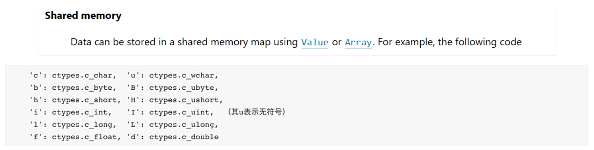
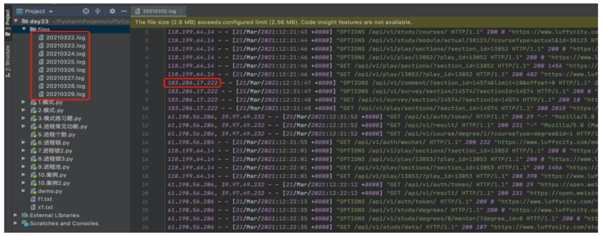

---
aliases:
  - course of study
  - course
tags:
  - tutorial
  - computer-science
category: knowledge
datetime: " 2026-08-15 11:08:13 周六"
author: wephiles
rating: "0"
---
<h1 style="text-align: center;">overview</h1>

进程是计算机中资源分配最小的单位，一个进程中可以有多个线程，同一个进程中的线程共享资源。

进程与进程之间则是相互隔离。

`Python` 中通过多进程可以利用CPU的多核优势，计算密集型操作适用于多进程。

# 1. 进程

```python
import multiprocessing

def task():
    pass

if __name__ == '__main__':
    p = multiprocessing.Process(target=task)
    p.start()
```

```python
import multiprocessing

def task(arg):
    pass

def run():
    p = multiprocessing.Process(target=task, args=('xxx',))
    p.start()

if __name__ == '__main__':
    run()
```

## 1.1 主进程和子进程

每个python脚本运行时会创建一个进程(主进程)，如果我们手动创建子进程：

### 1.1.1 `fork` 方法创建子进程

子进程几乎拷贝父进程所有资源，子进程里面对资源的操作和主进程对资源的操作互不影响；另外，文件对象/线程锁等资源既会拷贝，又可以通过参数传递。

#### 1.1.1.1 示例一（Linux 系统运行）：

```python
# /usr/bin/env python
# -*- coding: utf-8 -*-

"""
测试多线程 —— fork 创建子进程
"""

import multiprocessing


def task():
    print("子进程:", name)


name = []

if __name__ == "__main__":
    name.append(123)
    print("主进程:", name)
    p = multiprocessing.Process(target=task)
    p.start()

    # print(f"当前默认启动方法: {multiprocessing.get_start_method()}")
    # # 也可以获取所有可用的启动方法
    # print(f"所有可用的启动方法: {multiprocessing.get_all_start_methods()}")
```

输出结果：

```
主进程: [123]
子进程: []
```

注意：

即使在 Linux 上使用 `fork` 启动方法，官方文档仍然强烈建议使用 `if __name__ == '__main__'`，原因如下：

| 情况                        | 是否需要 `if __name__ == '__main__'` | 原因                                                         |
| :-------------------------- | :----------------------------------- | :----------------------------------------------------------- |
| **`fork (Linux 默认)`**     | **强烈建议**                         | 虽然不会立即报错，但可能导致：1. 意外递归创建进程；2. 资源泄漏；3. 调试困难；4. 与其他启动方法不兼容 |
| **`forkserver`**            | **必须**                             | 子进程会重新导入模块，不加保护会导致无限递归                 |
| **`spawn (Windows/macOS)`** | **必须**                             | 子进程会重新导入模块，不加保护会导致无限递归                 |

#### 1.1.1.2 示例二（Linux 系统运行）

```
# /usr/bin/env python
# -*- coding: utf-8 -*-

"""
测试多线程 —— fork 创建子进程
"""

import multiprocessing


def task():
    print("append 前子进程:", name)
    name.append(123)
    print("append 后子进程:", name)


name = [456]

if __name__ == "__main__":
    print("主进程前:", name)
    p = multiprocessing.Process(target=task)
    p.start()
    print("主进程后:", name)
```

 输出结果:

```
主进程前: [456]
主进程后: [456]
append 前子进程: [456]
append 后子进程: [456, 123]
```

### 1.1.2 `spawn` 模式创建子进程

不会拷贝主进程的资源 需要手动去传输一些必备的值, ⚠️⚠️⚠️**注意:spawn下对于一些特殊的(文件对象/锁),子进程不会拷贝这些对象，与此同时通过参数传递也不可以!!! -- 需要自己去子进程中再去重新创建一遍！**⚠️⚠️⚠️

#### 1.1.2.1 示例一

```python
import multiprocessing


def task():
    print(f'name: {name}')


if __name__ == '__main__':
    name = [1, 2, 3]
    p = multiprocessing.Process(target=task)
    p.start()
```

输出: 会报错

```
Process Process-1:
Traceback (most recent call last):
  File "D:\Software\Python\Lib\multiprocessing\process.py", line 320, in _bootstrap
    self.run()
    ~~~~~~~~^^
  File "D:\Software\Python\Lib\multiprocessing\process.py", line 108, in run
    self._target(*self._args, **self._kwargs)
    ~~~~~~~~~~~~^^^^^^^^^^^^^^^^^^^^^^^^^^^^^
  File "E:\Code\PyProjects\Demos\exercise\src\exercise\multi_threading\demo_03.py", line 21, in task
    print(f'name: {name}')
                   ^^^^
NameError: name 'name' is not defined
```


#### 1.1.2.2 示例二: 需要手动传递资源

```python
import multiprocessing


def task(name):
    print(f'name: {name}')


if __name__ == '__main__':
    name = [1, 2, 3]
    p = multiprocessing.Process(target=task, args=(name,))
    p.start()
```

输出结果:

```python
name: [1, 2, 3]
```


#### 1.1.2.3 示例三: 传递过去后也是复制一份

```python
import multiprocessing


def task(data):
    print('before sub process:', data)
    data.append('four')
    print('after sub process:', data)


if __name__ == '__main__':
    name = [1, 2, 3]
    print('before main process:', name)
    p = multiprocessing.Process(target=task, args=(name,))
    p.start()
    p.join()
    print('after main process:', name)
```

输出结果:

```python
before main process: [1, 2, 3]
before sub process: [1, 2, 3]
after sub process: [1, 2, 3, 'four']
after main process: [1, 2, 3]
```

#### 1.1.2.4 示例四

```python
import multiprocessing


def task(fp, l):
    print(fp, l)


if __name__ == '__main__':
    f = open('data.txt')
    lock = multiprocessing.Lock()

    p = multiprocessing.Process(target=task, args=(f, lock,))
    p.start()
    p.join()
```

输出: 报错

```python
Traceback (most recent call last):
  File "E:\Code\PyProjects\Demos\exercise\src\exercise\multi_threading\demo_03.py", line 29, in <module>
    p.start()
    ~~~~~~~^^
  File "D:\Software\Python\Lib\multiprocessing\process.py", line 121, in start
    self._popen = self._Popen(self)
                  ~~~~~~~~~~~^^^^^^
  File "D:\Software\Python\Lib\multiprocessing\context.py", line 230, in _Popen
    return _default_context.get_context().Process._Popen(process_obj)
           ~~~~~~~~~~~~~~~~~~~~~~~~~~~~~~~~~~~~~~~~~~~~~^^^^^^^^^^^^^
  File "D:\Software\Python\Lib\multiprocessing\context.py", line 343, in _Popen
    return Popen(process_obj)
  File "D:\Software\Python\Lib\multiprocessing\popen_spawn_win32.py", line 97, in __init__
    reduction.dump(process_obj, to_child)
    ~~~~~~~~~~~~~~^^^^^^^^^^^^^^^^^^^^^^^
  File "D:\Software\Python\Lib\multiprocessing\reduction.py", line 60, in dump
    ForkingPickler(file, protocol).dump(obj)
    ~~~~~~~~~~~~~~~~~~~~~~~~~~~~~~~~~~~^^^^^
TypeError: cannot pickle 'TextIOWrapper' instances
when serializing tuple item 0
when serializing dict item '_args'
when serializing multiprocessing.context.Process state
when serializing multiprocessing.context.Process object
```

#### 1.1.2.5 关于传递给子进程文件对象时出错

> 为什么报错:

`multiprocessing` 在创建子进程时，需要将传递给子进程的参数**序列化（pickle）**，然后通过进程间通信传递过去。问题在于：

- 文件对象无法被序列化
  ```python
  import pickle
  
  f = open('./multi_threading/data.txt')
  pickle.dumps(f)
  
  # ❌ 错误信息如下:
  # Traceback (most recent call last):
  #   File "E:\Code\PyProjects\Demos\exercise\src\exercise\main.py", line 20, in <module>
  #     pickle.dumps(f)  # ❌ TypeError: cannot pickle 'file' object
  #     ~~~~~~~~~~~~^^^
  # TypeError: cannot pickle 'TextIOWrapper' instances
  ```

  **文件对象是操作系统资源句柄，无法被序列化**，因此无法通过 `args` 传递给子进程。

- 锁的传递也有限制
  虽然 `multiprocessing.Lock()` 本身是可以被序列化的（在 Linux 的 `fork` 模式下可以直接继承），但在使用 `spawn` 或 `forkserver` 启动方法时（如你的 `WSL` 环境），锁对象也可能出现序列化问题。

> 解决方法

方案一: 最简单的方法是让每个子进程自己打开文件.

```python
import multiprocessing


def task(filename, lock=None):
    with lock if lock else multiprocessing.NullContext():
        with open(filename, 'r') as f:
            content = f.read()
            print(f"读取内容: {content}")


if __name__ == '__main__':
    filename = 'data.txt'
    lock = multiprocessing.Lock()

    p = multiprocessing.Process(target=task, args=(filename, lock))
    p.start()
    p.join()

```

方案二: 使用 `Pool` + 文件名传递

如果使用进程池，也是同样的思路：

```python
import multiprocessing


def task(filename):
    with open(filename, 'r') as f:
        return f.read()


if __name__ == '__main__':
    filename = 'data.txt'
    
    with multiprocessing.Pool(processes=2) as pool:
        results = pool.map(task, [filename, filename])
        for result in results:
            print(result)

```

方案三: 使用共享文件描述符(高级用法, 仅限 `Linux/Unix`)

如果你**必须在父进程中打开文件**并传递给子进程（例如文件已经以特定模式打开），可以使用 `multiprocessing.Pipe` 或 `multiprocessing.Connection` 来传递文件描述符：

```python
import multiprocessing
import os


def task(conn):
    # 从连接接收文件描述符
    fd = conn.recv_fd()
    # 使用 os.fdopen 创建文件对象
    with os.fdopen(fd, 'r') as f:
        content = f.read()
        print(f"子进程读取内容: {content}")


if __name__ == '__main__':
    filename = 'data.txt'
    
    # 在父进程中打开文件
    f = open(filename, 'r')
    
    # 创建管道
    parent_conn, child_conn = multiprocessing.Pipe(duplex=True)
    
    # 启动子进程
    p = multiprocessing.Process(target=task, args=(child_conn,))
    p.start()
    
    # 通过管道发送文件描述符
    parent_conn.send_fd(f.fileno())
    
    # 关闭管道连接
    child_conn.close()
    parent_conn.close()
    
    p.join()
    f.close()

```

方案四:  使用 `multiprocessing.Manager`（适用于需要在进程间共享文件）:

如果多个子进程需要访问同一个文件，可以使用 `Manager` 来管理资源：

```python
import multiprocessing


def task(filename, manager_lock):
    with manager_lock:
        with open(filename, 'r') as f:
            content = f.read()
            print(f"进程 {multiprocessing.current_process().pid} 读取: {content}")


if __name__ == '__main__':
    filename = 'data.txt'
    
    # 使用 Manager 创建共享锁
    with multiprocessing.Manager() as manager:
        lock = manager.Lock()
        
        processes = []
        for i in range(3):
            p = multiprocessing.Process(target=task, args=(filename, lock))
            p.start()
            processes.append(p)
        
        for p in processes:
            p.join()

```

个方案对比:

| 方案                 | 优点                     | 缺点                    | 适用场景                     |
| :------------------- | :----------------------- | :---------------------- | :--------------------------- |
| **子进程中打开文件** | ✅ 简单、跨平台、安全     | ❌ 每个进程独立打开文件  | 大多数场景，**推荐**         |
| **Pool + 文件名**    | ✅ 高效、自动管理进程     | ❌ 需要使用 Pool         | 批量处理多个文件             |
| **传递文件描述符**   | ✅ 父进程控制文件打开方式 | ❌ 仅限 Unix/Linux、复杂 | 特殊需求，如共享同一文件位置 |
| **Manager**          | ✅ 进程间共享资源         | ❌ 性能开销较大          | 需要进程间协调的复杂场景     |

#### 1.1.2.6 关于锁的使用

`lock = multiprocessing.Lock()` 是正确的，锁本身可以被序列化。但要注意：

锁的正确使用方式:

```python
import multiprocessing
import time


def task(filename, lock):
    with lock:  # 使用上下文管理器自动获取/释放锁
        with open(filename, 'a') as f:
            f.write(f"进程 {multiprocessing.current_process().pid} 写入数据\n")
            time.sleep(0.1)  # 模拟耗时操作


if __name__ == '__main__':
    filename = 'data.txt'
    lock = multiprocessing.Lock()
    
    processes = []
    for i in range(5):
        p = multiprocessing.Process(target=task, args=(filename, lock))
        p.start()
        processes.append(p)
    
    for p in processes:
        p.join()
    
    # 查看写入结果
    with open(filename, 'r') as f:
        print("文件内容:")
        print(f.read())

```

#### 1.1.2.7 常见错误总结

```python
# ❌ 错误 1：传递文件对象
f = open('data.txt')
p = multiprocessing.Process(target=task, args=(f,))
# TypeError: cannot pickle '_io.TextIOWrapper' object

# ❌ 错误 2：在 spawn/forkserver 模式下传递某些不可序列化的对象
# 在 Windows 或使用 spawn/forkserver 时，某些对象无法传递

# ❌ 错误 3：忘记关闭文件
f = open('data.txt')
p = multiprocessing.Process(target=task, args=('data.txt',))
p.start()
# 忘记 f.close() 可能导致资源泄漏

# ✅ 正确做法：传递文件名，在子进程中打开
p = multiprocessing.Process(target=task, args=('data.txt', lock))
p.start()
p.join()
```

#### 1.1.2.8 核心原则

1. **只传递可序列化的对象**：基本类型（int, str, list, dict 等）和 multiprocessing 专用对象（Lock, Queue, Pipe 等）
2. **文件名代替文件对象**：传递文件路径字符串，让子进程自己打开文件
3. **使用上下文管理器**：用 `with` 语句确保文件和锁正确释放
4. **考虑启动方法的影响**：不同的启动方法对序列化的要求不同

### 1.1.3 `forkserver` 模式创建子进程

和 `spqwn` 一样,通过 `run` 方法去完成

### 1.1.4 补充

关于在 `Python` 中基于 `multiprocessing` 模块操作的进程:

官方文档: https://docs.python.org/zh-cn/3.14/library/multiprocessing.html


### 1.1.5 案例

案例一

```python
# Linux(fork)

import multiprocessing
import time


def task():
    print(name)

    # 此时 file_object 已经写入了 abc\n
    file_object.write('def\n')  # 又写入了 def\n --> 现在子进程的进程空间中已经写入了 abc\ndef\n
    file_object.flush()  # 刷入硬盘  --> 硬盘中已经写入了 abc\ndef\n


if __name__ == '__main__':
    name = []
    file_object = open('x.txt', 'a+', encoding='utf-8')  
    file_object.write('abc\n')  # 写入内存，主进程在自己的进程空间（内存）中写入abc\n

    p = multiprocessing.Process(target=task,)  # 创建子进程，子进程完全拷贝主进程 转到 task 函数
    p.start()

    # 子进程结束后，task 函数结束，转到主进程，主进程在结束之间还会将自己的进程空间里的内容写入磁盘：将 abc\n 刷入磁盘
	
```


案例二:

```python
import multiprocessing
import time


def task():
    print(name)
    file_object.write('def\n')
    file_object.flush()


if __name__ == '__main__':
    name = []
    file_object = open('x.txt', 'a+', encoding='utf-8')  
    file_object.write('abc\n')
    file_object.flush()  # 刷入磁盘后，主进程释放进程空间

    p = multiprocessing.Process(target=task,)
    p.start()
```


案例三:

```python
import time
import threading
import multiprocessing


def task():
    # 拷贝的锁是被申请走的状态
    # 问题：被谁申请走了呢？
    # 	被子进程中的主线程申请走了
    print(lock)
    
    # with lock:
    #     print('执行中...')
    
    # 如果将上面两行改成下面这两行后：print(666) 是可以执行的 -- 因为 lock 会锁住除了主线程之外的线程！！！
    lock.acquire()
	print(666)  # 这一句是可以执行的 -- 因为我们用的是 RLock

if __name__ == '__main__':
    name = []
    lock = threading.RLock()
    print('acquire前:', lock)
    lock.acquire()  # 申请锁 -- 被主进程中的主线程申请走了
    print('acquire后:', lock)

    p = multiprocessing.Process(target=task,)
    p.start()
    
```


## 1.2 常用功能

进程的常见方法：

- `p.start()` 当前进程准备就绪，等待被CPU调度（工作单元其实是进程中的线程）

- `p.join()` 等待当前进程的任务执行完毕后再向下继续执行

```python
# spawn:

import time
from multiprocessing import Process

def task(arg):
    time.sleep(2)
    print('执行中...')
    
    
if __name__ == '__main__':
    p = Process(target=task, args=('xxx',))
    p.start()
    p.join()
    
    print('继续执行...')
```

- `p.daemon = 布尔值`  ，守护进程（必须放在 start 之前）

  - `p.daemon = True` 设置为守护进程，主进程执行完毕之后，子进程也会关闭
  - `p.daemon = False` 设置为非守护进程，主进程等待子进程，子进程执行完毕后，主进程才结束

  ```python
  import time
  from multiprocessing import Process
  
  
  def task(arg):
      time.sleep(2)
      print('执行中...')
  
  
  if __name__ == '__main__':
      p = Process(target=task, args=('xxx',))
      p.daemon = True
      p.start()
  
      print('继续执行')
  ```

- 进程的名称设置和获取

  ```python
  import time
  import multiprocessing 
  
  
  def task(arg):
      time.sleep(2)
      print('name:', multiprocessing.current_process().name)
  
  
  if __name__ == '__main__':
      p = multiprocessing.Process(target=task, args=('xxx',))
      p.name = '哈哈哈哈'
      p.start()
  ```

  ```python
  import os
  import time
  import threading
  import multiprocessing
  
  
  def func():
      time.sleep(1)
  
  
  def task(arg):
      for i in range(10):
          threading.Thread(target=func).start()
  
      print('当前进程内的线程个数:', len(threading.enumerate()))
      print('当前进程内的线程(top-3):', threading.enumerate()[0:3])
  
      print('son:', os.getpid())  # 获取进程号
      # 获取 父进程的 进程ID
      print('son->parent:', os.getppid())
      print('name:', multiprocessing.current_process().name)
  
  
  if __name__ == '__main__':
      import psutil
  
      print('main:', os.getpid())  # 获取进程号
      p = multiprocessing.Process(target=task, args=('xxx',))
      p.name = 'sub_process_of_main'
      p.start()
      print('主进程内的子进程个数:', len(psutil.Process().children(recursive=False)))
      print('主进程内的线程个数:', len(threading.enumerate()))
  ```

  输出结果:

  ```python
  main: 26348
  主进程内的子进程个数: 1
  主进程内的线程个数: 1
  当前进程内的线程个数: 11
  当前进程内的线程(top-3): [<_MainThread(MainThread, started 10832)>, <Thread(Thread-1 (func), started 7056)>, <Thread(Thread-2 (func), started 26492)>]
  son: 16368
  son->parent: 26348
  name: sub_process_of_main
  ```

  

- 自定义进程类: 直接将进程需要做的事情写到 run 方法中

  ```python
  import multiprocessing
  
  
  class MyProcess(multiprocessing.Process):
      def run(self):
          print('执行此进程', self._args)
  
  
  if __name__ == '__main__':
      p = MyProcess(args=('xxx',))
      p.start()
      print('继续执行...')
  ```

  输出结果:

  ```python
  继续执行...
  执行此进程 ('xxx',)
  ```

- CPU 个数: 一般而言, CPU 有几颗核心, 就创建几个进程

  ```python
  import multiprocessing
  import os
  
  print(multiprocessing.cpu_count())
  print(os.cpu_count())
  ```

## 1.3 进程间数据共享

进程是资源分配的最小单元，每个进程都维护自己独立的资源，不共享。

```python
import multiprocessing


def task(data):
    data.append(666)
    print('子进程:', data)


if __name__ == '__main__':
    data_list = [999, ]
    p = multiprocessing.Process(target=task, args=(data_list,))
    p.start()
    p.join()

    print('主进程:', data_list)
    
# ===============
子进程: [999, 666]
主进程: [999]
```

如果想要让他们之间进行通信，则可以借助一些特殊的东西来实现。

### 1.3.1 共享内存



```python
from multiprocessing import Process, Value, Array


def func(n, m1, m2):
    n.value = 888
    m1.value = 'a'.encode('utf-8')
    m2.value = '数'
    
    
if __name__ == '__main__':
    num = Value('i', 666)
    v1 = Value('c')
    v2 = Value('u')
    
    p = Process(target=func, args=(num, v1, v2, ))
    p.start()
    p.join()
    
    print(num.value)  # 888
    print(v1.value)  # b'a'
    print(v2.value)  # '数'
```

```python
from multiprocessing import Process, Value, Array


def func(data_array):
    data_array[0] = 66666


if __name__ == '__main__':
    arr = Array('i', [1, 2, 3, 4])  # 和 C 中的数组一样，每个元素必须是 ‘i’(int) 并且长度不可变

    p = Process(target=func, args=(arr,))
    p.start()
    p.join()

    # <SynchronizedArray wrapper for <multiprocessing.sharedctypes.c_long_Array_4 object at 0x0000023B3762A440>>
    print(arr)
    
    print(arr[:])  # [66666, 2, 3, 4]
```

### 1.3.2 服务器进程


```python
from multiprocessing import Process, Manager


def func(d, l, s):
    d[1] = '1'
    d['2'] = 2
    d[0.25] = None
    l.reverse()
    s.add('a')
    s.add('b')

if __name__ == '__main__':
    with Manager() as manager:
        d = manager.dict()
        l = manager.list(range(10))
        s = manager.set()

        p = Process(target=func, args=(d, l, s))
        p.start()
        p.join()

        print(d)
        print(l)
        print(s)
```

```python
{1: '1', '2': 2, 0.25: None}
[9, 8, 7, 6, 5, 4, 3, 2, 1, 0]
{'a', 'b'}
```

### 1.3.3 交换


- Queues
  `The Queue class is a near clone of queue. Queue. For example:`

  ```python
  from multiprocessing import Process, Queue
  
  
  def func(queue):
      queue.put([42, None, 'hello', 12.5])
  
  
  if __name__ == '__main__':
      # Queue 类几乎是 queue.Queue 类的克隆
      queue = Queue()
      p = Process(target=func, args=(queue,))
      p.start()
      print(queue.get())  # Queue 是线程安全的, 也是进程安全的, 任何放入多处理队列的对象都会被序列化。
      p.join()
  ```

  

- Pipes

  

  ```python
  from multiprocessing import Process, Pipe
  
  def func(conn):
      conn.send([42, None, 'hello'])
      conn.close()
  
  if __name__ == '__main__':
      # Pipe（） 函数返回一对连接对象，这些对象通过默认为全双工（双向）管道连接。例如：
      parent_conn, child_conn = Pipe()
      p = Process(target=func, args=(child_conn,))
      p.start()
      print(parent_conn.recv())   # prints "[42, None, 'hello']" --> 阻塞 等待子进程发送数据
      p.join()
  ```

  

  ```python
  Pipe() 返回的两个连接对象代表管道的两端。每个连接对象都有 send() 和 recv() 方法（以及其他方法）。注意，如果两个进程（或线程）同时尝试从管道同一端读取或写入，管道中的数据可能会损坏。当然，同时使用管道不同端的进程不存在损坏风险。
  
  send() 方法序列化对象，recv() 重新创建对象。
  ```

---

上述都是 Python 内部提供的进程之间数据共享和交换的机制，作为了解即可，在项目开发中很少使用，后期项目中一般会借助第三方的一些工具来做资源的共享，比如：`MySQL` 数据库、`redis`等。


## 1.4 进程锁

如果多个进程抢占式去做某个操作，为了防止操作出现问题，可以通过进程锁来避免。

```python
import time
from multiprocessing import Process, Value, Array, Lock


def func(n):
    n.value = n.value + 1


if __name__ == '__main__':

    num = Value('i', 0)
    for i in range(20):
        p = Process(target=func, args=(num,))
        p.start()
    time.sleep(1)
    print(num.value)  # 有时候打印 19，有时候打印 20
```

```python
from multiprocessing import Process, Manager


def task(d):
    d[0] += 1


if __name__ == '__main__':
    with Manager() as manager:
        d = manager.dict()
        d[0] = 10

        process = []
        for i in range(5):
            p = Process(target=task, args=(d,))
            process.append(p)
            p.start()

        for p in process:
            p.join()

        print(d)
```

```python
{0: 15}
```

---

```python
import time
import multiprocessing

def task():
    # 假设文件中保存的内容就是一个值： 10
    with open('f1.txt', 'r', encoding='utf-8') as fp:
        current_num = int(fp.read())
        
    print('排队抢票了')
    time.sleep(1)
    
    current_num -= 1
    with open('f1.txt', 'w', encoding='utf-8') as fp:
        fp.write(str(current_num))
    

if __name__ == '__main__':
    for i in range(20):
        p = multiprocessing.Process(target=task,)
        p.start()

```

很显然，多进程在操作时就会出现问题，此时就需要锁介入:

```python
import time
import multiprocessing


def task(lock):
    print('开始')
    lock.acquire()
    # 假设文件中保存的内容就是一个值： 10
    with open('f1.txt', 'r', encoding='utf-8') as fp:
        current_num = int(fp.read())

    print('排队抢票了')
    time.sleep(1)

    current_num -= 1
    with open('f1.txt', 'w', encoding='utf-8') as fp:
        fp.write(str(current_num))
    lock.release()


if __name__ == '__main__':
    lock = multiprocessing.RLock()  # 进程锁
    for i in range(20):
        p = multiprocessing.Process(target=task, args=(lock,))  # 进程锁是可以当参数传递进去的 但是线程锁不可以！！！
        p.start()
    
```

按照上面的操作在 mac 电脑上，spawn 启动方式有可能会报错，所以无论在什么情况下，应该像下面这样写：

```python
import time
import multiprocessing


def task(lock):
    print('开始')
    lock.acquire()
    # 假设文件中保存的内容就是一个值： 10
    with open('f1.txt', 'r', encoding='utf-8') as fp:
        current_num = int(fp.read())

    print('排队抢票了')
    time.sleep(1)

    current_num -= 1
    with open('f1.txt', 'w', encoding='utf-8') as fp:
        fp.write(str(current_num))
    lock.release()


if __name__ == '__main__':
    lock = multiprocessing.RLock()  # 进程锁
    processes = []
    for i in range(20):
        p = multiprocessing.Process(target=task, args=(lock,))  # 进程锁是可以当参数传递进去的 但是线程锁不可以！！！
        p.start()
        processes.append(p)
        
    for p in processes:
        p.join()
    
```

## 1.5 进程池

```python
import time
from concurrent.futures import ProcessPoolExecutor, ThreadPoolExecutor


def task(num):
    print('执行', num)
    time.sleep(2)


if __name__ == '__main__':
    pool = ProcessPoolExecutor(4)
    for i in range(10):
        pool.submit(task, i)
```

```python
import time
from concurrent.futures import ProcessPoolExecutor, ThreadPoolExecutor


def task(num):
    print('执行', num)
    time.sleep(2)


if __name__ == '__main__':
    pool = ProcessPoolExecutor(4)
    for i in range(10):
        pool.submit(task, i)
    # 等待进程池中的任务都执行完毕后，再继续往后执行
    pool.shutdown(True)
```

```python
import time
from concurrent.futures import ProcessPoolExecutor, ThreadPoolExecutor
import multiprocessing


def task(num):
    print('执行', num)
    time.sleep(2)
    return num


def done(response):
    print('done:', multiprocessing.current_process())
    time.sleep(1)
    print(response.result())
    time.sleep(1)


if __name__ == '__main__':
    pool = ProcessPoolExecutor(4)
    for i in range(10):
        future = pool.submit(task, i)
        future.add_done_callback(done)  # done 的调用由主进程处理(与线程池不同) 线程池：全部由子线程完成
    print('main:', multiprocessing.current_process())
    pool.shutdown(True)
```

注意：如果在进程池中要使用进程锁，则需要基于`Manager`中的`Lock`和`RLock`来实现:

```python
import time
from concurrent.futures import ProcessPoolExecutor, ThreadPoolExecutor
import multiprocessing


def task(lock):
    print('开始')
    # lock.acquire()
    # lock.release()
    with lock:
        # 假设文件中保存的内容就是一个值： 10
        with open('f1.txt', 'r', encoding='utf-8') as fp:
            current_num = int(fp.read())

        print('排队抢票了')
        time.sleep(1)

        current_num -= 1
        with open('f1.txt', 'w', encoding='utf-8') as fp:
            fp.write(str(current_num))


if __name__ == '__main__':
    pool = ProcessPoolExecutor(4)
    # lock = multiprocessing.RLock()  # 不能使用
    manager = multiprocessing.Manager()
    lock = manager.RLock()
    for i in range(10):
        pool.submit(task, lock)
```

## 1.6 案例: 统计每天用户的访问情况



方法一：

```python
#!/usr/bin/env python3
# -*- coding: utf-8 -*-

"""
读取日志文件，统计每天的用户访问量。
最终打印一个信息字典。
处理逻辑: 每个文件使用一个进程处理，设置 6 个进程处理（共 8 个文件）。
"""

import re
import os
from pathlib import Path
from multiprocessing import Manager, cpu_count
from concurrent.futures import ProcessPoolExecutor
from multiprocessing.managers import DictProxy


IP_ADRESS_VERSION_4_PATTERN = re.compile(
    r"^(25[0-5]|2[0-4][0-9]|1[0-9]{2}|[1-9]?[0-9])\."
    r"(25[0-5]|2[0-4][0-9]|1[0-9]{2}|[1-9]?[0-9])\."
    r"(25[0-5]|2[0-4][0-9]|1[0-9]{2}|[1-9]?[0-9])\."
    r"(25[0-5]|2[0-4][0-9]|1[0-9]{2}|[1-9]?[0-9])$"
)


def is_ipv4(text: str) -> bool:
    """判断一串字符串符不符合IPV4格式"""
    return bool(IP_ADRESS_VERSION_4_PATTERN.match(text))


def replace_whitespace(text: str) -> str:
    """删除一串字符串的所有空白字符"""
    return re.sub(r"\s", "", text)


def process_single(file_path: Path, count_dict: DictProxy):
    """处理单个文件，一个进程一个文件"""
    file_name = file_path.name

    total, ipv4, invalid = 0, 0, 0

    # 统计所有数据
    ip_set = set()

    with open(file_path, "r", encoding="utf-8") as fp:
        for line in fp:
            line = line.strip()
            if not line:
                continue
            total += 1
            splited_lst = line.split("- -")
            # 下面这两行代码是冗余的 -- 即使是 空字符串，分割之后也会是一个列表
            # if not splited_lst:
            #     continue
            if not splited_lst[0].strip():
                continue
            ip_str_list = replace_whitespace(splited_lst[0].strip()).split(",")
            for ip_str in ip_str_list:
                if is_ipv4(ip_str):
                    if ip_str not in ip_set:
                        ipv4 += 1
                        ip_set.add(ip_str)
                else:
                    invalid += 1

    count_dict[file_name] = {
        "total": total,
        "ipv4": ipv4,
        "invalid": invalid,
    }


if __name__ == "__main__":
    print("CPU 核心数:", cpu_count())

    # 进程池处理

    input_dir = Path("logs")

    file_list = []
    for root, dirs, files in os.walk(input_dir):
        for file in files:
            if file.endswith(".log"):
                file_list.append(Path(root) / file)

    print(f"在 {input_dir.absolute()} 下找到了 {len(file_list)} 个满足条件的文件。")
    with Manager() as manager:
        count_dict = manager.dict()
        with ProcessPoolExecutor(max_workers=6) as pool:

            for file in file_list:
                pool.submit(process_single, file, count_dict)
            # pool.shutdown(True) -- 这样代码在 with ProcessPoolExecutor 下是冗余的

        for key, value in count_dict.items():
            print(f"{key} - {value}")
```

方法二：

```python
#!/usr/bin/env python3
# -*- coding: utf-8 -*-

"""
读取日志文件，统计每天的用户访问量。
最终打印一个信息字典。
处理逻辑: 每个文件使用一个进程处理，设置 6 个进程处理（共 8 个文件）。
"""

import re
import os
from pathlib import Path
from multiprocessing import Manager, cpu_count
from concurrent.futures import ProcessPoolExecutor
from multiprocessing.managers import DictProxy

from tqdm import tqdm

IP_ADRESS_VERSION_4_PATTERN = re.compile(
    r"^(25[0-5]|2[0-4][0-9]|1[0-9]{2}|[1-9]?[0-9])\."
    r"(25[0-5]|2[0-4][0-9]|1[0-9]{2}|[1-9]?[0-9])\."
    r"(25[0-5]|2[0-4][0-9]|1[0-9]{2}|[1-9]?[0-9])\."
    r"(25[0-5]|2[0-4][0-9]|1[0-9]{2}|[1-9]?[0-9])$"
)


def is_ipv4(text: str) -> bool:
    """判断一串字符串符不符合IPV4格式"""
    return bool(IP_ADRESS_VERSION_4_PATTERN.match(text))


def replace_whitespace(text: str) -> str:
    """删除一串字符串的所有空白字符"""
    return re.sub(r"\s", "", text)


def process_single(file_path: Path):
    """处理单个文件，一个进程一个文件"""
    file_name = file_path.name

    total, ipv4, invalid = 0, 0, 0

    # 统计所有数据
    ip_set = set()

    with open(file_path, "r", encoding="utf-8") as fp:
        for line in fp:
            line = line.strip()
            if not line:
                continue
            total += 1
            splited_lst = line.split("- -")
            if not splited_lst[0].strip():
                continue
            ip_str_list = replace_whitespace(splited_lst[0].strip()).split(",")
            for ip_str in ip_str_list:
                if is_ipv4(ip_str):
                    if ip_str not in ip_set:
                        ipv4 += 1
                        ip_set.add(ip_str)
                else:
                    invalid += 1

    return {
        "total": total,
        "ipv4": ipv4,
        "invalid": invalid,
    }


def outer(info, file_name):
    def done(future):
        info[file_name] = future.result()

    return done


if __name__ == "__main__":
    print("CPU 核心数:", cpu_count())

    # 进程池处理

    input_dir = Path("logs")

    file_list = []
    count_dict = {}

    for root, dirs, files in os.walk(input_dir):
        for file in files:
            if file.endswith(".log"):
                file_list.append(Path(root) / file)

    print(f"在 {input_dir.absolute()} 下找到了 {len(file_list)} 个满足条件的文件。")
    with Manager() as manager:
        with ProcessPoolExecutor(max_workers=6) as pool:
            for file in file_list:
                future = pool.submit(process_single, file)
                future.add_done_callback(
                    outer(count_dict, file.name)
                )  # 回调函数 -- 由主进程处理 -- 注意多线程的回调函数是由子线程处理的

    for key, value in count_dict.items():
        print(f"{key} - {value}")
```

