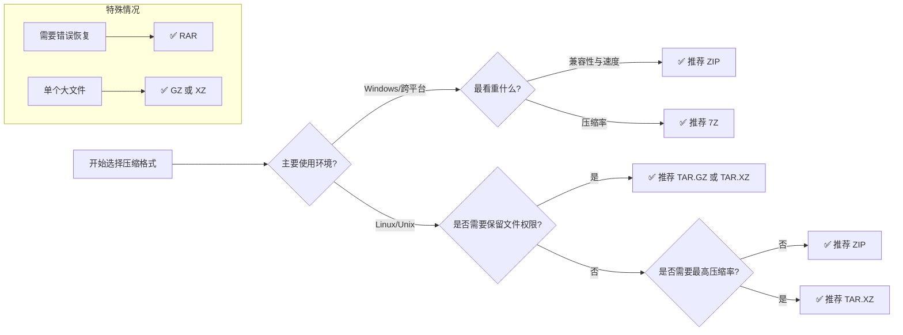

---
aliases:
  - course of study
  - course
tags:
  - tutorial
  - computer-science
category: knowledge
datetime: " 2026-08-14 20:08:44 周五"
author: wephiles
rating: "0"
---
<h1 style="text-align: center;">compress</h1>

使用建议：

1. **`ZIP` 格式**：最通用，`Windows/Mac/Linux` 都能用
2. **`TAR.GZ` 格式**：`Linux/Unix` 系统常用，压缩率高
3. **`GZ` 格式**：只适合单个文件压缩
4. **`7Z` 格式**：压缩率最高，但需要安装第三方库
5. **统一工具类**：推荐使用，自动识别格式，使用简单

# 1. 压缩 

## 1.1 `.gz` 文件

### 1.1.1 压缩

#### 1.1.1.1 使用 `gzip` 模块

```python
import shutil
import gzip


def compress():
    """将文件压缩成 .gz 文件"""
    with open('origin_data.txt', 'rb') as fp:
        with gzip.open('origin_data.txt.gz', 'wb') as f_out:
            shutil.copyfileobj(fp, f_out)
    print('文件已成功压缩！')


compress()
```

#### 1.1.1.2 直接读取和写入

```python
import gzip


with open("./origin_data.txt", "rb") as fp:
    data = fp.read()

with gzip.open("origin_data.txt.gz", "wb") as fp:
    fp.write(data)


print("文件已压缩成功!")
```

## 1.2 `.zip` 文件

```python
import os
import zipfile


def compress_to_zip(origin_files: list, compressed_file: str):
    """创建 zip 压缩文件。

    Args:
        origin_files ():
        compressed_file ():

    Returns:

    """
    with zipfile.ZipFile(compressed_file, 'w', zipfile.ZIP_DEFLATED) as zf:
        for file in origin_files:
            if os.path.exists(file):
                # 只添加文件名 不包含路径
                zf.write(file, os.path.basename(file))
            print('压缩完成:', file)


if __name__ == '__main__':
    file_list = [
        'data/data_1.txt',
        'data/data_2.txt',
        'data/data_3.txt',
    ]

    compress_to_zip(file_list, './output/compress_zip.zip')
```

## 1.3 `tar.gz` 格式压缩(`Linux` 常用)

```python
import tarfile


def compress_to_tar(origin_files: list, compressed_file: str):
    """创建 tar.gz 压缩文件。

    Args:
        origin_files ():
        compressed_file ():

    Returns:

    """
    with tarfile.open(compressed_file, 'w:gz') as tar:
        for file in origin_files:
            if os.path.exists(file):
                # 只添加文件名 不包含路径
                tar.add(file, arcname=os.path.basename(file))
            print('压缩完成:', file)
```

# 2. 解压

## 2.1 解压 `.gz` 文件

```python
import gzip
import shutil

with gzip.open('origin_data.txt.gz', 'rb') as fp:
    with open('unzip_data.txt', 'wb') as fp_out:
        shutil.copyfileobj(fp, fp_out)
```

# 3. 统一压缩工具类

```python
import zipfile
import tarfile
import gzip
import shutil
import os
from pathlib import Path

class CompressionTool:
    """支持多种格式的压缩解压工具"""
    
    @staticmethod
    def compress(file_list, output_file):
        """
        自动识别格式并压缩文件
        支持: .zip, .tar.gz, .tar.bz2, .gz, .7z
        """
        file_list = [Path(f) for f in file_list]
        output_file = Path(output_file)
        
        # 根据文件扩展名选择压缩方式
        output_name = str(output_file).lower()
        
        if output_name.endswith('.zip'):
            CompressionTool._create_zip(file_list, output_file)
        elif output_name.endswith('.tar.gz') or output_name.endswith('.tgz'):
            CompressionTool._create_tar(file_list, output_file, 'w:gz')
        elif output_name.endswith('.tar.bz2'):
            CompressionTool._create_tar(file_list, output_file, 'w:bz2')
        elif output_name.endswith('.tar'):
            CompressionTool._create_tar(file_list, output_file, 'w')
        elif output_name.endswith('.gz'):
            # gz只能压缩单个文件
            if len(file_list) > 1:
                raise ValueError("GZ格式只能压缩单个文件")
            CompressionTool._create_gz(file_list[0], output_file)
        elif output_name.endswith('.7z'):
            CompressionTool._create_7z(file_list, output_file)
        else:
            raise ValueError(f"不支持的文件格式: {output_file}")
    
    @staticmethod
    def decompress(input_file, output_dir='./extracted'):
        """自动识别格式并解压文件"""
        input_file = Path(input_file)
        output_dir = Path(output_dir)
        output_dir.mkdir(parents=True, exist_ok=True)
        
        input_name = str(input_file).lower()
        
        if input_name.endswith('.zip'):
            with zipfile.ZipFile(input_file, 'r') as zipf:
                zipf.extractall(output_dir)
        elif input_name.endswith('.tar.gz') or input_name.endswith('.tgz'):
            with tarfile.open(input_file, 'r:gz') as tar:
                tar.extractall(output_dir)
        elif input_name.endswith('.tar.bz2'):
            with tarfile.open(input_file, 'r:bz2') as tar:
                tar.extractall(output_dir)
        elif input_name.endswith('.tar'):
            with tarfile.open(input_file, 'r') as tar:
                tar.extractall(output_dir)
        elif input_name.endswith('.gz'):
            output_path = output_dir / input_file.stem
            with gzip.open(input_file, 'rb') as f_in:
                with open(output_path, 'wb') as f_out:
                    shutil.copyfileobj(f_in, f_out)
        elif input_name.endswith('.7z'):
            try:
                import py7zr
                with py7zr.SevenZipFile(input_file, 'r') as archive:
                    archive.extractall(output_dir)
            except ImportError:
                raise ImportError("需要安装 py7zr: pip install py7zr")
        else:
            raise ValueError(f"不支持的文件格式: {input_file}")
        
        print(f"解压完成: {input_file} -> {output_dir}")
    
    # 内部方法
    @staticmethod
    def _create_zip(file_list, output_file):
        with zipfile.ZipFile(output_file, 'w', zipfile.ZIP_DEFLATED) as zipf:
            for file_path in file_list:
                if file_path.exists():
                    zipf.write(file_path, file_path.name)
        print(f"压缩完成: {output_file}")
    
    @staticmethod
    def _create_tar(file_list, output_file, mode):
        with tarfile.open(output_file, mode) as tar:
            for file_path in file_list:
                if file_path.exists():
                    tar.add(file_path, arcname=file_path.name)
        print(f"压缩完成: {output_file}")
    
    @staticmethod
    def _create_gz(file_path, output_file):
        with open(file_path, 'rb') as f_in:
            with gzip.open(output_file, 'wb') as f_out:
                shutil.copyfileobj(f_in, f_out)
        print(f"压缩完成: {output_file}")
    
    @staticmethod
    def _create_7z(file_list, output_file):
        try:
            import py7zr
            with py7zr.SevenZipFile(output_file, 'w') as archive:
                for file_path in file_list:
                    if file_path.exists():
                        archive.write(file_path, arcname=file_path.name)
            print(f"压缩完成: {output_file}")
        except ImportError:
            raise ImportError("需要安装 py7zr: pip install py7zr")

# 使用示例
tool = CompressionTool()

# 压缩成ZIP
tool.compress(['file1.txt', 'file2.txt'], 'output.zip')

# 压缩成TAR.GZ
tool.compress(['file1.txt', 'file2.txt'], 'output.tar.gz')

# 压缩成7Z
tool.compress(['file1.txt', 'file2.txt'], 'output.7z')

# 解压（自动识别格式）
tool.decompress('output.zip', './extracted_zip')
tool.decompress('output.tar.gz', './extracted_tar')
tool.decompress('output.7z', './extracted_7z')
```

# 4. 相关概念

各种压缩包格式在设计初衷、压缩效率、兼容性和功能特性上各有侧重。选择哪种，取决于你的**数据类型、存储/传输需求、目标平台和是否需要长期归档**。下面用一张对比表先给你一个全局观，再逐个解释如何选择。


## 4.1 主流压缩格式对比

| 格式               | 压缩率                    | 压缩/解压速度               | 跨平台兼容性                 | 主要特性                             | 典型适用场景                                   |
| :----------------- | :------------------------ | :-------------------------- | :--------------------------- | :----------------------------------- | :--------------------------------------------- |
| **`ZIP`**          | 中等 (60-70%)             | **快** (压缩/解压)          | **极佳** (所有系统原生支持)  | 随机访问、流式解压、基本加密         | 通用文件分发、邮件附件、跨平台共享             |
| **`TAR.GZ / TGZ`** | 高 (优于`ZIP`)            | 快 (压缩) / 很快 (解压)     | 好 (Unix原生，Windows需工具) | **保留Unix权限/所有权**、流式归档    | Linux软件源码包、系统备份、脚本分发            |
| **`TAR.BZ2`**      | 很高 (高于`GZ`)           | 中等 (压缩) / 快 (解压)     | 好 (Unix原生)                | 比 GZ 更高压缩率，多线程支持         | 文本、源码归档、平衡速度与压缩率               |
| **`TAR.XZ`**       | **极高** (接近`7Z`)       | **慢** (压缩) / 中等 (解压) | 好 (现代Linux)               | `LZMA/LZMA2` 算法，高压缩率          | Linux软件包、高压缩比归档                      |
| **`7Z`**           | **极高** (30-50% 优于ZIP) | **慢** (压缩) / 中等 (解压) | 中 (Windows原生，其他需工具) | 强加密、错误检测、高压缩率、多卷支持 | 长期备份、高压缩需求、Windows环境归档          |
| **`RAR`**          | **极高** (与`7Z`相当)     | 中等                        | 差 (需`WinRAR`等工具)        | **错误恢复记录**、多卷、强加密       | 专业归档、分卷存储、需要修复损坏数据           |
| **`GZ`**           | 高 (70-80%)               | **极快** (压缩/解压)        | 极佳                         | 单文件压缩、流式处理、低内存占用     | Web服务器压缩、单个大文件压缩 (如日志、数据库) |
| **`BZ2`**          | 很高 (60-75%)             | 中等 (压缩) / 快 (解压)     | 好                           | 比 `GZ` 更高压缩率，多线程支持       | 替代 `GZ` 用于文本、源码压缩，追求更高压缩率   |

### 4.1.1 `ZIP`

- **特点**：压缩和解压速度最快，所有操作系统原生支持，无需额外软件。每个文件独立压缩，支持随机访问（可不解压整个包直接读取单个文件）。
- **权衡**：压缩率不如现代格式，对Unix文件权限、所有权等元数据保留不如TAR完善。
- **何时用**：
  - **需要跨平台共享**（特别是发给不确定工具的人）。
  - **文件需要随机访问**（如作为文档、模板的容器）。
  - **快速临时打包**，追求便捷性。

### 4.1.2 `TAR.GZ` / `TAR.XZ`：`Unix/Linux` 的标准

- **TAR** 本身只是归档（打包）工具，不压缩。常与 `gzip`、`xz` 等压缩工具组合使用。
- **特点**：
  - **完美保留Unix文件权限、所有权、符号链接等元数据**，是Linux/Unix系统备份和软件分发的标准格式builtin.com+1。
  - 将所有文件视为一个整体进行压缩，能利用文件间的相似性实现更好的压缩率brendanlong.com。
- **权衡**：在Windows上需要额外工具（如7-Zip）。作为整体压缩，不支持直接随机访问单个文件，必须解压整个归档或顺序读取brendanlong.com。
- **何时用**：
  - **Linux/Unix系统备份**、源码分发。
  - 需要保留文件属性。
  - 在Unix环境下，追求更高压缩率且不介意顺序解压。

### 4.1.3 `7Z`

- **特点**：采用`LZMA/LZMA2`等算法，提供极高的压缩率，支持强加密和错误检测。在Windows上原生支持，其他平台需安装`7-Zip`。
- **权衡**：压缩和解压速度较慢，CPU和内存占用高。
- **何时用**：
  - **长期备份归档**，存储空间紧张。
  - 压缩大型文件集合（如项目备份、虚拟机镜像）。
  - 需要高压缩率且不介意处理时间。

### 4.1.4 `RAR`

- **特点**：私有格式，通常需`WinRAR`。提供**恢复记录**功能，能在包部分损坏时尝试修复，这是其核心优势。支持多卷压缩。
- **权衡**：压缩和解压工具非开源免费，创建归档需付费软件。
- **何时用**：
  - **重要数据的专业归档**，需要数据恢复能力。
  - 需要分卷存储（如刻录光盘）。
  - 习惯在Windows环境下使用`WinRAR`。

### 4.1.5 `GZ / BZ2 / XZ`：单文件压缩工具

这些是纯压缩算法，通常与`TAR`配合，或单独用于单个大文件。

- **`GZ`**：速度与压缩率平衡，广泛用于`Web`内容压缩（`HTTP gzip`）和Unix系统日志压缩。
- **`BZ2`**：比`GZ`提供更高的压缩率，速度稍慢，适合文本文件。
- **`XZ`**：基于`LZMA`，提供极高的压缩率，但压缩速度慢，解压速度中等，正成为Linux软件包的新标准。
- **何时用**：
  - **`GZ`**：快速压缩单个大文件，或用于Web传输。
  - **`BZ2`**：对单个文件追求比`GZ`更高的压缩率。
  - **`XZ`**：对单个文件追求最高压缩比，且不介意较长的压缩时间。

# 5. 如何选择



# 6. `TAR` 工具

`tar` 是 Unix/Linux 系统中最经典、最基础的**归档工具**。它的名字来源于 **T**ape **Ar**chive（磁带归档），最初设计用于将文件备份到磁带上。尽管现代有了 zip 等工具，但 `tar` 依然是 Linux 系统分发包、源码分发、数据备份的首选格式。

## 6.1 核心作用 -- 打包 VS. 压缩

理解 `tar` 的关键在于区分两个概念：

1. **打包**：把多个文件变成一个文件。就像把散落的衣服放进一个箱子。`tar` 只做这件事。
2. **压缩**：把箱子里的空气抽走，让体积变小。这需要 `gzip` 或 `bzip2` 等工具配合。

**<u>TAR 的独特优势：</u>**

- **保留元数据**：`tar` 能完美保留 Linux 文件的权限、所有者、时间戳、符号链接等属性。`zip` 在这方面经常丢失权限信息。
- **完整文件系统镜像**：常用于备份整个系统。

## 6.2 基础语法

```bash
tar [选项] [归档文件名] [要打包的文件或目录...]
```

## 6.3 最常用选项

`tar` 的选项非常有特色，历史悠久，以前不需要加 `-`，现在加不加都可以。

| 选项                    | 含义          | 说明                                              |
| :---------------------- | :------------ | :------------------------------------------------ |
| **操作模式** (必选一个) |               |                                                   |
| `-c`                    | **Create**    | 创建新的归档文件（打包）。                        |
| `-x`                    | **Extract**   | 从归档文件中提取文件（解包）。                    |
| `-t`                    | **List**      | 列出归档文件中的内容列表。                        |
| **压缩算法** (可选)     |               |                                                   |
| `-z`                    | **Gzip**      | 使用 gzip 压缩/解压（最常用，生成 `.tar.gz`）。   |
| `-j`                    | **Bzip2**     | 使用 bzip2 压缩/解压（生成 `.tar.bz2`）。         |
| `-J`                    | **xz**        | 使用 xz 压缩/解压（生成 `.tar.xz`，压缩率最高）。 |
| **辅助选项**            |               |                                                   |
| `-v`                    | **Verbose**   | 显示处理过程（让你看到它在干嘛）。                |
| `-f`                    | **File**      | 指定归档文件名（**必加**，且通常放在最后）。      |
| `-C`                    | **Directory** | 解压时指定目标目录。                              |

## 6.4 示例

### 6.4.1 打包与压缩（创建文件）

这是最常用的操作，通常组合为 `czvf`。

- **命令**：`tar -czvf archive.tar.gz /path/to/directory`
- **解读**：
  - `c`：创建
  - `z`：调用 `gzip` 压缩
  - `v`：显示过程
  - `f`：后面跟文件名
- **结果**：生成 `archive.tar.gz` 文件。

### 6.4.2 打包并用 `bzip2` 压缩

- **命令**：`tar -cjvf archive.tar.bz2 /path/to/directory`
- **区别**：使用 `j` 选项，压缩率更高但速度更慢。

### 6.4.3 打包并用 `xz` 压缩

- **命令**：`tar -cJvf archive.tar.xz /path/to/directory`
- **区别**：使用 `J` 选项，压缩率最高，耗时最长。

### 6.4.4 解压与还原

1. **解压 `.tar.gz` / `.tar.bz2` / `.tar.xz`**
   - **命令**：`tar -xvf archive.tar.gz`
   - **解读**：
     - `x`：提取
     - `v`：显示过程
     - `f`：指定文件
   - **注意**：现代版本的 `tar` 能自动识别 `gzip/bzip2/xz` 格式，所以解压时通常不需要加 `-z` 或 `-j`，直接用 `-xvf` 即可。
2. **解压到指定目录**
   - **命令**：`tar -xvf archive.tar.gz -C /path/to/target_dir`
   - **关键**：`-C` 选项，如果不加，默认解压到当前目录。

### 6.4.5 查看内容（不解压）

在解压前查看包内有哪些文件，防止“tar 炸弹”（解压出成千上万个文件弄乱当前目录）。

- **命令**：`tar -tvf archive.tar.gz`
- **解读**：`t` 表示 list，列出文件列表。
