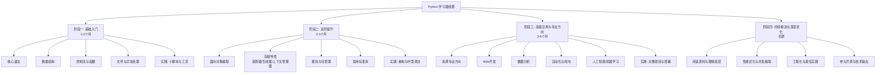
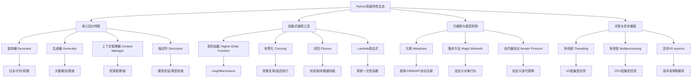

# 1. 完整路径：



# 2. 分阶段详解与操作步骤

## 2.1 阶段一：基础入门（1~2月）

**目标**：掌握  Python 核心语法，能编写简单脚本，理解编程思维。

1. **核心语法与数据结构**
    - **变量与数据类型**：深入理解整数、浮点数、字符串、布尔值。**务必区分可变与不可变类型**（如 `list` vs `tuple`），这是理解 Python 内存模型的基础。
    - **运算符与表达式**：掌握算术、比较、逻辑、赋值运算符。
    - **数据结构**：这是 `Python` 的精华。**熟练掌握列表、字典、集合、元组**的创建、访问、增删改查及常用方法（如 `append`, `pop`, `keys`, `items`, `update`）。
    - **控制流**：熟练运用 `if-elif-else` 条件语句和 `for`、`while` 循环。理解 `break`、`continue`。
    - **函数**：学会定义函数、参数传递（位置参数、关键字参数、默认参数、可变参数 `*args`、`**kwargs`）、返回值、作用域（`LEGB` 规则）。

2. **文件操作与异常处理** 
    - **文件操作**：使用 `open()` 函数读写文本文件、`CSV` 文件。**务必使用 `with` 语句**管理资源，确保文件正确关闭。
    - **异常处理**：理解 `try-except-finally-else` 机制。**避免裸 `except:`**，应捕获具体异常（如 `ValueError`, `FileNotFoundError`）。
      👉[[Beginner#1. `try-except-finally-else` 机制|异常处理机制]] 和 [[Beginner#2. `raise ... from ...`|raise from 基础]] 如果链接失效 点击这里: [👉异常处理机制](../Python/basics/Beginner.md#1. `try-except-finally-else` 机制) 和 [👉raise ... from ...](../Python/basics/Beginner.md#2. `raise ... from ...`)
    
3. **实践任务**
    - 编写一个**计算器**程序，支持四则运算。
    - 实现一个**猜数字游戏**。
    - 编写脚本，**批量重命名**指定目录下的文件。
    - 练习使用 `os`、`sys`、`datetime`、`json` 等标准库模块。

4. 📖 基础阶段推荐资源
- **书籍**：`《Python编程：从入门到实践》(Eric Matthes) `- 适合零基础，实战项目丰富。
- **在线课程**：[`Codecademy Python`](https://www.codecademy.com/learn/learn-python-3) 或 [`W3Schools Python`](https://www.w3schools.com/python/) - 交互式学习，适合语法入门。
- **视频教程**：B站搜索“Python从零开始”，选择播放量高、更新近的系列。
- **练习**：[`LeetCode`](https://leetcode.cn/) 简单题或 [`Codewars`](https://www.codewars.com/) 。

## 2.2 阶段二：进阶提升（2~3个月）

**目标**：写出 `Pythonic` 的代码，理解面向对象，掌握高级特性，能开发结构化程序。

1. **面向对象编程 (`OOP`)**
	- **类与对象**：理解类是模板，对象是实例。掌握 `__init__` 初始化方法。
	- **三大特性**：
		- **封装**：使用私有属性（`_name`）和 `@property` 装饰器控制访问。
		- **继承**：复用代码，理解方法重写。
        - **多态**：不同对象调用同一方法，产生不同行为。
	- **魔法方法**：理解并重写 `__str__`, `__len__`, `__eq__` 等，让自定义类像内置类型一样工作。
	
2. **Python 高级特性（通往 `Pythonic` 的关键）**
	- **列表推导式与生成器表达式**：用一行代码简洁地创建列表，生成器表达式节省内存。[[LearningPath#^listgenerate|👉列表推导式和生成器表达式]]
	* **装饰器**：**这是 Python 的精髓之一**。理解其本质是函数嵌套和闭包。用于日志、性能测试、权限校验、缓存等。[[LearningPath#^decorator|👉装饰器]]
	* **生成器**：使用 `yield` 关键字。理解其“惰性计算”特性，处理大数据流时节省内存。  
	* **上下文管理器**：理解 `with` 语句背后的 `__enter__` 和 `__exit__` 协议。用于管理资源（文件、网络连接、锁）。

3. **模块化与工程化**
    - **模块与包**：学会将代码组织成模块（`.py` 文件）和包（包含 `__init__.py` 的目录）。理解 `import` 机制。
    - **虚拟环境**：**必须掌握**。使用 `venv` 或 `conda` 为每个项目创建独立的依赖环境，避免版本冲突。[[LearningPath#^venv|虚拟环境]]
	* **依赖管理**：使用 `pip` 安装第三方库。理解并使用 `requirements.txt` 或 `Pipfile` 记录项目依赖。

4. **常用标准库**
    - `os` / `pathlib`：与操作系统交互，路径操作（推荐使用更面向对象的 `pathlib`）。
    - `sys`：访问 Python 解释器变量和函数。
    - `datetime`：处理日期和时间。
    - `json`：处理 `JSON` 数据格式。
    - `re`：正则表达式，用于复杂文本匹配和提取。
    - `collections`：`namedtuple`, `defaultdict`, `Counter` 等扩展数据类型。
    - `itertools`：高效迭代器函数。
    - `functools`：`lru_cache`（缓存）、`partial`（偏函数）等高阶函数工具。

5. **实践任务**
    - 用 OOP 思想重构阶段一的程序（如设计一个“银行账户”类）。
    - 编写一个**命令行工具**（如待办事项管理、文件搜索工具），使用 `argparse` 或 `click` 库解析参数。
    - 实现一个简单的**爬虫**，使用 `requests` 获取网页，`BeautifulSoup` 解析数据。
    - 尝试为你的函数编写**单元测试**，使用 `unittest` 或 `pytest` 框架。

- 6 📖 进阶阶段推荐资源
	- **书籍**：
		- `《流畅的Python》(Luciano Ramalho)` - **进阶必读**，深入讲解 Python 特性和最佳实践。
		- `《Effective Python》`- 59 条具体实践建议。
	- **文档**：[Python 官方文档](https://docs.python.org/3/) - **最权威的学习资源**，尤其是语言参考和库参考。
	- **练习**：[LeetCode](https://leetcode.cn/) 中等难度题，开始关注算法复杂度。

## 2.3 阶段三：高级应用与专业方向（3~6个月）

**目标**：在某一领域深入，掌握该领域的框架和工具链，能开发完整项目。

1. **选择专业方向**  

[[LearningPath#^table|选择专业方向]]

2. **深入框架与工具链**
    - 不要只停留在“会用”`API`，要**理解框架的设计理念和核心机制**。例如：
        - `Django` 的 `ORM` 如何将对象映射到数据库？
        - `Flask` 的请求上下文和应用上下文是如何工作的？
        - `Pandas` 的 `DataFrame` 底层是如何实现向量化运算的？
    - 掌握该领域的**周边工具**，如：
        - Web开发：数据库(`PostgreSQL/MySQL`)、`Redis`、`Celery`(异步任务)、`Docker`(部署)。
        - 数据分析：`Jupyter Notebook`、`SQL`、大数据处理工具(`Spark`)。
        - 爬虫：代理IP池、验证码识别、分布式爬虫。

3. **项目实战与工程化**
    - **项目驱动**：从零开始构思、设计、开发、部署一个完整项目。这是检验和提升综合能力的最佳方式pingcode.com。
    - **工程化实践**：
        - **版本控制**：**必须熟练使用 `Git`**。学会分支管理、Pull Request、代码审查。
        - **代码质量**：遵循 `PEP8` 规范，使用 `flake8`、`black` 等工具检查和格式化代码。
        - **测试**：编写单元测试和集成测试，追求较高的测试覆盖率。
        - **部署**：学习使用 `Docker` 容器化应用，了解 `Nginx`、`Gunicorn/Uvicorn` 等 `WSGI/ASGI` 服务器。

4. 📖 高级阶段推荐资源
	- **书籍**：
	    - Web开发：`《Two Scoops of Django》`(最佳实践)、`《Flask Web开发实战》`。
	    - 数据分析：`《利用Python进行数据分析》(Wes McKinney，Pandas作者)`。
	    - 机器学习：`《Hands-On Machine Learning with Scikit-Learn, Keras, and TensorFlow》(Aurélien Géron)`。
	- **社区**：关注 `PyCon`、`PyData` 等会议演讲，参与 `GitHub` 开源项目。

## 2.4 阶段四：持续精进与深度优化

**目标**：理解 Python 底层原理，掌握性能优化，参与开源，形成技术影响力。

1. **阅读源码与理解底层**
    - **从标准库开始**：阅读 `os`, `sys`, `collections`, `json` 等模块的源码，理解其实现原理php.cn+1。
    - **深入 `CPython`**：**这是区分高级工程师的关键**。阅读 Python 解释器的 C 语言源码（如 `ceval.c` 字节码执行循环、`object.c` 对象模型），理解：
        - **`GIL`（全局解释器锁）**：其对多线程的影响，以及如何用多进程规避。
        - **内存管理**：引用计数、分代垃圾回收、内存池机制。
        - **对象模型**：`PyObject` 是所有对象的基石，理解类型对象（`PyTypeObject`）。
    - **阅读优秀开源项目源码**：如 `requests`, `Flask`, `Django` 的核心部分。学习其架构设计、代码组织和技巧。可使用 `Sourcetrail` 等工具辅助理解。

2. **性能优化与并发编程**
    - **性能分析**：熟练使用 `cProfile`、`line_profiler` 定位代码瓶颈。
    - **优化技巧**：
        - 使用内置函数和库（通常用 C 实现）。
        - 算法与数据结构优化（时间复杂度）。
        - 循环优化：避免在循环中做重复计算。
        - 使用生成器处理大数据。
        - **向量化运算**：用 `NumPy/Pandas` 替代纯 Python 循环，性能可提升数十倍。
    - **并发编程**：
        - **多线程**：适用于 I/O 密集型任务（网络请求、文件读写）。受 GIL 限制。
        - **多进程**：适用于 CPU 密集型任务。使用 `multiprocessing` 模块，每个进程有独立的 GIL。
        - **异步编程**：使用 `asyncio` 和 `async/await` 语法。适用于高并发 I/O 场景（如 Web 服务器、爬虫）。理解事件循环。
        - **协程**：理解生成器如何演变为协程。

3. **工程化与最佳实践**
    - **类型提示**：全面采用 `Type Hints`，使用 `mypy` 进行静态类型检查，提升代码健壮性和可维护性。
    - **日志**：使用 `logging` 模块替代 `print`，配置合理的日志级别和输出格式。
    - **配置管理**：使用环境变量或配置文件管理敏感信息和环境配置。
    - **CI/CD**：了解持续集成/持续部署，使用 `GitHub Actions`、`GitLab CI` 等工具自动化测试和部署流程。

4. **参与开源与技术输出**
    - **参与开源**：从修复文档错别字、解决“Good First Issue”开始，逐步提交 `Pull Request`。这是接触世界级代码库和协作流程的最好方式。
    - **技术输出**：坚持写技术博客，总结所学。尝试在 Meetup 或线上分享。**“费曼学习法”**：能用简单语言把一个技术点讲清楚，才是真正掌握了。

📖 精通阶段推荐资源
- **书籍**：《Python源码剖析》(陈孺) - 虽然基于 Python 2，但思想仍值得参考。`《Python Cookbook》(David Beazley)` - 高级技巧和解决方案。
- **源码**：[CPython GitHub 仓库](https://github.com/python/cpython) 。
- **PEP**：Python 增强提案，了解语言发展动向和设计决策。

# 3. Python 高级特性

全景图示：



## 3.1 ⚙️核心四大特性

这四大特性是 Python 高级编程的基石，能解决绝大多数工程问题。

### 1. 装饰器

**本质**：接收函数（或类）作为参数并返回新函数（或类）的高阶函数，用于在不修改原代码的前提下增强其功能。

**原理与示例**：

```python
def my_decorator(func):
    def wrapper(*args, **kwargs):
        print("函数执行前")  # 增强功能
        result = func(*args, **kwargs)
        print("函数执行后")  # 增强功能
        return result
    return wrapper

@my_decorator  # 语法糖，等价于 say_hello = my_decorator(say_hello)
def say_hello(name):
    print(f"Hello, {name}!")

say_hello("Alice")
# 输出:
# 函数执行前
# Hello, Alice!
# 函数执行后
```

**进阶用法**：

- **带参数的装饰器**：需要三层嵌套，用于配置装饰器行为。
- **类装饰器**：通过 `__call__` 方法实现，适合需要维护状态的场景。
- **保留元信息**：使用 `functools.wraps` 装饰器保留原函数的 `__name__`, `__doc__` 等属性。

**适用场景**：日志记录、性能测试、权限校验、缓存、输入验证等横切关注点。

📖 深入：带参数的装饰器示例

```
from functools import wraps

def repeat(num_times): # 装饰器工厂，接收参数
    def decorator_repeat(func): # 真正的装饰器
        @wraps(func)
        def wrapper(*args, **kwargs):
            for _ in range(num_times):
                result = func(*args, **kwargs)
            return result
        return wrapper
    return decorator_repeat

@repeat(num_times=3) # 先调用 repeat(3) 返回 decorator_repeat，再用它装饰 greet
def greet(name):
    print(f"Hello {name}")

greet("World") # 会打印 3 次 Hello World
```

### 2. 生成器

**本质**：一种**惰性计算**的迭代器，使用 `yield` 关键字暂停函数执行并产出值，避免一次性加载大数据集到内存。

**原理与示例**：

```
def fibonacci_generator(n):
    a, b = 0, 1
    for _ in range(n):
        yield a     # 产出值，暂停
        a, b = b, a + b

# 使用生成器
for num in fibonacci_generator(10):
    print(num, end=" ")  # 0 1 1 2 3 5 8 13 21 34
```

**生成器表达式**：类似于列表推导式，但使用圆括号，返回生成器对象，节省内存。

```
squares_list = [x**2 for x in range(1000000)]  # 占用大量内存
squares_gen = (x**2 for x in range(1000000))   # 几乎不占内存，按需计算
```

**适用场景**：处理大文件、无限序列、数据流管道、协程基础。

### 3. 上下文管理器

**本质**：用于管理资源（如文件、数据库连接、锁）的生命周期，确保资源在使用后正确释放，即使发生异常。

**原理与示例**：通过 `with` 语句触发，对象需实现 `__enter__` 和 `__exit__` 方法。

```
class ManagedFile:
    def __init__(self, filename):
        self.filename = filename

    def __enter__(self):
        self.file = open(self.filename, 'w')
        print(f"打开文件: {self.filename}")
        return self.file  # 返回值赋给 as 后的变量

    def __exit__(self, exc_type, exc_val, exc_tb):
        if self.file:
            self.file.close()
        print(f"关闭文件: {self.filename}")
        # 返回 True 会抑制异常，否则异常会继续传播
        return False

# 使用
with ManagedFile('hello.txt') as f:
    f.write('Hello, World!')
    # 即使这里发生异常，__exit__ 也会被调用，文件会被关闭
```

**简化方式**：使用 `contextlib.contextmanager` 装饰器和 `yield` 语句快速定义。

```
from contextlib import contextmanager

@contextmanager
def managed_file(filename):
    f = open(filename, 'w')
    try:
        yield f  # __enter__ 返回 f
    finally:
        f.close()  # __exit__ 中的清理逻辑

with managed_file('hello.txt') as f:
    f.write('Hello, World!')
```

**适用场景**：文件操作、数据库连接、线程锁、网络连接等需要清理的资源管理。

### 4. 描述符

**本质**：实现了 `__get__`、`__set__`、`__delete__` 中任意一个方法的类，用于**自定义类属性的访问行为**，是 `@property` 的底层实现机制。

**原理与示例**：

```
class Validator:
    def __init__(self, min_value, max_value):
        self.min_value = min_value
        self.max_value = max_value

    def __set_name__(self, owner, name):
        self.name = name  # 记录属性名

    def __get__(self, instance, owner):
        return instance.__dict__.get(self.name)  # 从实例字典获取

    def __set__(self, instance, value):
        if not (self.min_value <= value <= self.max_value):
            raise ValueError(f"{self.name} 必须在 {self.min_value} 和 {self.max_value} 之间")
        instance.__dict__[self.name] = value  # 存入实例字典

class Student:
    age = Validator(10, 25)  # 类属性是描述符实例
    score = Validator(0, 100)

    def __init__(self, name, age, score):
        self.name = name
        self.age = age      # 触发 __set__
        self.score = score  # 触发 __set__

s = Student("Alice", 20, 95)
print(s.age)   # 触发 __get__
# s.age = 30  # 会触发 ValueError
```

**适用场景**：类型检查、数据验证、延迟加载、只读属性、实现 ORM 字段等csdn.net+1。`@property` 本质上就是数据描述符的一种便捷封装。

## 3.2 🧩函数式编程特性

Python 支持函数式编程范式，其核心是函数是一等公民。

### 1. 高阶函数

接受函数作为参数或返回函数的函数。

- **`map(func, *iterables)`**：对可迭代对象每个元素应用函数，返回迭代器。
- **`filter(func, iterable)`**：过滤出使函数返回 True 的元素。
- **`reduce(func, iterable[, initial])`**：对元素进行累积操作（需 `from functools import reduce`）。

```
from functools import reduce

numbers = [1, 2, 3, 4, 5]
# map
squared = list(map(lambda x: x**2, numbers))  # [1, 4, 9, 16, 25]
# filter
evens = list(filter(lambda x: x % 2 == 0, numbers))  # [2, 4]
# reduce
product = reduce(lambda x, y: x * y, numbers)  # 120
```

### 2. 闭包

**本质**：嵌套函数，内部函数捕获了外部函数的局部变量（自由变量），形成了一个封闭的“包裹”，即使外部函数已执行完毕，内部函数仍能访问这些变量。

```
def make_multiplier(factor):
    def multiply(number):
        return number * factor  # factor 是自由变量
    return multiply

times3 = make_multiplier(3)
times5 = make_multiplier(5)
print(times3(6))  # 18
print(times5(6))  # 30
```

**适用场景**：装饰器的基础、延迟计算、状态保持（如计数器）、回调函数。

### 3. 柯里化

将接受多个参数的函数转换为一系列接受单个参数的函数链的过程。

```
def add(x, y, z):
    return x + y + z

# 柯里化后
def curried_add(x):
    def add_y(y):
        def add_z(z):
            return x + y + z
        return add_z
    return add_y

# 或使用 functools.partial 简单实现部分应用
from functools import partial
add_5 = partial(add, 5)  # 固定第一个参数为 5
print(add_5(10, 20))  # 35

# 严格柯里化调用
print(curried_add(1)(2)(3))  # 6
```

**适用场景**：函数复用、参数延迟绑定、创建配置化函数。Python 中常用 `functools.partial` 实现简单的部分参数应用。

### 4. Lambda 表达式

创建匿名函数的简洁方式，适用于定义简短的、一次性的函数。

```
# 通常与高阶函数配合使用
points = [(1, 2), (3, 1), (4, 4)]
points_sorted = sorted(points, key=lambda p: p[1])  # 按第二个元素排序
```

## 3.3 🔧元编程与底层机制

这些特性允许你在运行时操作代码本身。

### 1. 元类

“类的类”，用于控制类的创建行为。元类的实例是类。

```
class Meta(type):
    def __new__(cls, name, bases, dct):
        # 可以在类创建时修改其属性字典
        if 'class_id' not in dct:
            dct['class_id'] = name.lower()  # 自动添加 class_id 属性
        return super().__new__(cls, name, bases, dct)

class MyClass(metaclass=Meta):
    pass

print(MyClass.class_id)  # 'myclass'
```

**适用场景**：API 自动注册（如 Django Admin）、ORM 实现、插件系统、强制编码规范qq.com。绝大多数情况下，使用普通的类装饰器或 `__init_subclass__` 即可，元类是最后的手段。

### 2. 魔术方法

以双下划线开头和结尾的方法（如 `__init__`, `__str__`, `__len__`），定义了对象的语言级行为，使其能像内置类型一样工作。

```
class Vector:
    def __init__(self, x, y):
        self.x = x
        self.y = y

    def __add__(self, other):  # 重载 + 运算符
        return Vector(self.x + other.x, self.y + other.y)

    def __repr__(self):       # 重载打印行为
        return f"Vector({self.x}, {self.y})"

v1 = Vector(2, 4)
v2 = Vector(1, -1)
print(v1 + v2)  # Vector(3, 3)
```

### 3. 迭代器协议

实现 `__iter__()` 和 `__next__()` 方法，使自定义对象可迭代。

```
class Countdown:
    def __init__(self, start):
        self.start = start

    def __iter__(self):
        return self  # 迭代器对象本身就是可迭代的

    def __next__(self):
        if self.start <= 0:
            raise StopIteration  # 结束迭代
        self.start -= 1
        return self.start + 1

for num in Countdown(5):
    print(num, end=" ")  # 5 4 3 2 1
```

## 3.4 🚀并发与异步编程

Python 提供了多种并发模型，适用于不同场景。

| 模型         | 模块                | 适用场景                 | 特点                                        |
| ---------- | ----------------- | -------------------- | ----------------------------------------- |
| **多线程**    | `threading`       | I/O 密集型任务（网络请求、文件读写） | 受 GIL 限制，无法并行执行 Python 字节码，但 I/O 时会释放 GIL |
| **多进程**    | `multiprocessing` | CPU 密集型任务（计算、图像处理）   | 绕过 GIL，真正并行，每个进程有独立 GIL 和内存空间             |
| **异步 I/O** | `asyncio`         | 高并发 I/O（Web 服务器、爬虫）  | 单线程，协程协作式调度，极大提高 I/O 密集型任务的并发效率           |

**异步编程示例**：

```
import asyncio

async def fetch_data(url):
    print(f"开始获取 {url}")
    await asyncio.sleep(2)  # 模拟 I/O 操作
    print(f"完成获取 {url}")
    return f"数据来自 {url}"

async def main():
    # 并发执行多个协程
    results = await asyncio.gather(
        fetch_data("url1"),
        fetch_data("url2"),
        fetch_data("url3")
    )
    print(results)

asyncio.run(main())  # 运行事件循环
```

## 3.5 📚 如何学习与掌握高级特性

1. **项目驱动，实践为王**：
    - **装饰器**：为你的 Web 应用添加请求日志、权限校验、缓存。
    - **生成器**：编写一个处理大日志文件的流式分析器。
    - **上下文管理器**：封装一个数据库连接池或自定义文件锁。
    - **描述符**：实现一个 `ORM` 字段类型，自动进行数据验证和类型转换。

2. **阅读优秀源码**：
    - 标准库：`contextlib`（上下文管理器）、`functools`（高阶函数、装饰器）、`collections`（描述符、迭代器）。
    - 第三方库：`Django`（`ORM`、元类、装饰器）、`Flask`（装饰器）、`SQLAlchemy`（描述符、元类）。

3. **从简单到复杂**：
    - 先掌握**装饰器**和**生成器**，它们使用频率最高。
    - 再理解**上下文管理器**和**描述符**，它们能显著提升代码的健壮性和设计能力。
    - 最后探索**元类**和**并发编程**，它们解决更特定和复杂的问题。

4. **理解原理，而非死记语法**：
    - 多思考“为什么这样设计？”、“它的底层是如何工作的？”。
    - 理解了“函数是一等公民”、“协议优于继承”等思想，才能融会贯通。

> 💡 **核心建议**：**不要为了炫技而使用高级特性**。它们的目的是让代码更清晰、更高效、更易维护。在简单的 `if-else` 足够时，就不要用复杂的装饰器；在列表推导式可读性更好时，就别用 `map`+`filter`。**“简单胜于复杂”** 始终是 Python 的设计哲学。

掌握这些高级特性，你就能真正体会到 Python 作为一门强大语言的魅力，从“会写代码”的程序员成长为“能写出好代码”的工程师。

# 4. links

```python
# 列表推导式
squares = [x**2 for x in range(10) if x % 2 == 0]
# 生成器表达式
gen = (x**2 for x in range(10))
```
^listgenerate

```python
import time
from functools import wraps

def timer(func):
	@wraps(func) # 保留原函数的元信息
	def wrapper(*args, **kwargs):
		start = time.perf_counter()
		result = func(*args, **kwargs)
		end = time.perf_counter()
		print(f"{func.__name__} 执行耗时: {end - start:.4f} 秒")
		return result
	return wrapper

@timer
def heavy_computation(n):
	sum(range(n))
```
^decorator

```python
# 创建虚拟环境
python -m venv myenv
# 激活虚拟环境
# Windows:
myenv\Scripts\activate
# macOS/Linux:
source myenv/bin/activate
```
^venv

| 方向            | 核心技术栈                                            | 学习重点与项目实践                                                                 |
| ------------- | ------------------------------------------------ | ------------------------------------------------------------------------- |
| **Web开发**     | `Django`, `Flask`, `FastAPI`                     | 理解 `WSGI/ASGI` 协议、`ORM`、中间件、用户认证、`RESTful API` 设计。实践：开发个人博客、电商后台或 API 服务。 |
| **数据分析**      | `NumPy`, `Pandas`, `Matplotlib`, `Seaborn`       | 数据清洗、处理、分析、可视化。实践：分析真实数据集（如 `Kaggle` 上的泰坦尼克号数据），制作数据看板。                   |
| **自动化与爬虫**    | `Requests`, `BeautifulSoup`, `Scrapy`，`Selenium` | 网页抓取、动态渲染处理、反爬策略、数据存储。实践：开发多线程爬虫，抓取并存储特定网站数据。                             |
| **人工智能/机器学习** | `Scikit-learn`, `TensorFlow`, `PyTorch`          | 传统机器学习算法、深度学习模型、特征工程。实践：手写数字识别、房价预测、图像分类。                                 |
^table

