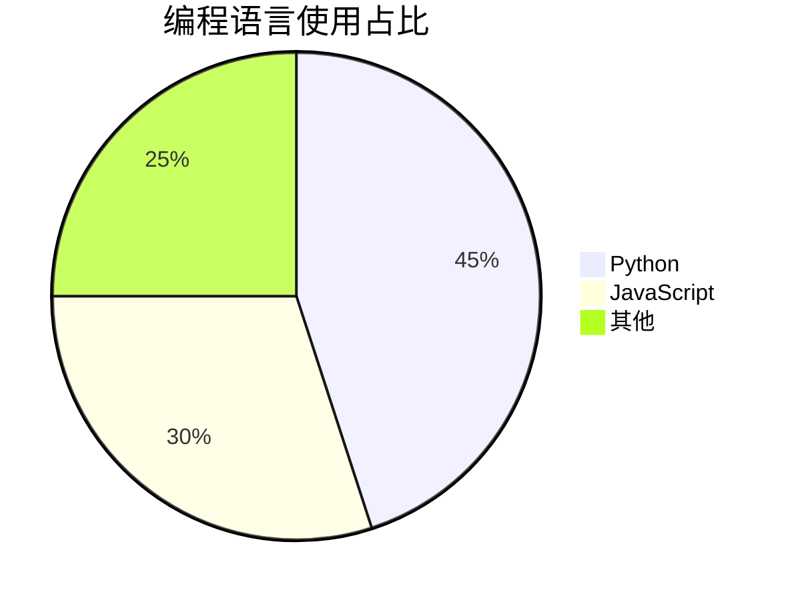
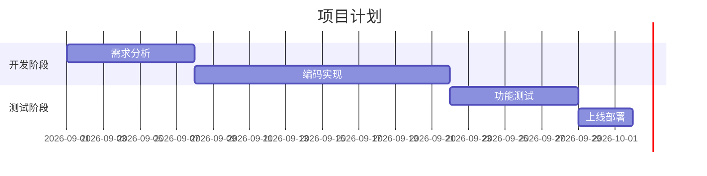

[TOC]

# 这是一级标题 Title1

## 这是二级标题 Title2

### 这是三级标题 Title3

#### 这是四级标题 Title4

##### 这是五级标题 Title5

###### 这是六级标题 Title6

---

**下面是正文:**

**滕王阁序 - 王勃**

豫章故郡，洪都新府。星分翼轸，地接衡庐。襟三江而带五湖，控蛮荆而引瓯越。物华天宝，龙光射牛斗之墟；人杰地灵，徐孺下陈蕃之榻。雄州雾列，俊采星驰。台隍枕夷夏之交，宾主尽东南之美。都督阎公之雅望，棨戟遥临；宇文新州之懿范，襜帷暂驻。十旬休假，胜友如云；千里逢迎，高朋满座。腾蛟起凤，孟学士之词宗；紫电青霜，王将军之武库。家君作宰，路出名区；童子何知，躬逢胜饯。(豫章故郡 一作：南昌故郡；青霜 一作：清霜)

　　时维九月，序属三秋。潦水尽而寒潭清，烟光凝而暮山紫。俨骖騑于上路，访风景于崇阿。临帝子之长洲，得天人之旧馆。层峦耸翠，上出重霄；飞阁流丹，下临无地。鹤汀凫渚，穷岛屿之萦回；桂殿兰宫，即冈峦之体势。（天人 一作：仙人；层峦 一作：层台；即冈 一作：列冈；飞阁流丹 一作：飞阁翔丹）

　　...
　　滕王高阁临江渚，佩玉鸣鸾罢歌舞。
　　画栋朝飞南浦云，珠帘暮卷西山雨。
　　闲云潭影日悠悠，物换星移几度秋。
　　阁中帝子今何在？槛外长江空自流。

No human being could fail to be deeply moved by such a tribute as this [[Thayer Award](https://en.wikipedia.org/wiki/Sylvanus_Thayer_Award)]. Coming from a `profession `I have served so long, and a people I have loved so well, it fills me with an emotion I cannot express. **But this award is not intended primarily to honor a personality**, but to symbolize a great moral code -- <u>the code of conduct and chivalry</u> of those who ==guard this beloved== land of culture and ancient descent. That is the animation of this medallion. For all eyes and for all time, it is an expression of the ethics of the American soldier. That I should be integrated in this way with so noble an ideal arouses a sense of pride and yet of humility which will be with me always.

这有一段文字，我要**将他们加粗**，并且还要进行==高亮==，有些时候，我还会使用一些 `English`，另外，我还会<u>给他们加上下划线</u>；

并且我还要*给有的文字加上斜体*；

有的时候，==我会高亮并且**加粗**，有的文字会*再加一些斜体*，再加一些 `English` 来测试==。

此外，~~我还会给某些字体加上删除线~~

还有~下标~ ，也有^上标^

---

<!-- 这里面是注释，我会注释一些东西... -->

[//]: <> (这也是注释)
[name]: <> (这亦是注释)

注释语法:

```
[name]: <> (这里写注释文本)
```

导出为 PDF 时，注释是不会渲染的，如下图所示，但是内容依旧存在，不要在注释里面写敏感信息！


---

下面是**引用链接**:

**引用链接 **是管理 url 的一种方法, **引用链接**的语法：

```
正文处[链接文字][链接标签]

文末统一管理链接处:
[链接标签]: 网址 "可选描述"
```

示例：

常见的搜索引擎有 [百度][baidu]、[谷歌][google]、[必应][bing]等。

**在文末，可以像下面这样写，这样多个文本引用同一个链接，只要修改文末的链接地址即可同步更新全文所有的链接，比行内链接方便！**

[baidu]: https://www.baidu.com "百度一下，你就知道"
[google]: https://www.google.com "Google"
[bing]: https://www.bing.com "Bing"

展示效果，当我将鼠标放在**百度**这两个字上时：


---

**行内链接**语法：

```
[链接文字](链接地址 "可选标题")
```

行内链接示例：

[百度首页](https://www.baidu.com "百度一下，你就知道")

当我将鼠标放在“百度首页”上时展示如下：


---

这是一个超链接，链接到 [百度](https://www.baidu.com)

下面有一条水平分割线

---

上面有一条分割线，下面是一张图片:


---

下面是一个表格

| 这是表头 | 这是表头 | Head |
| -------- | -------- | ---- |
| 一       | aaa      | 123  |
| 二       | bbb      | 456  |
| 三       | ccc      | 789  |

---

下面是图表-饼图：



---

下面是图表-甘特图：



---

这是行内公式: $sin^2x + cos^2x = 1$

下面是公式块

$$
sinx + cosx = 1\\
sinx - cosx = 1
$$

---

这是行内代码: `python manage.py runserver`

下面是代码块

```python
from pathlib import Path

import scrapy


class Test1Spider(scrapy.Spider):
    name = "test_1"
    start_urls = [
        "https://quotes.toscrape.com/page/1/",
        "https://quotes.toscrape.com/page/2/",
        "https://quotes.toscrape.com/page/3/",
    ]

    def parse(self, response):
        for quote in response.xpath('//div[@class="quote"]'):
            yield {
                "text": quote.xpath("./span[1]/text()").get(),
                "author": quote.xpath("./span[2]/small/text()").get(),
                "tags": quote.xpath("./div/a/text()").getall(),
            }
```

---

**下面是警告框:** 

> [!NOTE]
>
> 提醒 Note

> [!TIP]
>
> 建议 Tip

> [!IMPORTANT]
>
> 重要 Important

> [!WARNING]
>
> 警告 Warning

> [!CAUTION]
>
> 注意 Caution

----

> 这是引用内容
>
> > 引用里面可以嵌套引用
> >
> > > 再嵌套一层
> > >
> > > > [!NOte]
> > > >
> > > > 也可以嵌套警告框
> > > >
> > > > ```
> > > > 也可以嵌套代码块
> > > > ```
> > > >
> > > > `当然也有行内代码`
> > > >
> > > > 1. 有序列表
> > > > 2. 列表呀
> > > >
> > > > - 无序列表
> > > >   - 哈哈哈
> > > >   - 嘻嘻嘻
> > > >     - 啦啦啦
> > > > - 列表呀
> > > >
> > > > # 一级标题
> > > >
> > > > ## 二级标题
> > > >
> > > > *<u>**人固有一死**，或==轻于鸿毛==，或==重于泰山==。</u>*
> > > >
> > > > 有的人~死了~，他还^活着^。有的人==活着==，他已经~~死了~~。

---

有序列表

1. 第一
2. 第二
   1. 巴拉巴拉
      1. 哗啦哗啦
   2. balabala
3. 第三

---

无序列表

- 项目1
- 项目2
  - 巴拉巴拉
    - 稀里哗啦
    - ccc
      - aaa
        - bbb
- 项目3

---

下面是待办列表：

- [x] 任务1
  - [ ] a
  - [ ] b
    - [x] b1
    - [ ] b2
- [x] 任务二
- [ ] 任务三
- [ ] job 4

----

补充：Obsidian 中的注释语法：

```
%%
这是注释
支持多行
%%

支持%%这是行内注释%%信息
```

---

脚注：

可以自定义脚注的标识符（需要注意的是标识符要唯一！）。[^identifier]

可以使用汉字作为标识符。[^汉字标识符]

这是一段引用了别人的内容的文本。[^1]

这又是一段引用了别人的内容的文本。[^2]

[^1]: 巴拉巴拉巴拉

[^2]: 滴答滴答滴答

[^identifier]: 这是一个非数字的英文标识符表示的脚注

[^汉字标识符]: 这是一个中文汉字标识符表示的脚注

脚注的展示效果：


