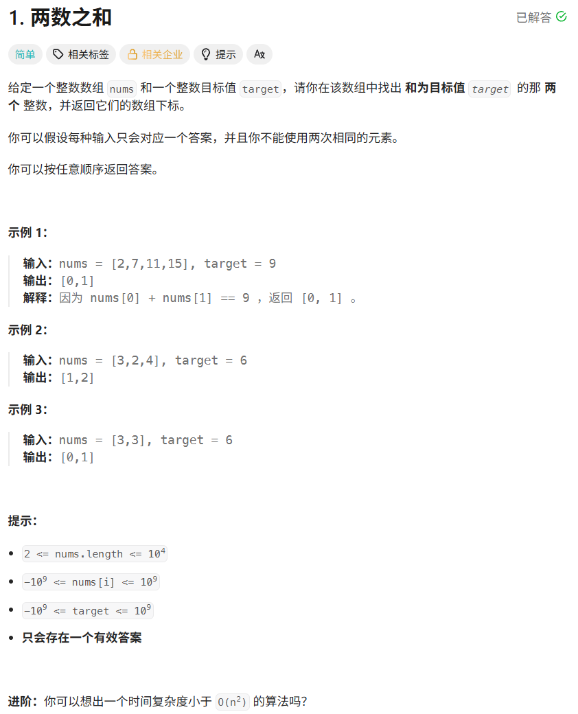
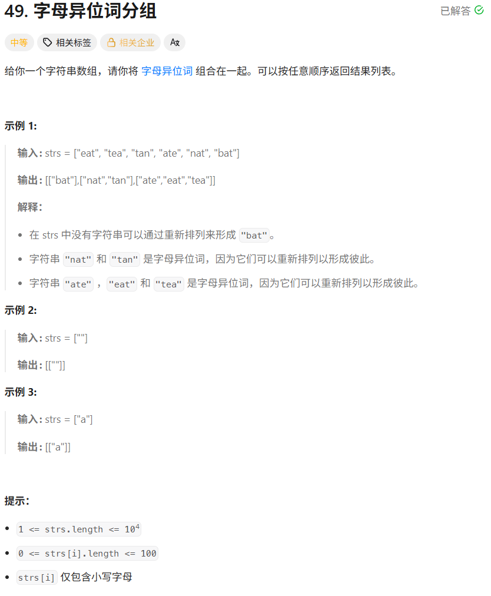
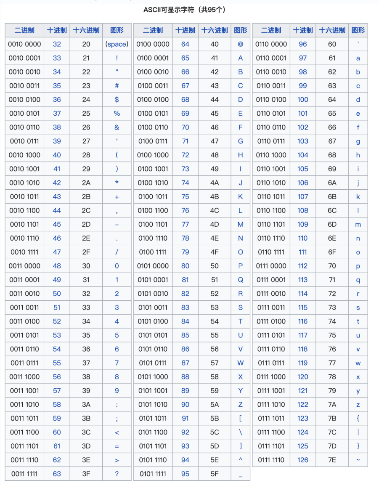
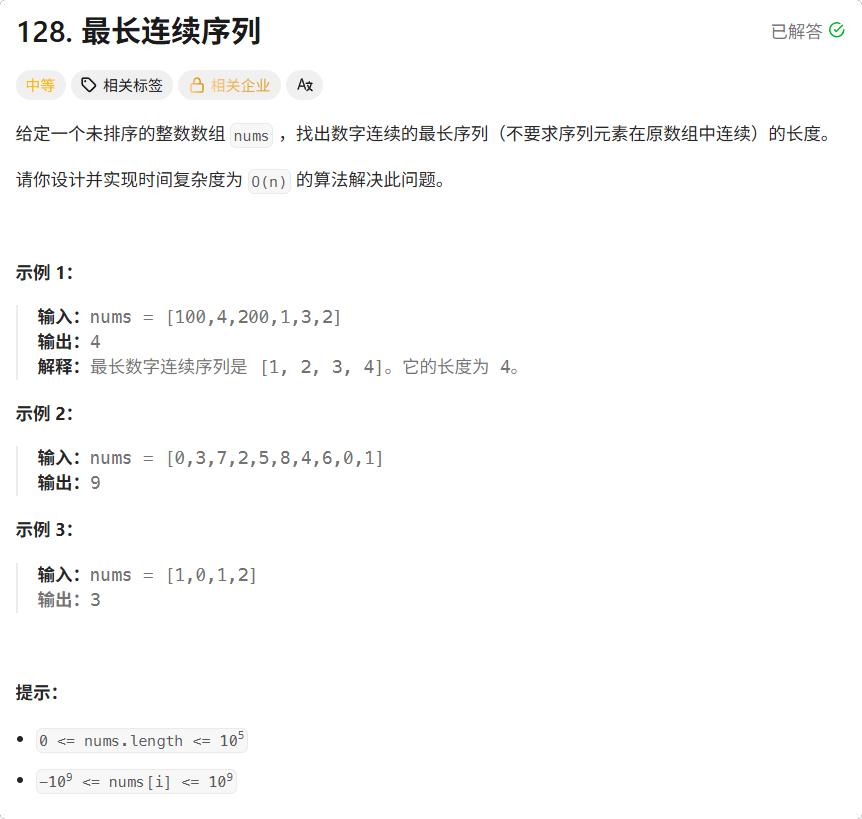
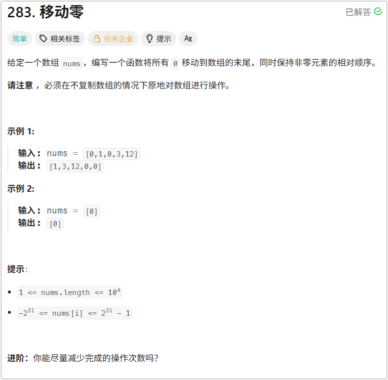
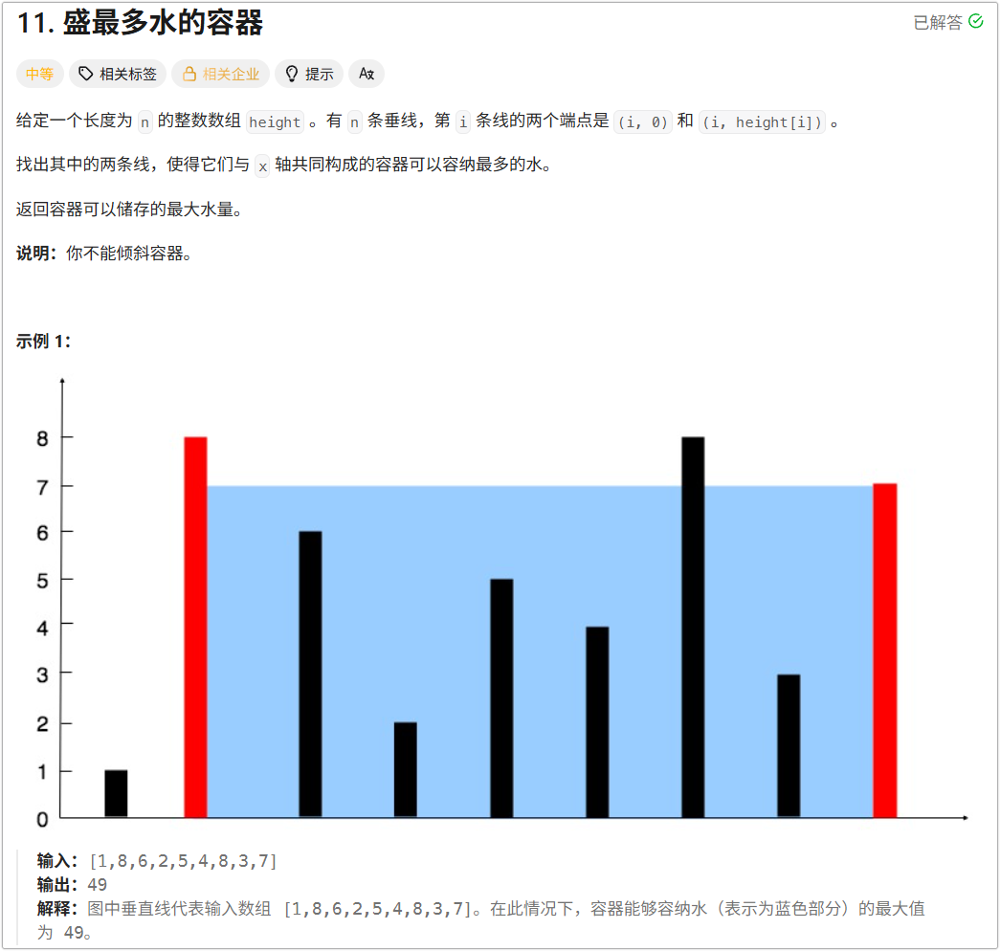
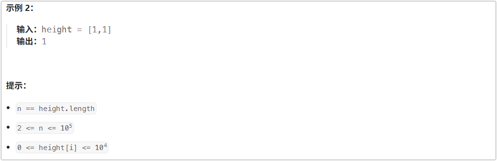

# 第 1 题. 两数之和



```python
from typing import List


# 1. 两数之和

def twoSum(nums: List[int], target: int) -> List[int]:
    """给定一个整数数组 nums 和一个整数目标值 target，请你在该数组中找出 和为目标值 target  的那 两个 整数，并返回它们的数组下标。
    你可以假设每种输入只会对应一个答案，并且你不能使用两次相同的元素。
    你可以按任意顺序返回答案。
    提示：
        2 <= nums.length <= 104
        -109 <= nums[i] <= 109
        -109 <= target <= 109
        只会存在一个有效答案

    Args:
        nums ():
        target ():

    Returns:

    """
    # # 方法一 暴力解法
    # n: int = len(nums)
    # if n == 0:
    #     return []
    # if n == 1:
    #     return []
    # if n == 2:
    #     if nums[0] + nums[1] == target:
    #         return [0, 1]
    #     else:
    #         return []
    # for i in range(n - 1):
    #     for j in range(i + 1, n):
    #         if nums[i] + nums[j] == target:
    #             return [i, j]
    # return []

    # # **********************************************************************************************
    # 方法二 哈希表
    # 关于本题, 哈希表的键是 num, 而值是 index
    # 假设 nums = [2, 6, 6, 7, 11, 15], target = 9
    # 每次都循环遍历 得到的 hash_map 的情况如下:
    # {2: 0}
    # {2: 0, 6: 1}
    # {2: 0, 6: 2}
    # 此时 target - 7 == 2, 而 2 in hash_map，可以直接返回
    # -----------------------------------------------------------------------
    # 假设 nums = [6, 6], target = 12
    # {6: 0}
    # {6: 0} 而此时所在的index = 1, 并且 target - nums[1] = 12 - 6 =  6 在 hash_map 中(hash_map = {6: 0}),
    #   于是可以直接返回结果, 不用再添加 nums[1]了
    # -----------------------------------------------------------------------
    # 题目中说了，只会有一个正确答案，那就不可能出现类似 nums = [6, 6, 7], target = 13 这种情况了
    #   因为这种情况就不止一个答案了, 正确答案可以是 [0, 2] 也可以是 [1, 2]
    # 为什么我们的 哈希表解法 能够正确解决问题呢？
    #   因为我们首先判断 (target - 当前元素) 的值是否在哈希表，如果在哈希表中的话可以直接返回了，
    #   即使出现类似于 nums = [6, 6], target = 12 的情况, 在遍历到 nums[1]的时候就直接返回正确结果了，不会再更新哈希表了
    from collections import defaultdict

    hash_map = defaultdict(int)
    for idx, num in enumerate(nums):
        if target - num in hash_map:
            return [idx, hash_map[target - num]]
        hash_map[num] = idx
    return []
```

**总结: 从这道题中学到了什么**

1. **常规思维（暴力解法）：** 固定一个数 a，然后遍历剩下的数找 b，看是否满足 a+b=target。这其实是“组合”的思想，时间复杂度是 O(N^2^)。
2. **进阶思维（逆向/转换视角）：** 既然 a+b=target，那么对于当前的 a，我需要的不过是 b=target−a。**问题瞬间从“寻找两个未知的和”变成了“寻找一个确定的差”。** 这种**将未知问题转化为已知条件去匹配**的思维，是解决所有算法题（甚至工程问题）的精髓。
3. 哈希表完美实现了“值”到“索引”的双向映射。当我们用哈希表把查找 b 的时间从 O(n)降到 O(1) 时，整个算法的时间复杂度直接从 O(N^2^)降维到了 O(N)。它让我们深刻认识到：**决定算法效率的，往往不是代码写得多花哨，而是选对了数据结构。**
4. 暴力解法：时间 O(n^2^)，空间 O(1)。
5. 哈希表解法：时间 O(n)，空间 O(n)（因为要额外开一个字典/Map来存数据）。
6. **学到的东西：** “空间换时间”是最基础也是最常用的系统优化手段。在内存足够的情况下，用额外的内存开销来换取计算时间的骤减，是一笔极其划算的买卖。无论是在写业务代码（如缓存 Redis），还是在架构设计（如用镜像服务器分摊压力），都是这一思想的延伸。
7. 好的代码不是一板一眼地执行“先准备，后执行”，而是能发现流程中的重叠部分，将其合并。这种“边走边看、即用即取”的思维，能减少无效的遍历。
8. 面试技巧:
   1. **先给保底方案：** “最直观的方法是双循环，但复杂度太高。”（证明你思维正常，且知道缺陷）。
   2. **给出优化方案：** “考虑到查找效率，我们可以用哈希表把查找降为 O(1)。”（证明你有数据结构基础）。
   3. **主动探讨边界：** 不等面试官提醒，主动说出：“这里要注意同一个元素不能重复使用，比如 target=8，数组是 [4,4]，所以我们应该**先查找，再存入当前元素**，或者存入时判断是否重复。”（证明你代码严谨，有防御性编程意识）。
   4. **引申变体（反客为主）：** “如果题目给的数组是有序的，我们还可以用双指针（对撞指针）在 O(1) 空间下解决；如果要求返回所有不重复的组合，又该怎么去重呢？”（直接把面试官带进你的节奏）。

# 第 49 题. 字母异位词分组





```python
from typing import List


# 49. 字母异位词分组


def groupAnagrams(strs: List[str]) -> List[List[str]]:
    """
    给你一个字符串数组，请你将 字母异位词 组合在一起。可以按任意顺序返回结果列表。
    字母异位词:
        字母异位词是通过重新排列不同单词或短语的字母而形成的单词或短语，并使用所有原字母一次。
    提示：
        1 <= strs.length <= 104
        0 <= strs[i].length <= 100
        strs[i] 仅包含小写字母

    Args:
        self ():
        strs ():

    Returns:

    """
    # 本题的关键点在于: 只要是字母异位词，都有 标准化签名(长得不一样但本质却是一样的)
    # 那么本题寻找标准化签名有两种方式:
    #   1. 排序 - 不管是 tea 还是 eat, 排序后都是 aet, 这个排序后的字符串 aet 就是标准化签名;
    #   2. 计数 - 不管怎样打乱, 每个字母出现的个数都是相同的, 记录每个字母出现频率的 列表/字典/元祖 就是标准化签名

    # # 方法一 排序 + 哈希表
    # if len(strs) == 0:
    #     return [[]]
    # if len(strs) == 1:
    #     return [[strs[0]]]

    # hash_map = {}

    # for string in strs:
    #     sorted_str = ''.join(sorted(string))
    #     if sorted_str not in hash_map:
    #         hash_map[sorted_str] = [string]
    #     else:
    #         hash_map[sorted_str].append(string)
    # return list(hash_map.values())

    # 方法二 计数 + 哈希表
    if len(strs) == 0:
        return [[]]
    if len(strs) == 1:
        return [[strs[0]]]

    from collections import defaultdict

    hash_map = defaultdict(list)
    for string in strs:
        # 'a': 97
        # 'A': 65
        # count_dict = {chr(i): 0 for i in range(97, 97 + 26)}
        count_dict = {chr(i): 0 for i in range(ord('a'), ord('z') + 1)}  # 和上一行代码等效
        for char in string:
            count_dict[char] += 1
        # 注意标准化签名必须为可哈希的类型(就是不可变类型 如 tuple str int float 等), 这样才能作为字典的键
        hash_map[tuple(count_dict.items())].append(string)
    return list(hash_map.values())
```

如果说第1题教的是“**怎么用哈希表**”，那么第49题教的就是“**怎么设计哈希表的键**”。这道题看似是字符串操作，实则是**分类与等价类划分**的经典模型。

## **核心抽象能力：寻找“标准化签名”**

这道题的本质是**分类**：把长得不一样，但本质一样的东西放在一起。
在计算机科学中，分类的前提是找到**等价类**。怎么判断两个字符串属于同一个等价类？你需要给它们生成一个**“标准化签名”**。

- **思路一（排序法）：** 不管原来是 `"eat"` 还是 `"tea"`，按字母表排序后都是 `"aet"`。这个**排序后的字符串就是签名**。
- **思路二（计数法）：** 不管怎么打乱，每个字母出现的次数是不变的。`[a:1, b:0, c:0... t:1, e:1]`，这个**频率数组也是签名**。

**学到的东西：** 遇到**“分组”、“去重”、“寻找相似性”**的问题时，不要死磕两个元素怎么比，而是去思考：**能不能为这一类元素设计一个独一无二的、统一的“身份证”？** 哈希表的键，就是用来存这个身份证的。

## 这道题完美展现了算法优化中的经典博弈：

1. **排序法：** `key = "".join(sorted(s))`
   - 时间：O(N⋅K·log⁡K)*O*(*N*⋅*K·*log*K*) （N是字符串数量，K是字符串最大长度）。瓶颈在排序的 log⁡K
   - 空间：O(N⋅K)*O*(*N*⋅*K*)（用于存储排序后的字符串）。
   - **评价：** 代码极简，Python内置 `sorted` 用C语言实现，常数极小，在大多数实际场景下跑得飞快。
2. **计数法：** `key = tuple([s.count(c) for c in "abcdefghijklmnopqrstuvwxyz"])`
   - 时间：O(N⋅K)*O*(*N*⋅*K*)。彻底消灭了 log⁡K
   - 空间：O(N⋅K)*O*(*N*⋅*K*)（存储元组）。
   - **评价：** 理论时间复杂度更优，尤其是当 K很大（比如字符串极长）时优势明显。但代码稍显啰嗦，且在短字符串下，Python循环的开销可能反而大于C级排序。

**学到的东西：** 理论最优 ≠ 工程最优。在面试中，**先写排序法（保底），再提计数法（拔高），并说出两者的Trade-off**，是高级工程师的标配表现。

## **哈希键的类型安全：可哈希性**

在用计数法时，很多初学者会踩坑：

```
# 错误写法
key = [1, 0, 0, ..., 1, 1]  # 这是一个 List
hash_map[key] = [...]  # 报错：TypeError: unhashable type: 'list'
```

**学到的东西：** 加深对Python哈希表底层的理解。字典的键必须是**不可变类型**。List 是动态可变的，所以不能做键；必须转换成 `tuple` 或者拼接成 `str`（如 `"#1#0#0...#1#1"`）才能做键。

##  `Pythonic` 的数据结构：`defaultdict` 的妙用

在处理“分组”问题时，如果用普通字典，代码会充斥着难看的 `if-else`：

```
# 苦逼写法
if key in hash_map:
    hash_map[key].append(s)
else:
    hash_map[key] = [s]
```

**学到的东西：** 学会使用 `collections.defaultdict(list)`。它体现了“**声明式编程**”的思想——你只需要告诉程序“字典的值默认是个列表”，直接无脑 `append` 即可，把边界条件的处理交给语言本身。

## 拓展思维：倒排索引

如果你把这道题的思路平移到后端开发中，它其实就是搜索引擎底层最核心的数据结构——**倒排索引**的微缩版。

- **搜索引擎：** 给定一个词，找出包含这个词的所有文档ID列表。（词 -> 文档列表）
- **本题：** 给定一个异位词特征，找出具有该特征的所有字符串列表。（特征 -> 字符串列表）

**学到的东西：** 算法题不是孤立的。`Map<特征, 列表>` 这种数据结构形态，在标签系统、用户画像分群、日志分析聚合中无处不在。

## 第49题的武功套路

如果说你在第1题学会了**“降维打击”**（把 O(n2)*O*(*n*2) 降为 O(n)*O*(*n*)），
那么在第49题你就学会了**“抽丝剥茧”**（从杂乱的表象中提取不变的规律作为哈希键）。

记住这个公式：**复杂问题分类 = 提取不变量（Key） + 哈希表聚合**。
掌握这个公式，力扣上后期的诸如“变位词”、“同构字符串”、“找出重复的DNA序列”等一大票题目，对你来说都将变成同一道题。

# 第 128 题. 最长连续序列



```python
# 128. 最长连续序列

from typing import List

def longestConsecutive(nums: List[int]) -> int:
    """
    给定一个未排序的整数数组 nums ，找出数字连续的最长序列（不要求序列元素在原数组中连续）的长度。
    请你设计并实现时间复杂度为 O(n) 的算法解决此问题。
    提示：
        0 <= nums.length <= 105
        -109 <= nums[i] <= 109

    Args:
        nums ():

    Returns:

    """
    # # 方法一 排序 O(n·logn)
    # n = len(nums)
    # if n <= 1:
    #     return n
    # nums.sort()
    #
    # max_len = 1
    # cur_len = 1
    # for i in range(1, n):
    #     if nums[i] == nums[i - 1]:
    #         continue
    #     if nums[i] == nums[i - 1] + 1:
    #         cur_len += 1
    #     else:
    #         max_len = max(max_len, cur_len)
    #         cur_len = 1
    #
    # # 此处在最后一定要注意, 如果最后一组的长度是最长并且没有比最后一组的最大的数还大的数的话，会漏掉一次比较:
    # # max_len = max(max_len, cur_len)
    # # cur_len = 1
    # # 上面这两行代码就不会被执行: 因为 i 已经到最大的索引了,根本不会跑到这两行而导致漏掉一次比较
    # return max(max_len, cur_len)

    # 方法二 哈希表
    # 解题思路:
    #   集合去重
    #   遍历 **集合** 中的每个元素 -- 因为要求的是连续的序列, 那么如果此处遍历原数组是没有意义的
    #       如果 (当前元素 - 1) 在哈希表中, 那么代表着当前元素并不是连续序列的开头元素 可以直接不用管
    #       如果 (当前元素 - 1) 不在哈希表中, 那么当前元素就是开头元素, 此时从 当前元素一直加一并判断是否在哈希表中, 同时记录连续序列的长度
    #           当 (当前元素 + y) 不在数组中, 那么可以得到以当前元素为首的连续序列的长度为 y, 和已经记录的最大长度比较, 记录最大值即可
    hash_set = set(nums)
    max_len = 1
    for num in hash_set:
        cur_len = 1
        if num - 1 in hash_set:
            continue
        else:
            i = 1
            while num + i in hash_set:
                cur_len += 1
                i += 1
            max_len = max(cur_len, max_len)
    return max_len

    # 方法三 并查集
    pass
```

这道题表面上是求序列长度，但实际上它是一道**“重思维、轻代码”**的教科书级别好题。它不涉及复杂的动态规划状态转移，也不需要生僻的数据结构，但它能极好地考察一个程序员的**算法直觉、复杂度分析能力以及抽象建模能力**。

从这道题中，我们可以提炼出以下六个极具价值的通用经验：

## 1. 识别并避免“重复计算”（剪枝思维）

这是解法二中最核心的灵魂。

- **痛点**：如果不做特殊处理，遇到连续序列 `[1, 2, 3, 4]`，你从 1 开始找一遍长度是 4，从 2 开始找长度是 3，从 3 开始找是 2……这就产生了巨大的冗余计算。
- **学到的方法**：**寻找“唯一性标识”**。在一个连续序列中，“起点”（即 `num - 1` 不存在的数）是唯一的。**只从起点开始向后扩张**，就能保证每一段连续序列只被完整遍历一次。这种“只处理头节点/起点”的思想，在图论（如拓扑排序）、树形结构中非常常见。

## 2. 突破直觉：看透嵌套循环的真实复杂度

很多初学者看到 `for` 循环里面套着 `while` 循环，就会本能地判定时间复杂度为 O(n^2^)，从而在面试中错失最优解。

- **学到的方法**：**不要用“数循环层数”的方式来算复杂度，要看“操作的总执行次数”**。
- 在这道题里，`while` 循环虽然会执行，但它执行的前提是遇到了“起点”。而所有的起点加上它们后续的节点，**总共就是集合里的 n个元素**。这意味着内层 `while` 在整个程序运行期间，累加起来最多执行 n 次。这是一种典型的**均摊分析**思想。

## 3. 突破 `O(n·log⁡n)`瓶颈的通用利器：空间换时间

当你需要对一组数据进行“查找相邻元素”、“判断是否存在”的操作，且题目强制要求 O(n) 时，排序法 (`O(n·log⁡n)`) 绝对走不通。

- **学到的方法**：**哈希表是突破排序瓶颈的银弹**。只要把数据扔进 `HashSet`，任何“判断某个值存不存在”的操作就变成了 O(1)。这就把原本需要排序才能建立的“前后顺序关系”，通过哈希查询给变相实现了。
- **举一反三**：两数之和、字母异位词、最长连续序列，这些题的本质都是用哈希表的 O(1)查询来替代排序。

## 4. 数据结构的抽象能力：从“数组”到“图/集合”

同样是这道题，普通人看到的是一排数字，学过并查集的人看到的是**一张图**。

- **学到的方法**：**学会给问题“换皮”**。
- 题目说“连续序列”，我们可以抽象为“差值为 1 的节点互相连通”。于是，找最长连续序列，就变成了**“求最大连通块的节点数”**。这种抽象能力是算法进阶的关键。当你能用多种数据结构（数组、哈希表、并查集、甚至线段树）来描述同一个问题时，你的算法功底才算真正过关。

## 5. 注意“序列”与“子数组”的区别（细节防御）

- **序列**：只关心元素的值，不关心它们在原数组里的相对位置（可以跳跃）。
- **子数组/子串**：必须是在原数组中连续存放的。
- **学到的方法**：这道题求的是“序列”，所以我们可以随便排序、随便放进哈希表，打乱了原顺序也无所谓。但如果题目改成求“最长连续子数组”（要求原数组位置相邻），那么哈希表解法直接失效。在读题时，咬文嚼字辨析这两个概念，能避免写错方向。

## 6. 面试的“向上管理”与递进式展示

这道题太适合用来展示你的面试技巧了。

- **学到的方法**：永远不要一上来就写最优解，要“层层递进”。
  - *第一步*：“这题最直观的方法是排序，时间 O(`n·log⁡n`)，但显然不满足进阶要求。”（展示你有基础常识）
  - *第二步*：“为了降到 O(n)，我们可以用哈希集合。为了防止重复遍历，我们只从序列的起点开始往后找……”（展示你的核心逻辑和复杂度分析能力）
  - *第三步*：“当然，如果这道题是在线算法（不断有新数字插入），哈希表就不太好办了，我们可以用并查集来维护连通块……”（展示你视野开阔，懂高级数据结构）

**总结一句话：**
从第128题中，我们学到的最重要的不是某一段代码，而是**“如何通过寻找唯一起点来剪枝、如何正确分析均摊时间复杂度、以及如何利用哈希表打破排序壁垒”**这三个可以复用到无数其他题目中的底层算法思维。

# 第 283 题. 移动 0




```python
def moveZeroes(self, nums: List[int]) -> None:
    """
    Do not return anything, modify nums in-place instead.
    """
    # 双指针
    n = len(nums)
    slow = 0
    for fast in range(n):
        if nums[fast] != 0:
            nums[slow] = nums[fast]
            slow += 1
    for i in range(slow, n):
        nums[i] = 0
```

力扣第 283 题“移动零”虽然被标记为简单难度，但它绝对是算法入门阶段**含金量极高**的一道题。它不仅仅是为了让你把 0 移到后面，更像是一个“微型训练场”，能全方位锻炼你的编程思维。

从这道题中，我们至少可以学到以下六个层次的进阶知识：

## 1. 核心技巧：“快慢双指针”的启蒙

这是很多人第一次真正意义上理解“快慢指针”的地方。

- **慢指针：** 负责指向“下一个非零元素应该放置的位置”。它维护的是数组的**有效前缀**。
- **快指针：** 负责在前面“探路”，寻找非零元素。
- **学到的思维：** 当遇到需要“原地修改数组”且“保持原有顺序”的问题时，快慢指针是首选。快指针负责遍历，慢指针负责记录状态。

## 2. 算法演进：从暴力到优雅的优化过程

这道题非常完美地展示了如何一步步优化代码，这也是面试官最看重的特质：

- **第一层（新手思维 - 暴力法）：** 遇到 0 就把后面的元素全部往前挪一位，最后末尾补 0。
  - *缺点：* 时间复杂度 O(n^2^)，大量的无效移动。
- **第二层（空间换时间）：** 新建一个数组，把非零放进去，最后补零再拷贝回原数组。
  - *缺点：* 空间复杂度 O(n)，不符合题目“必须在不复制数组的情况下原地对数组进行操作”的要求。
- **第三层（覆盖赋值 + 后置补零）：** 使用快慢指针，遇到非零就赋值给慢指针，慢指针前进。遍历结束后，慢指针之后的元素全部补 0。
  - *优点：* 时间 O(n)，空间 O(1)，且**写入操作极少**。
- **第四层（原地交换）：** 使用快慢指针，遇到非零就直接和慢指针交换。
  - *优点：* 代码看起来更简洁，不需要最后写一个 for 循环补零。

## 3. 工程权衡：`swap` 交换 与 `赋值` 的性能差异

在第三层和第四层之间，其实隐藏着很深的工程考量，**这是区分普通程序员和优秀工程师的关键点**：

- **交换法：** `nums[slow] = nums[fast]; nums[fast] = temp;`（需要 3 次操作）。而且，如果慢指针和快指针重合（例如一开始就是非零数），交换是没有意义的“自身交换”。
- **覆盖法：** `nums[slow] = nums[fast];`（只需 1 次操作）。最后补零 `nums[i] = 0`（1 次操作）。
- **学到的思维：** <u>代码短 != 性能好</u>。<u>**在底层开发或高频交易中，减少不必要的写操作（内存访问）是优化的核心。**</u>如果在面试中能主动提出：“虽然 swap 代码短，但覆盖法减少了无意义的自身交换和冗余写操作，性能更优”，会极大加分。

## 4. 数学思维：寻找“不变量”

在写双指针时，最怕指针乱跑导致逻辑出错。这道题可以教你如何用“不变量”来辅助编程：
在整个快慢指针移动的过程中，始终保持以下不变量：

- `[0, slow)` 区间内的元素**全部是非零的**，且**保持了原始顺序**。
- `[slow, fast)` 区间内的元素**全部是 0**。
- 只要你的循环能维持这个不变量不崩塌，最后代码一定是正确的。这种“数学归纳法”的思维在写复杂算法时极其有用。

## 5. 模式识别：抽象出“数组过滤”的通用模板

不要死记硬背“移动零”，要看到它的本质：**它就是“删除数组中的特定元素”的变体。**
如果把 0 看作是垃圾，这道题就是“把垃圾扔到最后，把有用的东西紧凑地排在前面”。
掌握了这个模板，你可以直接秒杀以下力扣题目：

- **27. 移除元素**（把等于 val 的元素移到最后/直接丢弃）
- **26. 删除有序数组中的重复项**（把重复元素移到最后，保留不重复的）
- **80. 删除有序数组中的重复项 II**（保留最多两个）
- **905. 按奇偶排序数组**（把偶数移到前面，奇数移到后面）

## 6. 鲁棒性：边界条件的天然免疫力

很多题需要考虑 `nums` 为空、没有 0、全是 0、0 在开头、0 在结尾等繁杂的边界条件。
但在快慢指针的写法下：

```
slow = 0
for fast in range(len(nums)):
    if nums[fast] != 0:
        nums[slow] = nums[fast]
        slow += 1
# 后面补零...
```

- 如果没有 0：`fast` 和 `slow` 始终同步，每个元素自己赋值给自己，结果正确。
- 如果全是 0：`slow` 始终为 0，循环结束后直接把整个数组补 0，结果正确。
- **学到的思维：** 优秀的算法结构，能够自动消化大部分边界条件，而不需要写一堆 `if-else` 去特判。

## 总结

做力扣 283 题，**不要只满足于 AC（通过）**。
如果你只写出了 `swap`，你学到了“双指针”；
如果你思考了 `swap` 和 `覆盖赋值` 的区别，你学到了“性能优化”；
如果你把它和 26 题、27 题联系起来，你学到了“抽象与模式识别”；
如果你用“不变量”去推导它，你学到了“严谨的数学证明思维”。

这就是一道好题的价值所在。

# 第 11 题. 盛水最多的容器





```python
from typing import List


def maxArea(height: List[int]) -> int:
    """给定一个长度为 n 的整数数组 height 。有 n 条垂线，第 i 条线的两个端点是 (i, 0) 和 (i, height[i]) 。
    找出其中的两条线，使得它们与 x 轴共同构成的容器可以容纳最多的水。
    返回容器可以储存的最大水量。
    说明：你不能倾斜容器。

    提示：
    n == height.length
    2 <= n <= 105
    0 <= height[i] <= 104

    Args:
        height ():

    Returns:

    """
    # # 方法一 暴力解法
    # max_area = 0
    # n = len(height)
    # for i in range(n - 1):
    #     for j in range(i + 1, n):
    #         max_area = max(max_area, (j - i) * min(height[i], height[j]))
    # return max_area

    # 方法二 双指针
    n = len(height)
    left = 0
    right = n - 1
    max_area = 0
    while left < right:
        max_area = max(max_area, (right - left) * min(height[left], height[right]))
        if height[left] <= height[right]:
            left += 1
        else:
            right -= 1
    return max_area
```

这道题虽然代码量不大，但被称为**“神仙题”**的开局，因为它蕴含了非常深刻的算法思维。

从这道题中，我们至少可以提炼出以下 **5 个层次的宝贵经验**，这些经验可以直接迁移到几百道其他题目中：

## 1. 算法层面：掌握“双指针”的底层逻辑

双指针不是背下来的模板，而是一种**“降维打击”**的策略。

- **空间压缩**：暴力解法是在二维平面 (i,j)(*i*,*j*) 里找答案，复杂度是 O(n2)*O*(*n*2)。双指针通过让指针单向移动，把二维的搜索空间强行压缩到了一维的线段上，复杂度直接降为 O(n)*O*(*n*)。
- **指针移动的触发条件**：什么时候左移？什么时候右移？这道题告诉我们，**触发指针移动的依据，一定是为了排除不可能的答案**。在这题里，移动长板必然导致面积缩小（排除了错误答案），所以只能移动短板（保留希望）。

## 2. 思维层面：学会“贪心”与“反证法”的结合

很多算法题（特别是求最大值/最小值）都会用到贪心策略，但最怕的是“直觉上的贪心往往是错的”。

- **这道题的贪心**：每次丢掉较短的板子。
- **如何证明贪心是对的？**：学会使用**反证法**。当你提出一个策略（比如移动短板）时，在脑海中或者面试时嘴上说：“假设我不这么做（比如我移动长板），会发生什么？面积一定会变小，且不可能错过最优解，所以我的策略是安全的。” **反证法是面试时证明贪心策略唯一靠谱的方法。**

## 3. 优化层面：从“暴力”到“最优”的通用路径

你一开始写的暴力解法是非常棒的！因为**所有的优化都必须建立在正确理解暴力解法的基础上**。记住这个通用的解题路径：

1. **写暴力**：老老实实 O(n2)*O*(*n*2) 或 O(2n)*O*(2*n*) 写出来，确保边界情况想清楚了。
2. **找重叠/找浪费**：看着暴力代码问自己：“我有没有重复计算什么？”、“我有没有在看一些绝对不可能成为答案的东西？”
3. **剪枝/优化**：在这题里，暴力解法的“浪费”在于：当 `height[i]` 很小，`height[j]` 很大时，不管中间有多少比 `height[j]` 大的数，只要它们在 `i` 的右边，和 `i` 组合的面积都超不过当前的面积。**发现这种“无效枚举”，就是优化的突破口。**

## 4. 数学模型层面：“木桶效应”的代码转化

“盛水最多的容器”本质就是初中的**木桶效应**（水量取决于最短的那块板）。

- 很多现实生活中的物理/数学规律，都可以直接转化为代码逻辑。
- 当你看到 `min(A, B)` 作为乘法的一个因子时，往往意味着其中一个因子起到了“瓶颈”作用，后续的优化思路通常要围绕着“如何打破这个瓶颈”来展开（即去寻找更高的板子）。

## 5. 面试实战层面：如何向面试官展示你的思考

如果在面试中遇到这道题，完美的沟通节奏应该是这样的（你可以直接背诵这个节奏）：

- **第一步**：“我先考虑最直观的暴力解法，两层循环枚举左右边界，时间复杂度 O(n2)*O*(*n*2)，空间 O(1)*O*(1)。但这个复杂度太高了，肯定有优化空间。”（展现你基础扎实，且不满足于暴力）
- **第二步**：“我观察一下面积公式 `宽 × 高`。宽是两点距离，高是两个柱子的最小值。如果我从两端开始，初始宽度是最大的。”（展现观察力）
- **第三步**：“接下来宽一定会缩小。为了让面积不缩小，高必须增大。但高受限于短板。如果移动长板，高不可能变大，面积必然缩小。**所以为了保留面积变大的可能性，我只能移动短板。**”（展现逻辑推导能力）
- **第四步**：“这是典型的双指针收缩窗口，时间降为 O(n)*O*(*n*)。这个策略是安全的，因为如果我们不移动短板，中间无论有多少比长板还高的柱子，和短板组合的水量都不可能超过当前，所以不会错过最优解。”（主动抛出反证法，直接封死面试官的追问）

## 💡 举一反三（推荐练习题）

掌握了这道题的思维，你可以去顺手秒杀以下题目，因为它们用到的核心思想一模一样（两端双指针 + 局部最优排除法）：

1. **LeetCode 42. 接雨水**（这道题的进阶版，可以说是双指针的巅峰应用之一）
2. **LeetCode 167. 两数之和 II - 输入有序数组**（最基础的两端双指针）
3. **LeetCode 15. 三数之和**（双指针的排序+去重应用）
4. **LeetCode 611. 有效三角形的个数**（同样利用排序后，固定最长边，双指针找短边的逻辑）

**总结一句话：做算法题，不要背代码，要背“发现冗余并剪枝”的思维过程。第11题就是最好的教科书。**

# 第 15 题. 三数之和


