<h1 style="text-align: center;font-size: 40px; font-family: '楷体';">MySQL</h1>

[TOC]

以前，在开发程序时，我们会把很多数据和信息存储到某个文件夹中的文件中，例如：`users.txt`，`db.xlsx` 等。

现在，有一个名叫数据库管理系统(DBMS, Database Management System) 的软件，可以帮助我们实现对文件夹中的文件进行操作，而我们只要学习DBMS能够识别的指令，就能控制它去帮助我们实现对文件和文件夹的处理，例如：

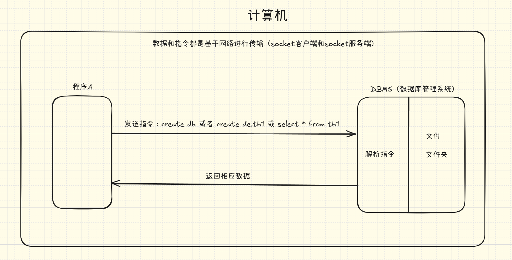

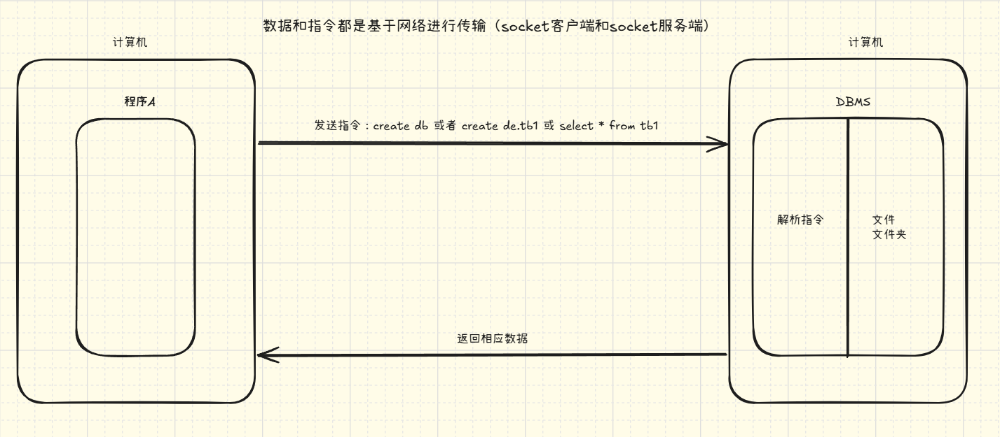

数据库管理系统（DBMS）专注于帮助开发者解决数据存储的问题，这样开发者就可以将主要精力放在实现业务功能上了。

业内有很多的DBMS产品，例如：

- MySQL： 原来是sun公司，后来被甲骨文收购 现在互联网企业几乎都在用 【免费 + 收费】
- Oracle： 甲骨文 收费 一般国企、事业单位居多 【收费】
- Microsoft SQLServer： 微软 【收费】
- DB2： IBM 【免费 + 收费】
- Access：微软 【收费】
- PostgreSQL：加州大学伯克利分校 【免费】
- ...

我们主要使用MySQL

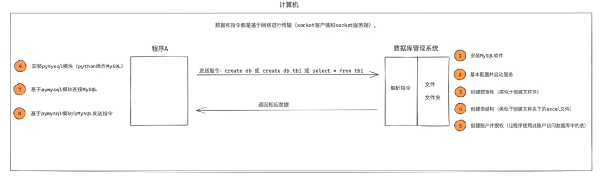

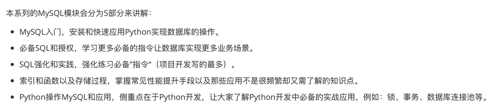

# day-01 `MySQL`入门

目标：学习安装和快速应用`Python`实现数据库的操作。

课程概要：

- 安装 & 配置 & 启动
  - `win`
  - `mac`
- 数据库  管理 (类比文件夹)
- 表 管理 (类比文件夹下面的 `Excel` 文件)
- 数据行管理 (类比 `Excel` 文件中的数据行)
- `Python` 操作 `MySQL` 及相关安全问题

## 1.1 安装 & 配置 & 启动

MySQL现在的版本主要分为：

- 5.x 版本，现在互联网企业中的主流版本 包括 头条 美团 百度 腾讯等公司主流版本
- 8.x 版本 新增了一些窗口函数。持久化配置、隐藏索引等其他功能

所以，我们课程会以常用大版本中最新的版本为例来讲解 - 5.7.31

### 1.1.1 Windows 系统

省略，去网上查。

`my.ini`:

```txt
[mysqld]

# 设置端口
port=3306

# MySQL 安装目录
basedir=E:\\Software\\mysql-8.4.9-winx64

# 数据存储目录
datadir=E:\\Software\\mysql-8.4.9-winx64\\data

# 最大连接数
max_connections=200

# 默认字符集
character-set-server=utf8mb4

# 默认存储引擎
default-storage-engine=INNODB

[mysql]
# 客户端默认字符集
default-character-set=utf8mb4

[client]

# 客户端连接端口和字符集
port=3306
default-character-set=utf8mb4
```

初始化：

```bash
>>>mysqld.exe --initialize-insecure
```

- 临时启动：
  ```bash
  >>>mysqld.exe
  ```

  只要关闭黑窗口就会将MySQL关闭，但是这样每次都要手动启动 很麻烦.

- 制作 Windows 服务 基于 Windows服务管理器
  ```bash
  >>>mysqld.exe --install mysql(可以自己定义)
  ```

  创建好服务后，可以通过命里给你 启动和关闭服务
  ```bash
  >>>net start mysql(你自定义的服务名)
  >>>net stop mysql(你自定义的服务名)
  ```

  以后不想使用Windows服务了，也可以将制作的这个MySQL服务删除
  ```bash
  >>>mysqld.exe --remove mysql(你自定义的服务名)
  ```

测试连接（命令行）：

```python
>>>mysql -h 127.0.0.1 -P 3306 -u root -p
```

此时还没有设置密码，要输密码的时候直接回车即可。

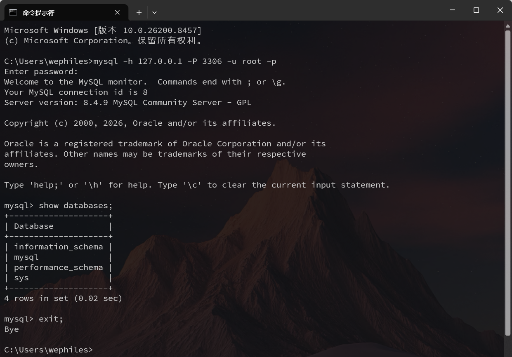

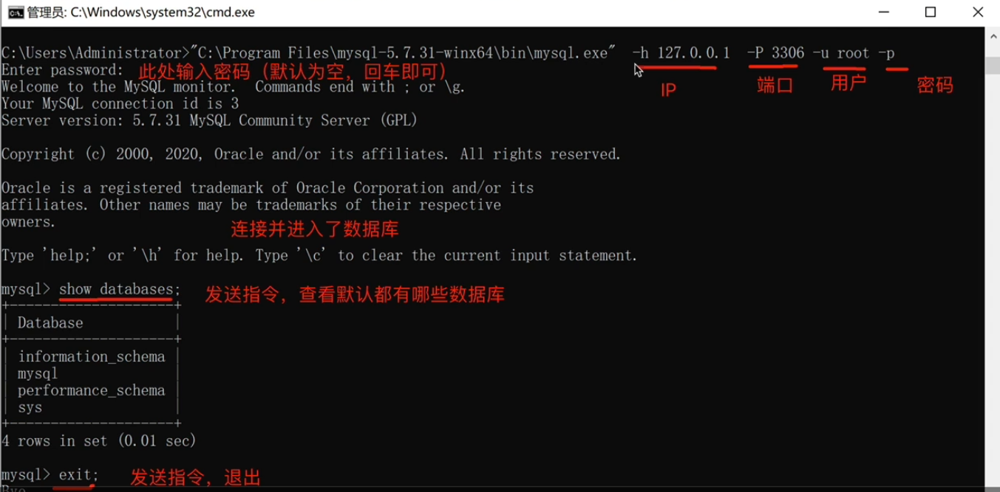

修改自己的密码：

```bash
>>>mysql -u root -p
>>>ALTER USER 'root'@'localhost' IDENTIFIED WITH mysql_native_password BY '新密码';
# 如果上面的代码报错 使用下面的代码
>>>ALTER USER 'root'@'localhost' IDENTIFIED BY '新密码';
```

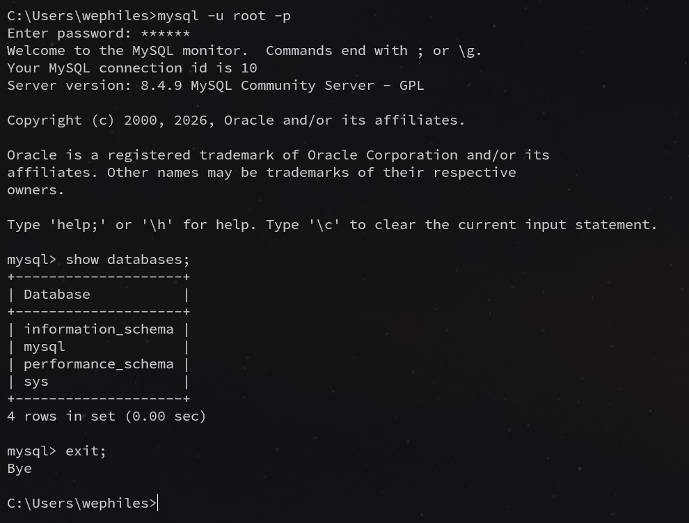

### 1.1.2 Mac 系统

省略，去网上查。

## 1.2 数据库管理

安装上`MySQL`后，就需要开始学习指令了，通过指令让`MySQL`去做出一些文件操作。


如果将数据库管理系统与之前的文件管理做类比的话：

| 数据库管理系统 | 文件管理            |
| -------------- | ------------------- |
| 数据库         | 文件夹              |
| 数据表         | 文件夹下的Excel文件 |

接下来，我们先学习数据库（文件夹）相关操作的指令。

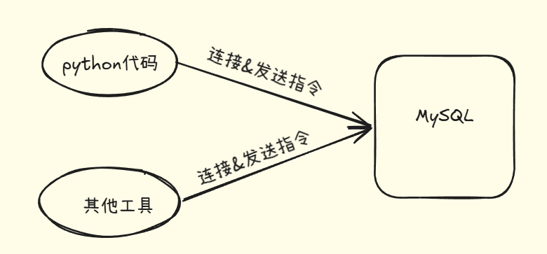

### 1.2.1 内置客户端操作

当连接上`MySQL`后，执行如下命令（一般称为`SQL`语句），就可以对`MySQL`的数据进行操作。

- 查看当前的所有数据库
  ```sql
  show databases;
  ```

- 创建数据库
  ```sql
  create database 数据库名 default charset utf8 collate utf8_general_ci;
  create database 数据库名;
  ```

- 删除数据库
  ```sql
  drop database 数据库名;
  ```

- 进入数据库（进入文件夹）
  ```sql
  use 数据库名;
  ```

示例：

```bash
# 登录MySQL
C:\Users\wephiles>mysql -u root -p
Enter password: ******
Welcome to the MySQL monitor.  Commands end with ; or \g.
Your MySQL connection id is 8
Server version: 8.4.9 MySQL Community Server - GPL

Copyright (c) 2000, 2026, Oracle and/or its affiliates.

Oracle is a registered trademark of Oracle Corporation and/or its
affiliates. Other names may be trademarks of their respective
owners.

Type 'help;' or '\h' for help. Type '\c' to clear the current input statement.

# 查看当前数据库
mysql> show databases;
+--------------------+
| Database           |
+--------------------+
| information_schema |
| mysql              |
| performance_schema |
| sys                |
+--------------------+
4 rows in set (0.02 sec)

# 创建数据库 create database 数据库名 default charset 编码 collate 排序规则;
mysql> create database day01db default charset utf8 collate utf8_general_ci;
Query OK, 1 row affected, 2 warnings (0.18 sec)

mysql> show databases;
+--------------------+
| Database           |
+--------------------+
| day01db            |
| information_schema |
| mysql              |
| performance_schema |
| sys                |
+--------------------+
5 rows in set (0.00 sec)

# 删除数据库
mysql> drop database day01db;
Query OK, 0 rows affected (0.22 sec)

mysql> show databases;
+--------------------+
| Database           |
+--------------------+
| information_schema |
| mysql              |
| performance_schema |
| sys                |
+--------------------+
4 rows in set (0.00 sec)

# 进入数据库里面
mysql> use mysql;
Database changed

# 查看当前数据库下面有哪些表
mysql> show tables;
+------------------------------------------------------+
| Tables_in_mysql                                      |
+------------------------------------------------------+
| columns_priv                                         |
| component                                            |
| db                                                   |
| ...                                                  |
+------------------------------------------------------+
38 rows in set (0.00 sec)

```

### 1.2.2 Python代码操作

无论通过何种方式连接MySQL，本质上发送的指令都是相同的，只是连接的方式和操作形式不同而已。

当连上MySQL后，执行如下指令，就可以对MySQL的数据进行操作。（同上述过程）

- 查看当前所有的数据库 `show databases;`
- 创建数据库 `create database 数据库名 default charset utf8 collate utf8_general_ci;`
- 删除数据库 `drop database 数据库名;`
- 进入数据库 `use 数据库名;`


想要使用Python操作MySQL需要安装第三方模块：

```bash
pip install pymysql
```


安装完成后，就可以编写代码：

```python
import pymysql

# 连接 MySQL (Socket)
conn = pymysql.connect(
	host='127.0.0.1',
    port=3306,
    user='root',
    password='123456',
    charset='utf8',
)
cursor = conn.cursor()

# 1. 查看数据库
# 发送指令
cursor.execute('show databases;')
# 获取指令的结果
result = cursor.fetchall()
print(result)  # (('information_schema',), ('mysql',), ('performance_schema',), ('sys',))

# 2. 创建数据库
# 发送指令
cursor.execute('create database study01 default charset utf8 collate utf8_general_ci;')
conn.commit()

# 3. 查看数据库
# 发送指令
cursor.execute('show databases;')
# 获取指令的结果
result = cursor.fetchall()
print(result)  # (('information_schema',), ('mysql',), ('performance_schema',), ('study01',), ('sys',))

# 4. 查看数据库
# 发送指令
cursor.execute('drop database study01;')
conn.commit()  # 新增 修改 删除 操作需要 commit

# 5. 查看数据库
# 发送指令
cursor.execute('show databases;')
# 获取指令的结果
result = cursor.fetchall()  # 一般查询需要获取结果I
print(result)  # (('information_schema',), ('mysql',), ('performance_schema',), ('sys',))

# 6. 进入数据库 查看表
# 发送指令
cursor.execute('use mysql;')
cursor.execute('show tables;')
result = cursor.fetchall()
print(result)  # (('columns_priv',), ('component',), ('db',), ...)

# 关闭连接
cursor.close()
conn.close()
```

> [!Note]
>
> 注意一个小问题：我们通过命令行操作数据库和数据库表以及数据行的时候，每条语句结束都要加一个分号表示当签命令结束，但是python操作数据库数据表数据行就不用加，当然加了也没有问题。

## 1.3 数据表管理


如果将数据库管理系统与之前的文件管理做类比的话：

| 数据库管理系统 | 文件管理            |
| -------------- | ------------------- |
| 数据库         | 文件夹              |
| 数据表         | 文件夹下的Excel文件 |

接下来，我们先学习数据表相关操作的指令。


在数据库中创建数据表和创建Excel文件非常类似，需要指定：`表名`、`列名称`、`列类型（整形、字符串类型或其他）`

### 1.3.1 客户端内置操作

> [!Note]
>
> 补充：在命令行中，执行 `system clear;` 或者 `system cls;` 清屏.

数据表常见的操作指令：

- 进入数据库 `use 数据库;`, 查看当前所有表 `show tables;`

- 创建表结构

  

  ```sql
  create table 表名(
  	列名 类型,
      列名 类型,
      列名 类型
  ) default charset=utf8;
  ```

  ```sql
  create table tb1(
  	id int,
      name varchar(16)
  ) default charset=utf8;
  ```

  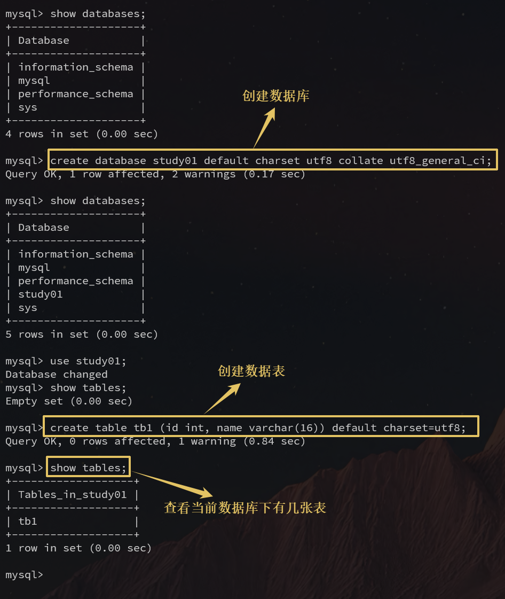

  ```sql
  create table tb2(
  	id int,
      name varchar(16) not null, --> 不允许为空
      email varchar(32) null, --> 允许为空(默认)
      age int
  ) default charset=utf8;
  ```

  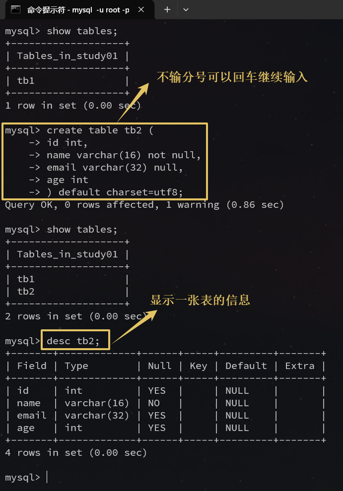

```sql
create table tb3(
	id int,
    name varchar(16) not null, --> 不允许为空
    email varchar(32) null, --> 允许为空(默认)
    age int default 3  --> 插入数据时，如果不给 age 列设置值，默认为 3
) default charset=utf8;
```

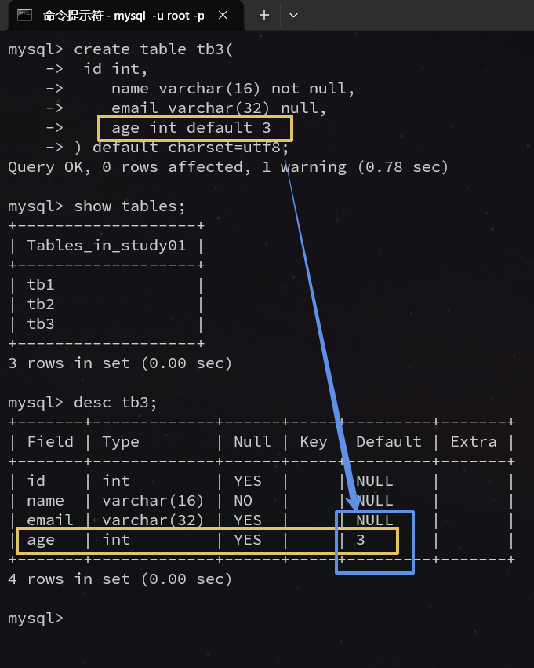

```sql
create table tb4(
	id int primary key,  --> 主键（不允许为空，不能重复）
    name varchar(16) not null, --> 不允许为空
    email varchar(32) null, --> 允许为空(默认)
    age int default 3  --> 插入数据时，如果不给 age 列设置值，默认为 3
) default charset=utf8;
```

主键一般用于表示当前这条数据的ID编号，需要我们自己来维护一个不重复的值，比较繁琐，所以，在数据库中一般会讲主键和自增组合；

```sql
create table tb4(
	id int not null auto_increment primary key,  -- 这是注释 `--`后面的会被注释
    name varchar(16) not null,
    email varchar(32) null,
    age int default 3
) default charset=utf8;
```

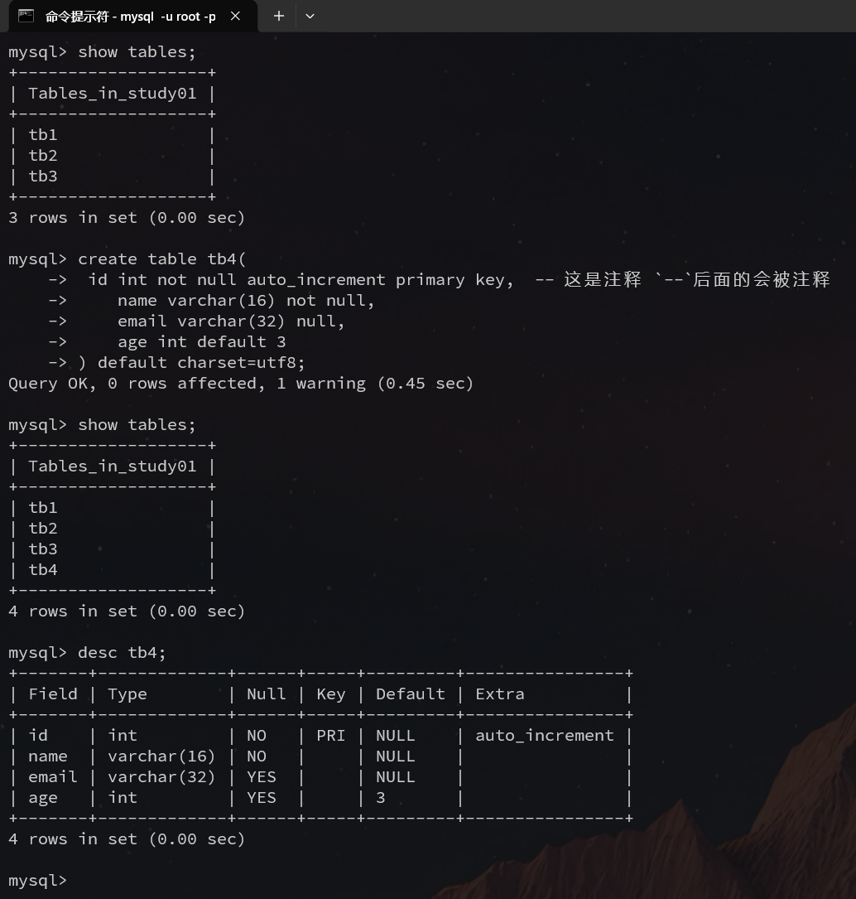

> [!Note]
>
> 注意：一张表中只能有一个自增列 【自增列，一般都是主键】

- 删除表 `drop table 表名;`
  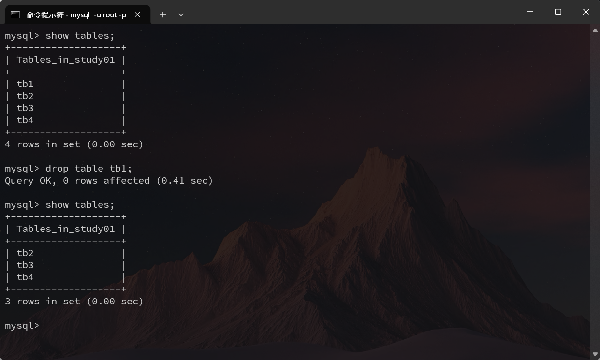

- 清空表 `delete from 表名;`  或者 `truncate table 表名;`(速度快，无法回滚撤销等)

  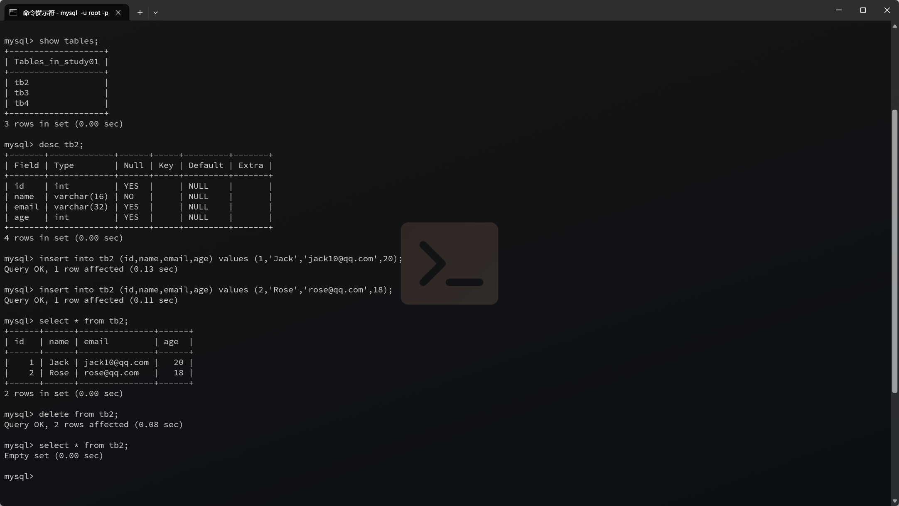

- 修改表

  - 添加列
    ```
    alter table 表名 add 列名 类型;
    alter table 表名 add 列名 类型 default 默认值;
    alter table 表名 add 列名 类型 not null default 默认值;
    alter table 表名 add 列名 类型 not null primary key auto_increment;
    ```

    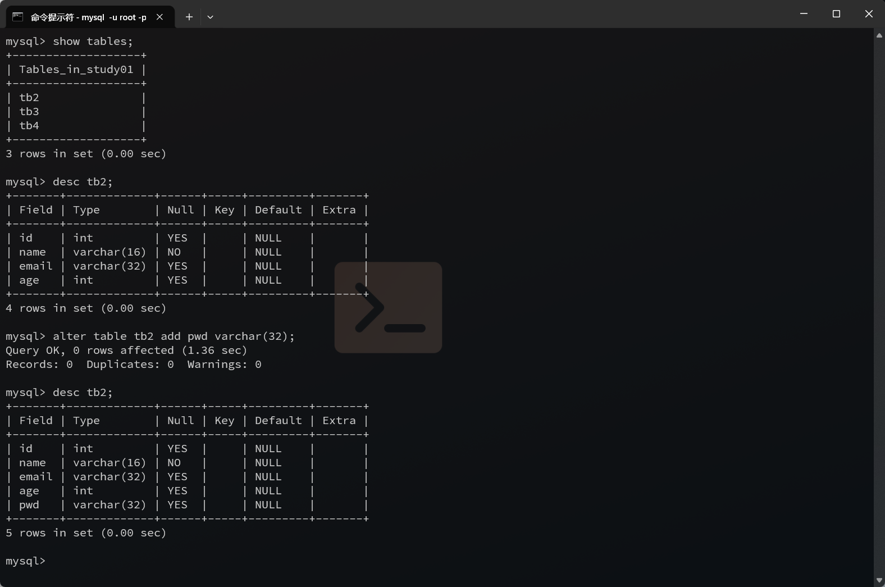

  - 删除列
    ```
    alter table 表名 drop column 列名;
    ```

  - 修改列 类型
    ```
    alter table 表名 modify column 列名 类型;
    ```

  - 修改列 类型 + 名称
    ```
    alter table 表名 change 原列名 新列名 新类型;
    ```

    ```
    alter table tb change id nid int not null;
    alter table tb change id id int not null default 5;
    alter table tb change id id int not null primary key auto_increment;
    alter table tb change id id int; -- 如果以前已经设置为不允许为空，有默认值，是自增，此命令：让其允许为空，删除默认值，删除自增
    ```

  - 修改列 默认值
    ```
    alter table 表名 alter 列名 set default 1000;
    ```

  - 删除列 默认值
    ```
    alter table 表名 alter 列名 drop default;
    ```

  - 添加主键
    ```
    alter table 表名 add primary key(列名);
    ```

  - 删除主键
    ```
    alter table 表名 drop primary key;
    ```

- 常见列的类型
  ```
  create table tb1(
  	id int,
      name varchar(16)
  ) default charset=utf8;
  ```

  - `int[(m)][unsigned][zerofill]`

    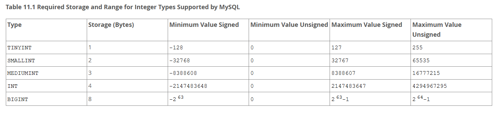

    ```
    int              表示有符号，取值范围 -21477483648 ~ 21477483647
    int unsigned     表示无符号，取值范围 0 ~ 42954967295
    int(5)zerofill   仅用于显示，当不足 5 位时，左边补 0，例如： 00002，当有 5 位时，正常显示
    ```

    ```
    mysql> create table L1 (id int, uid int unsigned, zid int(5)zerofill)default charset=utf8;
    Query OK, 0 rows affected, 3 warnings (0.45 sec)
    
    mysql> show tables;
    +-------------------+
    | Tables_in_study01 |
    +-------------------+
    | l1                |
    | tb2               |
    | tb3               |
    | tb4               |
    +-------------------+
    4 rows in set (0.00 sec)
    
    mysql> desc l1;
    +-------+--------------------------+------+-----+---------+-------+
    | Field | Type                     | Null | Key | Default | Extra |
    +-------+--------------------------+------+-----+---------+-------+
    | id    | int                      | YES  |     | NULL    |       |
    | uid   | int unsigned             | YES  |     | NULL    |       |
    | zid   | int(5) unsigned zerofill | YES  |     | NULL    |       |
    +-------+--------------------------+------+-----+---------+-------+
    3 rows in set (0.00 sec)
    
    mysql> insert into l1 (id,uid,zid) values (-123,10,2), (0,0,20000),(12,100,1234567);
    Query OK, 3 rows affected (0.14 sec)
    Records: 3  Duplicates: 0  Warnings: 0
    
    mysql> select * from l1;
    +------+------+---------+
    | id   | uid  | zid     |
    +------+------+---------+
    | -123 |   10 |   00002 |
    |    0 |    0 |   20000 |
    |   12 |  100 | 1234567 |
    +------+------+---------+
    3 rows in set (0.00 sec)
    
    mysql>
    ```

    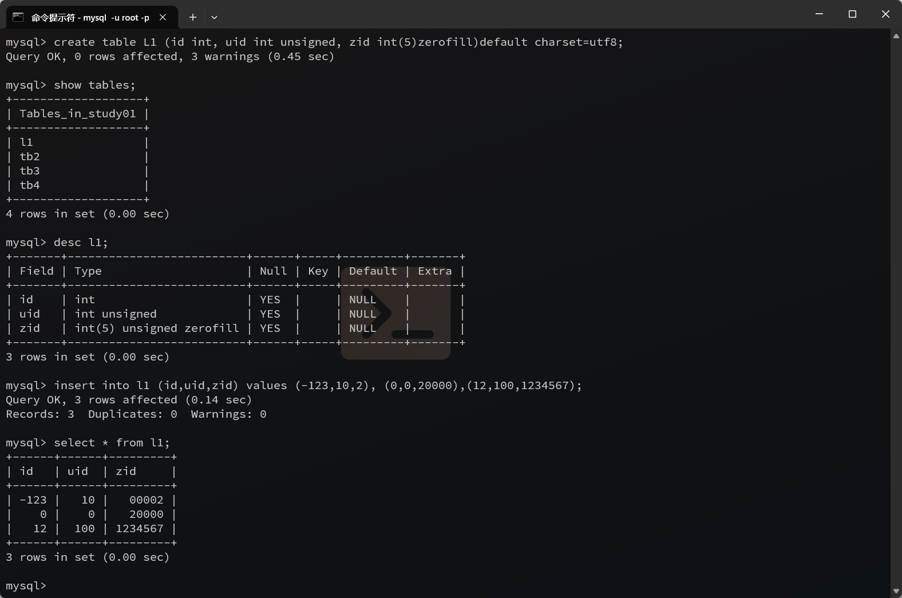

  - `tinyint[(m)][unsigned][zerofill]`

    ```
    tinyint              表示有符号，取值范围 -128 ~ 127
    tinyint unsigned     表示无符号，取值范围 0 ~ 255
    ```

  - `bigint[(m)][unsigned][zerofill]`

    ```
    bigint              表示有符号，取值范围 -.... ~ ....
    bigint unsigned     表示无符号，取值范围 0 ~ ........
    ```

  - `decimal[(m[,d])][unsigned][zerofill]`

    ```
    精确的小数值，m是数字总个数（负号不算），d 是小数点后位数，m 最大值为 65，d 最大值为 30。
    注意：小数部分位数超过后会自动四舍五入，但是整数部分超位数后会直接报错插不进去.
    
    例如：
    create table l2(
    	id int not null primary key auto_increment,
    	salary decimal(8, 2)
    ) default charset=utf8;
    ```

    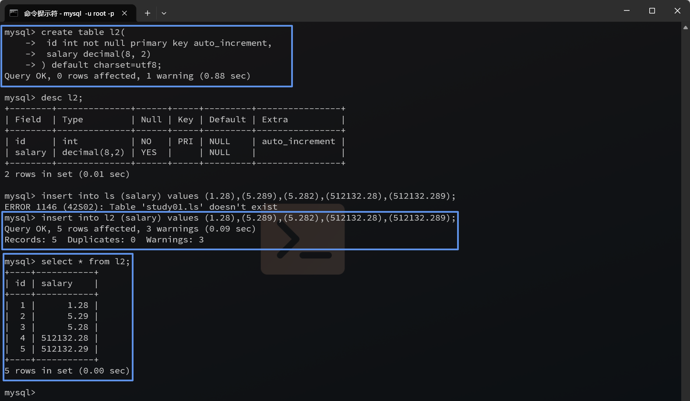

    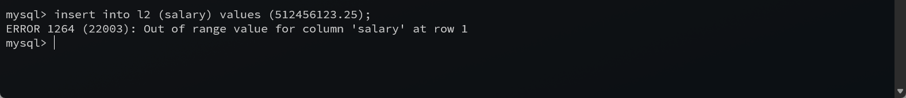

  - `float[(m,d)][unsigned][zerofill]` 32 bit

    ```
    单精度浮点数，非准确小数值，m是数字总个数，d是小数点后个数.
    ```

  - `double[(m,d)][unsigned][zerofill]` 64 bit

    ```
    双精度浮点数（非准确小数值），m是数字总个数，d是小数点后个数.
    ```

  - `char(m)`

    ```
    定长字符串，m代表字符串的长度，最多可容纳255个字符
    
    定长的体现：即使内容长度小于m，也会占用m长度，例如：char(5),数据是 yes，底层也会 占用 5 个字符，如果超出 m 长度限制，（默认MySQL是严格模式，会报错）。
    
    	如果在配置文件中加入如下配置：
    		sql-mode="NO_AUTO_CREATE_USER,NO_ENGINE_SUBSTITUTION"
        保存并重启，此时MySQL是非严格模式，此时超过长度会自动截断（不报错）.
        
    注意：默认底层存储是固定长度（不够则用空格补齐），但是查询数据时，会自动将空白去除，如果想要保留空白，在sql-mod中加入 PAD_CHAR_TO_FULL_LENGTH 即可。
    
    查看模式sql-mode：show variables like 'sql-mode';
    
    一般适用于：固定长度的内容。
    
    例如：
    create table l3(
    	id int not null auto_increment primary key,
        name varchar(5) not null,
        depart char(3)
    ) default charset=utf8;
    ```

    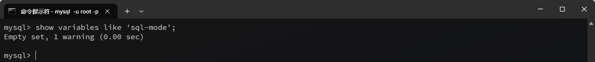

  - `varchar(m)`

    ```
    变长字符串，m代表字符串的长度，最多可容纳65535个字节。
    
    变长的体现：内容小于 m 时，会按照真实数据长度存储，如果超出m长度限制，（默认MySQL是严格模式，所以会报错）。
    	如果在配置中加入如下配置：
    		sql-mode="NO_AUTO_CREATE_USER,NO_ENGINE_SUBSTITUTION"
        保存并重启，此时MySQL是非严格模式，此时超过长度会自动截断（不报错）.
        
    例如：
    create table l3(
    	id int not null auto_increment primary key,
        name varchar(5) not null,
        depart char(3)
    ) default charset=utf8;
    ```

  - `text`

    ```
    text数据类型用于保存变长的大字符串，可以最多到 65535（2 ** 16 - 1）个字符
    
    一般情况下，长文本会用text类型，比如文章、新闻等。
    ```

    ```
    create table l4(
    	id int not null auto_increment primary key,
    	title varchar(128),
    	context text
    )default charset=utf8;
    ```

  - `mediumtext`

    ```
    最多可容纳16,777,215(2 ** 24 - 1)个字符
    ```

  - `longtext`

    ```
    最多可容纳4,294,967,295 or 4GB(2 ** 32 - 1) 个字符
    ```

  - `datetime`

    ```
    YYYY-MM-DD HH:MM:SS(1000-01-01 00:00:00 ~ 9999-12-31 23:59:59)
    ```

  - `timestamp`

    ```
    YYYY-MM-DD HH:MM:SS(1970-01-01 00:00:00 ~ 2037年)
    ```

    ```
    对于 timestamp，它把客户端插入的时间从当前时区转换为UTC(世界标准时间)进行存储，查询时，又将其转换为客户端当前时区进行返回。
    
    对于 datetime，不做任何改变，原样输入和输出。
    ```

    ```
    mysql> create table l5 (
        ->  id int not null auto_increment primary key,
        ->  dt datetime,
        ->  tt timestamp
        -> ) default charset=utf8;
    Query OK, 0 rows affected, 1 warning (1.00 sec)
    
    mysql> show tables;
    +-------------------+
    | Tables_in_study01 |
    +-------------------+
    | l1                |
    | l2                |
    | l5                |
    | tb2               |
    | tb3               |
    | tb4               |
    +-------------------+
    6 rows in set (0.00 sec)
    
    mysql> desc l5;
    +-------+-----------+------+-----+---------+----------------+
    | Field | Type      | Null | Key | Default | Extra          |
    +-------+-----------+------+-----+---------+----------------+
    | id    | int       | NO   | PRI | NULL    | auto_increment |
    | dt    | datetime  | YES  |     | NULL    |                |
    | tt    | timestamp | YES  |     | NULL    |                |
    +-------+-----------+------+-----+---------+----------------+
    3 rows in set (0.00 sec)
    
    mysql> insert into l5 (dt,tt) values ("2026-5-24 11:19:48", "2026-5-24 11:19:48"),("2000-01-01 00:00:00", "2000-01-01 00:00:00");
    Query OK, 2 rows affected (0.14 sec)
    Records: 2  Duplicates: 0  Warnings: 0
    
    mysql> select * from l5;
    +----+---------------------+---------------------+
    | id | dt                  | tt                  |
    +----+---------------------+---------------------+
    |  1 | 2026-05-24 11:19:48 | 2026-05-24 11:19:48 |
    |  2 | 2000-01-01 00:00:00 | 2000-01-01 00:00:00 |
    +----+---------------------+---------------------+
    2 rows in set (0.00 sec)
    
    mysql> show variables like '%time_zone%';
    +------------------+--------+
    | Variable_name    | Value  |
    +------------------+--------+
    | system_time_zone |        |
    | time_zone        | SYSTEM |
    +------------------+--------+
    2 rows in set, 1 warning (0.00 sec)
    -- "CST" 是指MySQL所在主机的系统时间，是中国标准时间的缩写，China Standard Time UT+8:00
    
    mysql> set time_zone='+0.00';
    Query OK, 0 rows affected (0.00 sec)
    ```

    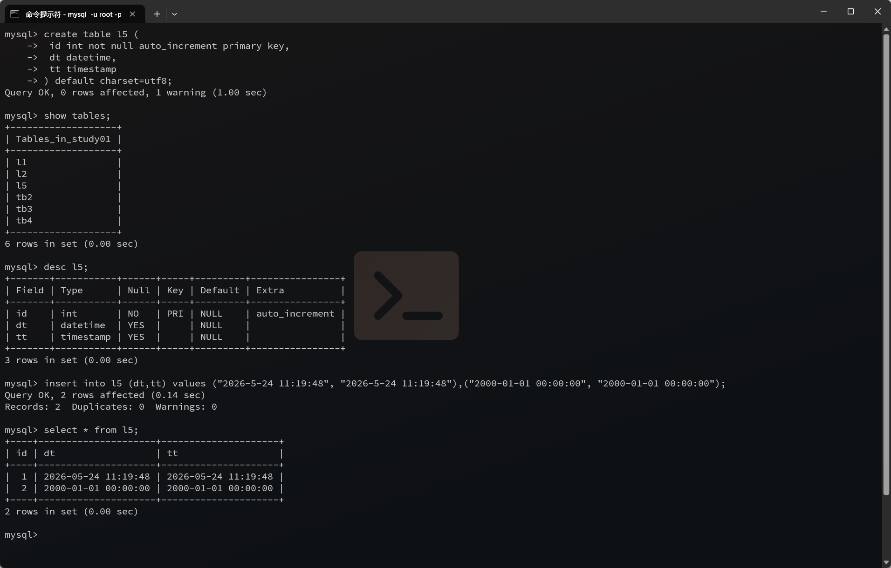

  - `date`

    ```
    YYYY-MM-DD(1000-01-01 ~ 9999-12-31)
    ```

  - `time`

    ```
    HH:MM:SS('-838:59:59' ~ '838:59:59')
    ```

上述就是关于数据表的一些基本操作。

`MySQL`还有很多其他的数据类型，例如 `set`，`enum`，`TinyBlob`，`MediumBlob`，`LongBlob`等，详见官方文档：

> `MySQL`数据类型参考： [Chapter 11 Data Types](https://dev.mysql.com/doc/refman/5.7/en/data-types.html)


...

### 1.3.2 Python代码操作

基于python去连接MySQL以后，想要进行数据库表的管理的话，发送的指令其实都是相同的。

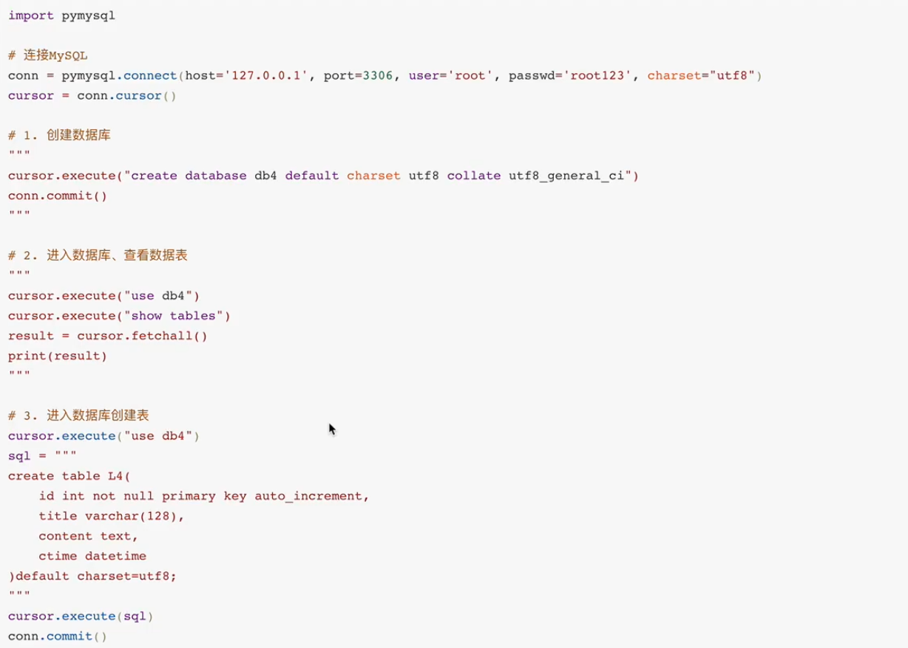

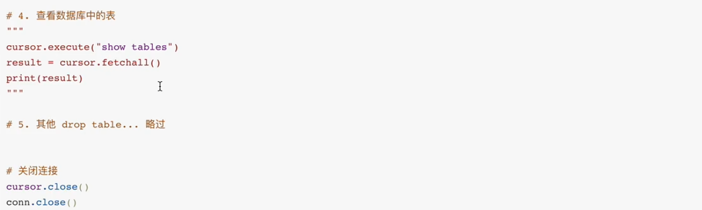

## 1.4 数据行管理

当数据库和数据表创建完成后，就需要对数据表中的内容进行增删改查了。


### 1.4.1 内置客户端操作

下面的命令需要记住！！！

数据行操作的相关`SQL`语句（指令）如下：

- 新增数据
  ```sql
  insert into 表名 (列名, 列名, 列名) values (对应的值, 对应的值, 对应的值);
  ```

  ```sql
  insert into tb1 (name, password) values ('jack', '123456');
  insert into tb1 (name, password) values ('jack', '123456'),('rose', '654321');
  insert into tb1 values ('jack', '123456'),('rose', '654321'); -- 如果数据表只有两列
  ```

- 删除数据
  ```sql
  delete from 表名; -- 删除表里的所有数据，但是不删除表
  delete from 表名 where 条件;
  ```

  ```sql
  delete from tb1; -- 删除表里的所有数据，但是不删除表
  delete from tb1 where name="jack";
  delete from tb1 where name="jack" and password="123456";
  delete from tb1 where id>9;
  ```

- 修改数据
  ```sql
  update 表名 set 列名=值;
  update 表名 set 列名=值 where 条件;
  ```

  ```sql
  update tb1 set name="Jordan";
  update tb1 set name="Jordan" where id=1;
  update tb1 set age=age+1 where id=2;  -- 整形
  update users set name=concat(name, "123") where id=2; -- concat，一个函数，用于拼接字符串
  ```

- 查询数据
  ```
  select * from 表名; -- 查询表中所有数据
  select 列名,列名 from 表名;
  select 列名,列名 as 别名,别名 from 表名; // 别名是查询出来的表头显示啥样
  select * from 表名 where 条件;
  ```

  ```
  select * from tb1;
  select id,name,age from tb1;
  select name,age as n,a from tb1;
  select name,age as n,a 111 from tb1;
  
  select * from tb1 where id=1;
  select * from tb1 where id>1;
  select * from tb1 where id!=1;
  select * from tb1 where id=1 and name="jack";
  ```

### 1.4.2 Python代码操作


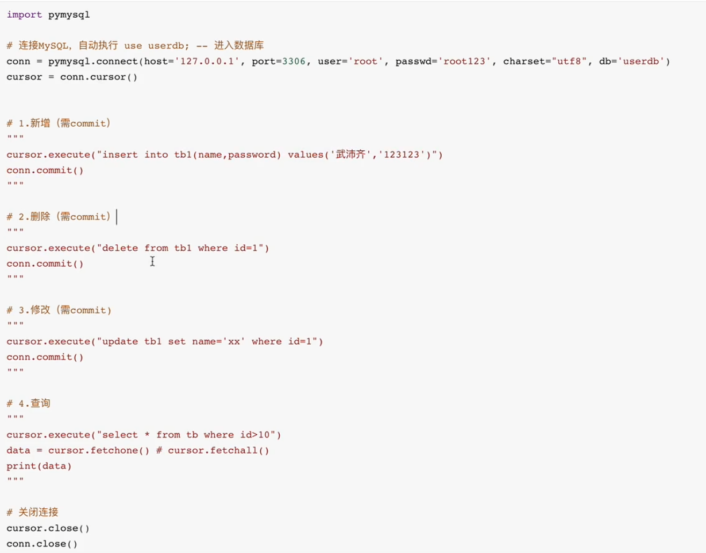

真正在做项目开发时，流程如下：

- 第一步：根据项目的功能设计相应的数据库和表结构（不会经常变动，在项目设计之初就确定好了）
- 第二步：操作表结构中 的数据，以达到实现业务逻辑的目的

例如：实现一个用户管理系统

先使用MySQL自带的客户端创建香瓜数据库和表结构（相当于先创建好Excel结构）

```
create database userdb default charset utf8 collate utf8_general_ci;
```

```sql
create table users(
	id int not null auto_increment primary key,
    name varchar(16),
    password varchar(16)
)default charset=utf8;
```

再在程序中执行编写相应的功能实现 注册、登录等功能。

```python
import pymysql


def register():
    user = input('请输入用户名')
    password = input('请输入密码')

    # 连接指定数据库
    conn = pymysql.connect(
        host='127.0.0.1',
        port=3306,
        user='root',
        password='123456',
        charset="utf8",
        database='userdb'
    )
    cursor = conn.cursor()

    # 执行SQL语句（有SQL注入风险，稍后讲解）
    sql = 'insert into users (name, password) values ("{}", "{}")'.format(user, password)
    cursor.execute(sql)
    conn.commit()

    # 关闭数据库连接
    cursor.close()
    conn.close()
	

def login():
    user = input('请输入用户名')
    password = input('请输入密码')

    # 连接指定数据库
    conn = pymysql.connect(
        host='127.0.0.1',
        port=3306,
        user='root',
        password='123456',
        charset="utf8",
        database='userdb'
    )
    cursor = conn.cursor()

    # 查询
    sql = 'select * from users where name="{}" and password="{}"'.format(user, password)
    cursor.execute(sql)
    
    result = cursor.fetchone()  # 如果没查到返回None 如果查到了，只返回第一条数据(1, 'jack', '123456')
    # result = cursor.fetchall()
    # print(result, type(result))  # 查到了：((1, 'jack', '123456'), ...) <class 'tuple'> 没查到：返回None
    
    # 关闭数据库连接
    cursor.close()
    conn.close()
    
    if result:
        print('登录成功')
    else:
        print('用户名或密码错误!')


def run():
    choice = input('1. 注册 2. 登录')
    if choice == '1':
        register()
    elif choice == '2':
        login()
    else:
        print('输入错误, 程序终止！')


if __name__ == '__main__':
    run()

```

```python
mysql> show databases;
+--------------------+
| Database           |
+--------------------+
| information_schema |
| mysql              |
| performance_schema |
| study01            |
| sys                |
+--------------------+
5 rows in set (0.00 sec)

mysql> create database userdb default charset utf8 collate utf8_general_ci;
Query OK, 1 row affected, 2 warnings (0.15 sec)

mysql> show databases;
+--------------------+
| Database           |
+--------------------+
| information_schema |
| mysql              |
| performance_schema |
| study01            |
| sys                |
| userdb             |
+--------------------+
6 rows in set (0.00 sec)

mysql> use userdb;
Database changed
mysql> show tables;
Empty set (0.00 sec)

mysql> create table users(
    ->  id int not null auto_increment primary key,
    ->     name varchar(16),
    ->     password varchar(16)
    -> )default charset=utf8;
Query OK, 0 rows affected, 1 warning (0.58 sec)

mysql> show tables;
+------------------+
| Tables_in_userdb |
+------------------+
| users            |
+------------------+
1 row in set (0.00 sec)

mysql> select * from users;
Empty set (0.00 sec)

mysql> select * from users;
Empty set (0.00 sec)

mysql> select * from users;
Empty set (0.00 sec)

mysql> select * from users;
+----+------+----------+
| id | name | password |
+----+------+----------+
|  1 | jack | 123456   |
+----+------+----------+
1 row in set (0.00 sec)

mysql> select * from users;
+----+------+----------+
| id | name | password |
+----+------+----------+
|  1 | jack | 123456   |
|  2 | rose | 654321   |
+----+------+----------+
2 rows in set (0.00 sec)

mysql>
```

在项目开发时，数据库建库和数据表建表的操作只需做一次，最最常写的还是对数据行的操作。

## 1.5 关于`SQL`注入

加入你开发了一个用户认证系统，应该用户登录成功才能正确的返回相应的用户结果。

```python
user = input('请输入用户名')
password = input('请输入密码')

# 连接指定数据库
conn = pymysql.connect(
    host='127.0.0.1',
    port=3306,
    user='root',
    password='123456',
    charset="utf8",
    database='userdb'
)
cursor = conn.cursor()

# 查询
sql = "select * from users where name='{}' and password='{}'".format(user, password)
cursor.execute(sql)

result = cursor.fetchone()  # 如果没查到返回None 如果查到了，只返回第一条数据(1, 'jack', '123456')
# result = cursor.fetchall()
# print(result, type(result))  # 查到了：((1, 'jack', '123456'), ...) <class 'tuple'> 没查到：返回None

# 关闭数据库连接
cursor.close()
conn.close()

if result:
    print('登录成功')
else:
    print('用户名或密码错误!')
```

> [!Warning] 
>
> ⚠️ 如果此时用户输入 `" or 1=1 -- `，这样即使用户输入的密码不正确，也可以通过验证
>
> 因为在SQL拼接时，拼接后的结果为：
>
> ```python
> select * from users where name='' or 1=1 -- ' and password="随便输的密码"
> ```
>
> 注意：在MySQL中，`--` 表示注释
>
> 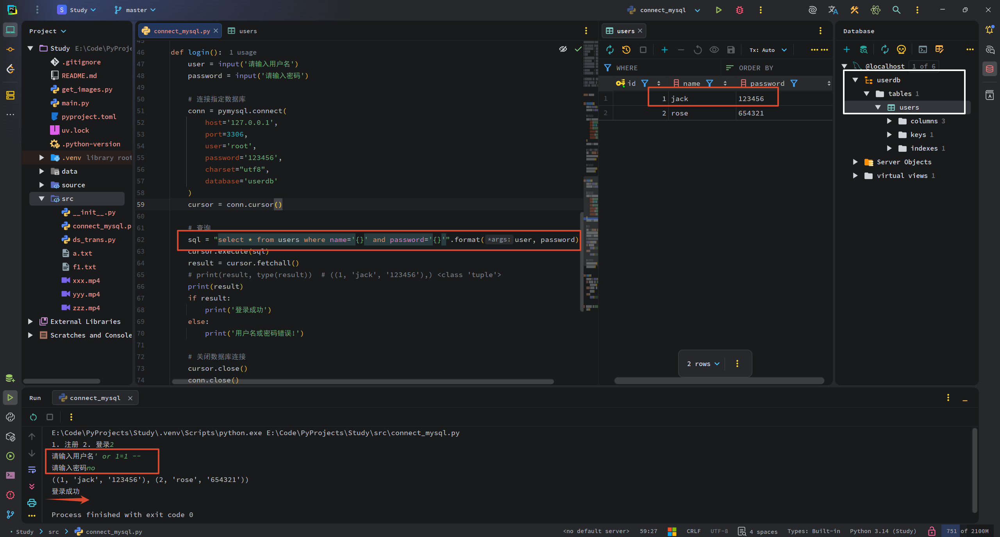
>
> 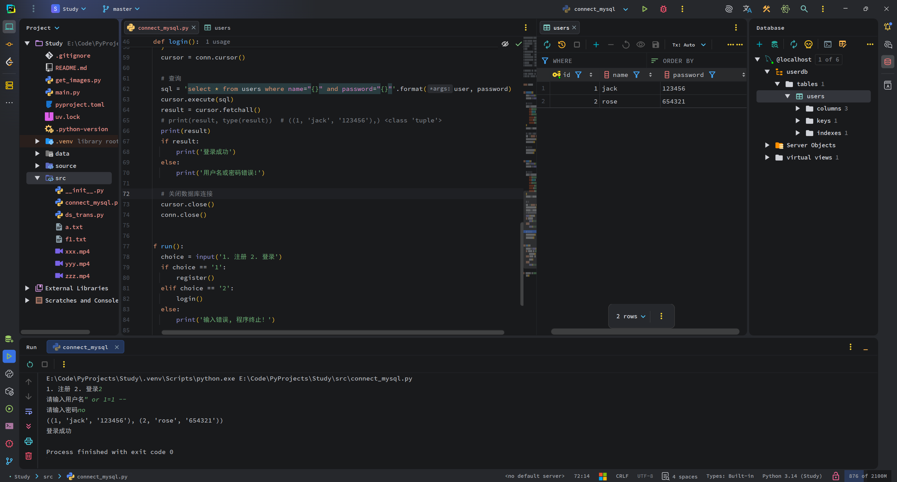

那么如何在python开发中避免`SQL`注入呢？

> [!Important]
>
> ⚠️ 切记：`SQL`语句不要在使用`Python`中的字符串格式化，而是使用`pymysql`的`execute`方法.
>
> ```python
> user = input('请输入用户名')
> password = input('请输入密码')
> 
> # 连接指定数据库
> conn = pymysql.connect(
>     host='127.0.0.1',
>     port=3306,
>     user='root',
>     password='123456',
>     charset="utf8",
>     database='userdb'
> )
> cursor = conn.cursor()
> 
> # 查询
> sql = "select * from users where name=%s and password=%s"
> cursor.execute(sql, (name, password))
> 
> result = cursor.fetchone()  # 如果没查到返回None 如果查到了，只返回第一条数据(1, 'jack', '123456')
> # result = cursor.fetchall()
> # print(result, type(result))  # 查到了：((1, 'jack', '123456'), ...) <class 'tuple'> 没查到：返回None
> 
> # 关闭数据库连接
> cursor.close()
> conn.close()
> 
> if result:
>     print('登录成功')
> else:
>     print('用户名或密码错误!')
> ```
>
> 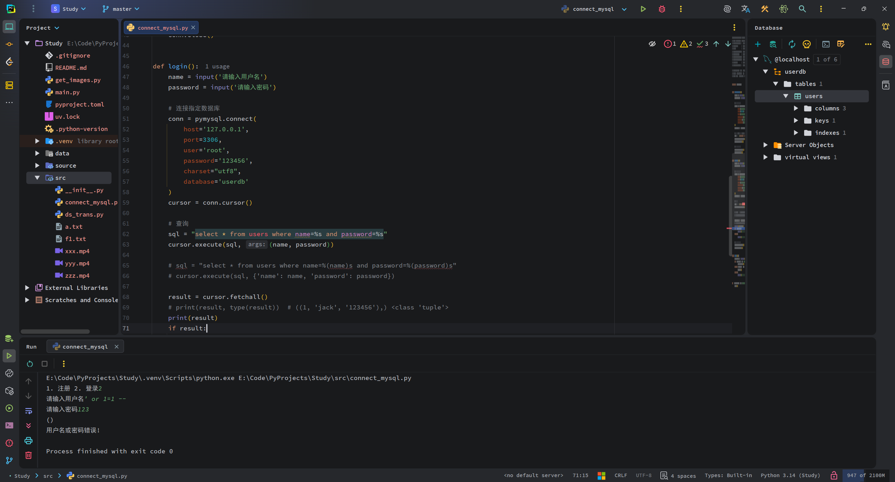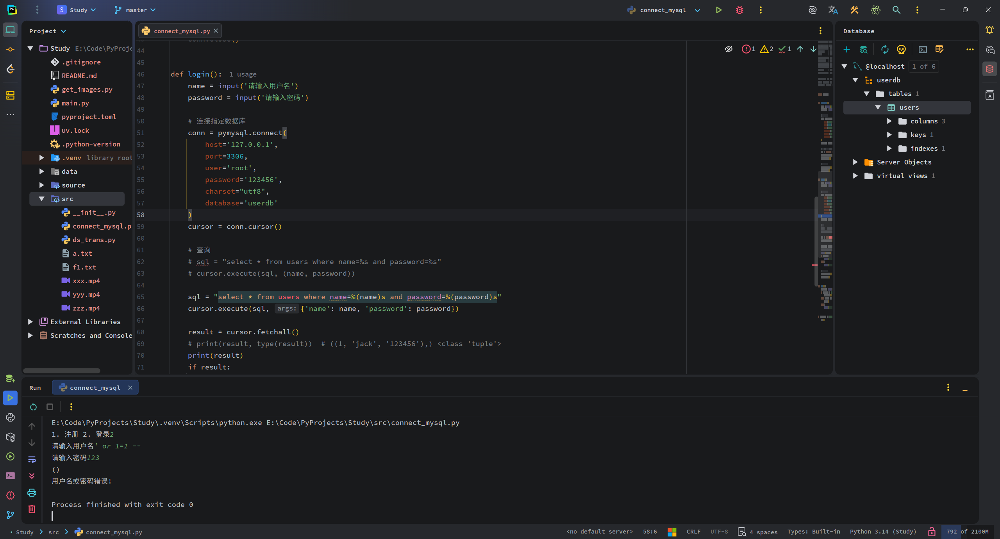

## 1.6 总结


# day-02 必备`SQL`和授权

课程目标：掌握开发中最常见的SQL语句和表关系及授权相关知识点。

今日概要：

- 必备`SQL`（8个必备）
- 表关系
- 授权

## 2.1 必备`SQL`-数据准备

上节是最基础的SQL语句：增删改查，在日常开发中还有很多必备的SQL语句。

这一部分的SQL语句是围绕着对表中的数据进行操作的。


提示：今天所有的操作都只在MySQL客户端进行操作。


例如，现在创建如下两张表。


```sql
create database day02 default charset utf8 collate utf8_general_ci;
```

```sql
create table depart (
	id int not null primary key auto_increment,
    title varchar(16) not null
)default charset=utf8;

create table info (
	id int not null auto_increment primary key,
    name varchar(16) not null,
    email varchar(32) not null,
    age int,
    depart_id int
)default charset=utf8;
```

```sql
insert into depart(title) values('开发'),('运营'),('销售');

insert into info (name,email,age,depart_id) values ("jack", "jack@live.com", 19, 2);
insert into info (name,email,age,depart_id) values ("rose", "rose@live.com", 20, 1);
insert into info (name,email,age,depart_id) values ("jordan", "jordan@live.com", 15, 3);
insert into info (name,email,age,depart_id) values ("green", "green@live.com", 32, 3);
insert into info (name,email,age,depart_id) values ("jenny", "jenny@live.com", 25, 1);
insert into info (name,email,age,depart_id) values ("liming", "liming@live.com", 18, 2);
insert into info (name,email,age,depart_id) values ("xiaoming", "xiaoming@live.com", 20, 1);
```

----

```sql
mysql> create database day02 default charset utf8 collate utf8_general_ci;
Query OK, 1 row affected, 2 warnings (0.19 sec)

mysql> show databases;
+--------------------+
| Database           |
+--------------------+
| day02              |
| information_schema |
| mysql              |
| performance_schema |
| study01            |
| sys                |
| userdb             |
+--------------------+
7 rows in set (0.00 sec)

mysql> use day02;
Database changed
mysql> show tables;
Empty set (0.00 sec)

mysql> create table depart (
    ->  id int not null primary key auto_increment,
    ->     title varchar(16) not null
    -> )default charset=utf8;
Query OK, 0 rows affected, 1 warning (1.01 sec)

mysql> create table info (
    ->  id int not null auto_increment primary key,
    ->     name varchar(16) not null,
    ->     email varchar(32) not null,
    ->     age int,
    ->     depart_id int
    -> )default charset=utf8;
Query OK, 0 rows affected, 1 warning (0.89 sec)

mysql> show tables;
+-----------------+
| Tables_in_day02 |
+-----------------+
| depart          |
| info            |
+-----------------+
2 rows in set (0.00 sec)

mysql> desc depart;
+-------+-------------+------+-----+---------+----------------+
| Field | Type        | Null | Key | Default | Extra          |
+-------+-------------+------+-----+---------+----------------+
| id    | int         | NO   | PRI | NULL    | auto_increment |
| title | varchar(16) | NO   |     | NULL    |                |
+-------+-------------+------+-----+---------+----------------+
2 rows in set (0.00 sec)

mysql> insert into depart(title) values('开发'),('运营'),('销售');
Query OK, 3 rows affected (0.13 sec)
Records: 3  Duplicates: 0  Warnings: 0

mysql> select * from depart;
+----+--------+
| id | title  |
+----+--------+
|  1 | 开发   |
|  2 | 运营   |
|  3 | 销售   |
+----+--------+
3 rows in set (0.00 sec)

mysql> desc info;
+-----------+-------------+------+-----+---------+----------------+
| Field     | Type        | Null | Key | Default | Extra          |
+-----------+-------------+------+-----+---------+----------------+
| id        | int         | NO   | PRI | NULL    | auto_increment |
| name      | varchar(16) | NO   |     | NULL    |                |
| email     | varchar(32) | NO   |     | NULL    |                |
| age       | int         | YES  |     | NULL    |                |
| depart_id | int         | YES  |     | NULL    |                |
+-----------+-------------+------+-----+---------+----------------+
5 rows in set (0.00 sec)

mysql> insert into info (name,email,age,depart_id) values ("jack", "jack@live.com", 19, 2);
Query OK, 1 row affected (0.12 sec)

mysql> insert into info (name,email,age,depart_id) values ("rose", "rose@live.com", 20, 1);
Query OK, 1 row affected (0.31 sec)

mysql> insert into info (name,email,age,depart_id) values ("jordan", "jordan@live.com", 15, 3);
Query OK, 1 row affected (0.08 sec)

mysql> insert into info (name,email,age,depart_id) values ("green", "green@live.com", 32, 3);
Query OK, 1 row affected (0.11 sec)

mysql> insert into info (name,email,age,depart_id) values ("jenny", "jenny@live.com", 25, 1);
Query OK, 1 row affected (0.11 sec)

mysql> insert into info (name,email,age,depart_id) values ("liming", "liming@live.com", 18, 2);
Query OK, 1 row affected (0.12 sec)

mysql> insert into info (name,email,age,depart_id) values ("xiaoming", "xiaoming@live.com", 20, 1);
Query OK, 1 row affected (0.08 sec)

mysql> select * from info;
+----+----------+-------------------+------+-----------+
| id | name     | email             | age  | depart_id |
+----+----------+-------------------+------+-----------+
|  1 | jack     | jack@live.com     |   19 |         2 |
|  2 | rose     | rose@live.com     |   20 |         1 |
|  3 | jordan   | jordan@live.com   |   15 |         3 |
|  4 | green    | green@live.com    |   32 |         3 |
|  5 | jenny    | jenny@live.com    |   25 |         1 |
|  6 | liming   | liming@live.com   |   18 |         2 |
|  7 | xiaoming | xiaoming@live.com |   20 |         1 |
+----+----------+-------------------+------+-----------+
7 rows in set (0.00 sec)

mysql>
```

### 2.1.1 条件

根据条件搜索结果


```sql
select * from info where id > 1;
select * from info where id = 1;
select * from info where id >= 1;
select * from info where id != 1;
select * from info where id between 2 and 4; -- 2 <= id <= 4
```

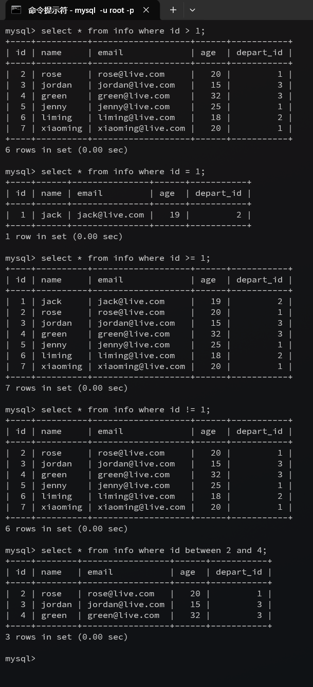

```sql
select * from info where name="jack" and age=19;
select * from info where name="rose" or age=20;
select * from info where name="rose" or age=18;
select * from info where (name="jack" or email="jordan@live.com") and age=15;
```

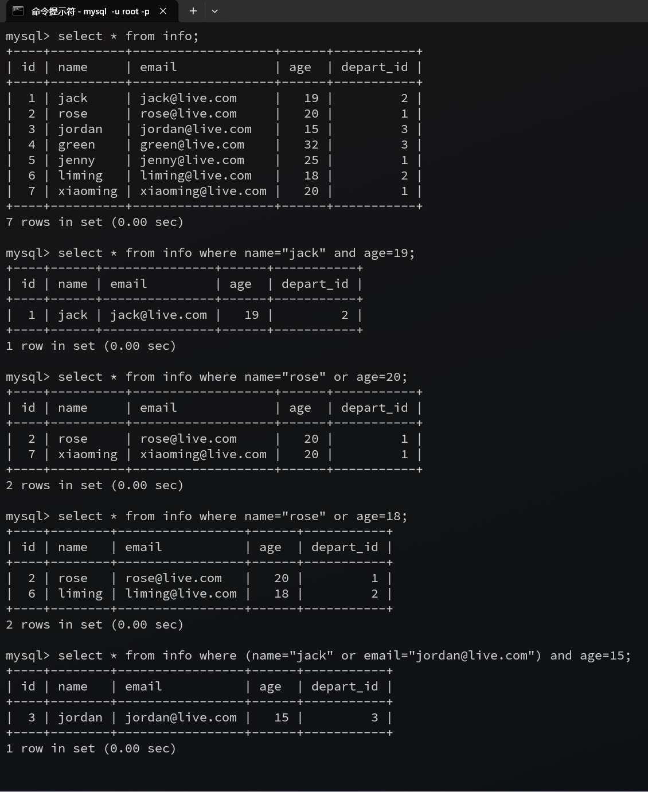

```sql
select * from info where id in (1,4,6);
select * from info where id not in (1,4,6);

select * from info where id in (select id from depart);  -- 子查询
# select * from info where id in (1,2,3);

# 去查 id=5是否存在，如果存在，则搜索，否则不搜索
select * from info where exists(select * from depart where id=5);  -- 当条件成立时查 不成立时不查

# 和上面一条刚好相反
select * from info where not exists(select * from depart where id=5);
```


```sql
select * from (select * from info where id>5) as T where T.age > 10;
select * from (select * from info where id>5) as T where age > 10;
```

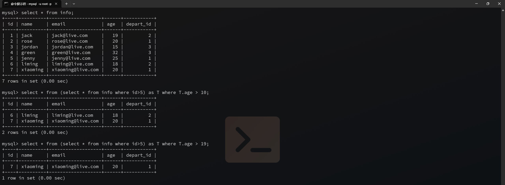

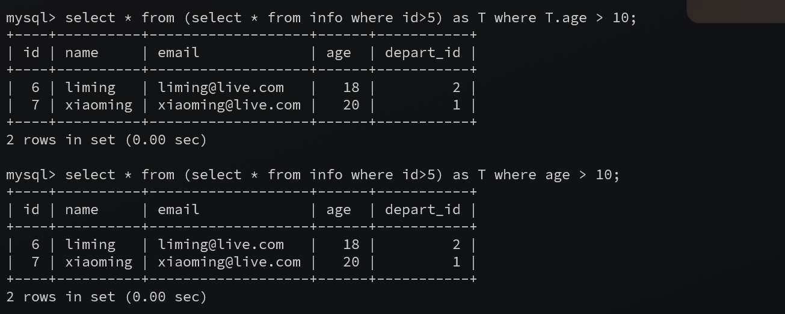

```sql
select * from info where info.id > 5;
```

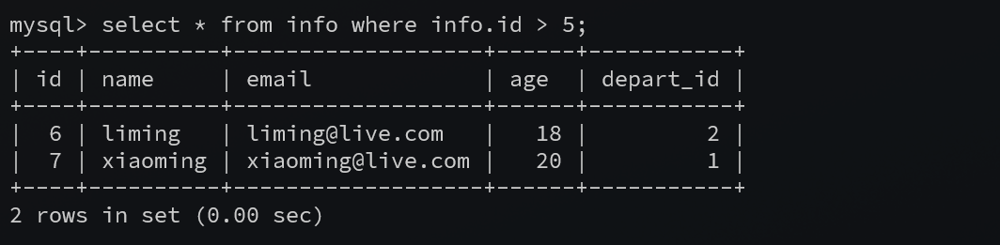

```sql
select * from info, depart where info.id > 5;
select * from info, depart where info.id > 5 and depart.id > 1;
```

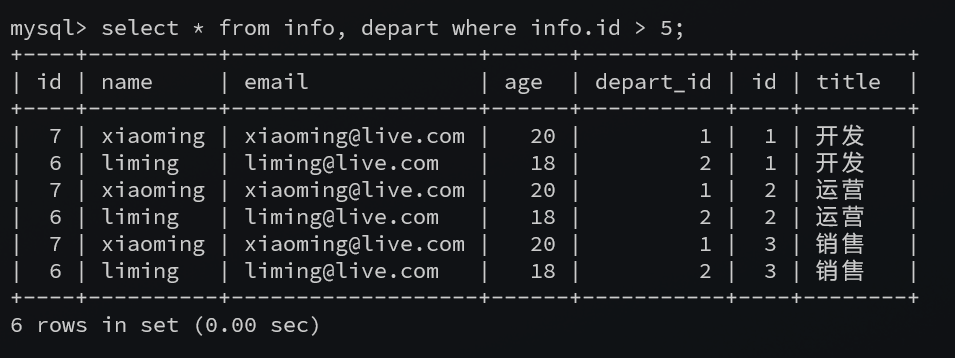

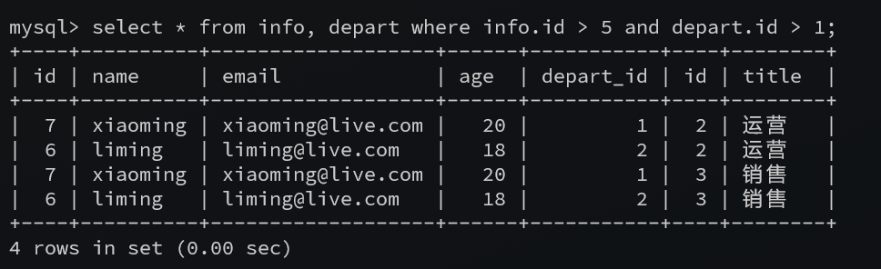

### 2.1.2 通配符

- `%`: n个字符
- `_`: 1个字符

```sql
select * from info where name like "%ac%";
select * from info where name like "%ack";
select * from info where name like "%ac";
select * from info where email like "%@live.com";
select * from info where name like "gr%n";
select * from info where name like "j%n";
select * from info where email like "xiaoming%";

------------------------------------------------------------
mysql> select * from info where name like "%ac%";
+----+------+---------------+------+-----------+
| id | name | email         | age  | depart_id |
+----+------+---------------+------+-----------+
|  1 | jack | jack@live.com |   19 |         2 |
+----+------+---------------+------+-----------+
1 row in set (0.00 sec)

mysql> select * from info where name like "%ack";
+----+------+---------------+------+-----------+
| id | name | email         | age  | depart_id |
+----+------+---------------+------+-----------+
|  1 | jack | jack@live.com |   19 |         2 |
+----+------+---------------+------+-----------+
1 row in set (0.00 sec)

mysql> select * from info where name like "%ac";
Empty set (0.00 sec)

mysql> select * from info where email like "%@live.com";
+----+----------+-------------------+------+-----------+
| id | name     | email             | age  | depart_id |
+----+----------+-------------------+------+-----------+
|  1 | jack     | jack@live.com     |   19 |         2 |
|  2 | rose     | rose@live.com     |   20 |         1 |
|  3 | jordan   | jordan@live.com   |   15 |         3 |
|  4 | green    | green@live.com    |   32 |         3 |
|  5 | jenny    | jenny@live.com    |   25 |         1 |
|  6 | liming   | liming@live.com   |   18 |         2 |
|  7 | xiaoming | xiaoming@live.com |   20 |         1 |
+----+----------+-------------------+------+-----------+
7 rows in set (0.00 sec)

mysql> select * from info where name like "gr%n";
+----+-------+----------------+------+-----------+
| id | name  | email          | age  | depart_id |
+----+-------+----------------+------+-----------+
|  4 | green | green@live.com |   32 |         3 |
+----+-------+----------------+------+-----------+
1 row in set (0.00 sec)

mysql> select * from info where name like "j%n";
+----+--------+-----------------+------+-----------+
| id | name   | email           | age  | depart_id |
+----+--------+-----------------+------+-----------+
|  3 | jordan | jordan@live.com |   15 |         3 |
+----+--------+-----------------+------+-----------+
1 row in set (0.00 sec)

mysql> select * from info where email like "xiaoming%";
+----+----------+-------------------+------+-----------+
| id | name     | email             | age  | depart_id |
+----+----------+-------------------+------+-----------+
|  7 | xiaoming | xiaoming@live.com |   20 |         1 |
+----+----------+-------------------+------+-----------+
1 row in set (0.00 sec)

mysql>
```

```sql
select * from info where email like "_@live.com";
select * from info where email like "_ack@live.com";
select * from info where email like "__aoming@live.com";
select * from info where email like "__aomi__%";

---------------------------------------------------------------
mysql> select * from info where email like "_@live.com";
Empty set (0.00 sec)

mysql> select * from info where email like "_ack@live.com";
+----+------+---------------+------+-----------+
| id | name | email         | age  | depart_id |
+----+------+---------------+------+-----------+
|  1 | jack | jack@live.com |   19 |         2 |
+----+------+---------------+------+-----------+
1 row in set (0.00 sec)

mysql> select * from info where email like "__aoming@live.com";
+----+----------+-------------------+------+-----------+
| id | name     | email             | age  | depart_id |
+----+----------+-------------------+------+-----------+
|  7 | xiaoming | xiaoming@live.com |   20 |         1 |
+----+----------+-------------------+------+-----------+
1 row in set (0.00 sec)

mysql> select * from info where email like "__aomi__%";
+----+----------+-------------------+------+-----------+
| id | name     | email             | age  | depart_id |
+----+----------+-------------------+------+-----------+
|  7 | xiaoming | xiaoming@live.com |   20 |         1 |
+----+----------+-------------------+------+-----------+
1 row in set (0.00 sec)

mysql>
```

注意：数据量小，可以像上面这样写，但是数据量大就不行了。

### 2.1.3 映射

获取想要的列。

```sql
select *                   from info;
select id,name             from info;
select id as I, name as N  from info;
select id, name as N, 123   from info;

注意：以后写 select 语句少写 select *, 而是根据业务需求想要哪个查找哪个
```

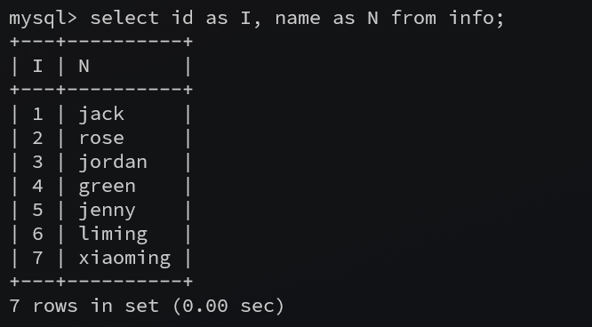

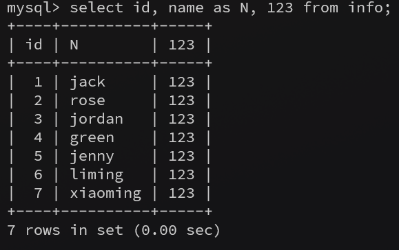

```sql
select 
	id,
	name,
	666 as num,
	(select max(id) from depart) as maxid, -- max/min/sum   映射
	(select min(id) from depart) as minid, -- max/min/sum   映射
	age
from info;
```

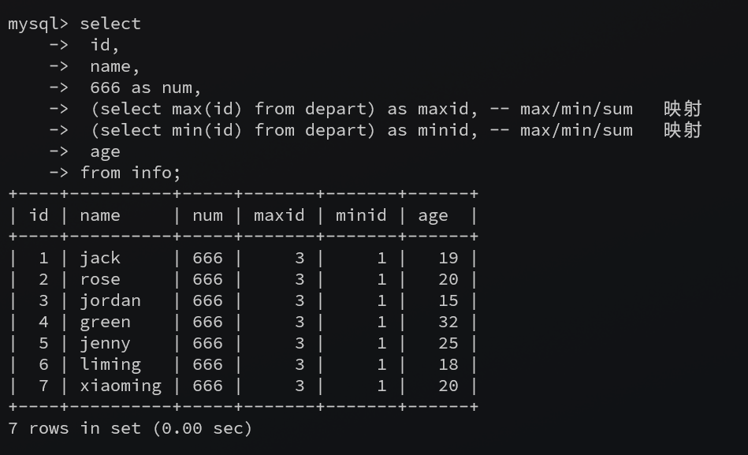

```sql
select
	id,
	name,
	(select title from depart where depart.id=info.depart_id) as x1
from info; -- 效率很低
```

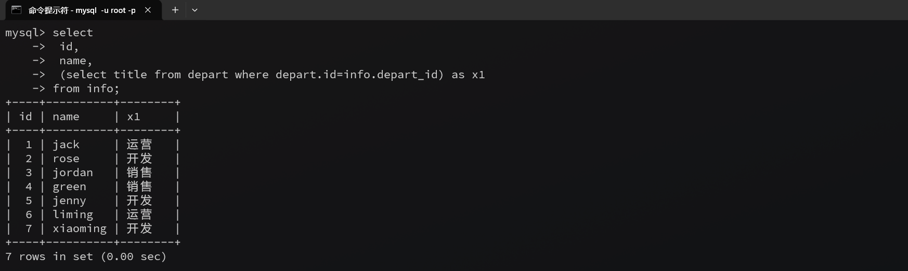

```sql
select
	id,
	name,
	(select title from depart where depart.id=info.depart_id) as x1,
	(select title from depart where depart.id=info.id) as x2
from info;
```

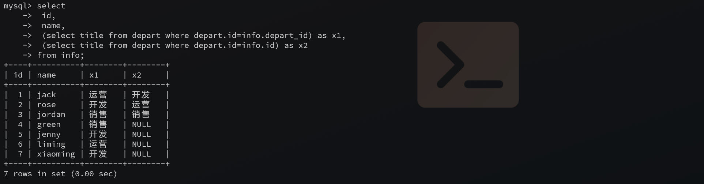

```sql
select 
	id,
	name,
	case depart_id when 1 then "第1部门" end v1
from info;
```

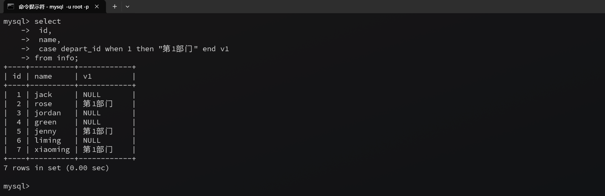

```sql
select 
	id,
	name,
	case depart_id when 1 then "第1部门" else "其他" end v2
from info;
```

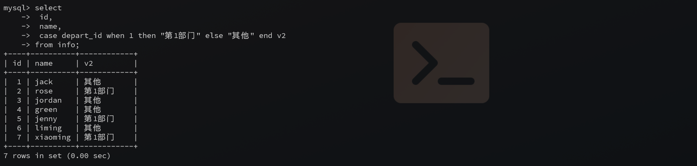

```sql
select 
	id,
	name,
	case depart_id when 1 then "第1部门" end v1,
	case depart_id when 1 then "第1部门" else "其他" end v2,
	case depart_id when 1 then "第1部门" when 2 then "第2部门" else "其他" end v3,
	case when age<18 then "少年" end v4,
	case when age<18 then "少年" else "壮年" end v5,
	case when age<18 then "少年" when age<30 then "青年" else "壮年" end v6
from info;
```

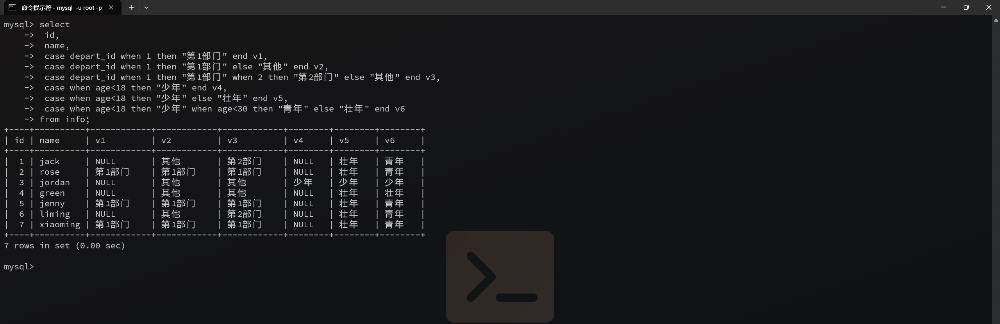

### 2.1.4 排序


```sql
select * from info order by age desc;
select * from info order by age asc;
```

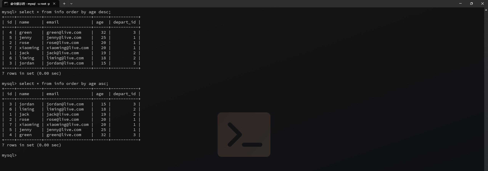

```sql
select * from info order by id desc;
select * from info order by id asc;
```

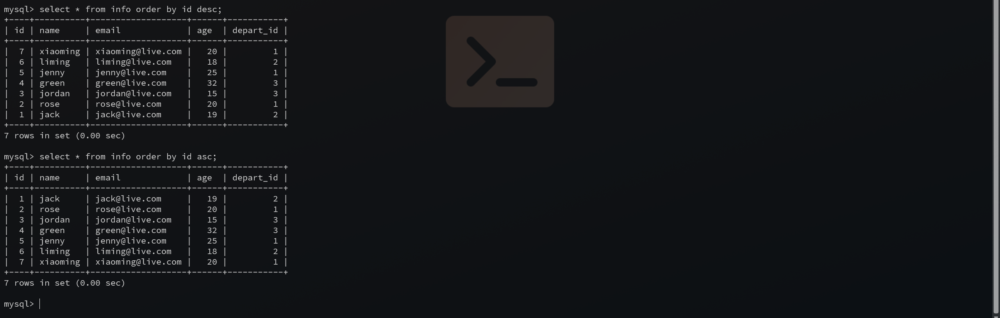

```sql
select * from info order by age asc, id desc; -- 先按照age从小到大排 如果age相同，按照id从小到大排
select * from info where id > 5 order by age asc, id desc;
select * from info where id > 3 or name like "%n" order by age asc, id desc;
```

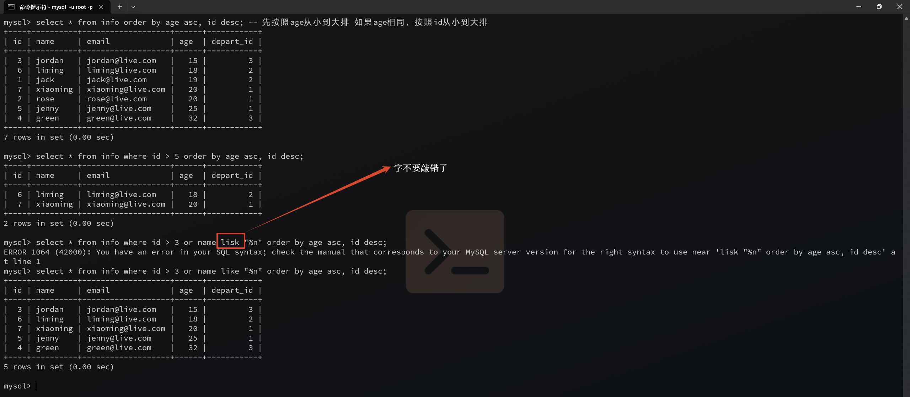

### 2.1.5 取部分(`LIMIT`)

一般用于获取部分数据


```sql
select * from info limit 5;                                 -- 获取前5条数据
select * from info order by id desc limit 3;                -- 先排序，再获取前3条数据
select * from info where id > 2 order by id desc limit 3;   -- 先排序，再获取前3条数据
```

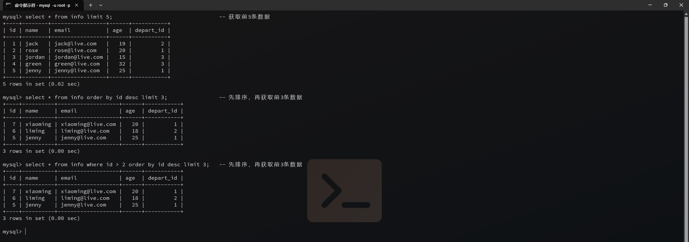

```sql
select * from info  limit 3 offset 2; -- 从位置 2(相当于列表中的下标, 第一条数据的下标是0) 开始，向后获取三条数据
```

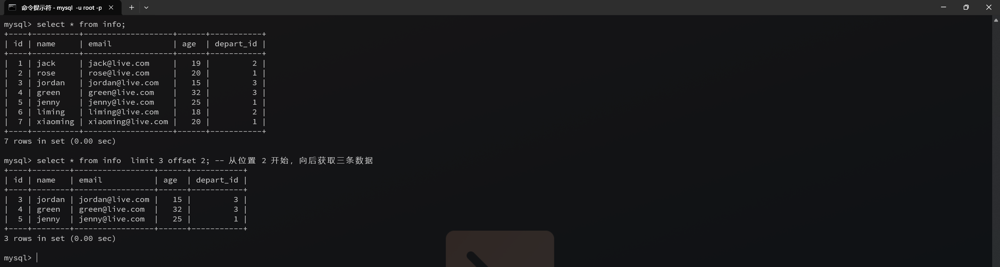

数据库表中，1000条数据，

- 第一页：`select * from info limit 10 offset 0;`
- 第二页：`select * from info limit 10 offset 10;`
- 第三页：`select * from info limit 10 offset 20;`
- ...

### 2.1.6 分组


```sql
select age,max(id),min(id),sum(id),count(id),avg(id) as 平均值 from info group by age;
select age,count(1) from info group by age;
```

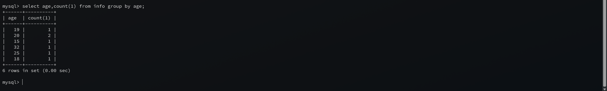

```sql
select depart_id,count(1) from info group by depart_id;
```

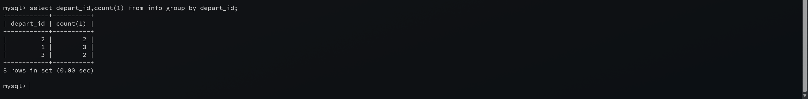

```sql
select depart_id,count(1) from info group by depart_id having count(id) > 2; -- 找部门人数超过 2 的部门
```

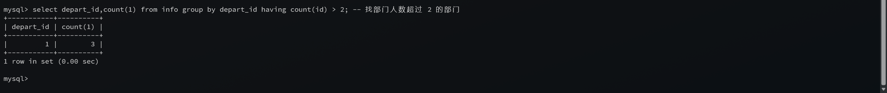

```sql
select age,max(id),min(id),sum(id),count(id) from info group by age; -- 根据年龄分组
```

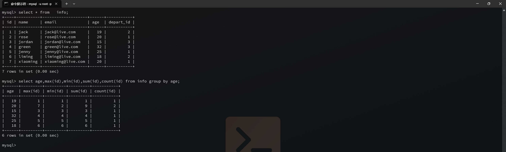

----

```sql
select age,name from info group by age; -- 不建议
```

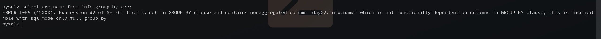

```markdown
解决方案
你有两种解决思路：修改 SQL 语句（推荐，符合标准 SQL 规范）或 修改 MySQL 配置（治标不治本）。

方案一：修改 SQL 语句（推荐）
根据你的实际业务需求，修改查询方式：

1. 如果你只想随便取一个 name（不管是谁）：使用 ANY_VALUE()
ANY_VALUE() 会告诉 MySQL：“我知道有多个name，你随便给我返回一个就行，我不在乎。”


SELECT age, ANY_VALUE(name) FROM info GROUP BY age;
2. 如果你想把同一个 age 的所有 name 拼接起来显示：使用 GROUP_CONCAT()
这会返回类似 20 | 张三,李四,王五 的结果。


SELECT age, GROUP_CONCAT(name) FROM info GROUP BY age;
3. 如果你想取每个 age 下某个特定条件的 name：配合聚合函数使用
比如，取每个年龄下名字最长的人，或者ID最大的人：


-- 取ID最大的那个人的name
SELECT age, MAX(name) FROM info GROUP BY age; 
4. 如果你其实想按 age 和 name 一起分组：把 name 也加到 GROUP BY 中


SELECT age, name FROM info GROUP BY age, name;
方案二：关闭 MySQL 的 ONLY_FULL_GROUP_BY 模式
如果你维护的是老项目，修改 SQL 代价太大，可以把这个严格模式关掉。关闭后，MySQL 就会随便挑一个 name 返回给你，不再报错。

1. 临时修改（重启 MySQL 后失效）
在 MySQL 命令行中执行：


SET SESSION sql_mode = 'STRICT_TRANS_TABLES,NO_ZERO_IN_DATE,NO_ZERO_DATE,ERROR_FOR_DIVISION_BY_ZERO,NO_ENGINE_SUBSTITUTION';
-- 或者直接移除 ONLY_FULL_GROUP_BY
SET GLOBAL sql_mode = (SELECT REPLACE(@@sql_mode, 'ONLY_FULL_GROUP_BY', ''));
执行后退出当前会话，重新登录即可生效。

2. 永久修改（重启依然生效）

找到 MySQL 的配置文件（Linux 一般是 /etc/my.cnf 或 /etc/mysql/my.cnf，Windows 一般是 my.ini）。
找到 [mysqld] 下方关于 sql_mode 的配置。
将 ONLY_FULL_GROUP_BY 从字符串中删除。如果没有这行配置，手动加上：

    [mysqld]
    sql_mode=STRICT_TRANS_TABLES,NO_ZERO_IN_DATE,NO_ZERO_DATE,ERROR_FOR_DIVISION_BY_ZERO,NO_ENGINE_SUBSTITUTION
保存文件，重启 MySQL 服务。
💡 建议
强烈建议使用方案一来修改 SQL 语句。ONLY_FULL_GROUP_BY 的存在是有意义的，它可以避免你写出逻辑有漏洞的 SQL，返回你预期之外的数据。关闭严格模式虽然能跑通，但查出来的 name 是随机的，可能会隐藏业务 Bug。
```

---

```sql
select * from info where id in (select max(id) from info group by age);
```

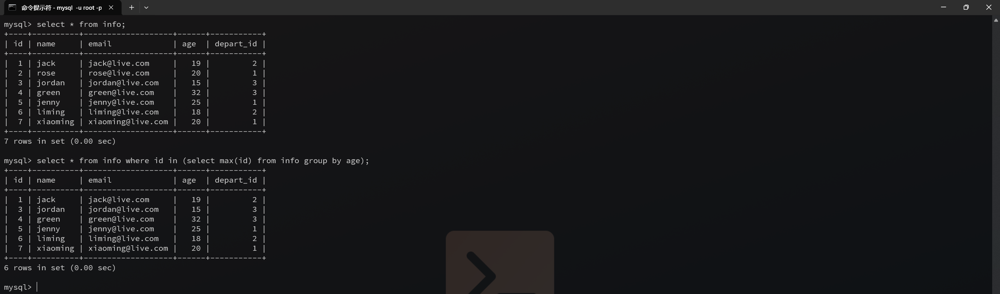

```sql
select age,count(id) from info group by age having count(id) > 2;
```

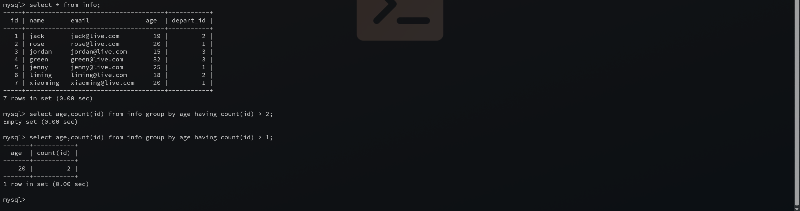

```sql
select age,count(id) from info where id > 1 group by age having count(id) > 2; -- 聚合条件放在 having 后面
```

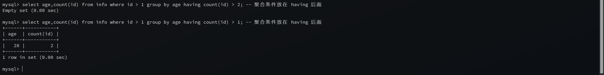

```sql
到目前为止SQL执行顺序：
    where
    group by
    having
    order by
    limit
```

```sql
select age,count(id) from info where id > 2 group by age having count(id) > 1 order by age desc limit 1;
- 要查询的表 info
- 条件 id > 2
- 根据 age 分组
- 对分组后的数据再根据聚合条件过滤 count(id) > 1
- 根据 age 从小到大排序
- 获取第一条
```

### 2.1.7 左右连表

多张表可以连接起来进行查询。


为了更直观的查看效果，分别在 depart 表和 info 表中额外插入一条数据。

```sql
insert into depart (title) values ('运维');
insert into info (name,email,age,depart_id) values ('铁锤', 'tiechui@live.com',21,999);
```


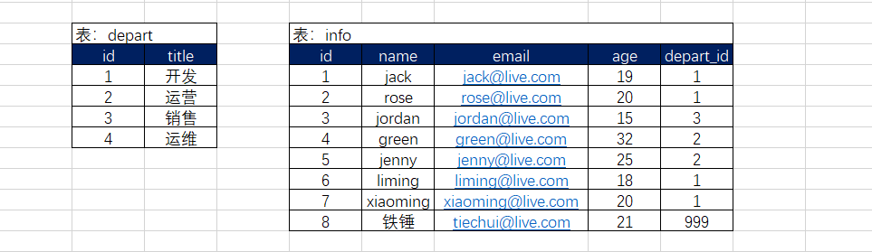


展示用户信息和部门名称：

```sql
主表 left outer join 从表 on 主表.xxx = 从表.id;
从表 right outer join 主表 on 主表.xxx = 从表.id;
```

---

```sql
select * from info left outer join depart on info.depart_id = depart.id;
```

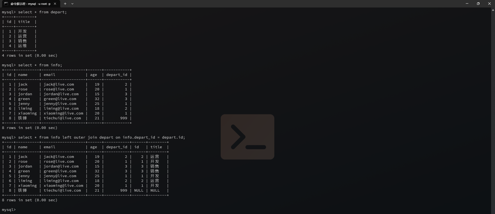

```sql
select info.id, info.name,info.email,depart.title from info left outer join depart on info.depart_id = depart.id;
```

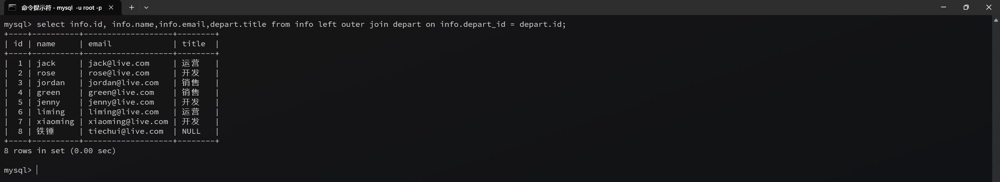

```sql
select info.id, info.name,info.email,depart.title from info right outer join depart on info.depart_id = depart.id;
```


- `info`  主表：就以 `info` 数据为主 `depart` 数据为辅
- `depart`为主表：就以 `depart `为主，`info`为辅

简写：

```sql
select * from info left join depart on ...;
select * from info right join depart on ...;
```

内连接：

```sql
-- 内连 没有主从表 并且只有两张表的数据能关联上才会显示出来 关联不上的不会显示
select * from info inner join depart on info.depart_id = depart.id;
```

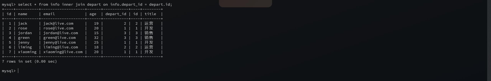

```sql
到目前为止SQL执行顺序：
	from
	join
	on
	where
	group by
	having
	select
	order by
	limit
```

注意：也有可能不止两张表连，有三张四张表的连接。

### 2.1.8 联合

上下连接.


```sql
select id,title from depart
union
select id,name from info;
-- 列数需相同
```

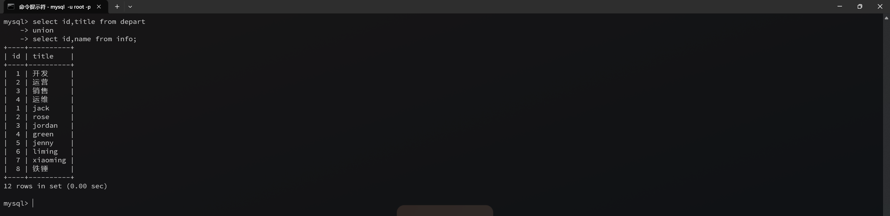

```sql
select id,title from depart
union
select email,name from info;
-- 列数需相同
```

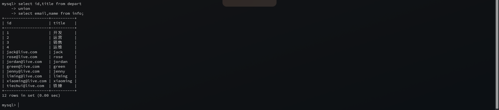

```sql
select id from depart
union
select id from info;
-- 自动去重
```

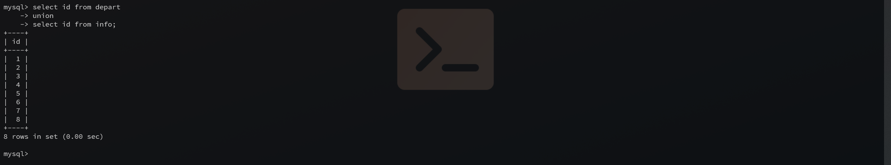

```sql
select id from depart
union all
select id from info;
-- 保留所有
```

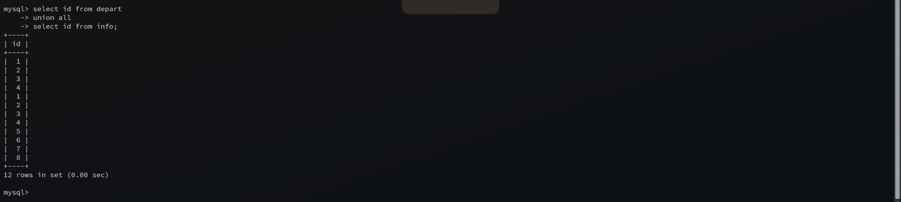

## 2.2 表关系

在开发项目时，需要根据业务需求去创建很多的表结构，一次来实现业务逻辑，一般表结构有 三类：

- 单表 单独一张表就可以将信息保存
  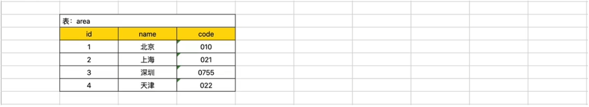
- 一对多 需要两张表来存储信息 且两张表存在 `一对多` 或 `多对一` 的关系
  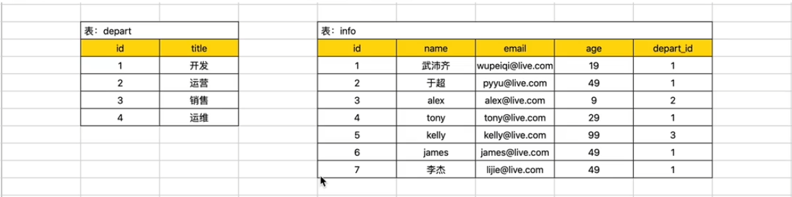
- 多对多 需要三张表来存储信息，两张单表 + 关系表，创造出两个单表之间 `多对多关系`
  

在上述的表：一对多的 info.depart_id 字段、多对多的 `boy_girl.boy_id`、`girl_id`直接用整形存储就可以，因为他们只要存储关联表的主键ID即可。


### 2.2.1 一对多示例


在开发过程中往往还会为他们添加一个 **外键约束**，保证某一个列的值必须是其他表中的特定列已存在的值，例如： `info.depart_id`的值必须是 `depart.id`中已存在的值。

```sql
create table depart (
	id int not null primary key auto_increment,
    title varchar(16) not null
)default charset=utf8;

create table info (
	id int not null auto_increment primary key,
    name varchar(16) not null,
    email varchar(32) not null,
    age int,
    depart_id int not null,
    constraint fk_info_depart foreign key (depart_id) references depart(id) -- 外键约束 fk_info_depart是外键名 (depart_id)是当前字段的字段名 depart(id)是和(depart_id)关联的表中的数据
)default charset=utf8;
```

如果表已经创建好了，额外想要增加外键：

```sql
alter table info add constraint fk_info_depart foreign key info(depart_id) references depart(id); -- 增加外键
```

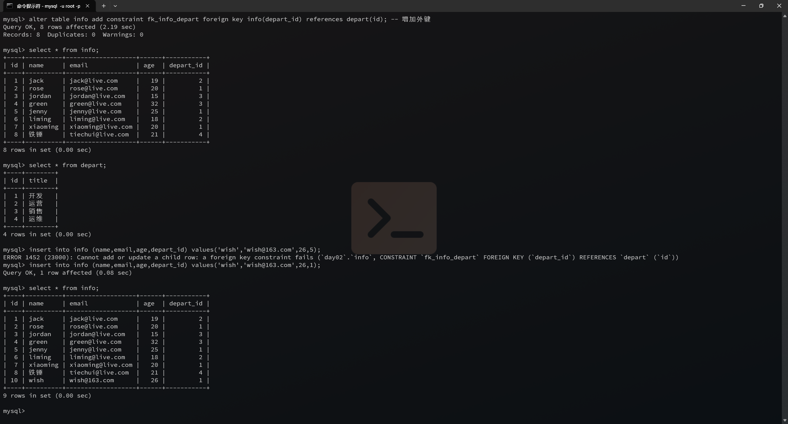

删除外键

```sql
alter table info drop foreign key fk_info_depart;
```

### 2.2.2 多对多示例


```sql
create table boy(
	id int not null auto_increment primary key,
    name varchar(16) not null
)default charset=utf8;

create table girl(
	id int not null auto_increment primary key,
    name varchar(16) not null
)default charset=utf8;

create table girl_boy(
	id int not null auto_increment primary key,
    boy_id not null,
    girl_id not null,
    constraint fk_boy_girl_boy foreign key (boy_id) references boy(id),
    constraint fk_boy_girl_girl foreign key (girl_id) references girl(id)
)default charset=utf8;
```

如果表已经创建好了，可以再增加外键约束

```sql
alter table girl_boy add constraint fk_boy_girl_boy foreign key girl_boy(boy_id) references boy(id);
alter table girl_boy add constraint fk_boy_girl_girl foreign key girl_boy(girl_id) references girl(id);
```

删除外键

```sql
alter table girl_boy drop foreign key fk_boy_girl_boy;
alter table girl_boy drop foreign key fk_boy_girl_girl;
```

在以后项目开发时，设计表结构及其关系是一个非常重要的技能，一般项目开发的步骤：

- 需求调研
- 设计数据库表结构
- 项目开发（写代码）

大量的工作应该放在前 2 个步骤，前期的设计完成之后，后续的功能代码开发就比较简单了。

## 2.3 表结构&表关系案例-简易版路飞学城

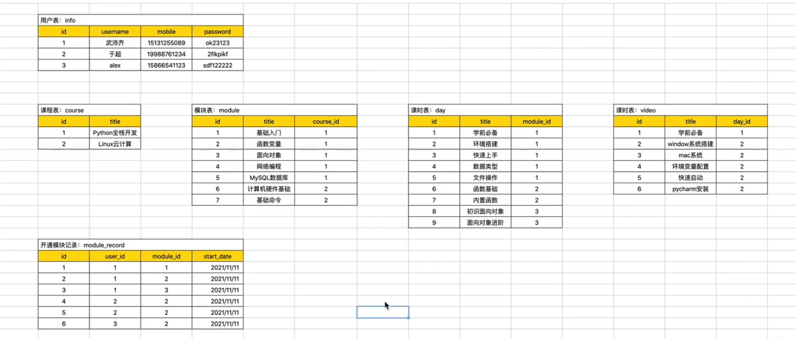

```sql
create database luffy default charset utf8 collate utf8_general_ci;
use luffy;
```

```sql
create table info(
	id int not null auto_increment primary key,
    name varchar(16) not null,
    mobile char(11) not null,
    password char(64) not null
)default charset=utf8;

create table course(
	id int not null auto_increment primary key,
    title varchar(16) not null
)default charset=utf8;

create table module (
	id int not null auto_increment primary key,
    title varchar(16) not null,
    course_id int not null,
    constraint fk_module_course foreign key (course_id) references course(id)
) default charset=utf8;

create table day (
	id int not null auto_increment primary key,
    title varchar(16) not null,
    module_id int not null,
    constraint fk_day_module foreign key (module_id) references module(id)
) default charset=utf8;

create table video (
	id int not null auto_increment primary key,
    title varchar(16) not null,
    day_id int not null,
    constraint fk_video_day foreign key (day_id) references day(id)
) default charset=utf8;

create table module_record (
	id int not null auto_increment primary key,
    user_id varchar(16) not null,
    module_id int not null,
    constraint fk_module_record_user foreign key (user_id) references info(id),
    constraint fk_module_record_module foreign key (module_id) references module(id)
) default charset=utf8;
```

## 2.4 授权

之前我们无论是基于python代码还是自带客户端去连接MySQL时，均使用的是 root 账户，拥有对 MySQL数据库操作的所有权限。


如果有多个程序的数据库全都放在同一个MySQL中，如果程序都用root就存在风险了。

这种情况怎么办？

> 在MySQL中支持创建账户，并给账户分配权限，列入：只拥有数据库A的操作的权限，只拥有数据库B中某些表的权限，只拥有数据库B中某些表的读权限等。

### 2.4.1 用户管理

在MySQL的默认数据库`mysql`中的 `user` 表中存储着所有的账户信息（含账户、权限等）。

```sql
mysql> use mysql;
Database changed

mysql> desc user;
+--------------------------+-----------------------------------+------+-----+-----------------------+-------+
| Field                    | Type                              | Null | Key | Default               | Extra |
+--------------------------+-----------------------------------+------+-----+-----------------------+-------+
| Host                     | char(255)                         | NO   | PRI |                       |       |
| User                     | char(32)                          | NO   | PRI |                       |       |
| Select_priv              | enum('N','Y')                     | NO   |     | N                     |       |
| Insert_priv              | enum('N','Y')                     | NO   |     | N                     |       |
| Update_priv              | enum('N','Y')                     | NO   |     | N                     |       |
| Delete_priv              | enum('N','Y')                     | NO   |     | N                     |       |
| Create_priv              | enum('N','Y')                     | NO   |     | N                     |       |
| Drop_priv                | enum('N','Y')                     | NO   |     | N                     |       |
| Reload_priv              | enum('N','Y')                     | NO   |     | N                     |       |
| Shutdown_priv            | enum('N','Y')                     | NO   |     | N                     |       |
| Process_priv             | enum('N','Y')                     | NO   |     | N                     |       |
| File_priv                | enum('N','Y')                     | NO   |     | N                     |       |
| Grant_priv               | enum('N','Y')                     | NO   |     | N                     |       |
| References_priv          | enum('N','Y')                     | NO   |     | N                     |       |
| Index_priv               | enum('N','Y')                     | NO   |     | N                     |       |
| Alter_priv               | enum('N','Y')                     | NO   |     | N                     |       |
| Show_db_priv             | enum('N','Y')                     | NO   |     | N                     |       |
| Super_priv               | enum('N','Y')                     | NO   |     | N                     |       |
| Create_tmp_table_priv    | enum('N','Y')                     | NO   |     | N                     |       |
| Lock_tables_priv         | enum('N','Y')                     | NO   |     | N                     |       |
| Execute_priv             | enum('N','Y')                     | NO   |     | N                     |       |
| Repl_slave_priv          | enum('N','Y')                     | NO   |     | N                     |       |
| Repl_client_priv         | enum('N','Y')                     | NO   |     | N                     |       |
| Create_view_priv         | enum('N','Y')                     | NO   |     | N                     |       |
| Show_view_priv           | enum('N','Y')                     | NO   |     | N                     |       |
| Create_routine_priv      | enum('N','Y')                     | NO   |     | N                     |       |
| Alter_routine_priv       | enum('N','Y')                     | NO   |     | N                     |       |
| Create_user_priv         | enum('N','Y')                     | NO   |     | N                     |       |
| Event_priv               | enum('N','Y')                     | NO   |     | N                     |       |
| Trigger_priv             | enum('N','Y')                     | NO   |     | N                     |       |
| Create_tablespace_priv   | enum('N','Y')                     | NO   |     | N                     |       |
| ssl_type                 | enum('','ANY','X509','SPECIFIED') | NO   |     |                       |       |
| ssl_cipher               | blob                              | NO   |     | NULL                  |       |
| x509_issuer              | blob                              | NO   |     | NULL                  |       |
| x509_subject             | blob                              | NO   |     | NULL                  |       |
| max_questions            | int unsigned                      | NO   |     | 0                     |       |
| max_updates              | int unsigned                      | NO   |     | 0                     |       |
| max_connections          | int unsigned                      | NO   |     | 0                     |       |
| max_user_connections     | int unsigned                      | NO   |     | 0                     |       |
| plugin                   | char(64)                          | NO   |     | caching_sha2_password |       |
| authentication_string    | text                              | YES  |     | NULL                  |       |
| password_expired         | enum('N','Y')                     | NO   |     | N                     |       |
| password_last_changed    | timestamp                         | YES  |     | NULL                  |       |
| password_lifetime        | smallint unsigned                 | YES  |     | NULL                  |       |
| account_locked           | enum('N','Y')                     | NO   |     | N                     |       |
| Create_role_priv         | enum('N','Y')                     | NO   |     | N                     |       |
| Drop_role_priv           | enum('N','Y')                     | NO   |     | N                     |       |
| Password_reuse_history   | smallint unsigned                 | YES  |     | NULL                  |       |
| Password_reuse_time      | smallint unsigned                 | YES  |     | NULL                  |       |
| Password_require_current | enum('N','Y')                     | YES  |     | NULL                  |       |
| User_attributes          | json                              | YES  |     | NULL                  |       |
+--------------------------+-----------------------------------+------+-----+-----------------------+-------+
51 rows in set (0.00 sec)

mysql> select Host,user,Insert_priv,Update_priv,Delete_priv,Create_priv,Drop_priv from user;
+-----------+------------------+-------------+-------------+-------------+-------------+-----------+
| Host      | user             | Insert_priv | Update_priv | Delete_priv | Create_priv | Drop_priv |
+-----------+------------------+-------------+-------------+-------------+-------------+-----------+
| localhost | mysql.infoschema | N           | N           | N           | N           | N         |
| localhost | mysql.session    | N           | N           | N           | N           | N         |
| localhost | mysql.sys        | N           | N           | N           | N           | N         |
| localhost | root             | Y           | Y           | Y           | Y           | Y         |
+-----------+------------------+-------------+-------------+-------------+-------------+-----------+
4 rows in set (0.00 sec)

mysql>
```

- 创建和删除用户
  ```sql
  create user '用户名'@'连接者的IP地址' identified by '密码';
  ```

  ```sql
  create user jack@127.0.0.1 identified by '123456';
  drop user jack@127.0.0.1;
  
  create user jack2@'127.0.0.%' identified by '123456';
  drop user jack2@'127.0.0.%'
  
  create user jack3@'%' identified by '123456';
  drop user jack3@'%'
  
  create user 'jack4'@'%' identified by '123456';
  drop user 'jack4'@'%'
  ```

  ```sql
  create user 'jack4'@'%' identified by '123456';
  ```

  windows 下创建用户：

  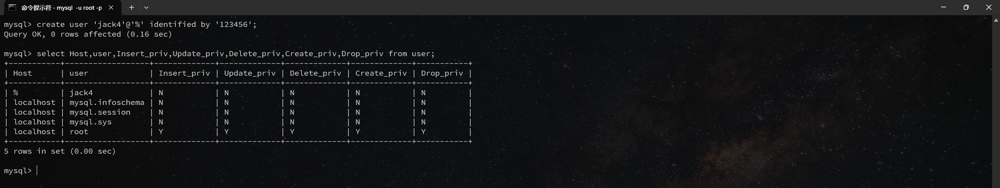

  `Vmware`中使用`Ubuntu`测试连接：

  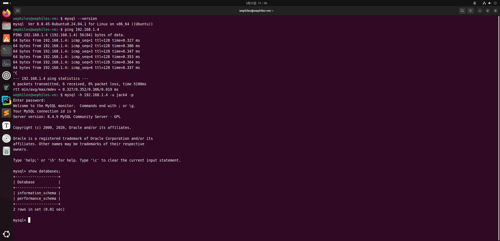

- 修改用户
  ```sql
  rename user '用户名'@'IP地址' to '新用户名'@'IP地址';
  ```

  ```sql
  rename user jack@127.0.0.1 to jack@localhost;
  rename user 'jack4'@'127.0.0.1' to 'jack4'@'localhost';
  ```

  Windows 服务端：

  
  Ubuntu客户端：

  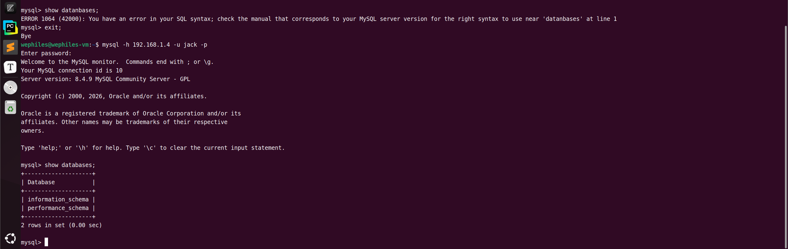

 - 修改密码
   ```sql
   set password for '用户名'@'IP地址' = Password('新密码'); -- 新版本的MySQL(8.0)已经移除Password函数
   
   set password for '用户名'@'IP地址' = '新密码';
   -- 或
   alter user '用户名'@'IP地址' identified by '654321';
   flush privileges;
   ```

   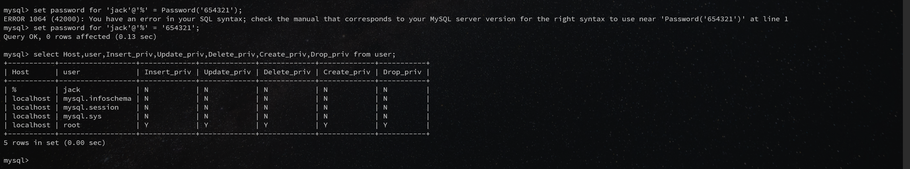
   	

### 2.4.2 授权

创建好用户之后，就可以为用户进行授权了；

- 授权
  ```
  grant 权限 on 数据库.表 to '用户'@'IP地址';
  ```

  ```sql
  grant all privileges on *.* to 'jack'@'localhost';         -- 用户 jack 拥有所有数据库的所有权限
  grant all privileges on day02.* to 'jack'@'%';             -- 用户 jack 拥有数据库day02的所有权限
  grant all privileges on day02.info to 'jack'@'localhost';  -- 用户 jack 拥有day02数据库中info表的所有权限
  
  grant select on day02.info to 'jack'@'localhost';          -- 用户 jack 拥有day02数据库的表info的插入权限
  grant select,insert on day02.* to 'jack'@'localhost';      -- 用户 jack 拥有day02数据库的所有表的插入查询权限
  
  -- 注意:修改完毕后记得刷新权限, 使得修改立即生效
  flush privileges;
  ```

  

  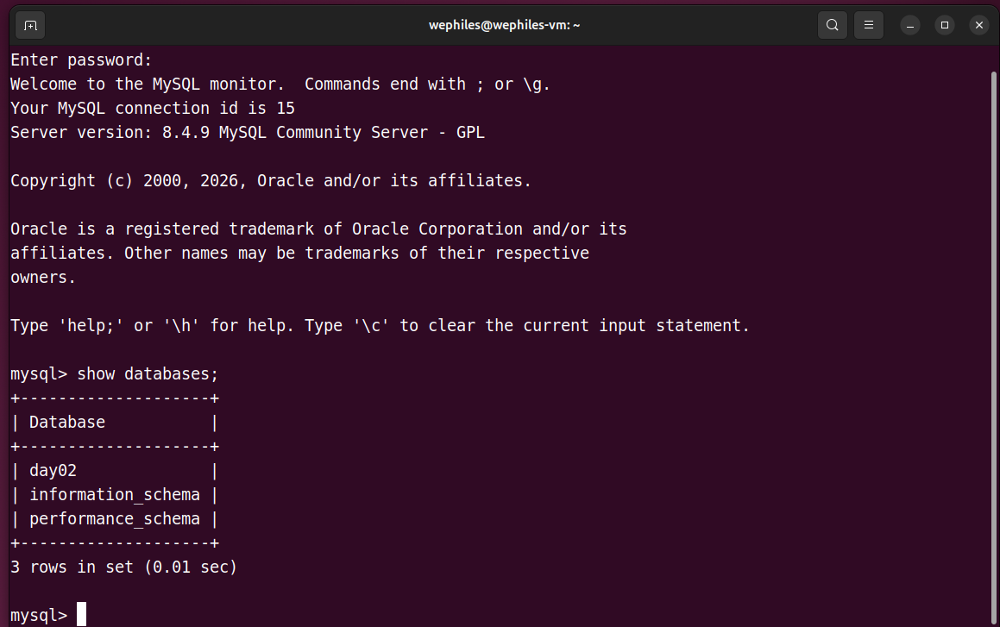

  - 对于权限
    ```sql
    all privliges    除 grant 外的所有权限
    select           仅查权限
    select,insert    查和插入权限
    ...
    ```

    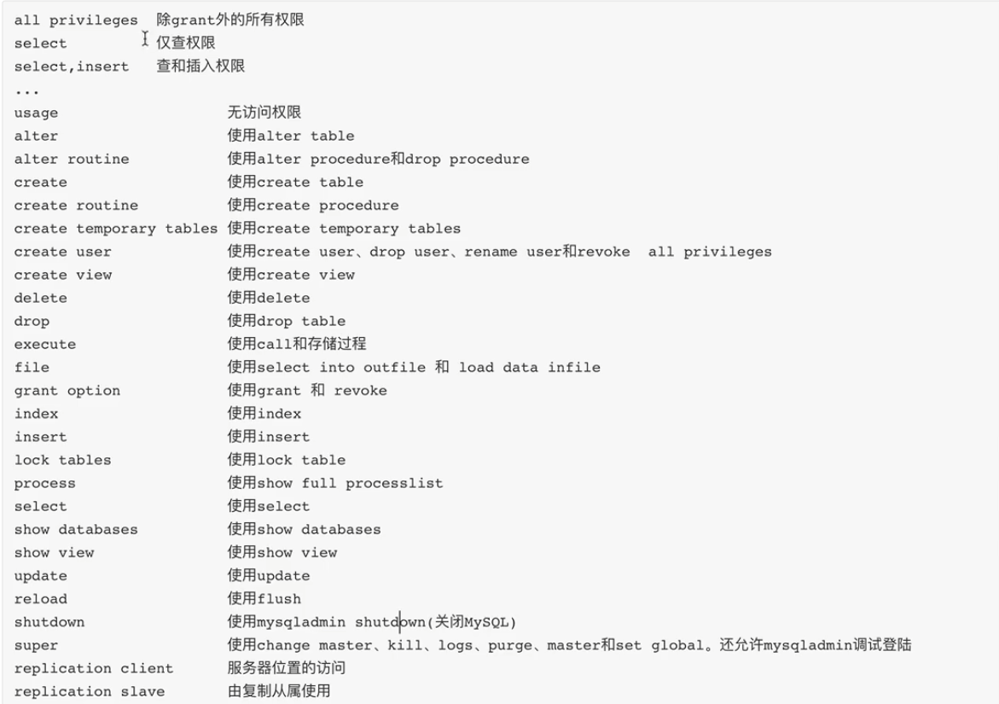

  - 对于数据库和表
    

- 查看权限
  ```
  show grants for '用户名'@'IP地址';
  ```

  ```sql
  show grants for 'jack'@'%';
  ```

  

- 取消授权
  ```sql
  revoke 权限 on 数据库.表 from '用户名'@'IP地址';
  ```

  ```sql
  revoke all privileges on day02.* from 'jack'@'%';
  ```


一般情况下，在很多的 **正规** 公司，数据库都是由 DBA 来进行统一管理的，DBA 为每个项目部的数据库创建用户，并赋予相关的权限。

# day-03 SQL强化和实践

课程目标：练习常用的SQL语句和表结构的设计。

课程概要：

- SQL强化
- 表结构设计（博客系统）

## 3.1 SQL强化（自己练习）

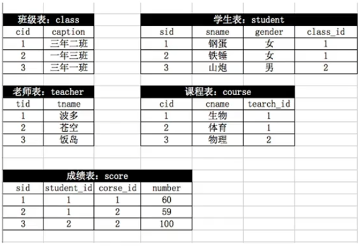

### 3.1.1 根据上图创建  数据库 & 表结构 并 录入数据（可以自行创造数据）。

```sql
create database school default charset utf8 collate utf8_general_ci;
```

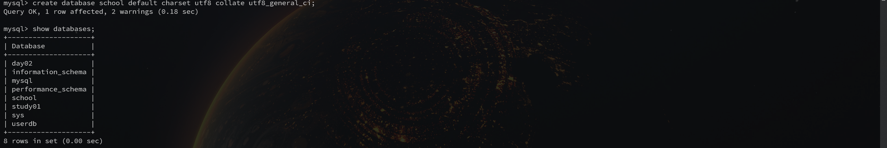
```sql
use school;

create table class (
	cid int not null auto_increment primary key,
    caption varchar(16) not null
) default charset=utf8;

create table student (
	sid int not null auto_increment primary key,
    sname varchar(16) not null,
    gender char(1) not null,
    class_id int not null,
    constraint fk_student_class foreign key (class_id) references class(cid)
) default charset=utf8;

create table teacher (
	tid int not null auto_increment primary key,
    tname varchar(16) not null
) default charset=utf8;

create table course (
	cid int not null auto_increment primary key,
    cname varchar(16) not null,
    teacher_id int not null,
    constraint fk_coures_teacher foreign key (teacher_id) references teacher(tid)
) default charset=utf8;

create table score (
	sid int not null auto_increment primary key,
    student_id int not null,
    course_id int not null,
    number int not null,
    constraint fk_score_student foreign key (student_id) references student(sid),
    constraint fk_score_course foreign key (course_id) references course(cid)
) default charset=utf8;
```

---

```sql
mysql> create database school default charset utf8 collate utf8_general_ci;
Query OK, 1 row affected, 2 warnings (0.18 sec)

mysql> show databases;
+--------------------+
| Database           |
+--------------------+
| day02              |
| information_schema |
| mysql              |
| performance_schema |
| school             |
| study01            |
| sys                |
| userdb             |
+--------------------+
8 rows in set (0.00 sec)

mysql> use school;
Database changed
mysql> show databases;
+--------------------+
| Database           |
+--------------------+
| day02              |
| information_schema |
| mysql              |
| performance_schema |
| school             |
| study01            |
| sys                |
| userdb             |
+--------------------+
8 rows in set (0.00 sec)

mysql> show tables;
Empty set (0.00 sec)

mysql> create table class (
    ->  cid int not null auto_increment primary key,
    ->     caption varchar(16) not null
    -> ) default charset=utf8;
Query OK, 0 rows affected, 1 warning (0.79 sec)

mysql> show tables;
+------------------+
| Tables_in_school |
+------------------+
| class            |
+------------------+
1 row in set (0.00 sec)

mysql> create table student (
    ->  sid int not null auto_increment primary key,
    ->     sname varchar(16) not null,
    ->     gender char(1) not null,
    ->     class_id int not null,
    ->     constraint fk_student_class foreign key (class_id) references class(cid)
    -> ) default charset=utf8;
Query OK, 0 rows affected, 1 warning (1.16 sec)

mysql> show tables;
+------------------+
| Tables_in_school |
+------------------+
| class            |
| student          |
+------------------+
2 rows in set (0.00 sec)

mysql> create table teacher (
    ->  tid int not null auto_increment primary key,
    ->     tname varchar(16) not null
    -> ) default charset=utf8;
Query OK, 0 rows affected, 1 warning (1.12 sec)

mysql> create table course (
    ->  cid int not null auto_increment primary key,
    ->     cname varchar(16) not null,
    ->     teacher_id int not null,
    ->     constraint fk_coures_teacher foreign key (teacher_id) references teacher(tid)
    -> ) default charset=utf8;
Query OK, 0 rows affected, 1 warning (0.61 sec)

mysql> create table score (
    ->  sid int not null auto_increment primary key,
    ->     student_id int not null,
    ->     course_id int not null,
    ->     number int not null,
    ->     constraint fk_score_student foreign key (student_id) references student(sid),
    ->     constraint fk_score_course foreign key (course_id) references course(sid),
    -> ) default charset=utf8;
ERROR 1064 (42000): You have an error in your SQL syntax; check the manual that corresponds to your MySQL server version for the right syntax to use near ') default charset=utf8' at line 8
mysql> create table score (
    ->  sid int not null auto_increment primary key,
    ->     student_id int not null,
    ->     course_id int not null,
    ->     number int not null,
    ->     constraint fk_score_student foreign key (student_id) references student(sid),
    ->     constraint fk_score_course foreign key (course_id) references course(sid),
    ->     constraint fk_score_course foreign key (course_id) references course(sid),
    -> ;
ERROR 1064 (42000): You have an error in your SQL syntax; check the manual that corresponds to your MySQL server version for the right syntax to use near '' at line 8
mysql> create table score (
    ->  sid int not null auto_increment primary key,
    ->     student_id int not null,
    ->     course_id int not null,
    ->     number int not null,
    ->     constraint fk_score_student foreign key (student_id) references student(sid),
    ->     constraint fk_score_course foreign key (course_id) references course(sid)
    -> ) default charset=utf8;
ERROR 3734 (HY000): Failed to add the foreign key constraint. Missing column 'sid' for constraint 'fk_score_course' in the referenced table 'course'
mysql> create table score (
    ->  sid int not null auto_increment primary key,
    ->     student_id int not null,
    ->     course_id int not null,
    ->     number int not null,
    ->     constraint fk_score_student foreign key (student_id) references student(sid),
    ->     constraint fk_score_course foreign key (course_id) references course(cid)
    -> ) default charset=utf8;
Query OK, 0 rows affected, 1 warning (1.13 sec)

mysql> show tables;
+------------------+
| Tables_in_school |
+------------------+
| class            |
| course           |
| score            |
| student          |
| teacher          |
+------------------+
5 rows in set (0.00 sec)

mysql>
```

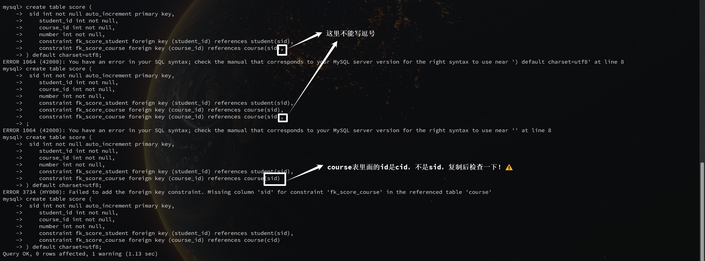

### 3.1.2 创建用户 `luffy` 并赋予此数据库的所有权限。

```sql
drop user 'jack'@'%'; -- 先把刚才创建的测试用户删除先

select Host,user from mysql.user;
+-----------+------------------+
| Host      | user             |	
+-----------+------------------+
| localhost | mysql.infoschema |
| localhost | mysql.session    |
| localhost | mysql.sys        |
| localhost | root             |
+-----------+------------------+

create user 'luffy'@'%' identified by '123456';

select Host,user from mysql.user;
+-----------+------------------+
| Host      | user             |
+-----------+------------------+
| %         | luffy            |
| localhost | mysql.infoschema |
| localhost | mysql.session    |
| localhost | mysql.sys        |
| localhost | root             |
+-----------+------------------+

-- 给 luffy 授权数据库
grant all privileges on school.* to 'luffy'@'%';

-- 用 luffy 这个账户登录, 操作school 数据库
C:\Users\wephiles>mysql -u luffy -p
Enter password: ******
Welcome to the MySQL monitor.  Commands end with ; or \g.
Your MySQL connection id is 16
Server version: 8.4.9 MySQL Community Server - GPL

Copyright (c) 2000, 2026, Oracle and/or its affiliates.

Oracle is a registered trademark of Oracle Corporation and/or its
affiliates. Other names may be trademarks of their respective
owners.

Type 'help;' or '\h' for help. Type '\c' to clear the current input statement.

mysql> show databases;
+--------------------+
| Database           |
+--------------------+
| information_schema |
| performance_schema |
| school             |
+--------------------+
3 rows in set (0.00 sec)

mysql> use school;
Database changed
mysql>
```


创造一些数据：

```python
# 创造 1000 个人名，包括与之对应的性别和年级

import random

# first_name = """赵、赵、赵、赵、赵、赵、赵、赵、赵、赵、赵、赵、赵、钱、钱、钱、钱、钱、钱、钱、钱、钱、钱、钱、钱、钱、钱、钱、钱、钱、钱、钱、钱、钱、钱、钱、钱、钱、钱、钱、钱、钱、钱、钱、钱、钱、钱、钱、钱、钱、钱、钱、钱、钱、钱、钱、钱、钱、钱、钱、钱、钱、孙、李、李、李、李、李、李、李、李、李、李、李、李、李、李、李、李、李、周、吴、郑、王、王、王、王、王、王、王、王、王、王、王、王、王、王、王、王、王、王、王、王、王、王、王、王、王、王、王、王、王、王、王、王、王、王、王、王、王、王、王、王、冯、陈、褚、卫、蒋、沈、韩、杨、朱、秦、尤、许、何、吕、施、张、张、张、张、张、张、张、张、张、张、张、张、张、张、张、张、张、张、张、张、张、张、张、张、张、张、张、张、张、孔、曹、严、华、金、魏、陶、姜、戚、谢、邹、喻、柏、水、窦、章、云、苏、潘、葛、奚、范、彭、郎、鲁、韦、昌、马、苗、凤、花、方、俞、任、袁、柳、酆、鲍、史、唐、费、廉、岑、薛、雷、贺、倪、汤、滕、殷、罗、毕、郝、邬、安、常、乐、于、时、傅、皮、卞、齐、康、伍、余、元、卜、顾、孟、平、黄、和、穆、萧、尹、姚、邵、湛、汪、祁、毛、禹、狄、米、贝、明、臧、计、伏、成、戴、谈、宋、茅、庞、熊、纪、舒、屈、项、祝、董、梁、杜、阮、蓝、闵、席、季、麻、强、贾、路、娄、危、江、童、颜、郭、梅、盛、林、刁、钟、徐、邱、骆、高、夏、蔡、田、樊、胡、凌、霍、虞、万、支、柯、昝、管、卢、莫、经、房、裘、缪、干、解、应、宗、丁、宣、贲、邓、郁、单、杭、洪、包、诸、左、石、崔、吉、钮、龚、程、嵇、邢、滑、裴、陆、荣、翁、荀、羊、於、惠、甄、麴、家、封、芮、羿、储、靳、汲、邴、糜、松、井、段、富、巫、乌、焦、巴、弓、牧、隗、山、谷、车、侯、宓、蓬、全、郗、班、仰、秋、仲、伊、宫、宁、仇、栾、暴、甘、钭、厉、戎、祖、武、符、刘、景、詹、束、龙、叶、幸、司、韶、郜、黎、蓟、薄、印、宿、白、怀、蒲、邰、从、鄂、索、咸、籍、赖、卓、蔺、屠、蒙、池、乔、阴、欎、胥、能、苍、双、闻、莘、党、翟、谭、贡、劳、逄、姬、申、扶、堵、冉、宰、郦、雍、舄、璩、桑、桂、濮、牛、寿、通、边、扈、燕、冀、郏、浦、尚、农、温、别、庄、晏、柴、瞿、阎、充、慕、连、茹、习、宦、艾、鱼、容、向、古、易、慎、戈、廖、庾、终、暨、居、衡、步、都、耿、满、弘、匡、国、文、寇、广、禄、阙、东、殴、殳、沃、利、蔚、越、夔、隆、师、巩、厍、聂、晁、勾、敖、融、冷、訾、辛、阚、那、简、饶、空、曾、毋、沙、乜、养、鞠、须、丰、巢、关、蒯、相、查、後、荆、红、游、竺、权、逯、盖、益、桓、公、万俟、司马、上官、欧阳、夏侯、诸葛、闻人、东方、赫连、皇甫、尉迟、公羊、澹台、公冶、宗政、濮阳、淳于、单于、太叔、申屠、公孙、仲孙、轩辕、令狐、钟离、宇文、长孙、慕容、鲜于、闾丘、司徒、司空、亓官、司寇、仉、督、子车、颛孙、端木、巫马、公西、漆雕、乐正、壤驷、公良、拓跋、夹谷、宰父、谷梁、晋、楚、闫、法、汝、鄢、涂、钦、段干、百里、东郭、南门、呼延、归、海、羊舌、微生、岳、帅、缑、亢、况、后、有、琴、梁丘、左丘、东门、西门、商、牟、佘、佴、伯、赏、南宫、墨、哈、谯、笪、年、爱、阳、佟、第五、言、福"""

# # 为什么要写这么多张、李等这写姓？因为这些姓很常见
first_name = """赵、赵、赵、赵、赵、赵、赵、赵、赵、赵、赵、赵、赵、钱、钱、钱、钱、钱、钱、钱、钱、钱、钱、钱、钱、钱、钱、钱、钱、钱、钱、钱、钱、钱、钱、钱、钱、钱、钱、钱、钱、钱、钱、钱、钱、钱、钱、钱、钱、钱、钱、钱、钱、钱、钱、钱、钱、钱、钱、钱、钱、钱、孙、李、李、李、李、李、李、李、李、李、李、李、李、李、李、李、李、李、周、吴、郑、王、王、王、王、王、王、王、王、王、王、王、王、王、王、王、王、王、王、王、王、王、王、王、王、王、王、王、王、王、王、王、王、王、王、王、王、王、王、王、王、冯、陈、褚、卫、蒋、沈、韩、杨、朱、秦、尤、许、何、吕、施、张、张、张、张、张、张、张、张、张、张、张、张、张、张、张、张、张、张、张、张、张、张、张、张、张、张、张、张、张、孔、曹、严、华、金、魏、陶、姜、戚、谢、邹、喻、柏、水、窦、章、云、苏、潘、葛、奚、范、彭、郎、鲁、韦、昌、马、苗、凤、花、方、俞、任、袁、柳、酆、鲍、史、唐、费、廉、岑、薛、雷、贺、倪、汤、滕、殷、罗、毕、郝、邬、安、常、乐、于、时、傅、皮、卞、齐、康、伍、余、元、卜、顾、孟、平、黄、和、穆、萧、尹、姚、邵、湛、汪、祁、毛、禹、狄、米、贝、明、臧、计、伏、成、戴、谈、宋、茅、庞、熊、纪、舒、屈、项、祝、董、梁、杜、阮、蓝、闵、席、季、麻、强、贾、路、娄、危、江、童、颜、郭、梅、盛、林、刁、钟、徐、邱、骆、高、夏、蔡、田、樊、胡、凌、霍、虞、万、支、柯、昝、管、卢、莫、经、房、裘、缪、干、解、应、宗、丁、宣、贲、邓、郁、单、杭、洪、包、诸、左、石、崔、吉、钮、龚、程、嵇、邢、滑、裴、陆、荣、翁、荀、羊、於、惠、甄、麴、家、封、芮、羿、储、靳、汲、邴、糜、松、井、段、富、巫、乌、焦、巴、弓、牧、隗、山、谷、车、侯、宓、蓬、全、郗、班、仰、秋、仲、伊、宫、宁、仇、栾、暴、甘、钭、厉、戎、祖、武、符、刘、景、詹、束、龙、叶、幸、司、韶"""
first_name_choices = tuple(first_name.strip().split('、'))

last_name = """欣怡、帅、兰英、芝兰、小丽、娟、悦、月、玥、玉、默、群、世、全、安、平、开、来、英、仕、伟、大、静、楠、娜、沐、笙、明、敏、芳、杰、勇、涛、军、强、丽、艳、阳、之、泽、梓、子、宇、汐、芮、霖、航、沐宸、浩宇、沐辰、茗泽、奕辰、宇泽、浩然、奕泽、宇轩、沐阳、若汐、一诺、艺涵、依诺、梓涵、苡沫、雨桐、欣怡、语桐、语汐、秀英、桂英、秀兰、玉兰、婷婷、建华、桂兰、玉梅、秀珍、海燕、桂英、婷婷、秀珍、海燕、建华、建国、国庆、国伟、文君、子涵、俊杰、梓萱、子墨、浩宇、星辰、悠然、安琪、磊"""
last_name_choices = tuple(set(last_name.strip().split('、')))

gender_choices = ('男', '女')

class_choices = tuple(range(1, 23))
count = 0
res_count = 0
res_set = set()
while res_count <= 1000:
    count += 1
    name = f'{random.choice(first_name_choices)}{random.choice(last_name_choices)}'
    gender = random.choice(gender_choices)
    class_ = random.choice(class_choices)
    comb_data = (name, gender, class_)
    if comb_data not in res_set:
        res_set.add(comb_data)
        res_count += 1

print(count)
print(res_set)
print(len(res_set))

# 运行结果如下：
"""
1006
{('孟桂英', '女', 8), ('张桂英', '男', 3), ('王茗泽', '女', 11), ('唐丽', '男', 14), ('任语桐', '女', 11), ('路小丽', '女', 16), ('钱沐', '男', 13), ('钱子', '男', 7), ('滑艳', '女', 10), ('廉子涵', '男', 3), ('甄军', '女', 16), ('廉悠然', '男', 9), ('钭楠', '男', 1), ('王浩然', '女', 9), ('裴敏', '女', 14), ('钱大', '男', 7), ('丁安', '男', 2), ('钱兰英', '男', 12), ('乐玉梅', '女', 13), ('李来', '男', 14), ('赵之', '女', 11), ('姚语汐', '男', 17), ('梅小丽', '男', 16), ('钱群', '男', 4), ('蓝奕泽', '男', 1), ('张国伟', '男', 12), ('钱群', '男', 13), ('喻月', '女', 18), ('费子', '女', 9), ('元俊杰', '女', 4), ('应宇泽', '女', 9), ('羿平', '男', 17), ('巴国伟', '男', 5), ('屈悦', '男', 21), ('卞艳', '女', 15), ('毕玥', '男', 21), ('何宇泽', '女', 7), ('李桂兰', '男', 19), ('贾奕辰', '男', 21), ('於沐宸', '男', 19), ('姜秀英', '女', 16), ('邬娟', '女', 21), ('王国庆', '男', 13), ('张阳', '女', 21), ('湛默', '女', 6), ('钱汐', '女', 16), ('许国庆', '男', 20), ('钱苡沫', '男', 10), ('倪静', '女', 14), ('祖茗泽', '男', 7), ('吴子', '男', 13), ('巫海燕', '男', 12), ('平茗泽', '女', 4), ('娄娜', '男', 16), ('李娜', '男', 10), ('仇语桐', '男', 22), ('钱玉梅', '女', 2), ('赵秀珍', '女', 9), ('张语桐', '男', 10), ('靳丽', '女', 19), ('戎桂兰', '男', 4), ('钱国庆', '女', 18), ('王语汐', '男', 15), ('李建华', '男', 22), ('钱秀珍', '男', 3), ('季秀珍', '男', 11), ('李平', '女', 10), ('侯芝兰', '女', 5), ('郝子涵', '女', 9), ('常阳', '男', 14), ('殷星辰', '男', 6), ('苗宇泽', '男', 10), ('张阳', '男', 14), ('钱宇泽', '男', 16), ('钱沐', '女', 10), ('陶伟', '男', 9), ('范悦', '女', 12), ('羿丽', '男', 19), ('王悠然', '女', 4), ('赵帅', '女', 16), ('王仕', '男', 19), ('宋子墨', '女', 19), ('单苡沫', '男', 9), ('王帅', '男', 3), ('钱沐辰', '男', 2), ('邱奕泽', '女', 15), ('富芝兰', '女', 3), ('许秀英', '女', 4), ('许梓', '男', 22), ('段英', '男', 11), ('贾秀兰', '男', 11), ('明悦', '女', 10), ('廉杰', '男', 13), ('魏欣怡', '女', 12), ('马芳', '女', 12), ('梁之', '女', 8), ('姚艺涵', '男', 12), ('张子墨', '男', 22), ('惠文君', '男', 17), ('杭明', '女', 4), ('袁泽', '女', 19), ('康桂兰', '女', 8), ('崔婷婷', '男', 13), ('骆世', '男', 9), ('经沐辰', '男', 10), ('王霖', '女', 10), ('韩子涵', '男', 6), ('骆月', '女', 5), ('钱国伟', '男', 6), ('钱汐', '男', 4), ('童宇轩', '女', 12), ('赵娜', '男', 14), ('谷苡沫', '男', 3), ('钱汐', '男', 22), ('钱群', '女', 6), ('郝奕泽', '男', 1), ('崔杰', '男', 22), ('钱静', '女', 6), ('傅艺涵', '男', 11), ('沈沐宸', '女', 11), ('许大', '男', 15), ('毛玥', '女', 17), ('席娜', '女', 9), ('王国庆', '男', 12), ('鲁勇', '女', 13), ('邵大', '女', 2), ('钱默', '男', 7), ('王艺涵', '男', 21), ('魏强', '男', 10), ('钱伟', '男', 11), ('芮大', '女', 13), ('钱默', '男', 16), ('孟子墨', '女', 20), ('谷涛', '男', 2), ('祁芳', '男', 20), ('祁玉梅', '女', 20), ('陶梓涵', '女', 6), ('臧平', '女', 22), ('暴雨桐', '女', 20), ('王语汐', '女', 8), ('云奕辰', '女', 11), ('伊艳', '女', 12), ('车宇轩', '女', 18), ('家浩然', '女', 14), ('明安', '男', 5), ('丁梓萱', '女', 13), ('李娟', '女', 2), ('钱婷婷', '女', 13), ('王语桐', '女', 15), ('王娟', '女', 19), ('羿国伟', '女', 7), ('钱静', '男', 16), ('郭军', '男', 5), ('王浩宇', '女', 8), ('李雨桐', '女', 20), ('单桂英', '男', 15), ('钱芳', '男', 15), ('季浩宇', '男', 7), ('王苡沫', '男', 9), ('朱英', '男', 10), ('赵泽', '男', 15), ('钱国庆', '男', 19), ('严强', '男', 8), ('贺汐', '男', 13), ('钱沐辰', '男', 10), ('王军', '男', 19), ('邹宇泽', '男', 14), ('姜秀英', '女', 10), ('钱开', '男', 18), ('宗玉梅', '男', 20), ('钱安琪', '男', 10), ('刁茗泽', '女', 14), ('邬芮', '男', 11), ('唐建国', '女', 19), ('滑强', '女', 9), ('张子墨', '女', 6), ('钱语桐', '女', 16), ('钱笙', '女', 18), ('松艳', '男', 19), ('宓芳', '女', 22), ('郑之', '女', 2), ('洪语汐', '女', 13), ('邹磊', '男', 7), ('李建华', '男', 16), ('张芮', '女', 10), ('沈依诺', '男', 12), ('乌子涵', '男', 21), ('庞梓', '女', 1), ('符全', '女', 8), ('姜全', '男', 2), ('韶兰英', '男', 16), ('傅玉梅', '女', 13), ('王语汐', '女', 12), ('钱欣怡', '男', 11), ('王艳', '女', 7), ('王安琪', '女', 22), ('仇涛', '男', 16), ('邵奕泽', '男', 17), ('施秀英', '女', 15), ('李沐宸', '女', 19), ('安强', '男', 1), ('李沐', '女', 7), ('管全', '男', 14), ('萧依诺', '女', 13), ('华浩然', '女', 16), ('钱沐宸', '男', 1), ('钱子墨', '女', 4), ('曹宇泽', '女', 17), ('李若汐', '男', 21), ('许沐宸', '男', 12), ('张杰', '男', 12), ('宫泽', '女', 10), ('强桂英', '男', 22), ('钱沐辰', '男', 5), ('李之', '女', 1), ('祁来', '男', 16), ('储桂英', '男', 19), ('栾一诺', '男', 17), ('裘勇', '女', 14), ('李伟', '女', 21), ('钱军', '男', 16), ('蒋玥', '男', 2), ('钱涛', '男', 9), ('张欣怡', '男', 12), ('时世', '男', 13), ('潘汐', '女', 21), ('顾沐阳', '男', 8), ('王宇轩', '女', 12), ('褚霖', '男', 13), ('郑娟', '男', 3), ('赵秀兰', '男', 19), ('戚一诺', '男', 10), ('钱秀英', '女', 14), ('钱梓', '男', 20), ('徐浩然', '男', 22), ('巫沐宸', '男', 17), ('和若汐', '男', 21), ('麴霖', '男', 10), ('龙平', '女', 12), ('钱婷婷', '女', 21), ('臧奕辰', '男', 2), ('赵默', '女', 21), ('邹军', '男', 8), ('李阳', '女', 4), ('郭文君', '男', 5), ('昌悦', '女', 9), ('管子墨', '女', 13), ('王群', '女', 6), ('卢雨桐', '女', 18), ('车军', '女', 9), ('邢全', '男', 13), ('司军', '女', 12), ('束桂英', '女', 10), ('谢世', '女', 1), ('张大', '男', 12), ('陆汐', '男', 1), ('史沐阳', '女', 16), ('洪全', '女', 14), ('张兰英', '女', 4), ('钱军', '女', 14), ('滕勇', '男', 14), ('宋默', '男', 1), ('柏秀兰', '女', 15), ('戚玉梅', '男', 5), ('茅泽', '男', 1), ('王文君', '女', 18), ('于玉兰', '男', 4), ('钱桂英', '男', 10), ('安安', '男', 10), ('乐雨桐', '男', 11), ('陆平', '女', 20), ('裘强', '男', 2), ('盛雨桐', '男', 9), ('伊桂兰', '女', 6), ('钱婷婷', '女', 16), ('张娟', '女', 6), ('王笙', '男', 15), ('弓世', '女', 9), ('阮建国', '女', 4), ('张国庆', '男', 19), ('万沐辰', '男', 19), ('张小丽', '男', 1), ('钱艺涵', '男', 15), ('钱航', '女', 13), ('张默', '女', 22), ('幸宇轩', '男', 22), ('蓝星辰', '男', 12), ('席国伟', '女', 22), ('费月', '男', 14), ('娄俊杰', '女', 9), ('水帅', '女', 18), ('张婷婷', '男', 20), ('赵汐', '男', 5), ('郑国伟', '女', 4), ('钱泽', '女', 20), ('董沐阳', '女', 15), ('姜磊', '女', 11), ('钱浩宇', '女', 14), ('严娟', '男', 11), ('宋月', '女', 10), ('魏仕', '男', 21), ('卞依诺', '女', 15), ('钱语桐', '女', 19), ('卫仕', '男', 7), ('钱月', '女', 2), ('翁帅', '女', 17), ('钱月', '女', 11), ('张群', '男', 14), ('杭英', '女', 6), ('李磊', '女', 22), ('李海燕', '女', 2), ('钱明', '女', 9), ('王桂英', '女', 15), ('钱玉', '男', 10), ('张仕', '女', 17), ('秋秀英', '女', 13), ('李沐', '男', 16), ('麻帅', '女', 2), ('安小丽', '男', 17), ('王之', '女', 13), ('钱浩宇', '男', 16), ('禹语桐', '女', 6), ('王子墨', '女', 17), ('仇沐辰', '女', 13), ('熊宇', '女', 11), ('柯杰', '男', 16), ('於宇泽', '男', 12), ('王航', '男', 3), ('钱英', '男', 18), ('钱浩然', '男', 18), ('栾桂兰', '男', 17), ('钱奕辰', '女', 7), ('蓬俊杰', '女', 20), ('王沐', '女', 11), ('钱子涵', '男', 1), ('危文君', '女', 9), ('水之', '女', 8), ('王文君', '男', 15), ('张丽', '男', 1), ('赵安', '男', 2), ('范婷婷', '男', 15), ('王英', '男', 1), ('赵桂英', '男', 16), ('茅强', '女', 1), ('赵子涵', '男', 14), ('解来', '男', 21), ('唐玉兰', '男', 14), ('郁沐辰', '女', 14), ('廉明', '男', 9), ('钱一诺', '男', 3), ('王勇', '女', 8), ('麴俊杰', '男', 2), ('狄英', '男', 16), ('莫霖', '女', 12), ('安阳', '男', 17), ('王建华', '男', 17), ('李伟', '男', 8), ('谢阳', '女', 21), ('嵇芳', '女', 18), ('诸星辰', '女', 16), ('任梓', '男', 15), ('王伟', '女', 20), ('成子涵', '女', 21), ('赵杰', '男', 13), ('汤奕泽', '男', 22), ('姚奕辰', '男', 20), ('水伟', '男', 12), ('计秀兰', '男', 19), ('栾英', '女', 3), ('张笙', '女', 2), ('元语桐', '女', 1), ('王杰', '女', 1), ('管芳', '女', 6), ('钟星辰', '女', 13), ('张笙', '女', 11), ('张语汐', '女', 13), ('钱奕辰', '男', 8), ('强悠然', '男', 14), ('时奕辰', '女', 5), ('王全', '女', 16), ('朱子涵', '女', 2), ('吕奕辰', '男', 21), ('魏丽', '女', 2), ('王开', '女', 22), ('魏依诺', '男', 12), ('王沐辰', '男', 11), ('钱悠然', '女', 16), ('张仕', '男', 4), ('祁语汐', '男', 5), ('沈楠', '女', 5), ('应奕泽', '男', 19), ('龙奕辰', '男', 10), ('张语汐', '男', 6), ('钮宇', '男', 20), ('毕娜', '男', 9), ('邢国伟', '女', 18), ('张苡沫', '男', 3), ('雷国庆', '女', 4), ('张苡沫', '男', 12), ('甄悦', '男', 21), ('羊世', '男', 5), ('张强', '女', 12), ('钱群', '女', 20), ('岑开', '男', 7), ('郑杰', '女', 9), ('盛勇', '男', 17), ('厉茗泽', '男', 12), ('张沐阳', '男', 3), ('纪国庆', '男', 21), ('钱沐阳', '女', 20), ('章宇泽', '女', 21), ('钱艺涵', '男', 18), ('季国庆', '女', 10), ('李涛', '女', 18), ('汲梓涵', '男', 15), ('曹若汐', '女', 1), ('张秀兰', '男', 19), ('支语桐', '女', 2), ('祁世', '女', 4), ('靳世', '男', 11), ('沈艺涵', '男', 1), ('孙文君', '男', 13), ('叶若汐', '男', 8), ('袁语汐', '男', 13), ('魏敏', '女', 16), ('诸建华', '女', 20), ('於磊', '女', 7), ('俞开', '男', 18), ('伊霖', '女', 7), ('卜安', '女', 11), ('张来', '男', 8), ('元语桐', '男', 16), ('余芮', '女', 21), ('高娟', '男', 16), ('纪平', '男', 3), ('麴小丽', '男', 5), ('钱浩宇', '男', 10), ('崔强', '女', 20), ('项梓萱', '女', 6), ('邬秀珍', '男', 1), ('席依诺', '女', 16), ('葛桂英', '男', 18), ('龙若汐', '男', 5), ('赵大', '男', 14), ('郁星辰', '女', 16), ('封子墨', '男', 3), ('夏国庆', '女', 7), ('罗茗泽', '女', 21), ('殷秀珍', '男', 19), ('高帅', '女', 14), ('谷军', '男', 12), ('张艺涵', '男', 2), ('钱磊', '女', 22), ('司茗泽', '女', 21), ('张英', '女', 16), ('封欣怡', '女', 8), ('王静', '男', 1), ('张宇轩', '男', 3), ('袁来', '女', 5), ('王阳', '男', 12), ('魏丽', '女', 1), ('王文君', '男', 18), ('缪敏', '男', 14), ('顾英', '女', 2), ('陆群', '男', 6), ('钱奕泽', '男', 18), ('羿宇泽', '男', 22), ('隗国庆', '女', 22), ('贾桂英', '男', 11), ('卢星辰', '男', 18), ('施玉兰', '女', 3), ('钱海燕', '男', 3), ('王娜', '男', 20), ('钱语汐', '男', 1), ('计玉兰', '男', 22), ('汪娜', '女', 9), ('彭强', '男', 13), ('酆航', '女', 16), ('张语汐', '男', 14), ('王芮', '女', 18), ('张建国', '女', 1), ('华楠', '男', 10), ('巴默', '女', 14), ('计奕泽', '男', 12), ('茅沐阳', '男', 4), ('芮芳', '女', 2), ('钱宇轩', '女', 16), ('王全', '男', 17), ('钱悦', '男', 10), ('戴浩然', '女', 12), ('钱沐阳', '女', 1), ('张雨桐', '女', 13), ('酆悠然', '女', 3), ('钱强', '女', 11), ('麻大', '男', 8), ('王桂兰', '女', 8), ('乌伟', '女', 16), ('蓬浩然', '女', 7), ('祖海燕', '女', 22), ('张默', '女', 15), ('贲娜', '男', 3), ('钱苡沫', '男', 22), ('於磊', '男', 13), ('钮伟', '女', 14), ('钱星辰', '女', 8), ('段依诺', '男', 6), ('张浩宇', '女', 15), ('范浩然', '男', 17), ('卫雨桐', '男', 3), ('裘玉', '女', 17), ('邱秀英', '男', 11), ('钱沐辰', '女', 21), ('宋秀珍', '男', 11), ('苏桂英', '男', 10), ('管梓萱', '女', 11), ('秋娟', '男', 20), ('王海燕', '女', 17), ('贺苡沫', '女', 4), ('张娜', '男', 1), ('王子', '女', 17), ('王苡沫', '男', 4), ('刘欣怡', '男', 1), ('费欣怡', '女', 14), ('李国伟', '男', 11), ('平玉梅', '男', 18), ('家悠然', '女', 1), ('龙来', '女', 22), ('刘奕辰', '女', 17), ('褚月', '女', 20), ('孟悦', '女', 18), ('骆娟', '男', 4), ('廉语汐', '女', 12), ('毛建华', '男', 16), ('宗奕辰', '女', 12), ('盛泽', '男', 12), ('钱勇', '男', 1), ('张安琪', '男', 21), ('王奕泽', '女', 6), ('骆之', '女', 15), ('钱梓涵', '男', 16), ('钱国庆', '女', 16), ('王帅', '女', 8), ('宋沐', '女', 1), ('王明', '女', 1), ('干仕', '女', 22), ('贾悠然', '女', 3), ('邹默', '女', 7), ('莫语汐', '女', 20), ('钱奕泽', '男', 17), ('甘建国', '男', 8), ('熊群', '男', 13), ('花丽', '女', 7), ('喻玥', '女', 18), ('王明', '女', 10), ('赵奕泽', '男', 6), ('赵婷婷', '女', 5), ('储泽', '女', 22), ('惠沐宸', '女', 16), ('赵奕泽', '男', 15), ('纪奕辰', '女', 8), ('凌苡沫', '女', 2), ('王汐', '男', 18), ('钱语汐', '女', 3), ('钱海燕', '女', 14), ('钱子墨', '女', 8), ('单阳', '女', 11), ('全子涵', '男', 16), ('钱桂兰', '女', 13), ('吉若汐', '男', 8), ('卫大', '男', 5), ('家仕', '男', 22), ('云航', '女', 7), ('韩月', '男', 8), ('莫之', '男', 5), ('李开', '男', 1), ('严梓涵', '女', 4), ('贝梓萱', '男', 7), ('潘宇', '女', 6), ('云玉兰', '男', 7), ('李开', '男', 19), ('麻一诺', '女', 8), ('徐群', '男', 22), ('车国伟', '女', 4), ('宓雨桐', '女', 22), ('胡沐', '男', 17), ('尹建国', '男', 18), ('宁梓', '女', 21), ('王安', '男', 3), ('钱勇', '男', 5), ('钭小丽', '女', 1), ('丁安琪', '女', 4), ('钭默', '男', 21), ('王海燕', '男', 4), ('安子墨', '男', 16), ('陈沐', '男', 18), ('巫航', '女', 20), ('崔玉梅', '男', 2), ('钱沐阳', '男', 2), ('韦宇', '女', 2), ('荀小丽', '男', 22), ('赵浩宇', '女', 15), ('滕依诺', '女', 8), ('钱帅', '女', 16), ('夏梓萱', '女', 4), ('戎建华', '男', 12), ('李之', '男', 6), ('王奕泽', '男', 12), ('贾娟', '男', 6), ('龙梓', '女', 10), ('张杰', '男', 20), ('于文君', '女', 12), ('李沐阳', '女', 21), ('方阳', '男', 8), ('张楠', '女', 10), ('蔡建国', '女', 13), ('钱沐辰', '男', 22), ('柯一诺', '女', 22), ('弓梓', '男', 11), ('符依诺', '女', 9), ('熊奕泽', '女', 16), ('张玥', '男', 14), ('经子', '女', 5), ('韩海燕', '女', 15), ('王艺涵', '女', 22), ('钱星辰', '女', 11), ('王语汐', '男', 12), ('舒泽', '女', 11), ('孔子', '女', 22), ('葛涛', '女', 9), ('钱桂兰', '男', 10), ('赵欣怡', '男', 18), ('翁世', '女', 20), ('王悠然', '男', 7), ('糜玉', '男', 13), ('幸奕辰', '男', 22), ('王依诺', '女', 4), ('熊梓涵', '女', 20), ('符悦', '女', 10), ('钱俊杰', '女', 10), ('钱子墨', '女', 16), ('荀阳', '男', 13), ('钱全', '男', 3), ('和玉兰', '女', 5), ('李艺涵', '男', 20), ('郎沐辰', '男', 8), ('皮玥', '女', 10), ('危开', '男', 7), ('钱国伟', '女', 1), ('钱梓', '女', 21), ('司奕泽', '女', 3), ('曹伟', '女', 13), ('卞玉梅', '男', 9), ('贾芳', '男', 15), ('钱芳', '女', 15), ('鲍静', '男', 5), ('钱星辰', '女', 6), ('李建华', '男', 14), ('钱奕泽', '男', 2), ('张开', '男', 11), ('穆玉', '男', 6), ('钭欣怡', '女', 22), ('康文君', '男', 11), ('沈依诺', '男', 19), ('苏月', '女', 22), ('戎梓涵', '女', 20), ('管桂兰', '女', 17), ('万国伟', '女', 11), ('苏浩宇', '女', 13), ('钱国伟', '男', 3), ('舒军', '女', 18), ('暴静', '女', 16), ('钱国伟', '男', 12), ('景汐', '女', 4), ('钱国伟', '男', 21), ('高大', '男', 18), ('束玉梅', '女', 10), ('魏浩然', '女', 13), ('暴楠', '女', 13), ('钱星辰', '男', 8), ('王帅', '男', 4), ('褚汐', '男', 3), ('黄依诺', '女', 6), ('盛汐', '男', 5), ('赵群', '男', 5), ('傅沐', '男', 5), ('赵建华', '男', 6), ('郗群', '女', 13), ('仲子', '男', 14), ('常小丽', '男', 13), ('王安', '男', 6), ('甘子涵', '女', 8), ('施航', '女', 11), ('景宇泽', '女', 16), ('钱月', '女', 10), ('王安琪', '女', 6), ('王勇', '女', 21), ('计梓萱', '男', 2), ('施勇', '男', 6), ('傅子', '男', 18), ('龚霖', '女', 20), ('钮群', '女', 21), ('山茗泽', '男', 11), ('李玉兰', '男', 6), ('姜奕泽', '男', 19), ('苗梓涵', '男', 17), ('钱芳', '男', 3), ('戴军', '女', 13), ('干建华', '男', 12), ('李桂英', '男', 8), ('洪明', '女', 2), ('唐小丽', '女', 1), ('钱玉梅', '男', 9), ('李秀兰', '女', 12), ('李桂兰', '男', 1), ('洪明', '女', 20), ('李秀兰', '女', 21), ('钱玉梅', '男', 18), ('郑泽', '女', 20), ('赵丽', '男', 6), ('张一诺', '男', 6), ('钱浩宇', '女', 8), ('金艺涵', '男', 2), ('司秀珍', '男', 6), ('钱平', '女', 11), ('焦敏', '女', 11), ('张平', '女', 20), ('舒阳', '女', 22), ('舒泽', '男', 2), ('钱芝兰', '女', 17), ('钱帅', '男', 3), ('郁沐辰', '男', 19), ('张仕', '男', 8), ('钱艺涵', '女', 20), ('赵仕', '男', 1), ('童玉梅', '男', 3), ('李悠然', '女', 9), ('张仕', '男', 17), ('王秀兰', '男', 12), ('谢茗泽', '男', 9), ('王霖', '男', 12), ('成之', '男', 5), ('水子', '女', 7), ('牧勇', '男', 2), ('邓语桐', '男', 21), ('罗敏', '男', 1), ('纪欣怡', '女', 8), ('钮建华', '男', 2), ('暴静', '女', 15), ('尤芳', '男', 19), ('梅军', '男', 4), ('王娟', '女', 11), ('闵勇', '男', 6), ('李秀兰', '男', 22), ('盛国庆', '男', 5), ('裘安琪', '男', 1), ('韶芳', '女', 9), ('暴桂英', '男', 6), ('惠小丽', '男', 13), ('谢明', '女', 9), ('钱玥', '女', 20), ('李宇轩', '男', 1), ('邴来', '女', 4), ('栾一诺', '男', 5), ('凤欣怡', '女', 16), ('钱浩宇', '女', 21), ('孔伟', '男', 19), ('王英', '男', 4), ('喻秀英', '女', 2), ('舒杰', '男', 7), ('卞玥', '男', 17), ('杭梓', '女', 18), ('王英', '男', 22), ('吉汐', '女', 1), ('蓝子', '女', 12), ('张仕', '女', 15), ('汤沐阳', '女', 6), ('赵秀兰', '男', 7), ('李雨桐', '男', 4), ('孙建华', '男', 14), ('明悠然', '男', 10), ('梁子涵', '男', 15), ('杭建华', '女', 10), ('王玉梅', '男', 7), ('王建华', '女', 5), ('钱平', '男', 17), ('邱仕', '女', 9), ('纪勇', '男', 18), ('汲玉', '女', 18), ('皮阳', '男', 1), ('程艺涵', '女', 18), ('张文君', '女', 15), ('李秀兰', '女', 11), ('刁建华', '女', 17), ('张敏', '女', 12), ('芮梓萱', '男', 21), ('钱梓', '女', 1), ('倪汐', '女', 22), ('秋阳', '男', 2), ('仇秀珍', '女', 18), ('巫艳', '男', 12), ('闵平', '女', 9), ('钱平', '女', 10), ('王艳', '男', 1), ('雷磊', '男', 4), ('钱浩宇', '女', 7), ('李安琪', '男', 15), ('糜全', '男', 2), ('支笙', '女', 5), ('钟娟', '男', 11), ('李海燕', '男', 11), ('戎雨桐', '女', 21), ('王沐阳', '男', 17), ('钮汐', '男', 5), ('李月', '女', 6), ('和桂兰', '男', 19), ('安敏', '男', 17), ('祖沐', '女', 13), ('王秀兰', '女', 5), ('巴国庆', '女', 9), ('昌梓', '女', 19), ('丁明', '男', 4), ('强月', '女', 2), ('刁勇', '男', 18), ('张丽', '女', 19), ('嵇杰', '男', 6), ('戴帅', '女', 17), ('章全', '女', 19), ('於国伟', '女', 19), ('吉群', '男', 21), ('张国庆', '男', 7), ('张艳', '女', 17), ('范语桐', '女', 15), ('钱雨桐', '女', 8), ('李楠', '女', 1), ('钱英', '男', 2), ('封沐阳', '女', 9), ('常伟', '男', 18), ('钱奕辰', '男', 15), ('龙若汐', '男', 13), ('常玉兰', '女', 4), ('钱仕', '女', 22), ('赵兰英', '男', 4), ('钱雨桐', '男', 11), ('葛星辰', '女', 3), ('钱子', '男', 18), ('明兰英', '男', 20), ('贲敏', '男', 5), ('薛海燕', '女', 20), ('王沐阳', '男', 12), ('钱子', '女', 12), ('史秀珍', '女', 10), ('李奕辰', '男', 4), ('仲阳', '女', 13), ('李来', '男', 16), ('李汐', '男', 9), ('王沐阳', '女', 15), ('萧悦', '女', 21), ('景芮', '女', 12), ('蔡梓涵', '女', 18), ('施星辰', '女', 10), ('严子', '女', 3), ('王子墨', '女', 5), ('张雨桐', '女', 3), ('崔依诺', '女', 14), ('吴秀兰', '男', 22), ('钱之', '男', 19), ('支沐阳', '女', 16), ('钱敏', '男', 14), ('秋来', '男', 18), ('钱玉', '女', 19), ('骆楠', '女', 12), ('经宇轩', '男', 8), ('宗群', '男', 14), ('李宇泽', '男', 13), ('王俊杰', '女', 17), ('钱月', '男', 1), ('王玉', '男', 4), ('和世', '女', 9), ('奚宇轩', '女', 13), ('王文君', '男', 3), ('钱英', '女', 9), ('甄子涵', '女', 20), ('钱娜', '男', 12), ('钱子', '男', 13), ('伍子墨', '女', 14), ('戎玥', '男', 15), ('皮丽', '男', 3), ('钱之', '女', 21), ('乐桂兰', '女', 14), ('詹语汐', '女', 5), ('段俊杰', '女', 19), ('骆秀珍', '女', 9), ('钱雨桐', '男', 5), ('许明', '男', 11), ('钱世', '女', 14), ('康沐辰', '男', 6), ('钱宇轩', '男', 16), ('钱语汐', '男', 13), ('张沐辰', '女', 4), ('韩宇泽', '女', 3), ('庞沐阳', '女', 2), ('缪宇泽', '女', 8), ('李国庆', '女', 3), ('李涛', '男', 18), ('茅宇轩', '男', 10), ('张世', '女', 20), ('羿娟', '女', 18), ('席秀英', '男', 19), ('宗茗泽', '男', 8), ('钱玉', '男', 11), ('张子', '男', 16), ('王玉梅', '男', 1), ('梅浩然', '女', 12), ('诸帅', '女', 10), ('王玉梅', '男', 10), ('钱玉兰', '女', 6), ('童开', '女', 22), ('李安', '男', 17), ('王建华', '女', 17), ('詹玉梅', '女', 18), ('王梓萱', '男', 18), ('唐俊杰', '女', 11), ('王航', '男', 4), ('刁沐宸', '男', 22), ('臧一诺', '女', 21), ('解秀兰', '女', 2), ('湛子墨', '男', 21), ('干建国', '男', 6), ('祖开', '女', 21), ('钱悠然', '女', 4), ('赵玥', '男', 5), ('康来', '男', 18), ('巴玉兰', '男', 7), ('张国伟', '男', 13), ('苏桂英', '女', 7), ('李国庆', '男', 4), ('缪梓', '男', 17), ('钱语汐', '女', 2), ('祁浩然', '女', 22), ('钱语汐', '女', 11), ('王伟', '女', 3), ('张子', '男', 11), ('卢梓萱', '男', 1), ('张秀珍', '男', 16), ('张沐阳', '女', 21), ('侯兰英', '女', 5), ('王桂兰', '女', 6), ('莫沐阳', '男', 14), ('高文君', '女', 6), ('糜秀珍', '男', 8), ('钱茗泽', '女', 5), ('钱建国', '女', 17), ('钱艳', '女', 19), ('毛子', '女', 15), ('景磊', '女', 20), ('钱开', '女', 19), ('王玉', '男', 3), ('彭涛', '女', 6), ('王静', '男', 3), ('王玉兰', '男', 17), ('宗阳', '女', 12), ('钱梓涵', '男', 19), ('骆俊杰', '男', 11), ('章来', '男', 22), ('何俊杰', '女', 21), ('巫泽', '女', 14), ('邢梓', '男', 21), ('储安琪', '男', 22), ('萧浩宇', '女', 13), ('钱梓萱', '男', 4), ('成语桐', '男', 19), ('武沐辰', '女', 17), ('赵艳', '女', 12), ('昌桂英', '女', 9), ('成一诺', '男', 18), ('张玉', '女', 10), ('祝芝兰', '男', 6), ('酆浩宇', '女', 6), ('方楠', '男', 4), ('顾梓', '男', 1), ('萧芝兰', '女', 1), ('伊月', '男', 12), ('隗丽', '男', 1), ('车梓萱', '女', 11), ('王静', '女', 14), ('荣苡沫', '男', 11), ('张芝兰', '男', 17), ('山奕辰', '女', 17), ('林浩然', '女', 4), ('戎军', '女', 15), ('富苡沫', '女', 22), ('钱之', '男', 4), ('赵泽', '男', 17), ('钱国庆', '男', 21), ('王秀珍', '女', 10), ('陈霖', '女', 6), ('项月', '男', 13), ('蒋奕辰', '女', 19), ('焦语桐', '女', 14), ('张沐阳', '男', 13), ('钱浩然', '男', 9)}
1001
"""
```

```python
# 生成成绩

import random

student_ids = tuple(range(1, 1002))
course_ids = tuple(range(1, 13))

all_ids = []
for sid in student_ids:
    for cid in course_ids:
        all_ids.append([sid, cid])

res_tuple_lst = []

for lst in all_ids:
    score_random = random.randint(35, 100)
    lst.append(score_random)
    res_tuple_lst.append(tuple(lst))

print(res_tuple_lst)

# 运行结果：
"""
[(1, 1, 51), (1, 2, 41), (1, 3, 43), (1, 4, 76), (1, 5, 77), (1, 6, 69), (1, 7, 77), (1, 8, 83), (1, 9, 69), ...]
"""
```

```sql
insert into class (caption) values ('一年一班'), ..., ('六年三班'), ('六年四班');

insert into student (sname,gender,class_id) values ('孟桂英', '女', 8),..., ('张沐阳', '男', 13), ('钱浩然', '男', 9);

insert into teacher(tname) values('波多'),('苍空'),('饭岛'),('张一鸣'),('张三'),('李四'),('王五'),('张开'),('张家大'),('李莉'),('王媛'),('卜悦'),('慕容心怡'),('邓全'),('木小吉'),('王浩宇'),('红狼'),('乌鲁鲁'),('张姐'),('露娜'),('牧羊'),('麦晓雯'),('王浩宇'),('牧之');

insert into course (cname,teacher_id) values ('语文', 1),('数学', 10),('英语', 3),('信息技术', 4),('地理', 5),('物理', 6),('化学', 7),('政治', 8),('历史', 9),('体育', 2),('美术', 13),('音乐', 13);

insert into score (student_id,course_id,number) values (1, 1, 51), (1, 2, 41), ..., (100, 9, 94), (100, 10, 73), (100, 11, 77), (100, 12, 66);
```

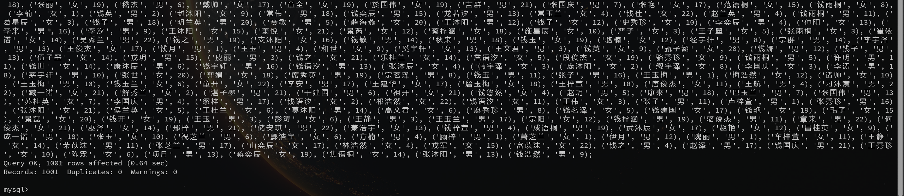

### 3.1.3 查询姓“李”的老师的个数。

```sql
select count(1) as cnt_li from teacher where tname like '李%';
```

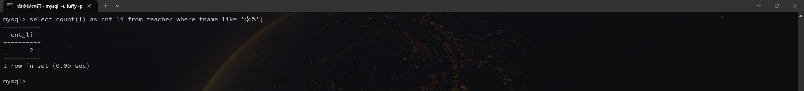

### 3.1.4 查询姓“张”的学生名单。

```sql
select sname from student where sname like '张%';
```


### 3.1.5 查询男生、女生的人数。

```sql
select gender,count(sid) from  student group by gender;
```

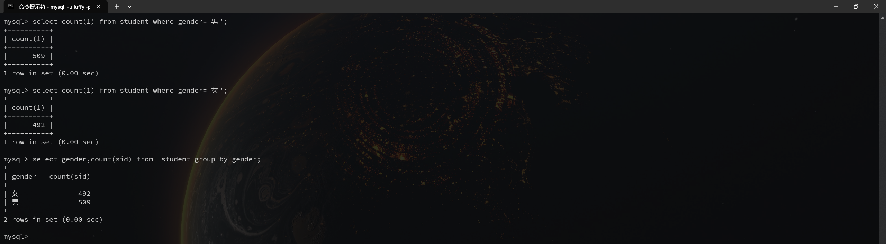

### 3.1.6 查询同名同姓学生名单，并统计同名人数。

```sql
-- 应该是这样的 但是人太多了 小小的limit一下 把重合最多的找了出来
select sname,count(sid) as sameNameCount from student group by sname; 
-- select sname,count(sid) as sameNameCount from student group by sname order by count(sid) desc limit 20;
```


### 3.1.7 查询 “三年二班” 的所有学生。

```sql
select sid,sname,gender from student where class_id=(select cid from class where caption='三年二班');
```


### 3.1.8 查询 每个 班级的 班级名称、班级人数。

```sql
select 
	count(sid) as StudentCount,
	(select class.caption from class where class.cid=student.class_id) as ClassName
from student group by class_id;
```


### 3.1.9 查询成绩小于60分的同学的学号、姓名、成绩、课程名称。

```sql
select 
	(select student.sid from student where student.sid=score.student_id) as SID,
	(select student.sname from student where student.sid=score.student_id) as SName,
	(select course.cname from course where course.cid=score.course_id) as CName,
	number as Score	
from score where number < 60;
```


### 3.1.10 查询选修了 “生物课” 的所有学生ID、学生姓名、成绩。忘记加生物课了，以物理代替。

```sql
select 
	(select student.sid from student where score.student_id=student.sid) as 学生ID,
	(select student.sname from student where score.student_id=student.sid) as 学生姓名,
	(select course.cname from course where score.course_id=course.cid)as 所选课程,
	number as 成绩
from score where course_id=(select course.cid from course where course.cname='物理');
```


### 3.1.11 查询选修了 “物理课” 且分数低于60的的所有学生ID、学生姓名、成绩。

```sql
select 
	(select student.sid from student where score.student_id=student.sid) as 学生ID,
	(select student.sname from student where score.student_id=student.sid) as 学生姓名,
	(select course.cname from course where score.course_id=course.cid)as 所选课程,
	number as 成绩
from score where course_id=(select course.cid from course where course.cname='物理') and number<60;
```

  

### 3.1.12 查询所有同学的学号、姓名、选课数、总成绩。

```sql
select
	(select student.sid from student where student.sid=score.student_id) as studentID,
	(select student.sname from student where student.sid=score.student_id) as studentName,
	count(score.course_id) as CountCourse,
	sum(score.number) as SumScore
from score group by score.student_id;
```

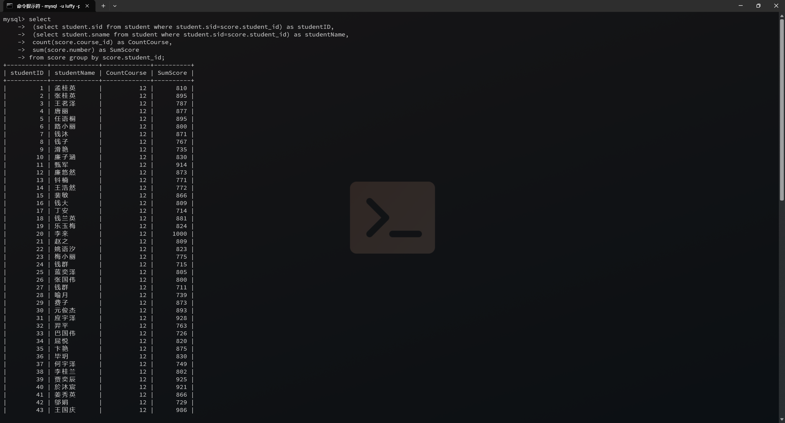

### 3.1.13 查询各科被选修的学生数。

```sql
select 
	(select course.cname from course where course.cid=score.course_id) as courseName,
	count(student_id)
from score group by score.course_id;
```

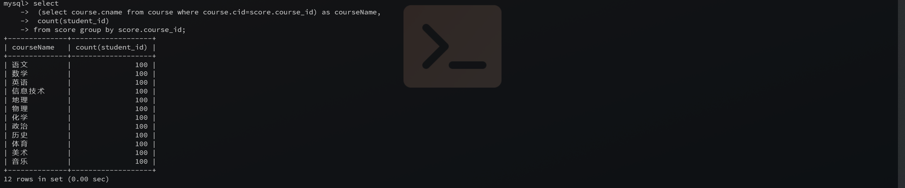

### 3.1.14 查询各科成绩的总分、最高分、最低分，显示：课程ID、课程名称、总分、最高分、最低分。

```sql
select 
	course_id,
	(select course.cname from course where course.cid=score.course_id) as courseName,
	sum(number),
	max(number),
	min(number)
from score group by course_id;
```

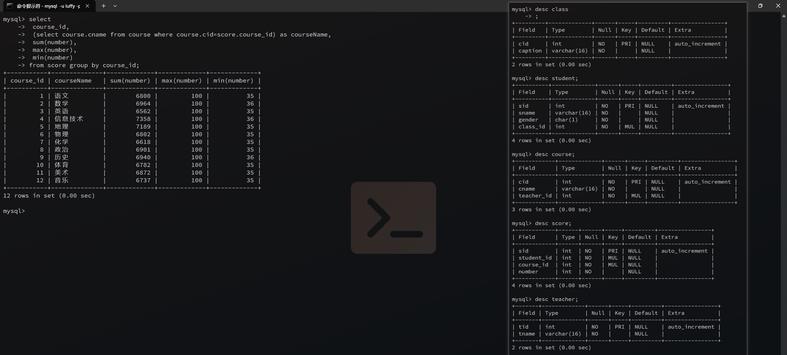

### 3.1.15 查询各科成绩的平均分，显示：课程ID、课程名称、平均分。

```sql
select 
	course_id,
	(select course.cname from course where course.cid=score.course_id) as courseName,
	avg(number)
from score group by course_id;
```

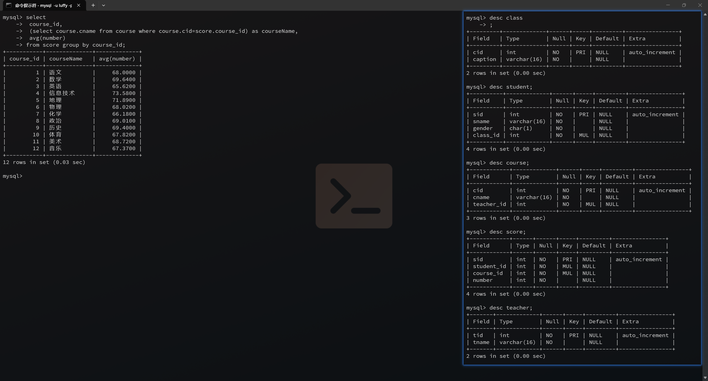

### 3.1.16 查询各科成绩的平均分，显示：课程ID、课程名称、平均分（按平均分从大到小排序）。

```sql
select 
	course_id,
	(select course.cname from course where course.cid=score.course_id) as courseName,
	avg(number)
from score group by course_id order by avg(number) desc;
```

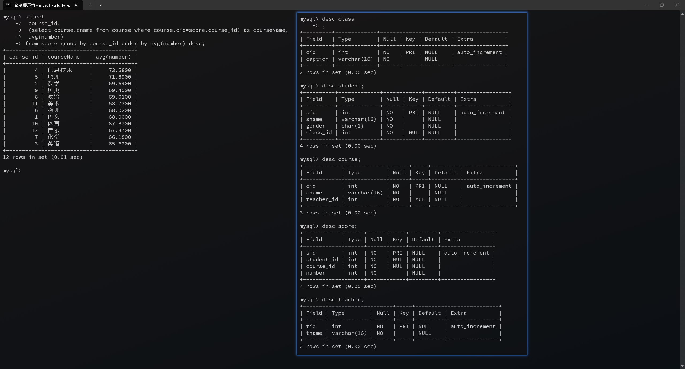

### ⚠️3.1.17 查询各科成绩的平均分和及格率，显示：课程ID、课程名称、平均分、及格率。

```sql
select 
	course_id,
	(select course.cname from course where course.cid=score.course_id) as courseName,
	avg(number),
	count(select student_id from score where number > 60)/count(student_id) as goodRate
from score group by score.course_id;
```

### ⚠️3.1.18 查询平均成绩大于60的所有学生的学号、平均成绩；。

```sql
select 
	(select student.sid from student where student.sid=score.student_id and avg(score.number) > 60) as SID,
	avg(number)
from score group by student_id;
```

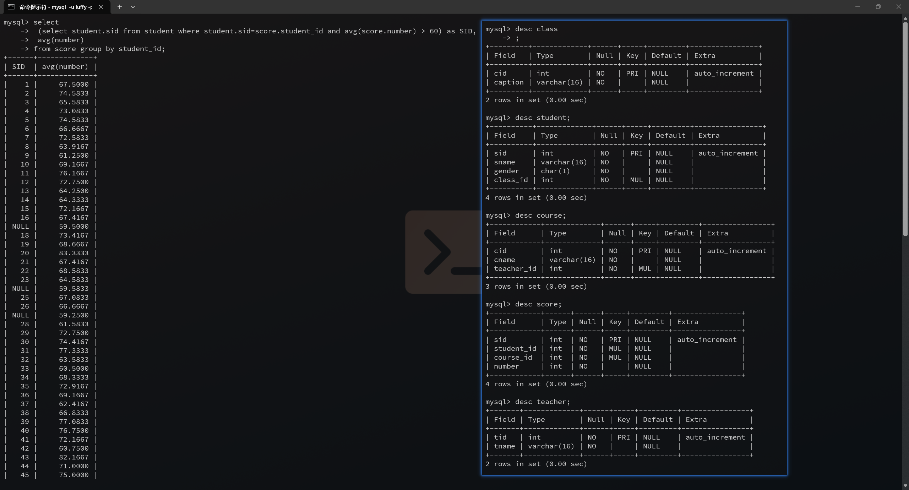

### ⚠️3.1.19 查询平均成绩大于80的所有学生的学号、平均成绩、姓名。

```sql
select 
	(select student.sid from student where student.sid=score.student_id and avg(score.number) > 80) as SID,
	avg(number),
	(select student.sname from student where student.sid=score.student_id) as SName
from score group by student_id;
```

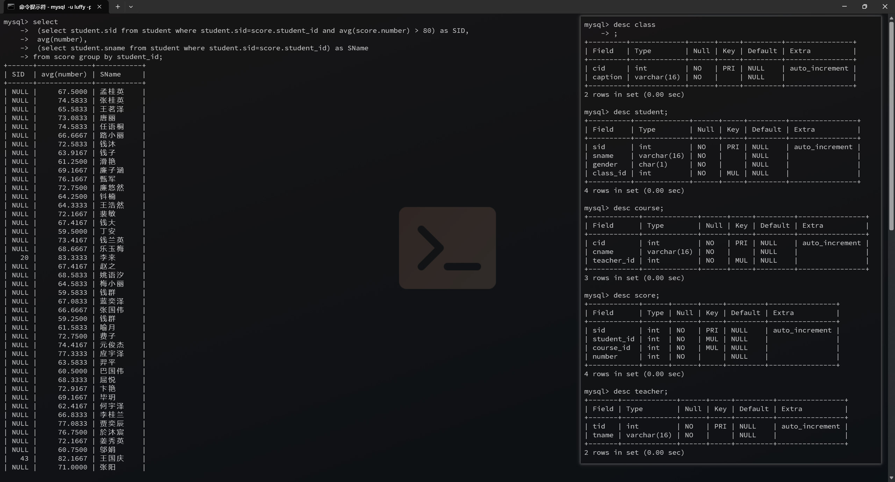

### ⚠️3.1.20 查询 “三年二班”  每个学生的 学号、姓名、总成绩、平均成绩。

```sql
select 
	(select student.sid from student where student.sid=score.student_id) as SID,
	(select student.sname from student where student.sid=score.student_id) as SName,
	...
from score group by student_id ;
```

### 3.1.21 查询各个班级的班级名称、总成绩、平均成绩、及格率（按平均成绩从大到小排序）。

### 3.1.22 查询学过 “波多” 老师课的同学的学号、姓名。

### 3.1.23 查询没学过 “波多” 老师课的同学的学号、姓名。

### 3.1..24 查询选修 “苍空” 老师所授课程的学生中，成绩最高的学生姓名及其成绩（不考虑并列）。

### 3.1.25 查询选修 “苍空” 老师所授课程的学生中，成绩最高的学生姓名及其成绩（考虑并列）。

### 3.1.26 查询只选修了一门课程的全部学生的学号、姓名。

### 3.1.27 查询至少选修两门课程的学生学号、学生姓名、选修课程数量。

### 3.1.28 查询两门及以上不及格的同学的学号、学生姓名、选修课程数量。

### 3.1.29 查询选修了所有课程的学生的学号、姓名。

### 3.1.30 查询未选修所有课程的学生的学号、姓名。

### 3.1.31 查询所有学生都选修了的课程的课程号、课程名。

### 3.1.32 查询选修 “生物” 和 “物理” 课程的所有学生学号、姓名。

### 3.1.33 查询至少有一门课与学号为“1”的学生所选的课程相同的其他学生学号 和 姓名 。

### 3.1.34 查询与学号为 “2” 的同学选修的课程完全相同的其他 学生学号 和 姓名 。

### 3.1.35 查询“生物”课程比“物理”课程成绩高的所有学生的学号；

### 3.1.36 查询每门课程成绩最好的前3名 (不考虑成绩并列情况) 。

### 3.1.37 查询每门课程成绩最好的前3名 (考虑成绩并列情况) 。

### 3.1.38 创建一个表 `sc`，然后将 score 表中所有数据插入到 sc 表中。

### 3.1.39 向 sc 表中插入一些记录，这些记录要求符合以下条件：

- 学生ID为：没上过课程ID为 “2” 课程的学生的 学号；
- 课程ID为：2
- 成绩为：80

### 3.1.40 向 sc 表中插入一些记录，这些记录要求符合以下条件：

- 学生ID为：没上过课程ID为 “2” 课程的学生的 学号。
- 课程ID为：2。
- 成绩为：课程ID为3的最高分。

## 3.2 表结构设计(自己练习)

据如下的业务需求设计相应的表结构，内部需涵盖如下功能。

- 注册
- 登录
- 发布博客
- 查看博客列表，显示博客标题、创建时间、阅读数量、评论数量、赞数量等。
- 博客详细，显示博文详细、评论 等。
  - 发表评论
  - 赞 or 踩
  - 阅读数量 + 1

参考如下图片请根据如下功能来设计相应的表结构。


注意：只需要设计表结构，不需要用python代码实现具体的功能（再学一点知识点后再更好的去实现）。

### 2.1 注册和登录


### 2.2 文章列表

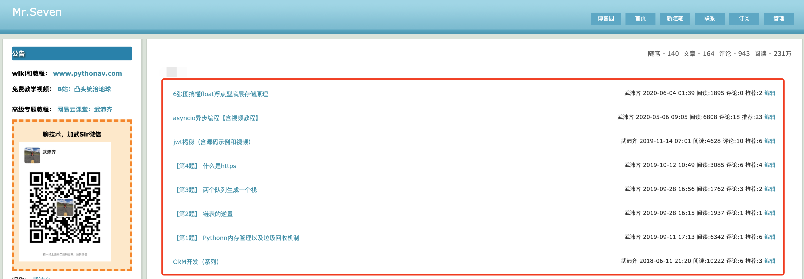


### 2.3 文章详细

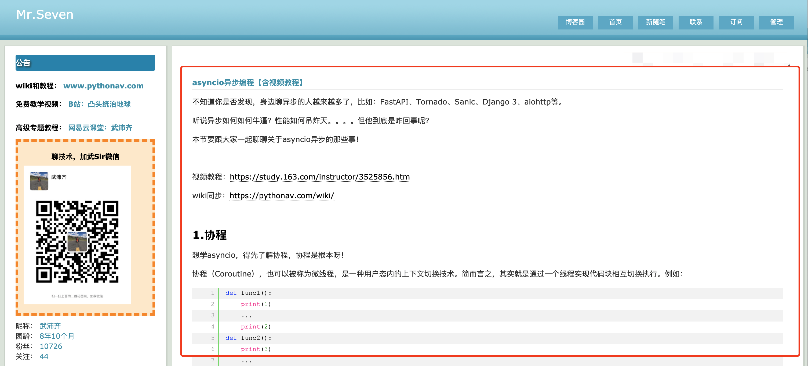


### 2.4 评论 & 阅读 & 赞 & 踩

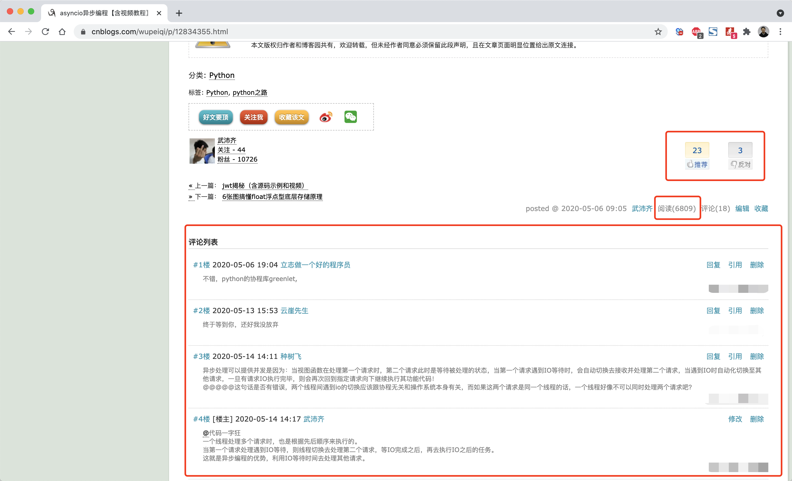

注意：假设都是一级评论（不能回复评论）。

## 3.3 表和数据的导入导出

利用导入数据库命令：

- 导入
  ```sql
  mysql -u root -p 数据库名 > 路径
  ```

  ```sql
  -- school_db.sql
  
  use school;
  
  create table class (
  	cid int not null auto_increment primary key,
      caption varchar(16) not null
  ) default charset=utf8;
  
  create table student (
  	sid int not null auto_increment primary key,
      sname varchar(16) not null,
      gender char(1) not null,
      class_id int not null,
      constraint fk_student_class foreign key (class_id) references class(cid)
  ) default charset=utf8;
  
  create table teacher (
  	tid int not null auto_increment primary key,
      tname varchar(16) not null
  ) default charset=utf8;
  
  create table course (
  	cid int not null auto_increment primary key,
      cname varchar(16) not null,
      teacher_id int not null,
      constraint fk_coures_teacher foreign key (teacher_id) references teacher(tid)
  ) default charset=utf8;
  
  create table score (
  	sid int not null auto_increment primary key,
      student_id int not null,
      course_id int not null,
      number int not null,
      constraint fk_score_student foreign key (student_id) references student(sid),
      constraint fk_score_course foreign key (course_id) references course(cid)
  ) default charset=utf8;
  ```

  ```sql
  -- 注意：要在 cmd 上执行下面的命令，在 powershell 中执行下面的命令是会报错的
  mysql -u root -p school > E:\Documents\SQLFile\mytest.sql
  ```

  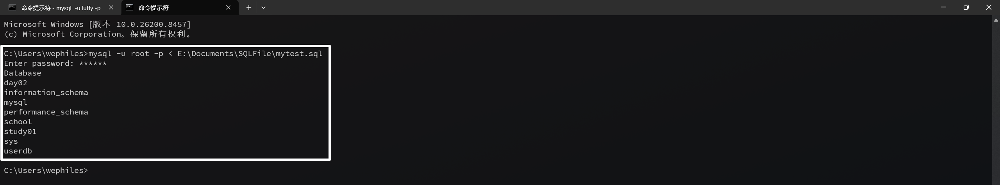

- 导出
  ```sql
  # 结构 + 数据
  mysqldump -u root -p 数据库名 > 路径
  
  # 结构
  mysqldump -u root -p -d 数据库名 > 路径
  ```

  ```sql
  mysqldump -u root -p school > E:\Documents\SQLFile\school_DB_Export_.sql
  ```

  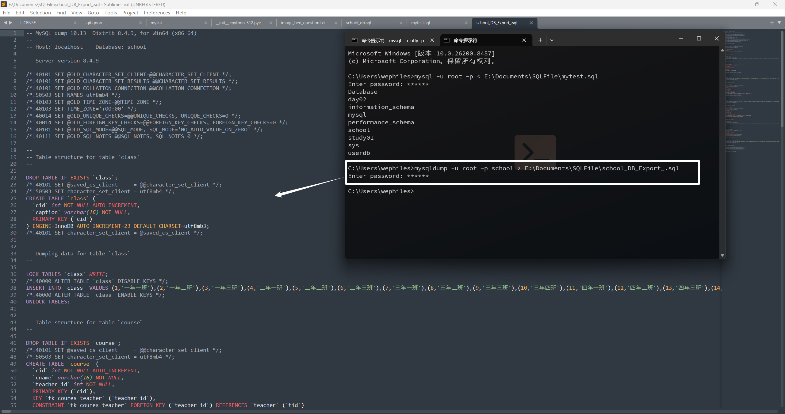
  ```sql
  mysqldump -u root -p -d school > E:\Documents\SQLFile\school_DB_Export_2.sql
  ```

  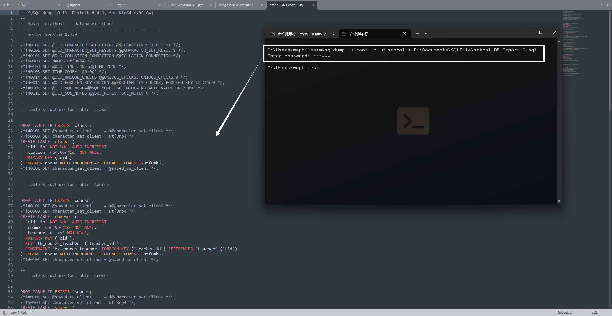


