<h1 style="text-align: center;">Docker</h1>

# 1. 什么是Docker

1. 什么是 docker

   - docker 就是一个【软件】，支持在 Windows、mac、Linux系统上进行安装

   - 可以在一台电脑上根据 **模板** 创建出多个 **隔离的环境**，相比其他方式而言极大的 **节省资源**

2. 为什么要创建隔离的环境

   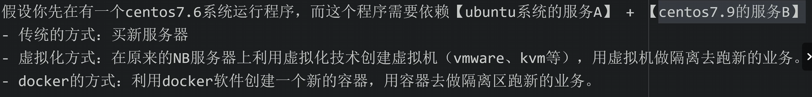

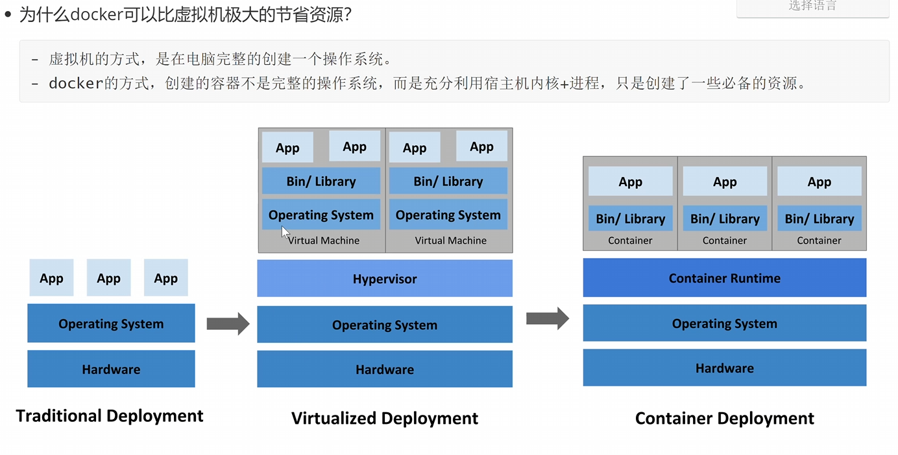

# 2. Docker 必备名词

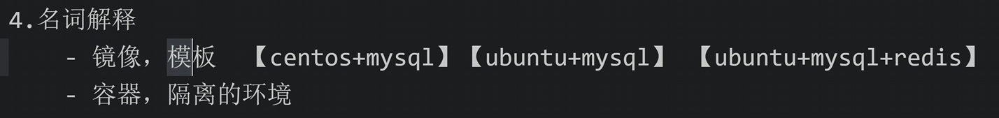

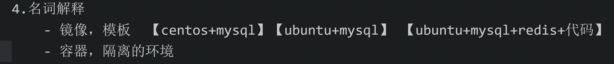

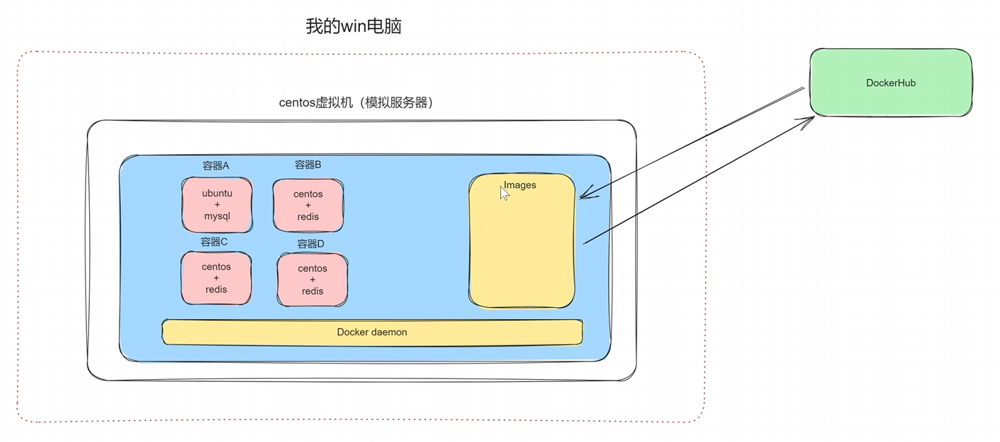

# 3. 环境准备

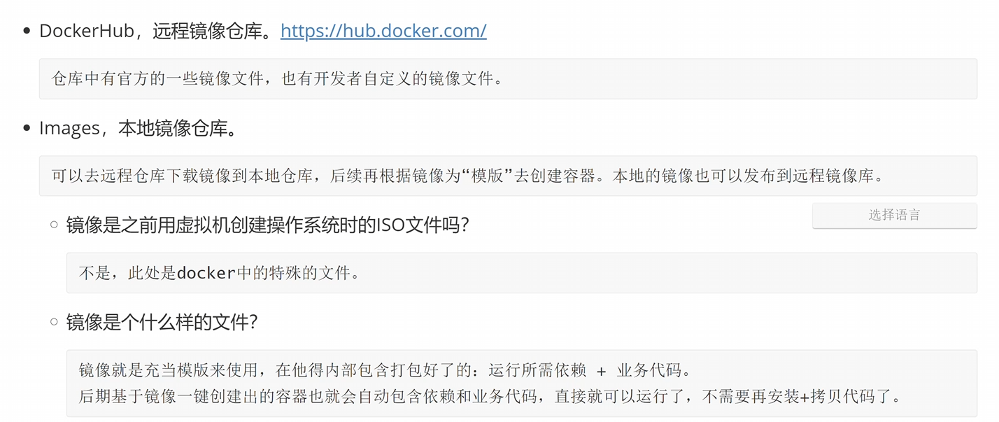

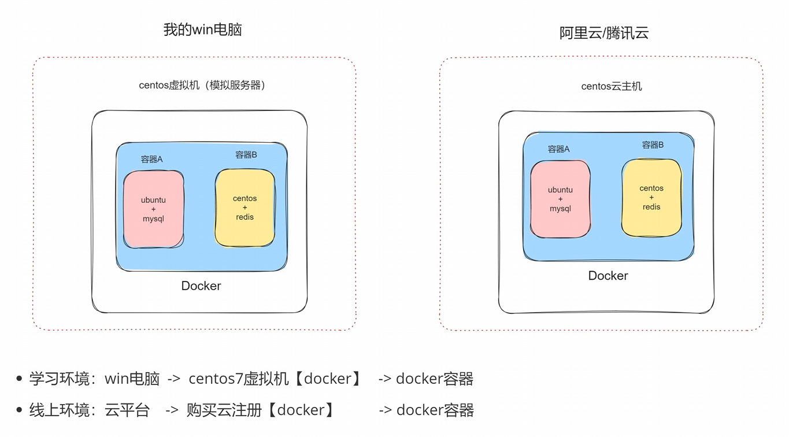


# 4. 安装Docker

...

# 5. 启动 docker

- 设置开机启动
  ```
  systemctl enable docker
  ```

- 启动docker
  ```
  systemctl start docker
  
  systemctl restart docker  # 重启
  ```

- 停止 docker
  ```
  systemctl stop docker
  ```

- 其他
  ```
  ## 查看 docker 信息
  docker version
  
  ## 查看 docker 信息
  docker info
  
  ## 查看有哪些镜像
  docker images
  
  ## 搜索某个镜像
  docker search xxx
  
  ## 
  ```

# 6. 小案例

需求：基于 docker 创建，在`Ubuntu`系统上运行我们开发的Flask网站。

流程：

- 在Ubuntu上安装docker
  ```
  ...
  ```

- 获取镜像 ubunut
  ```
  docker search ubuntu
  docker pull ubuntu
  ## 查看下载的所有镜像
  docker images
  ```

  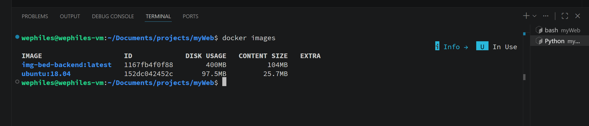

- 在基础镜像上构建自定义镜像【`ubuntu` + python + 代码】

  - Dockerfile -- 宿主机中
    ```
    FROM ubuntu:18.04
    
    LABEL maincontainer wephiles@163.com
    
    RUN apt update
    RUN apt install python3 python3-pip -y
    RUN pip3 install flask
    RUN mkdir -p /data/project
    
    # 拷贝文件到工作目录
    COPY app.py /data/project/app.py
    
    # 工作目录
    WORKDIR /data/project
    
    # 端口映射
    EXPOSE 80
    
    # 容器启动时命令
    CMD ["python3", "app.py"]
    
    ```

  - app.py 宿主机中

    ```
    # app.py
    from flask import Flask
    
    app = Flask(__name__)
    
    
    @app.route("/")
    def home():
        return {"status": True, "message": "success", "data": None}
    
    
    @app.route("/index/")
    def index():
        return {"status": True, "message": "success", "data": ["/", "index"]}
    
    
    if __name__ == "__main__":
        app.run(host="0.0.0.0", port=5000)  # 这里的host要写 0.0.0.0 否则无法在外部成功访问
    ```

- 构建 docker 镜像
  ```
  docker build -t v0:0.1 . -f Dockerfile
  ```

  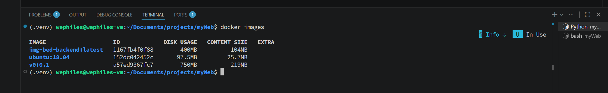

- 基于镜像创建容器 + 运行
  ```
  docker run v0:0.1
  ```

  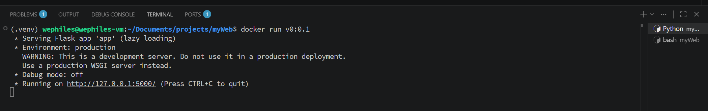

  ```
  docker run -p 80:5000 v0:0.1  # 端口转发
  ```

  ```
  docker run -d -p 80:5000 v0:0.1  # -d 启动后不阻塞我们的命令行 
  ```

  ```
  docker run -d -p 81:5000 v0:0.1  # -d 启动后不阻塞我们的命令行 
  ```

  停止某一个容器：

  ```
  docker stop 容器的ID或者名字
  ```

# 7. Dockerfile

- 创建镜像
  ```
  FROM ubuntu:18.04
  
  LABEL maincontainer wephiles@163.com
  
  RUN apt update
  RUN apt install python3 python3-pip -y
  RUN pip3 install flask
  RUN mkdir -p /data/project
  
  # 拷贝文件到工作目录
  COPY app.py /data/project/app.py
  
  # 工作目录
  WORKDIR /data/project
  
  # 端口映射
  EXPOSE 80
  ```

- 运行容器
  ```
  # 容器启动时命令
  CMD ["python3", "app.py"]
  ```

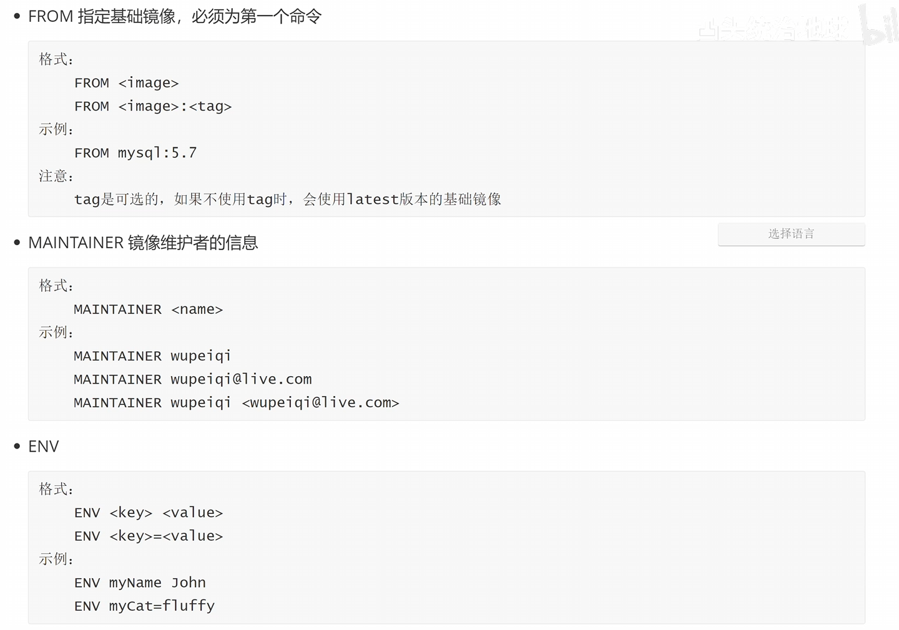

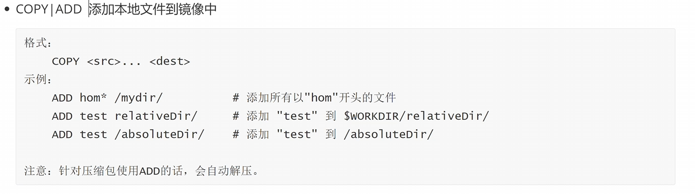

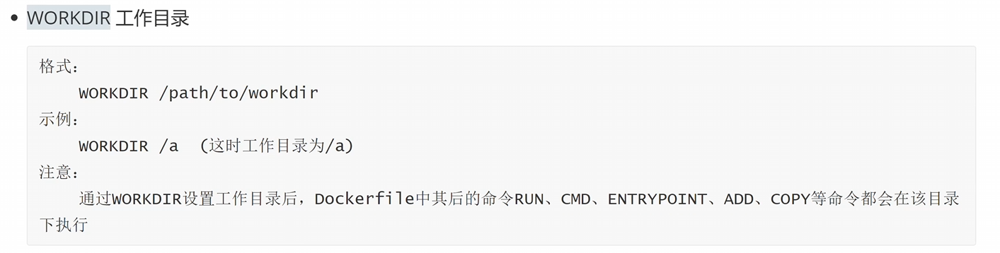

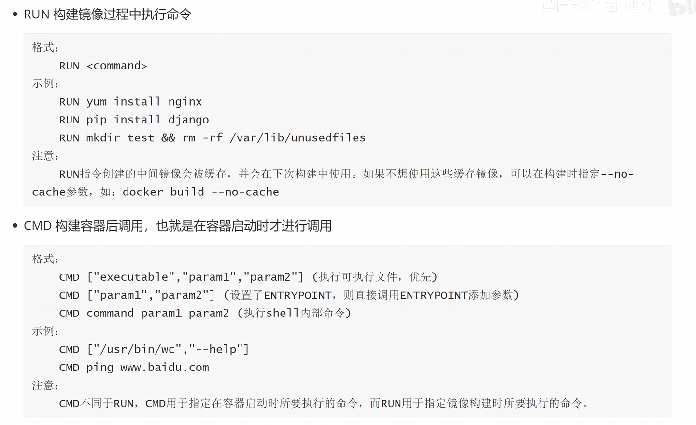

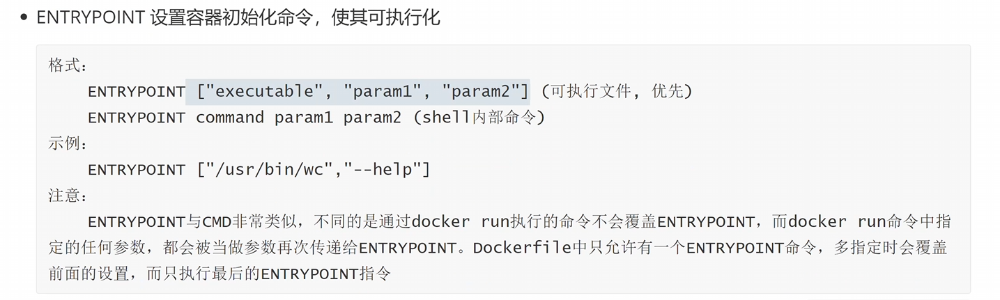

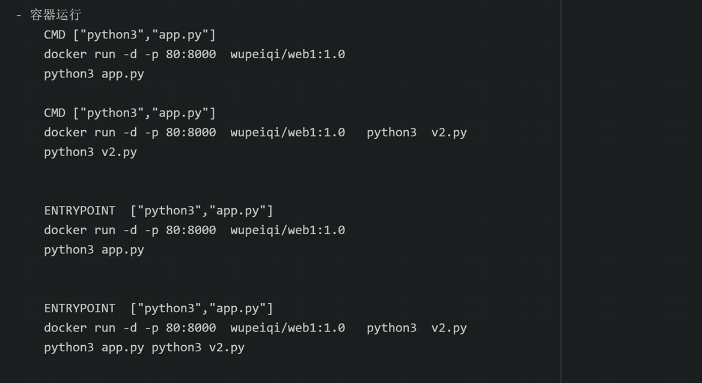

关于`CMD` 和 `ENTRYPOINT` 的扩展：

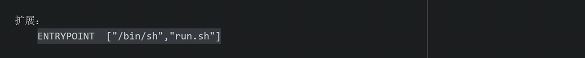

# 8. 构建

```
docker build -t zuozhe/name . -f Dockerfile  # 有问题 -- 可能会有缓存 如果缓存中的东西要修改 这个命令就不会拿到已经修改的东西
```

```
docker build -t zuozhe/name . -f Dockerfile --no-cache
```

# 9. 创建容器

- 容器中必须要有**前台进程**，否则创建之后立即销毁. -- 显式地在前台阻塞住，而不是前台看不到，但在后台运行。
  在 `CMD` 或者 `ENTRYPOINT` 中确保能够将我们的进程阻塞住，而不是在后台偷偷运行。

- 宿主机中，我们一般让docker容器在后台运行

总结：

宿主机后台 + 容器内部前台

# 10. 容器常见操作

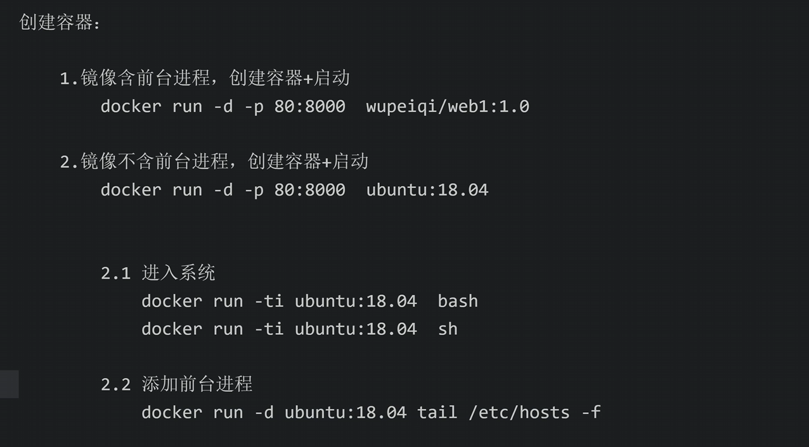

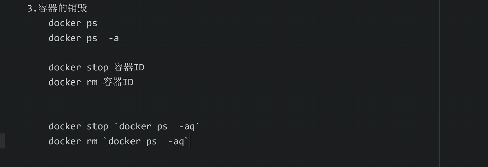

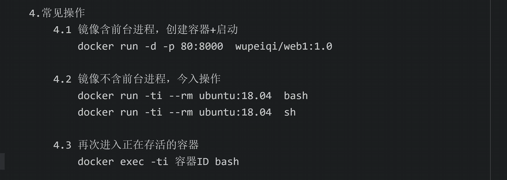

# 11. 部署 Django项目

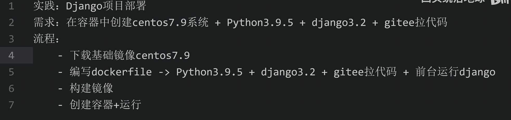


# 12. 实战

```python
我有一个Django项目，关键的一些信息如下，我将其部署到docker上，但是静态文件却无法访问（样式看不到），帮我看看是什么问题：

# 项目目录：
- img_bed 项目根目录
	- manage.py
	- data/
    	- db.sqlite3 --> 数据库
    - bed_apps/ --> 我的app存放目录
    	- poems/     --> 其中一个app
        	- templates/  --> app模板
        - images/    --> 其中一个app
        	- ...
        - accounts/  --> 其中一个app
        	- ...
    - static/ --> 所有静态文件
    - templates --> 共用的模板文件
    
# settings.py

...
BASE_DIR = Path(__file__).resolve().parent.parent
SECRET_KEY = 'django-insecure-6&eg0a)v9$&acfit&tp%g0ju*#4_6i&0bxcj8be%!at8mdkb*h'
DEBUG = False
ALLOWED_HOSTS = ['*']
INSTALLED_APPS = [
    'django.contrib.admin',
    'django.contrib.auth',
    'django.contrib.contenttypes',
    'django.contrib.sessions',
    'django.contrib.messages',
    'django.contrib.staticfiles',

    # 自定义 app
    'bed_apps.accounts.apps.AccountsConfig',
    'bed_apps.images.apps.ImagesConfig',
    'bed_apps.poems.apps.PoemsConfig',
]

MIDDLEWARE = [
    'django.middleware.security.SecurityMiddleware',
    'django.contrib.sessions.middleware.SessionMiddleware',
    'django.middleware.common.CommonMiddleware',
    'django.middleware.csrf.CsrfViewMiddleware',
    'django.contrib.auth.middleware.AuthenticationMiddleware',
    'django.contrib.messages.middleware.MessageMiddleware',
    'django.middleware.clickjacking.XFrameOptionsMiddleware',
]

ROOT_URLCONF = 'img_bed.urls'

TEMPLATES = [
    {
        'BACKEND': 'django.template.backends.django.DjangoTemplates',
        'DIRS': [BASE_DIR / 'templates']
        ,
        'APP_DIRS': True,
        'OPTIONS': {
            'context_processors': [
                'django.template.context_processors.request',
                'django.contrib.auth.context_processors.auth',
                'django.contrib.messages.context_processors.messages',
                'django.template.context_processors.media',
            ],
        },
    },
]

WSGI_APPLICATION = 'img_bed.wsgi.application'
DATABASES = {
    'default': {
        'ENGINE': 'django.db.backends.sqlite3',
        'NAME': BASE_DIR / 'data' / 'db.sqlite3',
    }
}
AUTH_PASSWORD_VALIDATORS = [
    {
        'NAME': 'django.contrib.auth.password_validation.UserAttributeSimilarityValidator',
    },
    {
        'NAME': 'django.contrib.auth.password_validation.MinimumLengthValidator',
    },
    {
        'NAME': 'django.contrib.auth.password_validation.CommonPasswordValidator',
    },
    {
        'NAME': 'django.contrib.auth.password_validation.NumericPasswordValidator',
    },
]
LANGUAGE_CODE = 'zh-hans'
TIME_ZONE = 'Asia/Shanghai'
USE_I18N = True
USE_TZ = False
STATIC_URL = '/static/'
STATICFILES_DIRS = [
    BASE_DIR / 'static',
]
STATIC_ROOT = '/app/staticfiles'
MEDIA_URL = '/media/'
MEDIA_ROOT = '/app/media'

# Dockerfile
FROM ubuntu:latest
LABEL authors="wephiles"
ENV DEBIAN_FRONTEND=noninteractive

RUN apt-get update && apt-get install -y \
    python3 \
    python3-pip \
    python3-venv \
    && rm -rf /var/lib/apt/lists/*
WORKDIR /app
RUN python3 -m venv /opt/venv
ENV PATH="/opt/venv/bin:$PATH"
COPY requirements.txt .
RUN pip install --no-cache-dir -r requirements.txt
COPY . .
RUN python3 manage.py collectstatic --noinput
RUN chmod -R 755 /app/staticfiles
EXPOSE 8000
ENTRYPOINT ["gunicorn", "--bind", "0.0.0.0:8000", "--workers", "3", "img_bed.wsgi:application"]
# docker-compose.yml
version: '3.8'

services:
  web:
    build: .
    container_name: django_web
    volumes:
      # 挂载 SQLite 数据库目录，防止容器重启数据丢失
      - sqlite_data:/app/data
      # 挂载收集后的静态文件目录，让 Nginx 容器也能读取
      - static_files:/app/staticfiles
    restart: always

  nginx:
    image: nginx:latest
    container_name: django_nginx
    ports:
      - "80:80"
    volumes:
      # 挂载 Nginx 配置文件
      - ./nginx/nginx.conf:/etc/nginx/conf.d/default.conf:ro
      # 共享静态文件卷
      - static_files:/app/staticfiles:ro
    depends_on:
      - web
    restart: always

volumes:
  sqlite_data:
  static_files:
# nginx.conf:
upstream django_app {
    # 指向 Django 容器的 8000 端口
    server web:8000;
}

server {
    listen 80;
    server_name localhost; # 生产环境替换为你的域名

    # 处理静态文件请求
    location /static/ {
        alias /app/staticfiles/; # 指向 Django collectstatic 收集的目录
    }

    location /media/ {
        alias /app/media/;
    }

    # 处理动态请求，转发给 Gunicorn
    location / {
        proxy_pass http://django_app ;
        proxy_set_header X-Forwarded-For $proxy_add_x_forwarded_for;
        proxy_set_header Host $host;
        proxy_redirect off;
        # 针对 SQLite 并发写入限制，适当延长超时（虽然生产不推荐 SQLite）
        proxy_read_timeout 120s;
    }
}
```


