<h1 style="text-align: center;">Git实战</h1>

# 一、 什么是`git`

git是一个**分布式版本控制软件**。

-   分布式：分布式是，其中一个节点挂了，只要不是所有节点都挂了那数据就可以恢复。
-   版本控制：
    -   最开始：第一版、第二版、第三版、最终版、最终不修改版、最终一直不修改版...这些都是我们没有使用版本控制工具，只是使用文件复制的方式进行版本控制的方式，就是管理一个文件的好几种版本。 -- 我们以前是使用文件拷贝的方式，电脑里有很多很多文件。
    -   慢慢出现版本控制的软件 -- 本地版本控制：本地只能看到一个文件 数据库将会你以前的文件存到另外一个地方 我们只能看到当前状态的一个版本的文件 -- 这是个进步，电脑上不会再有太多的文件，而只会只有一个版本的我们可以看到，如果我们需要以前的版本，可以通过某些方式进行回滚。 -- 但是，如果要两个人协作开发，这种版本控制不太行。
        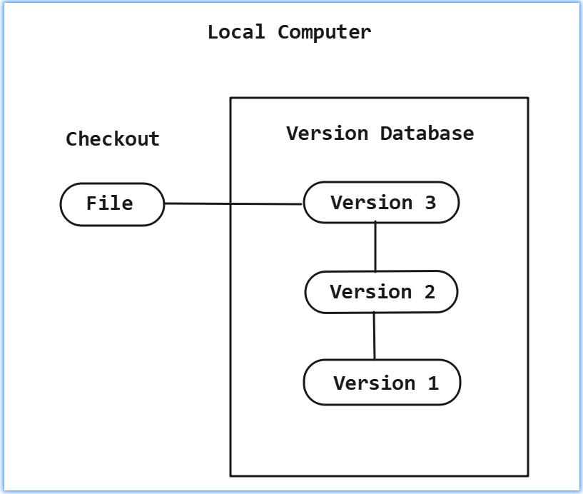
    -    集中式版本控制：最有代表的是SVN -- 有个问题 对于A和B，都需要提交到中心，但是如果有一方断网了，或者中心宕机了，A和B提交的话就无法提交
        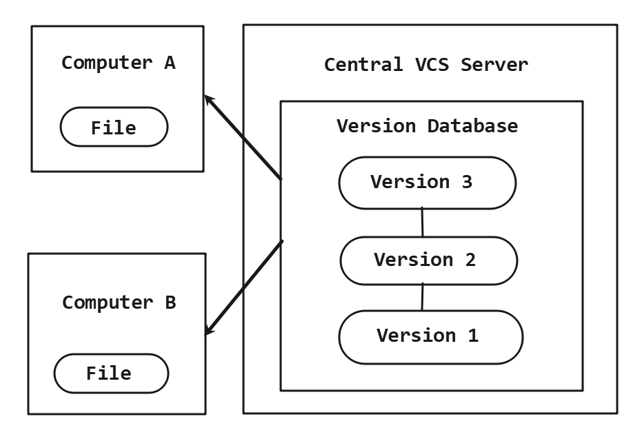
    -   分布式版本控制工具 -- 不管是中心还是A和B，都存在每一个版本，如果其中一个挂掉了，另外的只要有备份，那么就不会丢失数据。如果有新功能，先提交本地版本，再从本地版本提交中心。
        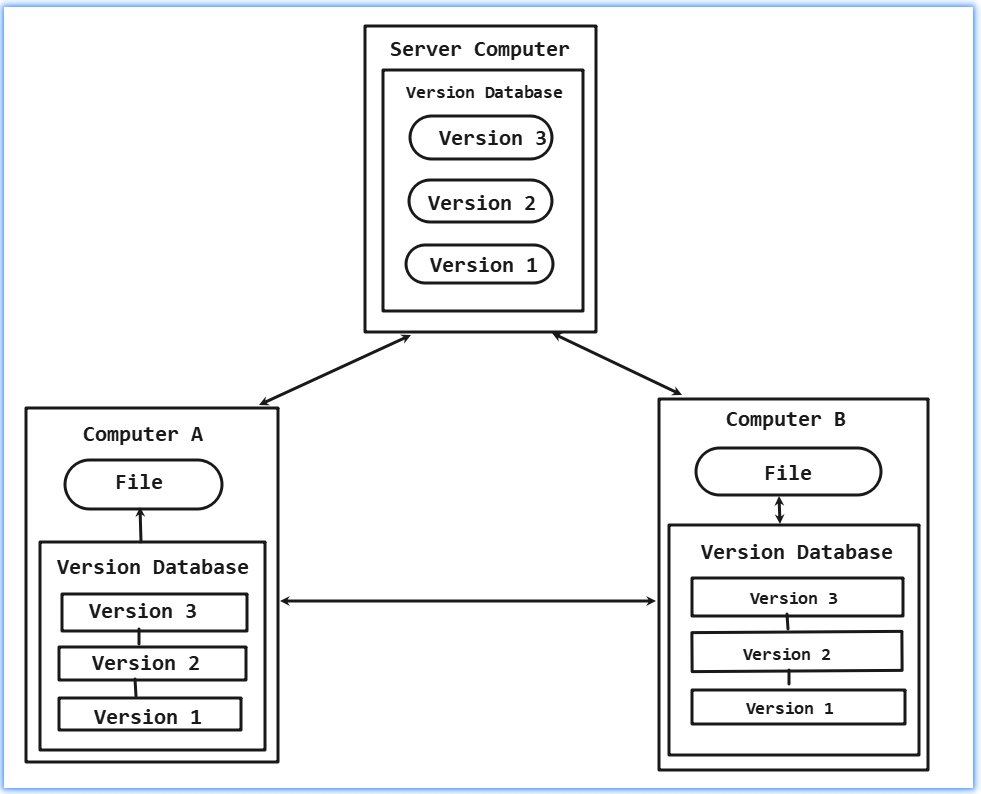
-   软件：是个工具，安装到我们电脑上的工具。

# 二、 Git实战

## 2.1 下载安装`git`

注意：要下载安装在自己电脑上，并且自己电脑只能管理自己的版本。 -- 后面的学习才上传`github`

-   linux
-   mac
-   windows

在windows下载安装Git，可以去网络上搜索相关操作步骤，安装好之后进行简单的配置即可。

## 2.2 第一阶段 用一个故事学会`git` 自己一个人做项目

一个屌丝创业的故事 -- 东北热。

### 2.2.1 创业第一阶段

自己**一个人**，想搭建一个平台。 -- 自己去写代码，最开始必须考虑版本控制（如果想做大的话）。

在自己电脑上，新建一个叫`dbhot`(东北热)的文件夹，这个文件夹就存储所有的项目代码。

假设已经写了一个月，基本功能已经实现了。

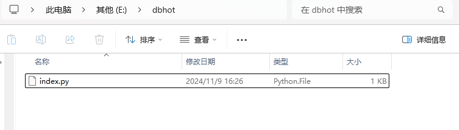

==接下来为了能够实现版本控制，接下来的几步要记住了！== -- 让git帮我们管理我们的文件夹

1.   进入要管理的文件夹：
     在windows中，点进去要管理的文件夹中

2.   初始化：
     在项目文件夹中任意位置，右键，点击Git Bash Here。
     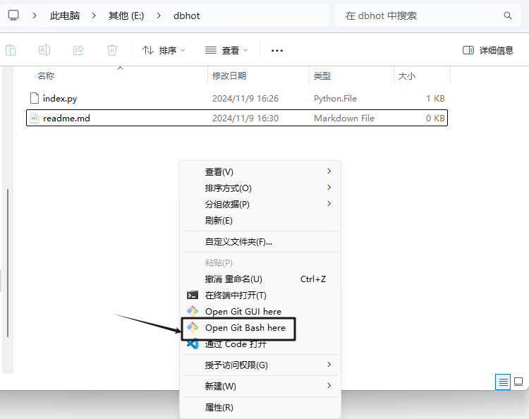

     点击过后，会出现一个黑框框，输入命令`git init`
     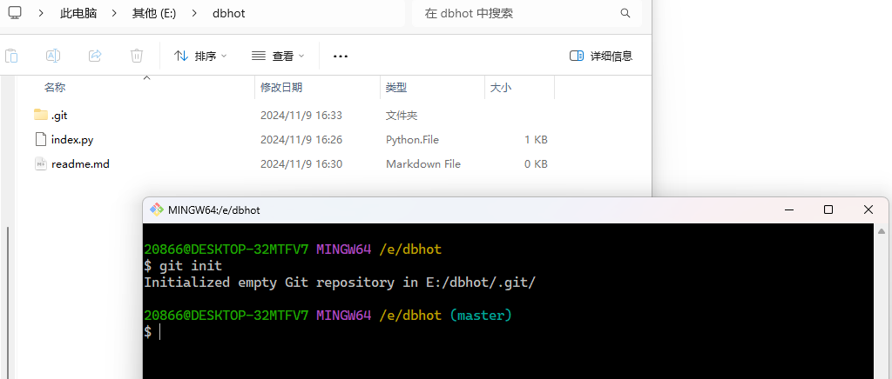
     会出现一个.git的文件夹。说明可以进行管理了。

3.   管理：
     试着输入`git status` -- 检测当前文件夹下文件的状态。
     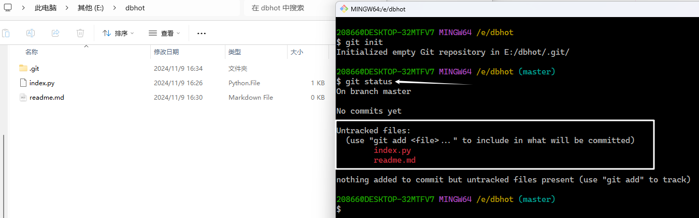
     出现两个红色的文件名。

4.   生成版本(目的)：
     ```bash
     git add 文件名
     ```

     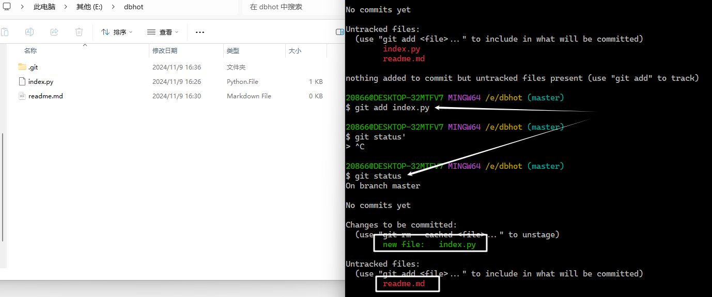
     看上图，使用`git add 文件名`后，被add的那个文件==**变绿**==了，没有被add的就还是红色。 
     注意：使用下面的命令可以将当前文件夹下所有的文件add：

     ```bash
     git add .
     ```

     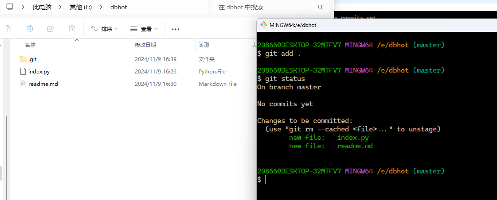
     生成版本：

     ```bash
     git commit -m "这里可以随便写，要写清楚这次提交的概述信息。"
     ```

     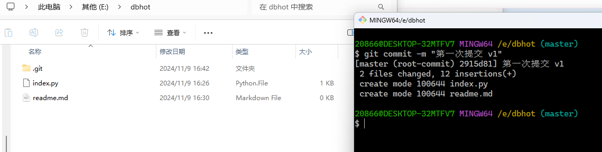
     再次使用`git status`
     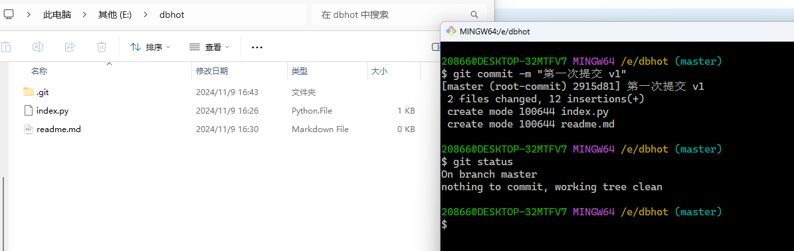
     此时发现啥都没有了，说明git已经帮我们管理起来所有文件并生成一个版本了。

### 2.2.2 继续开发

假设我继续开发了一个功能，放进继续开发`.txt`文件里面去了。--对文件夹的文件做了修改

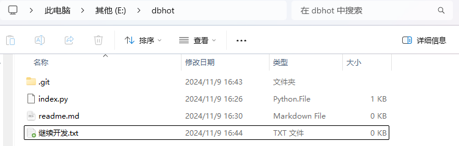

使用`git status` -- 可以检测到进行了修改

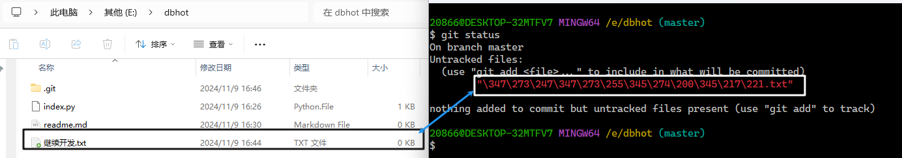

此时还需要再使用`git add 文件名`和`git commit -m "xxx"`来再次生成版本。

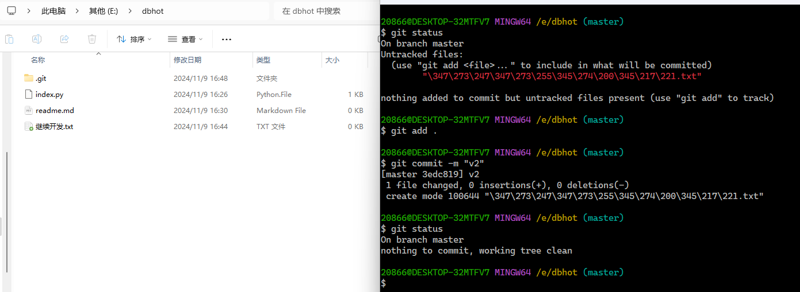

### 2.2.3 查看版本记录

```bash
git log
```

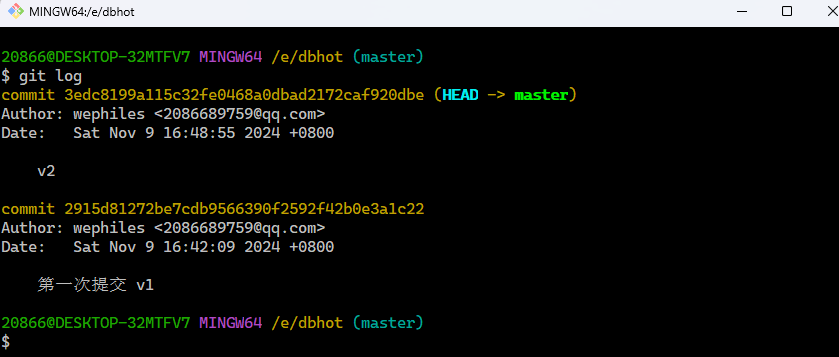

### 2.2.4 简单总结

```bash
git init  # 初始化
git status  # 查看文件状态

# 管理起来
git add .
git add 文件名

# 生成版本
git commit -m "Add files."

# 查看版本记录
git log
```

使用`git status`命令时，文件三种状态的变化：

-   红色：修改过的老文件/新增的文件 `git add` 命令 -- 变成绿色
-   绿色： git已经管理起来了，但是没有生成版本 `git commit - m ""` 生成版本
-   已经生成版本 -- 不显示文件夹了

>   注意：上述过程中新手电脑上可能会报错 -- 关于配置的问题 -- 如果是第一次装`git`的话会报错 -- 以前安装过的就不会
>
>   生成版本的时候，需要告诉git是谁生成的版本 -- 需要在commit之前做一个配置：这个配置在最开始只需执行一次即可。
>
>   -   用户名 `git config --global user.name "这里写你的名字"`
>   -   邮箱 `git config --global user.email "这里写你的邮箱"`

## 2.3 用一个故事学会git - Git三大区域

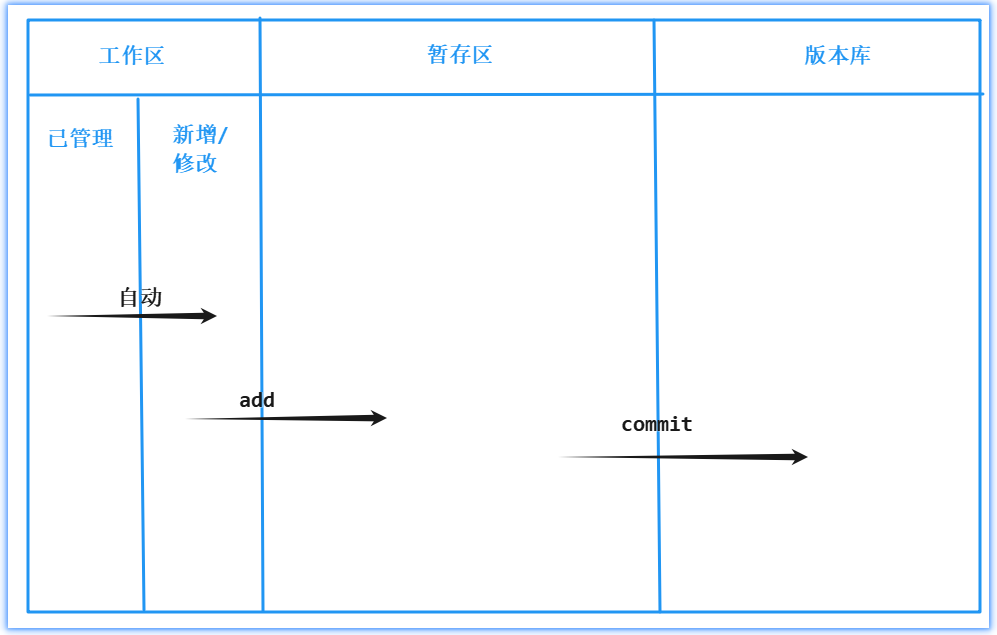

git三大区域

-   工作区 红色/没有文件显示 已管理到新文件/修改的文件： 自动检测。使用add命令将文件提交到暂存区(变绿)
    -   已管理
    -   新文件/修改的文件
-   暂存区 -- 绿色 -- 暂存区的文件使用commit
-   版本库

## 2.4 第二阶段 增加一些牛逼的功能 -- 比如短视频

使用`add `, `commit`等命令，和上面的顺序一样。

## 2.5 第三阶段 -- 增加一个约饭的功能 -- 打擦边球的功能 但是被有关部门约谈了

使用`add `, `commit`等命令，和上面的顺序一样。这次添加了一个约饭的功能（假设是v3）...

现在已经有了很多版本。

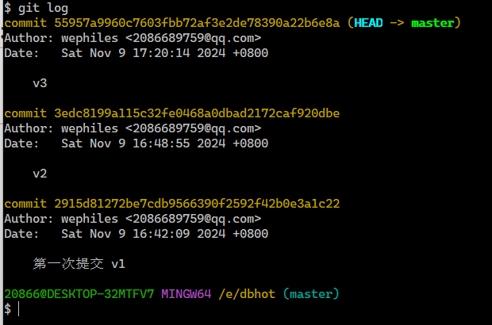

有一天，有关部门说项目的约饭功能有问题，软件不能通过审核 -- 回滚。

```bash
git log  # 查看所有记录
git reset --hard 版本号  # 这个版本号可以在git log的输出信息里面找到，每个版本对应一个版本号，直接回滚到相应的版本号即可
```

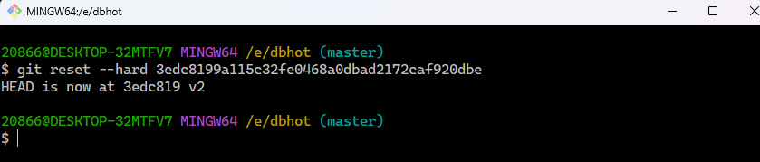

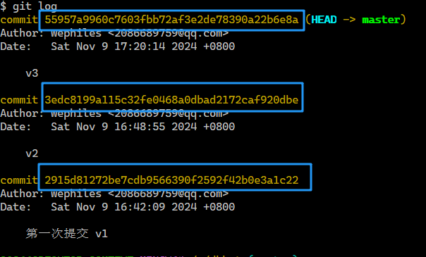

然后使用`git log`查看：

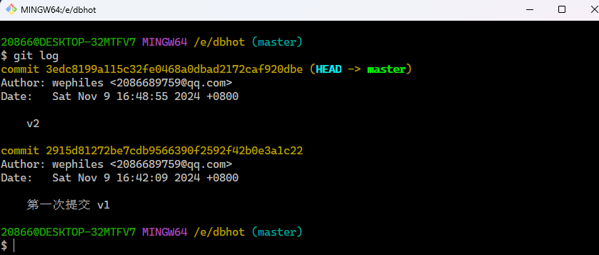

## 2.6 后来，通过某些方式，只要将约饭的功能改个名字就可以上线了

但是，我们发现通过`git log`我们以前的`v3`版本找不到了，我们想回复到以前的`v3`版本 -- 怎么做？

!这时候在查看的时候就不能用`git log`了，要用`git reflog`

```bash
git reflog
```

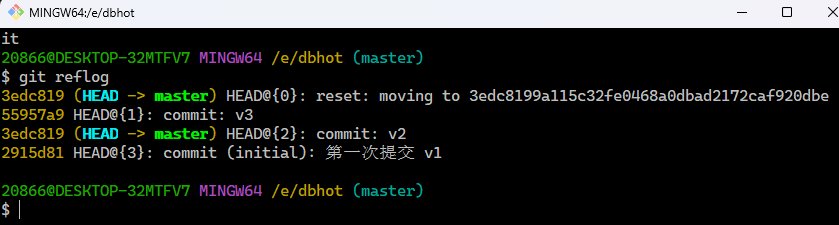

要想回去，只需要再次使用`git reset --hard 版本号`即可。

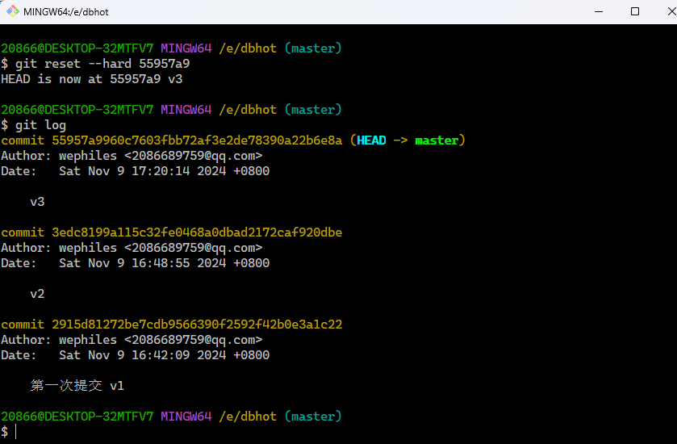

## 2.7  小总结

回滚与恢复

```bash
# 回滚
git log  # 查看版本号
git reset --hard 版本号  # 回滚

# 恢复
git reflog  # 查看已回滚的版本号
git reset --hard 版本号  # 恢复
```

## 2.8 命令总结

```bash
git init
git status
git add
git commit
git log
git reflog
git reset --hard xxx
```

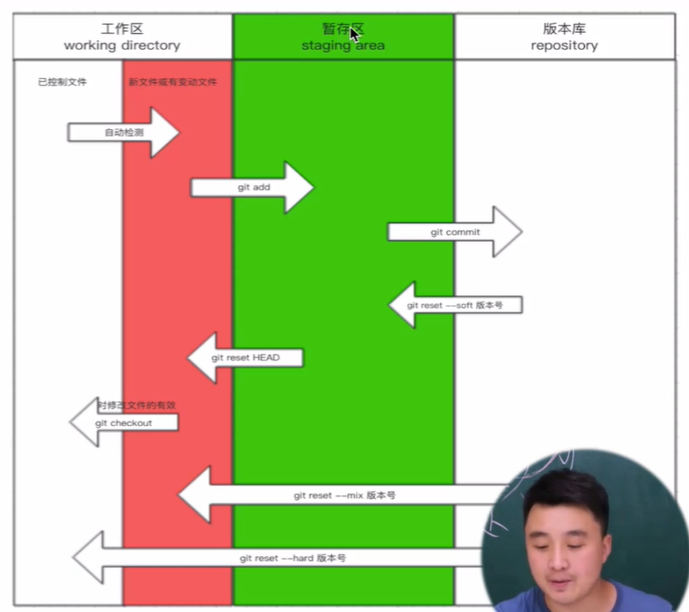

## 2.9 分支

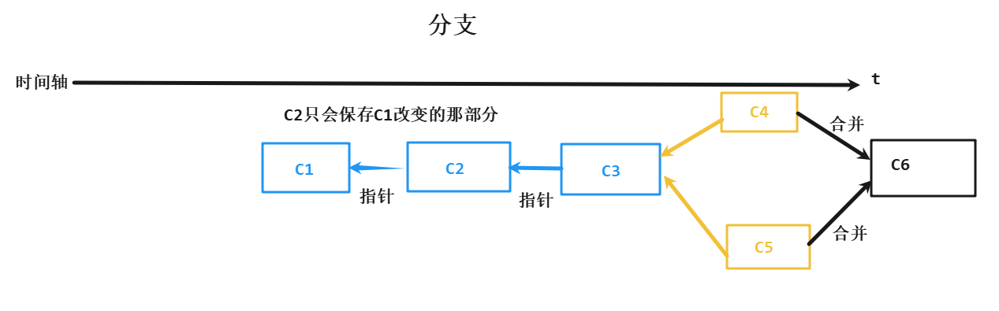

## 2.10 第四阶段 开发一个商城 还是自己一个人写 预计两个月才能开发出来

假设已经写了一个月，发现线上网站出bug了 -- 刚开发了一半的这个功能怎么办？ -- 分支

解决方案：

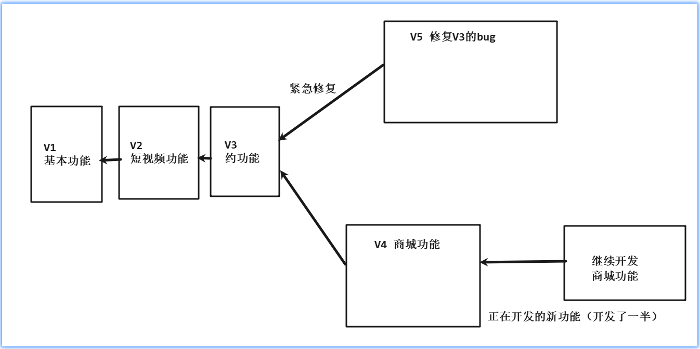

主干：默认叫`master`

使用`git branch`: 打印出本项目的分支

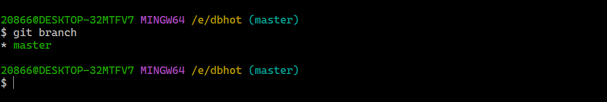

创建新分支:

```bash
git branch dev
```

此时，`dev`分支是在`v3`版本的后面进行开发的

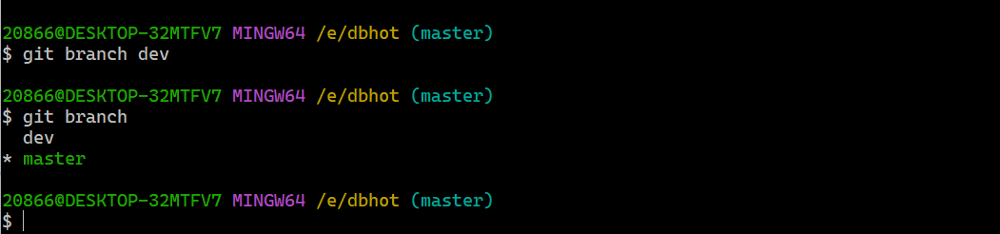

跳到`dev`分支，在`dev`分支上进行开发：在这个分支里面写代码是不影响`master`的

```bash
git checkout dev
```

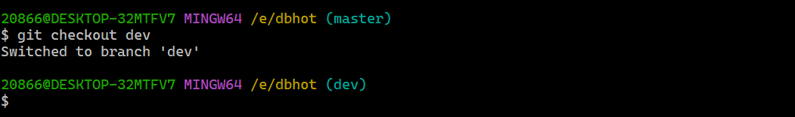

在dev上，我进行了一些开发：

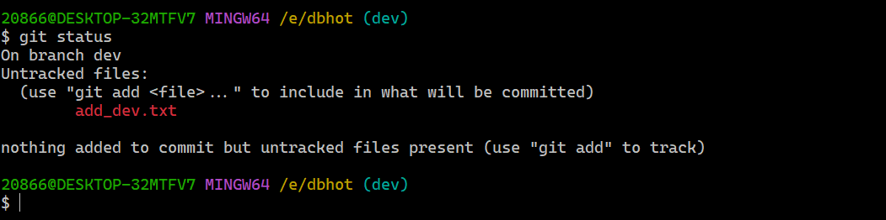

`add`、`commit`：

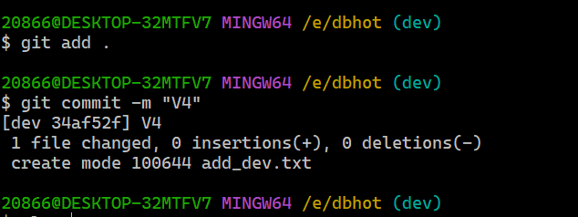

然后可以使用`git log`命令

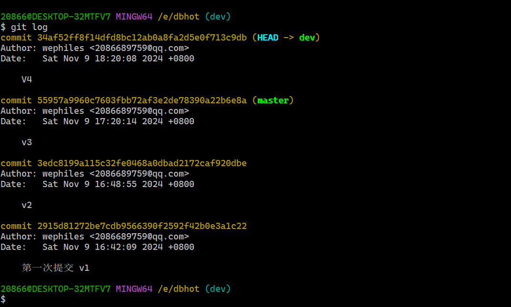

当我们切换回`master`后，使用`git log`：

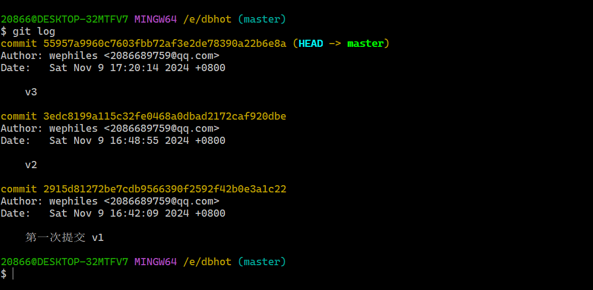

这个`dev`分支上的就是我们正在开发，但是还没有开发完的代码，但是这时候已经上线的代码出现了`bug`,这时候我们需要切换回`master`进行`bug`处理：

创建`bugfix`分支：**注意: 必须在master分支上创建 bugfix 分支**

```bash
git branch bugfix
```

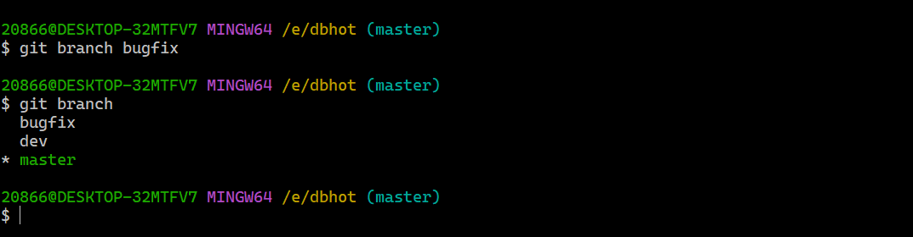

切换到`bugfix`分支进行`bug`修复:

```bash
git checkout bugfix
```

现在修`bug`，修好后，还是`add`和`commit`

修好后吗，需要将`bugfix`分支合并到`master`分支。

要想合并，首先得切换回master分支。

```bash
git merge bugfix
```

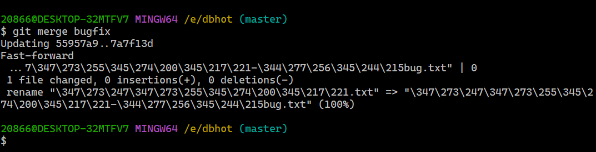

`git log`:

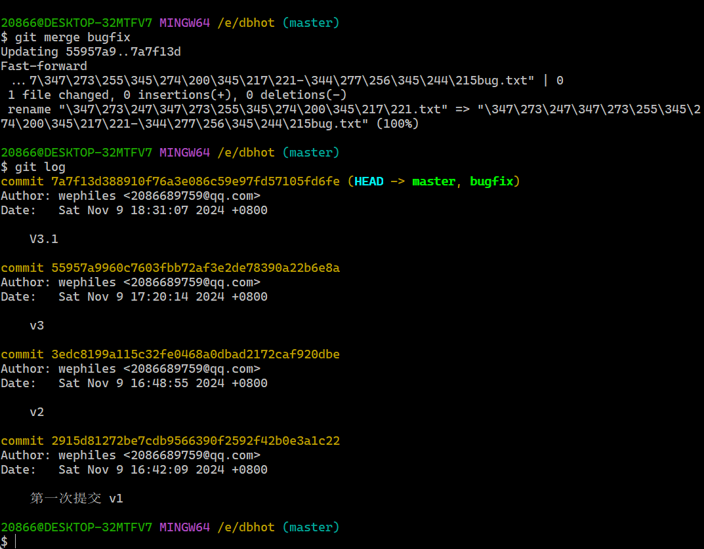

bug修复完毕后，已经没有用了，删除之即可。

删除分支：

```bash
git branch -d bugfix
```

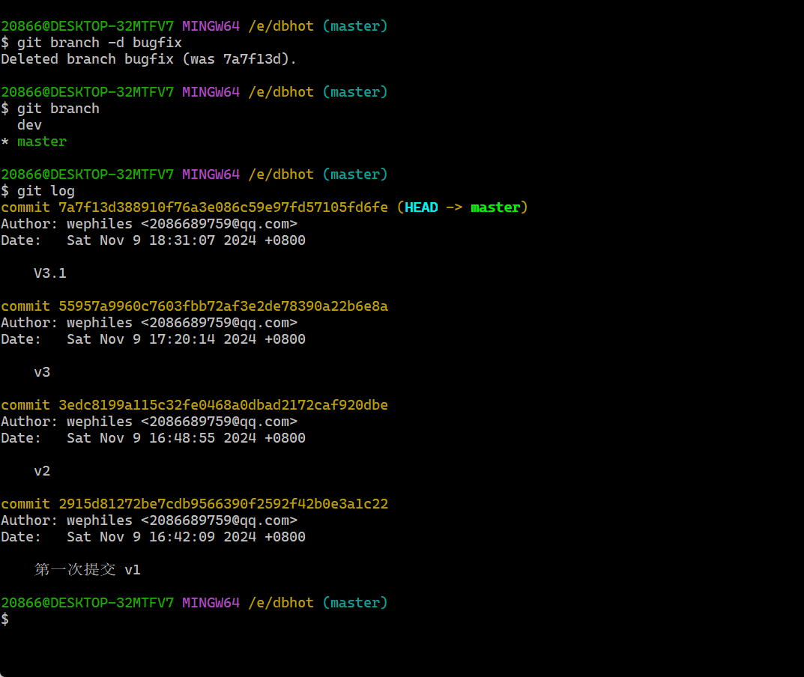

现在线上代码已经正常运行了，这时候就又去`dev`分支继续开发。虽然dev分支是从master分支过来的，但是，之前创建`dev`分支的时候`bug`其实还有，但是`dev`分支最主要的目的是进行开发，所以`bug`先不管。

此时过了一段时间，商城开发完毕，使用`add`和`commit`。

开发完毕后，要将`dev`合并到`master`：==可能==会产生冲突，系统不知道该怎么做了，不知道要选哪一个 --  自己手动去有冲突的地方解决冲突。 -- 没有同时修改同一行的话就不会产生冲突。

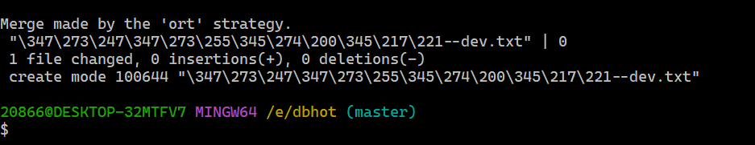

冲突解决完后，直接提交就行

## 2.11 命令总结

-   查看分支
    ```bash
    git branch
    ```

-   创建分支
    ```bash
    git branch 分支名
    ```

-   切换分支
    ```bash
    git chrckout 分支名
    ```

-   合并分支 注意：谁合并谁要注意，并且可能产生冲突
    ```bash
    git checkout 要合并其他分支的分支
    git merge 要合并到其他分支的分支
    ```

-   删除分支
    ```bash
    git branch -d 分支名
    ```

# 三、 `Git`使用工作流

有个新项目，必须创建至少两个分支。

-   `master`分支
-   `dev`分支

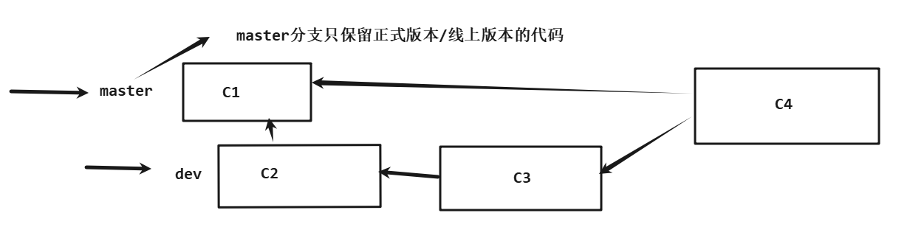

# 四、 `github`

## 4.1 注册账号

此处省略

## 4.2 创建远程仓库 推送到远端 --  上班之前将代码推送到github了

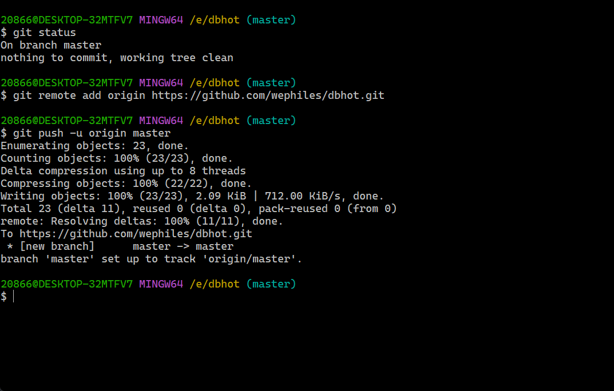

## 4.3 到公司了，要把代码`pull`下来

第一次使用`clone`将代码拉下来。注意拉下来的看似只有一个`master`分支，其实是都拉下来了，只不过不显示，可以直接切换。

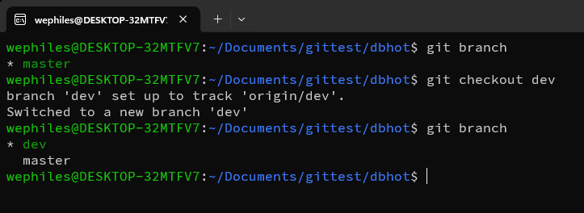

# 五、 第五阶段 进军三里屯

要继续开发，要在`dev`分支上合并`master`分支。

在公司继续写代码..

写了很多代码..

在`dev`分支上开发完后，推送到远程仓库，下班回家！

回家后，切换到`dev`分支，将远端的`dev`分支的代码`pull`下来

```bash
git pull origin dev
```

于是在`dev`分支上继续肝，肝完后推送到dev分支上。

睡觉。

第二天到公司了，更新代码...如此循环往复即可。

假设在公司开发完毕了：

首先`add `、`commit`

再切换到`master`分支

然后合并

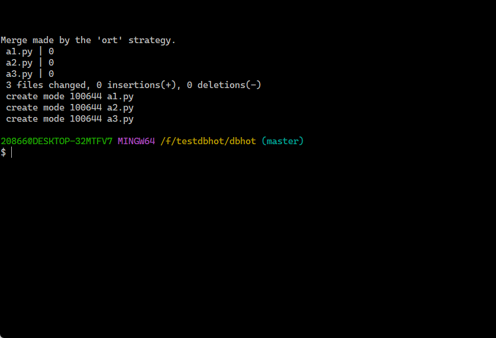

然后在`master`分支上推送到远程分支，就算是上线完成了。

再回来`dev`分支，将`dev`分支提交到远程。

以上，在公司将`dev`和`master`代码都传到远程服务器了。

回家后，将`master`和`dev`分支的代码都`pull`下来即可。

# 六、 忘记推送代码

在公司写的代码(开发了50%)没有提交到`github`上，回家后，拿不到公司写的代码。

于是在家写了点其他功能，将这这些其它代码提交到`github`上了，第二天去公司后，就需要合并，此时可能产生冲突。-- 我们发现，果然产生冲突了。

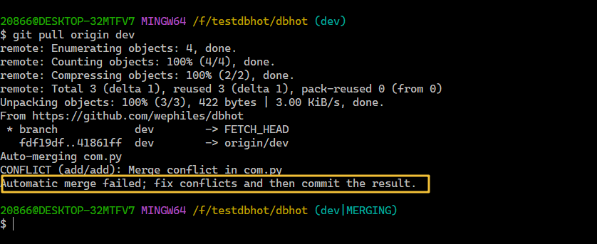

打开有冲突提示的那个文件，如下：

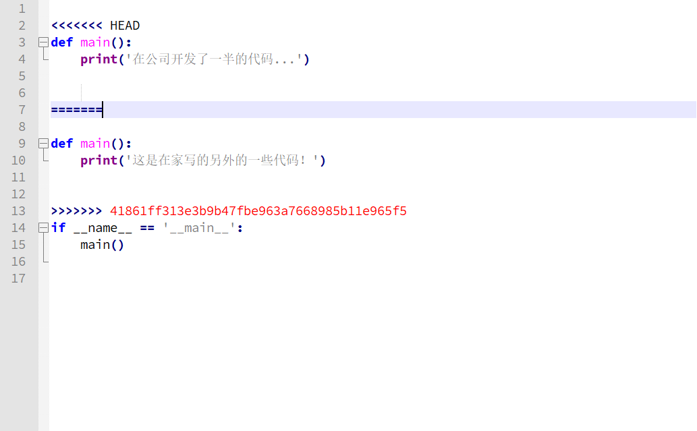

这时候只需要我们手动解决冲突。解决完冲突后在公司继续开发...

开发完毕剩下的50%功能后`add commit push`一气呵成

回家后将线上代码拉下来，继续开发继续开发即可

```bash
git pull origin dev = git fetch origin dev + git merge origin/dev
```


# 七、 `rebase`(变基)

## 7.1 `rebase`的作用

使提交记录变得简洁

## 7.2 `rebase`应用场景

### 7.2.1 情景1 整合多个记录为一个记录

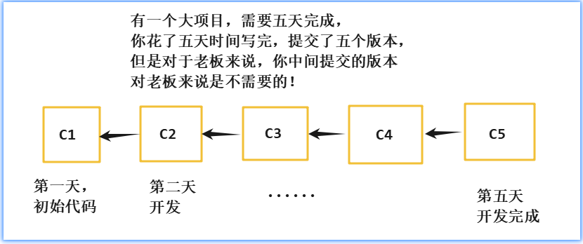

```bash
# 进入终端 新创建一个项目
# 假设新创建的项目叫pro_rebase
# 我们模拟经过几天的开发已经有了很多的版本，如下图所示
```

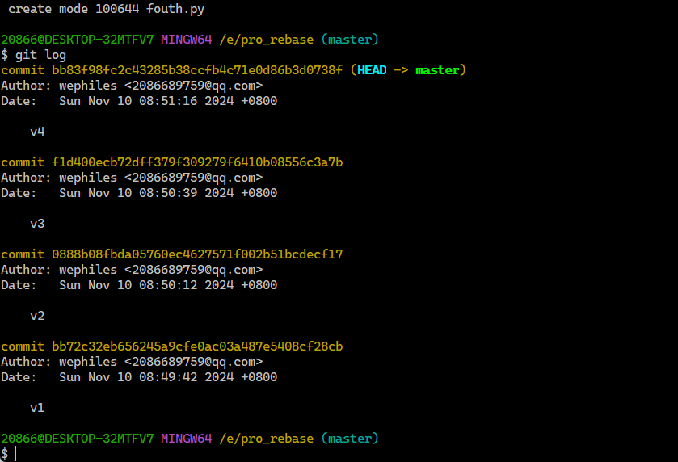

那么怎么合并呢？

```bash
git rebase -i 版本号  # 从当前的版本到v2版本的所有版本合并为一个版本
git rebase -i HEAD~3  # 从当前开始找最近的三条记录进行合并
```

上述命令敲击以后，回车，会出现下面的页面：

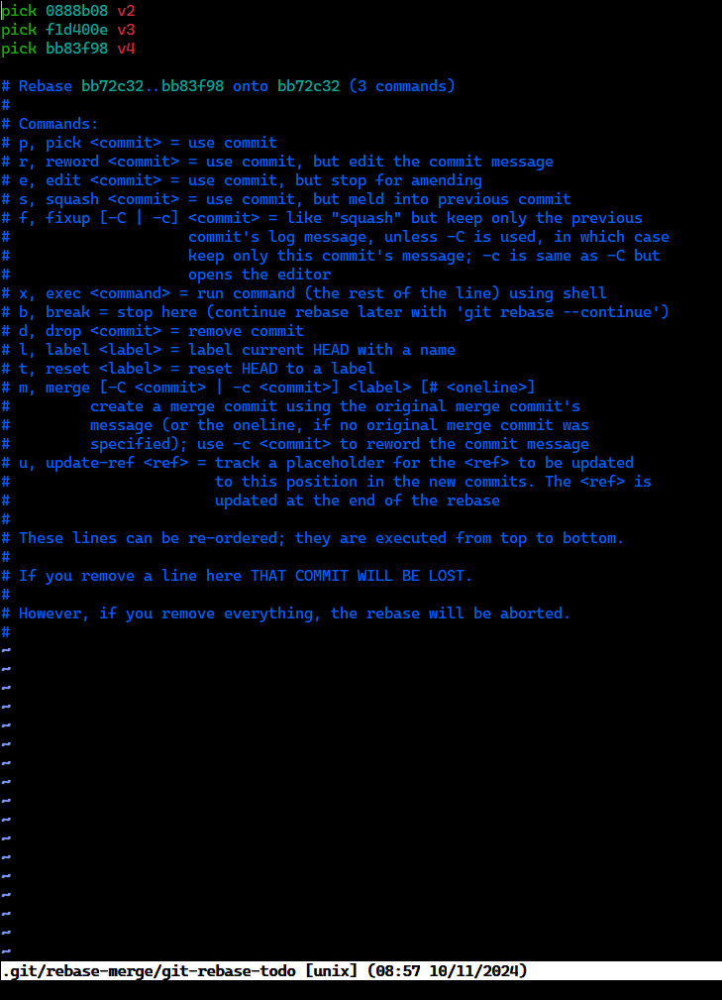

这时候，我们要做个操作：将第二行和第三行的`pick`变成`s` -- 让当前版本合并到上面那个版本上面去

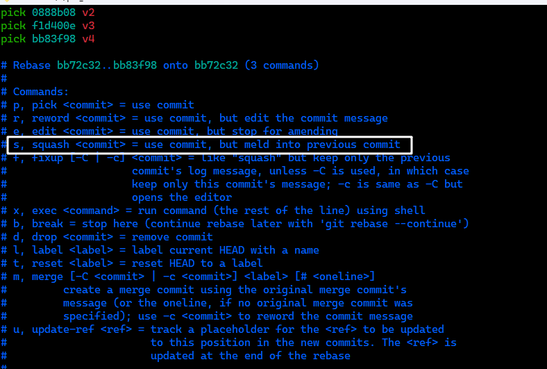

保存、退出

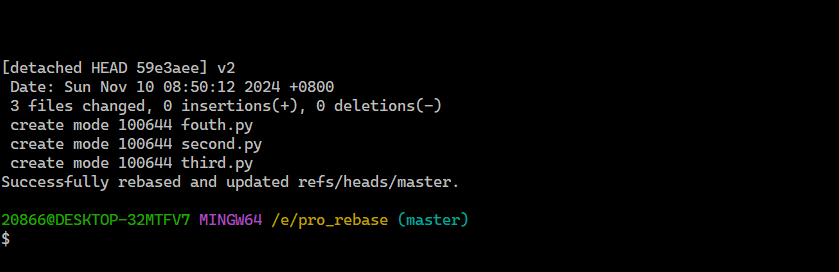

然后打印版本，可以看到我们已经成功合并版本：

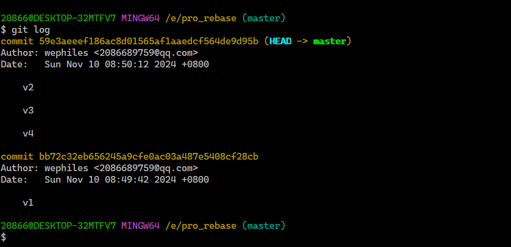

>   [!Note]
>
>   ！！！注意：如果我们的代码已经提交到远程仓库了，那就最好不要再合并了。即：尽量合并那些没有被提交到远程仓库的记录。

### 7.2.2 情景2 分支的处理

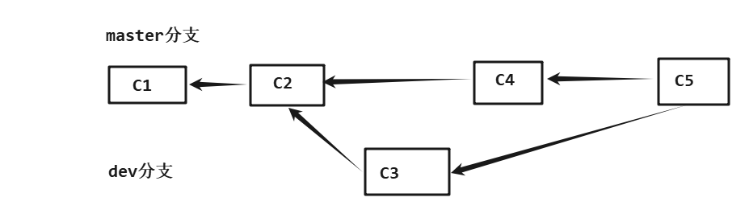

如果你觉得你不想要这个分支，想将两个分支整到一起，可以使用`rebase` -- 但是这样你就要取舍，是要完整的提交记录还是简洁的提交记录了。

```bash
# 假设经过一段时间的开发，已经有了dev分支，满足上述要求了
```

`git log`命令，后面可以加参数和选项：

```bash
git log --graph
git log --graph --pretty=format:"%h %s"
```

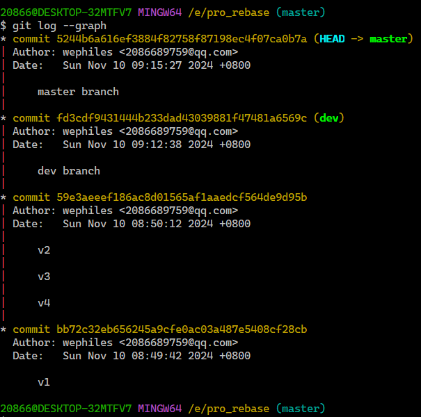

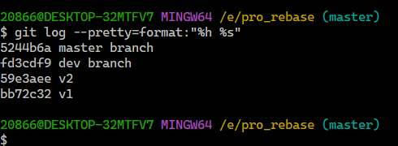

第一步：用`rebase`将`dev`分支塞到`master`分支

第二步：用下面的命令`rebase`一下

```bash
git rebase master
```

第三步：切换到`master`分支将`dev`分支`merge`一下即可

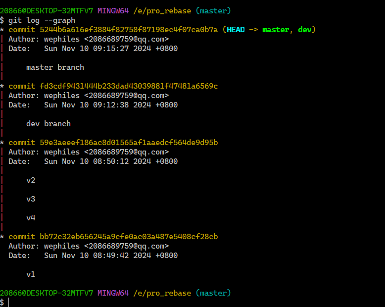

### 7.2.3 情景3 忘记提交代码了

假设在公司忘记提交代码到远程仓库，回家后继续开发点别的功能，第二天去公司，首先要将代码`pull`下来，此时就会产生分叉，要想不产生分叉：

就不要直接执行`git pull`，而是先执行`git fetch`将代码拿到本地（`pull = fetch + merge`），再用`git rebase origin/dev`即可。

### 7.2.4 注意事项

我在操作过程中，如果在执行`git rebase`的时候，别急，动手去解决冲突，会提醒你执行一些命令，你执行完后，使用`add commit`

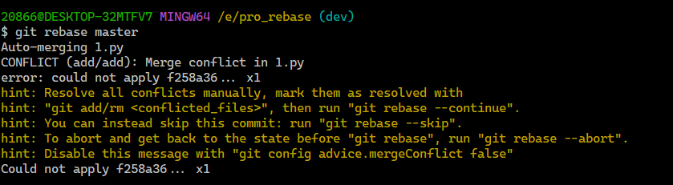

最后使用 `git rebase --continue`即可。

# 八、 `beyond compare`快速解决冲突

## 8.1 下载安装`bsyond compare`

此处省略

## 8.2 在`git`中进行配置

```bash
git config --local merge.tool bc5
git config --local mergetool.path 'D:\\software\\beyondCompare\\Beyond Compare 5'
git config --local mergetool.keepBackup false  # 每次解决冲突后，不用保留源文件
```

## 8.3 应用 -- 解决冲突

```bash
git mergetool
```

产生冲突

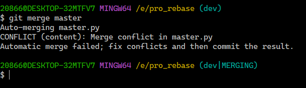

配置`beyond compare`

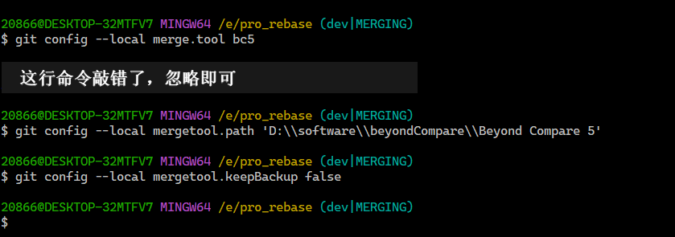

使用：

```bash
git mergetool
```

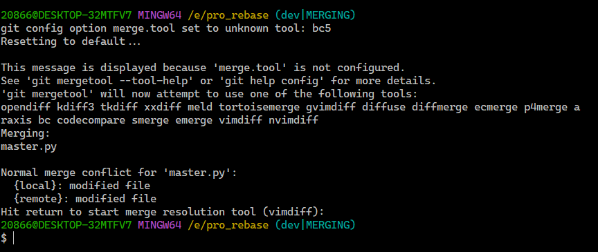

# 九、 命令总结

```bash
git init

git status

git add xx.file/.

git commit -m "xxx"

git remote add origin xxx.ccc.com

git push -u origin master

git clone xxx.ccc.com

git pull origin dev

git fetch origin dev
git merge origin/dev

git rebase dev

git log
git reflog
git log --graph
git log --graph --pretty=format:"%h %s"
```

# 十、 多人协作开发

## 10.1 多人协同工作流

 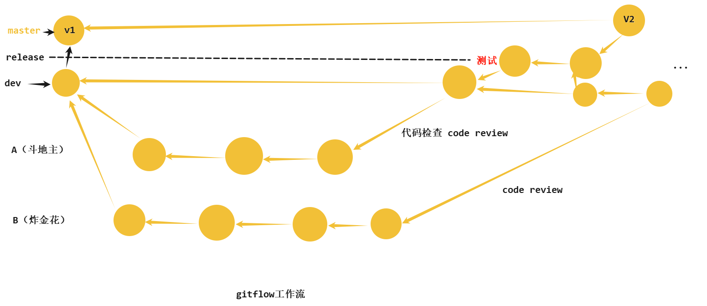

## 10.2 命令实现

### 10.2.1 创建一个新项目做一个基本版本并首先上线

```bash
mkdir dbhot  # 我们的项目名就叫dbhot
```

推送到`github`上，需要创建仓库

-   普通创建方式  -> settings -> collaborators -> 邀请进来 --- 在公司不适合这么干！！！
-   创建一个组织
    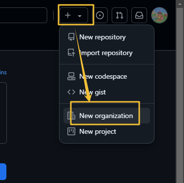
    创建完组织后，==在组织里面==创建一个新仓库，然后先将第一个版本提交上去。

### 10.2.2 `tag`命令 -- 打标签

```bash
git tag -a v1 -m "第一版"
```

```bash
git push origin --tags
```

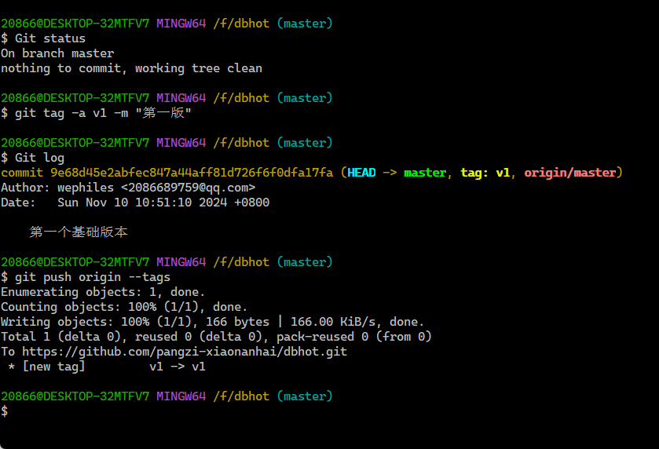

### 10.3 招了两个人，让其开发斗地主和炸金花

### 10.3.1 自己：先创建一个`dev`分支并切换到`dev` 再将`dev`分支`push`到远程仓库

```bash
git checkout -b dev  # 创建dev分支并切换到dev分支
```

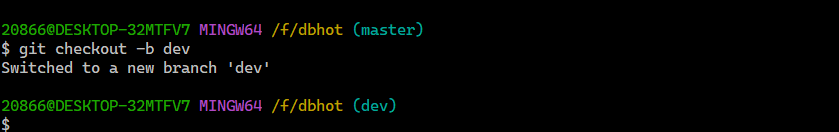


### 10.3.2 让两个小弟注册`github`,完事后将小弟拉到咱们得账号

回到组织，把小弟邀请一下

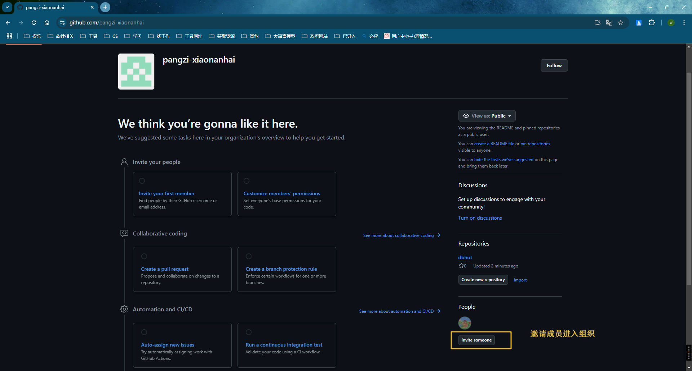

小弟就能接受到一个邮件，去邮件同意加入组织即可。

同意后，查看成员：

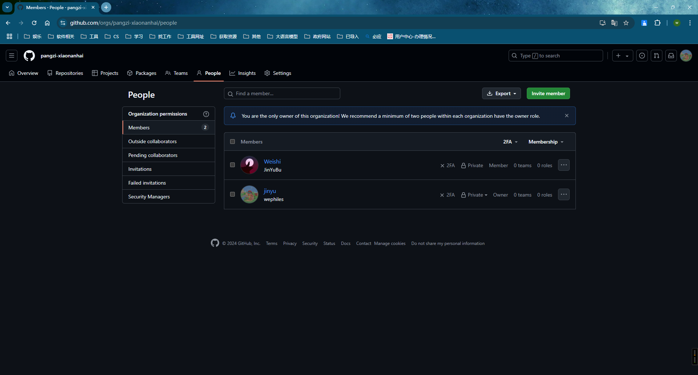

怎么查看成员的权限呢？

settings -> Member privileges

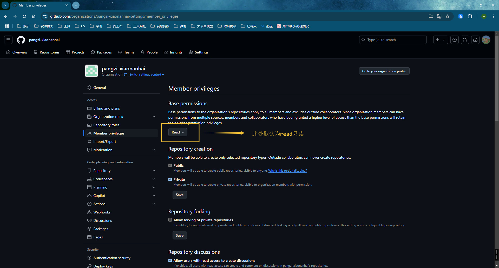

对于项目，也可以查看权限.进入项目后也可以邀请合作者！

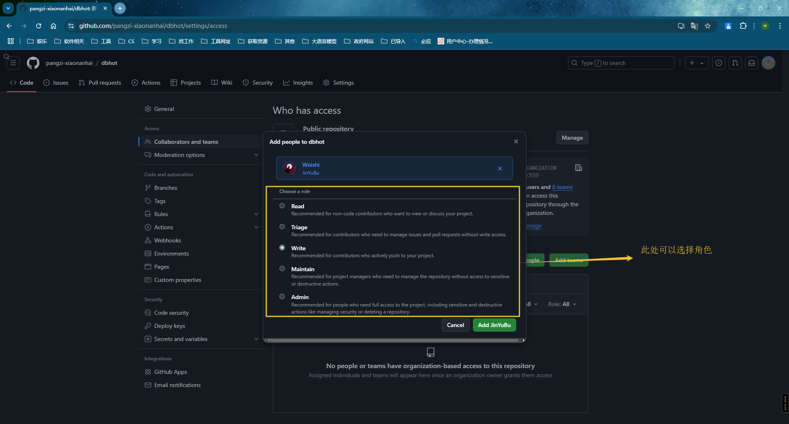

邀请加入合作者后，让小弟先将项目克隆一份。

小弟克隆完后，需要将自己要开发的功能在`dev`分支上再分一个分支。

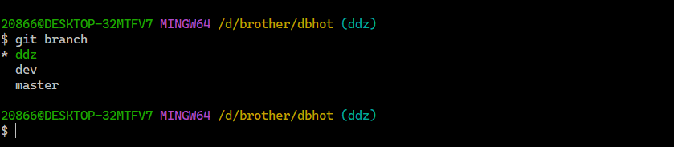

小弟开发斗地主···

开发了一段时间，开发完成了...接下来就是`code review` -- 小组长做（用`github`上的 `pull request/merge request`）。

要想做`code review`，就先得做一些配置. settings -> Branches

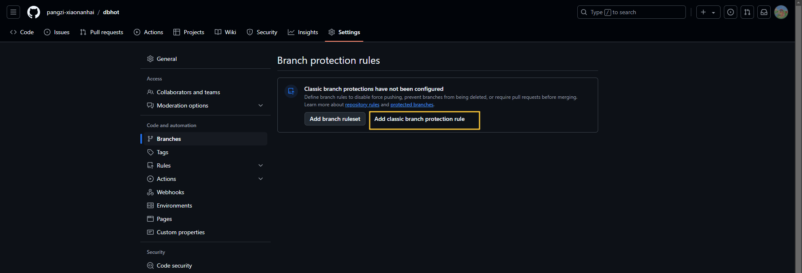

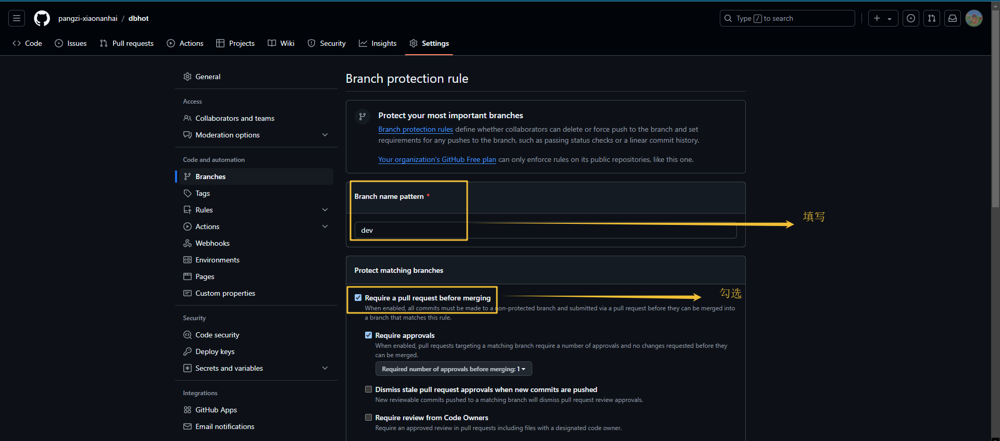

用流程告诉老大，做个`review` -- 首先进入小弟自己的`github`,按照下面的流程，进入`pull request`

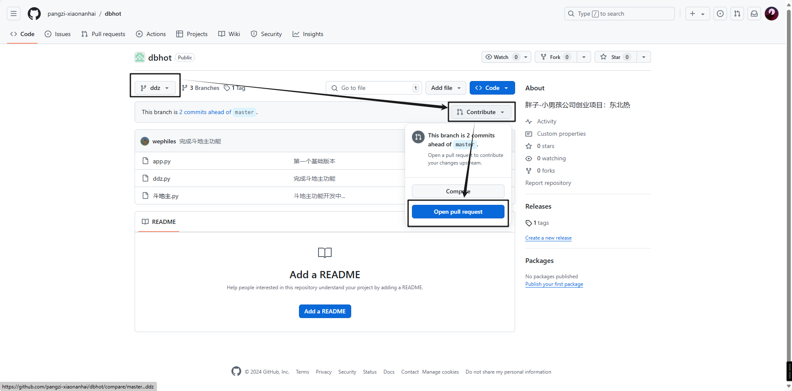

进入新页面，填写`pull request`信息

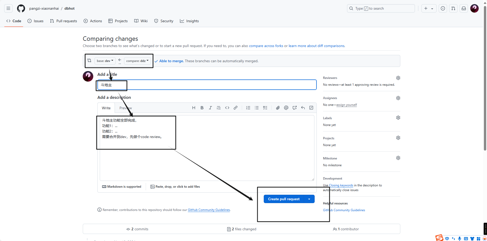

发送后小弟的github是下面这样的：

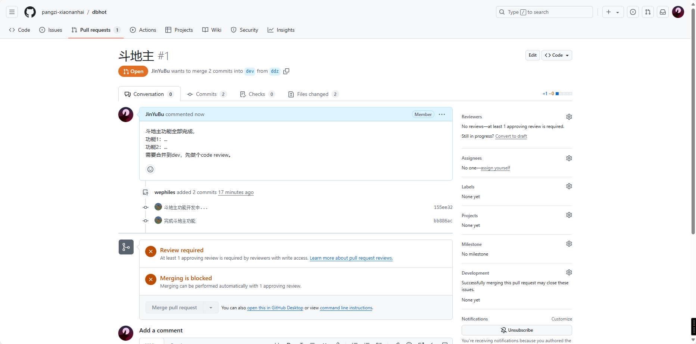

点击右下角的`Create pull request`后，就会将这个`pull request`发送给小组长，小组长进行`code review`。

对于小组长：点击`pull request`后能看到`review`请求!

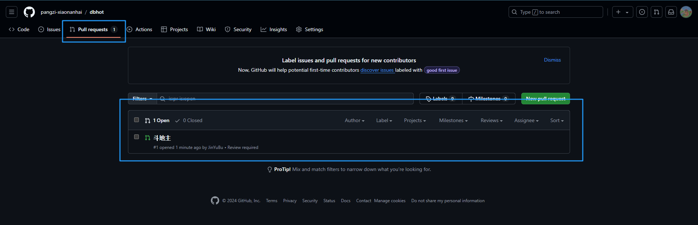

点击进去：

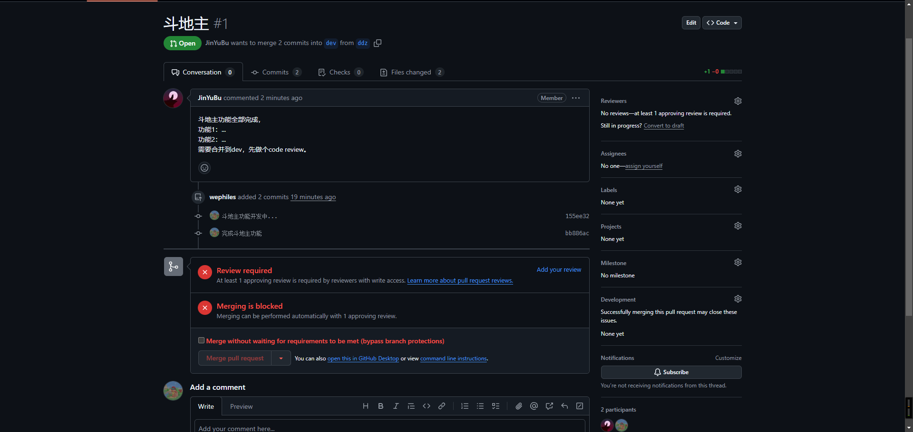

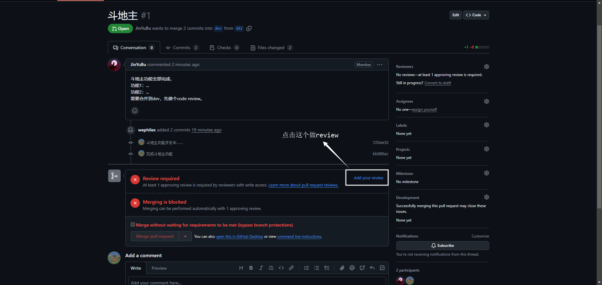

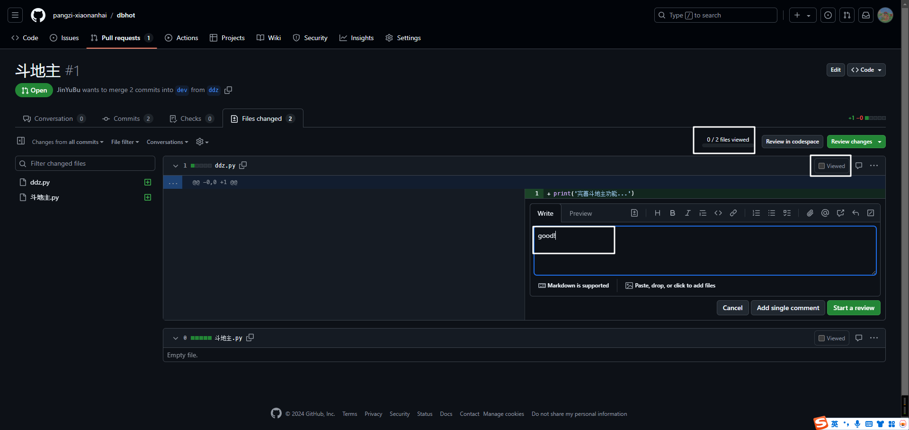

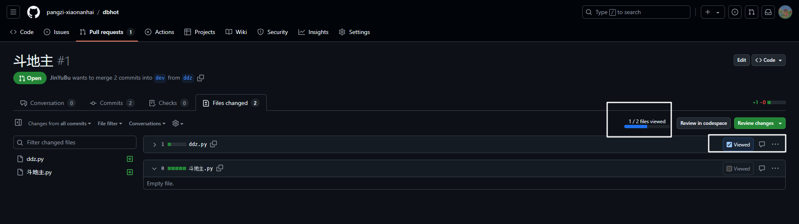

也可以命令行`review`：

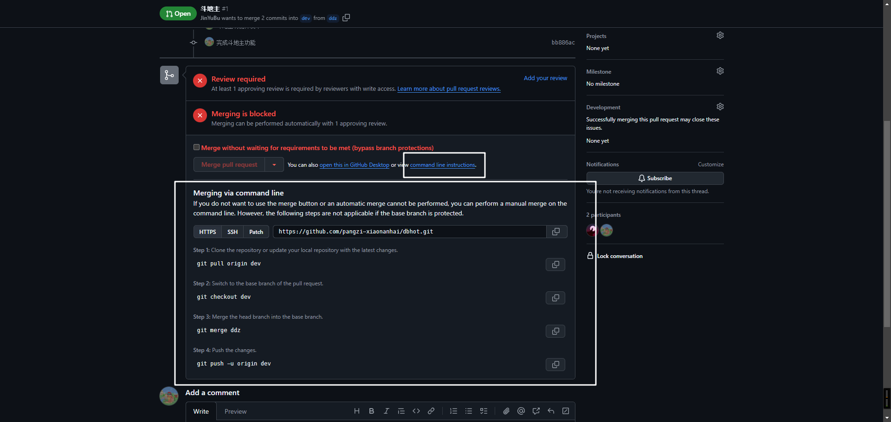

也可以在网站上手动`merge review`

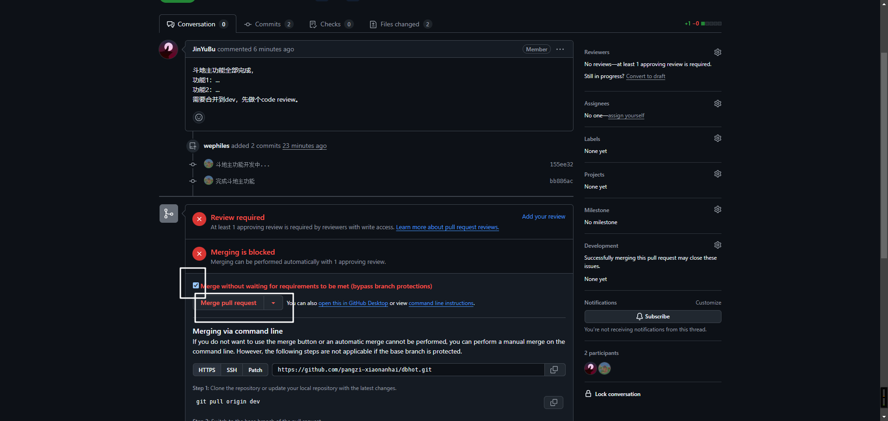

合并完后，说明代码`ddz`的功能已经开发完了，可以删除也可以不删除，全看自己了。

领导这里：还需要`pull`一下`dev`，

## 10.3 测试/预发布

### 10.3.1 拆出来一个`release`分支

领导切换到`dev`分支，切出来一个`release`版本

测试完毕后，还是`pull request`，`merge request`即可

最后删除`release`分支，然后再添加一个`tag` 再`push`上去即可。

也有可能产生冲突，解决冲突即可。

# 十一、 给开源项目贡献代码

## 11.1 找到一个牛逼的项目

比如说`tornado`

网址：`https://github.com/tornadoweb/tornado`

## 11.2 fort源代码

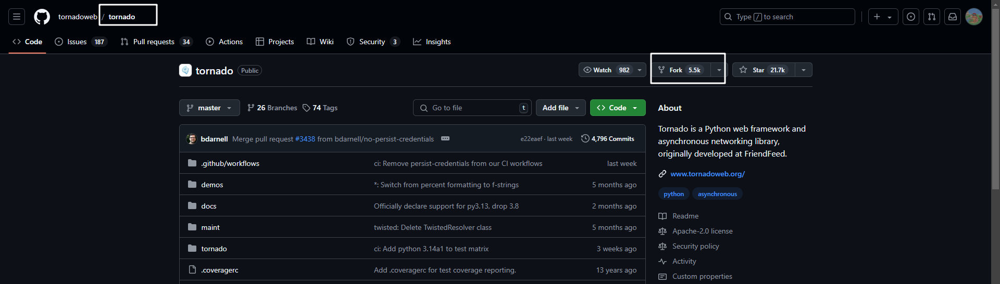

这样就会把项目搞到自己的仓库里面。

只能在自己的仓库进行修改。

新创建一个目录，克隆下来后进行修改。

修改后，`add commit push`一气呵成

然后给源代码作者提交修复`bug`的申请（申请一个`pull request`）

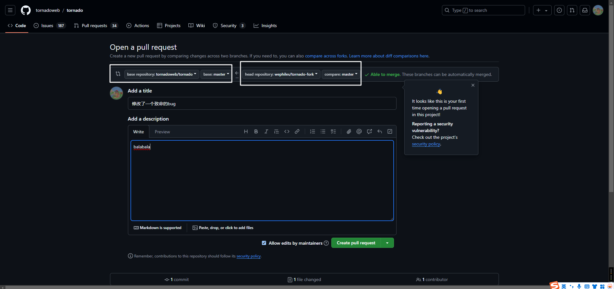

发送后，等作者接受，接受后，就能在作者的源码里看到源码自己提交的源码。

# 十二、 其他部分

## 12.1 配置文件

```bash
git config --local user.name "xxx"

git config --global user.name "xxx"

git config --system user.name "xxx"
```

### 12.1.1 三个配置文件：

-   当前项目下的配置文件目录：配置使用`git config --local user.name "xxx"`
    ```bash
    ./.git/config
    ```

    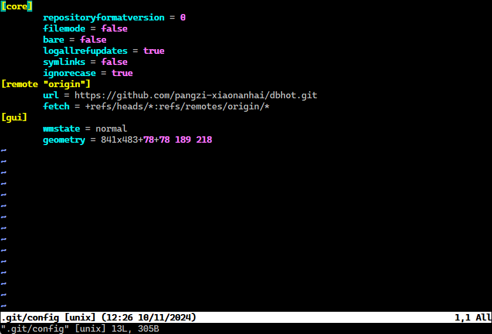

-   全局配置 `git config --global user.name "xxx"`
    ```bash
    ~/.gitconfig
    ```

-   系统配置 `git config --system user.name "xxx"` -- 需要有`root`权限
    ```bash
    /etc/.gitconfig
    ```

### 12.1.2 应用场景

```bash
git config --local user.name "xxx"
git config --global user.name "xxx"
git config --system user.name "xxx"

git remote add origin xxx.com  # 默认存在项目本地的配置文件下
```

## 12.2 免密登录

以前是每次`push`都需要账户密码

### 12.2.1 URL中实现

```bash
原来的地址:
https://github.com/wephiles/dbhot
修改的地址:
https://用户名:密码@github.com/wephiles/dbhot

git remote add origin https://用户名:密码@github.com/wephiles/dbhot
...
```

### 12.2.2 SSH实现

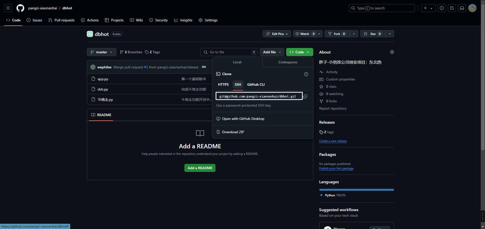

网址是这样的：

在自己的电脑上生成公钥和私钥并添加到github上 -- 去网上搜 有实现方式。

生成的公钥和私钥默认放在`~/.ssh`目录下

### 12.2.3 `Git`自动管理凭证

pass

# 十三、 `.gitignore`文件

`.gitignore`文件：

```tex
a.h
b.h
*.h  # 忽略以.h结尾的都忽略
.gitignore  # 忽略.gitignore文件
files/ # 忽略files文件夹下的所有文件
!c.h  # 特殊，要把c.h管理起来
```

自己写很麻烦，去`github`搜：`gitignore`

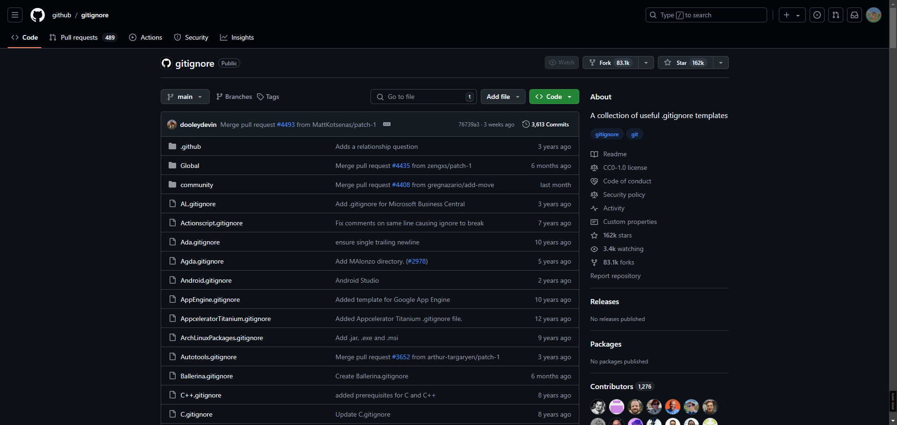

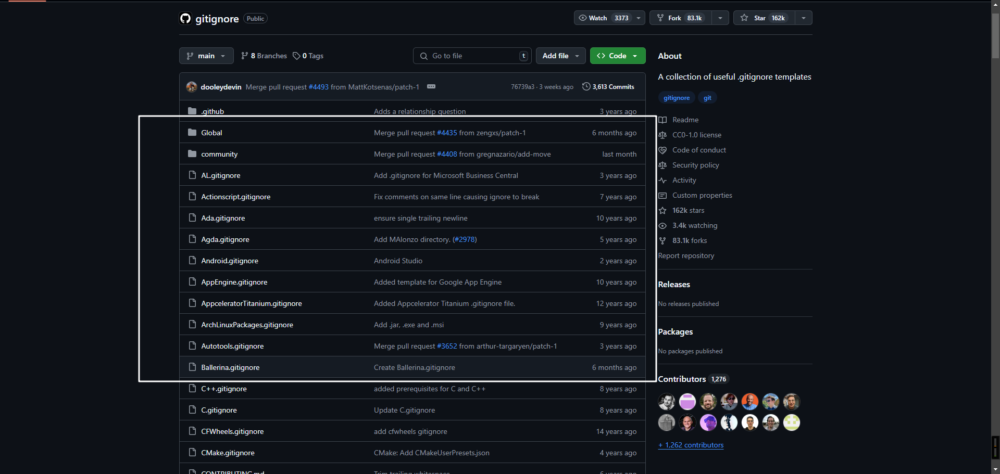

复制过来即可

```tex
# Byte-compiled / optimized / DLL files
__pycache__/
*.py[cod]
*$py.class

# C extensions
*.so

# Distribution / packaging
.Python
.venv/
.idea/
build/
develop-eggs/
dist/
downloads/
eggs/
.eggs/
lib/
lib64/
parts/
sdist/
var/
wheels/
share/python-wheels/
*.egg-info/
.installed.cfg
*.egg
MANIFEST

# PyInstaller
#  Usually these files are written by a python script from a template
#  before PyInstaller builds the exe, so as to inject date/other infos into it.
*.manifest
*.spec

# Installer logs
pip-log.txt
pip-delete-this-directory.txt

# Unit test / coverage reports
htmlcov/
.tox/
.nox/
.coverage
.coverage.*
.cache
nosetests.xml
coverage.xml
*.cover
*.py,cover
.hypothesis/
.pytest_cache/
cover/

# Translations
*.mo
*.pot

# Django stuff:
*.log
local_settings.py
db.sqlite3
db.sqlite3-journal

# Flask stuff:
instance/
.webassets-cache

# Scrapy stuff:
.scrapy

# Sphinx documentation
docs/_build/

# PyBuilder
.pybuilder/
target/

# Jupyter Notebook
.ipynb_checkpoints

# IPython
profile_default/
ipython_config.py

# pyenv
#   For a library or package, you might want to ignore these files since the code is
#   intended to run in multiple environments; otherwise, check them in:
# .python-version

# pipenv
#   According to pypa/pipenv#598, it is recommended to include Pipfile.lock in version control.
#   However, in case of collaboration, if having platform-specific dependencies or dependencies
#   having no cross-platform support, pipenv may install dependencies that don't work, or not
#   install all needed dependencies.
#Pipfile.lock

# poetry
#   Similar to Pipfile.lock, it is generally recommended to include poetry.lock in version control.
#   This is especially recommended for binary packages to ensure reproducibility, and is more
#   commonly ignored for libraries.
#   https://python-poetry.org/docs/basic-usage/#commit-your-poetrylock-file-to-version-control
#poetry.lock

# pdm
#   Similar to Pipfile.lock, it is generally recommended to include pdm.lock in version control.
#pdm.lock
#   pdm stores project-wide configurations in .pdm.toml, but it is recommended to not include it
#   in version control.
#   https://pdm.fming.dev/latest/usage/project/#working-with-version-control
.pdm.toml
.pdm-python
.pdm-build/

# PEP 582; used by e.g. github.com/David-OConnor/pyflow and github.com/pdm-project/pdm
__pypackages__/

# Celery stuff
celerybeat-schedule
celerybeat.pid

# SageMath parsed files
*.sage.py

# Environments
.env
.venv
env/
venv/
ENV/
env.bak/
venv.bak/

# Spyder project settings
.spyderproject
.spyproject

# Rope project settings
.ropeproject

# mkdocs documentation
/site

# mypy
.mypy_cache/
.dmypy.json
dmypy.json

# Pyre type checker
.pyre/

# pytype static type analyzer
.pytype/

# Cython debug symbols
cython_debug/

# PyCharm
#  JetBrains specific template is maintained in a separate JetBrains.gitignore that can
#  be found at https://github.com/github/gitignore/blob/main/Global/JetBrains.gitignore
#  and can be added to the global gitignore or merged into this file.  For a more nuclear
#  option (not recommended) you can uncomment the following to ignore the entire idea folder.
#.idea/
```

# 十四、 任务管理

-   issues -- 文档与任务管理
    讨论
-   wiki
    百科

# 补充 关于 SSH

#### 1. `git config --global user.email` 和 `git config --global user.name` 的作用

这两个配置主要用于在每次 Git 提交（commit）时，**记录是谁做的提交**。具体来说：

- **`user.name`**：提交记录中的“作者”名字，即代码修改者的署名。
- **`user.email`**：提交记录中的“作者”邮箱，用于标识提交者身份，也常被代码托管平台（如 GitHub/GitLab）用于关联账户。

Git 是分布式版本控制系统，每次提交都需要“自报家门”，否则团队协作时无法追溯谁改了什么，不利于代码管理和责任划分csdn.net/hanmo22357/article/details/143867898+2。

#### 2. 这两个配置是否可以随便填写？

**技术上，你可以随便填写。**

- Git 本身不会验证邮箱的真实性，也不会强制你用平台注册的邮箱，所以你可以随便写一个，也能提交代码，甚至可以成功 push 到远程仓库csdn.net/weixin_48292956/article/details/116146524+2。

**但是，强烈不建议随便填写，原因如下：**

##### （1）影响代码贡献统计与归属

- GitHub/GitLab 等平台通过你提交时填写的邮箱来识别你，如果邮箱与你的平台账户绑定的邮箱不一致，那么提交不会被统计为你的贡献，主页 contributions 图表也不会显示，提交记录也会显示为“陌生人”或“未知”csdn.net/qq_41100617/article/details/131891875+1。
- 在团队协作中，如果提交信息混乱，会给代码审查、Bug 责任归属带来困扰。

##### （2）影响身份识别与沟通

- 很多开源项目通过提交记录的邮箱联系作者，如果邮箱是假的，就失去了沟通途径zhihu.com/question/391257421。
- 在安全审计、溯源等场景，真实邮箱和身份更有利于追溯。

##### （3）冒充他人可能带来信任问题

- 虽然技术上可以冒充他人，但一旦被发现，会对个人信誉和职业发展造成负面影响csdn.net/ITWANGBOIT/article/details/103618427+1。

#### 3. 多项目多身份配置

如果你既参与公司项目，又有个人开源项目，可以：

- 全局设置一个身份，比如个人身份；
- 在公司项目仓库里单独设置不同的用户名和邮箱，用 `git config user.name "公司名"` 和 `git config user.email "公司邮箱"`，这样只对该仓库生效。
- 或者通过 `.gitconfig` 的 includeIf 功能，实现不同目录自动切换身份csdn.net/qq_35261296/article/details/139120093+1。

#### 场景概述

你需要在“家里”和“公司”用不同的 Git 账号（不同用户名、邮箱，甚至不同的代码托管平台）对同一个仓库进行开发，并且希望每次提交记录能正确归属到对应的账号，同时远程仓库权限和协作不受影响。

#### 方案一：单个仓库手动配置（最简单，适合少量项目）

#### 操作步骤

1. **在家里**

```
   git config user.name "HomeName"
   git config user.email "home@example.com"
```

1. **在公司**

```
   git config user.name "WorkName"
   git config user.email "work@company.com"
```

  \- 不带 `--global`，仅对当前仓库生效com/kb/ask/233687.html+2。

#### 优缺点

- ✅ 操作简单，一两个项目完全够用。
- ❌ 每个 clone 下来的仓库都要手动设置，容易遗漏。

#### 方案二：批量目录自动化配置（适合多项目）

#### 操作步骤

1. **在全局 Git 配置文件中添加 `includeIf` 条件**
   编辑 `~/.gitconfig`（Windows 在 `C:\Users\你的用户名\.gitconfig`）：

```
   [includeIf "gitdir:D:/work/"]
       path = ~/.gitconfig-work
   [includeIf "gitdir:D:/personal/"]
       path = ~/.gitconfig-personal
```

1. **创建对应的身份配置文件**
   - `~/.gitconfig-work`（公司身份）：

```
     [user]
         name = WorkName
         email = work@company.com
```

  \- `~/.gitconfig-personal`（家里身份）：

```
     [user]
         name = HomeName
         email = home@example.com
```

1. **项目目录管理**
   - 将公司项目放在 `D:/work/` 下，个人项目放在 `D:/personal/` 下，Git 会自动应用对应的身份配置cnblogs.com/yanghucai/p/18155175+2。

#### 优缺点

- ✅ 自动化，无需每次手动设置。
- ❌ 需要提前规划目录结构。

#### 方案三：多 SSH Key + 远程仓库配置（适合不同托管平台）

#### 操作步骤

1. **为不同账号生成不同的 SSH Key**

```
   ssh-keygen -t rsa -C "home@example.com" -f ~/.ssh/id_rsa_home
   ssh-keygen -t rsa -C "work@company.com" -f ~/.ssh/id_rsa_work
```

1. **配置 SSH 的 `config` 文件**（在 `~/.ssh/config`）：

```
   # 家里账号
   Host github.com
       HostName github.com
       User git
       IdentityFile ~/.ssh/id_rsa_home

   # 公司账号
   Host gitlab.company.com
       HostName gitlab.company.com
       User git
       IdentityFile ~/.ssh/id_rsa_work
```

1. **将公钥添加到对应的代码托管平台**
   - `id_rsa_home.pub` → GitHub
   - `id_rsa_work.pub` → 公司 GitLab
2. **远程仓库 URL 设置**
   - 在家里用 `git@github.com:username/repo.git`
   - 在公司用 `git@gitlab.company.com:username/repo.git`csdn.net/qq_42164977/article/details/105546884+2。

#### 优缺点

- ✅ 适合多平台，权限隔离彻底。
- ❌ 配置稍复杂，需熟悉 SSH Key 管理。

#### 最佳实践与建议

#### 1. 身份与权限分离

- 家里和公司用不同的 SSH Key，避免权限冲突。
- 远程仓库 URL 严格对应不同的 Host。

#### 2. 提交前验证身份

每次提交前，用以下命令检查当前仓库身份：

```
git config user.name
git config user.email
```

#### 3. 仓库协作注意事项

- 如果公司和个人账号对同一个仓库都有 push 权限，确保远程仓库的成员配置正确。
- 提交记录归属只看 `user.email`，与 SSH Key 无关，所以邮箱必须与平台账户绑定，否则 contributions 不会统计。

#### 小结

| 场景                 | 推荐方案                  | 操作复杂度 |
| -------------------- | ------------------------- | ---------- |
| 单个仓库             | 方案一：手动配置          | ⭐          |
| 多个仓库、多目录     | 方案二：includeIf 自动化  | ⭐⭐         |
| 多平台、严格权限隔离 | 方案三：多 SSH Key + Host | ⭐⭐⭐        |

如果你只需要在家庭和公司两台电脑上用不同身份提交，推荐 **方案一**（简单直接）。
如果经常在不同项目间切换，**方案二** 更省心。
如果涉及 GitHub、GitLab 等多平台协作，则建议 **方案三**。

## 一、Git的SSH密钥有什么用？

SSH密钥（由公钥和私钥组成）是用于安全认证的一种加密技术。在Git中的作用包括：

- **安全身份验证**：代替用户名和密码，每次Git操作（如push、pull、clone）无需重复输入密码，私钥只在本地保存，不会被传输，安全性更高mobiletrain.org/ganhuo/168390.html+1。
- **加密传输**：所有代码传输过程都经过加密，避免被窃听或篡改oschina.net/emacs_8811892/blog/17320728。
- **多账户管理**：一台电脑可以通过配置多个SSH密钥，分别用于不同GitHub/GitLab等平台账号csdn.net/qq_46018418/article/details/146204146+1。

## 二、一台电脑（Windows）如何配置多个GitHub账号的SSH？

假设你有两个GitHub账号：

- 个人账号：a@163.com
- 工作账号：b@qq.com

### 1. 为每个账号生成独立的SSH密钥

```
ssh-keygen -t rsa -b 4096 -C "a@163.com" -f ~/.ssh/id_rsa_a
ssh-keygen -t rsa -b 4096 -C "b@qq.com" -f ~/.ssh/id_rsa_b
```

- `-f` 参数指定不同文件名，避免覆盖。
- 按提示设置密码（也可留空）。

### 2. 添加公钥到对应的GitHub账号

- 查看并复制公钥内容：

```
  cat ~/.ssh/id_rsa_a.pub
  cat ~/.ssh/id_rsa_b.pub
```

- 登录GitHub，在`Settings -> SSH and GPG keys`中分别添加`id_rsa_a.pub`和`id_rsa_b.pub`。

### 3. 配置SSH的config文件

在`~/.ssh/config`（没有则新建）中写入：

```
# 个人账号
Host github.com-a
    HostName github.com
    User git
    IdentityFile ~/.ssh/id_rsa_a

# 工作账号
Host github.com-b
    HostName github.com
    User git
    IdentityFile ~/.ssh/b
```

- `Host`为自定义别名，用于区分不同账号。
- `IdentityFile`指定对应的私钥文件。

### 4. 测试SSH连接

```
ssh -T git@github.com-a
ssh -T git@github.com-b
```

- 成功后会显示`Hi xxx! You've successfully authenticated...`。

### 5. 克隆/推送仓库时使用不同账号

```
git clone git@github.com-a:username/repo.git   # 个人账号
git clone git@github.com-b:username/repo.git   # 工作账号
```

## 三、三台电脑之间如何协作开发？

### 基本思路

- **远程仓库作为中心**：在GitHub/GitLab上创建一个共享仓库，三台电脑各自克隆，并使用各自的SSH密钥进行push/pull。
- **账号和邮箱配置**：每台电脑设置各自的Git用户名和邮箱（全局或项目级）。
- **分支协作**：建议每人创建独立分支，完成后发起Pull Request合并。

### 场景1：主Windows开发电脑（a@163.com）发起协作

#### 步骤：

1. 在GitHub上新建仓库（如`project-a`）。
2. 在主Windows电脑上初始化并push初始代码：

```
   git init
   git add .
   git commit -m "init"
   git remote add origin git@github.com-a:yourname/project-a.git
   git push -u origin main
```

1. 把仓库地址分享给其他两台电脑。

### 场景2：Linux虚拟机协作开发

#### 1. 配置Linux的Git和SSH

- 安装Git和OpenSSH（如未装）：

```
  sudo apt install git openssh-client
```

- 生成SSH密钥：

```
  ssh-keygen -t rsa -C "your_email@example.com"
```

- 将公钥添加到GitHub账号。

#### 2. 克隆仓库并开发

```
git clone git@github.com:yourname/project-a.git
cd project-a
git checkout -b feature-linux
# 编写代码
git add .
git commit -m "linux feature"
git push origin feature-linux
```

### 场景3：公司Windows电脑协作开发

#### 1. 配置Git和SSH（类似主Windows，但可用不同账号）

- 生成新密钥并添加到GitHub账号。
- 克隆仓库：

```
  git clone git@github.com:yourname/project-a.git
```

#### 2. 分支开发和提交

```
git checkout -b feature-work
# 编写代码
git add .
git commit -m "work feature"
git push origin feature-work
```

## 四、多机协作流程总结

1. **主开发机**（如个人Windows）：
   - 初始化远程仓库。
   - 设置好SSH密钥和账号。
   - 推送初始代码。
2. **其他电脑**（Linux、公司Windows）：
   - 安装Git并配置SSH。
   - 克隆远程仓库。
   - 创建独立分支，开发，提交，推送。
3. **协作管理**：
   - 定期`git pull`拉取最新代码。
   - 避免直接在main/master分支上开发。
   - 冲突时手动解决，再提交。

## 五、补充说明

- **Git全局/项目级用户名和邮箱**：
  - 全局：`git config --global user.name "Your Name"`，`git config --global user.email "your_email@example.com"`
  - 项目级（不同项目用不同账号）：

```
    cd project-folder
    git config user.name "Your Name"
    git config user.email "your_email@example.com"
```

- **常见问题**：
  - 如果SSH连接失败，检查`~/.ssh/config`文件或公钥是否正确添加。
  - Windows建议用Git Bash操作，Linux直接终端。

## 总结

- **SSH密钥**是Git安全认证的基础，一台电脑多账号需配置多个密钥和config文件。
- **三台电脑协作**本质是通过远程仓库，各自clone、开发、分支、push/pull。
- 每台电脑都要配置自己的Git和SSH，并遵守分支协作和冲突解决规范。

Git的SSH密钥（私钥）和公钥是用于安全身份验证和加密通信的一对密钥，它们在Git远程仓库管理（如GitHub、GitLab、Gitee等）中起到至关重要的作用。下面从原理、用途、配置步骤等方面详细说明。

## 一、SSH密钥的组成与原理

- **私钥（private key）**：保存在本地，绝不可泄露，用于解密和签名。
- **公钥（public key）**：可以公开，通常添加到远程Git服务器的账户中，用于加密和身份验证。

它们基于“非对称加密算法”（如RSA、ED25519）。只有私钥能解密由公钥加密的数据，反之亦然。当你在本地用私钥“签名”时，远程服务器用公钥验证，从而确认你的身份csdn.net/Yaoyao2024/article/details/132123525+1。

## 二、主要用途

### 1. **免密登录（身份验证）**

- 配置SSH密钥后，你无需每次push/pull代码时输入用户名和密码，极大提升效率csdn.net/Yaoyao2024/article/details/132123525+1。
- 适用于CI/CD、自动化脚本、远程备份等无需人工干预的场景csdn.net/qq_34885615/article/details/143424092。

### 2. **提高安全性**

- SSH密钥比密码更难被暴力破解，尤其是配合密码短语（passphrase）时csdn.net/qq_34885615/article/details/143424092。
- 防止中间人攻击，确保代码传输的完整性和真实性mobiletrain.org/ganhuo/167388.html。

### 3. **团队协作与权限控制**

- 多个开发者可将各自的公钥添加到同一个仓库，方便协作mobiletrain.org/ganhuo/167388.html。
- 管理员可通过公钥精细控制不同成员对仓库的读写权限mobiletrain.org/ganhuo/168371.html。

### 4. **多账号与多平台管理**

- 可为不同Git平台（如GitHub、GitLab）或不同账号配置不同的SSH密钥，灵活切换tcloudbaseapp.com/2025/07/03/Git-SSH-config/。

## 三、配置流程（以GitHub为例）

### 1. **生成SSH密钥对**

在终端或Git Bash中执行（推荐使用ED25519算法，旧系统可用RSA）：

```
ssh-keygen -t ed25519 -C "your_email@example.com"
```

或

```
ssh-keygen -t rsa -b 4096 -C "your_email@example.com"
```

按提示选择保存路径（默认`~/.ssh/id_ed25519`或`id_rsa`），可选设置密码短语tcloudbaseapp.com/2025/07/03/Git-SSH-config/+1。

### 2. **将公钥添加到Git托管平台**

- 复制公钥内容（如`~/.ssh/id_ed25519.pub`）：

```
  cat ~/.ssh/id_ed25519.pub
```

- 登录GitHub/GitLab等，进入“Settings → SSH and GPG keys”，粘贴公钥并保存tcloudbaseapp.com/2025/07/03/Git-SSH-config/+1。

### 3. **本地私钥添加到SSH代理（可选，推荐）**

```
eval "$(ssh-agent -s)"
ssh-add ~/.ssh/id_ed25519
```

这样每次Git操作无需重复输入密钥密码tcloudbaseapp.com/2025/07/03/Git-SSH-config/。

### 4. **测试连接**

```
ssh -T git@github.com
```

如返回“Hi username! You’ve successfully authenticated…”，即配置成功tcloudbaseapp.com/2025/07/03/Git-SSH-config/+1。

## 四、SSH与HTTPS的区别


| 对比项   | SSH                        | HTTPS                   |
| -------- | -------------------------- | ----------------------- |
| 认证方式 | 密钥对（免密）             | 用户名/密码（每次输入） |
| 安全性   | 更高（非对称加密）         | 一般，依赖密码强度      |
| 适用场景 | 频繁操作、自动化、团队协作 | 简单操作、临时访问      |
| 便捷性   | 一次配置，长期免密         | 每次操作需认证          |
| 推荐度   | 推荐（长期使用）           | 临时或初始使用          |

## 五、进阶技巧

- **多账号管理**：在`~/.ssh/config`文件中配置不同Host和IdentityFile，实现多账号/平台免密切换tcloudbaseapp.com/2025/07/03/Git-SSH-config/。
- **密钥安全**：私钥务必妥善保管，必要时使用密码短语保护；定期轮换密钥。
- **CI/CD集成**：将私钥配置在CI工具中，实现自动化代码部署csdn.net/qq_34885615/article/details/143424092。

## 六、参考权威资料

- [Git配置SSH Key详细教程（CSDN）](https://blog.csdn.net/Yaoyao2024/article/details/132123525)csdn.net/Yaoyao2024/article/details/132123525
- [Git SSH配置与免密登录（Worktile社区）](https://worktile.com/kb/ask/237968.html)com/kb/ask/237968.html
- [SSH密钥原理与用途（千锋教育）](http://bj.mobiletrain.org/ganhuo/167388.html)mobiletrain.org/ganhuo/167388.html
- [Git SSH配置与多账号管理（云原生技术社区）](https://cloud1-9gq179b85e74c4fd-1325340021.tcloudbaseapp.com/2025/07/03/Git-SSH-config/)tcloudbaseapp.com/2025/07/03/Git-SSH-config/

### 总结

Git的SSH密钥和公钥主要用于安全、便捷的身份验证，实现免密登录和代码加密传输，是现代开发协作与自动化流程的重要基础。配置简单，一次设置长期受益，强烈推荐所有开发者掌握并使用。

- GitHub允许一个账号添加多个SSH公钥，每个公钥对应一台电脑（或环境）。
- 每台电脑只需要生成自己的SSH密钥对，把公钥上传到同一个GitHub账号即可github.com/en/authentication/connecting-to-github-with-ssh/adding-a-new-ssh-key-to-your-github-account+1。
- 这样，每台电脑都能免密提交代码到该账号下所有有权限的仓库（包括RA）。

## 🔍 官方文档和最佳实践

### 1. 每台电脑单独生成密钥对

GitHub官方推荐：

> 每台电脑使用独立的SSH密钥，这样即使某一台电脑的私钥泄露，也只需撤销该密钥，不影响其他电脑https://serverfault.com/questions/206907/using-the-same-github-account-from-multiple-pcs。

### 2. 公钥添加到账号，而非仓库

SSH公钥是添加到GitHub账号（Settings → SSH and GPG keys），而不是单个仓库。这样，该账号下所有仓库都可以免密操作github.com/en/authentication/connecting-to-github-with-ssh/adding-a-new-ssh-key-to-your-github-account。

> “You can add an SSH key and use it for authentication… After adding a new SSH authentication key to your account on GitHub.com, you can reconfigure any local repositories to use SSH.”github.com/en/authentication/connecting-to-github-with-ssh/adding-a-new-ssh-key-to-your-github-account

### 3. 无需区分仓库

同一个账号下的所有仓库（包括RA），只要账号有权限，所有该账号的SSH公钥都通用。

## 🛡️ 安全建议

- **不要共享私钥**：私钥应仅存在于对应电脑上，不要复制到其他电脑或网络存储。
- **定期审计**：定期检查GitHub账号下有哪些SSH密钥，及时删除不再使用的github.com/en/authentication/keeping-your-account-and-data-secure/reviewing-your-ssh-keys。
- **设置密码短语**：生成密钥时建议设置passphrase，防止私钥被直接滥用


如果你的B电脑和C电脑要同时使用同一个GitHub账号，操作非常简单，并且官方和社区都推荐采用“每台电脑单独生成SSH密钥，并全部添加到同一个GitHub账号”的方式。下面详细说明步骤和最佳实践。

## ✅ 标准操作流程

### 1. 每台电脑单独生成SSH密钥对

在B电脑上：

```
ssh-keygen -t ed25519 -C "your_email@example.com"
```

保存为默认路径或自定义路径（如`~/.ssh/id_ed25519_B`）。

在C电脑上：

```
ssh-keygen -t ed25519 -C "your_email@example.com"
```

同样，保存为`~/.ssh/id_ed25519_C`或自定义路径。

> **为何不共享同一个私钥？**
> 如果私钥泄露，只需撤销该电脑对应的公钥，不影响其他设备https://serverfault.com/questions/206907/using-the-same-github-account-from-multiple-pcs+1。

### 2. 将每台电脑的公钥都添加到同一个GitHub账号

- 登录你的GitHub账号（如a@qq.com对应的账号）。
- 进入“Settings → SSH and GPG keys”，点击“New SSH key”。
- 分别粘贴B电脑和C电脑的公钥，并给它们起可区分的名称，例如：
  - “B laptop”
  - “C desktop”github.com/en/authentication/connecting-to-github-with-ssh/adding-a-new-ssh-key-to-your-github-account。

### 3. 测试连接

在B电脑上：

```
ssh -T git@github.com
```

在C电脑上：

```
ssh -T git@github.com
```

均应显示成功认证信息。

## 🛡️ 最佳实践与安全建议

### 1. 每台电脑独立密钥

- **推荐**：每台电脑独立生成SSH密钥，并将公钥添加到同一个GitHub账号。
- **好处**：如果某一台电脑丢失或私钥泄露，只需删除该公钥，不影响其他电脑https://serverfault.com/questions/206907/using-the-same-github-account-from-multiple-pcs+1。

### 2. 定期审计密钥

- 定期检查GitHub账号下的SSH密钥列表，删除不再使用的设备对应的公钥github.com/en/authentication/connecting-to-github-with-ssh/adding-a-new-ssh-key-to-your-github-account。

### 3. 设置密码短语（Passphrase）

- 生成密钥时建议设置passphrase，增加私钥的安全性github.com/en/authentication/connecting-to-github-with-ssh/adding-a-new-ssh-key-to-your-github-account。

## ⚠️ 不推荐的做法

- **不要复制同一私钥到多台电脑**：这会增加私钥泄露风险，且管理不便。
- **不要共享私钥或公钥文件**：应保持每台电脑的密钥独立性。


如果你需要在同一台电脑上同时使用两个GitHub账号，并且希望每个账号都能免密操作自己的仓库，标准做法是：为每个账号生成独立的SSH密钥，并通过`~/.ssh/config`文件进行区分。下面是详细步骤，附带权威参考。

## ✅ 标准操作步骤

### 1. 为每个账号生成独立的SSH密钥对

```
# 为第一个账号（如 a@qq.com）生成密钥
ssh-keygen -t ed25519 -C "a@qq.com" -f ~/.ssh/id_ed25519_a

# 为第二个账号（如 b@qq.com）生成密钥
ssh-keygen -t ed25519 -C "b@qq.com" -f ~/.ssh/id_ed25519_b
```

- `-f` 参数指定私钥文件名，避免覆盖默认的`id_ed25519`。
- 推荐使用`ed25519`算法，如需兼容旧系统可用`rsa -b 4096`。

### 2. 将每个公钥分别添加到对应的GitHub账号

- 登录 [a@qq.com](mailto:a@qq.com) 账号，在`Settings → SSH and GPG keys`中添加`id_ed25519_a.pub`。
- 登录 [b@qq.com](mailto:b@qq.com) 账号，添加`id_ed25519_b.pub`csdn.net/qq_46018418/article/details/146204146+1。

### 3. 编辑SSH配置文件（`~/.ssh/config`）

如果该文件不存在，请先创建：

```
touch ~/.ssh/config
```

编辑文件，添加如下内容（示例）：

```
# 账号 a
Host github.com-a
  HostName github.com
  User git
  IdentityFile ~/.ssh/id_ed25519_a
  IdentitiesOnly yes

# 账号 b
Host github.com-b
  HostName github.com
  User git
  IdentityFile ~/.ssh/id_ed25519_b
  IdentitiesOnly yes
```

- `Host` 是本地别名，可自定义。
- `IdentitiesOnly yes` 可避免SSH尝试所有密钥导致认证失败csdn.net/qq_46018418/article/details/146204146+2。

### 4. 将私钥添加到SSH代理（可选，避免每次输入passphrase）

```
ssh-add ~/.ssh/id_ed25519_a
ssh-add ~/.ssh/id_ed25519_b
```

如遇报错，可先运行`eval $(ssh-agent -s)`cnblogs.com/BaguetteShimada/p/19028392。

### 5. 测试SSH连接

```
ssh -T git@github.com-a
ssh -T git@github.com-b
```

每个命令应返回类似：

> Hi username! You’ve successfully authenticated, but GitHub does not provide shell access.

### 6. 克隆/管理仓库

#### 克隆时使用别名：

```
git clone git@github.com-a:username/repo_a.git
git clone git@github.com-b:username/repo_b.git
```

#### 已有仓库修改remote：

```
git remote set-url origin git@github.com-a:username/repo_a.git
```

### 7. 为每个仓库单独设置Git身份

进入对应仓库目录，设置局部user.name和user.email：

```
git config user.name "Your Name A"
git config user.email "a@qq.com"
```

（不要用`--global`，否则会影响所有仓库）csdn.net/qq_46018418/article/details/146204146+1。

## 🛡️ 最佳实践与注意事项

- **不要共享同一公钥**：一个公钥只能绑定一个GitHub账号csdn.net/z_xuewen/article/details/125121475。
- **不要使用默认的`id_rsa`/`id_ed25519`**：避免覆盖，用`-f`指定文件名。
- **定期审计**：检查GitHub账号下的SSH keys，及时删除不用的cnblogs.com/BaguetteShimada/p/19028392。
- **密码短语**：建议为私钥设置passphrase，提高安全性


# 重要！！！

如果我有一个github账号，这个账号对应的邮箱是a，有一个仓库RA，然后我有两台电脑A和B，如果我想在A电脑上向RA提交代码，为了能够免密提交，我就需要在A电脑上生成一个公钥添加到a邮箱对应的那个github账号，后面就可以免密提交了；同理，我在B电脑上又生成了一个公钥添加到a邮箱对应的github账号上面，于是在B电脑上也可以免密提交到RA仓库了

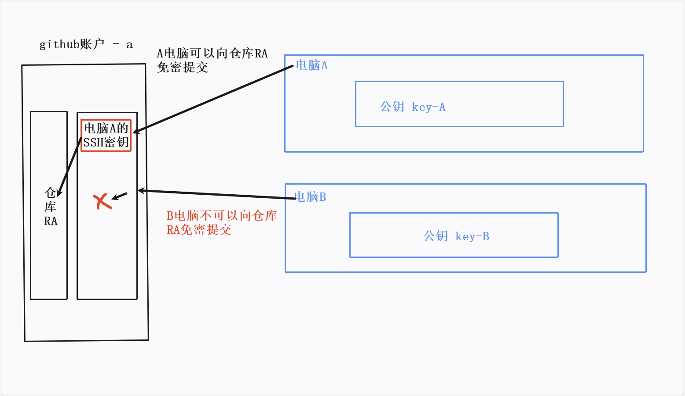

# 其他补充

`git stash` 是 Git 中一个非常实用且高频使用的命令。简单来说，它的作用是**“临时保存你还没写完的代码，并把工作区清理干净”**。

下面我将分三个部分为你详细解答：

### 一、 `git stash` 有什么用？

在开发中，你经常会遇到这种情况：你正在一个分支上开心地写代码，写了一半（修改了文件，但还没 commit），突然老板说：“线上有个紧急 Bug，你马上切到主分支去修一下！”

这时候你面临一个困境：

- **直接 `commit`**：代码写了一半，逻辑不完整，提交上去不太合适，甚至可能导致项目跑不起来。
- **直接 `checkout` 切换分支**：Git 会报错，因为你有未提交的修改，强制切换可能会丢失代码或引发冲突。

**`git stash` 就是来解决这个困境的。**
它会把你当前工作区和暂存区里**所有未提交的修改打包起来，藏到一个独立的“储藏室”里**。执行完后，你的工作区就会变得干干净净（和上次提交时一模一样），你就可以放心大胆地去切分支、拉代码、改 Bug 了。等忙完回来，再把藏起来的代码拿出来继续写。

### 二、 在哪些情况下可以使用？

只要有**“代码写了一半，需要暂时离开当前工作线，但又不想产生一个垃圾 commit”**的需求，都可以用 `git stash`。常见场景包括：

1. **紧急修复 Bug（插队任务）**：正在开发新功能，突然要切到 `main` 分支修 Bug。
2. **同步主分支最新代码**：在 feature 分支开发了几天，发现主分支有很多新提交，需要把当前半成品 stash 起来，然后 `git pull` 或 `rebase` 最新的主分支代码，再把半成品拿出来解决冲突。
3. **尝试不同的实现方案**：写了一段代码，想试试另一种写法，但又不想把当前的删掉。可以先 `stash`，试完新方案不满意，再用 `stash pop` 恢复原来的方案。
4. **拉取被拒绝**：执行 `git pull` 时提示你有本地修改无法拉取，而你又不想 commit 这些修改，可以先 `stash`，拉取完再 `pop`。

### 三、 怎么使用？（常用命令大全）

#### 1. 基础三步曲（最常用）

- **第一步：藏起来**

```
  git stash
```

*(此时你的代码消失了，工作区变干净，可以随意切分支了)*

- **第二步：去忙别的（切分支、改代码、提交等）…**
- **第三步：拿出来继续写**

```
  git stash pop
```

*(这会把最近一次 stash 的代码拿出来，放到你的工作区，**并且把这条 stash 记录删除**)*

#### 2. 查看和管理“储藏室”

如果你 stash 了很多次，需要管理它们：

- **查看储藏室里有什么**：

```
  git stash list
```

*(会显示类似 `stash@{0}: WIP on branch: xxx` 的列表，数字越大表示越老)*

- **恢复指定的 stash（不删除记录）**：

```
  git stash apply stash@{1}
```

*(当你不确定恢复后是否有冲突，想先保留备份时，用 `apply`。确认没问题后，可以手动 `git stash drop stash@{1}` 删掉记录)*

- **丢弃（删除）某次 stash**：

```
  git stash drop stash@{0}  # 删除指定的
  git stash clear           # 清空储藏室（慎用！）
```

#### 3. 进阶用法（非常实用）

- **给 stash 起个名字（强烈推荐）**：
  因为 stash 只显示简短信息，时间久了容易忘。加上 `-m` 可以加备注：

```
  git stash push -m "正在开发登录页面的表单验证"
```

- **包含未被跟踪的新文件（重要！）**：
  **注意：** 默认的 `git stash` **不会**保存那些新建且从未 `git add` 过的文件（Untracked files）。如果你新建了文件也想一起藏起来，必须加 `-u` 参数：

```
  git stash push -u -m "包含新文件的暂存"
```

- **查看 stash 里具体改了什么代码**：

```
  git stash show stash@{0}        # 只看改了哪些文件
  git stash show -p stash@{0}     # 看具体的代码修改差异（diff）
```

### ⚠️ 使用时的注意事项（避坑指南）

1. **`pop` 时的冲突**：如果你在 stash 之后，修改了同一个文件的同一行代码，执行 `git stash pop` 时会产生冲突。你需要手动解决冲突后，重新 `git add` 和 `git commit`。此时那条 stash 记录会被自动标记为已删除，即使有冲突也会删。
2. **Stash 是基于 Commit 的**：`git stash` 底层其实是在后台默默创建了两个临时的 commit。它是跟当前的分支状态绑定的，如果你 stash 的是 A 分支的代码，去 B 分支 `pop` 是可以的，但极易引发混乱，**强烈建议在哪个分支 stash 的，就回哪个分支 pop**。
3. **不要长久依赖 stash**：`stash` 只是临时缓冲区，千万不要把它当成网盘或长期备份工具。时间久了很容易忘记里面存了什么，最终导致代码丢失。最好的习惯是：** stash 越快 pop 越好**。

### 一、 `git commit -m` 后面的字符串应该遵循什么标准？

在正规的商业项目或开源项目中，**绝对不要写“更新代码”、“修改bug”、“啦啦啦”这种毫无意义的提交信息**。

目前业界最通用、最标准的规范叫做 **Conventional Commits（常规提交规范）**。它的核心格式如下：

```
<type>(<scope>): <subject>
```

翻译过来就是：**`类型(影响范围): 具体描述`**

#### 1. Type（类型）—— 必填，说明这次提交是干什么的

常见的类型有以下几种（记住前三个最常用的）：

- **`feat`**：新功能。比如 `feat: 增加用户头像上传功能`
- **`fix`**：修复 Bug。比如 `fix: 修复登录页面在Safari浏览器下崩溃的问题`
- **`refactor`**：重构。**（重点）** 代码改动，但既不是加新功能，也不是修 Bug。比如把一段很烂的代码提取成了一个公共函数，或者把变量名改得更易读。
- **`docs`**：文档改动。比如修改了 README.md。
- **`style`**：格式调整。不影响代码逻辑的修改，比如加了空格、改了缩进、调整了 CSS 样式。（注意：不是指 UI 样式的新增）
- **`test`**：增加或修改测试代码。
- **`chore`**：杂项。不涉及业务代码的改动，比如更新了依赖包版本、修改了 `.gitignore` 文件。

#### 2. Scope（影响范围）—— 可选，说明影响了哪个模块

比如你有个电商项目，有订单模块、用户模块。

- `feat(order): 增加订单导出Excel功能`
- `fix(user): 修复用户昵称包含特殊字符报错的问题`

#### 3. Subject（具体描述）—— 必填，注意书写规范

- **用祈使句**：像是在给代码下指令。用“增加”、“修复”，而不是“增加了”、“修复了”。
- **不要写为什么改**：具体原因可以在长描述里写（不加 `-m` 直接 `git commit` 会进入长描述编辑模式），`-m` 后面只写**做了什么**。
- **首字母小写，结尾不要加句号**。

#### ❌ 反面教材：

```
git commit -m "update"
git commit -m "修复了bug"
git commit -m "昨天干了半天活"
```

#### ✅ 正面教材：

```
git commit -m "feat(login): 增加微信扫码登录功能"
git commit -m "fix(cart): 解决购物车数量为负数时总价计算错误的问题"
git commit -m "refactor(utils): 将日期格式化方法提取为公共函数"
```

*(注：现在很多前端/后端项目会配合 `commitlint` 等工具，如果你写的格式不对，直接不让你 commit，强制团队统一规范。)*

### 二、 是不是开发完一个完整的模块后 commit 会好一点？

**答案是：恰恰相反，不建议等一个“完整的模块”开发完再 commit，而应该追求“原子化提交”。**

很多人（特别是新手）喜欢写了一大堆代码，跨越了好几个文件，甚至加了个新功能又顺手改了两个老 Bug，最后觉得“大功告成”了，敲一次 `git commit`。这叫 **“大块头提交”**，是非常糟糕的习惯。

#### 为什么不要等“完整模块”才 commit？

1. **极难定位问题（背锅利器）**：如果你的“完整模块”有 30 个文件改动。上线后发现导致了一个隐蔽的 Bug。你回看提交记录，根本不知道是这 30 个文件里的哪一行导致的。
2. **极难 Review 代码**：你的同事要看你的代码，面对一个包含几千行改动的 commit，根本看不下去。
3. **极难回滚**：如果这个模块有个小功能不稳定，你想撤回，因为是打包提交的，你只能把整个模块全撤回。

#### 什么是好的粒度？—— 原子化提交

**原子化提交的核心原则是：一个 commit 只做一件小事，且这个 commit 提交后，代码必须是处于“可运行、不报错”的状态。**

**举个例子对比：**

假设你要开发一个“用户列表模块”，包含：后端接口、前端页面、一个弹窗组件。

❌ **错误做法（大块头）：**
开发了一下午，写完后一次性提交：
`feat(user): 开发用户列表模块` （包含 15 个文件的改动）

✅ **正确做法（原子化）：**

- 第一步：写完数据库表结构和后端接口，能跑通了。
  `feat(api): 实现获取用户列表的API接口`（只改了 2 个后端文件）
- 第二步：前端把页面骨架和表格搭好，调通接口能显示数据了。
  `feat(ui): 完成用户列表页面基础布局和数据渲染`（只改了 3 个前端文件）
- 第三步：发现后端接口有个拼写错误，顺手改了。
  `fix(api): 修正用户列表接口返回字段的拼写错误`（改了 1 个文件）
- 第四步：开发了点击某一行弹出详情的弹窗。
  `feat(ui): 增加用户详情查看弹窗组件`（新增了 1 个组件文件，改了 1 个父组件）

**这样做的好处：**
如果上线后“弹窗”有 Bug，我只需要看 `feat(ui): 增加用户详情查看弹窗组件` 这个提交，立刻就能定位到是那 2 个文件的问题。如果我要撤回弹窗功能，回滚这一个 commit 就行，不会影响列表的数据渲染。

#### 💡 高级实操建议：善用 `git add -p`

有时候你在一个文件里改了两件事：既加了新功能，又顺手格式化了代码。怎么分成两个 commit 呢？
不要直接 `git add .`，而是使用：

```
git add -p 文件名
```

Git 会把你这个文件的修改分成一块一块的，问你要不要加入暂存区（输入 `y` 加，输入 `n` 不加）。这样你就能把同一个文件里的不同修改，分别放到不同的 commit 里去。

### 总结

1. **格式上**：遵循 `type(scope): subject` 规范，让人一眼看懂你干了什么。
2. **粒度上**：追求“小步快跑，原子提交”。每完成一个**逻辑上的小闭环**（哪怕只是改了个变量名，哪怕只是加了个按钮），只要代码没坏，就果断 commit 一次。不要攒着！

### 一、 在 dev 分支上如何实现原子化提交？

在 dev 上做原子化提交，核心秘诀是：**按“逻辑层次”拆分，而不是按“时间”拆分。**

假设你在 v3 之后建了 dev，要开发一个“用户登录”功能。这不只是写一个文件，它涉及前端页面、表单验证、后端接口联调。

**正确的原子化提交姿势应该是这样的：**

1. **第一层：搭骨架（能看，但不能用）**
   你写完了登录页面的 HTML 结构和 CSS 样式。
   👉 `git commit -m "feat(login): 完成登录页面的基础UI布局"`
2. **第二层：加静态逻辑（有反应，但无数据）**
   你写了前端 JS，点击登录按钮会有 loading 效果，能校验输入框是不是为空。
   👉 `git commit -m "feat(login): 增加账号密码的非空校验和交互提示"`
3. **第三层：接通数据（真正能用）**
   你调用了后端 API，拿到了 token，存到了本地，并且能跳转首页了。
   👉 `git commit -m "feat(login): 对接后端登录接口并完成token存储"`
4. **第四层：修补完善（优化）**
   你发现如果密码输错，错误提示框的图标颜色不对，顺手改了一下。
   👉 `git commit -m "fix(login): 修正密码错误时提示图标的颜色显示异常"`

**总结：** 每一次 commit，都代表你完成了一个**“微小但闭环”**的动作。哪怕别人 checkout 到你这 4 个 commit 中的任意一个，代码都不会是崩溃报错的（最多是功能没做完）。

### 二、 提交几次后可以合并到 master？有标准吗？

**答案是：完全取决于“功能是否完整可用”，与提交次数毫无关系。业界没有“提交满 5 次即可合并”的标准。**

在只有 `master` 和 `dev` 的模式下，决定能否合并的唯一标准是：**这个功能是否达到了可以上线的状态？**

- **如果这个登录功能很简单**：你可能 3 次 commit 就做完了，测试没问题，直接合并。
- **如果这个登录功能很复杂**：包含了手机号登录、微信扫码登录、各种异常处理，你可能提了 15 次 commit。只要微信扫码还没写完，哪怕你已经提交了 14 次，也**绝对不能**合并到 master。

**合并的门槛通常是：**

1. 功能 100% 开发完毕。
2. 你自己（或测试人员）在 dev 分支上测试通过，没有阻塞性 Bug。
3. 代码不会导致 master 构建失败。

### 三、 原子化太小，会不会导致提交太频繁？

这是很多初学者最大的误解。**频繁提交在 dev 分支上不仅不是坏事，反而是强烈鼓励的！**

你之所以觉得“频繁提交不好”，是因为你潜意识里觉得：“每一次 commit 都是神圣的，是要永久留在历史里的，怎么能那么随便？”

这里你需要理解一个至关重要的概念：**`dev` 是你的草稿纸，`master` 是你的正式答卷。**

- **在草稿纸（dev）上：** 你当然可以频繁地写字、划掉、重写。每写对一道小题（原子化），你就打个勾。提交 50 次都没关系，因为这 50 次只有你自己看。
- **交答卷时：** 老师不想看你草稿纸上那 50 次涂涂改改的过程，老师只想看最后那 4 道大题的答案。

#### 那么，如何把 dev 上“频繁细碎的提交”，变成 master 上“干净整洁的记录”？

这就是现代 Git 工作流中最爽的操作：**合并时抹平历史。**

现代的代码托管平台（如 GitHub、GitLab、Gitee）在发起合并请求时，通常会有三个选项：

1. `Create a merge commit`（普通合并，会保留你 dev 上的所有细碎提交历史，**不推荐**）
2. `Rebase and merge`（变基合并，会保留细碎历史，但让历史变成一条直线，**一般不推荐**）
3. **`Squash and merge`（压缩合并，🌟 强烈推荐！）**

**什么是 Squash（压缩）？**
假设你在 dev 上做了上面那 4 次原子化提交：

1. `feat(login): 完成登录页面的基础UI布局`
2. `feat(login): 增加账号密码的非空校验和交互提示`
3. `feat(login): 对接后端登录接口并完成token存储`
4. `fix(login): 修正密码错误时提示图标的颜色显示异常`

当你点击 **Squash and merge** 合并到 master 时，Git 会把这 4 次提交**压成 1 次提交**合并进 master！

在 master 的历史记录里，它只会显示：

> ```
> feat(login): 完成用户登录功能（#PR编号）
> ```

**这简直是两全其美！**

- **开发时**：你可以放心大胆地原子化提交，哪怕改了一行 CSS 就提交一次也无所谓，极大地降低了代码丢失的风险。
- **合并后**：master 分支的历史依然保持干净、宏观，每一个 commit 都对应一个完整的功能或修复，完美符合你一开始问的“规范”。

### 终极结论

1. **怎么在 dev 上提交？** 放开手脚，每完成一个极小的逻辑闭环，就立刻 commit，不要心疼提交次数！
2. **什么时候合并？** 功能完整、测试通过就合并，别管它背后有 3 个 commit 还是 30 个 commit。
3. **怎么解决太碎的问题？** 合并到 master 时，坚决使用 **Squash Merge（压缩合并）**，把 dev 上的碎碎念压缩成 master 上的一句完美总结。

在 Git Bash（命令行）中执行 Squash and Merge，其实比在网页上点按钮还要直观。

在命令行里，实现网页上 “Squash and merge” 按钮等价效果的命令是：**`git merge --squash`**

我们直接用你刚才的例子（master 有 v1,v2,v3，dev 有 4 个细碎的 commit）来模拟完整的过程：

### 命令行实操 4 步曲

#### 第一步：切换回 master 分支

确保你当前在你要合并到的**目标分支**上。

```
git checkout master
# 或者用较新的命令：git switch master
```

#### 第二步：执行 Squash 合并（核心魔法）

注意这里多了一个 `--squash` 参数：

```
git merge --squash dev
```

**此时发生了什么？**
你执行完这条命令后，会发现终端提示 `Already up to date. Squashed commit.`（已就绪，已压缩）。
神奇的地方在于：**此时 Git 并没有真的产生一个 commit！**
它只是默默地把 `dev` 分支上那 4 次提交的所有代码改动，**全部拿过来放到了你的“暂存区”里**。

你可以输入 `git status` 看一下，会看到所有改动的文件都是绿色的，处于 `Changes to be committed` 状态，随时准备被提交。

#### 第三步：生成那个“完美的宏观 Commit”

既然代码已经都在暂存区了，现在你只需要敲一次 `commit` 命令，把之前那 4 次碎碎念总结成一句高大上的话：

```
git commit -m "feat(login): 完成用户登录功能模块"
```

#### 第四步：大功告成

现在你输入 `git log` 查看 master 的历史，你会发现 master 上多了一个干净的提交，之前的 v1, v2, v3 后面直接跟着你刚才写的那句总结。`dev` 上的那 4 个乱七八糟的细碎提交，完美地被“抹除”了（当然，你切回 dev 分支，它们还是存在的，只影响 master 的整洁度）。

### ⚠️ 新手极易踩坑的警告：千万别忘了加 `--squash`

如果你在第二步不小心敲成了：

```
git merge dev  （漏掉了 --squash）
```

Git 会执行普通的合并，把 `dev` 上的那 4 个 commit **原封不动地**搬到 master 上，并且还会自动帮你生成一个没用的 `Merge branch 'dev' into master` 的合并节点。你的 master 历史就又被污染了。

如果真的敲错了怎么办？

- 只要你没敲第三步的 `git commit`，可以直接输入 `git merge --abort` 撤销合并。
- 如果已经 commit 了，只能用 `git reset --hard HEAD~1` 强行回退（前提是你没推送到远程）。

### 补充：关于输入 `git commit` 不加 `-m` 的情况

有时候你可能觉得一句话总结不完，想写详细点。如果你只输入 `git commit`（不带 `-m`），Git Bash 会弹出一个叫 **Vim** 的文本编辑器让你写长篇大论。

**很多新手在这里会卡死（不知道怎么退出 Vim）**。如果你不小心进入了那个黑底绿字的界面，别慌：

1. 按 `i` 键进入编辑模式，开始打字。
2. 写完后，按 `Esc` 键退出编辑模式。
3. 输入 `:wq` 然后按回车（代表保存并退出）。

如果实在不习惯 Vim，建议还是老老实实用 `git commit -m "一句话总结"` 最省事。

## 一、PR 编号是啥？从哪来？怎么用？

### 1. PR 编号是什么？

PR = Pull Request（有的平台叫 Merge Request / MR）
PR 编号就是你在 GitHub/GitLab/Gitee 上**创建合并请求时系统自动生成的 ID**，比如：

- GitHub：#123
- GitLab：!456

这个 ID 用来**唯一标识这次“合并请求”**，方便在讨论、文档、提交信息里引用这次变更。很多团队约定把 PR 编号写在提交信息末尾，比如 `feat(auth): 支持微信登录 (#123)`，这样可以自动关联到那个 PR 页面。github.com+2

### 2. PR 编号从哪来？

如果你用的是网页端平台（GitHub/GitLab/Gitee），流程一般是：

1. 在 dev 分支开发完、推到远端。
2. 在网页上对 dev → master 创建一个 Pull Request。
3. 平台会给这个 PR 分配一个编号，比如 #42。
4. 在 PR 里 review、讨论、CI/CD、最终点合并（可以选 Squash merge）。

这个编号就是“PR 编号”。

### 3. 我怎么“使用”这个 PR 编号？

主要两件事：**写在 commit 里 + 在沟通里引用**。

1. 在 commit 中写上 PR 编号（可选但很常见）
   比如你最终 squash 到 master，commit message 写成：

```
git commit -m "feat(login): 完成微信扫码登录模块 (#42)"
```

效果：

- 别人在 `git log` 里能看到这个提交关联的是 #42。
- 很多平台会自动把 master 上的这条 commit 关联到 PR 页面，方便回溯。github.com

1. 在沟通时使用
   在工单、即时通讯、文档里你可以说：

- “登录那个需求在 PR #42，你们帮忙看一下。”
- “CI 挂的是 !67 那个 MR，我马上修。”

不用自己想：就是**网页上那个请求的数字编号**，直接用就行。

## 二、`git rebase` 有啥用？怎么用？（重点讲“对 master 变基”）

### 1. `git rebase` 到底在干嘛？

官方文档的描述是：**把一个分支上的提交“重放”到另一个分支的最新基础上**。git-scm.com+1

大白话：
“把我的新功能提交，从旧的基础上摘下来，贴到主分支的最新提交后面去。”

### 2. 为什么要用它？（典型场景）

你目前是 master + dev 两个分支，最常见的用法是：
**让 dev 分支保持跟 master 同步（拿到 master 的最新提交）**，而不是一股脑全 merge 进来，导致历史很乱。

常用场景：

- 让 dev 分支“追上” master，以便解决冲突、顺利提 PR。
- 避免产生一堆无意义的 “Merge master into dev” 合并提交，保持线性历史（更好看、更好 bisect）。dev.to

### 3. 最常用：在 dev 上对 master 做变基（rebase）

假设：

- master 有 A → B → C
- dev 是从 A 分出来的，有 D → E（你在 dev 上的提交）

你想要的效果：
在 dev 上“把 D、E 重放到 C 后面”，让 dev 从 B→C 的基础上继续。

操作：

```
# 1. 在 dev 分支上
git checkout dev

# 2. （可选但推荐）先把 dev 的提交推到远端备份，万一搞砸好回退
git push origin dev

# 3. 对 master 做变基
git rebase master
# 含义：把“当前分支 dev”的提交，一个一个“重放”到 master 的最新提交后面
```

可能出现两种结果：

1. 没有冲突：
   Git 自动重放完成，你直接就完成了一个干净的“线性同步”。
2. 有冲突：
   - Git 会停在第一个冲突点，让你解决。
   - 解决完冲突后：

```
     git add <冲突文件>
     git rebase --continue
```

  \- 如有多个冲突，会依次提示，按同样流程处理。

- 如果中途想放弃：

```
     git rebase --abort
```

成功后，dev 的历史就变成：
`A → B → C → D' → E'`（D/E 被重放成 D’/E’）。

### 4. 变基完要不要推到远端？会有什么坑？

如果你之前已经把旧的 dev 推到远端过，现在 rebase 后历史“变长”了，直接 push 会失败（因为历史不一样了），需要：

```
# 注意：只在 dev 这种个人开发分支上这么干，不要对公共 master 做
git push --force-with-lease origin dev
```

说明：

- `--force-with-lease` 比 `--force` 安全一点，不会覆盖别人的新提交（适合 dev 分支）。
- **千万不要**对 master/public 分支做 rebase + force push，会害死队友。

### 5. rebase 的常见小技巧

- 查看当前 rebase 状态：

```
  git status
```

- 重新排版/合并/修改某几次提交（交互式变基）：

```
  git rebase -i HEAD~3  # 把最近 3 次提交拿出来“编排”
```

在编辑器里可以把几次提交合并（squash）、重排、改消息等，这属于进阶用法，你现在知道有这东西就行。

## 三、什么时候用“多行提交”（长篇大论）？

你说你熟悉 Vim，那我直接讲**什么时候该用多行提交 + 怎么写**。

Git 提交信息分两部分：

- 标题行（`subject`，通常是 `-m` 后面那一段）
- 正文（`body`，可以很长，解释原因、方案、影响范围等）

Conventional Commits 的规范里，建议结构是：**标题 + 正文 + 页脚（可选）**。conventionalcommits.org+1

### 1. 标准结构示意

```
feat(order): 支持订单导出 Excel（标题：简短讲“做了什么”）

- 新增导出按钮，支持按时间范围筛选（细节1）
- 导出字段包含订单号、金额、状态、收货人（细节2）
- 使用 xlsx 库生成，前端通过 Blob 下载（技术细节）

Closes #42
```

- 第一行：标题
- 空一行
- 接下来：多行正文（自由发挥，解释“为什么这么做、有什么影响、要注意什么”）
- 空一行
- 页脚（可选）：关联 Issue/PR、破坏性变更标记等（如 `BREAKING CHANGE: ...`）

### 2. 什么时候用多行提交？

不是每次都要写长篇大论。一般只有在这些情况“写正文才值得”：

1. **重大功能/重要重构**
   - 新增模块、复杂流程、性能优化、架构调整等。
   - 正文里写：设计思路、关键决策、未来可能的改进点。
2. **容易踩坑/需要注意事项的修改**
   - 比如：第三方接口返回结构变更、配置变更、数据库迁移等。
   - 正文里写：兼容性说明、回滚方案、测试覆盖情况。
3. **对后续维护有帮助的“设计决策”记录**
   - 比如“为什么选择方案 A 而不是 B”，方便以后回溯。

对很小的改动（错别字、改个颜色、改个文案），直接用一行标题就好：

```
git commit -m "fix(ui): 修正登录按钮文案拼写错误"
```

### 3. 在 Git Bash 中怎么发起“多行提交”？

有几种常见写法：

1. 直接 `git commit`（不传 `-m`），让 Git 打开编辑器

```
git commit
# Vim 会打开一个模板文件，大概长这样：

# Please enter the commit message for your changes. Lines starting
# with '#' will be ignored, and an empty message aborts the commit.
#
# On branch dev
# Changes to be committed:
#   new file:   login/wechat.js
#   ...
#
```

你在 Vim 里写：

```
feat(login): 支持微信扫码登录

- 接入微信开放平台扫码登录接口
- 使用轮询方式获取登录状态
- 登录成功后统一走原有 token 写入流程

Closes #42
```

保存退出（`:wq`）就完成了一次“多行提交”。

1. 用多个 `-m`（不依赖编辑器，但也能写多行）

```
git commit -m "feat(login): 支持微信扫码登录" \
           -m "- 接入微信开放平台扫码登录接口" \
           -m "- 使用轮询方式获取登录状态" \
           -m "- 登录成功后统一走原有 token 写入流程" \
           -m "Closes #42"
```

Git 会自动把后续的 `-m` 当作正文拼接在一起（不用 Vim 也能写多行）。

1. 结合 `git merge --squash` 写一个“长篇大论”的合并提交

```
git checkout master
git merge --squash dev
git commit
# 在 Vim 里写多行总结，比如：
# feat: 完成用户登录功能模块（PR #42）
#
# - 新增账号密码登录
# - 新增微信扫码登录
# - 新增手机验证码登录
# - 完善异常提示与日志埋点
```

## 小结（直接照着用）

- **PR 编号**：网页上创建 PR 后自动给的 ID（如 #42），写在提交标题末尾可以自动关联 PR。
- **rebase**：常用“在 dev 上执行 `git rebase master`”，让 dev 基于最新的 master，保持线性历史；冲突时：解决 → `git add` → `git rebase --continue`。
- **多行提交**：只在改动比较重要、需要解释设计/风险/范围时用；格式建议用“标题 + 空行 + 正文 + 页脚”，直接 `git commit` 在 Vim 里写即可。

**纯正的 Git 命令是找不到 PR 编号的，因为“PR”根本不是 Git 的概念，而是 GitHub/GitLab 等托管平台加出来的功能。**

你需要直接去 GitHub 网页上看；或者，如果你喜欢命令行，可以使用 GitHub 官方的命令行工具 `gh`。

下面分三种情况给你讲透：

## 1. 为什么 `git log` / `git status` 找不到？

你要明白一个底层逻辑：**Git 是一个纯粹的本地版本控制系统，它只知道 commit、branch、tree、blob。它根本不知道什么是“网页”、什么是“代码审查”、什么是“PR”。**

PR 是 GitHub 这类网站在 Git 之上封装的一套“业务逻辑”。所以你在 Git Bash 里敲任何原生命令，都不可能直接“查到”当前有个 PR 存在。

## 2. 最常规的做法：直接去 GitHub 网页看（99% 的开发者这么做）

当你把 dev 分支推送到远端后：

```
git push origin dev
```

Git Bash 通常会输出一段带有链接的提示文字，类似这样：

```
remote: To https://github.com/你的用户名/你的仓库.git
 * [new branch]      dev -> dev
remote: Create a pull request for 'dev' on GitHub by visiting:
remote:      https://github.com/你的用户名/你的仓库/pull/new/dev
```

你直接点开那个链接，或者在 GitHub 仓库页面点一下 **“Pull requests”** 标签页，就能看到你刚才推送的分支对应的 PR，编号（比如 #42）就在标题旁边写着。

**这是最标准、最不容易出错的方式。**

## 3. 纯命令行党的做法：使用 GitHub CLI (`gh`)

如果你就是不想打开浏览器，想在 Git Bash 里直接操作，你需要安装一个工具叫 **GitHub CLI**（简称 `gh`）。这是 GitHub 官方出的命令行工具，专门用来在终端里跟 GitHub 网站交互。

如果你装了 `gh` 并且登录了，你可以这样玩：

- **查看当前分支是否已经有 PR，并获取编号：**

```
  gh pr list
```

*(输出示例：`#42  完成微信扫码登录模块  dev  open`，直接就能看到编号是 42)*

- **查看这个 PR 的详细信息和网页链接：**

```
  gh pr view
```

- **甚至在命令行里直接创建 PR：**

```
  gh pr create --title "feat: 完成微信扫码登录" --body "这是PR描述"
```

*(执行完直接在终端里生成 PR，并告诉你编号是多少)*

## 补充一种“伪需求”情况：看以前的 PR 编号

如果你是想在本地看**以前别人合并到 master 的 PR 编号**，这倒是可以用 Git 命令。但这只是因为当初合并时，那个人**把编号写进了 commit message 里**。

你可以用搜索字符串的方式去看：

```
git log --oneline --grep="#"
```

这个命令会过滤出所有 commit message 里包含 `#` 的提交。但这属于“搜文本”，而不是 Git 真的懂什么是 PR。

**总结：** 别在 Git Bash 里死磕找 PR 编号了，推完代码切到浏览器看一眼是最符合直觉和实际工作流的做法。如果想纯键盘流，去学一下 `gh` 命令。


> Pull Request（简称 PR）本质上就是：“我改了一段代码，请你看一眼，觉得没问题就合进项目里。”它是 GitHub 上协作改代码的最核心方式。官方的定义也类似：PR 是“提议/审阅/合并代码变更”的协作功能。

----

++++

问题：
那么我这样理解 PR 你看我理解的对不对：PR就是我将别人或者自己的代码进行修改或者添加或者删除，然后请求仓库的主人(我/别人)将我的改动合并到master中。 那么我还有个问题：我改动了代码后，提交了PR，PR编号为2，以后在git bash中使用commit -m "feat(xxxxx): xxx (#2)"的时候，这个#2有什么作用？是因为我当时提交的PR由bug，我在后面修改好bug后再commit -m "feat(xxxxx): xxx (#2)"提交吗？

回答：

你理解的**非常正确**！你的直觉很准，我们来逐一确认和补充。

### 第一部分：你对 PR 的理解

> “PR就是我将别人或者自己的代码进行修改或者添加或者删除，然后请求仓库的主人(我/别人)将我的改动合并到master中。”

**完全正确！** 给你打个满分。

唯一需要稍微补充一点的小细节是：目标分支**不一定非得是 `master`**。在实际工作中，很多时候是请求合并到 `dev`（开发分支）、`release`（发版分支）或者其他人的 feature 分支。但核心逻辑就像你说的：**我做改动 -> 请求合并 -> 等待批准**。

### 第二部分：commit 里的 `#2` 到底有什么用？

> “是因为我当时提交的PR有bug，我在后面修改好bug后再commit -m "feat(xxxxx): xxx (#2)"提交吗？”

**你的场景猜测完全符合实际工作流！** 但是关于 `#2` 的本质作用，有一个非常关键的底层逻辑需要澄清：

#### 1. `#2` 的本质作用：**只是一个超链接（标签）**

在 GitHub 里，只要你在标题、评论或者 commit message 里写上 `#数字`，GitHub 就会自动把它变成一个**可点击的蓝色链接**，指向对应编号的 Issue 或 Pull Request。

所以，`git commit -m "feat(xxxxx): xxx (#2)"` 的作用仅仅是：**以后别人在 GitHub 上看这段提交历史时，点一下 `#2` 就能直接跳转到那个 PR 页面，知道这个 commit 是为了那个 PR 做的。** 它相当于一个“溯源索引”。

#### 2. 纠正一个误区：PR 更新靠的是“分支”，不是“`#2`”

你提到修复 bug 后再次 commit。这里有一个极其重要的 Git 机制：

**只要你的当前分支还跟 PR 绑定着，你不管 commit message 里写不写 `#2`，只要你 push 到这个分支，GitHub 都会自动把这个新的 commit 追加到那个 PR 里面去！**

也就是说：

- `git commit -m "修复了登录bug"` （没写#2） -> push -> PR #2 **依然会更新**。
- `git commit -m "修复了登录bug (#2)"` （写了#2） -> push -> PR #2 **会更新，并且 commit 历史里多了一个链接**。

#### 3. `#` 的“真正大招”：配合神奇关键词自动关闭 Issue

`#2` 单独放进去只是个链接，但如果你在前面加上特定的英文单词，就会触发 GitHub 的**自动化魔法**（注意，这个魔法通常用于关联 **Issue**，而不是 PR）：

- `Fixes #2` 或 `Fix #2`
- `Closes #2`
- `Resolves #2`

**效果：** 假设 `#2` 是一个 bug 的 Issue。你在 commit 里写了 `Fixes #2`，当这个 PR 被合并到主干的瞬间，GitHub 会**自动把 #2 这个 Issue 给关闭掉**，并且在 Issue 下面留下一句：“Closed by #3 (你的PR编号)”。

### 总结一下你的场景应该怎么用：

假设你开了 PR #2，审查后发现有个 bug，你要修改：

**正确姿势：**

1. 在本地那个功能分支上修改 bug。
2. `git commit -m "fix: 修复了审查时发现的登录空指针问题"` （这里可以不加 #2，因为 push 上去它自己知道属于 PR #2）。
3. `git push`。
4. 去 GitHub 看，PR #2 里面多了一个你的 commit，审查人重新看这个 commit 就行了。

**如果你想写 #2，什么时候写最合适？**
通常是在你的**第一个 commit** 里写，比如：
`git commit -m "feat: 完成登录功能开发 (#2)"`
这相当于告诉看代码的人：“这个 commit 是 PR #2 的起始点”。

**⚠️ 避坑小贴士：**
如果 `#2` 本身就是你的 PR 编号，**不要**在 commit 里写 `Fixes #2` 或 `Closes #2`。因为这个关键词是用来关闭 Issue 的。PR 只有被点 Merge 按钮才会关闭，写在 commit 里是不会起作用的（甚至会显得很奇怪）。

---

# 补充 -- 第一次学的笔记

## 做版本控制：管理文件夹

1. 进去要管理的文件夹

2. 初始化 `git init`

3. 管理 个人信息配置：用户名、邮箱 生成版本

   ```python
   # 检测状态
   git status  # 检测当前文件夹下文件状态
   
   # 管理 只要有修改就要git add
   git add 文件名  # 要管理的文件，就能被管理
   
   # 生成版本
   git commit -m "提交信息"
   
   ###########################################
   # 修改文件 保存后 git能够检测到文件修改了
   git satus
   
   # 再管理
   git add .
   
   # 生成版本
   git commit -m "提交信息"
   
   # git log查看版本信息
   git log
   ```

   三种变化：

   -   红色：新增文件，活修改了的老文件
   -   红变绿：git add . 已经管理起来了
   -   git commit -m  生成版本

补充：个人信息配置：`git config --global user.email "邮箱"`

​                   `git config --global user.name "名字"`

git 三大区域：

-   工作区：正在操作的文件夹 - 提交到暂存区(git add .)
    -   已管理的文件
    -   新增/修改
-   暂存区：提交到版本仓库(git commit -m “”)
-   版本仓库

第一阶段：自己写

第二阶段：继续开发

第三阶段：回滚 `git reset --hard 版本值` 版本值通过git log查看

第四阶段：取消回滚用`git reflog` 查看版本号，并且查看自己回滚的那一行的代码去前面的号码 ，使用`git reset --hard 号码`撤销回滚

git命令：

-   初始化git init
-   管理 git add .
-   生成版本 git commit -m “”
-   查看日志 git log
-   查看回滚日志 git reflog
-   回滚 git reset \--hard
-   查看分支 git branch
-   创建分支 git branch dev
-   切换分支 git checkout dev
-   分支合并 git merge dev（注意，如果a分支要合并到b分支：那么需要切换到b分支，再合并 可能产生冲突 需要找到冲突文件并手动修改冲突） 
-   删除分支 git branch -d dev 
-   给远程仓库起别名 git remote add 地址别名 远程仓库地址
-   向远程仓库推送代码 git push -u 地址别名 分支 
-   从远程仓库克隆代码 git clone 远程仓库地址(已经在内部默认实现`git remote add 地址别名 远程仓库地址`) 可以自己切换分支：git checkout 分支名
-   此处是，将远程仓库代码拉下来(适用于已经clone以后的代码) git pull origin dev

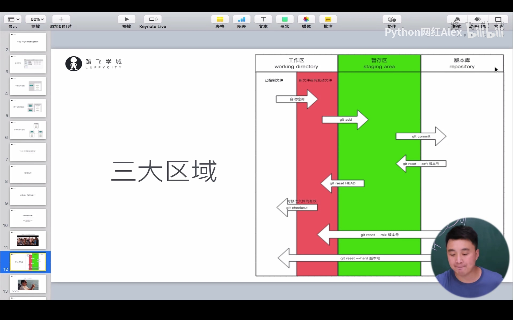

## 分支：

**只保留修改的部分！**

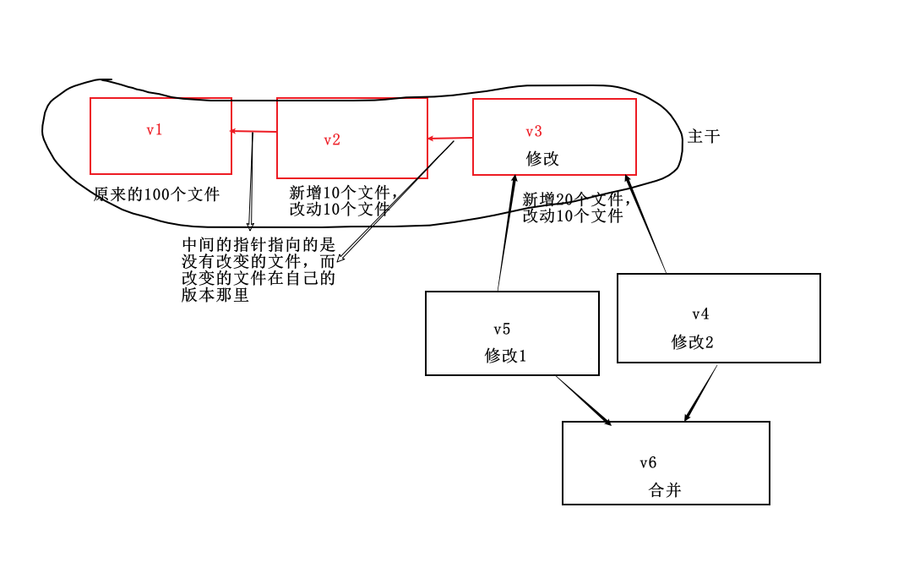

如何应用到开发过程中：

第四阶段：

```python
git branch # 查看分支
git branch dev  # 新建分支
git checkout dev  # 切换到dev分支

# 合并bug分支到master
git checkout master
git merge bug

# 删除bug分支
git branch -d bug

#如果修改bug的代码和dev分支上的代码在一行，可能会产生分支冲突。此时需要手动解决冲突。
```

git工作流：建议最开始开发的时候就再新建一个分支——dev分支，以后写代码只在dev分支上写。

GitHub：

1. 注册GitHub账号；

2. 创建一个仓库；

3. 将本地代码推送到远程仓库；

   ```python
   git remote add origin 远程仓库地址（）
   git push -u origin 分支名称
   ```

4. 将代码拉下来;其实是将所有分支都copy下来了

   ```python
   git clone 网址
   ```

5. 注意：要在dev分支上开发的时候，需要将master分支上的代码Merge到dev上，以保持最新的版本。

流程：

- 在家里面上传代码

  ```python
  git remote add origin 网址
  git push -u origin master
  ```

- 到公司新电脑第一次获取代码：

  ```python
  git clone 远程仓库地址
  git checkout 分支
  ```

- 在公司开发：

  ```python
  git checkout dev
  git merge master  # 仅执行一次
  修改代码
  git add .
  git commit -m "xx"
  git push origin dev
  ```

- 下班回家继续写代码

  ```c
  git checkout dev
  git pull origin dev
  
  git add .
  git commit -m "xx"
  git push origin dev
  ```

- 开发完毕，上线：

  ```python
  # 切换到master
  git checkout master
  git merge dev
  git push origin master
  
  # 此时也可将dev分支也提交到远程
  git checkout dev
  git push origin dev
  ```

- 


