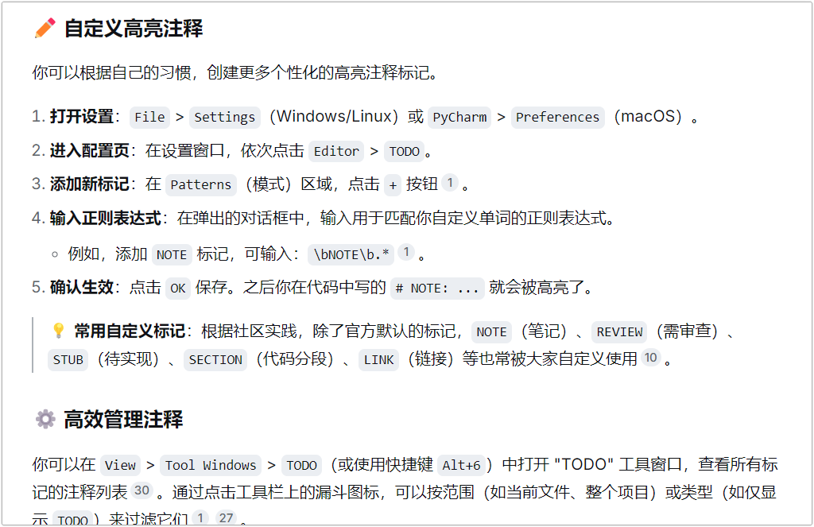
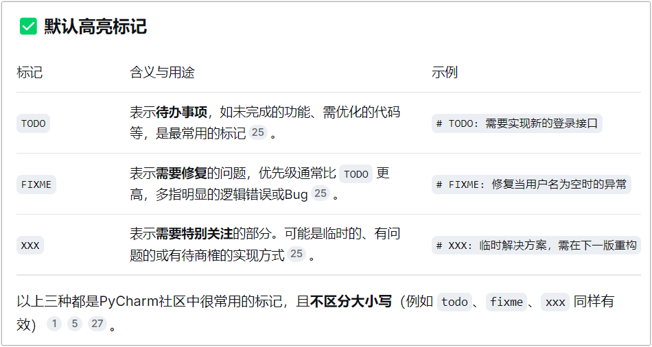

我在pycharm中实现的：

```
(?<![a-zA-Z0-9_\u4e00-\u9fa5])注意(?![a-zA-Z0-9_\u4e00-\u9fa5]).*
(?<![a-zA-Z0-9_\u4e00-\u9fa5])警告(?![a-zA-Z0-9_\u4e00-\u9fa5]).*
(?<![a-zA-Z0-9_\u4e00-\u9fa5])重要(?![a-zA-Z0-9_\u4e00-\u9fa5]).*
(?<![a-zA-Z0-9_\u4e00-\u9fa5])待修复(?![a-zA-Z0-9_\u4e00-\u9fa5]).*
(?<![a-zA-Z0-9_\u4e00-\u9fa5])待实现(?![a-zA-Z0-9_\u4e00-\u9fa5]).*
(?<![a-zA-Z0-9_\u4e00-\u9fa5])笔记(?![a-zA-Z0-9_\u4e00-\u9fa5]).*
(?<![a-zA-Z0-9_\u4e00-\u9fa5])待审查(?![a-zA-Z0-9_\u4e00-\u9fa5]).*
(?<![a-zA-Z0-9_\u4e00-\u9fa5])链接(?![a-zA-Z0-9_\u4e00-\u9fa5]).*
(?<![a-zA-Z0-9_\u4e00-\u9fa5])特别关注(?![a-zA-Z0-9_\u4e00-\u9fa5]).*

\bnote\b.*
\bfixme\b.*
\bnote\b.*
\bxxx\b.*
\breview\b.*
\bstub\b.*
\bsection\b.*
\blink\b.*
\bimportant\b.*
```


关于 `(?<![a-zA-Z0-9_\u4e00-\u9fa5])注意(?![a-zA-Z0-9_\u4e00-\u9fa5]).*`

| 你写的注释     |       是否高亮？        | 原因分析                                           |
| :------------- | :---------------------: | :------------------------------------------------- |
| `#注意`        |    ✅ **高亮** `注意`    | 前面是空，后面也是空，前后都没有违规字符，通过！   |
| `# 注意`       |    ✅ **高亮** `注意`    | 前面是空格，后面是空，前后都没有违规字符，通过！   |
| `# 注意: 重点` | ✅ **高亮** `注意: 重点` | 前面是空格，后面是冒号，前后都没有违规字符，通过！ |
| `#---注意!`    |   ✅ **高亮** `注意!`    | 前面是符号，后面是符号，通过！                     |
| `#abc注意`     |      ❌ **不高亮**       | 前面是字母 `c`，被前安检门拦截。                   |
| `#注意abc`     |      ❌ **不高亮**       | 后面是字母 `a`，被后安检门拦截。                   |
| `#注意_变量`   |      ❌ **不高亮**       | 后面是下划线 `_`，被后安检门拦截。                 |
| `#注意这里`    |      ❌ **不高亮**       | 后面是中文“这”，被后安检门拦截。                   |


