<h1 style="text-align: center;font-size: 40px; font-family: '楷体';">Python 内存管理 + 垃圾回收</h1>

# 一、内存管理

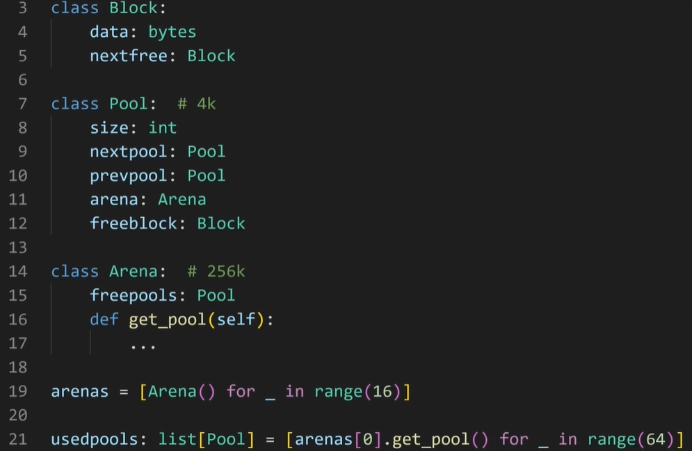

Python内存管理的层级：

- blobk：每一个block保存一个固定大小的数据

- pool：4k，和一个内存页一样大，每个pool里面都是相同大小的block -- 注意，一个pool和另外一个pool拥有的block的大小可能不一样大。但是在每一个pool的内部每个block是一样大的。因此，每一个pool是由一个size属性的，size用来说明这个pool里面的block的大小是多少。

- arena：256k，每一个arena里面有很多pool，但arena只记录还没有被使用的pool，而这个pool里面block的大小是在这个pool从没使用到转变成使用那一刻决定的。

Python刚开始运行的时候会建立一堆arena，一般16个，如果不够用了就会建立新的arena。userpools:一个保存着很多pool指针的数组，这个数组的index对应着这个pool里面的block的大小。

当向Python申请内存的时候，Python会首先判断你申请的内存是不是大于512byte，如果是，直接去用C的malloc，如果小于512byte，会先做一个内存对齐，接下来就回去对应的pool里面找一个block，比如你要22byte，那么Python会分配24个byte，这24个byte就在userpools里面的第3个pool--index为2的那个pool，而这个pool里面每一个block都是24个byte，可以从这个pool里面随便拿一个没有使用的block分配给你。

--------------------

```python
1. python是由C开发出来的
2. Include    /    objects
3. 在Python中所有东西创建对象的时候，内部都会存储一些数据

// ============================================================================
// 下面的C代码是CPython源码 Include/object.h 这个文件中 第 207 ~ 227 行的代码
// Python版本: 3.13.13
struct _object {
    // ob_tid stores the thread id (or zero). It is also used by the GC and the
    // trashcan mechanism as a linked list pointer and by the GC to store the
    // computed "gc_refs" refcount.
    uintptr_t ob_tid;
    uint16_t _padding;
    PyMutex ob_mutex;           // per-object lock
    uint8_t ob_gc_bits;         // gc-related state
    
    // 引用计数器（可能，此处不确定）
    uint32_t ob_ref_local;      // local reference count
    Py_ssize_t ob_ref_shared;   // shared (atomic) reference count
    
    // 创建对象的类型
    PyTypeObject *ob_type;
};
#endif

/* Cast argument to PyObject* type. */
#define _PyObject_CAST(op) _Py_CAST(PyObject*, (op))

typedef struct {
    PyObject ob_base;
    Py_ssize_t ob_size; /* Number of items in variable part */
} PyVarObject;
// ============================================================================

4. 在创建对象的时候，如
   v = 0.3
   源码内部：
    a.开辟内存
    b.数据初始化
        ob_fval = 0.3
        ob_type = float
        ob_refcnt = 1
    c.将对象加入到双向链表中 -- ref_chain
    
   操作:
    name = v
   源码内部:
    ob_refcnt + 1
    
   操作:
    del v
   源码内部:
    ob_refcnt - 1
    
   操作:
    def fun(arg):
        print(123)
    fun(name)
   源码内部:
    刚调用函数进去后: ob_refcnt + 1 (arg引用了 0.3)
    函数执行完毕后: ob_refcnt - 1
    
   操作:
    del name
   源码内部:
    ob_refcnt - 1
    每次引用计数器 -1 后都需要检查引用计数器的值是否为 0，如果是 0 则认为是垃圾，对它进行回收
5. Python内部为了提升效率会做一些缓存的机制
6. 面试 -- 内存管理:
    Python是由C语言开发的，操作都是基于底层的C语言实现
    Python中创建每个对象，内部都会用C语言的结构体来维护一些数据 
    	PyObject prev指针 next指针 引用计数器 类型(至少有这些数据)
    	PyVarObject prev指针 next指针 引用计数器 类型 容量个数(至少有这些数据)
    在创建对象的时候，每个对象内部至少有4个值，ref_chain, ob_refcnt, ob_type
    在创建对象之后，对内存中的数据进行初始化:
        引用计数器初始化为 1
        赋值
        将对象添加到ref_chain中
    如果再有其他变量指向内存, 则让引用计数器 + 1
    如果销毁某个变量，则找到它指向的内存，将其引用计数器 - 1
    	如果引用计数器的值为 0，则进行垃圾回收
    在内部可能存在缓存机制, 例如int/str有小缓存池，float(100个)/list(80个)/tuple(20个)/dict等会放入 freelist 链表中，以后如果再创建同类		型的数据时，会先去链表中取出对象，然后再对对象进行初始化
    
```

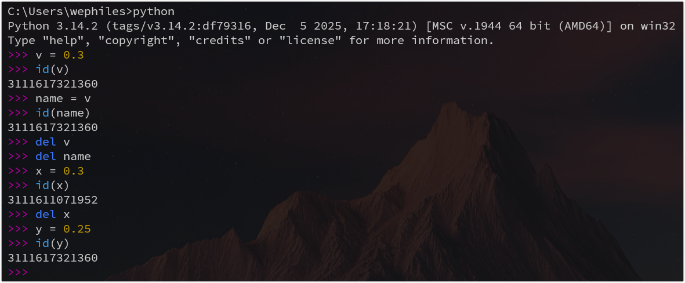

注意: python 中 long 不限制长度 -- 所以 Python 中的 int 属于 PyVarProject

另外，bool 是由 0 1 组成的(也算是 int) -- 所以 bool 也属于 PyVarProject

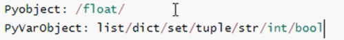


# 二、垃圾回收机制

总结一句话：引用计数器为主，标记清除和分代回收为辅 + 缓存机制。

基于C语言源码底层，真正了解垃圾回收机制的实现。

- 引用计数器
- 标记清除
- 分代回收
- 缓存机制Python的C源码(3.8.2版本)

## 2.1 引用计数器

### 2.1.1 环状双向链表 refchain

> Python中创建的**任何对象**都会加在这个 refchain 双向链表中。

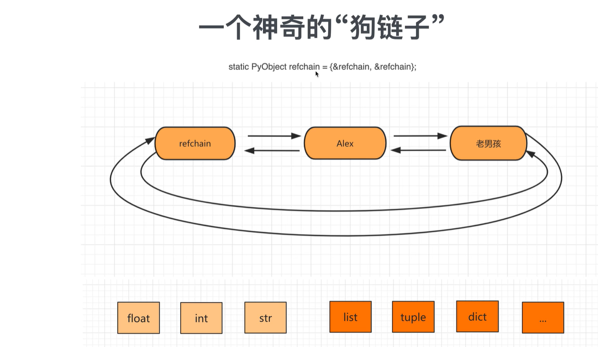

```python
name = "computer"
age = 18
hobby = ["篮球", "美女"]
```

```python
name = "computer"  # 内部会创建一些数据 -- 类似于一个结构体【上一个对象，下一个对象，类型，引用的个数】
new = name  # 这时候引用的个数为2

age = 18 # 内部会创建一些数据--类似于一个结构体【上一个对象，下一个对象，类型，引用的个数，value=18】
...

hobby = ["篮球", "美女"]  # 内部会创建一些数据--类似于一个结构体【上一个对象，下一个对象，类型，引用的个数，items=元素，元素个数=2】
```

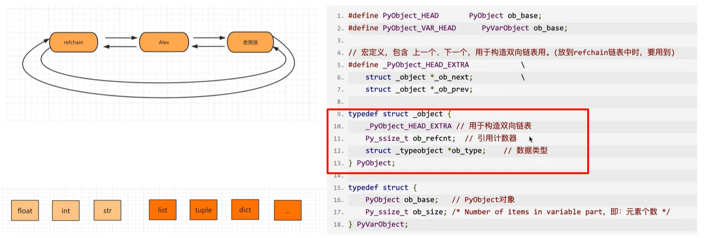

如上图，在C源码中，如何体现每个对象都有相同的值，PyObject结构体(四个值).

----


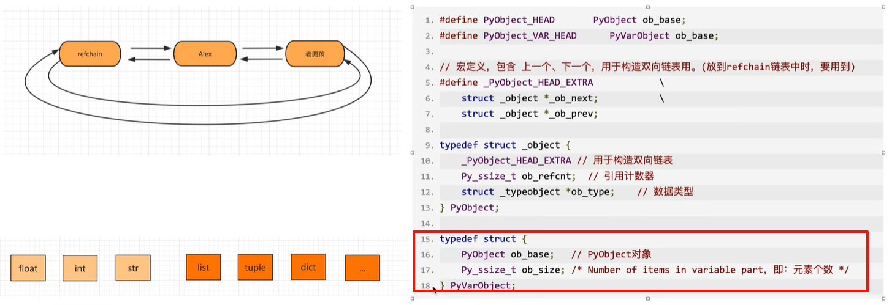

如上图，在C源码中体现由多个元素组成的对象：PyObject结构体（四个值） + ob_size 。

### 2.1.2 类型封装结构体

详细解析

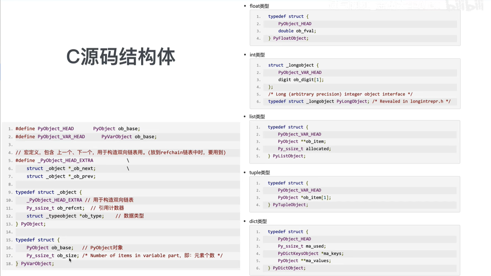

```python
data = 3.14  
# 内部会创建:
#    _ob_next = refchain中的上一个对象
#    _ob_prev = refchain中的下一个对象
#    ob_refcnt = 1
#    ob_type = float
#    ob_fval = 3.14
```

### 2.1.3 引用计数器

```python
v1 = 3.14
v2 = 999
v3 = (1, 2, 3)
```

当 Python 程序运行时，**会根据数据类型的不同找到其对应的结构体**，根据结构体中的字段来进行创建相关的数据，然后将对象添加到 refchain 双向链表中。

在源码中，有两个关键的结构体:PyObject、PyValObject

每一个对象中有ob_refcnt就是引用计数器，值默认为1，当有其他变量引用对象时，引用计数器就会发生变化。

- 引用

  ```python
  a = 123
  b = a  # 引用计数器 + 1 此时引用计数器值为2
  ```

- 删除引用

  ```python
  a = 123
  b = a  # 引用计数器 + 1 此时值为2
  del b  # b变量删除 b对应对象的引用计数器 - 1 此时引用计数器值为1
  del a  # a变量删除 a对应对象的引用计数器 - 1 此时引用计数器值为0
  
  # 当一个对象的引用计数器为0时，意味着没有使用这个对象了，意味着这个对象是垃圾--就要回收
  # 回收：1. 将对象从refchain中拿走  2. 将对象进行销毁，归还内存
  ```

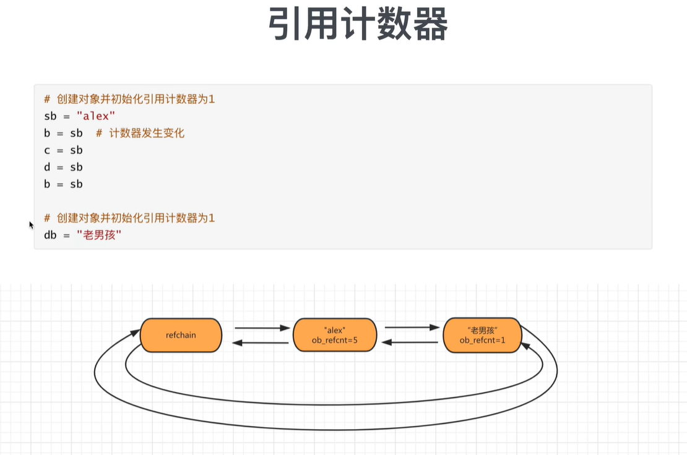

### 2.1.4 引用计数器的缺点/问题/bug -- 循环引用

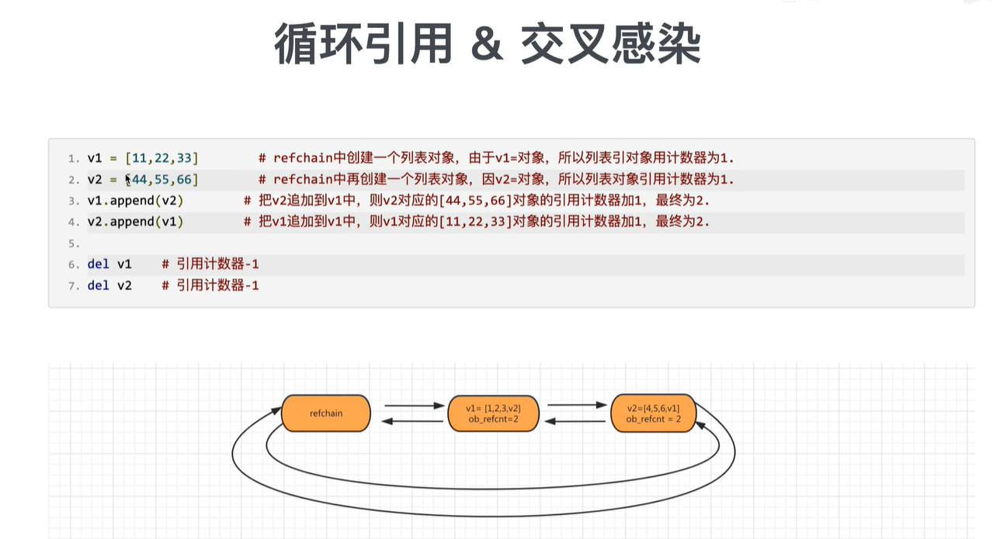

有个问题：如上图，v1.ppend(v2)的时候，`v1=[11, 22, 33, [44, 55, 66]]`，此时v2对应的这个列表就会有两个引用（一个是v2，另外一个是==v1的索引3==），如图中refchain显示的那样。

如上图，`v2.ppend(v1)`的时候，也会有同样的问题。

于是乎，两个对象的refchain中的引用计数器的值都为2.当del v1和 v2的时候，引用计数器都是变成1，但是按理来说，此时两者的引用都应该为0 -- 有bug。我们发现如果只用引用计数器来做垃圾回收 -- 会有循环引用的问题。

## 2.2 标记清除

为了解决引用计数器的循环引用的不足。

实现：在Python底层，再去维护一个链表，链表中专门放那些**可能存在循环引用的对象(list、tuple、dict、set)**

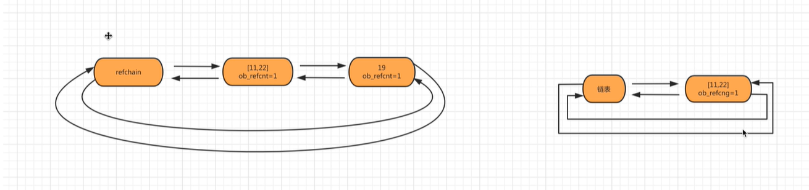

在Python内部，会在某种情况下触发 -- 会去扫描可能存在循环引用的链表中的每个元素，检查是否有循环引用，如果有，那么让双方的引用计数器各自-1，-1后如果是0，那么回收，如果不是0，那么不管。

问题：

- 什么时候扫描一次
- 可能存在循环引用的链表扫描的代价比较大，每次扫描耗时比较久

于是引入了一个新技术：分代回收

## 2.3 分代回收

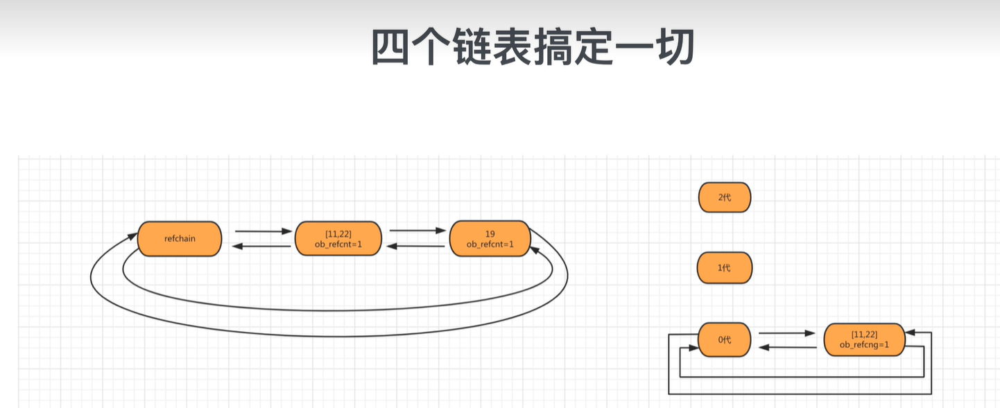

将可能存在循环引用的对象维护成三个链表：

- 0代：0代中对象个数达到700个扫描一次。第一次扫描如果是垃圾直接回收，如果不是那么直接放到1代
- 1代：0代扫描10次则1代扫描1次
- 2代：1代扫描10次则2代扫描1次

## 2.4 小结

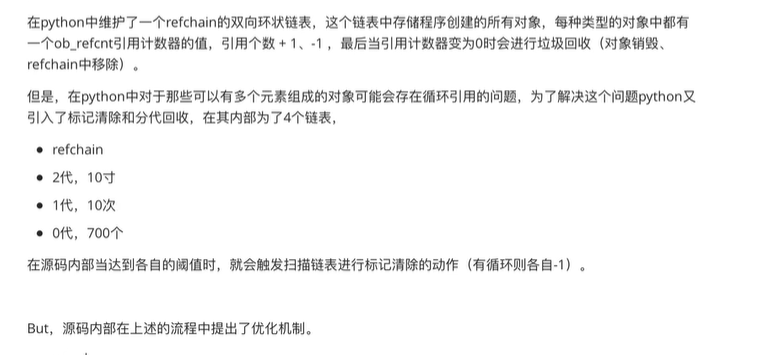

## 2.5 缓存

### 2.5.1 池(int类型、字符串类型)

为了避免重复创建和销毁一些常见的对象，维护了一个池。

```python
# 启动解释器的时候，会创建-5，-4， ...， 256
v1 = 7  # 不会开辟内存，直接去池中获取
v2 = 9  # 不会开辟内存，直接去池中获取 -- v2和v3是同一个内存地址
v3 = 9  # 不会开辟内存，直接去池中获取 -- v2和v3是同一个内存地址
```

### 2.5.2 `free_list(float/list/tuple/dict)`

当一个对象引用计数器为0时，按理说应该回收，而是将对象添加到`free_list`链表中，当缓存，以后创建对象时，不再重新开辟内存，而是直接使用`free_list`。

`free_list`有大小限制。

```python
v1 = 3.14  # 开辟内存 内部存储结构体中定义那几个值 并存到refchain中

del v1  # refchain中删除，如果缓冲池没满，将对象添加到free_list中

v3 = 333.33  # 不会重新开辟内存，去free_list中获取对象，对象内部数据初始化，再放到refchain中
```

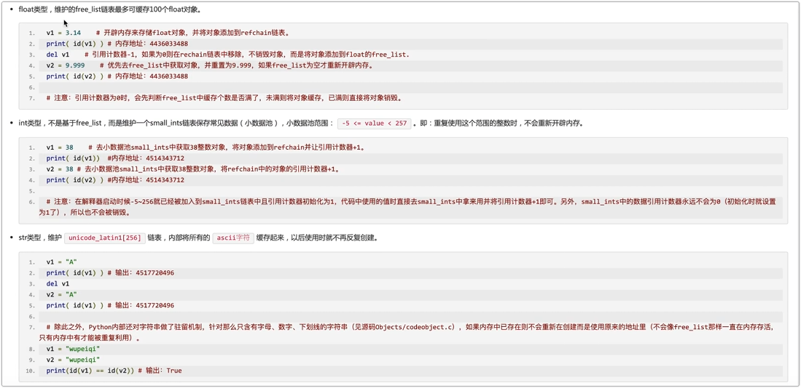

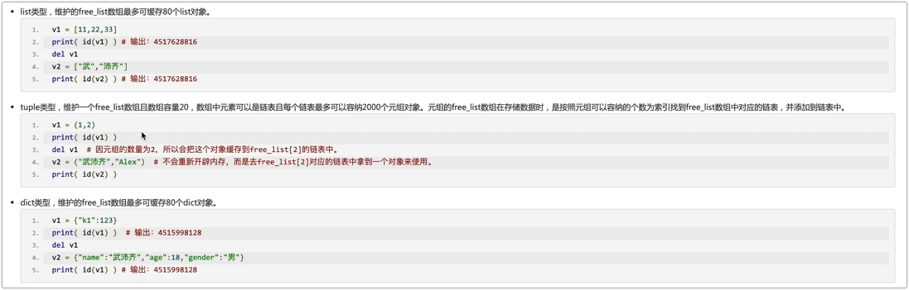

元组相关的free_list：

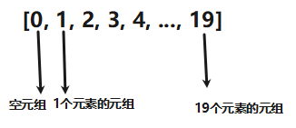

了解：下标为1的索引所指向的链表能存2000个长度为1的元组！

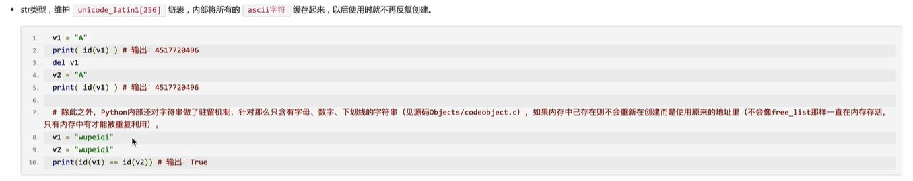

# 三、源码分析

## 3.1 float类型

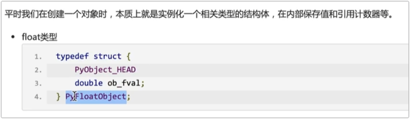

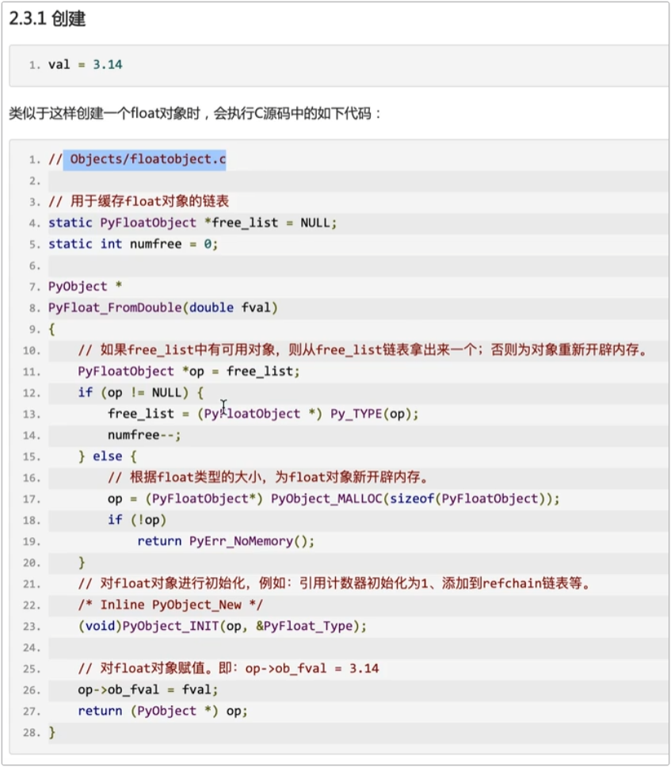


