# 一、变量

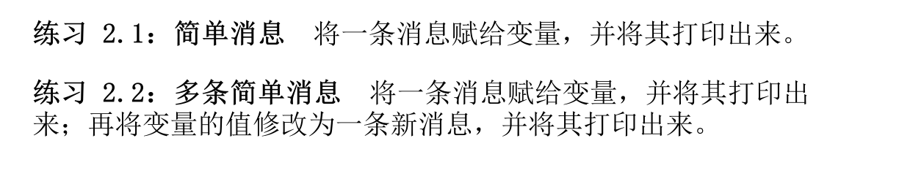

```python
# 练习 2.1
message_data = 'Hello, Python!'
print(message_data)
```

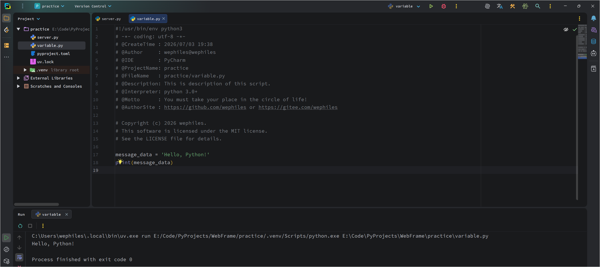

```python
# 练习 2.2

message = 'Hello, Python!'
print(message)
message = 'Hello World!'
print(message)
```

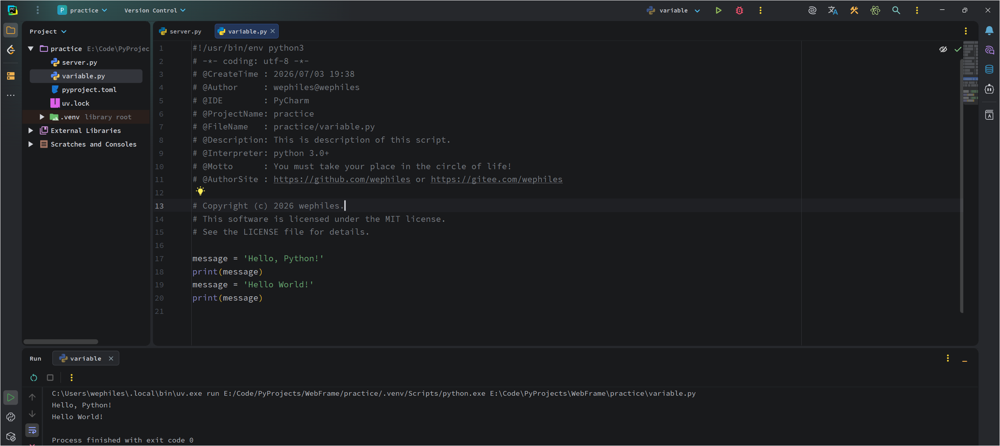

# 二、字符串

**字符串（string）**就是一系列字符。在 Python 中，用引号引起的都
是字符串，其中的引号可以是单引号，也可以是双引号：

```python
"This is a string."
'This is also a string.'
```

这种灵活性让你能够在字符串中包含引号和撇号：

```python
'I told my friend, "Python is my favorite language!"'
"The language 'Python' is named after Monty Python, not the
snake."
"One of Python's strengths is its diverse and supportive
community."
```

## 2.1 使用方法修改字符串的大小写

对于字符串，可执行的最简单的操作之一是，修改其中单词的大小写。请看下面的代码，并尝试判断其作用：

```python
name = "ada lovelace"
print(name.title())
```

将这个文件保存为 `name.py`，再运行它。你将看到如下输出：

```python
Ada Lovelace
```

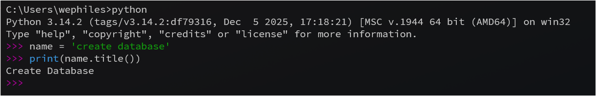

在这个示例中，变量 name 指向全小写的字符串 "ada lovelace"。在函数调用 print() 中，title() 方法出现在这个变量的后面。方法（method）是 Python 可对数据执行的操作。在name.title() 中，name 后面的句点（.）让 Python 对 name变量执行 title() 方法指定的操作。每个方法后面都跟着一对括号，这是因为方法通常需要额外的信息来完成工作。这种信息是在括号内提供的。title() 函数不需要额外的信息，因此它后面的括号是空的。

title() 方法以首字母大写的方式显示每个单词，即将每个单词的首字母都改为大写。这很有用，因为你经常需要将名字视为信息。例如，你可能希望程序将值 Ada、ADA 和 ada 视为同一个名字，并将它们都显示为 Ada。

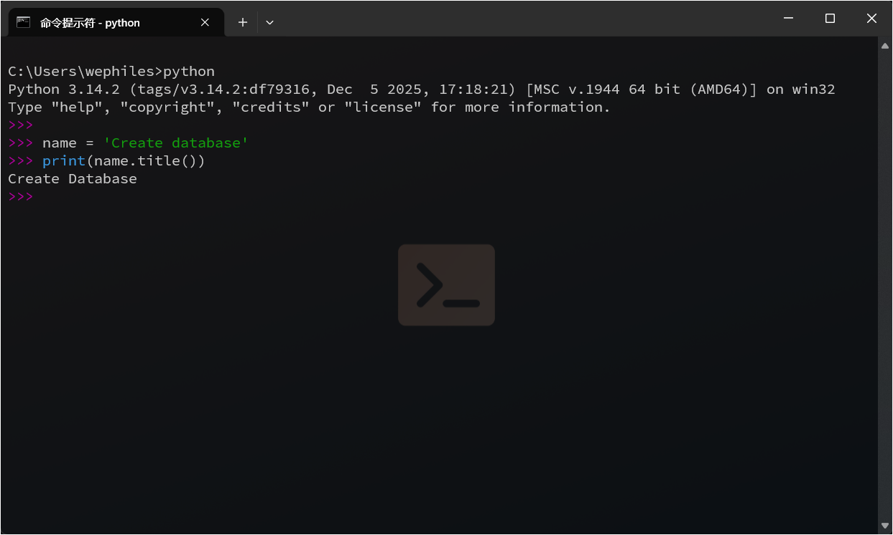

还有其他几个很有用的大小写处理方法。例如，要将字符串改为全大写或全小写的，可以像下面这样做：

```python
name = "Ada Lovelace"
print(name.upper())
print(name.lower())
```

```python
ADA LOVELACE
ada lovelace
```

在存储数据时，lower() 方法很有用。用户通常不能像你期望的那样提供正确的大小写，因此需要将字符串先转换为全小写的再存储。以后需要显示这些信息时，再将其转换为最合适的大小写方式即可。

## 2.1 在字符串中使用变量

在一些情况下，你可能想在字符串中使用变量的值。例如，你可能想使用两个变量分别表示名和姓，再合并这两个值以显示姓名：

```python
first_name = "ada"
last_name = "lovelace"
❶ full_name = f"{first_name} {last_name}"
print(full_name)
```

要在字符串中插入变量的值，可先在左引号前加上字母 f（见❶），再将要插入的变量放在花括号内。这样，Python 在显示字符串时，将把每个变量都替换为其值。这种字符串称为 f 字符串。f 是 format（设置格式）的简写，因为Python 通过把花括号内的变量替换为其值来设置字符串的格式。上述
代码的输出如下：

```python
ada lovelace
```

使用 f 字符串可以完成很多任务，如利用与变量关联的信息来创建完整的消息，如下所示：

```python
first_name = "ada"
last_name = "lovelace"
full_name = f"{first_name} {last_name}"
❶ print(f"Hello, {full_name.title()}!")
```

这里，在一个问候用户的句子中使用了完整的姓名（见❶），并使用
title() 方法来将姓名设置为合适的格式。这些代码将显示一条格
式良好的简单问候语：

```python
Hello, Ada Lovelace!
```

还可以使用 f 字符串来创建消息，再把整条消息赋给变量：

```python
first_name = "ada"
last_name = "lovelace"
full_name = f"{first_name} {last_name}"
❶ message = f"Hello, {full_name.title()}!"
❷ print(message)
```

上述代码也显示消息“Hello, Ada Lovelace!”，但将这条消息赋给了一个变量（见❶），这让最后的函数调用 print() 简单得多（见❷）。

## 2.2 使用制表符或者换行符来添加空白

在编程中，空白泛指任何非打印字符，如空格、制表符和换行符。你
可以使用空白来组织输出，让用户阅读起来更容易。
要在字符串中添加制表符，可使用字符组合 \t：

```python
>>> print("Python")
Python
>>> print("\tPython")
	Python
```

要在字符串中添加换行符，可使用字符组合 \n：

```python
>>> print("Languages:\nPython\nC\nJavaScript")
Languages:
C Python
JavaScript
```

## 2.3 删除空白

在程序中，额外的空白可能令人迷惑。对程序员来说，'python' 和'python ' 看起来几乎没什么两样，但对程序来说，它们是两个不
同的字符串。Python 能够发现 'python ' 中额外的空白，并认为它意义重大——除非你告诉它不是这样的。
空白很重要，因为你经常需要比较两个字符串是否相同。

例如，一个重要的示例是，在用户登录网站时检查其用户名。即使在非常简单的情形下，额外的空白也可能令人迷惑。所幸，在 Python 中删除用户输入数据中多余的空白易如反掌。Python 能够找出字符串左端和右端多余的空白。要确保字符串右端没有空白，可使用 rstrip() 方法。

```python
❶ >>> favorite_language = 'python '
❷ >>> favorite_language
'python '
❸ >>> favorite_language.rstrip()
'python'
❹ >>> favorite_language
'python '
```

与变量 favorite_language 关联的字符串右端有多余的空白（见❶）。当你在终端会话中向 Python 询问这个变量的值时，可看到末尾的空格（见❷）。对变量 favorite_language 调用 rstrip()方法后（见❸），这个多余的空格被删除了。然而，这种删除只是暂时的，如果再次询问 favorite_ language 的值，这个字符串会与输入时一样，依然包含多余的空白（见❹）。要永久删除这个字符串中的空白，必须将删除操作的结果关联到变量：

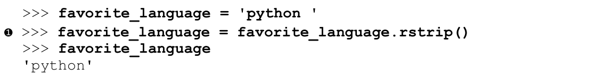

为删除这个字符串中的空白，你将其右端的空白删除，再将结果关联到原来的变量（见❶）。在编程中，经常需要修改变量的值，再将新值关联到原来的变量。这就是变量的值可能随程序的运行或用户的输入数据发生变化的原因所在。
还可以删除字符串左端的空白或同时删除字符串两端的空白，分别使用 lstrip() 方法和 strip() 方法即可：

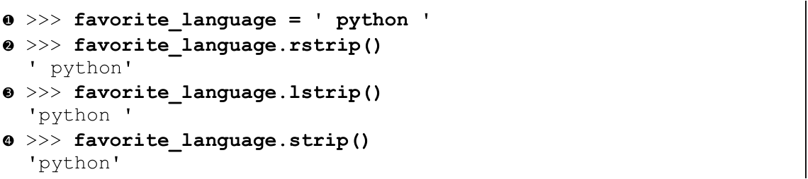

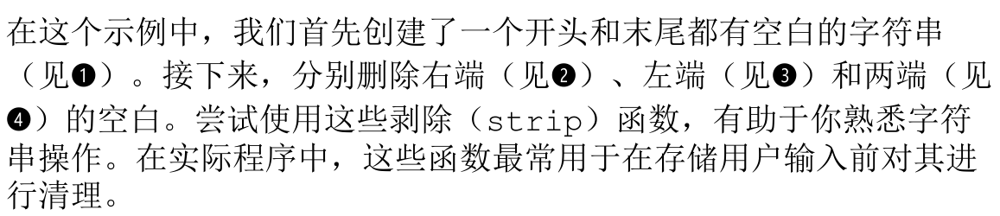

## 2.4 删除前缀

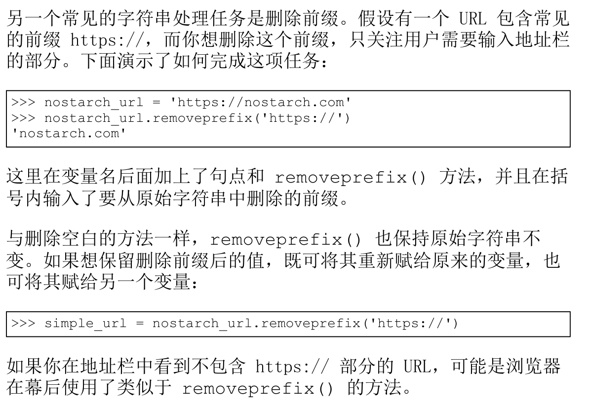

```python
data_url = 'https://www.baidu.com'
res = data_url.removeprefix('https://')
print(res)
```

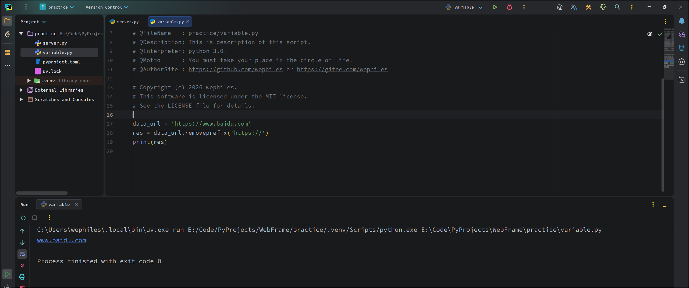

## 2.5 如何在使用字符串时避免语法错误

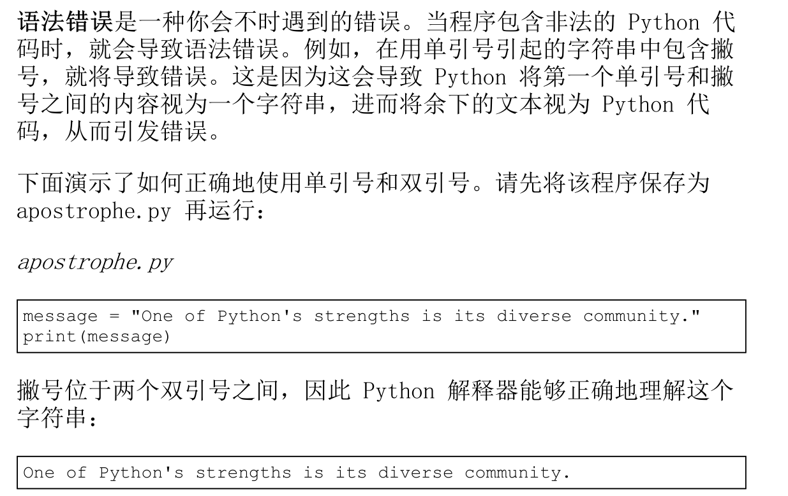

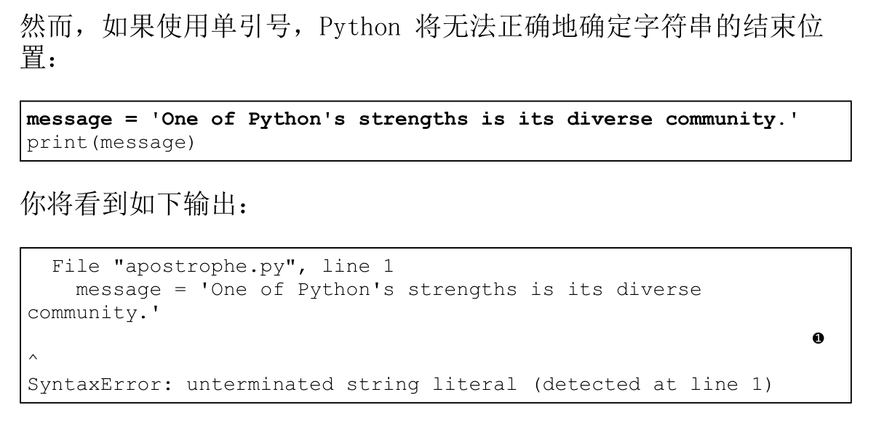

从上述输出可知，错误发生在最后一个单引号后面（见❶）。

在解释器看来，这种语法错误表明一些内容不是有效的 Python 代码，原因是没有正确地使用引号将字符串引起来。错误的原因各种各样，我将指出一些常见的原因。

在学习编写 Python 代码时，你可能经常遇到语法错误。语法错误也是最不具体的错误类型，因此可能难以找出并修复。当受困于非常棘手的错误时，请参阅附录 C 提供的建议。

注意：在编写程序时，编辑器的语法高亮功能可帮助你快速找出某些语法错误。如果看到 Python 代码以普通句子的颜色显示，或者普通句子以 Python 代码的颜色显示，就可能意味着文件中存在引号不匹配的情况。

## 练习题:

### 练习 2.3：个性化消息

```python
用变量表示一个人的名字，并向其显示一条消息。显示的消息应非常简单，如下所示。
Hello Eric, would you like to learn some Python today? 
```

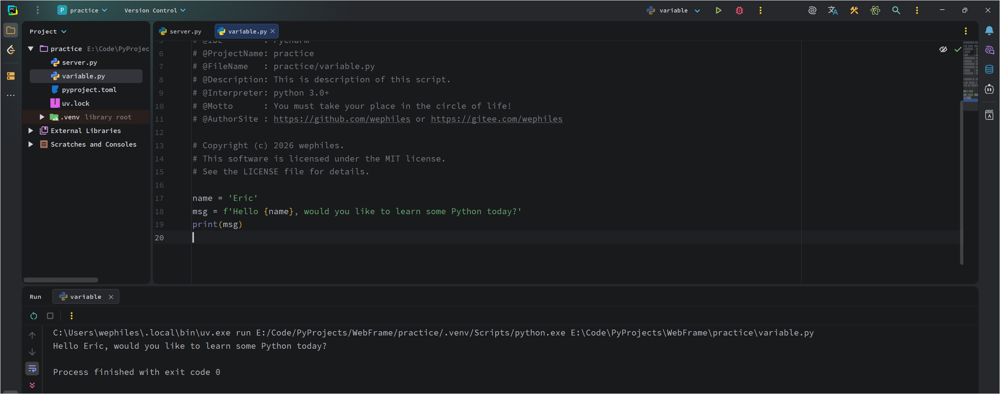

### 练习 2.4：调整名字的大小写

```python
用变量表示一个人的名字，再分
别以全小写、全大写和首字母大写的方式显示这个人名。
```

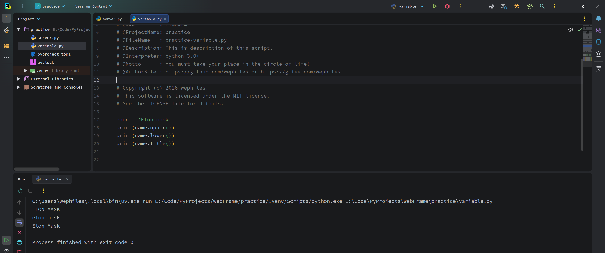

### 练习 2.5：名言 1

```python
找到你钦佩的名人说的一句名言，将这个名人的姓名和名言打印出来。输出应类似于下面这样（包括引号）。
Albert Einstein once said, “A person who never made a mistake never tried anything new.”
```

```python
author = 'Albert Einstein'
name = 'The world as we have created it is a process of our thinking. It cannot be changed without changing our thinking.'
print(f'{author} once said, "{name}"')
```

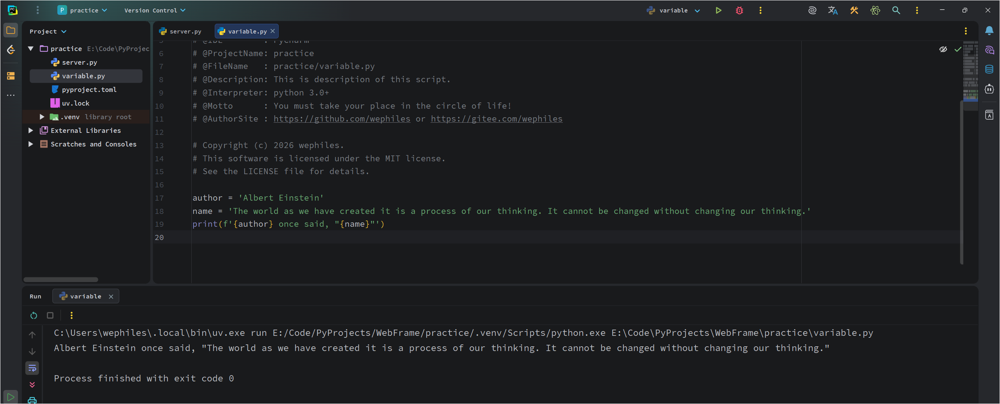

### 练习 2.6：名言 2

```python
重复练习 2.5，但用变量 famous_person表示名人的姓名，再创建要显示的消息并将其赋给变量message，然后打印这条消息。
```

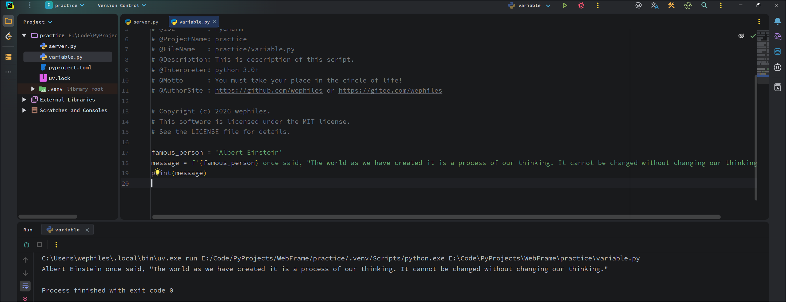

### 练习 2.7：删除人名中的空白

```python
用变量表示一个人的名字，并在其开头和末尾都包含一些空白字符。务必至少使用字符组合"\t" 和 "\n" 各一次。打印这个人名，显示其开头和末尾的空白。然后，分别使用函数lstrip()、rstrip() 和 strip() 对人名进行处理，并将结果打印出来。
```

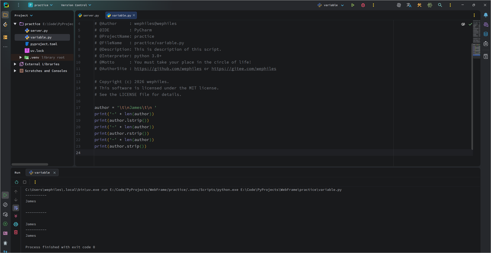

### 练习 2.8：文件扩展名

```python
Python 提供了 removesuffix() 方法，其工作原理与 removeprefix() 很像。请将值 'python_notes.txt' 赋给变量 filename，再使用removesuffix() 方法来显示不包含扩展名的文件名，就像文件浏览器所做的那样。
```

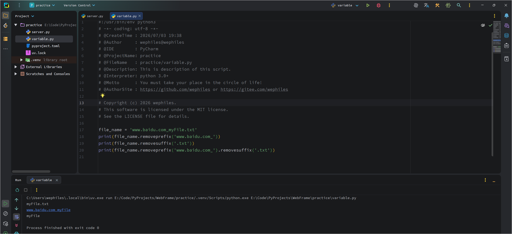

# 三、数

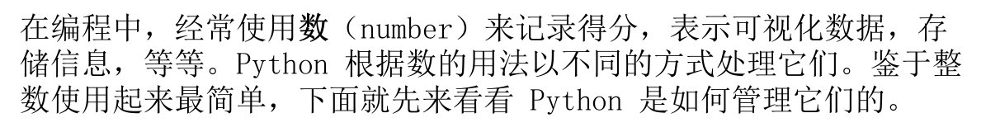

## 3.1 整数

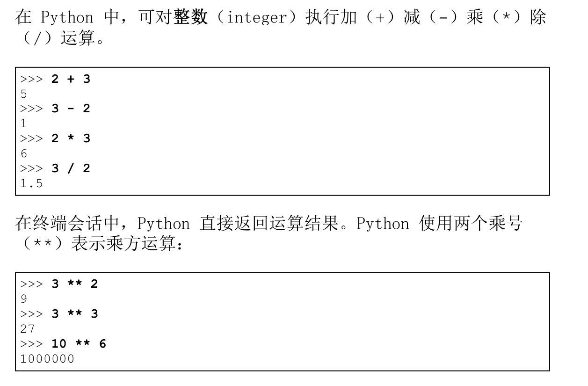

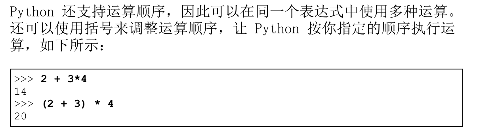


