<h1>Python 列表</h1>

# 1. 列表简介

## 1.1 列表是什么

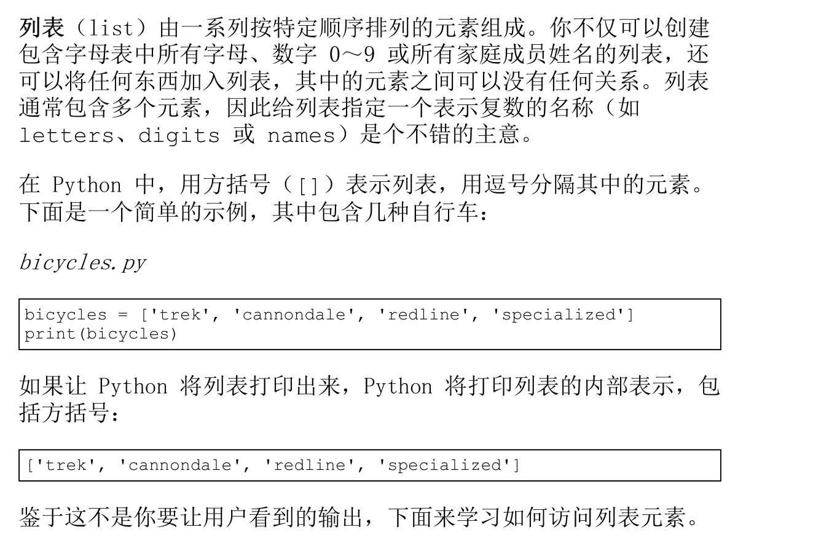

### 1.1.1  访问列表元素

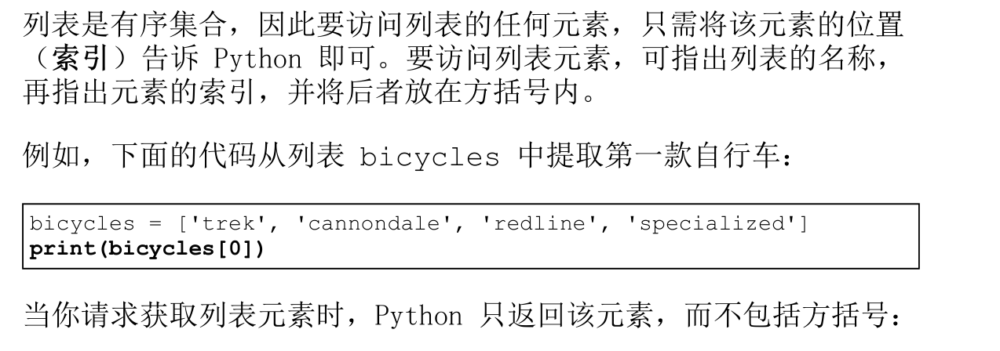

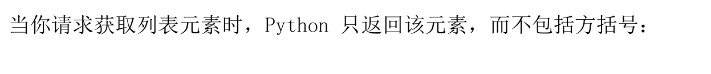

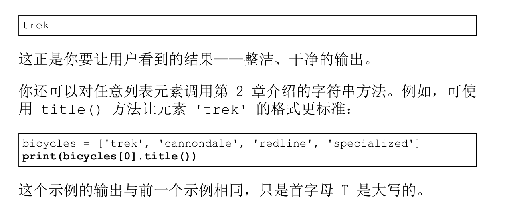

### 1.1.2 索引是从 0 开始的而不是从 1 开始的

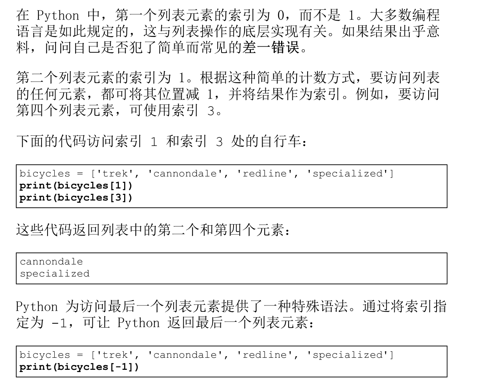

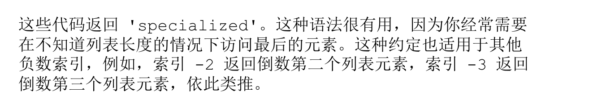

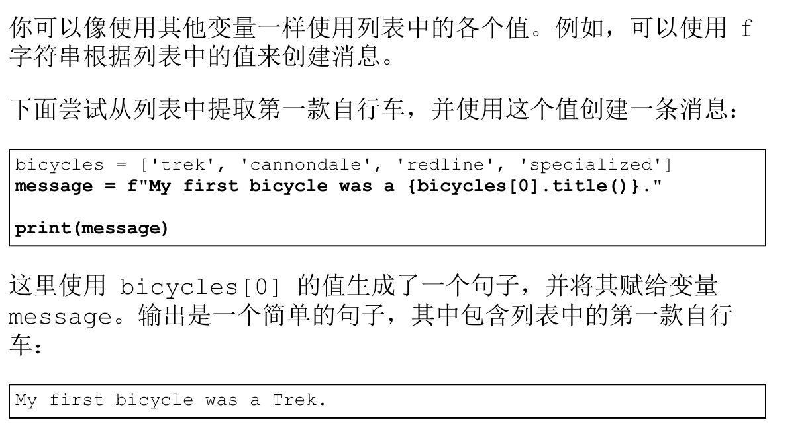

## 1.2 修改添加删除元素

你创建的大多数列表将是动态的，这意味着列表创建后，将随着程序的运行增删元素。例如，你可能创建了一个游戏，要求玩家消灭从天而降的外星人。为此，可在开始时将一些外星人存储在列表中，然后每当有外星人被消灭时，都将其从列表中删除，而每次有新的外星人出现在屏幕上时，都将其添加到列表中。在整个游戏运行期间，外星人列表的长度将不断变化。

### 1.2.1 修改列表元素

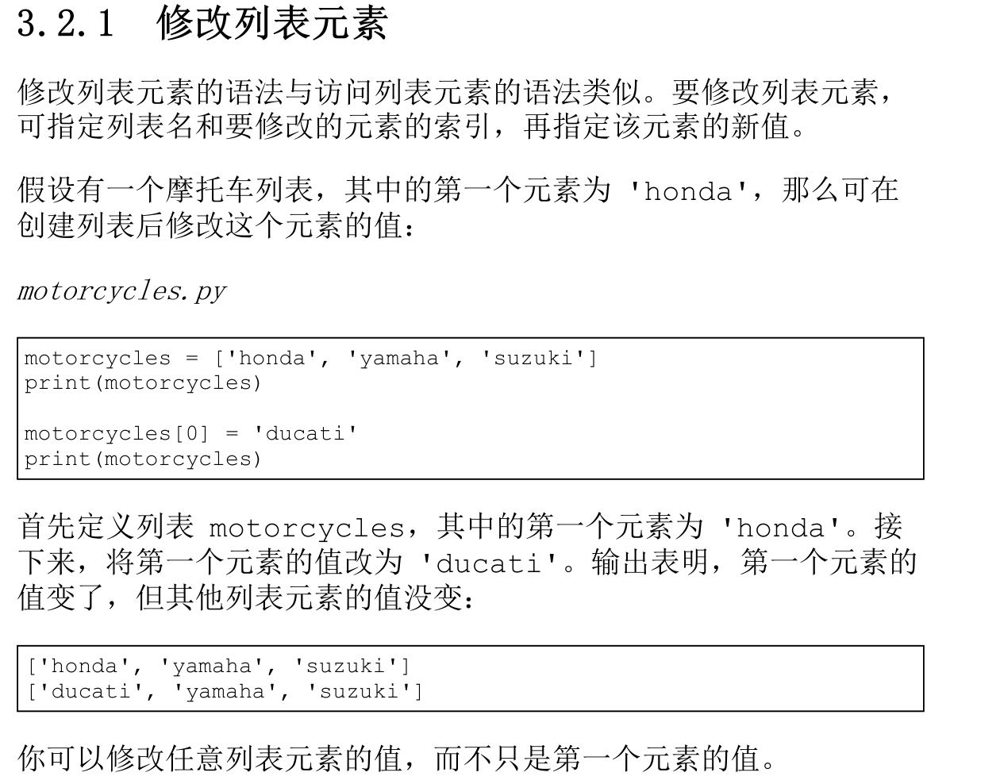

### 1.2.2 在列表中添加元素

你可能会出于很多原因在列表中添加新元素。例如，你可能希望游戏中出现新的外星人，添加可视化数据，或者给网站添加新注册的用户。Python 提供了多种在既有列表中添加新数据的方式。

- 在列表末尾添加元素
  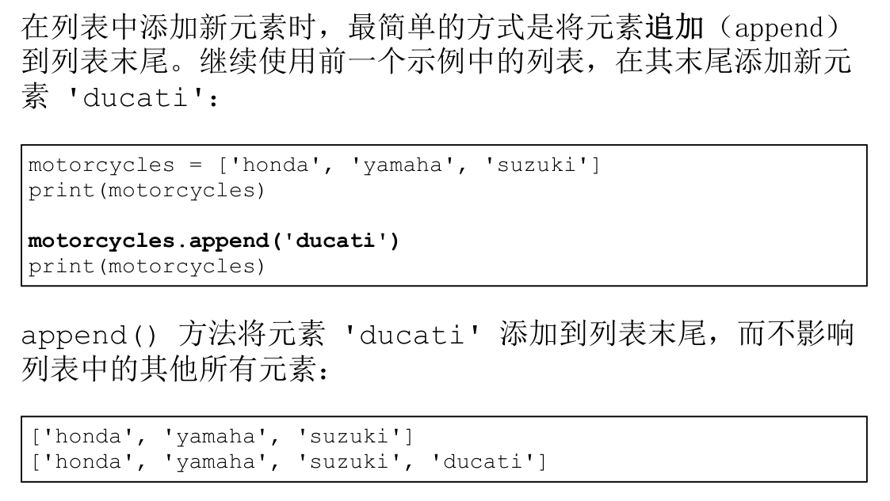
  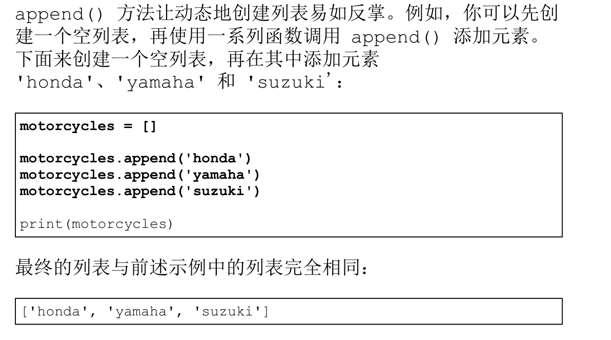
  这种创建列表的方式极其常见，因为经常要等程序运行后，你才知道用户要在程序中存储哪些数据。为了便于管理，可首先创建一个空列表，用于存储用户将要输入的值，然后将用户提供的每个新值追加到列表末尾。

- 在列表中插入元素
  ```
  motorcycles = ['honda', 'yamaha', 'suzuki']
  motorcycles.insert(0, 'ducati')
  print(motorcycles)
  ```

  ```
  ['ducati', 'honda', 'yamaha', 'suzuki']
  ```

### 1.2.3 从列表中删除元素

**del**

```python
motorcycles = ['honda', 'yamaha', 'suzuki']
print(motorcycles)
del motorcycles[0]
print(motorcycles)
```

```python
['honda', 'yamaha', 'suzuki']
['yamaha', 'suzuki']
```

**pop**

```python
❶ motorcycles = ['honda', 'yamaha', 'suzuki']
print(motorcycles)
❷ popped_motorcycle = motorcycles.pop()
❸ print(motorcycles)
❹ print(popped_motorcycle)
```

```python
['honda', 'yamaha', 'suzuki']
['honda', 'yamaha']
suzuki
```

---

```python
motorcycles = ['honda', 'yamaha', 'suzuki']
first_owned = motorcycles.pop(0)
print(f"The first motorcycle I owned was a
{first_owned.title()}.")
```

```python
The first motorcycle I owned was a Honda
```

如果不确定该使用 del 语句还是 pop() 方法，下面是一个简单的判断标准：如果要从列表中删除一个元素，且不再以任何方式使用它，就使用 del 语句；如果要在删除元素后继续使用它，就使用 pop() 方法。

**remove**

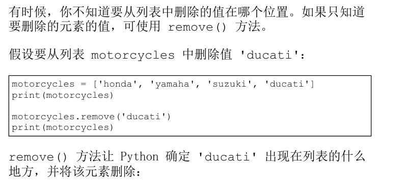

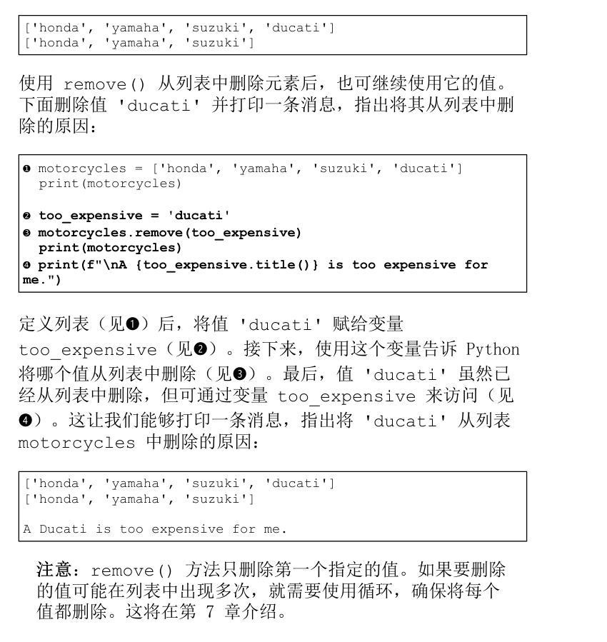

## 1.3 管理列表

- 使用 sort() 方法对列表进行永久排序.

```python
lst = [2, 5, 6, 1, 3]
lst.sort()
print(lst)
```

```python
[1, 2, 3, 5, 6]
```

```python
lst = [2, 5, 6, 1, 3]
lst.sort(reverse=True)
print(lst)
```

```python
[6, 5, 3, 2, 1]
```

- 使用 sorted() 函数对列表进行临时排序

```python
cars = ['bmw', 'audi', 'toyota', 'subaru']
❶ print("Here is the original list:")
print(cars)
❷ print("\nHere is the sorted list:")
print(sorted(cars))
❸ print("\nHere is the original list again:")
print(cars)
```

```python
Here is the original list:
['bmw', 'audi', 'toyota', 'subaru']
Here is the sorted list:
['audi', 'bmw', 'subaru', 'toyota']
❶ Here is the original list again:
['bmw', 'audi', 'toyota', 'subaru']
```

- 反向打印列表

```python
cars = ['bmw', 'audi', 'toyota', 'subaru']
print(cars)
cars.reverse()
print(cars)
```

```python
['bmw', 'audi', 'toyota', 'subaru']
['subaru', 'toyota', 'audi', 'bmw']
```

- 确定列表的长度

# 2. 操作列表

## 2.1 遍历

## 2.2 避免缩进错误

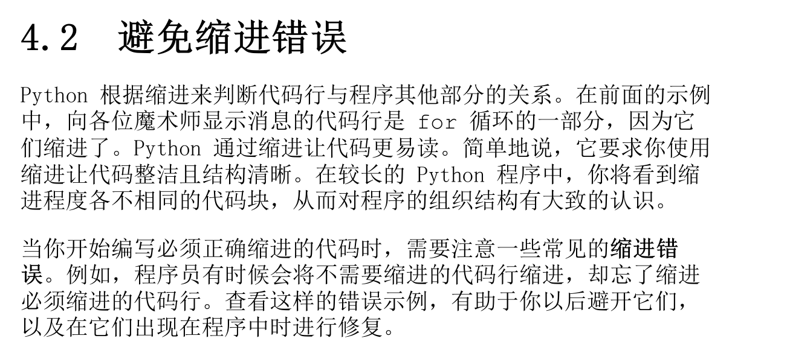


