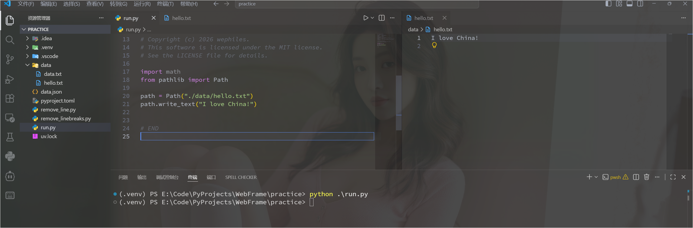
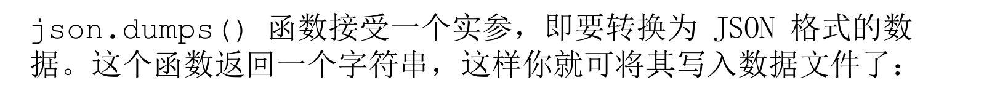

```python
from pathlib import Path

path = Path(".\\data\\data.txt")
print(path)  # data\data.txt

contents = path.read_text()
print(contents)
# 3.1415926535
# 8979323846
# 2643383279
#

print(contents.splitlines())  # ['3.1415926535', '8979323846', '2643383279']
```

```python
from pathlib import Path

path = Path("./data/hello.txt")
path.write_text("I love China!")
```





json.dumps() 函数生成一个字符串（见❷），它包含我们要存储的数据的 JSON 表示形式。


