<h1>python 单元测试</h1>

# 1. 通过测试

```python
# name_func.py
def get_formatted_info(first_name, last_name):
    """生成规范格式的姓名"""
    return f"{first_name} {last_name}".title()
```

```python
# names.py

from name_func import get_formatted_info

print("Enter 'q' at any time to quit.")
while True:
    first = input("\nPlease give me a first name: ")
    if first == 'q':
        break

    last = input("Please give me a last name: ")
    if last == 'q':
        break

    formatted_name = get_formatted_info(first, last)

    print(f"\tNeatly formatted name: {formatted_name}.")
```

显然是能够正确运行的.

现在假设要修改get_formatted_name()，使其还能够处理中间名。在添加这项功能时，要确保不破坏这个函数处理只有名和姓的姓名的方式。为此，可在每次修改 get_formatted_name() 后都进行测试：运行程序names.py，并输入像 Janis Joplin 这样的姓名。不过这太烦琐了。所幸 pytest 提供了一种自动测试函数输出的高效方式。倘若对get_formatted_name() 进行自动测试，我们就能始终确信，当给这个函数提供测试过的姓名时，它都能正确地工作。

```python
# 更新后的函数:
def get_formatted_info(first_name, last_name, middle_name=''):
    """生成规范格式的姓名"""
    if middle_name:
        return f"{first_name} {middle_name} {last_name}".title()
    else:
        return f"{first_name} {last_name}".title()
```

```python
# test_name_function.py

from name_func import get_formatted_info


def test_first_last_name():
    """能够正确处理类似于 jenny green 这样的姓名吗？

    测试文件的名称很重要，必须以 test_打头。
    当你让 pytest 运行测试时，它将查找以 test_ 打头的文件，并运行其中的所有测试。
    """
    formatted_name = get_formatted_info("jenny", "green")
    assert formatted_name == "Jenny Green"
```

```python
>>>pytest
```

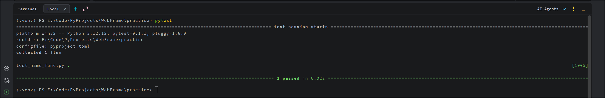

```python
# 注意:
1. 文件名后面的句点表明有一个测试通过了，而 100% 指出运行了所有的测试。
2. 在可能有数百乃至数千个测试的大型项目中，句点和完成百分比有助于监控测试的运行进度。
```

# 2. 未通过测试

```python
# 更新后的函数: 其他函数等都没变
def get_formatted_info(first_name, last_name, middle_name=''):
    """生成规范格式的姓名"""
    return f"{first_name} {middle_name} {last_name}".title()
```

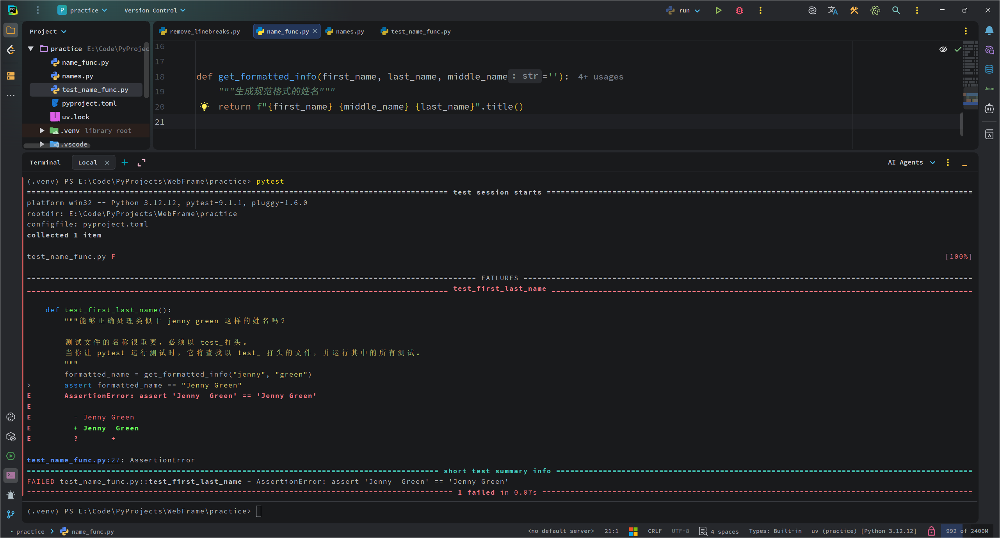

```python
输出中有一个字母 F，表明有一个测试未通过。
然后是 FAILURES 部分，这是关注的焦点，因为在运行测
试时，通常应该关注未通过的测试。接下来，指出未通过的测试函数
是 test_first_last_name()。右尖括号指出了
导致测试未能通过的代码行。下一行中的 E指出了导致测试
未通过的具体错误. 在末尾的简短小结中，再次列出了最重要的信息。这
样，即使你运行了很多测试，也可快速获悉哪些测试未通过以及测试
未通过的原因。
```

# 3. 测试类


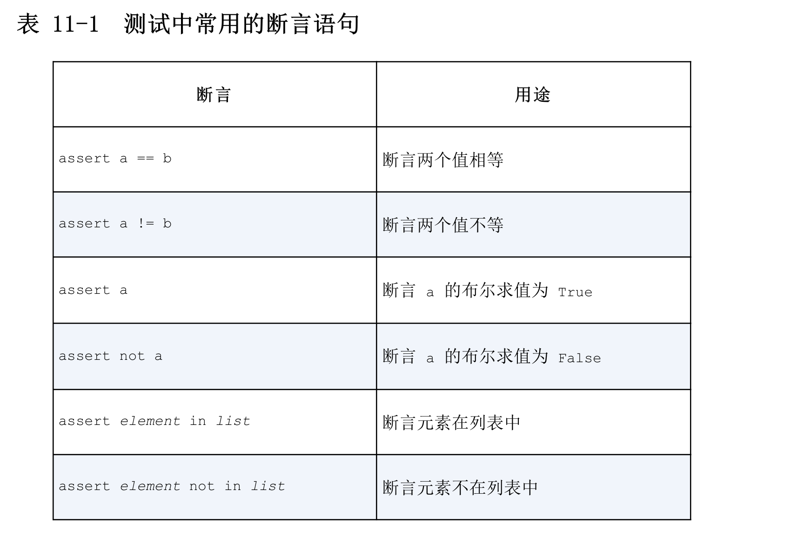

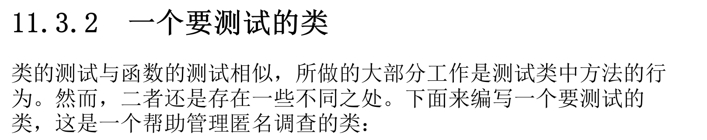

```python
class AnonymousSurvey:
    """收集匿名调查问卷的答案"""

    def __init__(self, question):
        """存储一个问题，并为存储答案做准备"""
        self.question = question
        self.responses = []

    def show_question(self):
        """显示调查问卷"""
        print(self.question)

    def store_response(self, new_response):
        """存储单份调查答卷"""
        self.responses.append(new_response)

    def show_results(self):
        """显示收集到的所有答卷"""
        print("Survey results:")
        for response in self.responses:
            print(f"- {response}")
```

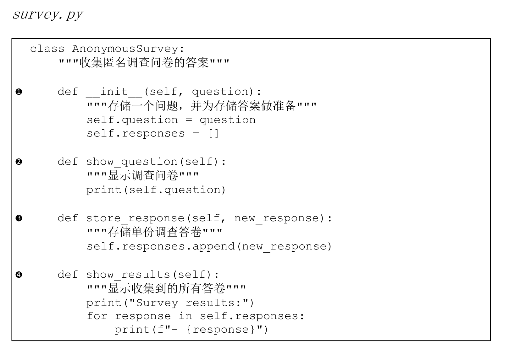

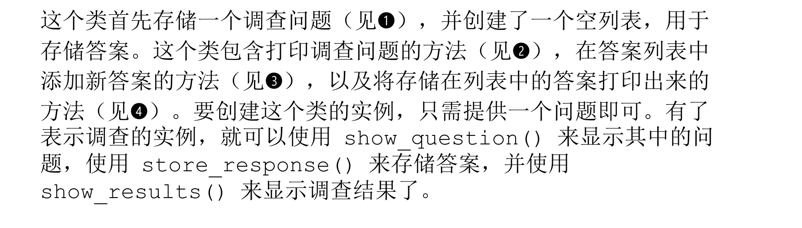

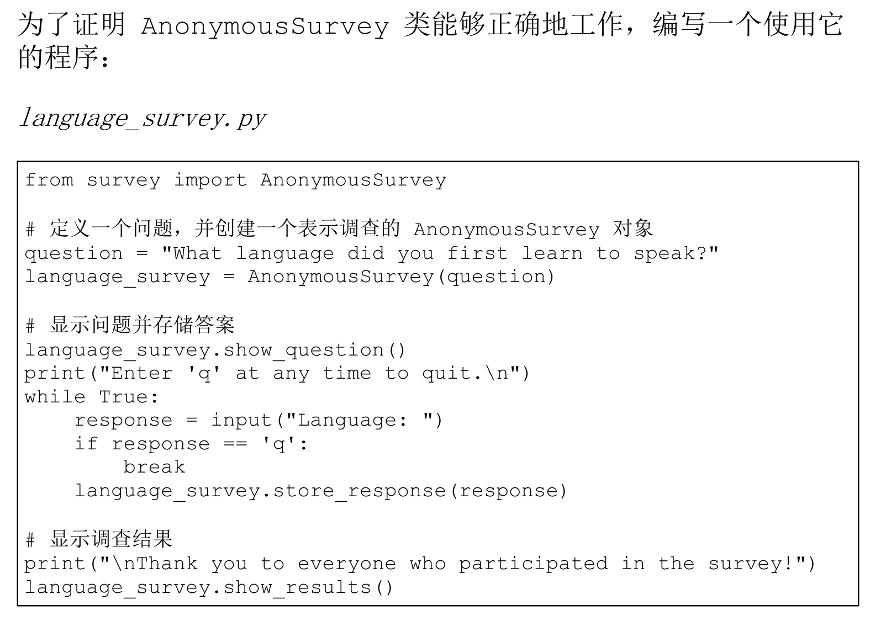

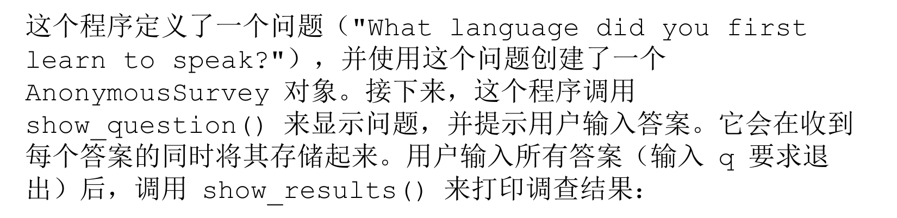

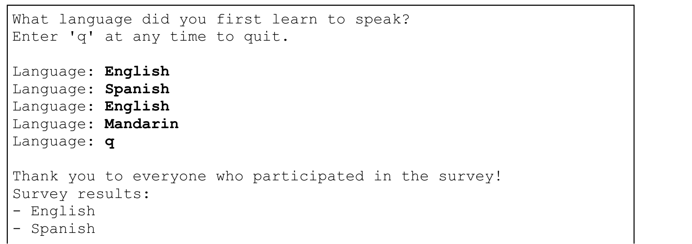


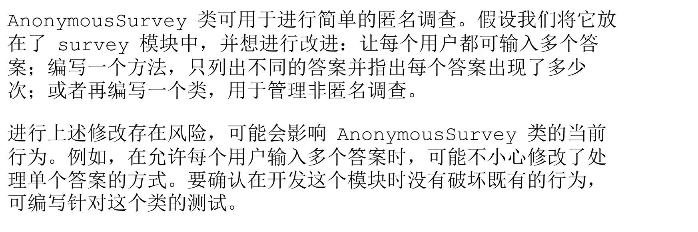

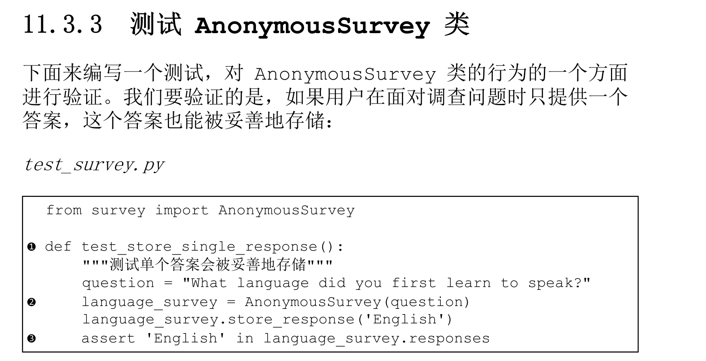

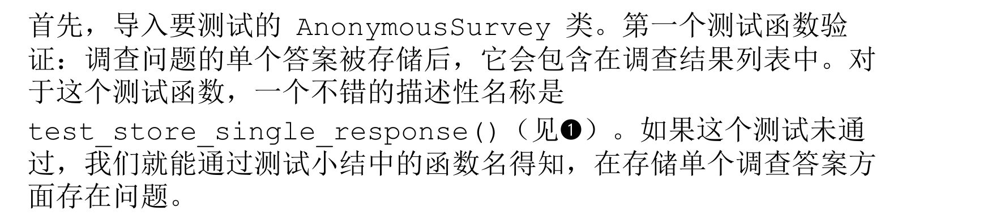

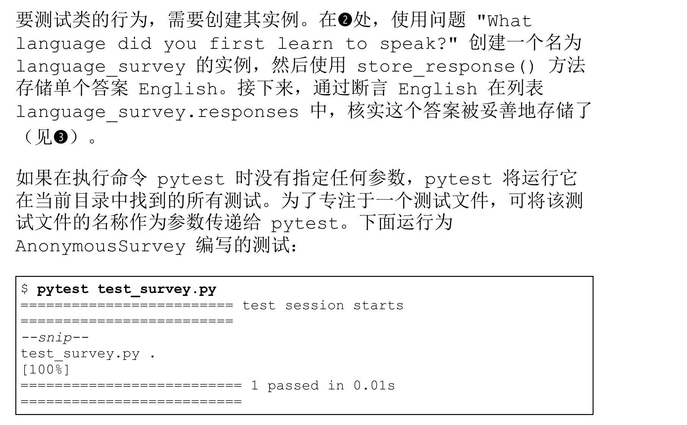

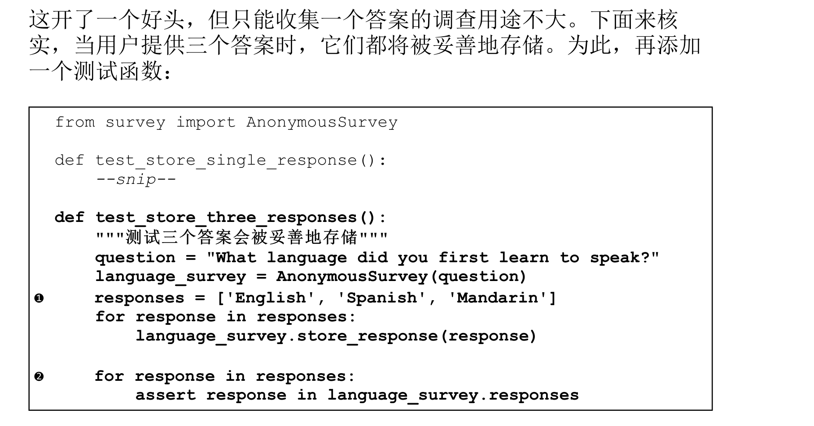

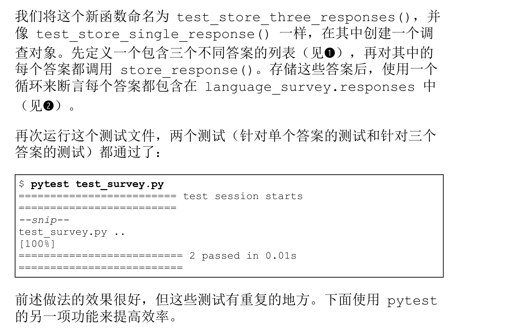

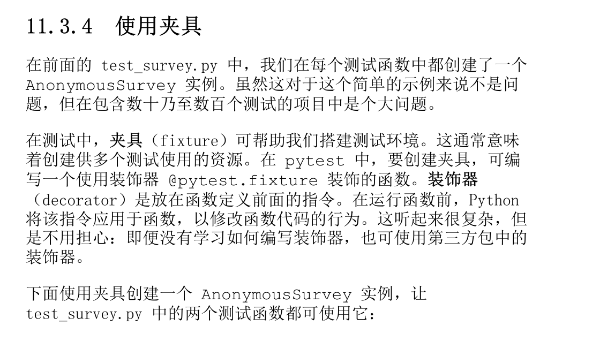

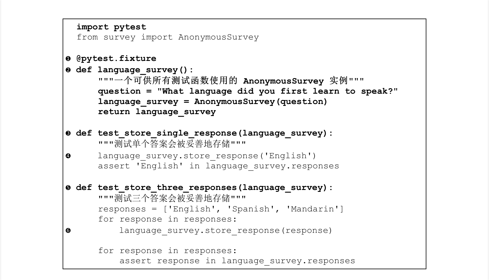

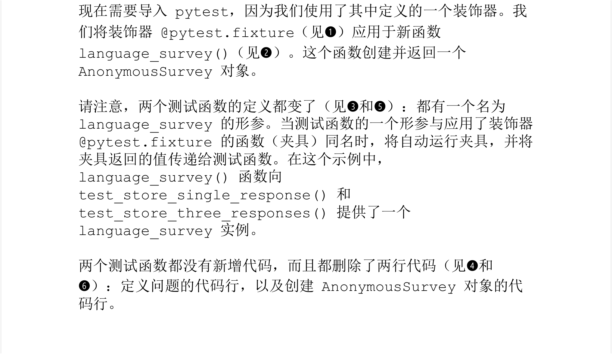

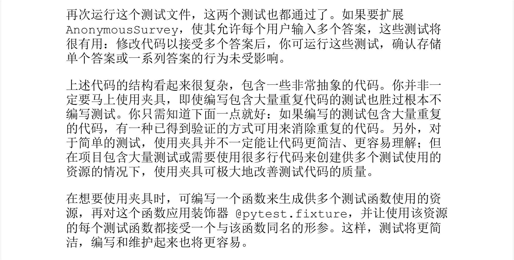


