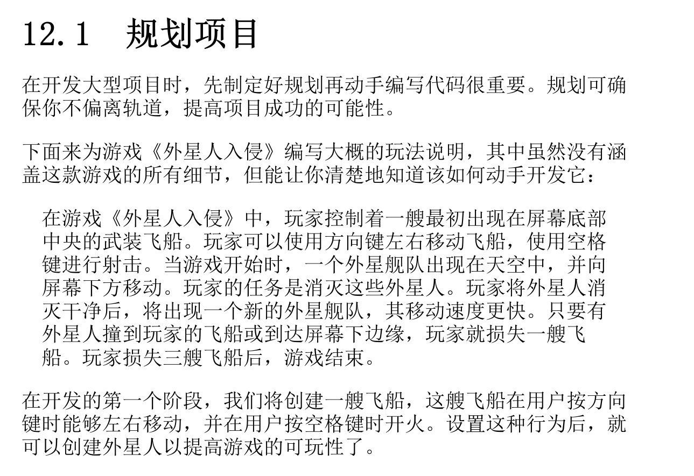
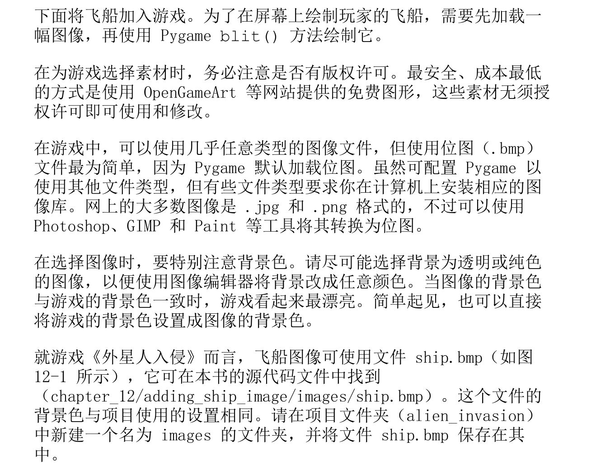
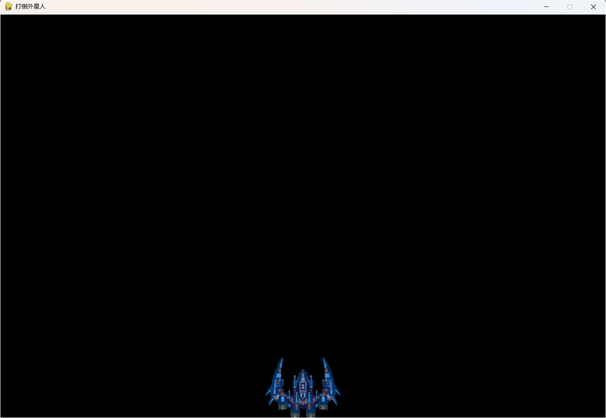
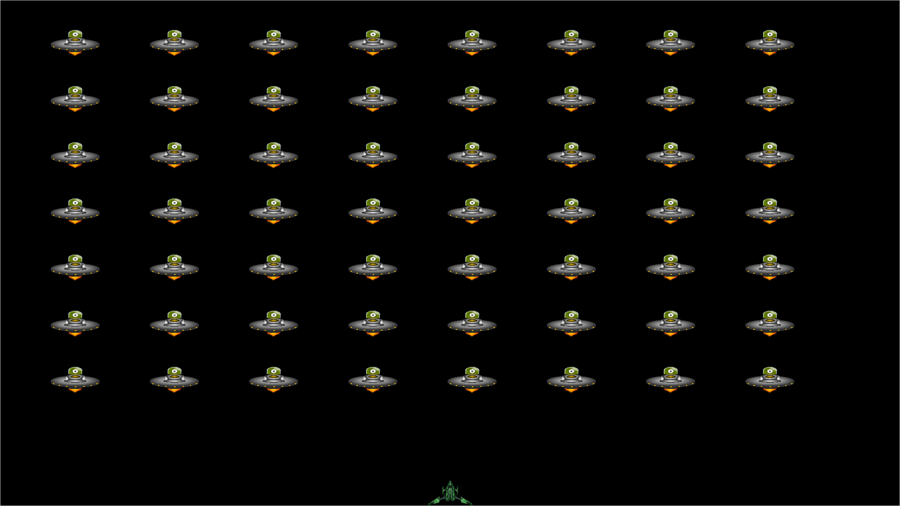
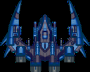
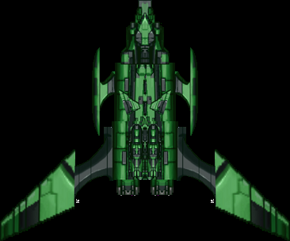
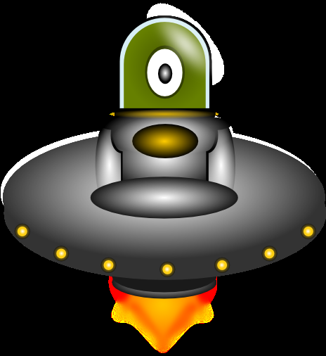

<h1>项目一:外星人入侵</h1>

# 1. 我方舰队



## 1. 创建 pygame 窗口及响应用户输入

```python
# alien_invasion.py
"""
外星人入侵项目入口模块。
"""

import sys

import pygame


class AlienInvasion:
    """管理游戏资源和行为"""

    def __init__(self):
        """初始化游戏并创建游戏资源"""
        pygame.init()

        # 赋值后 self.screen 是一个 Surface 对象
        # set_mode 返回的 surface 表示整个游戏窗口
        # 激活游戏的动画循环后，每经过一次循环都将自动重绘这个 surface，
        # 将用户输入触发的所有变化都反映出来。
        self.screen = pygame.display.set_mode((1200, 800))
        # print(type(self.screen))  # <class 'pygame.surface.Surface'>
        pygame.display.set_caption("Alien Invasion")

    def run_game(self):
        """开始游戏的主循环"""
        while True:
            # 监听键盘和鼠标事件
            # event 是用户玩游戏时执行的操作，如按键或移动鼠标。
            # 我们使用 pygame.event.get() 函数来访问 Pygame 检测到的事件。
            # 这个函数返回一个列表，其中包含它在上一次调用后发生的所有事件。
            # 所有键盘和鼠标事件都将导致这个 for 循环运行。在这个循环中，
            # 我们将编写一系列 if 语句来检测并响应特定的事件。
            for event in pygame.event.get():
                if event.type == pygame.QUIT:
                    sys.exit()

            # 让最近绘制的屏幕可见
            # pygame.display.flip()，命令 pygame 让最近绘制的屏幕可见。
            #
            # 这里，它在每次执行 while 循环时都绘制一个空屏幕，
            # 并擦去旧屏幕，使得只有新的空屏幕可见。我们在移动游戏元素时，
            # pygame.display.flip() 将不断更新屏幕，以显示新位置上的元素并隐藏原来位置上的元素，
            # 从而营造平滑移动的效果。
            pygame.display.flip()


if __name__ == "__main__":
    alien = AlienInvasion()
    alien.run_game()
```

## 2. 控制帧率

理想情况下，游戏在所有的系统中都应以相同的速度（帧率）运行。对于可在多种系统中运行的游戏，控制帧率是个复杂的问题，好在Pygame 提供了一种相对简单的方式来达成这个目标。我们将创建一个时钟（clock），并确保它在主循环每次通过后都进行计时（tick）。当这个循环的通过速度超过我们定义的帧率时，Pygame 会计算需要暂停多长时间，以便游戏的运行速度保持一致。

```python
# alien_invasion.py

"""
外星人入侵项目入口模块。
"""

import sys

import pygame


class AlienInvasion:
    """管理游戏资源和行为"""

    def __init__(self):
        """初始化游戏并创建游戏资源"""
        pygame.init()

        self.clock = pygame.time.Clock()

        # 赋值后 self.screen 是一个 Surface 对象
        # set_mode 返回的 surface 表示整个游戏窗口
        # 激活游戏的动画循环后，每经过一次循环都将自动重绘这个 surface，
        # 将用户输入触发的所有变化都反映出来。
        self.screen = pygame.display.set_mode((1200, 800))
        # print(type(self.screen))  # <class 'pygame.surface.Surface'>

        pygame.display.set_caption("Alien Invasion")

    def run_game(self):
        """开始游戏的主循环"""
        while True:
            # 监听键盘和鼠标事件
            # event 是用户玩游戏时执行的操作，如按键或移动鼠标。
            # 我们使用 pygame.event.get() 函数来访问 pygame 检测到的事件。
            # 这个函数返回一个列表，其中包含它在上一次调用后发生的所有事件。
            # 所有键盘和鼠标事件都将导致这个 for 循环运行。在这个循环中，
            # 我们将编写一系列 if 语句来检测并响应特定的事件。
            for event in pygame.event.get():
                if event.type == pygame.QUIT:
                    sys.exit()

            # 让最近绘制的屏幕可见
            # pygame.display.flip()，命令 pygame 让最近绘制的屏幕可见。
            # 这里，它在每次执行 while 循环时都绘制一个空屏幕，
            # 并擦去旧屏幕，使得只有新的空屏幕可见。我们在移动游戏元素时，
            # pygame.display.flip() 将不断更新屏幕，以显示新位置上的元素并隐藏原来位置上的元素，
            # 从而营造平滑移动的效果。
            pygame.display.flip()

            # tick() 方法接受一个参数：游戏的帧率。这里使用的值为 60，
            # pygame 将尽可能确保这个循环每秒恰好运行 60 次。
            self.clock.tick(60)
            

if __name__ == "__main__":
    alien = AlienInvasion()
    alien.run_game()
```

注意：在大多数系统中，使用 Pygame 提供的时钟有助于确保游戏的运行速度保持一致。如果在你的系统中，使用时钟导致游戏运行速度的一致性变差，可尝试不同的帧率值。如果找不到合适的帧率值，可不使用时钟，直接通过调整游戏的设置来让游戏在你的系统中平稳地运行。

## 3. 设置背景色

```python
# alien_invasion.py

"""
外星人入侵项目入口模块。
"""

import sys

import pygame


class AlienInvasion:
    """管理游戏资源和行为"""

    def __init__(self):
        """初始化游戏并创建游戏资源"""
        pygame.init()

        self.clock = pygame.time.Clock()

        # 赋值后 self.screen 是一个 Surface 对象
        # set_mode 返回的 surface 表示整个游戏窗口
        # 激活游戏的动画循环后，每经过一次循环都将自动重绘这个 surface，
        # 将用户输入触发的所有变化都反映出来。
        self.screen = pygame.display.set_mode((1200, 800))
        # print(type(self.screen))  # <class 'pygame.surface.Surface'>

        pygame.display.set_caption("Alien Invasion")
        # self.bg_color = (230, 230, 230)
        self.bg_color = pygame.Color("white")

    def run_game(self):
        """开始游戏的主循环"""
        while True:
            # 监听键盘和鼠标事件
            # event 是用户玩游戏时执行的操作，如按键或移动鼠标。
            # 我们使用 pygame.event.get() 函数来访问 pygame 检测到的事件。
            # 这个函数返回一个列表，其中包含它在上一次调用后发生的所有事件。
            # 所有键盘和鼠标事件都将导致这个 for 循环运行。在这个循环中，
            # 我们将编写一系列 if 语句来检测并响应特定的事件。
            for event in pygame.event.get():
                if event.type == pygame.QUIT:
                    sys.exit()

            # 每次循环时都重绘屏幕
            self.screen.fill(self.bg_color)

            # 让最近绘制的屏幕可见
            # pygame.display.flip()，命令 pygame 让最近绘制的屏幕可见。
            # 这里，它在每次执行 while 循环时都绘制一个空屏幕，
            # 并擦去旧屏幕，使得只有新的空屏幕可见。我们在移动游戏元素时，
            # pygame.display.flip() 将不断更新屏幕，以显示新位置上的元素并隐藏原来位置上的元素，
            # 从而营造平滑移动的效果。
            pygame.display.flip()

            # tick() 方法接受一个参数：游戏的帧率。这里使用的值为 60，
            # pygame 将尽可能确保这个循环每秒恰好运行 60 次。
            self.clock.tick(60)


if __name__ == "__main__":
    alien = AlienInvasion()
    alien.run_game()
```

在 Pygame 中，颜色是以 RGB 值指定的。这种色彩模式由红色（R）、绿色（G）和蓝色（B）值组成，其中每个值的可能取值范围都是 0～255。颜色值(255, 0, 0)表示红色，(0, 255, 0)表示绿色，(0, 0, 255)表示蓝色。通过组合不同的 RGB 值，可创建超过 1600万种颜色。在颜色值(230, 230, 230)中，红色、绿色和蓝色的量相同，呈现出一种浅灰色。我们将这种颜色赋给 self.bg_color。调用 fill() 方法用这种背景色填充屏幕。fill() 方法用于处理 surface，只接受一个表示颜色的实参。

## 4. 创建 settings 类

```python
# settings.py

import pygame


class Settings:
    """存储《外星人入侵》中所有设置的类"""

    def __init__(self):
        # 应用设置
        self.caption = '打倒外星人'

        # 屏幕设置
        self.screen_width = 1200
        self.screen_height = 800
        self.bg_color = (230, 230, 230)
        # 颜色也可以使用下面的代码来指定
        self.bg_color = pygame.Color("white")
```

```python
# alien_invasion.py

"""
外星人入侵项目入口模块。
"""

import sys

import pygame

from settings import Settings


class AlienInvasion:
    """管理游戏资源和行为"""

    def __init__(self):
        """初始化游戏并创建游戏资源"""
        pygame.init()

        self.clock = pygame.time.Clock()

        self.settings = Settings()

        # 赋值后 self.screen 是一个 Surface 对象
        # set_mode 返回的 surface 表示整个游戏窗口
        # 激活游戏的动画循环后，每经过一次循环都将自动重绘这个 surface，
        # 将用户输入触发的所有变化都反映出来。
        self.screen = pygame.display.set_mode((self.settings.screen_width, self.settings.screen_height))
        # print(type(self.screen))  # <class 'pygame.surface.Surface'>

        pygame.display.set_caption(self.settings.caption)
        self.bg_color = self.settings.bg_color
        # self.bg_color = pygame.Color("white")

    def run_game(self):
        """开始游戏的主循环"""
        while True:
            # 监听键盘和鼠标事件
            # event 是用户玩游戏时执行的操作，如按键或移动鼠标。
            # 我们使用 pygame.event.get() 函数来访问 pygame 检测到的事件。
            # 这个函数返回一个列表，其中包含它在上一次调用后发生的所有事件。
            # 所有键盘和鼠标事件都将导致这个 for 循环运行。在这个循环中，
            # 我们将编写一系列 if 语句来检测并响应特定的事件。
            for event in pygame.event.get():
                if event.type == pygame.QUIT:
                    sys.exit()

            # 每次循环时都重绘屏幕
            self.screen.fill(self.bg_color)

            # 让最近绘制的屏幕可见
            # pygame.display.flip()，命令 pygame 让最近绘制的屏幕可见。
            # 这里，它在每次执行 while 循环时都绘制一个空屏幕，
            # 并擦去旧屏幕，使得只有新的空屏幕可见。我们在移动游戏元素时，
            # pygame.display.flip() 将不断更新屏幕，以显示新位置上的元素并隐藏原来位置上的元素，
            # 从而营造平滑移动的效果。
            pygame.display.flip()

            # tick() 方法接受一个参数：游戏的帧率。这里使用的值为 60，
            # pygame 将尽可能确保这个循环每秒恰好运行 60 次。
            self.clock.tick(60)


if __name__ == "__main__":
    alien = AlienInvasion()
    alien.run_game()
```

## 5. 添加飞船图片



```python
import pygame


class Ship:
    """管理飞船的类"""

    def __init__(self, ai_game):
        """初始化飞船并设置其初始位置

        pygame 之所以高效，是因为它让你能够把所有的游戏元素当作矩形（rect 对象）来处理，
        即便它们的形状并非矩形也一样。而把游戏元素当作矩形来处理之所以高效，
        是因为矩形是简单的几何形状。例如，通过将游戏元素视为矩形，
        Pygame 能够更快地判断出它们是否发生了碰撞。这种做法的效果通常很好，
        游戏玩家几乎注意不到我们处理的不是游戏元素的实际形状。
        在这个类中，我们将把飞船和屏幕作为矩形进行处理。

        在处理 rect 对象时，可使用矩形的四个角及中心的 x 坐标和 y 坐标，通过设置这些值来指定矩形的位置。
        如果要将游戏元素居中，可设置相应 rect 对象的属性 center、centerx 或 centery；
        要让游戏元素与屏幕边缘对齐，可设置属性 top、bottom、left 或right。
        除此之外，还有一些组合属性，如 midbottom、midtop、midleft 和 midright。
        要调整游戏元素的水平或垂直位置，可使用属性 x 和 y，它们分别是相应矩形左上角的 x 坐标和 y 坐标。
        这些属性让你无须去做游戏开发人员原本需要手动完成的计算，因此很常用。
        注意：在 Pygame 中，原点(0, 0)位于屏幕的左上角，当一个点向右下方移动时，它的坐标值将增大。
            在 1200×800 的屏幕上，原点位于左上角，右下角的坐标为(1200, 800)。
            这些坐标对应的是游戏窗口，而不是物理屏幕。因为我们要将飞船放在屏幕底部的中央，
            所以将self.rect.midbottom 设置为表示屏幕的矩形的属性 midbottom。
            Pygame 将使用这些 rect 属性来放置飞船图像，使其与屏幕下边缘对齐并水平居中。
        """
        self.screen = ai_game.screen
        # 使用 get_rect 访问屏幕的 rect 属性
        self.screen_rect = ai_game.screen.get_rect()

        # 加载飞船图像并获取其外接矩形
        # pygame.image.load() 返回一个 surface
        self.image = pygame.image.load('images/ship.bmp')
        self.rect = self.image.get_rect()

        # 每一艘新飞船都放在屏幕底部的中央
        self.rect.midbottom = self.screen_rect.midbottom

    def blit_me(self):
        """在指定位置绘制飞船"""
        self.screen.blit(self.image, self.rect)
```

## 6. 在屏幕上绘制飞船

```python
"""
外星人入侵项目入口模块。
"""

import sys

import pygame

from settings import Settings
from ship import Ship


class AlienInvasion:
    """管理游戏资源和行为"""

    def __init__(self):
        """初始化游戏并创建游戏资源"""
        pygame.init()

        self.clock = pygame.time.Clock()

        self.settings = Settings()

        # 赋值后 self.screen 是一个 Surface 对象
        # set_mode 返回的 surface 表示整个游戏窗口
        # 激活游戏的动画循环后，每经过一次循环都将自动重绘这个 surface，
        # 将用户输入触发的所有变化都反映出来。
        self.screen = pygame.display.set_mode((self.settings.screen_width, self.settings.screen_height))
        # print(type(self.screen))  # <class 'pygame.surface.Surface'>

        pygame.display.set_caption(self.settings.caption)
        self.bg_color = self.settings.bg_color
        # self.bg_color = pygame.Color("white")

        self.ship = Ship(self)

    def run_game(self):
        """开始游戏的主循环"""
        while True:
            # 监听键盘和鼠标事件
            # event 是用户玩游戏时执行的操作，如按键或移动鼠标。
            # 我们使用 pygame.event.get() 函数来访问 pygame 检测到的事件。
            # 这个函数返回一个列表，其中包含它在上一次调用后发生的所有事件。
            # 所有键盘和鼠标事件都将导致这个 for 循环运行。在这个循环中，
            # 我们将编写一系列 if 语句来检测并响应特定的事件。
            for event in pygame.event.get():
                if event.type == pygame.QUIT:
                    sys.exit()

            # 每次循环时都重绘屏幕
            self.screen.fill(self.bg_color)
            self.ship.blit_me()

            # 让最近绘制的屏幕可见
            # pygame.display.flip()，命令 pygame 让最近绘制的屏幕可见。
            # 这里，它在每次执行 while 循环时都绘制一个空屏幕，
            # 并擦去旧屏幕，使得只有新的空屏幕可见。我们在移动游戏元素时，
            # pygame.display.flip() 将不断更新屏幕，以显示新位置上的元素并隐藏原来位置上的元素，
            # 从而营造平滑移动的效果。
            pygame.display.flip()

            # tick() 方法接受一个参数：游戏的帧率。这里使用的值为 60，
            # pygame 将尽可能确保这个循环每秒恰好运行 60 次。
            self.clock.tick(60)


if __name__ == "__main__":
    alien = AlienInvasion()
    alien.run_game()
```



## 7. 重构：_check_events() 方法和 _update_screen() 方法

在大型项目中，经常需要在添加新代码前重构既有的代码。重构旨在简化既有代码的结构，使其更容易扩展。本节将把越来越长的run_game() 方法拆分成两个辅助方法。**辅助方法（helper method）一般只在类中调用，不会在类外调用。在 Python 中，辅助方法的名称以单下划线打头。**

```python
"""
外星人入侵项目入口模块。
"""

import sys

import pygame

from settings import Settings
from ship import Ship


class AlienInvasion:
    """管理游戏资源和行为"""

    def __init__(self):
        """初始化游戏并创建游戏资源"""
        pygame.init()

        self.clock = pygame.time.Clock()

        self.settings = Settings()

        # 赋值后 self.screen 是一个 Surface 对象
        # set_mode 返回的 surface 表示整个游戏窗口
        # 激活游戏的动画循环后，每经过一次循环都将自动重绘这个 surface，
        # 将用户输入触发的所有变化都反映出来。
        self.screen = pygame.display.set_mode((self.settings.screen_width, self.settings.screen_height))
        # print(type(self.screen))  # <class 'pygame.surface.Surface'>

        pygame.display.set_caption(self.settings.caption)
        self.bg_color = self.settings.bg_color
        # self.bg_color = pygame.Color("white")

        self.ship = Ship(self)

    def _check_events(self):
        # 监听键盘和鼠标事件
        # event 是用户玩游戏时执行的操作，如按键或移动鼠标。
        # 我们使用 pygame.event.get() 函数来访问 pygame 检测到的事件。
        # 这个函数返回一个列表，其中包含它在上一次调用后发生的所有事件。
        # 所有键盘和鼠标事件都将导致这个 for 循环运行。在这个循环中，
        # 我们将编写一系列 if 语句来检测并响应特定的事件。
        for event in pygame.event.get():
            if event.type == pygame.QUIT:
                sys.exit()

    def _update_screen(self):
        # 每次循环时都重绘屏幕

        # 1. 填充背景色
        self.screen.fill(self.bg_color)

        # 2. 绘制飞船
        self.ship.blit_me()

        # 3. 让最近绘制的屏幕可见
        # pygame.display.flip()，命令 pygame 让最近绘制的屏幕可见。
        # 这里，它在每次执行 while 循环时都绘制一个空屏幕，
        # 并擦去旧屏幕，使得只有新的空屏幕可见。我们在移动游戏元素时，
        # pygame.display.flip() 将不断更新屏幕，以显示新位置上的元素并隐藏原来位置上的元素，
        # 从而营造平滑移动的效果。
        pygame.display.flip()

    def run_game(self):
        """开始游戏的主循环"""
        while True:
            # 每次循环检查事件 检查时间完毕后根据事件类型更新屏幕展示内容并刷新
            self._check_events()
            self._update_screen()

            # tick() 方法接受一个参数：游戏的帧率。这里使用的值为 60，
            # pygame 将尽可能确保这个循环每秒恰好运行 60 次。
            self.clock.tick(self.settings.frame_rate)


if __name__ == "__main__":
    alien = AlienInvasion()
    alien.run_game()
```

## 8. 控制飞船

现阶段整个代码：

```python
import pygame


class Settings:
    """存储《外星人入侵》中所有设置的类"""

    def __init__(self):
        # 应用设置
        self.caption = '打倒外星人'

        # 屏幕设置
        # 注意: 在全屏模式下运行这款游戏前，请确认能够按 Q 键退出，
        #   因为 Pygame 不提供在全屏模式下退出游戏的默认方式。
        self.full_screen = True
        if self.full_screen:
            self.screen_width = 0
            self.screen_height = 0
        else:
            self.screen_width = 1200
            self.screen_height = 800
        self.bg_color = (230, 230, 230)
        # 颜色也可以使用下面的代码来指定
        self.bg_color = pygame.Color("black")

        # 飞船移速
        self.ship_speed = 10.5

        # 帧率设置
        self.frame_rate = 60
```

```python
"""
飞船。
"""

import pygame

from settings import Settings


class Ship:
    """管理飞船的类"""

    def __init__(self, ai_game):
        """初始化飞船并设置其初始位置

        pygame 之所以高效，是因为它让你能够把所有的游戏元素当作矩形（rect 对象）来处理，
        即便它们的形状并非矩形也一样。而把游戏元素当作矩形来处理之所以高效，
        是因为矩形是简单的几何形状。例如，通过将游戏元素视为矩形，
        Pygame 能够更快地判断出它们是否发生了碰撞。这种做法的效果通常很好，
        游戏玩家几乎注意不到我们处理的不是游戏元素的实际形状。
        在这个类中，我们将把飞船和屏幕作为矩形进行处理。

        在处理 rect 对象时，可使用矩形的四个角及中心的 x 坐标和 y 坐标，通过设置这些值来指定矩形的位置。
        如果要将游戏元素居中，可设置相应 rect 对象的属性 center、centerx 或 centery；
        要让游戏元素与屏幕边缘对齐，可设置属性 top、bottom、left 或right。
        除此之外，还有一些组合属性，如 midbottom、midtop、midleft 和 midright。
        要调整游戏元素的水平或垂直位置，可使用属性 x 和 y，它们分别是相应矩形左上角的 x 坐标和 y 坐标。
        这些属性让你无须去做游戏开发人员原本需要手动完成的计算，因此很常用。
        注意：在 Pygame 中，原点(0, 0)位于屏幕的左上角，当一个点向右下方移动时，它的坐标值将增大。
            在 1200×800 的屏幕上，原点位于左上角，右下角的坐标为(1200, 800)。
            这些坐标对应的是游戏窗口，而不是物理屏幕。因为我们要将飞船放在屏幕底部的中央，
            所以将self.rect.midbottom 设置为表示屏幕的矩形的属性 midbottom。
            Pygame 将使用这些 rect 属性来放置飞船图像，使其与屏幕下边缘对齐并水平居中。
        """
        # 配置
        self.settings = ai_game.settings

        self.screen = ai_game.screen

        # 使用 get_rect 访问屏幕的 rect 属性
        self.screen_rect = ai_game.screen.get_rect()

        # 加载飞船图像并获取其外接矩形
        # pygame.image.load() 返回一个 surface
        self.image = pygame.image.load('images/ship_1.bmp')
        self.rect = self.image.get_rect()

        # 每一艘新飞船都放在屏幕底部的中央
        self.rect.midbottom = self.screen_rect.midbottom

        self.x = float(self.rect.x)
        self.y = float(self.rect.y)

        # 飞船移动标志 -- 新创建飞船后飞船是不移动的 只有持续按住某一个键的时候才需要持续移动
        self.moving_right = False
        self.moving_left = False
        self.moving_up = False
        self.moving_down = False

    def update(self):
        """根据移动标志调整飞船位置"""
        speed = self.settings.ship_speed
        if self.moving_right and self.rect.right < self.screen_rect.right:
            self.x += speed
        if self.moving_left and self.rect.left > self.screen_rect.left:
            self.x -= speed
        if self.moving_up:
            self.y -= speed
        if self.moving_down:
            self.y += speed

        # rect 只保留整数部分, 所以需要另设一个浮点数来让其能够表示小数
        self.rect.x = self.x

    def blit_me(self):
        """在指定位置绘制飞船"""
        self.screen.blit(self.image, self.rect)
```

```python
"""
外星人入侵项目入口模块。
"""

import sys

import pygame

from settings import Settings
from ship import Ship


class AlienInvasion:
    """管理游戏资源和行为"""

    def __init__(self):
        """初始化游戏并创建游戏资源"""
        pygame.init()

        self.clock = pygame.time.Clock()

        self.settings = Settings()

        # 赋值后 self.screen 是一个 Surface 对象
        # set_mode 返回的 surface 表示整个游戏窗口
        # 激活游戏的动画循环后，每经过一次循环都将自动重绘这个 surface，
        # 将用户输入触发的所有变化都反映出来。
        # self.screen = pygame.display.set_mode((self.settings.screen_width, self.settings.screen_height))
        # # print(type(self.screen))  # <class 'pygame.surface.Surface'>
        if self.settings.full_screen:
            # 全屏
            # 因为不知道用户的屏幕尺寸，如果设置全屏的话要在设置全屏之后再获取宽和高
            # 注意: 在全屏模式下运行这款游戏前，请确认能够按 Q 键退出，
            #   因为 Pygame 不提供在全屏模式下退出游戏的默认方式。
            self.screen = pygame.display.set_mode(
                (self.settings.screen_width, self.settings.screen_height),
                pygame.FULLSCREEN
            )
        else:
            self.screen = pygame.display.set_mode((self.settings.screen_width, self.settings.screen_height))

        pygame.display.set_caption(self.settings.caption)
        self.bg_color = self.settings.bg_color
        # self.bg_color = pygame.Color("white")

        self.ship = Ship(self)

    def _check_events_key_down(self, event):
        # 按下按键
        # 如果按下的是英文状态下的 q, 直接退出.
        if event.key == pygame.K_q:
            sys.exit()

        if event.key == pygame.K_RIGHT:
            # 如果是按下的是键盘右键
            self.ship.moving_right = True
        elif event.key == pygame.K_LEFT:
            self.ship.moving_left = True

    def _check_events_key_up(self, event):
        if event.key == pygame.K_RIGHT:
            # 如果松开的是键盘右键
            self.ship.moving_right = False
        if event.key == pygame.K_LEFT:
            # 如果松开的是键盘右键
            self.ship.moving_left = False

    def _check_events(self):
        # 监听键盘和鼠标事件
        # event 是用户玩游戏时执行的操作，如按键或移动鼠标。
        # 我们使用 pygame.event.get() 函数来访问 pygame 检测到的事件。
        # 这个函数返回一个列表，其中包含它在上一次调用后发生的所有事件。
        # 所有键盘和鼠标事件都将导致这个 for 循环运行。在这个循环中，
        # 我们将编写一系列 if 语句来检测并响应特定的事件。
        for event in pygame.event.get():
            if event.type == pygame.QUIT:
                sys.exit()
            elif event.type == pygame.KEYDOWN:
                # 按下按键
                self._check_events_key_down(event)
            elif event.type == pygame.KEYUP:
                # 松开按键
                self._check_events_key_up(event)

    def _update_screen(self):
        # 每次循环时都重绘屏幕

        # 1. 填充背景色
        self.screen.fill(self.bg_color)

        # 2. 绘制飞船
        self.ship.blit_me()

        # 3. 让最近绘制的屏幕可见
        # pygame.display.flip()，命令 pygame 让最近绘制的屏幕可见。
        # 这里，它在每次执行 while 循环时都绘制一个空屏幕，
        # 并擦去旧屏幕，使得只有新的空屏幕可见。我们在移动游戏元素时，
        # pygame.display.flip() 将不断更新屏幕，以显示新位置上的元素并隐藏原来位置上的元素，
        # 从而营造平滑移动的效果。
        pygame.display.flip()

    def run_game(self):
        """开始游戏的主循环"""
        while True:
            # 每次循环检查事件 检查时间完毕后根据事件类型更新屏幕展示内容并刷新
            self._check_events()
            self.ship.update()
            self._update_screen()

            # tick() 方法接受一个参数：游戏的帧率。这里使用的值为 60，
            # pygame 将尽可能确保这个循环每秒恰好运行 60 次。
            self.clock.tick(self.settings.frame_rate)


if __name__ == "__main__":
    alien = AlienInvasion()
    alien.run_game()
```

## 9. 子弹

```python
"""
配置文件。
"""

import pygame


class Settings:
    """存储《外星人入侵》中所有设置的类"""

    def __init__(self):
        # ================== 应用设置 ==================
        # 标题
        self.caption = '打倒外星人'
        # 帧率设置
        self.frame_rate = 60
        # 屏幕设置
        # 注意: 在全屏模式下运行这款游戏前，请确认能够按 Q 键退出，
        #   因为 Pygame 不提供在全屏模式下退出游戏的默认方式。
        self.full_screen = True
        if self.full_screen:
            self.screen_width = 0
            self.screen_height = 0
        else:
            self.screen_width = 1200
            self.screen_height = 800
        # self.bg_color = (230, 230, 230)
        # 颜色也可以使用下面的代码来指定
        self.bg_color = pygame.Color("black")

        # ================== 游戏设置 ==================
        self.ship_speed = 10.5
        # 子弹设置
        self.bullet_speed = 12.5
        self.bullet_width = 3
        self.bullet_height = 15
        self.bullet_color = (255, 255, 255)
        self.bullets_max_nums = 5
```

```python
"""
飞船。
"""

import pygame

from settings import Settings


class Ship:
    """管理飞船的类"""

    def __init__(self, ai_game):
        """初始化飞船并设置其初始位置

        pygame 之所以高效，是因为它让你能够把所有的游戏元素当作矩形（rect 对象）来处理，
        即便它们的形状并非矩形也一样。而把游戏元素当作矩形来处理之所以高效，
        是因为矩形是简单的几何形状。例如，通过将游戏元素视为矩形，
        Pygame 能够更快地判断出它们是否发生了碰撞。这种做法的效果通常很好，
        游戏玩家几乎注意不到我们处理的不是游戏元素的实际形状。
        在这个类中，我们将把飞船和屏幕作为矩形进行处理。

        在处理 rect 对象时，可使用矩形的四个角及中心的 x 坐标和 y 坐标，通过设置这些值来指定矩形的位置。
        如果要将游戏元素居中，可设置相应 rect 对象的属性 center、centerx 或 centery；
        要让游戏元素与屏幕边缘对齐，可设置属性 top、bottom、left 或right。
        除此之外，还有一些组合属性，如 midbottom、midtop、midleft 和 midright。
        要调整游戏元素的水平或垂直位置，可使用属性 x 和 y，它们分别是相应矩形左上角的 x 坐标和 y 坐标。
        这些属性让你无须去做游戏开发人员原本需要手动完成的计算，因此很常用。
        注意：在 Pygame 中，原点(0, 0)位于屏幕的左上角，当一个点向右下方移动时，它的坐标值将增大。
            在 1200×800 的屏幕上，原点位于左上角，右下角的坐标为(1200, 800)。
            这些坐标对应的是游戏窗口，而不是物理屏幕。因为我们要将飞船放在屏幕底部的中央，
            所以将self.rect.midbottom 设置为表示屏幕的矩形的属性 midbottom。
            Pygame 将使用这些 rect 属性来放置飞船图像，使其与屏幕下边缘对齐并水平居中。
        """
        # 配置
        self.settings = ai_game.settings

        self.screen = ai_game.screen

        # 使用 get_rect 访问屏幕的 rect 属性
        self.screen_rect = ai_game.screen.get_rect()

        # 加载飞船图像并获取其外接矩形
        # pygame.image.load() 返回一个 surface
        self.image = pygame.image.load('images/ship_2.bmp')
        # 飞船设置
        self.settings.ship_width = self.settings.screen_width // 15
        self.settings.ship_height = self.settings.screen_height // 15
        self.image = pygame.transform.scale(self.image, (self.settings.ship_width, self.settings.ship_height))
        self.rect = self.image.get_rect()

        # 每一艘新飞船都放在屏幕底部的中央
        self.rect.midbottom = self.screen_rect.midbottom

        self.x = float(self.rect.x)
        self.y = float(self.rect.y)

        # 飞船移动标志 -- 新创建飞船后飞船是不移动的 只有持续按住某一个键的时候才需要持续移动
        self.moving_right = False
        self.moving_left = False
        self.moving_up = False
        self.moving_down = False

    def update(self):
        """根据移动标志调整飞船位置"""
        speed = self.settings.ship_speed
        if self.moving_right and self.rect.right < self.screen_rect.right:
            self.x += speed
        if self.moving_left and self.rect.left > self.screen_rect.left:
            self.x -= speed
        if self.moving_up:
            self.y -= speed
        if self.moving_down:
            self.y += speed

        # rect 只保留整数部分, 所以需要另设一个浮点数来让其能够表示小数
        self.rect.x = self.x

    def blit_me(self):
        """在指定位置绘制飞船"""
        self.screen.blit(self.image, self.rect)
```

```python
"""
子弹。
"""

import pygame
from pygame.sprite import Sprite


class Bullet(Sprite):
    """管理飞船所发射的子弹"""

    def __init__(self, ai_game):
        """在飞船的当前位置创建一个子弹

        继承了从模块 pygame.sprite 导入的 Sprite 类。
        通过使用精灵（sprite），可将游戏中相关的元素编组，进而同时操作编组中的所有元素。
        """
        super().__init__()
        self.screen = ai_game.screen
        self.settings = ai_game.settings
        self.color = self.settings.bullet_color

        # 在 (0, 0) 处创建一个子弹, 再放到正确的位置上
        # 因为子弹我们在这里不用图片, 所以从头创建子弹
        self.rect = pygame.Rect(0, 0, self.settings.bullet_width, self.settings.bullet_height)
        self.rect.midbottom = ai_game.ship.rect.midtop

        # 存储用浮点数表示的子弹位置
        self.y = float(self.rect.y)

    def update(self):
        """向上移动子弹"""
        # 更新子弹的准确位置
        self.y -= self.settings.bullet_speed

        # 更新表示子弹的 rect 的位置
        self.rect.y = self.y

    def draw_bullet(self):
        """在屏幕上绘制子弹"""
        pygame.draw.rect(self.screen, self.color, self.rect)
```

```python
"""
外星人入侵项目入口模块。
"""

import sys

import pygame

from settings import Settings
from ship import Ship
from bullet import Bullet


class AlienInvasion:
    """管理游戏资源和行为"""

    def __init__(self):
        """初始化游戏并创建游戏资源"""
        pygame.init()

        self.clock = pygame.time.Clock()

        self.settings = Settings()

        # 赋值后 self.screen 是一个 Surface 对象
        # set_mode 返回的 surface 表示整个游戏窗口
        # 激活游戏的动画循环后，每经过一次循环都将自动重绘这个 surface，
        # 将用户输入触发的所有变化都反映出来。
        # self.screen = pygame.display.set_mode((self.settings.screen_width, self.settings.screen_height))
        # # print(type(self.screen))  # <class 'pygame.surface.Surface'>
        if self.settings.full_screen:
            # 全屏
            # 因为不知道用户的屏幕尺寸，如果设置全屏的话要在设置全屏之后再获取宽和高
            # 注意: 在全屏模式下运行这款游戏前，请确认能够按 Q 键退出，
            #   因为 Pygame 不提供在全屏模式下退出游戏的默认方式。
            self.screen = pygame.display.set_mode(
                (self.settings.screen_width, self.settings.screen_height),
                pygame.FULLSCREEN
            )
            # 更新配置文件中的宽和高
            self.settings.screen_width = self.screen.get_rect().width
            self.settings.screen_height = self.screen.get_rect().height
        else:
            self.screen = pygame.display.set_mode((self.settings.screen_width, self.settings.screen_height))

        pygame.display.set_caption(self.settings.caption)
        self.bg_color = self.settings.bg_color
        # self.bg_color = pygame.Color("white")

        self.ship = Ship(self)

        # 注册子弹的编组
        self.bullets = pygame.sprite.Group()

    def _fire(self):
        """创建一个子弹，并将子弹加入编组中。"""

        # 限制子弹最多多少颗
        if len(self.bullets) < self.settings.bullets_max_nums:
            self.bullets.add(Bullet(self))

    def _check_events_key_down(self, event):
        # 按下按键
        # 如果按下的是英文状态下的 q, 直接退出.
        if event.key == pygame.K_q:
            sys.exit()
        if event.key == pygame.K_ESCAPE:
            # TODO: 增加连续按两次 ESC 才退出 现在是只按下ESC就退出
            sys.exit()

        # 开火！
        if event.key == pygame.K_SPACE:
            self._fire()
        if event.key == pygame.K_RIGHT:
            # 如果是按下的是键盘右键
            self.ship.moving_right = True
        elif event.key == pygame.K_LEFT:
            self.ship.moving_left = True

    def _check_events_key_up(self, event):
        if event.key == pygame.K_RIGHT:
            # 如果松开的是键盘右键
            self.ship.moving_right = False
        if event.key == pygame.K_LEFT:
            # 如果松开的是键盘右键
            self.ship.moving_left = False

    def _check_events(self):
        # 监听键盘和鼠标事件
        # event 是用户玩游戏时执行的操作，如按键或移动鼠标。
        # 我们使用 pygame.event.get() 函数来访问 pygame 检测到的事件。
        # 这个函数返回一个列表，其中包含它在上一次调用后发生的所有事件。
        # 所有键盘和鼠标事件都将导致这个 for 循环运行。在这个循环中，
        # 我们将编写一系列 if 语句来检测并响应特定的事件。
        for event in pygame.event.get():
            if event.type == pygame.QUIT:
                sys.exit()
            elif event.type == pygame.KEYDOWN:
                # 按下按键
                self._check_events_key_down(event)
            elif event.type == pygame.KEYUP:
                # 松开按键
                self._check_events_key_up(event)

    def _update_screen(self):
        # 每次循环时都重绘屏幕

        # 1. 填充背景色
        self.screen.fill(self.bg_color)

        # 2. 绘制屏幕中的元素
        # 绘制子弹
        for bullet in self.bullets.sprites():
            bullet.draw_bullet()

        # 绘制飞船
        self.ship.blit_me()

        # 3. 让最近绘制的屏幕可见
        # pygame.display.flip()，命令 pygame 让最近绘制的屏幕可见。
        # 这里，它在每次执行 while 循环时都绘制一个空屏幕，
        # 并擦去旧屏幕，使得只有新的空屏幕可见。我们在移动游戏元素时，
        # pygame.display.flip() 将不断更新屏幕，以显示新位置上的元素并隐藏原来位置上的元素，
        # 从而营造平滑移动的效果。
        pygame.display.flip()

    def _update_bullet(self):
        """更新子弹的位置并删除已经消失的子弹"""
        # 在对编组调用 update() 时，编组会自动对其中的每个精灵调用 update()，
        # 因此 self.bullets.update() 将为 bullets 编组中的每颗子弹调用 bullet.update()。
        self.bullets.update()

        # 删除跑出屏幕外面的子弹
        # 注意:
        #  在使用 for 循环遍历列表（或 Pygame 编组）时，Python 要求该列表的长度在整个循环中保持不变。
        #  这意味着不能从 for 循环遍历的列表或编组中删除元素，因此必须遍历编组的副本。
        self._update_screen()
        for bullet in self.bullets.copy():
            if bullet.rect.bottom <= 0:
                self.bullets.remove(bullet)

    def run_game(self):
        """开始游戏的主循环"""
        while True:
            # 每次循环检查事件 检查时间完毕后根据事件类型更新屏幕展示内容并刷新
            self._check_events()
            self.ship.update()

            self._update_bullet()

            # tick() 方法接受一个参数：游戏的帧率。这里使用的值为 60，
            # pygame 将尽可能确保这个循环每秒恰好运行 60 次。
            self.clock.tick(self.settings.frame_rate)


if __name__ == "__main__":
    alien = AlienInvasion()
    alien.run_game()
```

# 2.敌军还有五秒钟到达战场

## 1. 创造出外星人舰队

```python
"""
外星人类
"""

import pygame
from pygame.sprite import Sprite


class Alien(Sprite):
    """表示单个外星人"""

    def __init__(self, ai_game):
        """Alien 类不需要在屏幕上绘制外星人的方法，

        因为我们将使用一个 Pygame 编组方法，自动地在屏幕上绘制编组中的所有元素。
        """
        super().__init__()
        self.screen = ai_game.screen
        self.settings = ai_game.settings

        # 加载外星人图片 设置其 rect 属性
        self.image = pygame.image.load("images/alien.bmp")
        self.settings.alien_width = self.settings.screen_width // 12
        self.settings.alien_height = self.settings.screen_height // 12
        self.image = pygame.transform.scale(self.image, (self.settings.alien_width, self.settings.alien_height))
        self.rect = self.image.get_rect()

        # 每个外星人都在屏幕左上角出现
        self.rect.x = self.rect.width
        self.rect.y = self.rect.height

        # 存储外星人的真实位置
        self.x = float(self.rect.x)
```

```python
# settings.py

...
# 外星人设置
self.alien_speed = 5.5
# # 程序运行之后会设置此属性
# self.alien_width = 200
# self.alien_height = 100
```

```python
"""
外星人入侵项目入口模块。
"""

import sys

import pygame

from alien import Alien
from bullet import Bullet
from settings import Settings
from ship import Ship


class AlienInvasion:
    """管理游戏资源和行为"""

    def __init__(self):
        """初始化游戏并创建游戏资源"""
        pygame.init()

        self.clock = pygame.time.Clock()

        self.settings = Settings()

        # 赋值后 self.screen 是一个 Surface 对象
        # set_mode 返回的 surface 表示整个游戏窗口
        # 激活游戏的动画循环后，每经过一次循环都将自动重绘这个 surface，
        # 将用户输入触发的所有变化都反映出来。
        # self.screen = pygame.display.set_mode((self.settings.screen_width, self.settings.screen_height))
        # # print(type(self.screen))  # <class 'pygame.surface.Surface'>
        if self.settings.full_screen:
            # 全屏
            # 因为不知道用户的屏幕尺寸，如果设置全屏的话要在设置全屏之后再获取宽和高
            # 注意: 在全屏模式下运行这款游戏前，请确认能够按 Q 键退出，
            #   因为 Pygame 不提供在全屏模式下退出游戏的默认方式。
            self.screen = pygame.display.set_mode(
                (self.settings.screen_width, self.settings.screen_height),
                pygame.FULLSCREEN,
            )
            # 更新配置文件中的宽和高
            self.settings.screen_width = self.screen.get_rect().width
            self.settings.screen_height = self.screen.get_rect().height
        else:
            self.screen = pygame.display.set_mode(
                (self.settings.screen_width, self.settings.screen_height)
            )

        pygame.display.set_caption(self.settings.caption)
        self.bg_color = self.settings.bg_color
        # self.bg_color = pygame.Color("white")

        # 我们的飞船
        self.ship = Ship(self)
        # 注册子弹的编组
        self.bullets = pygame.sprite.Group()
        # 注册外星人的编组
        self.aliens = pygame.sprite.Group()

        # 外星人舰队
        self._create_fleet()

    def _create_alien(self, x_position, y_position):
        """创建一个外星人并将其放在当前行中"""
        new_alien = Alien(self)
        new_alien.x = x_position
        new_alien.rect.x = x_position
        new_alien.rect.y = y_position
        self.aliens.add(new_alien)

    def _create_fleet(self):
        """创建外星人舰队"""
        # 创建一个外星人，再不断添加，直到没有空间放外星人为止
        # 外星人的间距是外星人的宽度
        alien_ = Alien(self)
        alien_width, alien_height = alien_.rect.width, alien_.rect.height

        current_x, current_y = alien_width, alien_height
        while current_y < (self.settings.screen_height - 3 * alien_height):
            while current_x < (self.settings.screen_width - 2 * alien_width):
                self._create_alien(current_x, current_y)
                current_x += 2 * alien_width
            # 添加一个一行外星人后, 重置 x 并增大 y
            current_x, current_y = alien_width, current_y + 2 * alien_height

    def _fire(self):
        """创建一个子弹，并将子弹加入编组中。"""

        # 限制子弹最多多少颗
        if len(self.bullets) < self.settings.bullets_max_nums:
            self.bullets.add(Bullet(self))

    def _check_events_key_down(self, event):
        # 按下按键
        # 如果按下的是英文状态下的 q, 直接退出.
        if event.key == pygame.K_q:
            sys.exit()
        if event.key == pygame.K_ESCAPE:
            # TODO: 增加连续按两次 ESC 才退出 现在是只按下ESC就退出
            sys.exit()

        # 开火！
        if event.key == pygame.K_SPACE:
            self._fire()
        if event.key == pygame.K_RIGHT:
            # 如果是按下的是键盘右键
            self.ship.moving_right = True
        elif event.key == pygame.K_LEFT:
            self.ship.moving_left = True

    def _check_events_key_up(self, event):
        if event.key == pygame.K_RIGHT:
            # 如果松开的是键盘右键
            self.ship.moving_right = False
        if event.key == pygame.K_LEFT:
            # 如果松开的是键盘右键
            self.ship.moving_left = False

    def _check_events(self):
        # 监听键盘和鼠标事件
        # event 是用户玩游戏时执行的操作，如按键或移动鼠标。
        # 我们使用 pygame.event.get() 函数来访问 pygame 检测到的事件。
        # 这个函数返回一个列表，其中包含它在上一次调用后发生的所有事件。
        # 所有键盘和鼠标事件都将导致这个 for 循环运行。在这个循环中，
        # 我们将编写一系列 if 语句来检测并响应特定的事件。
        for event in pygame.event.get():
            if event.type == pygame.QUIT:
                sys.exit()
            elif event.type == pygame.KEYDOWN:
                # 按下按键
                self._check_events_key_down(event)
            elif event.type == pygame.KEYUP:
                # 松开按键
                self._check_events_key_up(event)

    def _update_screen(self):
        # 每次循环时都重绘屏幕

        # 1. 填充背景色
        self.screen.fill(self.bg_color)

        # 2. 绘制屏幕中的元素
        # 绘制子弹
        for bullet in self.bullets.sprites():
            bullet.draw_bullet()

        # 绘制飞船
        self.ship.blit_me()

        # 绘制外星人
        self.aliens.draw(self.screen)

        # 3. 让最近绘制的屏幕可见
        # pygame.display.flip()，命令 pygame 让最近绘制的屏幕可见。
        # 这里，它在每次执行 while 循环时都绘制一个空屏幕，
        # 并擦去旧屏幕，使得只有新的空屏幕可见。我们在移动游戏元素时，
        # pygame.display.flip() 将不断更新屏幕，以显示新位置上的元素并隐藏原来位置上的元素，
        # 从而营造平滑移动的效果。
        pygame.display.flip()

    def _update_bullet(self):
        """更新子弹的位置并删除已经消失的子弹"""
        # 在对编组调用 update() 时，编组会自动对其中的每个精灵调用 update()，
        # 因此 self.bullets.update() 将为 bullets 编组中的每颗子弹调用 bullet.update()。
        self.bullets.update()

        # 删除跑出屏幕外面的子弹
        # 注意:
        #  在使用 for 循环遍历列表（或 Pygame 编组）时，Python 要求该列表的长度在整个循环中保持不变。
        #  这意味着不能从 for 循环遍历的列表或编组中删除元素，因此必须遍历编组的副本。
        self._update_screen()
        for bullet in self.bullets.copy():
            if bullet.rect.bottom <= 0:
                self.bullets.remove(bullet)

    def run_game(self):
        """开始游戏的主循环"""
        while True:
            # 每次循环检查事件 检查时间完毕后根据事件类型更新屏幕展示内容并刷新
            self._check_events()
            self.ship.update()

            self._update_bullet()

            # tick() 方法接受一个参数：游戏的帧率。这里使用的值为 60，
            # pygame 将尽可能确保这个循环每秒恰好运行 60 次。
            self.clock.tick(self.settings.frame_rate)


if __name__ == "__main__":
    alien = AlienInvasion()
    alien.run_game()

```



## 2. 舰队移动

```python
"""
全局配置文件。
"""

import pygame


class Settings:
    """存储《外星人入侵》中所有设置的类"""

    def __init__(self):
        # ================== 应用设置 ==================
        # 标题
        self.caption = '打倒外星人'
        # 帧率设置
        self.frame_rate = 60
        # 屏幕设置
        # 注意: 在全屏模式下运行这款游戏前，请确认能够按 Q 键退出，
        #   因为 Pygame 不提供在全屏模式下退出游戏的默认方式。
        self.full_screen = True
        if self.full_screen:
            self.screen_width = 0
            self.screen_height = 0
        else:
            self.screen_width = 1200
            self.screen_height = 800
        # self.bg_color = (230, 230, 230)
        # 颜色也可以使用下面的代码来指定
        self.bg_color = pygame.Color("black")

        # ================== 游戏设置 ==================
        # 飞船设置
        self.ship_speed = 10.5
        # # 程序运行之后会设置此属性
        # self.ship_width = 200
        # self.ship_height = 100

        # 子弹设置
        self.bullet_speed = 12.5
        self.bullet_width = 3
        self.bullet_height = 15
        self.bullet_color = (255, 255, 255)
        self.bullets_max_nums = 5

        # 外星人设置
        self.alien_speed = 1.0
        # fleet_drop_speed 表示外星人舰队在碰到边缘的时候向下移动的速度
        self.fleet_drop_speed = 10
        # fleet_direction 为 1 表示向右移动, 为 -1 表示向左移动
        self.fleet_direction = 1
        # # 程序运行之后会设置此属性
        # self.alien_width = 200
        # self.alien_height = 100
```

```python
"""
飞船。
"""

import pygame

from settings import Settings


class Ship:
    """管理飞船的类"""

    def __init__(self, ai_game):
        """初始化飞船并设置其初始位置

        pygame 之所以高效，是因为它让你能够把所有的游戏元素当作矩形（rect 对象）来处理，
        即便它们的形状并非矩形也一样。而把游戏元素当作矩形来处理之所以高效，
        是因为矩形是简单的几何形状。例如，通过将游戏元素视为矩形，
        Pygame 能够更快地判断出它们是否发生了碰撞。这种做法的效果通常很好，
        游戏玩家几乎注意不到我们处理的不是游戏元素的实际形状。
        在这个类中，我们将把飞船和屏幕作为矩形进行处理。

        在处理 rect 对象时，可使用矩形的四个角及中心的 x 坐标和 y 坐标，通过设置这些值来指定矩形的位置。
        如果要将游戏元素居中，可设置相应 rect 对象的属性 center、centerx 或 centery；
        要让游戏元素与屏幕边缘对齐，可设置属性 top、bottom、left 或right。
        除此之外，还有一些组合属性，如 midbottom、midtop、midleft 和 midright。
        要调整游戏元素的水平或垂直位置，可使用属性 x 和 y，它们分别是相应矩形左上角的 x 坐标和 y 坐标。
        这些属性让你无须去做游戏开发人员原本需要手动完成的计算，因此很常用。
        注意：在 Pygame 中，原点(0, 0)位于屏幕的左上角，当一个点向右下方移动时，它的坐标值将增大。
            在 1200×800 的屏幕上，原点位于左上角，右下角的坐标为(1200, 800)。
            这些坐标对应的是游戏窗口，而不是物理屏幕。因为我们要将飞船放在屏幕底部的中央，
            所以将self.rect.midbottom 设置为表示屏幕的矩形的属性 midbottom。
            Pygame 将使用这些 rect 属性来放置飞船图像，使其与屏幕下边缘对齐并水平居中。
        """
        # 配置
        self.settings = ai_game.settings

        self.screen = ai_game.screen

        # 使用 get_rect 访问屏幕的 rect 属性
        self.screen_rect = ai_game.screen.get_rect()

        # 加载飞船图像并获取其外接矩形
        # pygame.image.load() 返回一个 surface
        self.image = pygame.image.load('images/ship_2.bmp')
        # 飞船设置
        self.settings.ship_width = self.settings.screen_width // 20
        self.settings.ship_height = self.settings.screen_height // 20
        self.image = pygame.transform.scale(self.image, (self.settings.ship_width, self.settings.ship_height))
        self.rect = self.image.get_rect()

        # 每一艘新飞船都放在屏幕底部的中央
        self.rect.midbottom = self.screen_rect.midbottom

        self.x = float(self.rect.x)
        self.y = float(self.rect.y)

        # 飞船移动标志 -- 新创建飞船后飞船是不移动的 只有持续按住某一个键的时候才需要持续移动
        self.moving_right = False
        self.moving_left = False
        self.moving_up = False
        self.moving_down = False

    def update(self):
        """根据移动标志调整飞船位置"""
        speed = self.settings.ship_speed
        if self.moving_right and self.rect.right < self.screen_rect.right:
            self.x += speed
        if self.moving_left and self.rect.left > self.screen_rect.left:
            self.x -= speed
        if self.moving_up:
            self.y -= speed
        if self.moving_down:
            self.y += speed

        # rect 只保留整数部分, 所以需要另设一个浮点数来让其能够表示小数
        self.rect.x = self.x

    def blit_me(self):
        """在指定位置绘制飞船"""
        self.screen.blit(self.image, self.rect)
```

```python
"""
子弹。
"""

import pygame
from pygame.sprite import Sprite


class Bullet(Sprite):
    """管理飞船所发射的子弹"""

    def __init__(self, ai_game):
        """在飞船的当前位置创建一个子弹

        继承了从模块 pygame.sprite 导入的 Sprite 类。
        通过使用精灵（sprite），可将游戏中相关的元素编组，进而同时操作编组中的所有元素。
        """
        super().__init__()
        self.screen = ai_game.screen
        self.settings = ai_game.settings
        self.color = self.settings.bullet_color

        # 在 (0, 0) 处创建一个子弹, 再放到正确的位置上
        # 因为子弹我们在这里不用图片, 所以从头创建子弹
        self.rect = pygame.Rect(0, 0, self.settings.bullet_width, self.settings.bullet_height)
        self.rect.midbottom = ai_game.ship.rect.midtop

        # 存储用浮点数表示的子弹位置
        self.y = float(self.rect.y)

    def update(self):
        """向上移动子弹"""
        # 更新子弹的准确位置
        self.y -= self.settings.bullet_speed

        # 更新表示子弹的 rect 的位置
        self.rect.y = self.y

    def draw_bullet(self):
        """在屏幕上绘制子弹"""
        pygame.draw.rect(self.screen, self.color, self.rect)
```

```python
"""
外星人类
"""

import pygame
from pygame.sprite import Sprite


class Alien(Sprite):
    """表示单个外星人"""

    def __init__(self, ai_game):
        """Alien 类不需要在屏幕上绘制外星人的方法，

        因为我们将使用一个 Pygame 编组方法，自动地在屏幕上绘制编组中的所有元素。
        """
        super().__init__()
        self.screen = ai_game.screen
        self.settings = ai_game.settings

        # 加载外星人图片 设置其 rect 属性
        self.image = pygame.image.load("images/alien.bmp")
        self.settings.alien_width = self.settings.screen_width // 18
        self.settings.alien_height = self.settings.screen_height // 18
        self.image = pygame.transform.scale(self.image, (self.settings.alien_width, self.settings.alien_height))
        self.rect = self.image.get_rect()

        # 每个外星人都在屏幕左上角出现
        self.rect.x = self.rect.width
        self.rect.y = self.rect.height

        # 存储外星人的真实位置
        self.x = float(self.rect.x)

    def update(self):
        self.x += self.settings.alien_speed * self.settings.fleet_direction
        self.rect.x = self.x

    def check_edges(self):
        """如果外星人处于屏幕边缘, 返回 True, 否则返回False"""
        screen_rect = self.screen.get_rect()
        return self.rect.right >= screen_rect.right or self.rect.left <= 0
```

```python
"""
外星人入侵项目入口模块。
"""

import sys

import pygame

from alien import Alien
from bullet import Bullet
from settings import Settings
from ship import Ship


class AlienInvasion:
    """管理游戏资源和行为"""

    def __init__(self):
        """初始化游戏并创建游戏资源"""
        pygame.init()

        self.clock = pygame.time.Clock()

        self.settings = Settings()

        # 赋值后 self.screen 是一个 Surface 对象
        # set_mode 返回的 surface 表示整个游戏窗口
        # 激活游戏的动画循环后，每经过一次循环都将自动重绘这个 surface，
        # 将用户输入触发的所有变化都反映出来。
        # self.screen = pygame.display.set_mode((self.settings.screen_width, self.settings.screen_height))
        # # print(type(self.screen))  # <class 'pygame.surface.Surface'>
        if self.settings.full_screen:
            # 全屏
            # 因为不知道用户的屏幕尺寸，如果设置全屏的话要在设置全屏之后再获取宽和高
            # 注意: 在全屏模式下运行这款游戏前，请确认能够按 Q 键退出，
            #   因为 Pygame 不提供在全屏模式下退出游戏的默认方式。
            self.screen = pygame.display.set_mode(
                (self.settings.screen_width, self.settings.screen_height),
                pygame.FULLSCREEN,
            )
            # 更新配置文件中的宽和高
            self.settings.screen_width = self.screen.get_rect().width
            self.settings.screen_height = self.screen.get_rect().height
        else:
            self.screen = pygame.display.set_mode(
                (self.settings.screen_width, self.settings.screen_height)
            )

        pygame.display.set_caption(self.settings.caption)
        self.bg_color = self.settings.bg_color
        # self.bg_color = pygame.Color("white")

        # 我们的飞船
        self.ship = Ship(self)
        # 注册子弹的编组
        self.bullets = pygame.sprite.Group()
        # 注册外星人的编组
        self.aliens = pygame.sprite.Group()

        # 外星人舰队
        self._create_fleet()

    def _create_alien(self, x_position, y_position):
        """创建一个外星人并将其放在当前行中"""
        new_alien = Alien(self)
        new_alien.x = x_position
        new_alien.rect.x = x_position
        new_alien.rect.y = y_position
        self.aliens.add(new_alien)

    def _create_fleet(self):
        """创建外星人舰队"""
        # 创建一个外星人，再不断添加，直到没有空间放外星人为止
        # 外星人的间距是外星人的宽度
        alien_ = Alien(self)
        alien_width, alien_height = alien_.rect.width, alien_.rect.height

        current_x, current_y = alien_width, alien_height
        while current_y < (self.settings.screen_height - 4 * alien_height):
            while current_x < (self.settings.screen_width - 2 * alien_width):
                self._create_alien(current_x, current_y)
                current_x += 2 * alien_width
            # 添加一个一行外星人后, 重置 x 并增大 y
            current_x, current_y = alien_width, current_y + 2 * alien_height

    def _fire(self):
        """创建一个子弹，并将子弹加入编组中。"""

        # 限制子弹最多多少颗
        if len(self.bullets) < self.settings.bullets_max_nums:
            self.bullets.add(Bullet(self))

    def _check_events_key_down(self, event):
        # 按下按键
        # 如果按下的是英文状态下的 q, 直接退出.
        if event.key == pygame.K_q:
            sys.exit()
        if event.key == pygame.K_ESCAPE:
            # TODO: 增加连续按两次 ESC 才退出 现在是只按下ESC就退出
            sys.exit()

        # 开火！
        if event.key == pygame.K_SPACE:
            self._fire()
        if event.key == pygame.K_RIGHT:
            # 如果是按下的是键盘右键
            self.ship.moving_right = True
        elif event.key == pygame.K_LEFT:
            self.ship.moving_left = True

    def _check_events_key_up(self, event):
        if event.key == pygame.K_RIGHT:
            # 如果松开的是键盘右键
            self.ship.moving_right = False
        if event.key == pygame.K_LEFT:
            # 如果松开的是键盘右键
            self.ship.moving_left = False

    def _check_events(self):
        # 监听键盘和鼠标事件
        # event 是用户玩游戏时执行的操作，如按键或移动鼠标。
        # 我们使用 pygame.event.get() 函数来访问 pygame 检测到的事件。
        # 这个函数返回一个列表，其中包含它在上一次调用后发生的所有事件。
        # 所有键盘和鼠标事件都将导致这个 for 循环运行。在这个循环中，
        # 我们将编写一系列 if 语句来检测并响应特定的事件。
        for event in pygame.event.get():
            if event.type == pygame.QUIT:
                sys.exit()
            elif event.type == pygame.KEYDOWN:
                # 按下按键
                self._check_events_key_down(event)
            elif event.type == pygame.KEYUP:
                # 松开按键
                self._check_events_key_up(event)

    def _update_screen(self):
        # 每次循环时都重绘屏幕

        # 1. 填充背景色
        self.screen.fill(self.bg_color)

        # 2. 绘制屏幕中的元素
        # 绘制子弹
        for bullet in self.bullets.sprites():
            bullet.draw_bullet()

        # 绘制飞船
        self.ship.blit_me()

        # 绘制外星人
        self.aliens.draw(self.screen)

        # 3. 让最近绘制的屏幕可见
        # pygame.display.flip()，命令 pygame 让最近绘制的屏幕可见。
        # 这里，它在每次执行 while 循环时都绘制一个空屏幕，
        # 并擦去旧屏幕，使得只有新的空屏幕可见。我们在移动游戏元素时，
        # pygame.display.flip() 将不断更新屏幕，以显示新位置上的元素并隐藏原来位置上的元素，
        # 从而营造平滑移动的效果。
        pygame.display.flip()

    def _update_bullet(self):
        """更新子弹的位置并删除已经消失的子弹"""
        # 在对编组调用 update() 时，编组会自动对其中的每个精灵调用 update()，
        # 因此 self.bullets.update() 将为 bullets 编组中的每颗子弹调用 bullet.update()。
        self.bullets.update()

        # 删除跑出屏幕外面的子弹
        # 注意:
        #  在使用 for 循环遍历列表（或 Pygame 编组）时，Python 要求该列表的长度在整个循环中保持不变。
        #  这意味着不能从 for 循环遍历的列表或编组中删除元素，因此必须遍历编组的副本。
        self._update_screen()
        for bullet in self.bullets.copy():
            if bullet.rect.bottom <= 0:
                self.bullets.remove(bullet)

    def _update_aliens(self):
        """检查是否有外星人处于屏幕边缘, 更新外星舰队所有外星人的位置"""
        self._check_fleets_edge()
        # 对 aliens 编组调用 update() 方法，将自动对每个外星人调用 update() 方法。
        self.aliens.update()

    def _check_fleets_edge(self):
        """在有外星人到达屏幕边缘时采取相应的措施"""
        for one_alien in self.aliens.sprites():
            if one_alien.check_edges():
                # 到达边缘
                self._change_fleet_direction()

    def _change_fleet_direction(self):
        """将整个舰队向下移动并改变他们的位置"""
        for one_alien in self.aliens.sprites():
            one_alien.rect.y += self.settings.fleet_drop_speed
        self.settings.fleet_direction *= -1

    def run_game(self):
        """开始游戏的主循环"""
        while True:
            # 每次循环检查事件 检查时间完毕后根据事件类型更新屏幕展示内容并刷新
            self._check_events()

            self.ship.update()
            self._update_bullet()
            self._update_aliens()

            # tick() 方法接受一个参数：游戏的帧率。这里使用的值为 60，
            # pygame 将尽可能确保这个循环每秒恰好运行 60 次。
            self.clock.tick(self.settings.frame_rate)


if __name__ == "__main__":
    alien = AlienInvasion()
    alien.run_game()
```

## 3. 击落

```python
sprite.groupcollide() 函数将一个编组中每个元素的 rect 与另一个编组中每个元素的 rect 进行比较。在这里，是将每颗子弹的rect 与每个外星人的 rect 进行比较，并返回一个字典，其中包含发生了碰撞的子弹和外星人。在这个字典中，键表示特定的子弹，而关联的值表示被该子弹击中的外星人
```

```python
"""
外星人入侵项目入口模块。
"""

import sys
from time import sleep

import pygame

from alien import Alien
from bullet import Bullet
from game_status import GameStatus
from settings import Settings
from ship import Ship


class AlienInvasion:
    """管理游戏资源和行为"""

    def __init__(self):
        """初始化游戏并创建游戏资源"""
        pygame.init()

        self.clock = pygame.time.Clock()

        self.settings = Settings()

        # 赋值后 self.screen 是一个 Surface 对象
        # set_mode 返回的 surface 表示整个游戏窗口
        # 激活游戏的动画循环后，每经过一次循环都将自动重绘这个 surface，
        # 将用户输入触发的所有变化都反映出来。
        # self.screen = pygame.display.set_mode((self.settings.screen_width, self.settings.screen_height))
        # # print(type(self.screen))  # <class 'pygame.surface.Surface'>
        if self.settings.full_screen:
            # 全屏
            # 因为不知道用户的屏幕尺寸，如果设置全屏的话要在设置全屏之后再获取宽和高
            # 注意: 在全屏模式下运行这款游戏前，请确认能够按 Q 键退出，
            #   因为 Pygame 不提供在全屏模式下退出游戏的默认方式。
            self.screen = pygame.display.set_mode(
                (self.settings.screen_width, self.settings.screen_height),
                pygame.FULLSCREEN,
            )
            # 更新配置文件中的宽和高
            self.settings.screen_width = self.screen.get_rect().width
            self.settings.screen_height = self.screen.get_rect().height
        else:
            self.screen = pygame.display.set_mode(
                (self.settings.screen_width, self.settings.screen_height)
            )

        pygame.display.set_caption(self.settings.caption)
        self.bg_color = self.settings.bg_color
        # self.bg_color = pygame.Color("white")

        # 用于存储统计信息的实例对象
        self.status = GameStatus(self)

        # 我们的飞船
        self.ship = Ship(self)
        # 注册子弹的编组
        self.bullets = pygame.sprite.Group()
        # 注册外星人的编组
        self.aliens = pygame.sprite.Group()

        # 外星人舰队
        self._create_fleet()
        self.game_active = True

    def _create_alien(self, x_position, y_position):
        """创建一个外星人并将其放在当前行中"""
        new_alien = Alien(self)
        new_alien.x = x_position
        new_alien.rect.x = x_position
        new_alien.rect.y = y_position
        self.aliens.add(new_alien)

    def _create_fleet(self):
        """创建外星人舰队"""
        # 创建一个外星人，再不断添加，直到没有空间放外星人为止
        # 外星人的间距是外星人的宽度
        alien_ = Alien(self)
        alien_width, alien_height = alien_.rect.width, alien_.rect.height

        current_x, current_y = alien_width, alien_height
        while current_y < (self.settings.screen_height - 4 * alien_height):
            while current_x < (self.settings.screen_width - 2 * alien_width):
                self._create_alien(current_x, current_y)
                current_x += 2 * alien_width
            # 添加一个一行外星人后, 重置 x 并增大 y
            current_x, current_y = alien_width, current_y + 2 * alien_height

    def _fire(self):
        """创建一个子弹，并将子弹加入编组中。"""

        # 限制子弹最多多少颗
        if len(self.bullets) < self.settings.bullets_max_nums:
            self.bullets.add(Bullet(self))

    def _check_events_key_down(self, event):
        # 按下按键
        # 如果按下的是英文状态下的 q, 直接退出.
        if event.key == pygame.K_q:
            sys.exit()
        if event.key == pygame.K_ESCAPE:
            # TODO: 增加连续按两次 ESC 才退出 现在是只按下ESC就退出
            sys.exit()

        # 开火！
        if event.key == pygame.K_SPACE:
            self._fire()
        if event.key == pygame.K_RIGHT:
            # 如果是按下的是键盘右键
            self.ship.moving_right = True
        elif event.key == pygame.K_LEFT:
            self.ship.moving_left = True

    def _check_events_key_up(self, event):
        if event.key == pygame.K_RIGHT:
            # 如果松开的是键盘右键
            self.ship.moving_right = False
        if event.key == pygame.K_LEFT:
            # 如果松开的是键盘右键
            self.ship.moving_left = False

    def _check_events(self):
        # 监听键盘和鼠标事件
        # event 是用户玩游戏时执行的操作，如按键或移动鼠标。
        # 我们使用 pygame.event.get() 函数来访问 pygame 检测到的事件。
        # 这个函数返回一个列表，其中包含它在上一次调用后发生的所有事件。
        # 所有键盘和鼠标事件都将导致这个 for 循环运行。在这个循环中，
        # 我们将编写一系列 if 语句来检测并响应特定的事件。
        for event in pygame.event.get():
            if event.type == pygame.QUIT:
                sys.exit()
            elif event.type == pygame.KEYDOWN:
                # 按下按键
                self._check_events_key_down(event)
            elif event.type == pygame.KEYUP:
                # 松开按键
                self._check_events_key_up(event)

    def _update_screen(self):
        # 每次循环时都重绘屏幕

        # 1. 填充背景色
        self.screen.fill(self.bg_color)

        # 2. 绘制屏幕中的元素
        # 绘制子弹
        for bullet in self.bullets.sprites():
            bullet.draw_bullet()

        # 绘制飞船
        self.ship.blit_me()

        # 绘制外星人
        self.aliens.draw(self.screen)

        # 3. 让最近绘制的屏幕可见
        # pygame.display.flip()，命令 pygame 让最近绘制的屏幕可见。
        # 这里，它在每次执行 while 循环时都绘制一个空屏幕，
        # 并擦去旧屏幕，使得只有新的空屏幕可见。我们在移动游戏元素时，
        # pygame.display.flip() 将不断更新屏幕，以显示新位置上的元素并隐藏原来位置上的元素，
        # 从而营造平滑移动的效果。
        pygame.display.flip()

    def _check_collisions_bullet_alien(self):
        """响应子弹和外星人的碰撞"""
        # 检查是否有子弹击中了外星人
        # 如果是就删除子弹和外星人
        # ===========================================================================================
        # 这些新增的代码将 self.bullets 中的所有子弹与 self.aliens 中的所有外星人进行比较，看它们是否重叠了在一起。
        # 每当有子弹和外星人的 rect 重叠时，groupcollide() 就在返回的字典中添加一个键值对。
        # 两个值为 True 的实参告诉 Pygame 在发生碰撞时删除对应的子弹和外星人。
        # 注意: 要模拟能够飞到屏幕上边缘的高能子弹（它会消灭击中的每个外星人，但自己不受影响），
        #   可将第一个布尔实参设置为 False，并保留第二个布尔实参为 True。
        #   这样被击中的外星人将消失，但所有的子弹始终有效，直到抵达屏幕的上边缘后消失。
        collisions = pygame.sprite.groupcollide(self.bullets, self.aliens, True, True)

        # 如果没有舰队了 生成新的舰队
        if not self.aliens:
            # 删除现有的子弹并创建一个新的外星舰队
            self.bullets.empty()
            self._create_fleet()

    def _update_bullet(self):
        """更新子弹的位置并删除已经消失的子弹"""
        # 在对编组调用 update() 时，编组会自动对其中的每个精灵调用 update()，
        # 因此 self.bullets.update() 将为 bullets 编组中的每颗子弹调用 bullet.update()。
        self.bullets.update()

        # 删除跑出屏幕外面的子弹
        # 注意:
        #  在使用 for 循环遍历列表（或 Pygame 编组）时，Python 要求该列表的长度在整个循环中保持不变。
        #  这意味着不能从 for 循环遍历的列表或编组中删除元素，因此必须遍历编组的副本。
        self._update_screen()
        for bullet in self.bullets.copy():
            if bullet.rect.bottom <= 0:
                self.bullets.remove(bullet)
        self._check_collisions_bullet_alien()

    def _ship_hit(self):
        """响应飞船和外星人的碰撞"""
        if self.status.ships_left > 0:
            # 将 ship_lefts - 1
            self.status.ships_left -= 1
        else:
            self.game_active = False

        # 清空外星人列表和子弹列表
        self.bullets.empty()
        self.aliens.empty()

        # 创建一个新的外星舰队，并将飞船放在屏幕底部的中央
        self._create_fleet()
        self.ship.center_ship()

        # 暂停 0.5 s
        sleep(0.5)

    def _update_aliens(self):
        """检查是否有外星人处于屏幕边缘, 更新外星舰队所有外星人的位置"""
        self._check_fleets_edge()
        # 对 aliens 编组调用 update() 方法，将自动对每个外星人调用 update() 方法。
        self.aliens.update()

        # 检测外星人和飞船的碰撞
        if pygame.sprite.spritecollideany(self.ship, self.aliens):
            self._ship_hit()

        # 检查是否有外星飞船到达屏幕底部
        self._check_alien_fleet_bottom()

    def _check_fleets_edge(self):
        """在有外星人到达屏幕边缘时采取相应的措施"""
        for one_alien in self.aliens.sprites():
            if one_alien.check_edges():
                # 到达边缘
                self._change_fleet_direction()

    def _change_fleet_direction(self):
        """将整个舰队向下移动并改变他们的位置"""
        for one_alien in self.aliens.sprites():
            one_alien.rect.y += self.settings.fleet_drop_speed
        self.settings.fleet_direction *= -1

    def _check_alien_fleet_bottom(self):
        """外星人舰队有到达底部"""
        for alien_ in self.aliens.sprites():
            if alien_.rect.bottom >= self.settings.screen_height:
                self._ship_hit()
                break

    def run_game(self):
        """开始游戏的主循环"""
        while True:
            # 每次循环检查事件 检查时间完毕后根据事件类型更新屏幕展示内容并刷新
            self._check_events()
            if self.game_active:
                self.ship.update()
                self._update_bullet()
                self._update_aliens()

            # tick() 方法接受一个参数：游戏的帧率。这里使用的值为 60，
            # pygame 将尽可能确保这个循环每秒恰好运行 60 次。
            self.clock.tick(self.settings.frame_rate)


if __name__ == "__main__":
    alien = AlienInvasion()
    alien.run_game()

```

```python
"""
跟踪游戏状态
"""
from ship import Ship


class GameStatus:
    """跟踪游戏的统计信息"""
    def __init__(self, ai_game):
        """初始化统计信息"""
        self.settings = ai_game.settings
        self.reset_status()

    def reset_status(self):
        """初始化可能在游戏运行期间变化的统计信息"""
        self.ships_left = self.settings.ship_limit

```

```python
"""
外星人类
"""

import pygame
from pygame.sprite import Sprite


class Alien(Sprite):
    """表示单个外星人"""

    def __init__(self, ai_game):
        """Alien 类不需要在屏幕上绘制外星人的方法，

        因为我们将使用一个 Pygame 编组方法，自动地在屏幕上绘制编组中的所有元素。
        """
        super().__init__()
        self.screen = ai_game.screen
        self.settings = ai_game.settings

        # 加载外星人图片 设置其 rect 属性
        self.image = pygame.image.load("images/alien.bmp")
        self.settings.alien_width = self.settings.screen_width // 18
        self.settings.alien_height = self.settings.screen_height // 18
        self.image = pygame.transform.scale(self.image, (self.settings.alien_width, self.settings.alien_height))
        self.rect = self.image.get_rect()

        # 每个外星人都在屏幕左上角出现
        self.rect.x = self.rect.width
        self.rect.y = self.rect.height

        # 存储外星人的真实位置
        self.x = float(self.rect.x)

    def update(self):
        self.x += self.settings.alien_speed * self.settings.fleet_direction
        self.rect.x = self.x

    def check_edges(self):
        """如果外星人处于屏幕边缘, 返回 True, 否则返回False"""
        screen_rect = self.screen.get_rect()
        return self.rect.right >= screen_rect.right or self.rect.left <= 0

# END

```

```python
"""
飞船。
"""

import pygame

from settings import Settings


class Ship:
    """管理飞船的类"""

    def __init__(self, ai_game):
        """初始化飞船并设置其初始位置

        pygame 之所以高效，是因为它让你能够把所有的游戏元素当作矩形（rect 对象）来处理，
        即便它们的形状并非矩形也一样。而把游戏元素当作矩形来处理之所以高效，
        是因为矩形是简单的几何形状。例如，通过将游戏元素视为矩形，
        Pygame 能够更快地判断出它们是否发生了碰撞。这种做法的效果通常很好，
        游戏玩家几乎注意不到我们处理的不是游戏元素的实际形状。
        在这个类中，我们将把飞船和屏幕作为矩形进行处理。

        在处理 rect 对象时，可使用矩形的四个角及中心的 x 坐标和 y 坐标，通过设置这些值来指定矩形的位置。
        如果要将游戏元素居中，可设置相应 rect 对象的属性 center、centerx 或 centery；
        要让游戏元素与屏幕边缘对齐，可设置属性 top、bottom、left 或right。
        除此之外，还有一些组合属性，如 midbottom、midtop、midleft 和 midright。
        要调整游戏元素的水平或垂直位置，可使用属性 x 和 y，它们分别是相应矩形左上角的 x 坐标和 y 坐标。
        这些属性让你无须去做游戏开发人员原本需要手动完成的计算，因此很常用。
        注意：在 Pygame 中，原点(0, 0)位于屏幕的左上角，当一个点向右下方移动时，它的坐标值将增大。
            在 1200×800 的屏幕上，原点位于左上角，右下角的坐标为(1200, 800)。
            这些坐标对应的是游戏窗口，而不是物理屏幕。因为我们要将飞船放在屏幕底部的中央，
            所以将self.rect.midbottom 设置为表示屏幕的矩形的属性 midbottom。
            Pygame 将使用这些 rect 属性来放置飞船图像，使其与屏幕下边缘对齐并水平居中。
        """
        # 配置
        self.settings = ai_game.settings

        self.screen = ai_game.screen

        # 使用 get_rect 访问屏幕的 rect 属性
        self.screen_rect = ai_game.screen.get_rect()

        # 加载飞船图像并获取其外接矩形
        # pygame.image.load() 返回一个 surface
        self.image = pygame.image.load('images/ship_2.bmp')
        # 飞船设置
        self.settings.ship_width = self.settings.screen_width // 20
        self.settings.ship_height = self.settings.screen_height // 20
        self.image = pygame.transform.scale(self.image, (self.settings.ship_width, self.settings.ship_height))
        self.rect = self.image.get_rect()

        # 每一艘新飞船都放在屏幕底部的中央
        self.rect.midbottom = self.screen_rect.midbottom

        self.x = float(self.rect.x)
        self.y = float(self.rect.y)

        # 飞船移动标志 -- 新创建飞船后飞船是不移动的 只有持续按住某一个键的时候才需要持续移动
        self.moving_right = False
        self.moving_left = False
        # self.moving_up = False
        # self.moving_down = False

    def update(self):
        """根据移动标志调整飞船位置"""
        speed = self.settings.ship_speed
        if self.moving_right and self.rect.right < self.screen_rect.right:
            self.x += speed
        if self.moving_left and self.rect.left > self.screen_rect.left:
            self.x -= speed
        # if self.moving_up:
        #     self.y -= speed
        # if self.moving_down:
        #     self.y += speed

        # rect 只保留整数部分, 所以需要另设一个浮点数来让其能够表示小数
        self.rect.x = self.x

    def blit_me(self):
        """在指定位置绘制飞船"""
        self.screen.blit(self.image, self.rect)

    def center_ship(self):
        """在屏幕底部中央创建飞船"""
        self.rect.midbottom = self.screen_rect.midbottom
        self.x = float(self.rect.x)

```

```python
"""
全局配置文件。
"""

import pygame


class Settings:
    """存储《外星人入侵》中所有设置的类"""

    def __init__(self):
        # ================== 应用设置 ==================
        # 标题
        self.caption = '打倒外星人'
        # 帧率设置
        self.frame_rate = 60
        # 屏幕设置
        # 注意: 在全屏模式下运行这款游戏前，请确认能够按 Q 键退出，
        #   因为 Pygame 不提供在全屏模式下退出游戏的默认方式。
        self.full_screen = True
        if self.full_screen:
            self.screen_width = 0
            self.screen_height = 0
        else:
            self.screen_width = 1200
            self.screen_height = 800
        # self.bg_color = (230, 230, 230)
        # 颜色也可以使用下面的代码来指定
        self.bg_color = pygame.Color("black")

        # ================== 游戏设置 ==================
        # 飞船设置
        self.ship_speed = 10.5
        self.ship_limit = 3
        # # 程序运行之后会设置此属性
        # self.ship_width = 200
        # self.ship_height = 100

        # 子弹设置
        self.bullet_speed = 12.5
        self.bullet_width = 3
        self.bullet_height = 15
        self.bullet_color = (255, 255, 255)
        self.bullets_max_nums = 5

        # 外星人设置
        self.alien_speed = 1.0
        # fleet_drop_speed 表示外星人舰队在碰到边缘的时候向下移动的速度
        self.fleet_drop_speed = 10
        # fleet_direction 为 1 表示向右移动, 为 -1 表示向左移动
        self.fleet_direction = 1
        # # 程序运行之后会设置此属性
        # self.alien_width = 200
        # self.alien_height = 100

```

```python
"""
子弹。
"""

import pygame
from pygame.sprite import Sprite


class Bullet(Sprite):
    """管理飞船所发射的子弹"""

    def __init__(self, ai_game):
        """在飞船的当前位置创建一个子弹

        继承了从模块 pygame.sprite 导入的 Sprite 类。
        通过使用精灵（sprite），可将游戏中相关的元素编组，进而同时操作编组中的所有元素。
        """
        super().__init__()
        self.screen = ai_game.screen
        self.settings = ai_game.settings
        self.color = self.settings.bullet_color

        # 在 (0, 0) 处创建一个子弹, 再放到正确的位置上
        # 因为子弹我们在这里不用图片, 所以从头创建子弹
        self.rect = pygame.Rect(0, 0, self.settings.bullet_width, self.settings.bullet_height)
        self.rect.midbottom = ai_game.ship.rect.midtop

        # 存储用浮点数表示的子弹位置
        self.y = float(self.rect.y)

    def update(self):
        """向上移动子弹"""
        # 更新子弹的准确位置
        self.y -= self.settings.bullet_speed

        # 更新表示子弹的 rect 的位置
        self.rect.y = self.y

    def draw_bullet(self):
        """在屏幕上绘制子弹"""
        pygame.draw.rect(self.screen, self.color, self.rect)

# END

```

# 3. 以上完成基本游戏步骤

## 1. 补充

几张 bmp 位图：







# 4. 得分系统

## 1.
