<h1 style="text-align: center;">数据可视化</h1>

# 1. 生成数据

## 1.1 绘制简单的折线图

### 1.1.1 折线图

```python
# mpl_squares.py
import matplotlib.pyplot as plt

squares = [1, 4, 9, 16, 25]
# fig 表示由生成的一系列绘图构成的整个图形。
# ax 表示图形中的绘图，在大多数情况下，使用这个变量来定义和定制绘图。

fig, ax = plt.subplots()

ax.plot(squares)

plt.show()
```


```python
# mpl_squares.py

import matplotlib.pyplot as plt

squares = [1, 4, 9, 16, 25]
# fig 表示由生成的一系列绘图构成的整个图形。
# ax 表示图形中的绘图，在大多数情况下，使用这个变量来定义和定制绘图。

fig, ax = plt.subplots()

# linewidth 决定了 plot() 绘制的线条的粗细
ax.plot(squares, linewidth=3)

# 设置图题并给坐标轴加上标签
# set_title 指定图表的标题
ax.set_title('Square numbers', fontsize=23)

# 为 x 和 y 轴设置标题
ax.set_xlabel('Value', fontsize=18)
ax.set_ylabel('Square of nums', fontsize=18)

# tick_params() 方法设置刻度标记的样式，它在这里将两条轴上的刻度标记的字号都设置为 10
ax.tick_params(labelsize=10)

plt.show()

```


我们发现上述4.0 对应的是25，这显然是不正确的。修改代码：

```python
# mpl_squares.py

import matplotlib.pyplot as plt


input_values = [1, 2, 3, 4, 5]  # == 增加一个输入数组 ==

squares = [1, 4, 9, 16, 25]
# fig 表示由生成的一系列绘图构成的整个图形。
# ax 表示图形中的绘图，在大多数情况下，使用这个变量来定义和定制绘图。

fig, ax = plt.subplots()

# linewidth 决定了 plot() 绘制的线条的粗细
ax.plot(input_values, squares, linewidth=3)  # == 将输入数组传入 plot 的第一个参数 ==

# ====================== 下面的代码不变 ======================
# 设置图题并给坐标轴加上标签
# set_title 指定图表的标题
ax.set_title('Square numbers', fontsize=23)

# 为 x 和 y 轴设置标题
ax.set_xlabel('Value', fontsize=18)
ax.set_ylabel('Square of nums', fontsize=18)

# tick_params() 方法设置刻度标记的样式，它在这里将两条轴上的刻度标记的字号都设置为 10
ax.tick_params(labelsize=10)

plt.show()
```

### 1.1.2 **使用内置样式：**

Matplotlib 提供了很多已定义好的样式，这些样式包含默认的背景色、网格线、线条粗细、字体、字号等设置，让你无须做太多定制就能生成引人瞩目的可视化效果。要看到能在你的系统中使用的所有样式，可在终端会话中执行如下命令：

```python
>>> import matplotlib.pyplot as plt
>>> plt.style.available
```


使用上述样式：

```python
# mpl_squares.py

import matplotlib.pyplot as plt

input_values = [1, 2, 3, 4, 5]
squares = [1, 4, 9, 16, 25]
# fig 表示由生成的一系列绘图构成的整个图形。
# ax 表示图形中的绘图，在大多数情况下，使用这个变量来定义和定制绘图。

# ======================= 看这里 ======================
# 应用 matplotlib 的内置样式
plt.style.use('seaborn-v0_8')
# ====================================================

fig, ax = plt.subplots()

# linewidth 决定了 plot() 绘制的线条的粗细
ax.plot(input_values, squares, linewidth=3)

# 设置图题并给坐标轴加上标签
# set_title 指定图表的标题
ax.set_title('Square numbers', fontsize=23)

# 为 x 和 y 轴设置标题
ax.set_xlabel('Value', fontsize=18)
ax.set_ylabel('Square of nums', fontsize=18)

# tick_params() 方法设置刻度标记的样式，它在这里将两条轴上的刻度标记的字号都设置为 10
ax.tick_params(labelsize=10)

plt.show()

```


```python
# mpl_squares.py

import matplotlib.pyplot as plt

print(plt.style.available)

input_values = [1, 2, 3, 4, 5]
squares = [1, 4, 9, 16, 25]
# fig 表示由生成的一系列绘图构成的整个图形。
# ax 表示图形中的绘图，在大多数情况下，使用这个变量来定义和定制绘图。

# 应用 matplotlib 的内置样式
# plt.style.use('seaborn-v0_8')
plt.style.use('Solarize_Light2')

fig, ax = plt.subplots()

# linewidth 决定了 plot() 绘制的线条的粗细
ax.plot(input_values, squares, linewidth=3)

# 设置图题并给坐标轴加上标签
# set_title 指定图表的标题
ax.set_title('Square numbers', fontsize=23)

# 为 x 和 y 轴设置标题
ax.set_xlabel('Value', fontsize=18)
ax.set_ylabel('Square of nums', fontsize=18)

# tick_params() 方法设置刻度标记的样式，它在这里将两条轴上的刻度标记的字号都设置为 10
ax.tick_params(labelsize=10)

plt.show()
```


## 1.2 绘制简单的散点图

### 1.2.1 **使用 scatter() 绘制散点图并设置样式**

有时候，需要绘制散点图并设置各个数据点的样式。例如，你可能想用一种颜色显示较小的值，用另一种颜色显示较大的值。在绘制大型数据集时，还可先对每个点都设置同样的样式，再使用不同的样式重新绘制某些点，以示突出。

要绘制单个点，可使用 scatter() 方法，并向它传递该点的 x 坐标值和 y 坐标值：

```python
# scatter_squares.py

import matplotlib.pyplot as plt

plt.style.use('Solarize_Light2')

fig, ax = plt.subplots()
ax.scatter(2, 4)

plt.show()
```


```python
# scatter_squares.py

import matplotlib.pyplot as plt

plt.style.use('Solarize_Light2')

fig, ax = plt.subplots()
# s 设置绘图时使用的点的尺寸
ax.scatter(2, 4, s=200)

# 设置标题并加上标签
ax.set_title('Square numbers', fontsize=24)
ax.set_xlabel('Value', fontsize=10)
ax.set_ylabel('Square of values', fontsize=10)

# 设置刻度标记的样式
ax.tick_params(labelsize=10)

plt.show()
```


### 1.2.2 **使用 scatter 绘制一系列点** 

```python
# scatter_squares.py

import matplotlib.pyplot as plt

x_values = [1, 2, 3, 4, 5]
y_values = [1, 4, 9, 16, 25]

plt.style.use('Solarize_Light2')

fig, ax = plt.subplots()
# s 设置绘图时使用的点的尺寸
ax.scatter(x_values, y_values, s=100)

# 设置标题并加上标签
ax.set_title('Square numbers', fontsize=24)
ax.set_xlabel('Value', fontsize=10)
ax.set_ylabel('Square of values', fontsize=10)

# 设置刻度标记的样式
ax.tick_params(labelsize=10)

plt.show()
```


### 1.2.3 **自动计算数据**

```python
# scatter_aquares.py

import matplotlib.pyplot as plt

x_values = [1, 2, 3, 4, 5]
y_values = [i ** 2 for i in x_values]

plt.style.use('Solarize_Light2')

fig, ax = plt.subplots()
# s 设置绘图时使用的点的尺寸
ax.scatter(x_values, y_values, s=100)

# 设置标题并加上标签
ax.set_title('Square numbers', fontsize=24)
ax.set_xlabel('Value', fontsize=10)
ax.set_ylabel('Square of values', fontsize=10)

# 设置刻度标记的样式
ax.tick_params(labelsize=10)

plt.show()
```


绘制 1000 个点

```python
# scatter_aquares.py

import matplotlib.pyplot as plt

x_values = range(1, 1001)
y_values = [i ** 2 for i in x_values]

plt.style.use('Solarize_Light2')

fig, ax = plt.subplots()
# s 设置绘图时使用的点的尺寸
ax.scatter(x_values, y_values, s=10)

# 设置标题并加上标签
ax.set_title('Square numbers', fontsize=24)
ax.set_xlabel('Value', fontsize=10)
ax.set_ylabel('Square of values', fontsize=10)

# 设置刻度标记的样式
ax.tick_params(labelsize=10)

# axis() 方法指定每个坐标轴的取值范围
# axis() 方法要求提供四个值：x轴和 y 轴各自的最小值和最大值。
# 这里将 x 轴的取值范围设置为 0～1100，将 y 轴的取值范围设置为 0～1 100 000

ax.axis((0, 1100, 0, 1_100_000))
plt.show()
```


### 1.2.4 **定制刻度标记**

在刻度标记表示的数足够大时，Matplotlib 将默认使用科学记数法。这通常是好事，因为如果使用常规表示法，很大的数将占据很多内存。

几乎每个图形元素都是可定制的，如果你愿意，可让 Matplotlib 始终使用常规表示法：

```python
# scatter_aquares.py

import matplotlib.pyplot as plt

...
ax.axis((0, 1100, 0, 1_100_000))

ax.ticklabel_format(style='plain')  # == 看这里 ==

plt.show()
```


### 1.2.5 **定制颜色**

```python
ax.scatter(x_values, y_values, color='yellow', s=10)
```


```python
ax.scatter(x_values, y_values, s=10, color='black')
```


```python
# 还可以使用 RGB 颜色模式定制颜色。此时传递参数 color，并将其设置为一个元组，
# 其中包含三个 0～1 的浮点数，分别表示红色、绿色和蓝色分量。
ax.scatter(x_values, y_values, s=10, color=(0, 0.8, 0))
```


### 1.2.6 **使用颜色映射**

**颜色映射**（colormap）是一个从起始颜色渐变到结束颜色的颜色序列。在可视化中，颜色映射用于突出数据的规律。例如，你可能用较浅的颜色来显示较小的值，使用较深的颜色来显示较大的值。使用颜色映射，可根据精心设计的色标（color scale）准确地设置所有点的颜色。

pyplot 模块内置了一组颜色映射。要使用这些颜色映射，需要告诉pyplot 该如何设置数据集中每个点的颜色。下面演示了如何根据每个点的 y 坐标值来设置其颜色：

```python
# 参数 c 类似于参数 color，但用于将一系列值关联到颜色映射。
# 这里将参数 c 设置成了一个 y 坐标值列表，并使用参数 cmap 告诉pyplot 使用哪个颜色映射。
# 这些代码将 y 坐标值较小的点显示为浅蓝色，将 y 坐标值较大的点显示为深蓝色
ax.scatter(x_values, y_values, c=y_values, cmap=plt.cm.Blues, s=10)
```


> [!Note]
>
>  注意：要了解 `pyplot` 中所有的颜色映射，请访问 `Matplotlib` 主页并单击 `Documentation`。在 `Learning resources` 部分找到 `Tutorials` 并单击其中的 `Introductory tutorials`，向下滚动到 `Colors`，再单击 `Choosing Colormaps in Matplotlib`。

## 1.3 自动保存绘图

如果要将绘图保存到文件中，而不是在 Matplotlib 查看器中显示它，可将 plt.show() 替换为 plt.savefig()：

```python
save_path = Path(__file__).parent.parent / 'assets' / 'my_scatter.png'

# 第二个实参指定将绘图多余的空白区域裁剪掉。
# 如果要保留绘图周围多余的空白区域，只需省略这个实参即可。
# 你还可以在调用 savefig() 时使用 Path 对象，将输出文件存储到系统上的任何地方。
plt.savefig(save_path, bbox_inches='tight')
```


## 1.4 随机数据

### 1.4.1 产生随机坐标的模块

```python
# 产生随机坐标的模块

from random import choice


class RandomWalk:
    """一个生成随机游走数据的类"""

    def __init__(self, num_points: int = 5000):
        """初始化随机游走的属性"""
        self.num_points = num_points

        # 所有随机游走都始于 (0, 0)
        self.values_x = [0]
        self.values_y = [0]

    def fill_walk(self):
        """计算包含随机游走的所有点"""

        # 不断游走, 直到列表到达指定的长度
        while len(self.values_x) < self.num_points:
            # 决定前进的方向和在这个方向前进的距离
            x_directions = choice([1, -1])
            x_distance = choice([0, 1, 2, 3, 4])
            x_step = x_directions * x_distance

            y_directions = choice([1, -1])
            y_distance = choice([0, 1, 2, 3, 4])
            y_step = y_directions * y_distance

            # 去掉在原点的数据
            if x_step == 0 and y_step == 0:
                continue

            # 计算下一个点的坐标
            x = self.values_x[-1] + x_step
            y = self.values_y[-1] + y_step

            self.values_x.append(x)
            self.values_y.append(y)
```

-----

### 1.4.2 一些示例

```python
from matplotlib import pyplot as plt

from random_walk import RandomWalk

# 创造数据

rw = RandomWalk()
rw.fill_walk()

fig, ax = plt.subplots()
ax.plot(rw.values_x, rw.values_y, linewidth=2, color='black')

plt.show()
```


```python
from matplotlib import pyplot as plt

from random_walk import RandomWalk

# 创造数据

rw = RandomWalk()
rw.fill_walk()

fig, ax = plt.subplots()
# ax.plot(rw.values_x, rw.values_y, linewidth=2, color='black')
ax.scatter(rw.values_x, rw.values_y, c='red', s=10)

# 默认情况下，Matplotlib 独立地缩放每个轴，而这将水平或垂直拉伸绘图
# 而 set_aspect('equal') 指定两条轴上刻度的间距必须相等
ax.set_aspect('equal')

plt.show()
```


```python
from matplotlib import pyplot as plt

from random_walk import RandomWalk

# 创造数据

rw = RandomWalk()
rw.fill_walk()

fig, ax = plt.subplots()

point_numbers = range(rw.num_points)

# ax.plot(rw.values_x, rw.values_y, linewidth=2, color='black')
# edgecolors='none' 以删除每个点的轮廓
ax.scatter(rw.values_x, rw.values_y, c=point_numbers, s=10, cmap=plt.cm.Blues, edgecolors='none')

# 默认情况下，Matplotlib 独立地缩放每个轴，而这将水平或垂直拉伸绘图
# 而 set_aspect('equal') 指定两条轴上刻度的间距必须相等
ax.set_aspect('equal')

plt.show()
```


```python
from matplotlib import pyplot as plt

from random_walk import RandomWalk

# 创造数据

rw = RandomWalk()
rw.fill_walk()

fig, ax = plt.subplots()

point_numbers = range(rw.num_points)

# ax.plot(rw.values_x, rw.values_y, linewidth=2, color='black')
# edgecolors='none' 以删除每个点的轮廓
ax.scatter(rw.values_x, rw.values_y, c=point_numbers, s=10, cmap=plt.cm.Blues, edgecolors='none')

# 默认情况下，Matplotlib 独立地缩放每个轴，而这将水平或垂直拉伸绘图
# 而 set_aspect('equal') 指定两条轴上刻度的间距必须相等
ax.set_aspect('equal')

# 突出起点和终点
ax.scatter(rw.values_x[0], rw.values_y[0], c='black', s=100, edgecolors='none')
ax.scatter(rw.values_x[-1], rw.values_y[-1], c='red', s=100, edgecolors='none')

plt.show()
```


```python
from matplotlib import pyplot as plt

from random_walk import RandomWalk

# 创造数据
rw = RandomWalk()
rw.fill_walk()

fig, ax = plt.subplots()

point_numbers = range(rw.num_points)

# ax.plot(rw.values_x, rw.values_y, linewidth=2, color='black')
# edgecolors='none' 以删除每个点的轮廓
ax.scatter(rw.values_x, rw.values_y, c=point_numbers, s=10, cmap=plt.cm.Blues, edgecolors='none')

# 默认情况下，Matplotlib 独立地缩放每个轴，而这将水平或垂直拉伸绘图
# 而 set_aspect('equal') 指定两条轴上刻度的间距必须相等
ax.set_aspect('equal')

# 突出起点和终点
ax.scatter(rw.values_x[0], rw.values_y[0], c='black', s=100, edgecolors='none')
ax.scatter(rw.values_x[-1], rw.values_y[-1], c='red', s=100, edgecolors='none')

# 隐藏坐标轴
ax.get_xaxis().set_visible(False)
ax.get_yaxis().set_visible(False)

plt.show()
```


### 1.4.3 **增加点的个数并调整点的大小**

```python
from matplotlib import pyplot as plt

from random_walk import RandomWalk

# 创造数据

rw = RandomWalk(50_000)
rw.fill_walk()

fig, ax = plt.subplots()

point_numbers = range(rw.num_points)

# ax.plot(rw.values_x, rw.values_y, linewidth=2, color='black')
# edgecolors='none' 以删除每个点的轮廓
ax.scatter(rw.values_x, rw.values_y, c=point_numbers, s=1, cmap=plt.cm.Blues, edgecolors='none')

# 默认情况下，Matplotlib 独立地缩放每个轴，而这将水平或垂直拉伸绘图
# 而 set_aspect('equal') 指定两条轴上刻度的间距必须相等
ax.set_aspect('equal')

# # 突出起点和终点
# ax.scatter(rw.values_x[0], rw.values_y[0], c='black', s=100, edgecolors='none')
# ax.scatter(rw.values_x[-1], rw.values_y[-1], c='red', s=100, edgecolors='none')

# 隐藏坐标轴
ax.get_xaxis().set_visible(False)
ax.get_yaxis().set_visible(False)

plt.show()
```


### 1.4.4 调整尺寸以适应屏幕

```python
from matplotlib import pyplot as plt

from random_walk import RandomWalk

# 创造数据
rw = RandomWalk(50_000)
rw.fill_walk()

# =========================================================================================
# 如果知道当前系统的分辨率，可通过参数 dpi 向 plt.subplots() 传递该分辨率
fig, ax = plt.subplots(figsize=(15, 9), dpi=100)  # <--- 看这里 figsize 指示屏幕尺寸，单位为英寸

point_numbers = range(rw.num_points)

# ax.plot(rw.values_x, rw.values_y, linewidth=2, color='black')
# edgecolors='none' 以删除每个点的轮廓
ax.scatter(rw.values_x, rw.values_y, c=point_numbers, s=1, cmap=plt.cm.Blues, edgecolors='none')

# 默认情况下，Matplotlib 独立地缩放每个轴，而这将水平或垂直拉伸绘图
# 而 set_aspect('equal') 指定两条轴上刻度的间距必须相等
ax.set_aspect('equal')

# # 突出起点和终点
# ax.scatter(rw.values_x[0], rw.values_y[0], c='black', s=100, edgecolors='none')
# ax.scatter(rw.values_x[-1], rw.values_y[-1], c='red', s=100, edgecolors='none')

# 隐藏坐标轴
ax.get_xaxis().set_visible(False)
ax.get_yaxis().set_visible(False)

plt.show()
```


## 1.5 使用 `Plotly` 模拟掷骰子

Plotly Express 依赖于 pandas（一个用于高效地处理数据的库），因此需要同时安装 pandas。如果前面在安装 Matplotlib 时，使用的是 python3 之类的命令，这里也要使用同样的命令.

要了解使用 Plotly 可创建什么样的图形，请访问 Plotly 主页并单击 DOCS 下拉菜单中的 GRAPHING LIBRARIES，然后单击 Python 图标或在 Languages 下拉菜单中选择 Python，打开“Plotly OpenSource Graphing Library for Python”。每个示例都包含源代码，让你知道这些图形是如何生成的。

> 或者直接看这个网址(针对 Python 的文档): https://plotly.com/python/

```python
"""
模拟一个骰子的情况
"""

from random import randint


class Dice:
    """表示一个骰子的类"""

    def __init__(self, num_sides: int = 6):
        """骰子默认为 6 面的"""
        self.num_sides = num_sides

    def roll(self):
        """返回一个介于 1 和骰子面数之间的随机值"""
        return randint(1, self.num_sides)
```

```python
import plotly.express as px

from dice import Dice

dice = Dice()

# 掷几次骰子并将结果存储到一个列表中
results = []
for roll_num in range(1000):
    result = dice.roll()
    results.append(result)

frequencies = []
poss_results = range(1, dice.num_sides + 1)
for value in poss_results:
    frequency = results.count(value)
    frequencies.append(frequency)

fig = px.bar(x=poss_results, y=frequencies, )
fig.show()
```

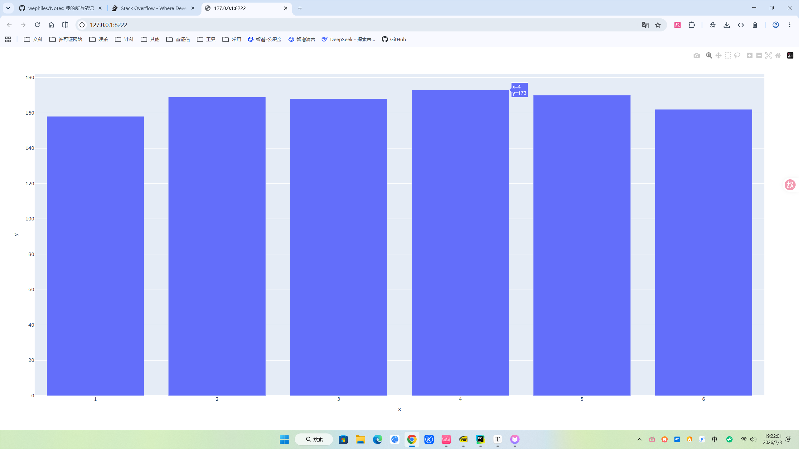

```python
import plotly.express as px

from dice import Dice

dice = Dice()

# 掷几次骰子并将结果存储到一个列表中
results = []
for roll_num in range(1000):
    result = dice.roll()
    results.append(result)

frequencies = []
poss_results = range(1, dice.num_sides + 1)
for value in poss_results:
    frequency = results.count(value)
    frequencies.append(frequency)

fig = px.scatter(x=poss_results, y=frequencies, )
fig.show()
```

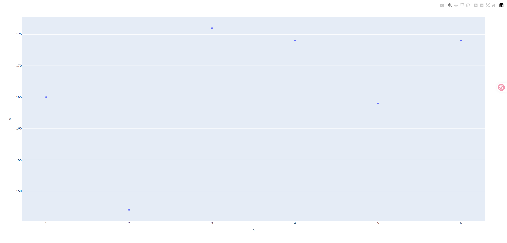

```python
import plotly.express as px

from dice import Dice

dice = Dice()

# 掷几次骰子并将结果存储到一个列表中
results = []
for roll_num in range(1000):
    result = dice.roll()
    results.append(result)

frequencies = []
poss_results = range(1, dice.num_sides + 1)
for value in poss_results:
    frequency = results.count(value)
    frequencies.append(frequency)

fig = px.line(x=poss_results, y=frequencies, )
fig.show()
```

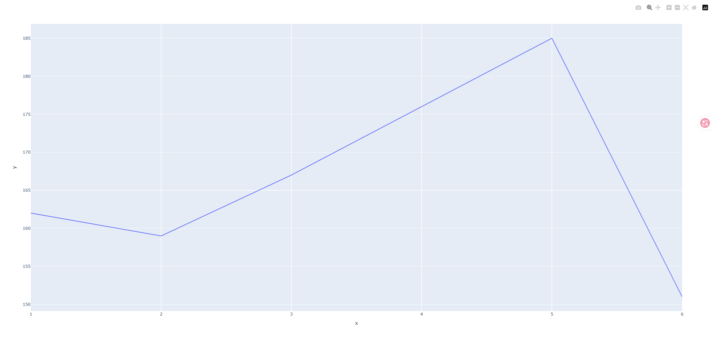

```python
import plotly.express as px

from dice import Dice

dice = Dice()

# 掷几次骰子并将结果存储到一个列表中
results = []
for roll_num in range(1000):
    result = dice.roll()
    results.append(result)

frequencies = []
poss_results = range(1, dice.num_sides + 1)
for value in poss_results:
    frequency = results.count(value)
    frequencies.append(frequency)

title = '掷 1000 次骰子的结果'
labels = {'x': '点数', 'y': '出现次数'}
fig = px.bar(x=poss_results, y=frequencies, title=title, labels=labels)

fig.show()
```

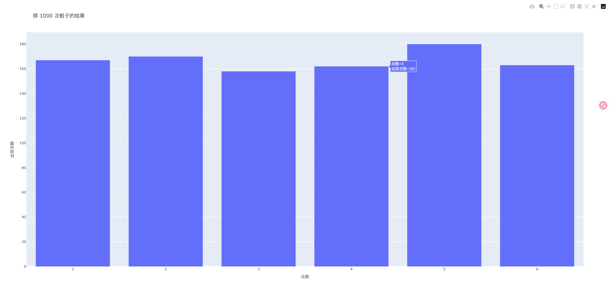

```python
import plotly.express as px

from dice import Dice

dice = Dice()
dice_1 = Dice()

# 掷几次骰子并将结果存储到一个列表中
results = []
for roll_num in range(1000):
    result = dice.roll() + dice_1.roll()
    results.append(result)

frequencies = []
max_result = dice.num_sides + dice_1.num_sides
poss_results = range(2, max_result + 1)
for value in poss_results:
    frequency = results.count(value)
    frequencies.append(frequency)

title = '掷 1000 次两枚骰子的结果'
labels = {'x': '点数', 'y': '出现次数'}
fig = px.bar(x=poss_results, y=frequencies, title=title, labels=labels)

fig.show()
```

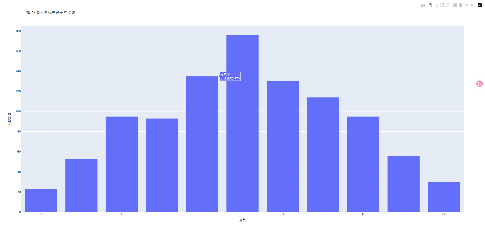

```python
import plotly.express as px

from dice import Dice

dice = Dice()
dice_1 = Dice(10)

# 掷几次骰子并将结果存储到一个列表中
results = []
for roll_num in range(50_000):
    result = dice.roll() + dice_1.roll()
    results.append(result)

frequencies = []
max_result = dice.num_sides + dice_1.num_sides
poss_results = range(2, max_result + 1)
for value in poss_results:
    frequency = results.count(value)
    frequencies.append(frequency)

title = '掷 5_000 次两枚骰子的结果'
labels = {'x': '点数', 'y': '出现次数'}
fig = px.bar(x=poss_results, y=frequencies, title=title, labels=labels)

# xaxis_dtick 指定 x 轴上刻度标记的间距
fig.update_layout(xaxis_dtick=1)
fig.show()
```

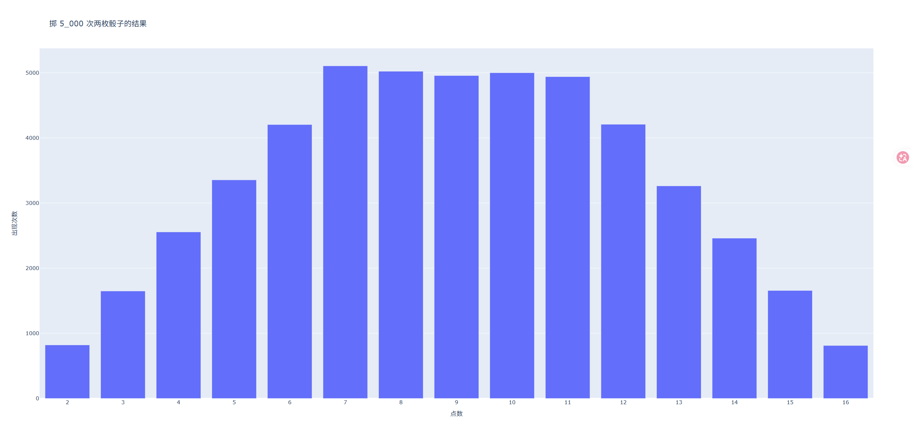

```python
import plotly.express as px

from dice import Dice

dice = Dice()
dice_1 = Dice(10)

# 掷几次骰子并将结果存储到一个列表中
results = []
for roll_num in range(50_000):
    result = dice.roll() + dice_1.roll()
    results.append(result)

frequencies = []
max_result = dice.num_sides + dice_1.num_sides
poss_results = range(2, max_result + 1)
for value in poss_results:
    frequency = results.count(value)
    frequencies.append(frequency)

title = '掷 5_000 次两枚骰子的结果'
labels = {'x': '点数', 'y': '出现次数'}
fig = px.bar(x=poss_results, y=frequencies, title=title, labels=labels)

# xaxis_dtick 指定 x 轴上刻度标记的间距
fig.update_layout(xaxis_dtick=1)
# fig.show()
fig.write_html('../dice_random_d6_d10.html')
```

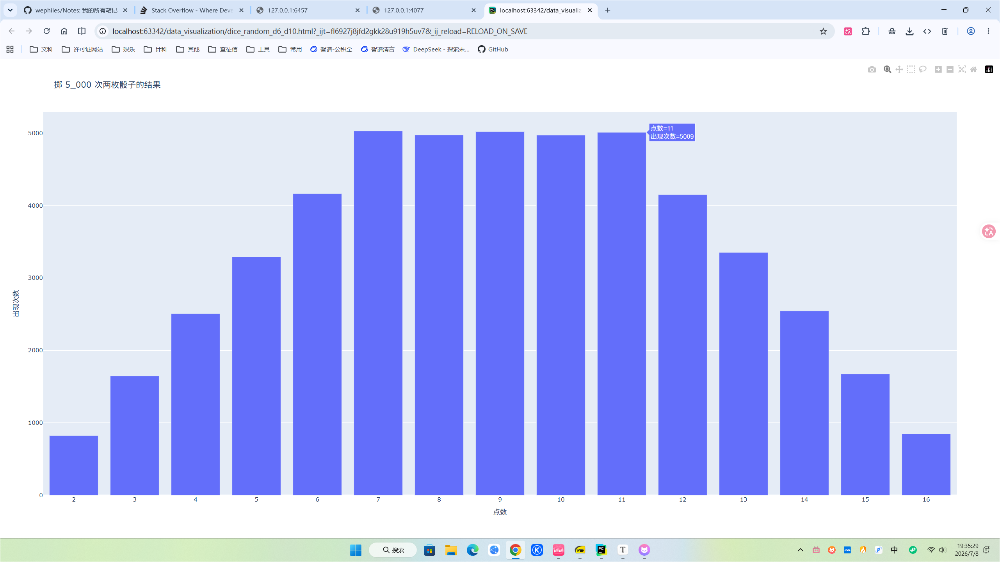

# 2. 下载数据

## 2.1 csv 格式文件

要在文本文件中存储数据，最简单的方式是将数据组织为一系列以逗号分隔的值（comma-separated values，CSV）并写入文件。这样的文件称为 CSV 文件。例如，下面是一行 CSV 格式的天气数据：

```python
"USW00025333","SITKA AIRPORT, AK US","2021-01-01",,"44","40"
```

这是美国阿拉斯加州锡特卡 2021 年 1 月 1 日的天气数据，其中包含当天的最高温度和最低温度，等等。CSV 文件阅读起来比较麻烦，但程序能够快速而准确地提取并处理其中的信息。

下载的原始数据：

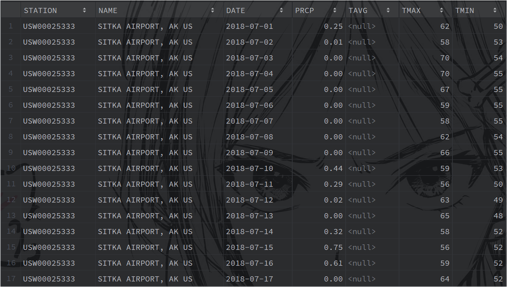

```python
from pathlib import Path
import csv

path = Path(__file__).parent.parent / 'weather_data' / 'sitka_weather_07-2018_simple.csv'
lines = path.read_text().splitlines()

reader = csv.reader(lines)
head_row = next(reader)

for index, column_header in enumerate(head_row):
    print(index, column_header)
```

输出**：**

```python
0 STATION
1 NAME
2 DATE
3 PRCP
4 TAVG
5 TMAX
6 TMIN
```

```python
from pathlib import Path
import csv

path = Path(__file__).parent.parent / 'weather_data' / 'sitka_weather_07-2018_simple.csv'
lines = path.read_text().splitlines()

reader = csv.reader(lines)
head_row = next(reader)

# 提取最高温度
highs = []

for row in reader:
    high = int(row[5])
    highs.append(high)

print(highs)
```

```python
[62, 58, 70, 70, 67, 59, 58, 62, 66, 59, 56, 63, 65, 58, 56, 59, 64, 60, 60, 61, 65, 65, 63, 59, 64, 65, 68, 66, 64, 67, 65]
```

----

### 2.1.1 补充：关于 matplotlib 显示中文乱码的问题：

#### 🚀 方案一：临时配置（最快，推荐新手）

在代码绘图前加上几行设置，简单直接，对当前脚本生效。

python

```
import matplotlib.pyplot as plt

# 核心设置：指定使用黑体 (SimHei) 显示中文
plt.rcParams['font.sans-serif'] = ['SimHei']  # Windows 通常自带
# 或者尝试 'Microsoft YaHei' (微软雅黑)

# 解决负号 '-' 显示为方块的问题
plt.rcParams['axes.unicode_minus'] = False

# ... 之后正常绘图即可
plt.title('中文标题')
plt.show()
```


> **注意**：`SimHei` 在 Windows 上很通用。如果在 macOS 或 Linux 上无效，可以尝试 `'Arial Unicode MS'`或 `'PingFang SC'`。

#### ⚙️ 方案二：永久配置（一劳永逸）

修改 Matplotlib 的配置文件，让设置对所有脚本生效。

1. **找到配置文件路径**：在 Python 中运行以下代码：

   python

   ```
   import matplotlib
   print(matplotlib.matplotlib_fname())
   ```

   

2. **修改配置文件**：用文本编辑器打开该文件，找到并修改以下行：

   ini

   ```
   font.family : sans-serif
   font.sans-serif : SimHei, Microsoft YaHei, Arial Unicode MS  # 添加中文字体
   axes.unicode_minus : False
   ```

   

   如果文件里没有这些行，可以直接在文件末尾添加。

3. **重启 Python 环境**：保存文件后，需要重启你的 Python 解释器或 Jupyter Notebook 内核才能生效。

#### 🎯 方案三：指定具体字体文件（最精准）

直接告诉 Matplotlib 使用某个具体的字体文件，结果最可控。

python

```
import matplotlib.pyplot as plt
from matplotlib.font_manager import FontProperties

# 指定字体文件路径（请根据你的系统修改）
# Windows 示例[reference:17]
font = FontProperties(fname=r'C:\Windows\Fonts\simhei.ttf') 

# macOS 示例[reference:18]
# font = FontProperties(fname='/System/Library/Fonts/PingFang.ttc')

# Linux 示例（需自行下载字体）
# font = FontProperties(fname='/usr/share/fonts/chinese/SimHei.ttf')

plt.title('中文标题', fontproperties=font)
plt.xlabel('X轴标签', fontproperties=font)
plt.show()
```


#### 🧠 方案四：自动查找可用中文字体（最智能）

让 Python 自动在系统中查找并选择一个可用的中文字体，跨平台兼容性最好。

python

```
import matplotlib.pyplot as plt
import matplotlib.font_manager as fm

# 查找系统中所有支持中文的字体[reference:19]
chinese_fonts = [f.name for f in fm.fontManager.ttflist if 'CJK' in f.name or 'SC' in f.name or '黑体' in f.name]

if chinese_fonts:
    plt.rcParams['font.sans-serif'] = [chinese_fonts[0]]  # 使用找到的第一个
    plt.rcParams['axes.unicode_minus'] = False
    print(f"正在使用字体: {chinese_fonts[0]}")
else:
    print("未找到中文字体，请安装。")

# 正常绘图...
plt.title('中文标题')
plt.show()
```


------

#### ❓ 常见问题排查

如果以上方法都无效，可以尝试以下步骤：

- **确认字体已安装**：你指定的字体必须已在操作系统中安装。比如在 Linux 服务器上，`SimHei` 可能不存在。

- **清除字体缓存**：Matplotlib 会缓存字体列表，有时需要手动清除。

  python

  ```
  import matplotlib
  print(matplotlib.get_cachedir())  # 找到缓存目录
  ```

  

  然后手动删除该目录下的所有文件，或通过命令行 `rm -rf ~/.cache/matplotlib/*` 删除。

- **检查字体名称拼写**：字体名称必须与系统严格一致。

- **重启环境**：每次修改配置或安装新字体后，务必**重启**你的 Python 环境或 Jupyter Kernel。

#### 💎 总结与建议

- **新手/临时任务**：首选 **方案一（临时配置）**，最快最直接。
- **长期项目**：推荐 **方案二（永久配置）**，一劳永逸。
- **追求稳定**：使用 **方案三（指定字体文件）**，不受环境变化影响。
- **跨平台项目**：**方案四（自动查找）** 能提供最好的兼容性。

### 2.1.2 **绘制温度图**

```python
from pathlib import Path
import csv

import matplotlib.pyplot as plt

plt.rcParams['font.sans-serif'] = ['SimHei']

path = Path(__file__).parent.parent / 'weather_data' / 'sitka_weather_07-2018_simple.csv'
lines = path.read_text().splitlines()

reader = csv.reader(lines)
head_row = next(reader)

# 提取最高温度
highs = []

for row in reader:
    high = int(row[5])
    highs.append(high)

# 根据最高温绘图
fig, ax = plt.subplots()
ax.plot(highs, color='red')

# 设置绘图格式

ax.set_title("2021 年 7 月 每日最高气温", fontsize=18)
ax.set_xlabel('日 期', fontsize=14)
ax.set_ylabel("温度 (华氏摄氏度)", fontsize=14)
ax.tick_params(labelsize=14)  # 设置刻度线

plt.show()
```

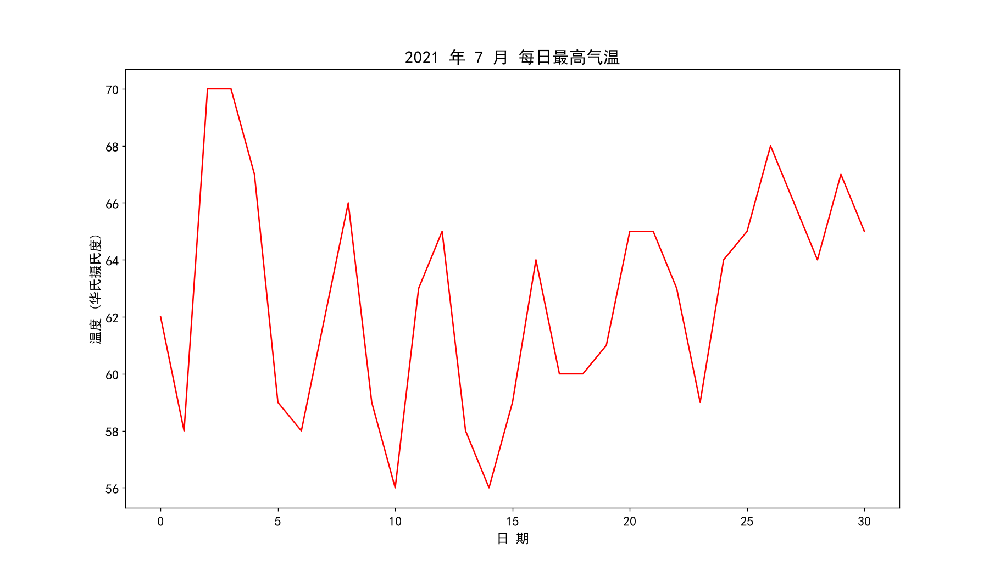

### 2.1.3 datetime 模块

`datetime` 模块中设置日期和时间格式的参数：

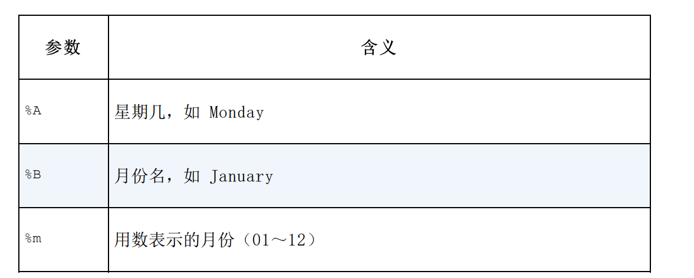

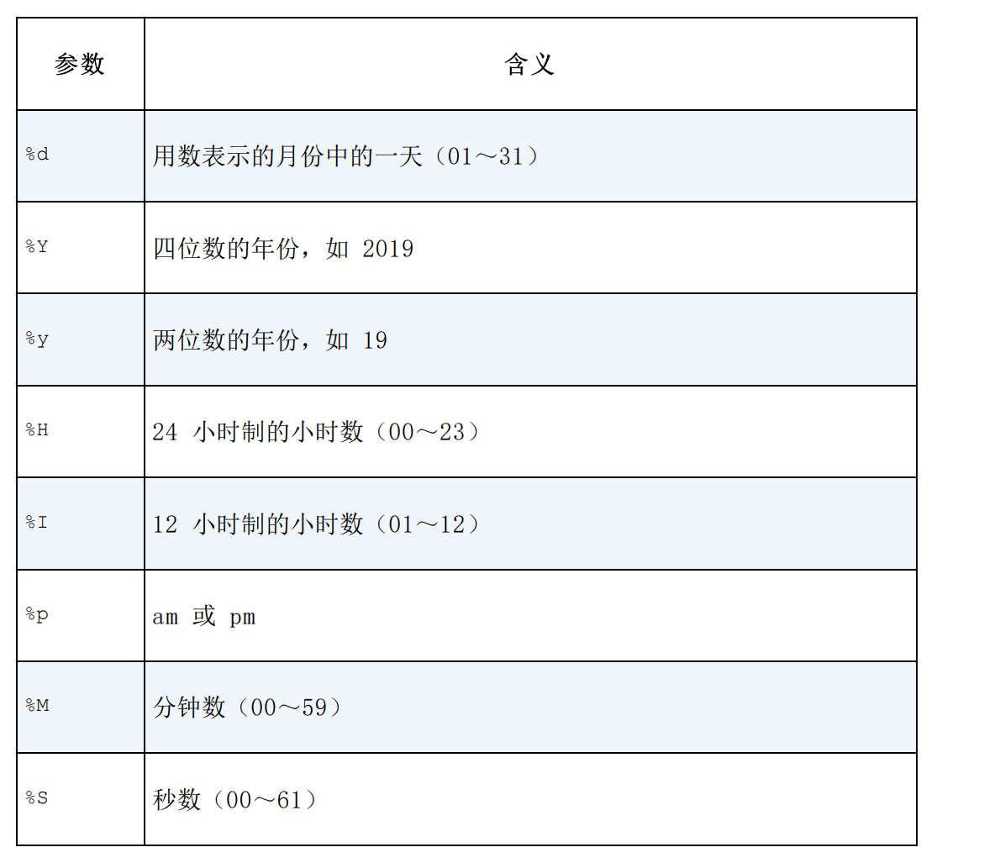

```python
import csv
from pathlib import Path
from datetime import datetime

import matplotlib.pyplot as plt

plt.rcParams['font.sans-serif'] = ['SimHei']

path = Path(__file__).parent.parent / 'weather_data' / 'sitka_weather_07-2018_simple.csv'
lines = path.read_text().splitlines()

reader = csv.reader(lines)
head_row = next(reader)

# 提取最高温度
highs = []
dates = []

for row in reader:
    high = int(row[5])
    date = datetime.strptime(row[2], '%Y-%m-%d')
    dates.append(date)
    highs.append(high)

# 根据最高温绘图
fig, ax = plt.subplots()
ax.plot(dates, highs, color='red')

# 设置绘图格式

ax.set_title("2021 年 7 月 每日最高气温", fontsize=18)

# fig.autofmt_xdate() 来绘制倾斜的日期标签，以免它们彼此重叠
ax.set_xlabel('日 期', fontsize=14)
fig.autofmt_xdate()

ax.set_ylabel("温度 (华氏摄氏度)", fontsize=14)
ax.tick_params(labelsize=14)  # 设置刻度线

plt.show()
```

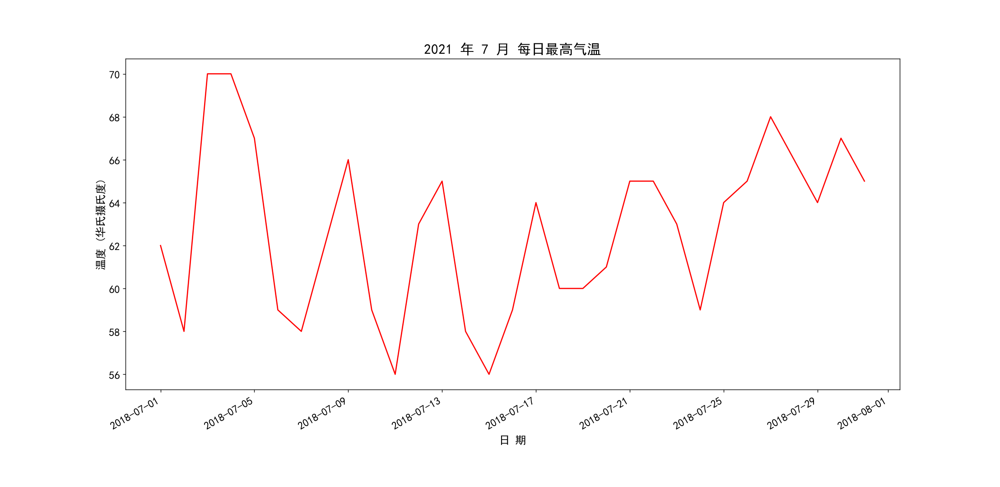

### 2.1.4 涵盖更长的时间

```python
import csv
from pathlib import Path
from datetime import datetime

import matplotlib.pyplot as plt

plt.rcParams['font.sans-serif'] = ['SimHei']

path = Path(__file__).parent.parent / 'weather_data' / 'sitka_weather_2018_simple.csv'
lines = path.read_text().splitlines()

reader = csv.reader(lines)
head_row = next(reader)

# 提取最高温度
highs = []
dates = []

for row in reader:
    high = int(row[5])
    date = datetime.strptime(row[2], '%Y-%m-%d')
    dates.append(date)
    highs.append(high)

# 根据最高温绘图
fig, ax = plt.subplots()
ax.plot(dates, highs, color='red')

# 设置绘图格式

ax.set_title("2018 年每日最高气温", fontsize=18)

# fig.autofmt_xdate() 来绘制倾斜的日期标签，以免它们彼此重叠
ax.set_xlabel('日 期', fontsize=14)
fig.autofmt_xdate()

ax.set_ylabel("温度 (华氏摄氏度)", fontsize=14)
ax.tick_params(labelsize=14)  # 设置刻度线

plt.show()
```

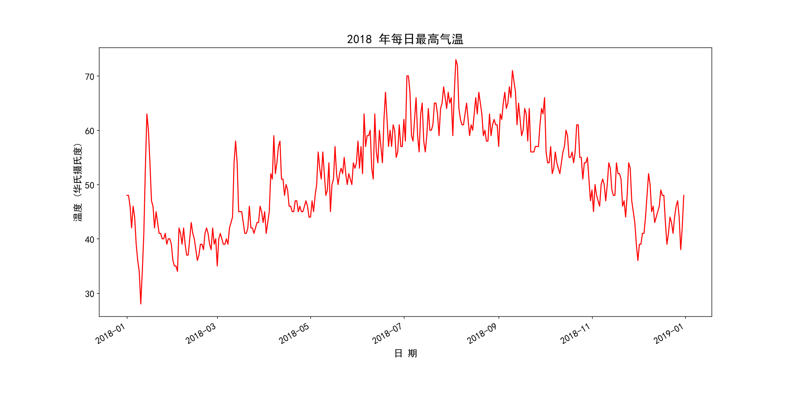

```python
import csv
from pathlib import Path
from datetime import datetime

import matplotlib.pyplot as plt

plt.rcParams['font.sans-serif'] = ['SimHei']

path = Path(__file__).parent.parent / 'weather_data' / 'sitka_weather_2018_simple.csv'
lines = path.read_text().splitlines()

reader = csv.reader(lines)
head_row = next(reader)

# 提取最高温度
highs = []
dates = []
lows = []

for row in reader:
    high = int(row[5])
    date = datetime.strptime(row[2], '%Y-%m-%d')
    low = int(row[6])

    lows.append(low)
    dates.append(date)
    highs.append(high)

# 根据最高温绘图
fig, ax = plt.subplots()
ax.plot(dates, highs, color='red')
ax.plot(dates, lows, color='blue')

# 设置绘图格式
ax.set_title("2018 年每日最高气温", fontsize=18)

# fig.autofmt_xdate() 来绘制倾斜的日期标签，以免它们彼此重叠
ax.set_xlabel('日 期', fontsize=14)
fig.autofmt_xdate()

ax.set_ylabel("温度 (华氏摄氏度)", fontsize=14)
ax.tick_params(labelsize=14)  # 设置刻度线

plt.show()
```

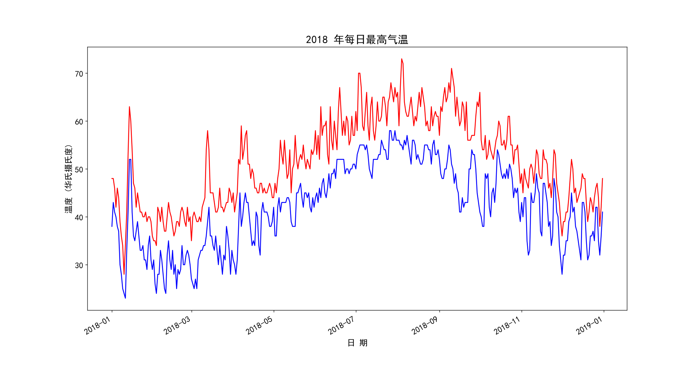

```python
import csv
from pathlib import Path
from datetime import datetime

import matplotlib.pyplot as plt

plt.rcParams['font.sans-serif'] = ['SimHei']

path = Path(__file__).parent.parent / 'weather_data' / 'sitka_weather_2018_simple.csv'
lines = path.read_text().splitlines()

reader = csv.reader(lines)
head_row = next(reader)

# 提取最高温度
highs = []
dates = []
lows = []

for row in reader:
    high = int(row[5])
    date = datetime.strptime(row[2], '%Y-%m-%d')
    low = int(row[6])

    lows.append(low)
    dates.append(date)
    highs.append(high)

# 根据最高温绘图
fig, ax = plt.subplots()
ax.plot(dates, highs, color='red')
ax.plot(dates, lows, color='blue')
ax.fill_between(dates, highs, lows, facecolor='yellow', alpha=0.1)

# 设置绘图格式
ax.set_title("2018 年每日最高气温", fontsize=18)

# fig.autofmt_xdate() 来绘制倾斜的日期标签，以免它们彼此重叠
ax.set_xlabel('日 期', fontsize=14)
fig.autofmt_xdate()

ax.set_ylabel("温度 (华氏摄氏度)", fontsize=14)
ax.tick_params(labelsize=14)  # 设置刻度线

plt.show()
```

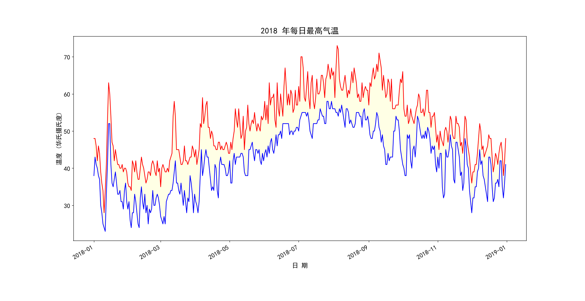

### 2.1.5 处理错误

```python
import csv
from pathlib import Path
from datetime import datetime

import matplotlib.pyplot as plt

plt.rcParams['font.sans-serif'] = ['SimHei']

path = Path(__file__).parent.parent / 'weather_data' / 'death_valley_2021_simple.csv'
lines = path.read_text().splitlines()

reader = csv.reader(lines)
head_row = next(reader)

# 提取最高温度
highs = []
dates = []
lows = []

for row in reader:
    high = int(row[3])
    date = datetime.strptime(row[2], '%Y-%m-%d')
    low = int(row[4])

    lows.append(low)
    dates.append(date)
    highs.append(high)

# 根据最高温绘图
fig, ax = plt.subplots()
ax.plot(dates, highs, color='red')
ax.plot(dates, lows, color='blue')
ax.fill_between(dates, highs, lows, facecolor='yellow', alpha=0.1)

# 设置绘图格式
ax.set_title("2018 年每日最高气温", fontsize=18)

# fig.autofmt_xdate() 来绘制倾斜的日期标签，以免它们彼此重叠
ax.set_xlabel('日 期', fontsize=14)
fig.autofmt_xdate()

ax.set_ylabel("温度 (华氏摄氏度)", fontsize=14)
ax.tick_params(labelsize=14)  # 设置刻度线

plt.show()
```

运行上述代码的时候报错：
```python
Traceback (most recent call last):
  File "E:\Code\PyProjects\Demos\data_visualization\src\valley_highs_lows.py", line 38, in <module>
    high = int(row[3])
           ^^^^^^^^^^^
ValueError: invalid literal for int() with base 10: ''
```

原因是在源文件中有一些数据是空的：

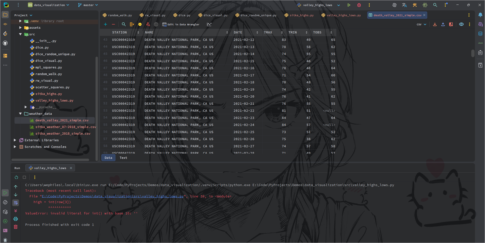

```python
import csv
from pathlib import Path
from datetime import datetime

import matplotlib.pyplot as plt

plt.rcParams['font.sans-serif'] = ['SimHei']

path = Path(__file__).parent.parent / 'weather_data' / 'death_valley_2021_simple.csv'
lines = path.read_text().splitlines()

reader = csv.reader(lines)
head_row = next(reader)

# 提取最高温度
highs = []
dates = []
lows = []

for row in reader:
    try:
        high = int(row[3])
        date = datetime.strptime(row[2], '%Y-%m-%d')
        low = int(row[4])
    except ValueError:
        print(f'当前行缺少数据: {row}')
    else:
        lows.append(low)
        dates.append(date)
        highs.append(high)

# 根据最高温绘图
fig, ax = plt.subplots()
ax.plot(dates, highs, color='red')
ax.plot(dates, lows, color='blue')
ax.fill_between(dates, highs, lows, facecolor='yellow', alpha=0.1)

# 设置绘图格式
ax.set_title("2018 年每日最高气温", fontsize=18)

# fig.autofmt_xdate() 来绘制倾斜的日期标签，以免它们彼此重叠
ax.set_xlabel('日 期', fontsize=14)
fig.autofmt_xdate()

ax.set_ylabel("温度 (华氏摄氏度)", fontsize=14)
ax.tick_params(labelsize=14)  # 设置刻度线

plt.show()
```

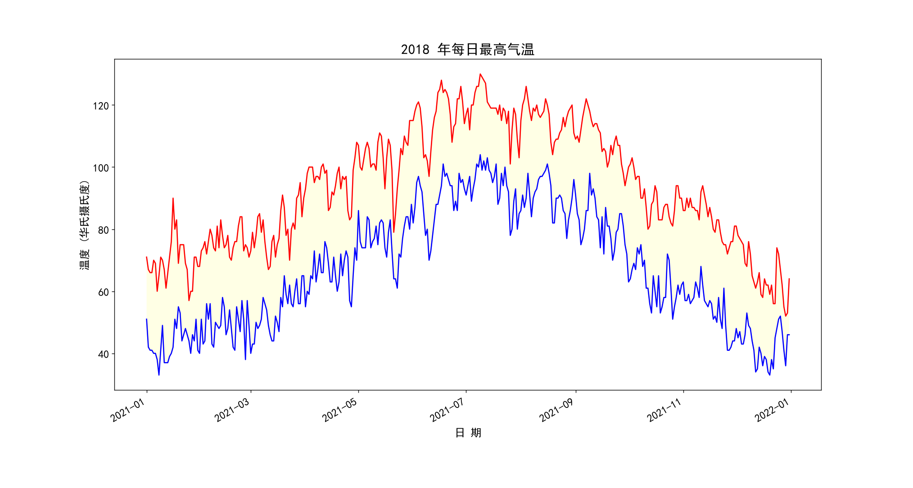

## 2.2 制作全球地震散点图

本节将首先下载一个数据集，其中记录了一个月内全球发生的所有地 震，然后制作一幅散点图，展示这些地震的位置和震级。这些数据是 以 GeoJSON 格式（基于 JSON 的地理空间信息数据交换格式）存储 的，因此要使用 json 模块来处理。我们将使用 Plotly 来创建图 形，清楚地指出全球的地震分布情况。

### 2.2.1 补充 - 序列化/反序列化

- 序列化: `object -> string`
- 反序列化: `string -> object`

### 2.2.2 画图

```python
from pathlib import Path
import json

# 将数据作为字符串读取并反序列化为 Python 对象
path = Path(__file__).parent.parent / 'eq_data' / 'eq_data_1_day_m1.geojson'

contents = path.read_text()

all_data = json.loads(contents)

# 将数据文件转化为更易于阅读的格式
new_path = Path(__file__).parent.parent / 'eq_data' / 'readable_eq_data_1_day_m1.geojson'
readable_data = json.dumps(all_data, indent=4)
new_path.write_text(readable_data)
```


主要关注：

- "mag" -- 地震强度
- "title" -- 地震的震级和位置
- "geometry" -- 地震发生在什么地方
- "coordinates" -- 地震发生位置的经度）和纬度

注意：在说到位置时，通常先说纬度再说经度，这种习惯形成的 原因可能是人类先发现了纬度，很久后才有经度的概念。然而， 很多地质学框架会先列出经度后列出纬度，因为这与数学约定(x, y)一致。`GeoJSON` 格式遵循(经度,纬度)的约定，但在使用其他框 架时，遵循相应的约定很重要。

```python
from pathlib import Path
import json

import plotly.express as px

# 将数据作为字符串读取并反序列化为 Python 对象
path = Path(__file__).parent.parent / 'eq_data' / 'eq_data_1_day_m1.geojson'

contents = path.read_text()

all_data = json.loads(contents)

# 查看数据集中的所有地震
all_eq_dicts = all_data['features']

# 提取震级等数据
mags, titles, lons, lats = [], [], [], []
for eq_dict in all_eq_dicts:
    mag = eq_dict['properties']['mag']
    lon = eq_dict['geometry']['coordinates'][0]
    lat = eq_dict['geometry']['coordinates'][1]
    title = eq_dict['properties']['title']
    mags.append(mag)
    titles.append(title)
    lons.append(lon)
    lats.append(lat)

# 绘制地震散点图
fig = px.scatter(
    x=lons,
    y=lats,
    labels={'x': '经度', 'y': '纬度'},
    range_x=[-200, 200],
    range_y=[-90, 90],
    width=800,
    height=800,
    title='全球地震散点图'
)

fig.write_html('../global_eq_scatter.html')
fig.show()
```


### 2.2.3 指定数据的另一种方式

```python
from pathlib import Path
import json

import pandas as pd
import plotly.express as px

# 将数据作为字符串读取并反序列化为 Python 对象
path = Path(__file__).parent.parent / 'eq_data' / 'eq_data_1_day_m1.geojson'

contents = path.read_text()

all_data = json.loads(contents)

# 查看数据集中的所有地震
all_eq_dicts = all_data['features']

# 提取震级等数据
mags, titles, lons, lats = [], [], [], []
for eq_dict in all_eq_dicts:
    mag = eq_dict['properties']['mag']
    lon = eq_dict['geometry']['coordinates'][0]
    lat = eq_dict['geometry']['coordinates'][1]
    title = eq_dict['properties']['title']
    mags.append(mag)
    titles.append(title)
    lons.append(lon)
    lats.append(lat)

data = pd.DataFrame(zip(lons, lats, titles, mags, ), columns=['经度', '纬度', '位置', '震级'])

# 绘制地震散点图
fig = px.scatter(
    data,
    x='经度',
    y='纬度',
    labels={'x': '经度', 'y': '纬度'},
    range_x=[-200, 200],
    range_y=[-90, 90],
    width=800,
    height=800,
    title='全球地震散点图'
)

fig.write_html('../global_eq_scatter.html')
fig.show()
```

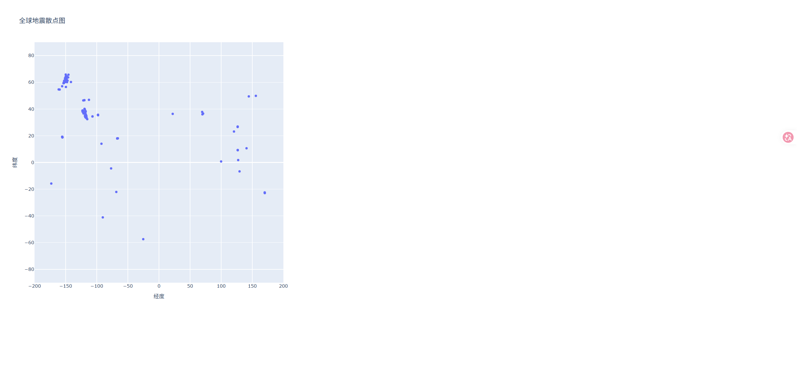

### 2.2.4 定制标记的尺寸

```python
from pathlib import Path
import json

import pandas as pd
import plotly.express as px

# 将数据作为字符串读取并反序列化为 Python 对象
path = Path(__file__).parent.parent / 'eq_data' / 'eq_data_1_day_m1.geojson'


contents = path.read_text()

all_data = json.loads(contents)

# 查看数据集中的所有地震
all_eq_dicts = all_data['features']

# 提取震级等数据
mags, titles, lons, lats = [], [], [], []
for eq_dict in all_eq_dicts:
    mag = eq_dict['properties']['mag']
    lon = eq_dict['geometry']['coordinates'][0]
    lat = eq_dict['geometry']['coordinates'][1]
    title = eq_dict['properties']['title']
    mags.append(mag)
    titles.append(title)
    lons.append(lon)
    lats.append(lat)

data = pd.DataFrame(zip(lons, lats, titles, mags, ), columns=['经度', '纬度', '位置', '震级'])

# 绘制地震散点图
fig = px.scatter(
    data,
    x='经度',
    y='纬度',
    labels={'x': '经度', 'y': '纬度'},
    range_x=[-200, 200],
    range_y=[-90, 90],
    width=800,
    height=800,
    title='全球地震散点图',
    size='震级',
    size_max=10,
)

fig.write_html('../global_eq_scatter.html')
fig.show()
```


```python
from pathlib import Path
import json

import pandas as pd
import plotly.express as px

# 将数据作为字符串读取并反序列化为 Python 对象
path = Path(__file__).parent.parent / 'eq_data' / 'eq_data_30_day_m1.geojson'

try:
    contents = path.read_text()
except Exception as _:
    contents = path.read_text(encoding='utf-8')

all_data = json.loads(contents)

# 查看数据集中的所有地震
all_eq_dicts = all_data['features']

# 提取震级等数据
mags, titles, lons, lats = [], [], [], []
for eq_dict in all_eq_dicts:
    mag = eq_dict['properties']['mag']
    lon = eq_dict['geometry']['coordinates'][0]
    lat = eq_dict['geometry']['coordinates'][1]
    title = eq_dict['properties']['title']
    mags.append(mag)
    titles.append(title)
    lons.append(lon)
    lats.append(lat)

data = pd.DataFrame(zip(lons, lats, titles, mags, ), columns=['经度', '纬度', '位置', '震级'])

# 绘制地震散点图
fig = px.scatter(
    data,
    x='经度',
    y='纬度',
    labels={'x': '经度', 'y': '纬度'},
    range_x=[-200, 200],
    range_y=[-90, 90],
    width=800,
    height=800,
    title='全球地震散点图',
    size='震级',
    size_max=10,
    color='震级'
)

fig.write_html('../global_eq_scatter.html')
fig.show()
```

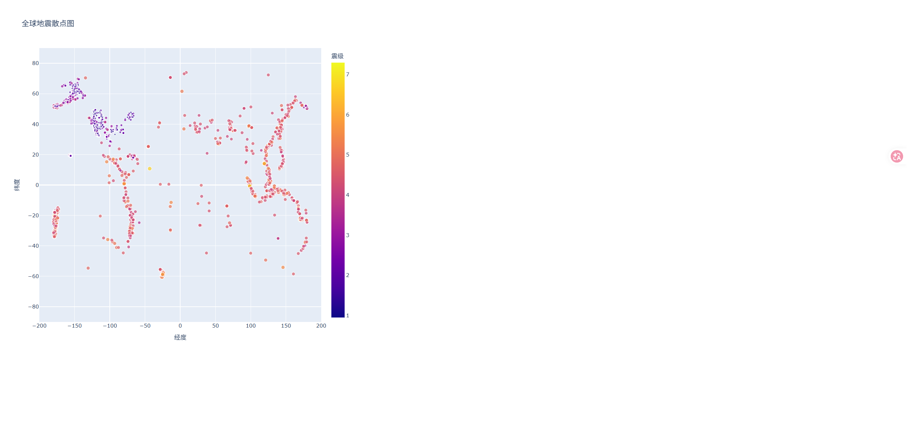

### 2.2.5 其他渐变

Plotly Express 有大量的渐变可供选择。要知道有哪些渐变可供使 用，可在 Python 终端会话中执行下面两行代码： 

```bash
>>> import plotly.express as px 
>>> px.colors.named_colorscales() 
['aggrnyl', 'agsunset', 'blackbody', ..., 'mygbm'] 
```

### 2.2.6 添加悬停文本

为了完成这幅散点图的绘制，我们将添加一些说明性文本，在你将鼠 标指向表示地震的标记时显示出来。除了默认显示的经度和纬度以 外，这还将显示震级以及地震的大致位置：

```python
from pathlib import Path
import json

import pandas as pd
import plotly.express as px

# 将数据作为字符串读取并反序列化为 Python 对象
path = Path(__file__).parent.parent / 'eq_data' / 'eq_data_30_day_m1.geojson'

try:
    contents = path.read_text()
except Exception as _:
    contents = path.read_text(encoding='utf-8')

all_data = json.loads(contents)

# 查看数据集中的所有地震
all_eq_dicts = all_data['features']

# 提取震级等数据
mags, titles, lons, lats = [], [], [], []
for eq_dict in all_eq_dicts:
    mag = eq_dict['properties']['mag']
    lon = eq_dict['geometry']['coordinates'][0]
    lat = eq_dict['geometry']['coordinates'][1]
    title = eq_dict['properties']['title']
    mags.append(mag)
    titles.append(title)
    lons.append(lon)
    lats.append(lat)

data = pd.DataFrame(zip(lons, lats, titles, mags, ), columns=['经度', '纬度', '位置', '震级'])

# 绘制地震散点图
fig = px.scatter(
    data,
    x='经度',
    y='纬度',
    labels={'x': '经度', 'y': '纬度'},
    range_x=[-200, 200],
    range_y=[-90, 90],
    width=800,
    height=800,
    title='全球地震散点图',
    size='震级',
    size_max=10,
    color='震级',
    hover_name='位置'
)

fig.write_html('../global_eq_scatter.html')
fig.show()
```

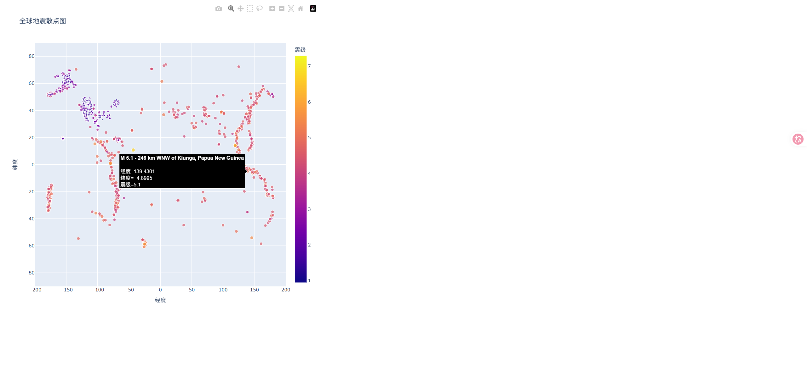


