<h1 style="text-align: center;">数据可视化</h1>

# 1. 生成数据

## 1.1 绘制简单的折线图

### 1.1.1 折线图

```python
# mpl_squares.py
import matplotlib.pyplot as plt

squares = [1, 4, 9, 16, 25]
# fig 表示由生成的一系列绘图构成的整个图形。
# ax 表示图形中的绘图，在大多数情况下，使用这个变量来定义和定制绘图。

fig, ax = plt.subplots()

ax.plot(squares)

plt.show()
```

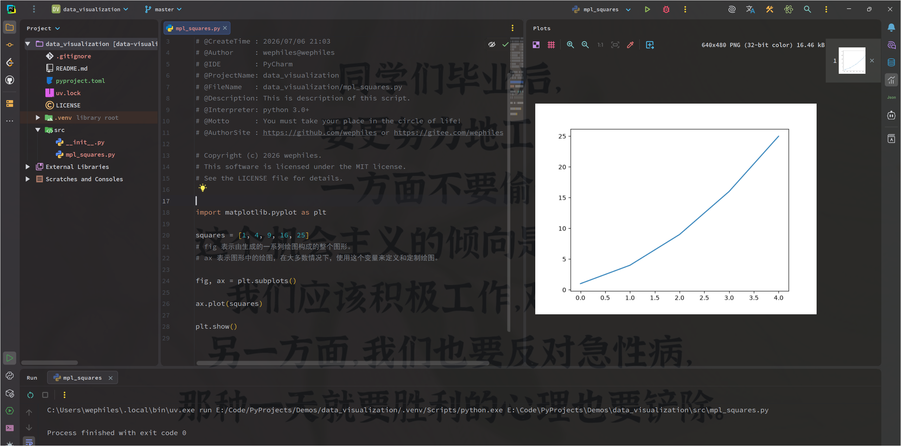

```python
# mpl_squares.py

import matplotlib.pyplot as plt

squares = [1, 4, 9, 16, 25]
# fig 表示由生成的一系列绘图构成的整个图形。
# ax 表示图形中的绘图，在大多数情况下，使用这个变量来定义和定制绘图。

fig, ax = plt.subplots()

# linewidth 决定了 plot() 绘制的线条的粗细
ax.plot(squares, linewidth=3)

# 设置图题并给坐标轴加上标签
# set_title 指定图表的标题
ax.set_title('Square numbers', fontsize=23)

# 为 x 和 y 轴设置标题
ax.set_xlabel('Value', fontsize=18)
ax.set_ylabel('Square of nums', fontsize=18)

# tick_params() 方法设置刻度标记的样式，它在这里将两条轴上的刻度标记的字号都设置为 10
ax.tick_params(labelsize=10)

plt.show()

```

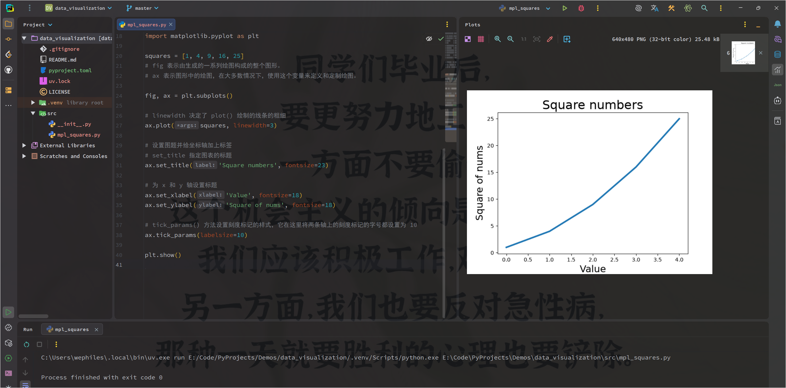

我们发现上述4.0 对应的是25，这显然是不正确的。修改代码：

```python
# mpl_squares.py

import matplotlib.pyplot as plt


input_values = [1, 2, 3, 4, 5]  # == 增加一个输入数组 ==

squares = [1, 4, 9, 16, 25]
# fig 表示由生成的一系列绘图构成的整个图形。
# ax 表示图形中的绘图，在大多数情况下，使用这个变量来定义和定制绘图。

fig, ax = plt.subplots()

# linewidth 决定了 plot() 绘制的线条的粗细
ax.plot(input_values, squares, linewidth=3)  # == 将输入数组传入 plot 的第一个参数 ==

# ====================== 下面的代码不变 ======================
# 设置图题并给坐标轴加上标签
# set_title 指定图表的标题
ax.set_title('Square numbers', fontsize=23)

# 为 x 和 y 轴设置标题
ax.set_xlabel('Value', fontsize=18)
ax.set_ylabel('Square of nums', fontsize=18)

# tick_params() 方法设置刻度标记的样式，它在这里将两条轴上的刻度标记的字号都设置为 10
ax.tick_params(labelsize=10)

plt.show()
```

### 1.1.2 **使用内置样式：**

Matplotlib 提供了很多已定义好的样式，这些样式包含默认的背景色、网格线、线条粗细、字体、字号等设置，让你无须做太多定制就能生成引人瞩目的可视化效果。要看到能在你的系统中使用的所有样式，可在终端会话中执行如下命令：

```python
>>> import matplotlib.pyplot as plt
>>> plt.style.available
```

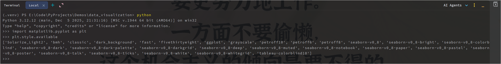

使用上述样式：

```python
# mpl_squares.py

import matplotlib.pyplot as plt

input_values = [1, 2, 3, 4, 5]
squares = [1, 4, 9, 16, 25]
# fig 表示由生成的一系列绘图构成的整个图形。
# ax 表示图形中的绘图，在大多数情况下，使用这个变量来定义和定制绘图。

# ======================= 看这里 ======================
# 应用 matplotlib 的内置样式
plt.style.use('seaborn-v0_8')
# ====================================================

fig, ax = plt.subplots()

# linewidth 决定了 plot() 绘制的线条的粗细
ax.plot(input_values, squares, linewidth=3)

# 设置图题并给坐标轴加上标签
# set_title 指定图表的标题
ax.set_title('Square numbers', fontsize=23)

# 为 x 和 y 轴设置标题
ax.set_xlabel('Value', fontsize=18)
ax.set_ylabel('Square of nums', fontsize=18)

# tick_params() 方法设置刻度标记的样式，它在这里将两条轴上的刻度标记的字号都设置为 10
ax.tick_params(labelsize=10)

plt.show()

```

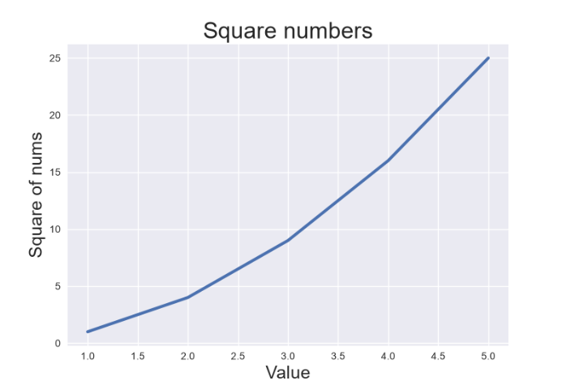

```python
# mpl_squares.py

import matplotlib.pyplot as plt

print(plt.style.available)

input_values = [1, 2, 3, 4, 5]
squares = [1, 4, 9, 16, 25]
# fig 表示由生成的一系列绘图构成的整个图形。
# ax 表示图形中的绘图，在大多数情况下，使用这个变量来定义和定制绘图。

# 应用 matplotlib 的内置样式
# plt.style.use('seaborn-v0_8')
plt.style.use('Solarize_Light2')

fig, ax = plt.subplots()

# linewidth 决定了 plot() 绘制的线条的粗细
ax.plot(input_values, squares, linewidth=3)

# 设置图题并给坐标轴加上标签
# set_title 指定图表的标题
ax.set_title('Square numbers', fontsize=23)

# 为 x 和 y 轴设置标题
ax.set_xlabel('Value', fontsize=18)
ax.set_ylabel('Square of nums', fontsize=18)

# tick_params() 方法设置刻度标记的样式，它在这里将两条轴上的刻度标记的字号都设置为 10
ax.tick_params(labelsize=10)

plt.show()
```

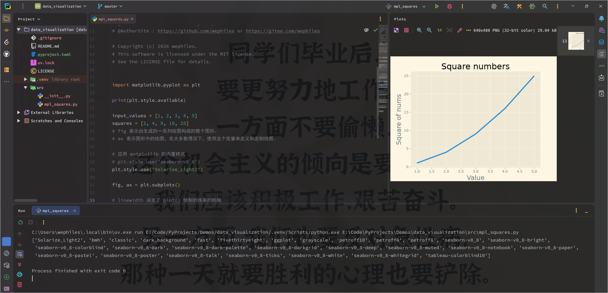

## 1.2 绘制简单的散点图

### 1.2.1 **使用 scatter() 绘制散点图并设置样式**

有时候，需要绘制散点图并设置各个数据点的样式。例如，你可能想用一种颜色显示较小的值，用另一种颜色显示较大的值。在绘制大型数据集时，还可先对每个点都设置同样的样式，再使用不同的样式重新绘制某些点，以示突出。

要绘制单个点，可使用 scatter() 方法，并向它传递该点的 x 坐标值和 y 坐标值：

```python
# scatter_squares.py

import matplotlib.pyplot as plt

plt.style.use('Solarize_Light2')

fig, ax = plt.subplots()
ax.scatter(2, 4)

plt.show()
```

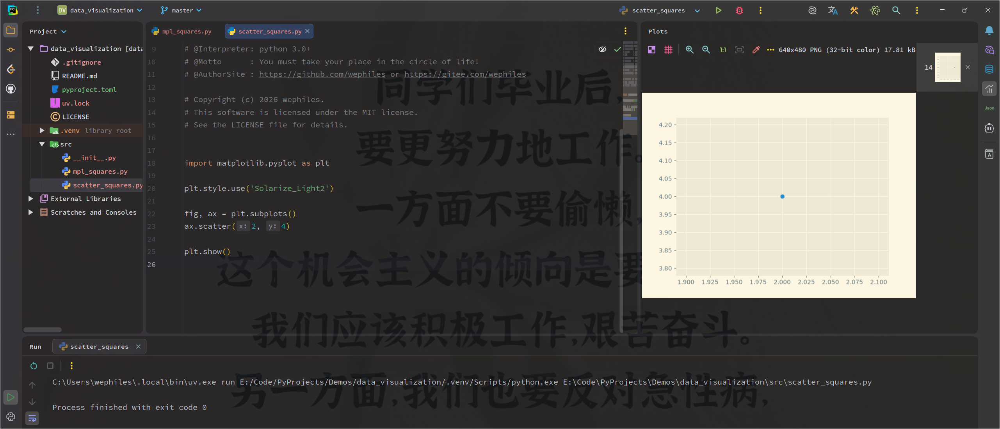

```python
# scatter_squares.py

import matplotlib.pyplot as plt

plt.style.use('Solarize_Light2')

fig, ax = plt.subplots()
# s 设置绘图时使用的点的尺寸
ax.scatter(2, 4, s=200)

# 设置标题并加上标签
ax.set_title('Square numbers', fontsize=24)
ax.set_xlabel('Value', fontsize=10)
ax.set_ylabel('Square of values', fontsize=10)

# 设置刻度标记的样式
ax.tick_params(labelsize=10)

plt.show()
```

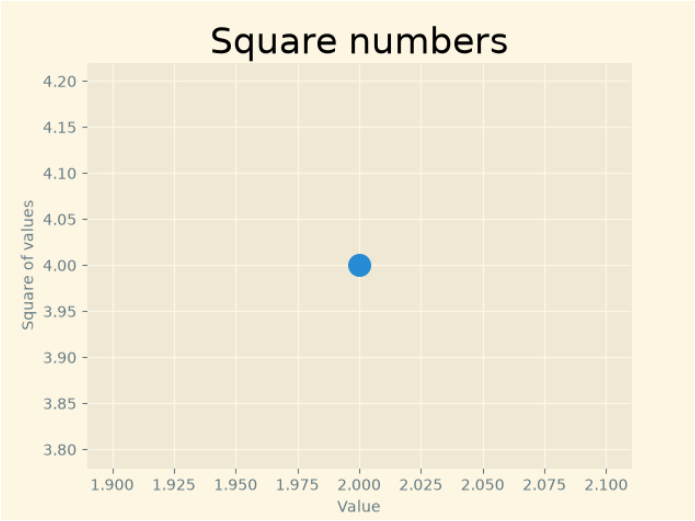

### 1.2.2 **使用 scatter 绘制一系列点** 

```python
# scatter_squares.py

import matplotlib.pyplot as plt

x_values = [1, 2, 3, 4, 5]
y_values = [1, 4, 9, 16, 25]

plt.style.use('Solarize_Light2')

fig, ax = plt.subplots()
# s 设置绘图时使用的点的尺寸
ax.scatter(x_values, y_values, s=100)

# 设置标题并加上标签
ax.set_title('Square numbers', fontsize=24)
ax.set_xlabel('Value', fontsize=10)
ax.set_ylabel('Square of values', fontsize=10)

# 设置刻度标记的样式
ax.tick_params(labelsize=10)

plt.show()
```

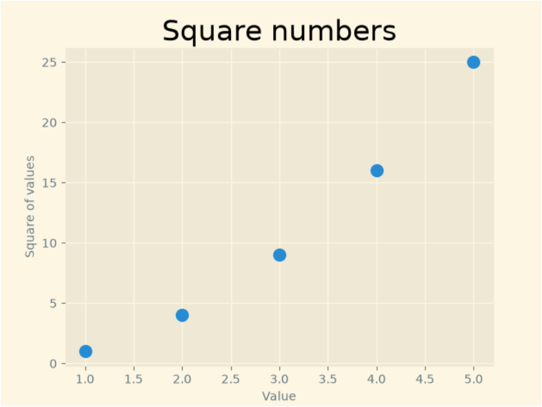

### 1.2.3 **自动计算数据**

```python
# scatter_aquares.py

import matplotlib.pyplot as plt

x_values = [1, 2, 3, 4, 5]
y_values = [i ** 2 for i in x_values]

plt.style.use('Solarize_Light2')

fig, ax = plt.subplots()
# s 设置绘图时使用的点的尺寸
ax.scatter(x_values, y_values, s=100)

# 设置标题并加上标签
ax.set_title('Square numbers', fontsize=24)
ax.set_xlabel('Value', fontsize=10)
ax.set_ylabel('Square of values', fontsize=10)

# 设置刻度标记的样式
ax.tick_params(labelsize=10)

plt.show()
```

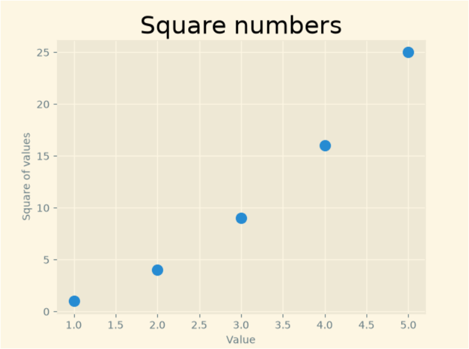

绘制 1000 个点

```python
# scatter_aquares.py

import matplotlib.pyplot as plt

x_values = range(1, 1001)
y_values = [i ** 2 for i in x_values]

plt.style.use('Solarize_Light2')

fig, ax = plt.subplots()
# s 设置绘图时使用的点的尺寸
ax.scatter(x_values, y_values, s=10)

# 设置标题并加上标签
ax.set_title('Square numbers', fontsize=24)
ax.set_xlabel('Value', fontsize=10)
ax.set_ylabel('Square of values', fontsize=10)

# 设置刻度标记的样式
ax.tick_params(labelsize=10)

# axis() 方法指定每个坐标轴的取值范围
# axis() 方法要求提供四个值：x轴和 y 轴各自的最小值和最大值。
# 这里将 x 轴的取值范围设置为 0～1100，将 y 轴的取值范围设置为 0～1 100 000

ax.axis((0, 1100, 0, 1_100_000))
plt.show()
```

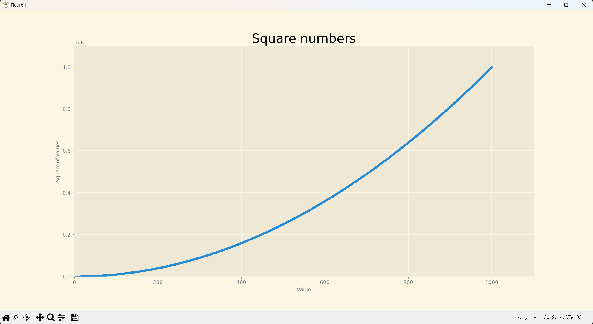

### 1.2.4 **定制刻度标记**

在刻度标记表示的数足够大时，Matplotlib 将默认使用科学记数法。这通常是好事，因为如果使用常规表示法，很大的数将占据很多内存。

几乎每个图形元素都是可定制的，如果你愿意，可让 Matplotlib 始终使用常规表示法：

```python
# scatter_aquares.py

import matplotlib.pyplot as plt

...
ax.axis((0, 1100, 0, 1_100_000))

ax.ticklabel_format(style='plain')  # == 看这里 ==

plt.show()
```

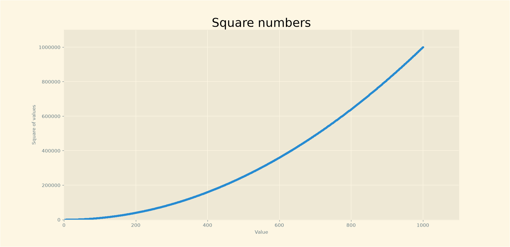

### 1.2.5 **定制颜色**

```python
ax.scatter(x_values, y_values, color='yellow', s=10)
```

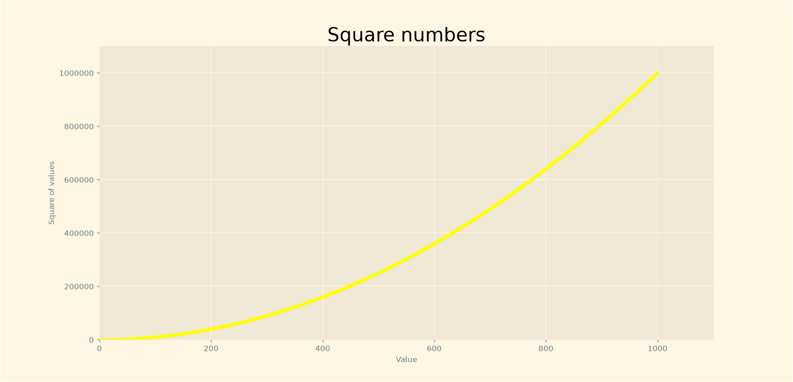

```python
ax.scatter(x_values, y_values, s=10, color='black')
```

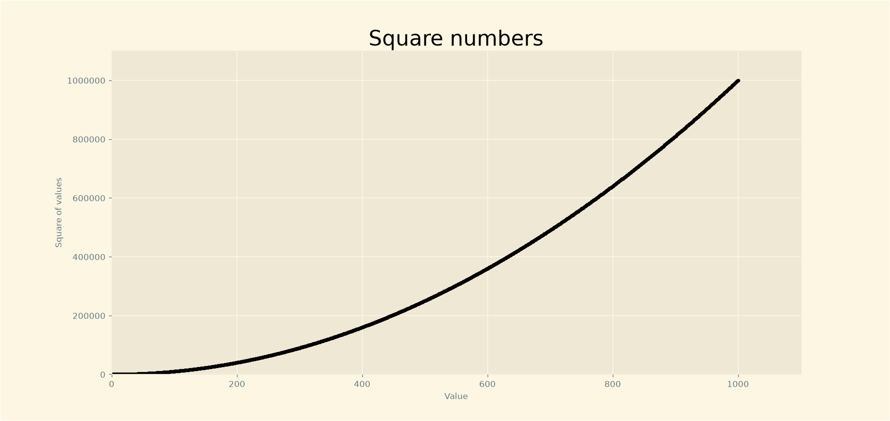

```python
# 还可以使用 RGB 颜色模式定制颜色。此时传递参数 color，并将其设置为一个元组，
# 其中包含三个 0～1 的浮点数，分别表示红色、绿色和蓝色分量。
ax.scatter(x_values, y_values, s=10, color=(0, 0.8, 0))
```

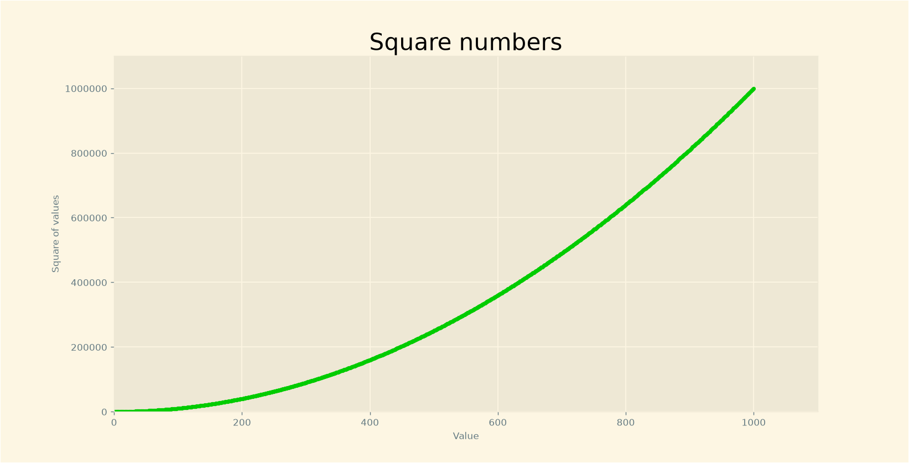

### 1.2.6 **使用颜色映射**

**颜色映射**（colormap）是一个从起始颜色渐变到结束颜色的颜色序列。在可视化中，颜色映射用于突出数据的规律。例如，你可能用较浅的颜色来显示较小的值，使用较深的颜色来显示较大的值。使用颜色映射，可根据精心设计的色标（color scale）准确地设置所有点的颜色。

pyplot 模块内置了一组颜色映射。要使用这些颜色映射，需要告诉pyplot 该如何设置数据集中每个点的颜色。下面演示了如何根据每个点的 y 坐标值来设置其颜色：

```python
# 参数 c 类似于参数 color，但用于将一系列值关联到颜色映射。
# 这里将参数 c 设置成了一个 y 坐标值列表，并使用参数 cmap 告诉pyplot 使用哪个颜色映射。
# 这些代码将 y 坐标值较小的点显示为浅蓝色，将 y 坐标值较大的点显示为深蓝色
ax.scatter(x_values, y_values, c=y_values, cmap=plt.cm.Blues, s=10)
```

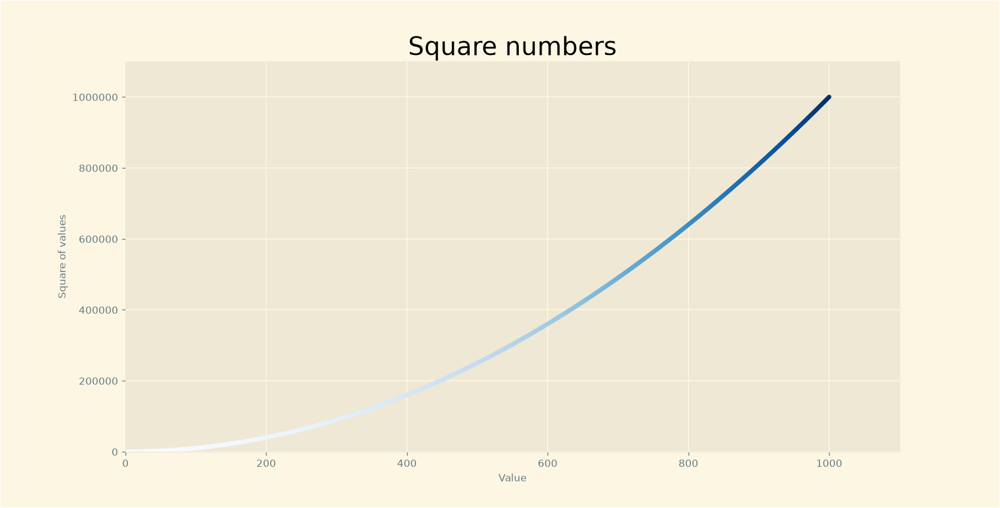

> [!Note]
>
>  注意：要了解 `pyplot` 中所有的颜色映射，请访问 `Matplotlib` 主页并单击 `Documentation`。在 `Learning resources` 部分找到 `Tutorials` 并单击其中的 `Introductory tutorials`，向下滚动到 `Colors`，再单击 `Choosing Colormaps in Matplotlib`。

## 1.3 自动保存绘图

如果要将绘图保存到文件中，而不是在 Matplotlib 查看器中显示它，可将 plt.show() 替换为 plt.savefig()：

```python
save_path = Path(__file__).parent.parent / 'assets' / 'my_scatter.png'

# 第二个实参指定将绘图多余的空白区域裁剪掉。
# 如果要保留绘图周围多余的空白区域，只需省略这个实参即可。
# 你还可以在调用 savefig() 时使用 Path 对象，将输出文件存储到系统上的任何地方。
plt.savefig(save_path, bbox_inches='tight')
```

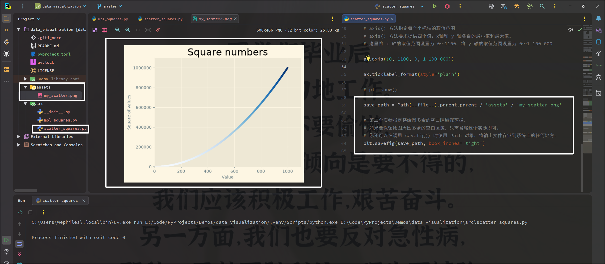

## 1.4 随机数据

### 1.4.1 产生随机坐标的模块

```python
# 产生随机坐标的模块

from random import choice


class RandomWalk:
    """一个生成随机游走数据的类"""

    def __init__(self, num_points: int = 5000):
        """初始化随机游走的属性"""
        self.num_points = num_points

        # 所有随机游走都始于 (0, 0)
        self.values_x = [0]
        self.values_y = [0]

    def fill_walk(self):
        """计算包含随机游走的所有点"""

        # 不断游走, 直到列表到达指定的长度
        while len(self.values_x) < self.num_points:
            # 决定前进的方向和在这个方向前进的距离
            x_directions = choice([1, -1])
            x_distance = choice([0, 1, 2, 3, 4])
            x_step = x_directions * x_distance

            y_directions = choice([1, -1])
            y_distance = choice([0, 1, 2, 3, 4])
            y_step = y_directions * y_distance

            # 去掉在原点的数据
            if x_step == 0 and y_step == 0:
                continue

            # 计算下一个点的坐标
            x = self.values_x[-1] + x_step
            y = self.values_y[-1] + y_step

            self.values_x.append(x)
            self.values_y.append(y)
```

-----

### 1.4.2 一些示例

```python
from matplotlib import pyplot as plt

from random_walk import RandomWalk

# 创造数据

rw = RandomWalk()
rw.fill_walk()

fig, ax = plt.subplots()
ax.plot(rw.values_x, rw.values_y, linewidth=2, color='black')

plt.show()
```

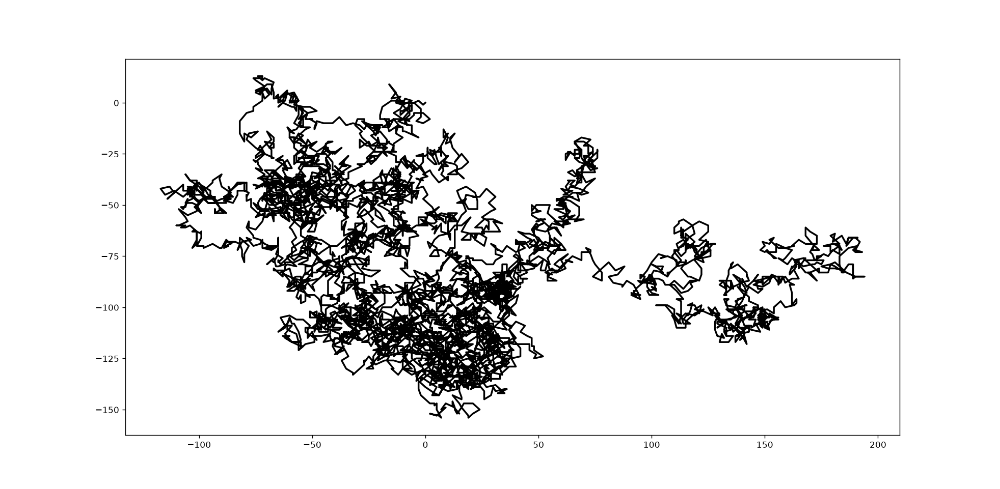

```python
from matplotlib import pyplot as plt

from random_walk import RandomWalk

# 创造数据

rw = RandomWalk()
rw.fill_walk()

fig, ax = plt.subplots()
# ax.plot(rw.values_x, rw.values_y, linewidth=2, color='black')
ax.scatter(rw.values_x, rw.values_y, c='red', s=10)

# 默认情况下，Matplotlib 独立地缩放每个轴，而这将水平或垂直拉伸绘图
# 而 set_aspect('equal') 指定两条轴上刻度的间距必须相等
ax.set_aspect('equal')

plt.show()
```

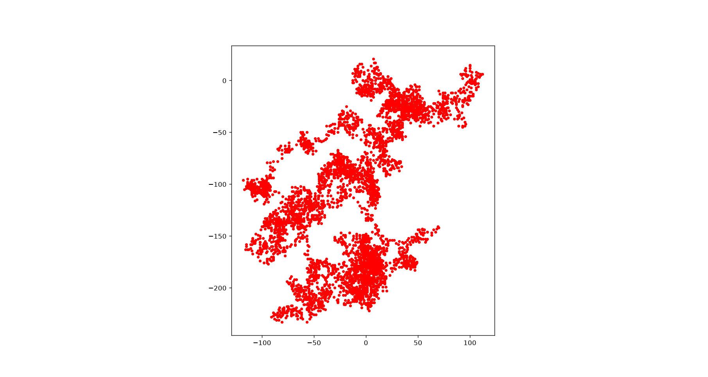

```python
from matplotlib import pyplot as plt

from random_walk import RandomWalk

# 创造数据

rw = RandomWalk()
rw.fill_walk()

fig, ax = plt.subplots()

point_numbers = range(rw.num_points)

# ax.plot(rw.values_x, rw.values_y, linewidth=2, color='black')
# edgecolors='none' 以删除每个点的轮廓
ax.scatter(rw.values_x, rw.values_y, c=point_numbers, s=10, cmap=plt.cm.Blues, edgecolors='none')

# 默认情况下，Matplotlib 独立地缩放每个轴，而这将水平或垂直拉伸绘图
# 而 set_aspect('equal') 指定两条轴上刻度的间距必须相等
ax.set_aspect('equal')

plt.show()
```

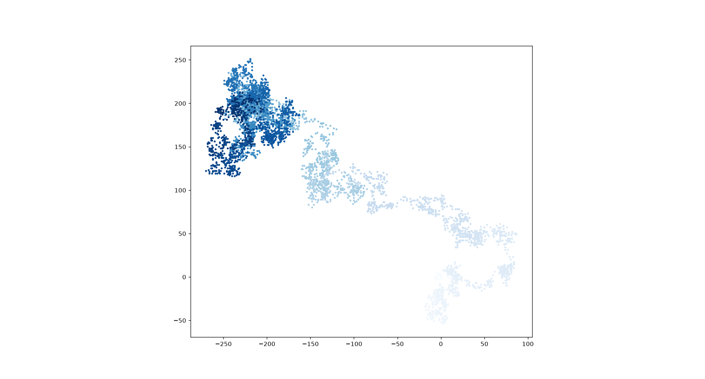

```python
from matplotlib import pyplot as plt

from random_walk import RandomWalk

# 创造数据

rw = RandomWalk()
rw.fill_walk()

fig, ax = plt.subplots()

point_numbers = range(rw.num_points)

# ax.plot(rw.values_x, rw.values_y, linewidth=2, color='black')
# edgecolors='none' 以删除每个点的轮廓
ax.scatter(rw.values_x, rw.values_y, c=point_numbers, s=10, cmap=plt.cm.Blues, edgecolors='none')

# 默认情况下，Matplotlib 独立地缩放每个轴，而这将水平或垂直拉伸绘图
# 而 set_aspect('equal') 指定两条轴上刻度的间距必须相等
ax.set_aspect('equal')

# 突出起点和终点
ax.scatter(rw.values_x[0], rw.values_y[0], c='black', s=100, edgecolors='none')
ax.scatter(rw.values_x[-1], rw.values_y[-1], c='red', s=100, edgecolors='none')

plt.show()
```

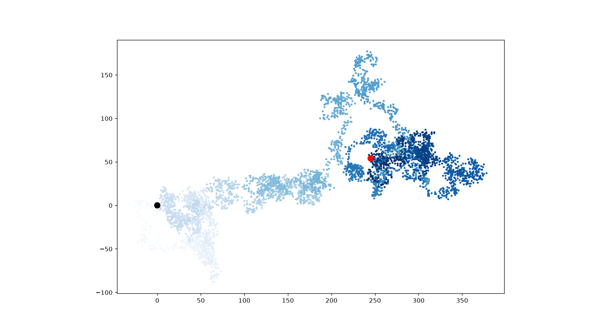

```python
from matplotlib import pyplot as plt

from random_walk import RandomWalk

# 创造数据
rw = RandomWalk()
rw.fill_walk()

fig, ax = plt.subplots()

point_numbers = range(rw.num_points)

# ax.plot(rw.values_x, rw.values_y, linewidth=2, color='black')
# edgecolors='none' 以删除每个点的轮廓
ax.scatter(rw.values_x, rw.values_y, c=point_numbers, s=10, cmap=plt.cm.Blues, edgecolors='none')

# 默认情况下，Matplotlib 独立地缩放每个轴，而这将水平或垂直拉伸绘图
# 而 set_aspect('equal') 指定两条轴上刻度的间距必须相等
ax.set_aspect('equal')

# 突出起点和终点
ax.scatter(rw.values_x[0], rw.values_y[0], c='black', s=100, edgecolors='none')
ax.scatter(rw.values_x[-1], rw.values_y[-1], c='red', s=100, edgecolors='none')

# 隐藏坐标轴
ax.get_xaxis().set_visible(False)
ax.get_yaxis().set_visible(False)

plt.show()
```

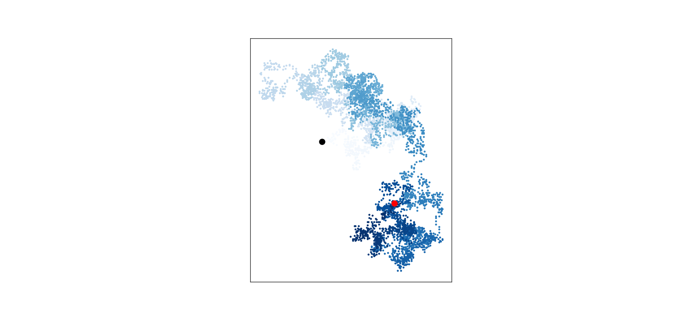

### 1.4.3 **增加点的个数并调整点的大小**

```python
from matplotlib import pyplot as plt

from random_walk import RandomWalk

# 创造数据

rw = RandomWalk(50_000)
rw.fill_walk()

fig, ax = plt.subplots()

point_numbers = range(rw.num_points)

# ax.plot(rw.values_x, rw.values_y, linewidth=2, color='black')
# edgecolors='none' 以删除每个点的轮廓
ax.scatter(rw.values_x, rw.values_y, c=point_numbers, s=1, cmap=plt.cm.Blues, edgecolors='none')

# 默认情况下，Matplotlib 独立地缩放每个轴，而这将水平或垂直拉伸绘图
# 而 set_aspect('equal') 指定两条轴上刻度的间距必须相等
ax.set_aspect('equal')

# # 突出起点和终点
# ax.scatter(rw.values_x[0], rw.values_y[0], c='black', s=100, edgecolors='none')
# ax.scatter(rw.values_x[-1], rw.values_y[-1], c='red', s=100, edgecolors='none')

# 隐藏坐标轴
ax.get_xaxis().set_visible(False)
ax.get_yaxis().set_visible(False)

plt.show()
```

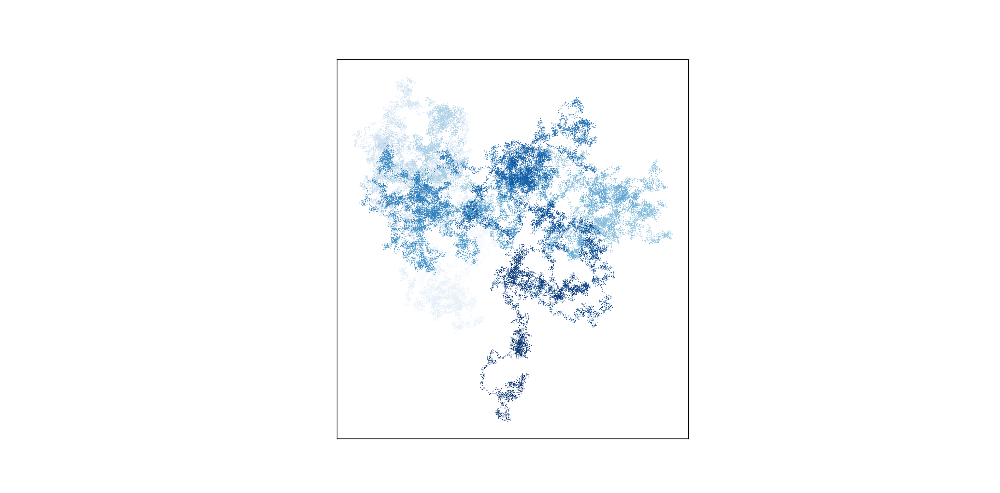

### 1.4.4 调整尺寸以适应屏幕

```python
from matplotlib import pyplot as plt

from random_walk import RandomWalk

# 创造数据
rw = RandomWalk(50_000)
rw.fill_walk()

# =========================================================================================
# 如果知道当前系统的分辨率，可通过参数 dpi 向 plt.subplots() 传递该分辨率
fig, ax = plt.subplots(figsize=(15, 9), dpi=100)  # <--- 看这里 figsize 指示屏幕尺寸，单位为英寸

point_numbers = range(rw.num_points)

# ax.plot(rw.values_x, rw.values_y, linewidth=2, color='black')
# edgecolors='none' 以删除每个点的轮廓
ax.scatter(rw.values_x, rw.values_y, c=point_numbers, s=1, cmap=plt.cm.Blues, edgecolors='none')

# 默认情况下，Matplotlib 独立地缩放每个轴，而这将水平或垂直拉伸绘图
# 而 set_aspect('equal') 指定两条轴上刻度的间距必须相等
ax.set_aspect('equal')

# # 突出起点和终点
# ax.scatter(rw.values_x[0], rw.values_y[0], c='black', s=100, edgecolors='none')
# ax.scatter(rw.values_x[-1], rw.values_y[-1], c='red', s=100, edgecolors='none')

# 隐藏坐标轴
ax.get_xaxis().set_visible(False)
ax.get_yaxis().set_visible(False)

plt.show()
```

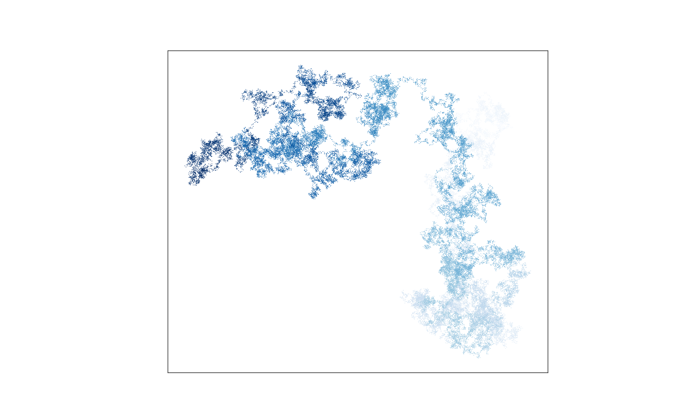

## 1.5 使用 `Plotly` 模拟掷骰子

Plotly Express 依赖于 pandas（一个用于高效地处理数据的库），因此需要同时安装 pandas。如果前面在安装 Matplotlib 时，使用的是 python3 之类的命令，这里也要使用同样的命令.

要了解使用 Plotly 可创建什么样的图形，请访问 Plotly 主页并单击 DOCS 下拉菜单中的 GRAPHING LIBRARIES，然后单击 Python 图标或在 Languages 下拉菜单中选择 Python，打开“Plotly OpenSource Graphing Library for Python”。每个示例都包含源代码，让你知道这些图形是如何生成的。

> 或者直接看这个网址(针对 Python 的文档): https://plotly.com/python/


