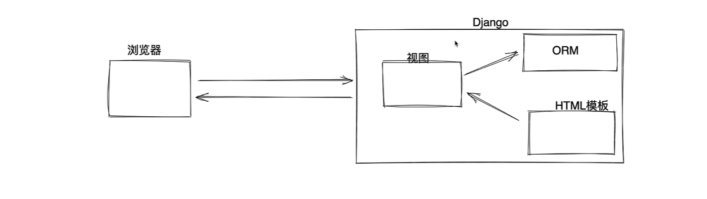
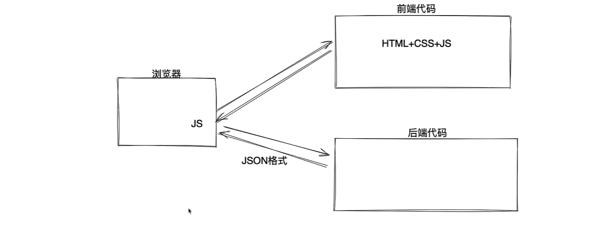
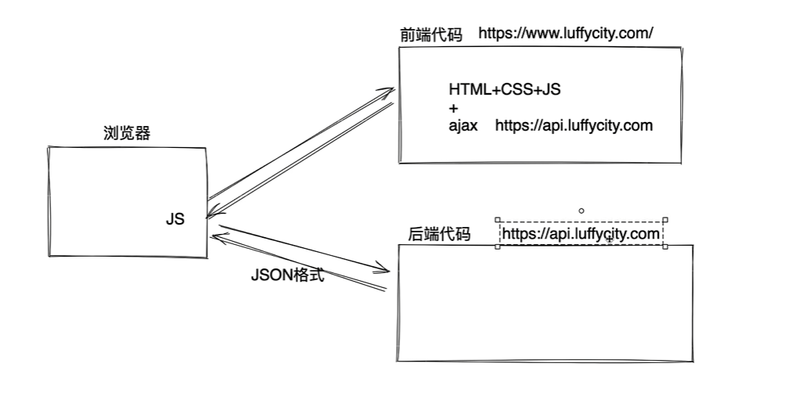
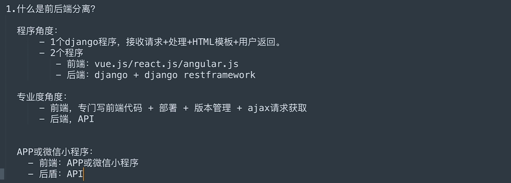
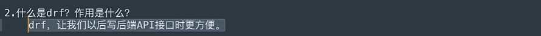
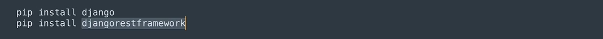
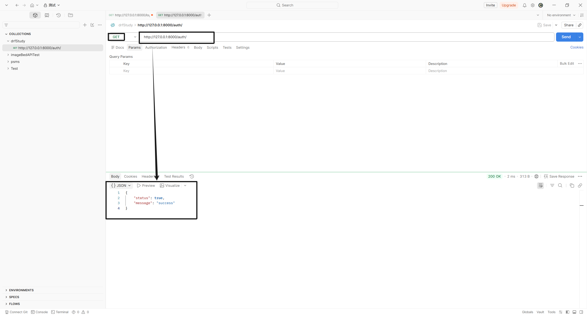
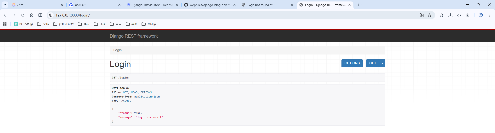
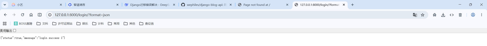
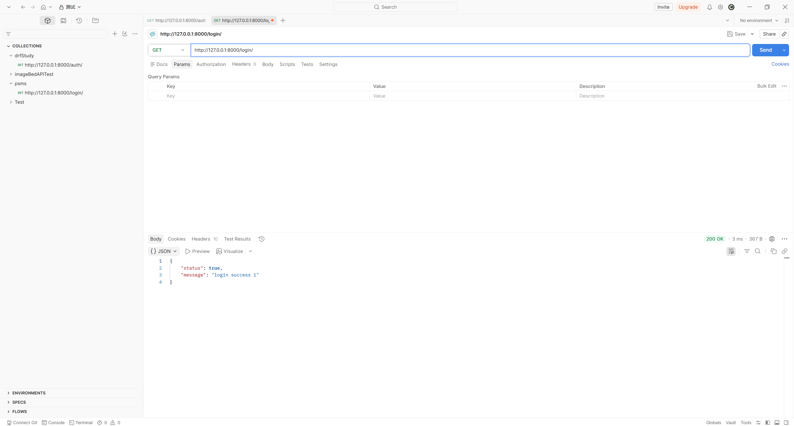

# 1. 基础

## 1.1 什么是前后端分离

前后端不分离：



前后端分离：



----





## 1.2 什么是`DRF`？作用是什么





## 1.3 必备工具

postman

# 2. 体验写一个API

## 2.1 基于Django

```python
# urls.py
from django.urls import path

from app01 import views

urlpatterns = [
    # path('admin/', admin.site.urls),
    path('auth/', views.auth),
]
```

```python
# views.py

def auth(request):
    return JsonResponse({
        'status': True,
        'message': 'success',
    })
```



## 2.2 基于DRF

快速返回数据 + 好看的API页面.

```python
pip install djangorestframework
```

DRF 本质上是一个APP

```python
INSTALLED_APPS = [
    'django.contrib.admin',
    'django.contrib.auth',
    'django.contrib.contenttypes',
    'django.contrib.sessions',
    'django.contrib.messages',
    'django.contrib.staticfiles',
    'app01.apps.App01Config',
    
    # 注册 DRF
    'rest_framework',
]
```

```python
path('login/', views.LoginView.as_view()),

------

class LoginView(APIView):
    def get(self, request):
        return Response({
            'status': True,
            'message': 'login success 1',
        })
```







# 3. 改正错误

```python
# settings.py
INSTALLED_APPS = [
    'django.contrib.admin',
    'django.contrib.auth',
    'django.contrib.contenttypes',
    'django.contrib.sessions',
    'django.contrib.messages',
    'django.contrib.staticfiles',
    'app01.apps.App01Config',
    'rest_framework',
]

MIDDLEWARE = [
    'django.middleware.security.SecurityMiddleware',
    'django.contrib.sessions.middleware.SessionMiddleware',
    'django.middleware.common.CommonMiddleware',
    'django.middleware.csrf.CsrfViewMiddleware',
    'django.contrib.auth.middleware.AuthenticationMiddleware',
    'django.contrib.messages.middleware.MessageMiddleware',
    'django.middleware.clickjacking.XFrameOptionsMiddleware',
]

ROOT_URLCONF = 'drftest.urls'

TEMPLATES = [
    {
        'BACKEND': 'django.template.backends.django.DjangoTemplates',
        'DIRS': [BASE_DIR / 'templates'],
        'APP_DIRS': True,
        'OPTIONS': {
            'context_processors': [
                'django.template.context_processors.request',
                'django.contrib.auth.context_processors.auth',
                'django.contrib.messages.context_processors.messages',
            ],
        },
    },
]
```

```python
# urls.py
from django.urls import path

from app01 import views

urlpatterns = [
    # path('admin/', admin.site.urls),
    path('auth/', views.auth),
    path('user/login/', views.user_login),
    path('log/in/', views.LoginView.as_view()),
]
```

```python
# views.py
from django.http import JsonResponse

from rest_framework.views import APIView
from rest_framework.decorators import api_view
from rest_framework.response import Response


def auth(request):
    return JsonResponse({
        'status': True,
        'message': 'success',
    })


@api_view(['GET'])
def user_login(request):
    return Response({
        'status': True,
        'message': 'login success',
    })


class LoginView(APIView):
    def get(self, request):
        return Response({
            'status': True,
            'message': 'login success 1',
        })
```

# 4. `FBV`  vs. `CBV` (Django)

## 4.1 `Django 中的 FBV vs. CBV` 

`CBV`  和 `FBV` 本质是相同的 -- 到达路由后执行相对应的最终的那个视图函数

```python
# from django.views import View
class View:
    """
    Intentionally simple parent class for all views. Only implements
    dispatch-by-method and simple sanity checking.
    """

    http_method_names = [
        "get",
        "post",
        "put",
        "patch",
        "delete",
        "head",
        "options",
        "trace",
    ]

    def __init__(self, **kwargs):
        """
        Constructor. Called in the URLconf; can contain helpful extra
        keyword arguments, and other things.
        """
        # Go through keyword arguments, and either save their values to our
        # instance, or raise an error.
        for key, value in kwargs.items():
            setattr(self, key, value)

    @classproperty
    def view_is_async(cls):
        handlers = [
            getattr(cls, method)
            for method in cls.http_method_names
            if (method != "options" and hasattr(cls, method))
        ]
        if not handlers:
            return False
        is_async = iscoroutinefunction(handlers[0])
        if not all(iscoroutinefunction(h) == is_async for h in handlers[1:]):
            raise ImproperlyConfigured(
                f"{cls.__qualname__} HTTP handlers must either be all sync or all "
                "async."
            )
        return is_async

    @classonlymethod
    def as_view(cls, **initkwargs):
        """Main entry point for a request-response process."""
        for key in initkwargs:
            if key in cls.http_method_names:
                raise TypeError(
                    "The method name %s is not accepted as a keyword argument "
                    "to %s()." % (key, cls.__name__)
                )
            if not hasattr(cls, key):
                raise TypeError(
                    "%s() received an invalid keyword %r. as_view "
                    "only accepts arguments that are already "
                    "attributes of the class." % (cls.__name__, key)
                )

        def view(request, *args, **kwargs):
            self = cls(**initkwargs)
            self.setup(request, *args, **kwargs)
            if not hasattr(self, "request"):
                raise AttributeError(
                    "%s instance has no 'request' attribute. Did you override "
                    "setup() and forget to call super()?" % cls.__name__
                )
            return self.dispatch(request, *args, **kwargs)

        view.view_class = cls
        view.view_initkwargs = initkwargs

        # __name__ and __qualname__ are intentionally left unchanged as
        # view_class should be used to robustly determine the name of the view
        # instead.
        view.__doc__ = cls.__doc__
        view.__module__ = cls.__module__
        view.__annotations__ = cls.dispatch.__annotations__
        # Copy possible attributes set by decorators, e.g. @csrf_exempt, from
        # the dispatch method.
        view.__dict__.update(cls.dispatch.__dict__)

        # Mark the callback if the view class is async.
        if cls.view_is_async:
            markcoroutinefunction(view)

        return view
```

## 4.2 `DRF 中的 FBV vs. CBV`

`DRF 的 APIView 继承的是 Django的 View`.

```python
path('log/in/', views.LoginView.as_view()),
```

```python
class LoginView(APIView):
    def get(self, request):
        return Response({
            'status': True,
            'message': 'GET',
        })
        
    def post(self, request):  # DRF 的 CBV 是默认 csrf免除的, 即使在中间件中启用csrf中间件
        return Response({
            'status': True,
            'message': 'POST',
        })
    ...
```

# 5. request 对象

## 5.1 Django中的request对象

```python
# request 是请求相关的所有数据
request.POST
request.GET
request.method
request.body
request.FILES
```

## 5.2 DRF 的request 对象

```python
class Request:
    def __init__(self, request, ···):
        self._request = request
        
        self.··· = ···
        
request(DRF的request) = Request(Django的request)
request(DRF的request)._request --> Django中的request对象
request.xxxx
request.xxxxx
```

```python
class LoginView(APIView):
    def get(self, request):
        self.args
        self.kwargs
        return Response({
            'status': True,
            'message': 'GET',
        })
```


