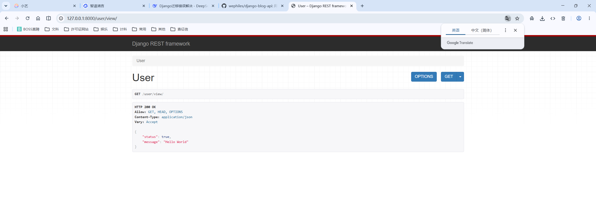

# 1. 纯净版Django项目

```python
INSTALLED_APPS = [
    # 'django.contrib.admin',
    # 'django.contrib.auth',
    # 'django.contrib.contenttypes',
    # 'django.contrib.sessions',
    # 'django.contrib.messages',
    'django.contrib.staticfiles',
    'rest_framework',
]

MIDDLEWARE = [
    'django.middleware.security.SecurityMiddleware',
    # 'django.contrib.sessions.middleware.SessionMiddleware',
    'django.middleware.common.CommonMiddleware',
    'django.middleware.csrf.CsrfViewMiddleware',
    # 'django.contrib.auth.middleware.AuthenticationMiddleware',
    # 'django.contrib.messages.middleware.MessageMiddleware',
    'django.middleware.clickjacking.XFrameOptionsMiddleware',
]

ROOT_URLCONF = 'day13.urls'

TEMPLATES = [
    {
        'BACKEND': 'django.template.backends.django.DjangoTemplates',
        'DIRS': [],
        'APP_DIRS': True,
        'OPTIONS': {
            'context_processors': [
                'django.template.context_processors.request',
                # 'django.contrib.auth.context_processors.auth',
                # 'django.contrib.messages.context_processors.messages',
            ],
        },
    },
]

# DRF 配置
REST_FRAMEWORK = {
    'UNAUTHENTICATED_USER': None,
}
```

```python
path('user/view/', views.UserView.as_view()),
```

```python
class UserView(APIView):
    def get(self, request):
        return Response({
            'status': True,
            'message': 'Hello World',
        })
```



# 2. DRF 中的 request 对象

## 2.1 OOP

```python
class Foo(object):
    def __init__(self, name, age):
        self.name = name
        self.age = age
        
obj = Foo('jack', 20)
obj.name
obj.age
```


