<h1 style="text-align: center;font-size: 40px; font-family: '楷体';">day-01. Web基础 & Django</h1>

[TOC]

**内容回顾**

1. 安装
2. 授权 + 创建用户
3. 访问 
   - 连接
     - 数据库
       - 终端：创建数据库（字符编码）
     - 数据表
       - 终端创建 
       - `SQLAlchemy(ORM)`
       - `pymysql`
     - 数据行
       - 增
       - 删
       - 改
       - 查
         - limit 分页 数据量大会特别慢，效率低 -- 用索引+记录ID最大最小值
         - group by
         - order by
   - 关闭

**面试题：简述 `ORM `的原理：**

目的：

- 对于用户来说：不让用户写`SQL`语句，让用户通过类和对象以及内部提供的方法来进行数据库操作

- 对于框架来说：将类/对象转换成`SQL`语句，再帮我们执行。

- 如果没有`ORM`，自己封装：
  ```python
  class User:
      def __init__(self):
          self.id = ...
          self.name = ...
          self.email = ...
      
  	def order_by(self):
          xxx
      
  obj = User()
  obj.__dict__ = {
      'id': '',
      'name': '',
      'email': '',
  }
  
  可以通过 obj.__dict__ 将上述类/对象转换成SQL语句 --->
  
  select id,name,email from user order by ...;
  
  pymysql
  
  PS：
  	db first
      code first(SQLAlchemy)
  ```

  注意：`SQLAlchemy`并不负责去连接数据库。
  

**今日内容概要**

- HTTP
  无状态 短连接（连一次 回一次 就断开）

- TCP
  不断开

Web应用（网站）

- 浏览器（socket 客户端）

  2 -- www.cnblogs.com(120.26.179.139, 80)
  	sk.socket()
  	sk.connect()   (120.26.179.139, 80)
  	sk.send('我想要xxx数据')
  5 -- 接收
  6 -- 连接断开

- 博客园（socket服务端）

  1 -- 监听自己的IP和端口 www.cnblogs.com(120.26.179.139, 80)
  while True：

  ​    用户 = 等待用户连接

​	     3 -- 收到'我想要xxx数据'

​	     4 响应：'好'
​	    用户断开


1. 自己开发Web框架
   - `socket` 浏览器就是一个`socket`客户端
   - `http`协议 
   - `HTML`知识
   - 数据库(`pymysql`，`SQLAlchemy`)

2. `Django`框架

# 1. Web框架 - 自己写，理解其本质

## 1.1 补充

为什么一定要以HTTP/1.1开头以\r\n\r\n结尾？？？

简单来说：**这是为了让浏览器能看懂的“协议约定”。**

你可以把网络传输想象成**寄快递**，浏览器是收件人，你的服务端是发件人。如果没有统一的包装规则，收件人拆开包裹就会一头雾水。

我们分两部分来拆解：为什么要以 `HTTP/1.1 200 OK` 开头，为什么要以 `\r\n\r\n` 结尾。

### 一、 为什么要以 `HTTP/1.1 200 OK` 开头？

这一行叫做**状态行**，它是响应的“身份证”和“敲门砖”。浏览器收到数据的第一件事，就是看第一行。

1. **`HTTP/1.1` —— 告诉浏览器“我用的是哪种语言/规则”**
   就像人说话一样，你得先告诉对方我说的是中文还是英文。浏览器支持多种协议（HTTP/1.0, HTTP/1.1, HTTP/2, 甚至WebSocket等）。看到 `HTTP/1.1`，浏览器才知道：“哦，接下来的数据我要按照 HTTP/1.1 的规则去解析”，而不是当成 FTP 或乱码去处理。

2. **`200 OK` —— 告诉浏览器“事情办得怎么样了”**
   这是状态码和状态描述。浏览器极其依赖这个数字来决定接下来的行为：

   - 如果是 `200 OK`：浏览器知道成功了，开开心心去解析后面的网页内容。
   - 如果是 `302 Found`：浏览器知道“网页搬家了”，会自动跳转到新网址。
   - 如果是 `404 Not Found`：浏览器知道“文件没找到”，就会显示那个经典的404页面。
   - 如果是 `500 Internal Server Error`：浏览器知道“服务器崩了”，不会尝试渲染报错代码，而是显示服务器错误。

   **如果你不写这个**，浏览器根本不知道这次请求是成功还是失败，只能报错“我不知道你这是个啥状态”。

### 二、 为什么必须以 `\r\n\r\n` 结尾？

`\r\n\r\n` 是两个换行符连在一起，它在 HTTP 协议中代表着**一个空行**。这个空行是**头部和正文之间的“楚河汉界”**。

一个完整的 HTTP 响应分为两部分：

1. **头部**：一些键值对（比如 `Content-Type: text/html`，告诉浏览器正文是网页；`Content-Length: 123`，告诉正文有多长）。
2. **正文**：真正要展示的数据（HTML代码、图片二进制数据等）。

**为什么要用空行隔开？**

因为**正文的内容是不可控的**。

- 如果正文是一段 HTML，里面恰好有空行怎么办？
- 如果正文是一张图片（二进制数据），里面什么乱七八糟的字节都有，甚至可能包含 `HTTP/1.1` 这样的字符怎么办？

如果没有一个明确的**硬性分界线**，浏览器就会把正文里的内容误认为是头部指令，或者把头部当成正文显示出来，整个页面就彻底乱套了。

所以 HTTP 协议的设计者定了个死规矩：**遇到连续的两个 `\r\n`（即一个空行），头部立马结束，后面跟着的所有东西，不管是什么，统统当成正文处理！**

这就好比考试答题卷，前面是填空题（头部），后面是作文题（正文），中间必须有一道粗黑的分割线（`\r\n\r\n`），否则阅卷老师就不知道你填空填到哪里，作文从哪里开始算。

### 总结：如果不按规矩来会怎样？

你可能会想：我就只发一段 HTML `conn.send(b'<h1>Hello</h1>')`，不写那些开头和空行不行吗？

**不行。** 因为浏览器太“傻”又太“严谨”了。

浏览器拿到这段字节后，它的内心戏是这样的：

1. 这是个 TCP 连接，我期待收到 HTTP 响应。
2. 第一行应该是状态行，我找第一个 `\r\n`。结果第一行是 `<h1>Hello</h1>`，这既不是 `HTTP/1.1` 也不是合法的状态码！
3. 浏览器直接崩溃，抛出 `ERR_INVALID_RESPONSE`（无效响应），拒绝渲染。

**协议的本质就是约定**。你写了 `HTTP/1.1 200 OK\r\n\r\n`，浏览器就像看到了暗号，心想：“自己人，我可以正确解析你后面的数据了”。

## 1.2 实验

```python
import socket

sc = socket.socket()
sc.bind(('127.0.0.1', 8080))
sc.listen(5)  # 最多等 5 个

while True:
    print('waiting for connection')
    conn, addr = sc.accept()  # 阻塞 直到有新用户来
    # 有人来连接了
    # 获取用户发送的数据
    data = conn.recv(8096)  #
	# data=b'GET / HTTP/1.1\r\nHost: 127.0.0.1:8080\r\nConnection: keep-alive\r\nCache-Control: max-age=0\r\nsec-ch-ua: " Not A;Brand";v="99", "Chromium";v="99"\r\nsec-ch-ua-mobile: ?0\r\nsec-ch-ua-platform: "Windows"\r\nDNT: 1\r\nUpgrade-Insecure-Requests: 1\r\nUser-Agent: Mozilla/5.0 (Windows NT 10.0; Win64; x64) AppleWebKit/537.36 (KHTML, like Gecko) Chrome/99.0.4844.84 Safari/537.36 HBPC/12.1.4.300\r\nAccept: text/html,application/xhtml+xml,application/xml;q=0.9,image/avif,image/webp,image/apng,*/*;q=0.8,application/signed-exchange;v=b3;q=0.9\r\nSec-Fetch-Site: none\r\nSec-Fetch-Mode: navigate\r\nSec-Fetch-User: ?1\r\nSec-Fetch-Dest: document\r\nAccept-Encoding: gzip, deflate, br\r\nAccept-Language: zh-CN,zh;q=0.9,en;q=0.8\r\nCookie: csrftoken=xBCabfEVm43gDV8BqOZGp6zMdTk8zFsG; sessionid=w8hg7pshzwc7p0mpka4w7lp3eqi5hgrm\r\n\r\n'
	
    
    # 返回数据给用户
    # 构造一个合法的 HTTP/1.1 响应
    # 如果直接写 conn.send(b'123456') 会报错
    body = b'123456'
    response = (b'HTTP/1.1 200 OK\r\n'
                b'Content-Type: text/plain\r\n'
                b'Content-Length: ' + str(len(body)).encode() + b'\r\n'
                                                                b'\r\n'
                ) + body
    conn.sendall(response)
    conn.close()
```

下面就是我们在浏览器中向我们自己写的服务端发送的请求的样式：

```python
GET / HTTP/1.1
Host: 127.0.0.1:8080
Connection: keep-alive
Cache-Control: max-age=0
sec-ch-ua: " Not A;Brand";v="99", "Chromium";v="99"
sec-ch-ua-mobile: ?0
sec-ch-ua-platform: "Windows"
DNT: 1
Upgrade-Insecure-Requests: 1
User-Agent: Mozilla/5.0 (Windows NT 10.0; Win64; x64) AppleWebKit/537.36 (KHTML, like Gecko) Chrome/99.0.4844.84 Safari/537.36 HBPC/12.1.4.300
Accept:text/html,application/xhtml+xml,application/xml;q=0.9,image/avif,image/webp,image/apng,*/*;q=0.8,application/signed-exchange;v=b3;q=0.9
Sec-Fetch-Site: none
Sec-Fetch-Mode: navigate
Sec-Fetch-User: ?1
Sec-Fetch-Dest: document
Accept-Encoding: gzip, deflate, br
Accept-Language: zh-CN,zh;q=0.9,en;q=0.8
Cookie: csrftoken=xBCabfEVm43gDV8BqOZGp6zMdTk8zFsG; sessionid=w8hg7pshzwc7p0mpka4w7lp3eqi5hgrm


adsf
```


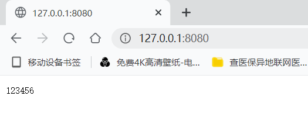

`Http` 协议：

- 发送
  ```
  GET / HTTP/1.1
  Host: 127.0.0.1:8080
  Connection: keep-alive
  Cache-Control: max-age=0
  sec-ch-ua: " Not A;Brand";v="99", "Chromium";v="99"
  sec-ch-ua-mobile: ?0
  sec-ch-ua-platform: "Windows"
  DNT: 1
  Upgrade-Insecure-Requests: 1
  User-Agent: Mozilla/5.0 (Windows NT 10.0; Win64; x64) AppleWebKit/537.36 (KHTML, like Gecko) Chrome/99.0.4844.84 Safari/537.36 HBPC/12.1.4.300
  Accept:text/html,application/xhtml+xml,application/xml;q=0.9,image/avif,image/webp,image/apng,*/*;q=0.8,application/signed-exchange;v=b3;q=0.9
  Sec-Fetch-Site: none
  Sec-Fetch-Mode: navigate
  Sec-Fetch-User: ?1
  Sec-Fetch-Dest: document
  Accept-Encoding: gzip, deflate, br
  Accept-Language: zh-CN,zh;q=0.9,en;q=0.8
  Cookie: csrftoken=xBCabfEVm43gDV8BqOZGp6zMdTk8zFsG; sessionid=w8hg7pshzwc7p0mpka4w7lp3eqi5hgrm
  
  
  这是POST请求发送的数据的位置p=123
  ```

- 响应(以博客园的响应头为例)
  ```
  # 响应头
  Status Code: 200
  content-encoding: gzip
  content-type: text/html; charset=utf-8
  date: Fri, 29 May 2026 06:42:40 GMT
  strict-transport-security: max-age=2592000; includeSubDomains; preload
  vary: Accept-Encoding
  ```

  ```
  # 响应体：前端HTML源码（一串字符串）
  ...
  浏览器解析之后我们看到了网络页面效果
  ```

```python
import socket

sc = socket.socket()
sc.bind(('127.0.0.1', 8080))
sc.listen(5)  # 最多等 5 个

while True:
    print('waiting for connection')
    conn, addr = sc.accept()  # 阻塞 直到有新用户来
    # 有人来连接了
    # 获取用户发送的数据
    data = conn.recv(8096)  #

    # 返回数据给用户
    conn.send(b'HTTP/1.1 200 OK\r\n\r\nThis is response Body hahahahaha!')
    conn.close()
```

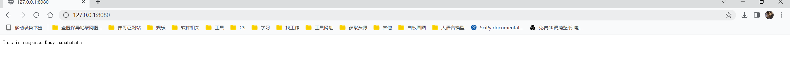

优化：根据 url 返回不同的内容.

```python
import socket

sc = socket.socket()
sc.bind(('127.0.0.1', 8080))
sc.listen(5)  # 最多等 5 个

while True:
    print('waiting for connection')
    conn, addr = sc.accept()  # 阻塞 直到有新用户来
    # 有人来连接了
    # 获取用户发送的数据
    data = conn.recv(8096)  # byte 类型
    # 解析浏览器发来的请求信息
    data = str(data, encoding='utf-8')  # 分割请求头和请求体
    header, body = data.split('\r\n\r\n')
    temp_list = header.split('\r\n')
    method, url, protocol = temp_list[0].split(' ')  # temp_list[0] = 'GET / HTTP/1.1'

    # 根据 url 返回数据给用户
    if url == '/root':
        conn.send(b'HTTP/1.1 \r\n\r\nThis is response.')
    else:
        conn.send(b'HTTP/1.1 \r\n\r\n404 NOT FOUND\r\n')

    conn.close()
```

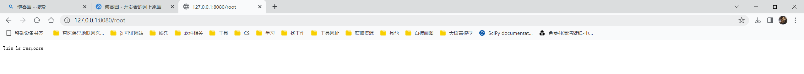

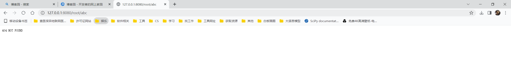

```python
import socket


def f1():
    return b'HTTP/1.1 \r\n\r\nYou are visit /xxx'


def f2():
    return b'HTTP/1.1 \r\n\r\nYou are visit /ooo'


routers = [
    ('/xxx', f1),
    ('/ooo', f2),
]


def run():
    sc = socket.socket()
    sc.bind(('127.0.0.1', 8080))
    sc.listen(5)  # 最多等 5 个

    while True:
        print('waiting for connection')
        conn, addr = sc.accept()  # 阻塞 直到有新用户来
        # 有人来连接了
        # 获取用户发送的数据
        data = conn.recv(8096)  # byte 类型

        # 解析浏览器发来的请求信息
        data = str(data, encoding='utf-8')  # 分割请求头和请求体
        header, body = data.split('\r\n\r\n')
        temp_list = header.split('\r\n')
        method, url, protocol = temp_list[0].split(' ')  # temp_list[0] = 'GET / HTTP/1.1'

        func_name = None
        # 根据 url 返回数据给用户
        for item in routers:
            if item[0] == url:
                func_name = item[1]
                break
        if func_name is not None:
            response = func_name()
        else:
            response = b'HTTP/1.1 404 PAGE NOT FOUND \r\n\r\nError: current page not found.'
        conn.send(response)
        conn.close()


if __name__ == '__main__':
    run()
```

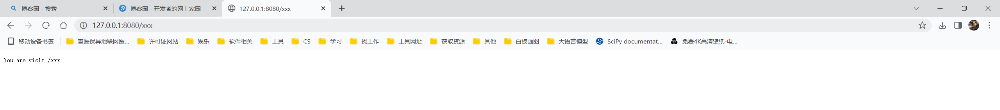

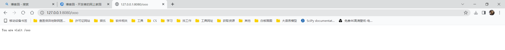

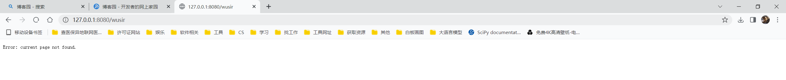

不是简单的返回bytes串，而是返回 一个HTML文档：

```python
import socket


def f1(request):
    """处理用户请求并返回相应的内容"""

    # request 是用户请求相关的所有信息

    with open('index.html', 'rb') as fp:
        data = fp.read()
        return data


def f2(request):
    """处理用户请求并返回相应的内容"""
    return b'HTTP/1.1 \r\n\r\nYou are visit /ooo'


routers = [
    ('/xxx', f1),
    ('/ooo', f2),
]


def run():
    sc = socket.socket()
    sc.bind(('127.0.0.1', 8080))
    sc.listen(5)  # 最多等 5 个

    while True:
        print('waiting for connection')
        conn, addr = sc.accept()  # 阻塞 直到有新用户来
        # 有人来连接了
        # 获取用户发送的数据
        data = conn.recv(8096)  # byte 类型

        # 解析浏览器发来的请求信息
        data = str(data, encoding='utf-8')  # 分割请求头和请求体
        header, body = data.split('\r\n\r\n')
        temp_list = header.split('\r\n')
        method, url, protocol = temp_list[0].split(' ')  # temp_list[0] = 'GET / HTTP/1.1'

        func_name = None
        # 根据 url 返回数据给用户
        for item in routers:
            if item[0] == url:
                func_name = item[1]
                break
        if func_name is not None:
            response = b'HTTP/1.1 200 OK\r\nContent-Type: text/html; charset=utf-8\r\n\r\n' + func_name(data)
        else:
            response = b'HTTP/1.1 404 PAGE NOT FOUND \r\n\r\nError: current page not found.'
        conn.send(response)
        conn.close()


if __name__ == '__main__':
    run()
```

```html
# index.html
<!DOCTYPE html>
<html lang="en">
<head>
    <meta charset="UTF-8">
    <title>Title</title>
</head>
<body>
<h1>用户登录</h1>
<form>
    <p><input type="text" placeholder="用户名"/></p>
    <p><input type="password" placeholder="密码"/></p>
</form>
</body>
</html>
```

```html
# artical.html
<!DOCTYPE html>
<html lang="en">
<head>
    <meta charset="UTF-8">
    <title>Title</title>
</head>
<body>
<table border="1">
    <thead>
    <tr>
        <th>ID</th>
        <th>用户名</th>
        <th>密码</th>
    </tr>
    </thead>

    <tbody>
    <tr>
        <th>1</th>
        <th>jack</th>
        <th>123456</th>
    </tr>

    <tr>
        <th>2</th>
        <th>rose</th>
        <th>654321</th>
    </tr>

    <tr>
        <th>3</th>
        <th>duke</th>
        <th>987456</th>
    </tr>
    </tbody>
</table>
</body>
</html>
```

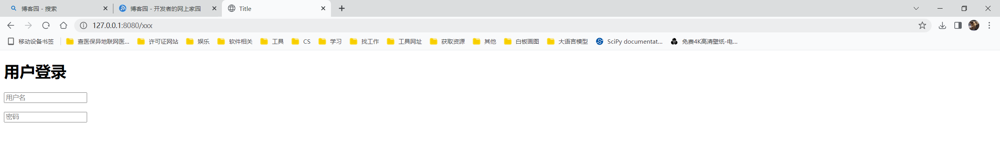

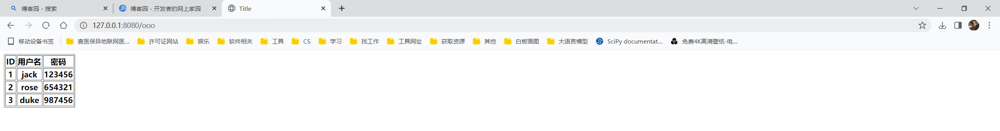

以上我的网站都是静态网站！

先简单的让其变成动态：

`artical.html`:

```html
<!DOCTYPE html>
<html lang="en">
<head>
    <meta charset="UTF-8">
    <title>Title</title>
</head>
<body>
<table border="1">
    <thead>
    <tr>
        <th>ID</th>
        <th>用户名</th>
        <th>密码</th>
    </tr>
    </thead>

    <tbody>
    <tr>
        <th>1</th>
        <th>@@sw@@</th>
        <th>123456</th>
    </tr>
    </tbody>
</table>
</body>
</html>
```

```python
# s1.py
import socket


def f1(request):
    """处理用户请求并返回相应的内容"""

    # request 是用户请求相关的所有信息

    with open('index.html', 'r', encoding='utf-8') as fp:
        data = fp.read()

    # 现在 data 是个字符串
    return bytes(data, encoding='utf-8')


def f2(request):
    """处理用户请求并返回相应的内容"""
    with open('artical.html', 'r', encoding='utf-8') as fp:
        data = fp.read()
    import time
    ctime = time.time()
    data = data.replace('@@sw@@', str(ctime))
    return bytes(data, encoding='utf-8')


routers = [
    ('/xxx', f1),
    ('/ooo', f2),
]


def run():
    sc = socket.socket()
    sc.bind(('127.0.0.1', 8080))
    sc.listen(5)  # 最多等 5 个

    while True:
        print('waiting for connection')
        conn, addr = sc.accept()  # 阻塞 直到有新用户来
        # 有人来连接了
        # 获取用户发送的数据
        data = conn.recv(8096)  # byte 类型

        # 解析浏览器发来的请求信息
        data = str(data, encoding='utf-8')  # 分割请求头和请求体
        header, body = data.split('\r\n\r\n')
        temp_list = header.split('\r\n')
        method, url, protocol = temp_list[0].split(' ')  # temp_list[0] = 'GET / HTTP/1.1'

        func_name = None
        # 根据 url 返回数据给用户
        for item in routers:
            if item[0] == url:
                func_name = item[1]
                break
        if func_name is not None:
            response = b'HTTP/1.1 200 OK\r\nContent-Type: text/html; charset=utf-8\r\n\r\n' + func_name(data)
        else:
            response = b'HTTP/1.1 404 PAGE NOT FOUND \r\n\r\nError: current page not found.'
        conn.send(response)
        conn.close()


if __name__ == '__main__':
    run()
```

从数据库拿数据 -- 真正的动态网站

着重看 f3 函数.

```python
import socket


def f1(request):
    """处理用户请求并返回相应的内容"""

    # request 是用户请求相关的所有信息
    with open('index.html', 'rb') as fp:
        data = fp.read()
        return data


def f2(request):
    """处理用户请求并返回相应的内容"""
    with open('artical.html', 'r', encoding='utf-8') as fp:
        data = fp.read()
    import time
    ctime = time.time()
    data = data.replace('@@sw@@', str(ctime))
    return bytes(data, encoding='utf-8')


def f3(request):
    # 去数据库中拿数据
    import pymysql
    conn = pymysql.connect(
        host='127.0.0.1',
        port=3306,
        user='luffy',
        password='123456',
        charset="utf8",
        database='school'
    )
    cursor = conn.cursor(cursor=pymysql.cursors.DictCursor)

    # 执行 SQL，并返回受影响的行数
    cursor.execute('select sid,sname,gender,class_id from student;')
    user_list = cursor.fetchall()

    data_str_list = []
    for item in user_list[0:10]:  # 数据比较多 先拿10条
        data_str = f"<tr><td>{item.get('sid')}</td><td>{item.get('sname')}</td><td>{item.get('gender')}</td><td>{item.get('class_id')}</td></tr>"
        data_str_list.append(data_str)
    with open('user_list.html', 'r', encoding='utf-8') as fp:
        data = fp.read()

    # 模板渲染（模板 + 数据）
    data = data.replace('@@content@@', ''.join(data_str_list))
    cursor.close()
    conn.close()
    return bytes(data, encoding='utf-8')


routers = [
    ('/xxx', f1),
    ('/ooo', f2),
    ('/user/list', f3),
]


def run():
    sc = socket.socket()
    sc.bind(('127.0.0.1', 8080))
    sc.listen(5)  # 最多等 5 个

    while True:
        print('waiting for connection')
        conn, addr = sc.accept()  # 阻塞 直到有新用户来
        # 有人来连接了
        # 获取用户发送的数据
        data = conn.recv(8096)  # byte 类型

        # 解析浏览器发来的请求信息
        data = str(data, encoding='utf-8')  # 分割请求头和请求体
        header, body = data.split('\r\n\r\n')
        temp_list = header.split('\r\n')
        method, url, protocol = temp_list[0].split(' ')  # temp_list[0] = 'GET / HTTP/1.1'

        func_name = None
        # 根据 url 返回数据给用户
        for item in routers:
            if item[0] == url:
                func_name = item[1]
                break
        if func_name is not None:
            response = b'HTTP/1.1 200 OK\r\nContent-Type: text/html; charset=utf-8\r\n\r\n' + func_name(data)
        else:
            response = b'HTTP/1.1 404 PAGE NOT FOUND \r\n\r\nError: current page not found.'
        conn.send(response)
        conn.close()


if __name__ == '__main__':
    run()

```

```python
# user_list.html
<!DOCTYPE html>
<html lang="en">
<head>
    <meta charset="UTF-8">
    <title>Title</title>
</head>
<body>
<table border="1">
    <thead>
    <tr>
        <th>ID</th>
        <th>姓名</th>
        <th>性别</th>
        <th>所属班级</th>
    </tr>
    </thead>

    <tbody>
    @@content@@
    </tbody>
</table>
</body>
</html>
```

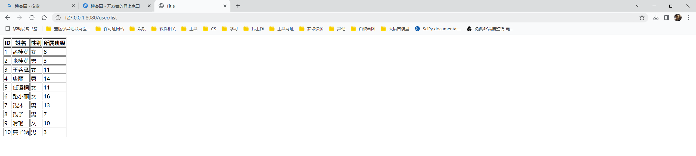

用别人给我们写好的方式去实现字符串的替换，就需要用别人的规则

```python
import socket


def f1(request):
    """处理用户请求并返回相应的内容"""

    # request 是用户请求相关的所有信息
    with open('index.html', 'rb') as fp:
        data = fp.read()
        return data


def f2(request):
    """处理用户请求并返回相应的内容"""
    with open('artical.html', 'r', encoding='utf-8') as fp:
        data = fp.read()
    import time
    ctime = time.time()
    data = data.replace('@@sw@@', str(ctime))
    return bytes(data, encoding='utf-8')


def f3(request):
    # 去数据库中拿数据
    import pymysql
    conn = pymysql.connect(
        host='127.0.0.1',
        port=3306,
        user='luffy',
        password='123456',
        charset="utf8",
        database='school'
    )
    cursor = conn.cursor(cursor=pymysql.cursors.DictCursor)

    # 执行 SQL，并返回受影响的行数
    cursor.execute('select sid,sname,gender,class_id from student;')
    user_list = cursor.fetchall()

    data_str_list = []
    for item in user_list[0:10]:  # 数据比较多 先拿10条
        data_str = f"<tr><td>{item.get('sid')}</td><td>{item.get('sname')}</td><td>{item.get('gender')}</td><td>{item.get('class_id')}</td></tr>"
        data_str_list.append(data_str)
    with open('./user_list.html', 'r', encoding='utf-8') as fp:
        data = fp.read()

    # 模板渲染
    data = data.replace('@@content@@', ''.join(data_str_list))
    cursor.close()
    conn.close()
    return bytes(data, encoding='utf-8')


def f4(request):
    # 去数据库中拿数据
    import pymysql
    conn = pymysql.connect(
        host='127.0.0.1',
        port=3306,
        user='luffy',
        password='123456',
        charset="utf8",
        database='school'
    )
    cursor = conn.cursor(cursor=pymysql.cursors.DictCursor)

    # 执行 SQL，并返回受影响的行数
    cursor.execute('select sid,sname,gender,class_id from student;')
    user_list = cursor.fetchall()[10:20]

    with open('host_list.html', 'r', encoding='utf-8') as fp:
        data = fp.read()

    # 用别人给我们封装好的替换规则去替换 不用自己再写了
    from jinja2 import Template
    template = Template(data)
    data = template.render(user_list=user_list, user="This is a test string.")  # 替换后的data是一个字符串
    return bytes(data, encoding='utf-8')


routers = [
    ('/xxx', f1),
    ('/ooo', f2),
    ('/user/list', f3),
    ('/host/list', f4),
]


def run():
    sc = socket.socket()
    sc.bind(('127.0.0.1', 8080))
    sc.listen(5)  # 最多等 5 个

    while True:
        print('waiting for connection')
        conn, addr = sc.accept()  # 阻塞 直到有新用户来
        # 有人来连接了

        # 获取用户发送的数据
        data = conn.recv(8096)  # byte 类型

        # 解析浏览器发来的请求信息
        data = str(data, encoding='utf-8')  # 分割请求头和请求体
        header, body = data.split('\r\n\r\n')
        temp_list = header.split('\r\n')
        method, url, protocol = temp_list[0].split(' ')  # temp_list[0] = 'GET / HTTP/1.1'

        func_name = None
        # 根据 url 返回数据给用户
        for item in routers:
            if item[0] == url:
                func_name = item[1]
                break
        if func_name is not None:
            response = b'HTTP/1.1 200 OK\r\nContent-Type: text/html; charset=utf-8\r\n\r\n' + func_name(data)
        else:
            response = b'HTTP/1.1 404 PAGE NOT FOUND \r\n\r\nError: current page not found.'
        conn.send(response)
        conn.close()


if __name__ == '__main__':
    run()
```

```python
<!DOCTYPE html>
<html lang="en">
<head>
    <meta charset="UTF-8">
    <title>Title</title>
</head>
<body>
<table border="1">
    <thead>
    <tr>
        <th>ID</th>
        <th>姓名</th>
        <th>性别</th>
        <th>所属班级</th>
    </tr>
    </thead>

    <tbody>
    
    <tr>
        <td>{{ row.sid }}</td>
        <td>{{ row.sname }}</td>
        <td>{{ row.gender }}</td>
        <td>{{ row.class_id }}</td>
    </tr>
    
    </tbody>
</table>

{{user}}
</body>
</html>
```

## 1.3 总结

- `Http`
  无状态 短连接 -- 连接一次发送一次响应一次就断开

- 所有的网络请求都是基于socket实现的
  浏览器：socket 客户端
  网站：socket服务端

- 自己写网站

  - a. socket 服务端 `nginx `就是一个服务端，专门用来接受请求 处理是交给别人去处理的

  - b. 根据` url` 的不同返回不同的内容
    路由系统：`url `--> 函数

  - c. 字符串返回给用户
    静态
    动态 --> `HTML`充当模板 （模板中包含特殊字符）
    自己创造任意数据

    模板引擎的渲染 --> 渲染成字符串返回给用户

- Web 框架
  - 框架种类:
    - `a,b,c` 全写了 ---> `Tornado`
    - 【第三方的a】只有 `b,c`  -----> `Django`，`Django的a用的是 wsgiref`
    - 只有b，【第三方的c】【第三方的a】--->  `Flask`,【`wsgiref`】，【`jinjia2`】
  - 分类
    - `Django`
    - 其他

# 2. `Django`框架

## 2.1 安装配置

安装  `pip install django`

...

启动并监听 8080 端口：

```python
python manage.py runserver 127.0.0.1:8080
```

Django程序目录：

```python
mysite
	- manage.py --> 对当前Django程序的所有操作可以基于python manage.py 参数
	- mysite
    	- settings.py   --> Django的配置文件
        - asgi.py
        - urls.py       --> 路由系统： url <--> 函数
        - wsgi.py       --> 定义Django用什么socket实现 默认用的是 wsgiref  生产环境用 uwsgi
```

配置文件相关

```python
TEMPLATES = [
    {
        'BACKEND': 'django.template.backends.django.DjangoTemplates',
        'DIRS': [BASE_DIR / 'templates'], # 注意看这个地方 这里修改模板所在的目录
        'APP_DIRS': True,
        'OPTIONS': {
            'context_processors': [
                'django.template.context_processors.request',
                'django.contrib.auth.context_processors.auth',
                'django.contrib.messages.context_processors.messages',
            ],
        },
    },
]

# -------------------------------------------------------------------------------------------
STATIC_URL = '/static/'  # 意思是只要带着 /static/ 这个前缀，我就去 STATIC_DIRS 中的目录下面找静态文件
STATICFILES_DIRS = (
    BASE_DIR / 'static',
)
# 额外步骤 -- 将 'django.middleware.csrf.CsrfViewMiddleware', 这一行注释掉
MIDDLEWARE = [
    'django.middleware.security.SecurityMiddleware',
    'django.contrib.sessions.middleware.SessionMiddleware',
    'django.middleware.common.CommonMiddleware',
    # 'django.middleware.csrf.CsrfViewMiddleware',
    'django.contrib.auth.middleware.AuthenticationMiddleware',
    'django.contrib.messages.middleware.MessageMiddleware',
    'django.middleware.clickjacking.XFrameOptionsMiddleware',
]
```

```python
from django.urls import path

from django.shortcuts import HttpResponse, render


def login(request):
    from django.core.handlers.wsgi import WSGIRequest
    # request: 是用户请求的所有信息 -- 是个对象
    # print(request, type(request))  # <WSGIRequest: GET '/login/'> <class 'django.core.handlers.wsgi.WSGIRequest'>
    # print(request.path_info)  # /login/
    # print(request.path)  # /login/
    # print(request.environ)  # 环境变量
    # print('meta:', request.META)  #
    # print(request.method)  # GET
    # print(request.GET)  # GET <QueryDict: {'name': ['jack'], 'query': ['456']}>

    # 自动找到模板目录路径下的 login.html 读取内容并返回给用户
    # 模板路径的配置 -- 在 settings.py 中配置
    return render(request, 'login.html')


urlpatterns = [
    # path('admin/', admin.site.urls),
    path('login/', login),
]
```

## 2.2 简单的登录功能

一个简单的登录功能实现：

```python
from django.urls import path

from django.shortcuts import HttpResponse, render, redirect


def login(request):
    if request.method == 'GET':
        return render(request, 'login.html')
    # post 请求
    # request.POST 是用户POST提交过来的数据 其实就是请求体中的数据
    user_name = request.POST.get('username')
    password = request.POST.get('password')
    if user_name == 'admin' and password == '123456':
        # 登录成功
        return redirect("https://www.baidu.com")
    else:
        # 登录失败
        msg = '账号/密码错误'
        return render(request, 'login.html', {'msg': msg})


urlpatterns = [
    # path('admin/', admin.site.urls),
    path('login/', login),
]
```

```python
# login.html

<!DOCTYPE html>
<html lang="en">
<head>
    <meta charset="UTF-8">
    <title>Login</title>
    <link rel="stylesheet" href="/static/common.css">
</head>
<body>
<form method="POST" action="/login/">
    <h1>Login</h1>
    <input type="text" name="username" placeholder="Username">
    <input type="password" name="password" placeholder="Password">
    <input type="submit" value="Login">
    {{ msg }}
</form>
</body>
</html>

```

```python
# common.css

h1 {
    color: blue;
}
```

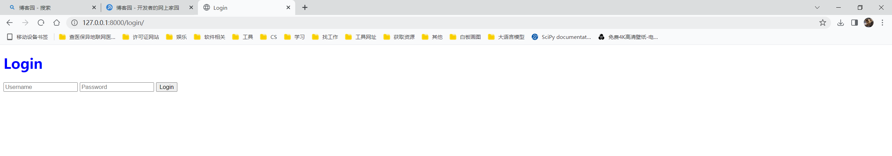

`GET` 请求 --> 只有 `request.GET` 里面有值

`POST`请求 --> `request.GET` 和 `request.POST` 都可能有值.


