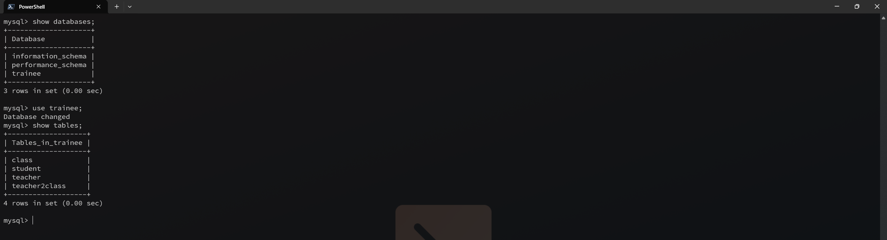
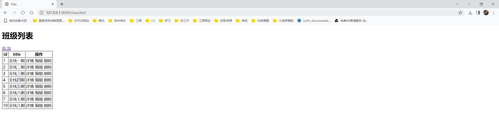
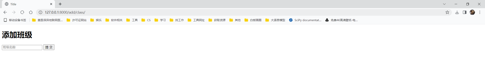
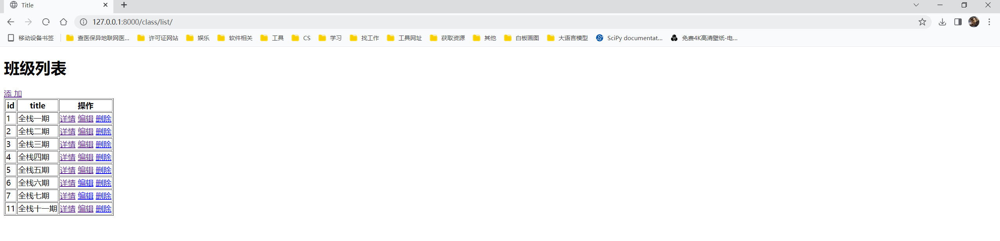
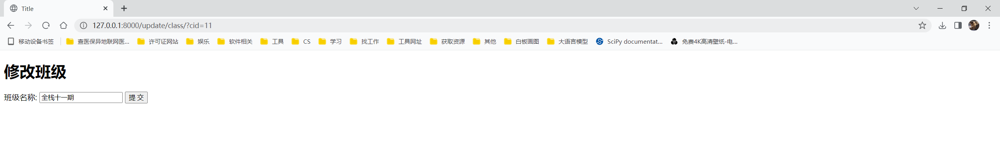

<h1 style="text-align: center;font-size: 40px; font-family: '楷体';">day-02.Django</h1>

[TOC]

今日概要：

- Django基础
- 前端知识（复习）
  - `html`
  - `css`

- 学员管理

​	表：

​		班级

​		学生

​		老师

​	单表操作

​		增

​		删

​		改

​		查

​	一对多操作

​		增

​		删

​		改

​		查

​	多对多操作

​		增

​		删

​		改

​		查

---

# 1. 学员管理 - 表结构设计

表：

- 班级
- 学生
- 老师

先创建班级

班级和学生 -- 一对多


班级表：

| id   | title     |
| ---- | --------- |
| 1    | 全栈 1 期 |
| 2    | 全栈 2 期 |
| 3    | 全栈 3 期 |


学生表：

| id   | name | class_id(外键) |
| ---- | ---- | -------------- |
| 1    |      |                |
| 2    |      |                |
| 3    |      |                |


教师表和班级的关系是多对多关系

| id   | name |
| ---- | ---- |
| 1    |      |
| 2    |      |
| 3    |      |


老师班级关系表

| id   | teacher_id | class_id |
| ---- | ---------- | -------- |
| 1    | 1          | 1        |
| 2    | 1          | 2        |
| 3    | 2          | 1        |


创建数据库 授权 创建表：

```sql
-- 创建数据库
-- root 状态下
create database trainee default charset utf8 collate utf8_general_ci;

-- 创建用户 study
create user 'study'@'%' identified by '123456';

-- 给用户授权 并刷新
grant all privileges to 'study'@'%';
flush privileges;

-- 用新用户登录
mysql -u study -p

-- -- 创建数据库表 

-- 班级表
create table class (
	id int not null auto_increment primary key,
    title varchar(10)
)default charset=utf8;

-- 学生表
create table student (
	id int not null auto_increment primary key,
    name varchar(16),
    class_id int not null,
    constraint fk_student_class foreign key (class_id) references class(id)  -- 外键 class_id
)default charset=utf8;

-- 教师表
create table teacher (
	id int not null auto_increment primary key,
    name varchar(16)
)default charset=utf8;

-- 教师和班级表
create table teacher2class (
	id int not null auto_increment primary key,
    teacher_id int not null,
    class_id int not null,
    constraint fk_t2c_teacher foreign key (teacher_id) references teacher(id), -- 教师外键
    constraint fk_t2c_class foreign key (class_id) references class(id) -- 班级外键
)default charset=utf8;
```



## 1.1 班级列表 & 添加班级

```python
# 视图函数

import pymysql
from django.shortcuts import render, HttpResponse, redirect


def class_list(request):
    # 连接数据库 获取所有数据
    conn = pymysql.connect(
        host='localhost',
        user='study',
        password='123456',
        database='trainee',
        charset='utf8',
    )
    cursor = conn.cursor(pymysql.cursors.DictCursor)

    cursor.execute('select * from class')

    data = cursor.fetchall()

    cursor.close()
    conn.close()
    return render(request, 'class_list.html', {'data': data})


def add_class(request):
    if request.method == 'GET':
        return render(request, 'add_class.html')
    # POST 请求
    conn = pymysql.connect(
        host='localhost',
        user='study',
        password='123456',
        database='trainee',
        charset='utf8',
    )
    cursor = conn.cursor(pymysql.cursors.DictCursor)
    title = request.POST.get('title')
    if title is not None and title:
        # 先判断是否已经存在这条数据
        cursor.execute('select * from class')
        data = cursor.fetchall()
        for item in data:
            if item['title'] == title:
                cursor.close()
                conn.close()
                return HttpResponse('数据已经存在')
        # 说明是新数据
        try:
            cursor.execute('insert into class(title) values (%s)', (title,))
        except Exception as e:
            conn.rollback()
            cursor.close()
            conn.close()
            return HttpResponse(f'插入数据时出现错误: {e}')
        else:
            conn.commit()
            cursor.close()
            conn.close()
            return redirect('/class/list/')
    else:
        cursor.close()
        conn.close()
        return HttpResponse('您输入的数据格式错误，请检查后再提交！')
```

```html
# -------------------------------------------- add_class.html ------------------------------------------------

<!DOCTYPE html>
<html lang="en">
<head>
    <meta charset="UTF-8">
    <title>Title</title>
</head>
<body>

<h1>添加班级</h1>
<form method="POST" action="/add/class/">
    <input type="text" placeholder="班级名称" name="title"/>
    <button type="submit" value="提交">提 交</button>
</form>

</body>
</html>

# -------------------------------------------- class_list.html ------------------------------------------------

<!DOCTYPE html>
<html lang="en">
<head>
    <meta charset="UTF-8">
    <title>Title</title>
</head>
<body>
<h1>班级列表</h1>

<a href="/add/class/">添 加</a>

<table border="1">
    <thead>
    <tr>
        <th>id</th>
        <th>title</th>
        <th>操作</th>
    </tr>
    </thead>
    <tbody>
    
    <tr>
        <td>{{ item.id }}</td>
        <td>{{ item.title }}</td>
        <td>
            <a>详情</a>
            <a>编辑</a>
            <a>删除</a>
        </td>
    </tr>
    
    </tbody>

</table>
</body>
</html>

```





## 1.2 删除班级 & 修改班级信息

```python
# 视图函数

def delete_class(request):
    class_id = request.GET.get('cid')
    conn = pymysql.connect(
        host='localhost',
        user='study',
        password='123456',
        database='trainee',
        charset='utf8',
    )
    cursor = conn.cursor(pymysql.cursors.DictCursor)

    cursor.execute('delete from class where id=%s', (class_id,))
    conn.commit()

    cursor.close()
    conn.close()
    return redirect('/class/list/')  # 重定向也会发一次http请求


def update_class(request):
    conn = pymysql.connect(
        host='localhost',
        user='study',
        password='123456',
        database='trainee',
        charset='utf8',
    )
    cursor = conn.cursor(pymysql.cursors.DictCursor)
    class_id = request.GET.get('cid')
    if request.method == "GET":
        cursor.execute('select * from class where id=%(cid)s', {'cid': class_id})
        data = cursor.fetchone()
        cursor.close()
        conn.close()
        return render(request, 'update_class.html', {'origin': data})

    # 更新数据
    class_id = request.POST.get('cid')
    title_new = request.POST.get('title')
    cursor.execute('update class set title=%s where id=%s', (title_new, class_id,))
    conn.commit()
    cursor.close()
    conn.close()
    return redirect('/class/list/')
```

```html
# -------------------------------------------- class_list.html ------------------------------------------------
<!DOCTYPE html>
<html lang="en">
<head>
    <meta charset="UTF-8">
    <title>Title</title>
</head>
<body>
<h1>班级列表</h1>

<a href="/add/class/">添 加</a>

<table border="1">
    <thead>
    <tr>
        <th>id</th>
        <th>title</th>
        <th>操作</th>
    </tr>
    </thead>
    <tbody>
    
        <tr>
            <td>{{ item.id }}</td>
            <td>{{ item.title }}</td>
            <td>
                <a href="">详情</a>
                <a href="/update/class?cid={{ item.id }}">编辑</a>
                <a href="/delete/class?cid={{ item.id }}">删除</a>
            </td>
        </tr>
    
    </tbody>

</table>
</body>
</html>


# -------------------------------------------- update_class.html ------------------------------------------------

<!DOCTYPE html>
<html lang="en">
<head>
    <meta charset="UTF-8">
    <title>Title</title>
</head>
<body>
<h1>修改班级</h1>
<form method="POST" action="/update/class/">
    <input type="text" name="cid" value="{{origin.id}}" style="display: none;">
    班级名称: <input type="text" value="{{ origin.title }}" name="title"/>
    <button type="submit" value="提交">提 交</button>
</form>
</body>
</html>
```

还有一种方法：不在`Form`表单(请求体)里面写 `<input type="text" name="cid" value="{{origin.id}}" style="display: none;">`，而是在请求头六面写 ，如下：

```python
def delete_class(request):
    class_id = request.GET.get('cid')
    conn = pymysql.connect(
        host='localhost',
        user='study',
        password='123456',
        database='trainee',
        charset='utf8',
    )
    cursor = conn.cursor(pymysql.cursors.DictCursor)

    cursor.execute('delete from class where id=%s', (class_id,))
    conn.commit()

    cursor.close()
    conn.close()
    return redirect('/class/list/')  # 重定向也会发一次http请求


def update_class(request):
    conn = pymysql.connect(
        host='localhost',
        user='study',
        password='123456',
        database='trainee',
        charset='utf8',
    )
    cursor = conn.cursor(pymysql.cursors.DictCursor)
    class_id = request.GET.get('cid')
    if request.method == "GET":
        cursor.execute('select * from class where id=%(cid)s', {'cid': class_id})
        data = cursor.fetchone()
        cursor.close()
        conn.close()
        return render(request, 'update_class.html', {'origin': data})

    # 更新数据
    class_id = request.GET.get('cid')
    title_new = request.POST.get('title')
    cursor.execute('update class set title=%s where id=%s', (title_new, class_id,))
    conn.commit()
    cursor.close()
    conn.close()
    return redirect('/class/list/')
```

```html
# update_class.html
...
<form method="POST" action="/update/class/?cid={{ origin.id }}"> -- 注意看这个地方
    
    班级名称: <input type="text" value="{{ origin.title }}" name="title"/>
    <button type="submit" value="提交">提 交</button>
</form>
...
```

> [!Warning]
>
> 注意下面有一个坑：
>
> ```html
> <form method="POST" action="/update/class/?cid={{ origin.id }}">
> ```
>
> 如果是POST请求，请求的URL最后必须要有 `/`
>
> 如果写成下面这样的会报错：
>
> ```html
> <form method="POST" action="/update/class?cid={{ origin.id }}">
>     									 ^
>     							   此处必须要有一个/
>     
> 而不像GET请求那样，可以省略后面的/：
> <a href="/delete/class?cid={{ item.id }}">删除</a>
> ```





## 1.3 教师管理

```python
# 教师管理
def teacher_list(request):
    conn = pymysql.connect(
        host='localhost',
        port=3306,
        user='study',
        password='123456',
        database='trainee',
        charset='utf8',
    )
    cursor = conn.cursor(cursor=pymysql.cursors.DictCursor)

    cursor.execute('select * from teacher')
    data_list = cursor.fetchall()
    cursor.close()
    conn.close()
    return render(request, 'teacher_list.html', {'data_list': data_list})


def add_teacher(request):
    if request.method == 'GET':
        return render(request, 'add_teacher.html')
    name = request.POST.get('name')
    conn = pymysql.connect(
        host='localhost',
        port=3306,
        user='study',
        password='123456',
        database='trainee',
        charset='utf8',
    )
    cursor = conn.cursor(cursor=pymysql.cursors.DictCursor)
    cursor.execute('insert into teacher (name) values (%s)', (name,))
    conn.commit()

    cursor.close()
    conn.close()
    return redirect('/teacher/list/')


def update_teacher(request):
    if request.method == 'GET':
        tid = request.GET.get('tid')
        conn = pymysql.connect(
            host='localhost',
            port=3306,
            user='study',
            password='123456',
            database='trainee',
            charset='utf8',
        )
        cursor = conn.cursor(cursor=pymysql.cursors.DictCursor)
        cursor.execute('select * from teacher where id=%s', (tid,))
        data = cursor.fetchone()
        cursor.close()
        conn.close()
        return render(request, 'update_teacher.html', {'data': data})
    name = request.POST.get('name')
    tid = request.GET.get('tid')
    conn = pymysql.connect(
        host='localhost',
        port=3306,
        user='study',
        password='123456',
        database='trainee',
        charset='utf8',
    )
    cursor = conn.cursor(cursor=pymysql.cursors.DictCursor)
    cursor.execute('update teacher set name=%s where id=%s', (name, tid,))
    conn.commit()

    cursor.close()
    conn.close()
    return redirect('/teacher/list/')


def delete_teacher(request):
    tid = request.GET.get('tid')
    conn = pymysql.connect(
        host='localhost',
        port=3306,
        user='study',
        password='123456',
        database='trainee',
        charset='utf8',
    )
    cursor = conn.cursor(cursor=pymysql.cursors.DictCursor)
    cursor.execute('delete from teacher where id=%s', (tid,))
    conn.commit()

    cursor.close()
    conn.close()
    return redirect('/teacher/list/')
```

```html
<!DOCTYPE html>
<html lang="en">
<head>
    <meta charset="UTF-8">
    <title>修改教师信息</title>
</head>
<body>

<h1>修改教师信息</h1>
<form method="POST" action="/update/teacher/?tid={{ data.id }}">
    姓名<input type="text" placeholder="姓名" name="name" value="{{ data.name }}"/>
    <button type="submit" value="提交">提 交</button>
</form>

</body>
</html>
```

```html
<!DOCTYPE html>
<html lang="en">
<head>
    <meta charset="UTF-8">
    <title>新增教师</title>
</head>
<body>

<h1>新增教师</h1>
<form method="POST" action="/add/teacher/">
    姓名<input type="text" placeholder="姓名" name="name"/>
    <button type="submit" value="提交">提 交</button>
</form>

</body>
</html>
```

```html
<!DOCTYPE html>
<html lang="en">
<head>
    <meta charset="UTF-8">
    <title>教师列表</title>
</head>
<body>


<!DOCTYPE html>
<html lang="en">
<head>
    <meta charset="UTF-8">
    <title>Title</title>
</head>
<body>
<h1>教师列表</h1>

<a href="/add/teacher/">添 加</a>

<table border="1">
    <thead>
    <tr>
        <th>id</th>
        <th>name</th>
        <th>操作</th>
    </tr>
    </thead>
    <tbody>
    
        <tr>
            <td>{{ item.id }}</td>
            <td>{{ item.name }}</td>
            <td>
                <a href="">详情</a>
                <a href="/update/teacher?tid={{ item.id }}">编辑</a>
                <a href="/delete/teacher?tid={{ item.id }}">删除</a>
            </td>
        </tr>
    
    </tbody>

</table>
</body>
</html>


</body>
</html>
```


