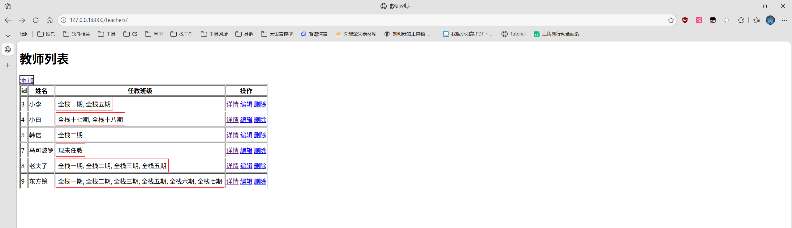
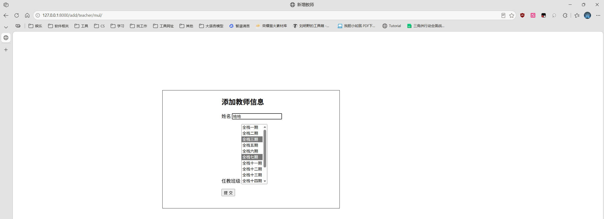

<h1 style="text-align: center;font-size: 40px; font-family: Source Code Pro;">day-04.Django</h1>

[TOC]

今日概要：

- 对话框
  - 删除
  - 编辑

- 多对多关系
- `Bootstrap`
- `fontawesome`

# 1. 模态框-编辑

## 1.1 补充 `js` 阻止默认事件的触发

对于a标签：

```html
<a href="https://www.baidu.com" onclick="myFunc();">点击跳转</a>

<script>
	function myFunc(){
		alert('点击了a标签');
    }
</script>
```

上述代码点击a标签之后，会先执行 `myFunc` 函数定义的操作, 然后再执行 `a` 标签默认的跳转功能(跳转到百度).


如果改成下面这样:

```html
<a href="https://www.baidu.com" onclick="return myFunc();">点击跳转</a>

<script>
	function myFunc(){
        alert('点击了a标签');
		return false;
    }
</script>
```

只会执行 `myFunc` ，但是却不会执行默认的跳转功能（不会跳转到百度）.


如果想让其跳转，直接改成下面这样：

```html
<a href="https://www.baidu.com" onclick="return myFunc();">点击跳转</a>

<script>
	function myFunc(){
        alert('点击了a标签');
		return true;
    }
</script>
```

## 1.2 编辑&删除

```html
<!DOCTYPE html>
<html lang="en">
<head>
    <meta charset="UTF-8">
    <title>Title</title>
    <style>
        .hide {
            display: none;
        }

        .shadow {
            position: fixed;
            left: 0;
            top: 0;
            right: 0;
            bottom: 0;
            background-color: black;
            opacity: 0.4;
            z-index: 999;
        }

        .modal {
            z-index: 1000;
            position: fixed;
            left: 50%;
            top: 50%;
            height: 300px;
            width: 500px;
            background-color: white;
            margin-left: -250px;
            margin-top: -150px;
        }

    </style>
</head>
<body>
<h1>班级列表</h1>

<a href="/add/class/">添 加</a>
<button type="button" onclick="showModal();">模态框添加</button>

<table border="1">
    <thead>
    <tr>
        <th>id</th>
        <th>title</th>
        <th>操作</th>
    </tr>
    </thead>
    <tbody>
    
        <tr>
            <td>{{ item.id }}</td>
            <td>{{ item.title }}</td>
            <td>
                <button type="button">详情</button>
                <button type="button" href="/update/class?cid={{ item.id }}">编辑</button>
                <button cid="{{ item.id }}" type="button" onclick="showUpdateModal(this);">模态编辑</button>
                <button type="button" href="/delete/class?cid={{ item.id }}">删除</button>
                <button cid="{{ item.id }}" type="button" onclick="ShowDeleteModal(this);" id="delete-modal">模态删除
                </button>
            </td>
        </tr>
    
    </tbody>

</table>

<!-- 新增数据 -- 遮罩层 模态框 -->
<div id="shadow" class="shadow hide">
</div>
<div id="modal" class="modal hide">
    <p>
        <label>
            班级名<input type="text" placeholder="班级名" name="title" id="title"/>
            <span id="error-text" style="color: red;"></span>
        </label>
    </p>

    <p>
        <button type="button" onclick="AjaxSend();">提 交</button>
        <button type="button" onclick="cancelModal();">取 消</button>
    </p>

</div>

<!-- 删除数据 -- 遮罩层 模态框 -->
<div id="shadow-delete" class="shadow hide">
</div>
<div id="modal-delete" class="modal hide">
    <p>
        {#        <label>#}
        {#            班级名<input type="text" placeholder="班级名" name="title" id="title-delete"/>#}
        {#            <span id="error-text-delete" style="color: red;"></span>#}
        {#        </label>#}
        您正在执行删除操作，是否确认删除？
    </p>

    <p>
        <button type="button" onclick="DeleteAjaxSend();">提 交</button>
        <button type="button" onclick="DeleteCancelModal();">取 消</button>
    </p>

</div>

<!-- 编辑数据 -- 遮罩层 模态框 -->
<div id="shadow-update" class="shadow hide">
</div>
<div id="modal-update" class="modal hide">
    <p>编辑班级信息</p>
    <p>
        <label>
            班级名<input type="text" placeholder="班级名" name="title" id="title-update"/>
            <input type="text" placeholder="班级名" name="title" id="title-update-id" style="display: none;"/>
            <span id="error-text-update" style="color: red;"></span>
        </label>
    </p>
    <p>
        <button type="button" onclick="updateAjaxSend();">提 交</button>
        <button type="button" onclick="updateCancelModal();">取 消</button>
    </p>
</div>

<script src="/static/js/jquery-4.0.0.min.js"></script>
<script>
    var DELETE_ID;

    /**
     * 新增班级
     */
    function showModal() {
        document.getElementById('shadow').classList.remove('hide');
        document.getElementById('modal').classList.remove('hide');
    }

    function AjaxSend() {
        $.ajax({
            url: '/modal/add/class/',
            type: 'post',
            data: {'title': $('#title').val()},
            success: function (response_data) {
                // 当服务端处理完毕，将数据返回到前端时该函数自动调用 response_data 是服务端返回的值
                // response_data = {status: true, code: 200, msg: 'Successfully insert data to trainee.class.'}
                // { 'status': false, 'code': 400, 'errors': '这个字段不能为空', }
                if (response_data.status) {
                    // 新增数据成功
                    // 跳转到 /class/list/
                    location.href = '/class/list/';
                } else {
                    // 新增数据失败
                    $("#error-text").text(response_data.errors)
                }
            }
        })
    }

    function cancelModal() {
        document.getElementById('shadow').classList.add('hide');
        document.getElementById('modal').classList.add('hide');
    }

    /**
     * 删除班级
     */
    function ShowDeleteModal(ths) {
        document.getElementById('shadow-delete').classList.remove('hide');
        document.getElementById('modal-delete').classList.remove('hide');
        DELETE_ID = $(ths).attr('cid');
    }


    function DeleteAjaxSend() {
        $.ajax({
            url: '/modal/delete/class?cid=' + DELETE_ID,
            type: 'get',
            data: {},
            success: function (response_data) {
                if (response_data.status) {
                    // 成功
                    location.reload();
                } else {
                    // 失败
                    alert(response_data.errors);
                }
            }
        })
    }

    function DeleteCancelModal() {
        document.getElementById('shadow-delete').classList.add('hide');
        document.getElementById('modal-delete').classList.add('hide');
    }

    /**
     * 编辑班级
     */
    function showUpdateModal(ths) {
        document.getElementById('shadow-update').classList.remove('hide');
        document.getElementById('modal-update').classList.remove('hide');

        /**
         * 获取当前标签
         * 获取当前标签的父标签
         * 获取当前标签的父标签的两个兄弟标签
         * <tr>
         *   <td>1</td> ---------------------------------------------------------------> 要找这两个标签
         *   <td>全栈一期</td> ---------------------------------------------------------> 要找这两个标签
         *   <td> ---------------------------------------------------------------------> 这是点击标签的父标签
         *       <button type="button">详情</button>                                             ^
         *       <button type="button" href="/update/class?cid=1">编辑</button>                  |
         *       <button cid="1" type="button" onclick="showUpdateModal();">模态编辑</button> -- 这是我们点击的那个标签
         *       <button type="button" href="/delete/class?cid=1">删除</button>
         *       <button cid="1" type="button" onclick="ShowDeleteModal();" id="delete-modal">模态删除
         *       </button>
         *   </td>
         * </tr>
         * 获取班级当前行的 id 当前班级名称 赋值给对话框中
         */

            // 当前标签 $(ths); 当前标签的父标签 $(ths).parent(); 前两个 $(ths).parent().prevAll();
            // 注意不能用$(ths).parent().siblings(),因为如果 $(ths).parent() 后面还有标签的话也会获取到，那就不对了.
            // 另外要注意 $(ths).parent().prevAll(); 获取到的 td 标签是从下往上的吗，即先获取了 <td>全栈一期</td> 再获取了 <td>1</td>
        var v = $(ths).parent().prevAll();
        var content = $(v[0]).text();
        $('#title-update').val(content);

        // 获取到班级ID
        var contentID = $(v[1]).text();
        $('#title-update-id').val(contentID);
    }

    function updateAjaxSend() {
        var cid = $('#title-update-id').val();
        var ctitle = $('#title-update').val();

        $.ajax({
            url: '/modal/update/class/',
            type: 'post',
            data: {'cid': cid, 'ctitle': ctitle},
            dataType: 'json',
            success: function (response_data) {
                if (response_data.status) {
                    // 成功
                    // JSON.parse('字符串'); // 将json字符串转换成对象
                    // JSON.stringify(json对象); // 将json对象转换成json串
                    // location.href = '/class/list/';
                    location.reload();  // 刷新当前页面
                } else {
                    // 失败
                    $('#error-text-update').text(response_data.errors);
                }
            }
        })
    }

    function updateCancelModal() {
        document.getElementById('shadow-update').classList.add('hide');
        document.getElementById('modal-update').classList.add('hide');
    }
</script>
</body>
</html>

```

```python
# *************** 对话框删除班级 ***********************
def modal_delete_class(request):
    response = {
        'status': False,
        'code': 400,
    }
    cid = request.GET.get('cid')
    with MysqlConnector() as connect:
        conn = connect.conn
        cursor = connect.cursor
        cursor.execute('delete from class where id=%s', (cid,))
        conn.commit()
        response['status'] = True
        response['code'] = 200
        return JsonResponse(response)
    response = {
        'status': False,
        'code': 400,
        'errors': '删除失败',
    }
    return JsonResponse(response)


# *************** 对话框编辑班级 ***********************
def modal_update_class(request):
    cid = request.POST.get('cid')
    title = request.POST.get('ctitle')
    if title is not None and len(title) > 0:
        with MysqlConnector() as connect:
            conn = connect.conn
            cursor = connect.cursor
            cursor.execute('update class set title=%s where id=%s', (title, cid,))
            conn.commit()
            return JsonResponse({
                'status': True,
                'code': 200,
            })
    return JsonResponse({
        'status': False,
        'code': 400,
        'errors': '数据不能为空',
    })
```

## 1.3 添加 -- 以学生表为例

### 1.3.1 补充 跳过默认事件

用 `jQuery` 绑定事件，和 `onclick` 绑定事件具有同样的效果。

### 1.3.2 补充 html中position相关参数

```python
HTML中CSS的 position 属性用来控制元素的定位方式。relative、absolute 和 fixed 是最常用的三个值，它们的核心区别在于参照物（相对于谁定位）和是否脱离文档流（是否占据原本的位置空间）。
```

1. relative（相对定位）——“退后一步，但坑位还在”

   - **参照物**：**元素自己原本的位置**（即在正常文档流中的位置）。

   - **是否脱离文档流**：**否**。

   - **表现**：元素会相对于它本来该在的地方进行偏移（通过 `top`, `right`, `bottom`, `left` 设置），**但是它在文档流中原本占据的空间依然保留**，别的元素不能占了它的坑。

   - **排队比喻**：你站在队伍里，往前跨了一步，但你原本站的位置别人不能站，队伍也不会因为你往前跨了一步而变紧凑。

   - **常见用途**：微调元素位置；**作为 `absolute` 定位的参考容器**（重点，后面会讲）。

   - ```python
     .box-relative {
       position: relative;
       top: 10px; /* 相对于原位置向下移动10px，但原位置留下空白 */
       left: 20px; /* 相对于原位置向右移动20px */
     }
     ```

2. absolute（绝对定位）——“离队找参照物”

   - **参照物**：**距离最近的、且 `position` 不是 `static` 的祖先元素**。如果它所有的祖先都没设置定位（即都是默认的 `static`），那么它会相对于整个浏览器窗口（即 `html` 根元素）定位。

   - **是否脱离文档流**：**是**。

   - **表现**：元素彻底脱离了正常的文档流，**它原本占据的空间被释放**，后面的元素会顶上来。它会一层层往上找祖先，看谁设置了 `relative`/`absolute`/`fixed`，就相对于谁来定位。

   - **排队比喻**：你直接走出了队伍，去了旁边某个有标记的柱子（参照祖先）旁边站着。队伍里你的位置立刻被后面的人补上。

   - **常见用途**：弹出层、下拉菜单、图片上的角标、需要精确叠放在某个元素上的场景。

   - ```python
     .father {
       position: relative; /* 父元素设置 relative，作为参照物 */
     }
     .child {
       position: absolute;
       top: 10px; /* 相对于 .father 的顶部向下10px */
       right: 0;  /* 相对于 .father 的右侧紧贴 */
     }
     ```

   - > ⭐️ **黄金法则（父相子绝）**：在实际开发中，我们通常给父元素设置 `relative`，给子元素设置 `absolute`，这样子元素就能相对于父元素自由定位，而不会满屏幕乱跑。

3. fixed（固定定位）——“死死钉在屏幕上”

   - **参照物**：**浏览器视口**，也就是你当前看到的浏览器窗口。不管页面有多长，它只认屏幕。

   - **是否脱离文档流**：**是**。

   - **表现**：元素脱离文档流，原本的空间被释放。无论页面怎么上下滚动，它都会死死地固定在屏幕的同一个位置。

   - **排队比喻**：你不仅走出了队伍，还变成了一个贴在屏幕上的贴纸，别人怎么滚动页面，你都纹丝不动。

   - **常见用途**：固定在顶部的导航栏、右下角的“回到顶部”按钮、悬浮的客服对话框。

   - ```python
     .box-fixed {
       position: fixed;
       bottom: 20px; /* 距离屏幕底部20px */
       right: 20px;  /* 距离屏幕右侧20px */
     }
     ```

4. ⚠️ 一个极其重要的隐藏坑（关于 fixed）
   虽然 `fixed` 理论上只相对于浏览器视口定位，但**如果 `fixed` 元素的任何一个祖先元素设置了 `transform`、`perspective` 或 `filter` 属性**，那么这个 `fixed` 元素就会**降级变成 `absolute`** 的表现！它不再相对于屏幕固定，而是相对于那个设置了 `transform` 的祖先元素定位。
   这在写动画时非常容易踩坑：比如你给整个页面加了一个 `transform: translateX(0)` 准备做动画，结果发现页面里所有的 `fixed` 导航栏全跟着页面滚走了，就是这个原因。

### 1.3.3 添加学生

```python
# *************** 对话框添加学生 ***********************
def modal_add_student(request):
    name = request.POST.get('name')
    class_id = request.POST.get('class_id')
    if name is None or len(name) == 0:
        return JsonResponse({
            'status': False,
            'code': 400,
            'errors': '姓名不能为空'
        })
    if class_id == '---':
        return JsonResponse({
            'status': False,
            'code': 401,
            'errors': '你必须选择一个班级'
        })
    
    with MysqlConnector() as connect:
        conn = connect.conn
        cursor = connect.cursor
        cursor.execute('insert into student (name,class_id) values(%s,%s)', (name, class_id,))
        conn.commit()
    return JsonResponse({
        'status': True,
        'code': 200,
    })
```

```html
<!DOCTYPE html>
<html lang="en">
<head>
    <meta charset="UTF-8">
    <title>Title</title>
    <style>
        .hide {
            display: none;
        }

        .shadow {
            left: 0;
            right: 0;
            top: 0;
            bottom: 0;
            position: fixed;
            background-color: black;
            opacity: 0.4;
            z-index: 999;
        }

        .add-modal {
            z-index: 1000;
            width: 400px;
            height: 300px;
            position: fixed;
            left: 50%;
            top: 50%;
            margin-left: -200px;
            margin-top: -250px;
            background-color: white;
        }
    </style>
</head>
<body>
<h1>学生信息</h1>

<a href="/add/student/">添 加</a>
<button type="button" id="add-modal-student">模态框添加</button>

<table border="1">
    <thead>
    <tr>
        <th>编号</th>
        <th>姓名</th>
        <th>所属班级</th>
        <th>操作</th>
    </tr>
    </thead>
    <tbody>
    
        <tr>
            <td>{{ item.id }}</td>
            <td>{{ item.name }}</td>
            <td>{{ item.title }}</td>
            <td>
                <a href="">详情</a>
                <a href="/update/student?sid={{ item.id }}">编辑</a>
                <a href="/delete/student?sid={{ item.id }}">删除</a>
            </td>
        </tr>
    
    </tbody>
</table>

{# 新增学生#}
<div id="shadow" class="shadow hide"></div>
<div id="modalAdd" class="add-modal hide">
    <p>
        <label for="addNameInput">姓 名</label>
        <input type="text" id="addNameInput" name="addName">
    </p>
    <span style="color: red;" id="errorInName"></span>

    <p>
        <label for="addClassChoice">班级</label>
        <select id="addClassChoice" name="selectClass">
            <option selected style="text-align: center;">---</option>
            
                <option style="text-align: center;" value="{{ item.id }}">{{ item.title }}</option>
            
        </select>
        <span style="color: red;" id="errorInClassSelected"></span>
    </p>

    <p>
        <button type="button" id="addStudentSubmit">提 交</button>
        <button type="button" id="addStudentCancel">取 消</button>
    </p>
</div>
<script src="/static/js/jquery-4.0.0.min.js"></script>

<script>
    // 当页面框架加载完毕执行
    $(function () {
        // 给 模态框新增学生绑定一个事件
        clickAddModalNewEvent();
    })


    function clickAddModalNewEvent() {
        $('#add-modal-student').click(function () {
            // 只要点击相关标签就执行此函数体里面的内容
            $('#shadow,#modalAdd').removeClass('hide');
        });
        $('#addStudentSubmit').click(function () {
            // 点击模态框的提交按钮后执行此函数体内的代码
            $.ajax({
                url: '/modal/add/student/',
                type: 'POST',
                dataType: 'json',
                data: {
                    'name': $('#addNameInput').val(),
                    'class_id': $('#addClassChoice').val(),
                },
                success: function (res) {
                    if (res.status) {
                        // 成功添加
                        location.reload();
                    } else {
                        // 添加失败
                        if (res.code == 400) {
                            $('#errorInName').text(res.errors);
                        } else {
                            $('#errorInClassSelected').text(res.errors);
                        }
                    }
                }
            })
        });

        $('#addStudentCancel').click(function () {
            // 点击模态框的取消按钮后执行此函数体内的代码
            document.getElementById('shadow').classList.add('hide');
            document.getElementById('modalAdd').classList.add('hide');
        });
    }
</script>
</body>
</html>
```

## 1.3 编辑

新增模态框和编辑模态框用两个模态框实现 -- 可以优化，可以共用 一个模态框来实现。

```python
def modal_update_student(request):
    sname = request.POST.get('sname')
    sid = request.POST.get('sid')
    cid = request.POST.get('cid')
    if sname:
        with MysqlConnector() as connect:
            conn = connect.conn
            cursor = connect.cursor
            cursor.execute('update student set name=%s,class_id=%s where id=%s', (sname, cid, sid,))
            conn.commit()
            return JsonResponse({
                'status': True,
                'code': 200,
            })
    return JsonResponse({
        'status': False,
        'code': 400,
        'msg': '学生姓名不能为空'
    })
```

```html
<!DOCTYPE html>
<html lang="en">
<head>
    <meta charset="UTF-8">
    <title>Title</title>
    <style>
        .hide {
            display: none;
        }

        .shadow {
            left: 0;
            right: 0;
            top: 0;
            bottom: 0;
            position: fixed;
            background-color: black;
            opacity: 0.4;
            z-index: 999;
        }

        .modal {
            z-index: 1000;
            width: 400px;
            height: 300px;
            position: fixed;
            left: 50%;
            top: 50%;
            margin-left: -200px;
            margin-top: -250px;
            background-color: white;
        }
    </style>
</head>
<body>
<h1>学生信息</h1>

<a href="/add/student/">添 加</a>
<button type="button" id="add-modal-student">模态框添加</button>

<table border="1">
    <thead>
    <tr>
        <th>编号</th>
        <th>姓名</th>
        <th>所属班级</th>
        <th>操作</th>
    </tr>
    </thead>
    <tbody>
    
        <tr>
            <td>{{ item.id }}</td>
            <td>{{ item.name }}</td>
            <td>{{ item.title }}</td>
            <td>
                <a href="">详情</a>
                <a href="/update/student?sid={{ item.id }}">编辑</a>
                <a class="updateButtonUpdate" cid="{{ item.class_id }}" sname="{{ item.name }}" sid="{{ item.id }}">模态框编辑</a>
                <a href="/delete/student?sid={{ item.id }}">删除</a>
            </td>
        </tr>
    
    </tbody>
</table>

{# 新增学生 模态框 #}
<div id="shadow" class="shadow hide"></div>
<div id="modalAdd" class="modal hide">
    <h3>添加学生</h3>
    <p>
        <label for="addNameInput">姓 名</label>
        <input type="text" id="addNameInput" name="addName">
    </p>
    <span style="color: red;" id="errorInName"></span>

    <p>
        <label for="addClassChoice">班级</label>
        <select id="addClassChoice" name="selectClass">
            <option selected style="text-align: center;">---</option>
            
                <option style="text-align: center;" value="{{ item.id }}">{{ item.title }}</option>
            
        </select>
        <span style="color: red;" id="errorInClassSelected"></span>
    </p>

    <p>
        <button type="button" id="addStudentSubmit">提 交</button>
        <button type="button" id="addStudentCancel">取 消</button>
    </p>
</div>

{# 编辑学生信息 模态框 #}
<div id="shadowUpdate" class="shadow hide"></div>
<div id="modalUpdate" class="modal hide">
    <h3>编辑学生信息</h3>
    <p>
        <label for="updateNameInput">姓 名</label>
        <input type="text" id="updateNameInput" name="updateName">
        <input type="text" id="updateNameInputId" name="updateNameId" style="display: none;">
    </p>
    <span style="color: red;" id="errorInNameUpdate"></span>

    <p>
        <label for="updateClassChoice">班级</label>
        <select id="updateClassChoice" name="selectClass">
            
                <option style="text-align: center;" value="{{ item.id }}">{{ item.title }}</option>
            
        </select>
        <span style="color: red;" id="errorInClassSelectedUpdate"></span>
    </p>

    <p>
        <button type="button" id="updateStudentSubmit">提 交</button>
        <button type="button" id="updateStudentCancel">取 消</button>
    </p>
</div>

<script src="/static/js/jquery-4.0.0.min.js"></script>

<script>
    // 当页面框架加载完毕执行
    $(function () {
        // 给 模态框新增学生绑定一个事件
        clickAddModalNewEvent();

        // 给 模态框编辑学生信息绑定一个事件
        clickUpdateModalNewEvent();
    })

    function clickAddModalNewEvent() {
        $('#add-modal-student').click(function () {
            // 只要点击相关标签就执行此函数体里面的内容
            $('#shadow,#modalAdd').removeClass('hide');
        });
        $('#addStudentSubmit').click(function () {
            // 点击模态框的提交按钮后执行此函数体内的代码
            $.ajax({
                url: '/modal/add/student/',
                type: 'POST',
                dataType: 'json',
                data: {
                    'name': $('#addNameInput').val(),
                    'class_id': $('#addClassChoice').val(),
                },
                success: function (res) {
                    if (res.status) {
                        // 成功添加
                        location.reload();
                    } else {
                        // 添加失败
                        if (res.code == 400) {
                            $('#errorInName').text(res.errors);
                        } else {
                            $('#errorInClassSelected').text(res.errors);
                        }
                    }
                }
            })
        });

        $('#addStudentCancel').click(function () {
            // 点击模态框的取消按钮后执行此函数体内的代码
            document.getElementById('shadow').classList.add('hide');
            document.getElementById('modalAdd').classList.add('hide');
        });
    }

    function clickUpdateModalNewEvent() {
        // 弹出模态框
        $('.updateButtonUpdate').click(function () {
            $('#shadowUpdate,#modalUpdate').removeClass('hide');

            // 将残留的错误信息删掉
            $('#errorInNameUpdate').empty();
            $('errorInClassSelectedUpdate').text('');

            // 给输入框赋值
            // 当前标签
            var cid = $(this).attr('cid');
            var sname = $(this).attr('sname');
            var sid = $(this).attr('sid');

            $('#updateNameInputId').val(sid);
            $('#updateNameInput').val(sname);
            $('#updateClassChoice').val(cid);

        })

        // 点击取消让模态框消失
        $('#updateStudentCancel').click(function () {
            $('#shadowUpdate,#modalUpdate').addClass('hide');
        })

        $('#updateStudentSubmit').click(function () {
            // 输入好信息后发送Ajax请求到后端
            $.ajax({
                url: '/modal/update/student/',
                type: 'POST',
                dataType: 'json',
                data: {
                    'sname': $('#updateNameInput').val(),
                    'sid': $('#updateNameInputId').val(),
                    'cid': $('#updateClassChoice').val(),
                },
                success: function (data) {
                    if (data.status) {
                        location.reload();
                    } else {
                        $('#errorInNameUpdate').text(data.msg);
                    }
                }
            })
        })

    }
</script>
</body>
</html>

```

## 1.4 删除

省略先

# 2. 多对多

## 2.1 展示

```python
path('teachers/', views.teachers),  # 也是老师列表 -- 多对多
```

```python
def teachers(request):
    with MysqlConnector() as connect:
        cursor = connect.cursor
        sql = """select teacher.id   as tid,
                        teacher.name as tname,
                        class.title  as ctitle
                 from teacher
                          left join teacher2class on teacher.id = teacher2class.teacher_id
                          left join class on class.id = teacher2class.class_id;
              """
        cursor.execute(sql)
        data_list = cursor.fetchall()
    res_dict = {}
    for dict_data in data_list:
        # dict_data = {'tid': 3, 'tname': '小李', 'ctitle': '全栈一期'}
        tid = dict_data.get('tid')
        t_name = dict_data.get('tname')
        c_title = dict_data.get('ctitle')
        if c_title is None:  # 这里是为了能够正确处理还有"目前还有未任教的教师"的情况
            c_title = '现未任教'
        if tid not in res_dict:
            res_dict[tid] = {'tid': tid, 'tname': t_name, 'ctitle': [c_title]}
        else:
            res_dict[tid]['ctitle'].append(c_title)
    result_list = []
    for _, dict_data in res_dict.items():
        # tid = 3 dict_data = {'tid': 3, 'tname': '小李', 'ctitle': ['全栈一期', '全栈五期']}
        dict_data['ctitles'] = ', '.join(dict_data['ctitle'])
        result_list.append(dict_data)
    print(res_dict)
    return render(request, 'teachers.html', {'data_list': res_dict.values()})
```

```html
# teachers.html

<!DOCTYPE html>
<html lang="en">
<head>
    <meta charset="UTF-8">
    <title>教师列表</title>
</head>
<body>


<!DOCTYPE html>
<html lang="en">
<head>
    <meta charset="UTF-8">
    <title>Title</title>
</head>
<body>
<h1>教师列表</h1>

<a href="/add/teacher/">添 加</a>

<table border="1">
    <thead>
    <tr>
        <th>id</th>
        <th>姓名</th>
        <th>任教班级</th>
        <th>操作</th>
    </tr>
    </thead>
    <tbody>
    
        <tr>
            <td>{{ item.tid }}</td>
            <td>{{ item.tname }}</td>
            <td>
                <span style="display: inline-block;padding: 5px; border: 1px solid red;">
                    {{ item.ctitles }}
                </span>
            </td>
            <td>
                <a href="">详情</a>
                <a href="/update/teacher?tid={{ item.id }}">编辑</a>
                <a href="/delete/teacher?tid={{ item.id }}">删除</a>
            </td>
        </tr>
    
    </tbody>

</table>
</body>
</html>


</body>
</html>
```



## 2.2 添加

```html
<!DOCTYPE html>
<html lang="en">
<head>
    <meta charset="UTF-8">
    <title>新增教师</title>
</head>
<body>


<div>
    <div style="margin-left: 500px; margin-top: 200px; width: 600px; height: 400px; border: 1px solid black;">
        <div style="margin-left: 200px; margin-top: 10px;">
            <h2>添加教师信息</h2>
            <form method="POST" action="/add/teacher/mul/">
                <p>
                    <label for="teacherName">姓名</label>
                    <input type="text" name="name" id="teacherName" placeholder="教师姓名"/>
                </p>

                <p>
                    <label for="teacherClassChoice">任教班级</label>
                    <select name="teacherClassChoice" id="teacherClassChoice" multiple size="10">
                        
                            <option value="{{ item.id }}">{{ item.title }}</option>
                        
                    </select>
                </p>

                <p>
                    <label for="addTeacherSubmit"></label>
                    <input type="submit" value="提 交" id="addTeacherSubmit">
                </p>
            </form>
        </div>
    </div>
</div>
</body>
</html>
```

```python
def add_teacher_mul(request):
    if request.method == 'GET':
        # 查找班级信息
        with MysqlConnector() as connect:
            cursor = connect.cursor
            cursor.execute('select * from class')
            cls_list = cursor.fetchall()
        return render(request, 'add_teacher_mul.html', {'class_list': cls_list})
    
    name = request.POST.get('name')
    class_ids = request.POST.getlist('teacherClassChoice')

    with MysqlConnector() as connect:
        conn = connect.conn
        cursor = connect.cursor
        # 将新增的教师添加到教师表中
        cursor.execute('insert into teacher (name) values(%s)', (name,))
        conn.commit()

        # 获取刚添加的教师的 ID
        last_id = cursor.lastrowid

        # 还要更新 teacher2class 表 -- 可以循环新增，这样效率很低 -- 于是一次连接 一次提交 一次提交保存多行数据
        # 构造插入形式
        arg = [(last_id, cls_id) for cls_id in class_ids]
        cursor.executemany('insert into teacher2class (teacher_id,class_id) values(%s, %s)', arg)
        conn.commit()
    return redirect('/teachers/')
```

```python
path('add/teacher/mul/', views.add_teacher_mul),
```



## 2.3 编辑

```python
path('update/teacher/mul/', views.update_teacher_mul),
```

```python
def update_teacher_mul(request):
    if request.method == 'GET':
        update_id = request.GET.get('tid')
        with MysqlConnector() as connect:
            cursor = connect.cursor
            cursor.execute('select * from class')
            cls_list = cursor.fetchall()
            cursor.execute('select * from teacher where id=%s', (update_id,))
            cur_teacher = cursor.fetchone()

            # 找到当前教师所任教的班级 在前端设置默认值
            cursor.execute(
                '''select teacher2class.class_id
                   from teacher
                            left join teacher2class on teacher2class.teacher_id = teacher.id
                   where teacher.id = %s;''',
                (update_id,),
            )
            all_class_ids = set([item['class_id'] for item in cursor.fetchall()])
        return render(
            request,
            'update_teacher_mul.html',
            {'class_list': cls_list, 'teacher': cur_teacher, 'all_class_ids': all_class_ids}
        )

    # 修改好提交到后台以后 更新数据到数据库
    name = request.POST.get('name')
    tid = request.POST.get('teacher_id')
    cls_id_list = request.POST.getlist('teacherClassChoice')
    with MysqlConnector() as connect:
        conn = connect.conn
        cursor = connect.cursor
        # 先删除后添加
        cursor.execute('delete from teacher2class where teacher_id=%s', (tid,))
        up_args = [(tid, cid) for cid in cls_id_list]
        cursor.executemany('insert into teacher2class (teacher_id,class_id) values(%s,%s)', up_args)

        cursor.execute('update teacher set name=%s where id=%s', (name, tid,))
        conn.commit()
    return redirect('/teachers/')
```

```html
<!DOCTYPE html>
<html lang="en">
<head>
    <meta charset="UTF-8">
    <title>修改教师信息</title>
</head>
<body>

<div>
    <div style="margin-left: 500px; margin-top: 200px; width: 600px; height: 400px; border: 1px solid black;">
        <div style="margin-left: 200px; margin-top: 10px;">
            <h2>修改教师信息</h2>
            <form method="POST" action="/update/teacher/mul/">
                <p>
                    <label for="teacherName">姓名</label>
                    <input type="text" name="name" id="teacherName" value="{{ teacher.name }}"/>

                    <label for="teacherId"></label>
                    <input type="text" name="teacher_id" id="teacherId" style="display:none;" value="{{ teacher.id }}"/>
                </p>

                <p>
                    <label for="teacherClassChoice">任教班级</label>
                    <select name="teacherClassChoice" id="teacherClassChoice" multiple size="10">
                        
                            
                                <option value="{{ item.id }}" selected>{{ item.title }}</option>
                            
                                <option value="{{ item.id }}">{{ item.title }}</option>
                            
                        
                    </select>
                </p>

                <p>
                    <label for="addTeacherSubmit"></label>
                    <input type="submit" value="提 交" id="addTeacherSubmit">
                </p>
            </form>
        </div>
    </div>
</div>
</body>
</html>
```

# 3. 对话框实现增加

```python
path('add/teacher/modal/', views.add_teacher_modal),
```

```python
def add_teacher_modal(request):
    name = request.POST.get('addName')
    add_cls_ids = request.POST.getlist('selectClass')
    print(name, add_cls_ids)
    if not name:
        return JsonResponse({
            'status': False,
            'code': 400,
            'errors': '姓名不能为空'
        })
    with MysqlConnector() as connect:
        conn = connect.conn
        cursor = connect.cursor
        cursor.execute('insert into teacher (name) values(%s)', (name,))
        conn.commit()

        last_id = cursor.lastrowid

        new_args = [(last_id, cid) for cid in add_cls_ids]
        cursor.executemany('insert into teacher2class (teacher_id,class_id) values(%s,%s)', new_args)
        conn.commit()

    return JsonResponse({
        'status': True,
        'code': 200,
        'message': 'success'
    })
```

```html
<!DOCTYPE html>
<html lang="en">
<head>
    <meta charset="UTF-8">
    <title>Title</title>
    <style>
        .hide {
            display: none;
        }

        .shadow {
            left: 0;
            right: 0;
            top: 0;
            bottom: 0;
            position: fixed;
            background-color: black;
            opacity: 0.4;
            z-index: 999;
        }

        .modal {
            z-index: 1000;
            width: 500px;
            height: 400px;
            position: fixed;
            left: 50%;
            top: 50%;
            margin-left: -250px;
            margin-top: -200px;
            background-color: white;
        }

        .loading {
            position: fixed;
            width: 32px;
            height: 32px;
            left: 50%;
            top: 50%;
            margin-left: -16px;
            margin-top: -16px;
            z-index: 1001;
            background-image: url("/static/imgs/resized_loading_1.gif");
        }
    </style>
</head>
<body>
<h1>教师列表</h1>
<div style="margin-bottom: 10px;">
    <a type="button" style="border: 1px solid black;" href="/add/teacher/mul/">添 加</a>
    <button type="button" id="modalAddTeacher">对话框添加</button>
</div>
<table border="1">
    <thead>
    <tr>
        <th>id</th>
        <th>姓名</th>
        <th>任教班级</th>
        <th>操作</th>
    </tr>
    </thead>
    <tbody>
    
        <tr>
            <td>{{ item.tid }}</td>
            <td>{{ item.tname }}</td>
            <td>
                <span style="display: inline-block;padding: 5px; border: 1px solid red;">
                    {{ item.ctitles }}
                </span>
            </td>
            <td>
                <a href="">详情</a>
                <a href="/update/teacher/mul?tid={{ item.tid }}">编辑</a>
                <a href="/delete/teacher?tid={{ item.tid }}">删除</a>
            </td>
        </tr>
    
    </tbody>
</table>

<!-- 添加教师-模态框 -->
<div class="loading hide" id="loading">

</div>
<div id="shadow" class="shadow hide"></div>
<div id="modalAdd" class="modal hide">
    <h3>新增教师</h3>
    <p>
        <label for="addNameInput">姓 名</label>
        <input type="text" id="addNameInput" name="addName">
    </p>
    <span style="color: red;" id="errorInName"></span>

    <p>
        <label for="addClassChoice">班级</label>
        <select id="addClassChoice" name="selectClass" size="10" multiple></select>
        <span style="color: red;" id="errorInClassSelected"></span>
    </p>

    <p>
        <button type="button" id="addTeacherSubmit">提 交</button>
        <button type="button" id="addTeacherCancel">取 消</button>
    </p>
</div>


<!-- JavaScript jQuery -->
<script src="/static/js/jquery-4.0.0.min.js"></script>

<!-- 自定义 JavaScript  -->
<script>
    $(function () {
        // 添加教师 -- 对话框
        bindAddTeacherEvent();
    });

    function bindAddTeacherEvent() {
        $('#modalAddTeacher').click(function () {
            // 弹出对话框
            $('#shadow,#loading').removeClass("hide");
            // 发送一个 Ajax 请求 去拿所有的 class 数据 然后生成 option 项
            $.ajax({
                url: '/get/all/class/',
                type: 'GET',
                dataType: 'json',
                success: function (data) {
                    // data.data = [{'id': 1, 'title': '全栈一期'}, {'id': 2, 'title': '全栈二期'},]
                    $.each(data.data, function (index, value_dict) {
                        // idx是索引 row_dict 是每个字典对象
                        var tag = document.createElement('option');  // 创建 option 标签
                        tag.innerHTML = value_dict.title;  // option标签的内容里面写了 row_dict.title
                        tag.setAttribute('value', value_dict.id);  // 在 value 属性写了 row_dict.id
                        $('#addClassChoice').append(tag);  // 构造多选

                        // 拿到数据后 将加载界面去掉 将选择界面展示出来
                        $('#loading').addClass('hide');
                        $('#modalAdd').removeClass("hide");
                    })
                }
            })
        })

        $('#addTeacherCancel').click(function () {
            // 取消对话框
            $('#shadow,#modalAdd').addClass("hide");
        })

        $('#addTeacherSubmit').click(function () {
            // 发送请求
            $.ajax({
                url: '/add/teacher/modal/',
                type: 'POST',
                dataType: 'json',
                data: {
                    'addName': $('#addNameInput').val(),
                    'selectClass': $('#addClassChoice').val(),
                },
                traditional: true,  // 加入这一句是为了让后端能够正常地获取到传过去的列表
                success: function (data) {
                    if (data.status) {
                        alert('成功');
                        location.reload();
                    } else {
                        alert(data.errors);
                    }
                }
            })
        })
    }

</script>

</body>
</html>
```

# 4. 美化页面

## 4.1 补充 js中如何判断一个元素是否在数组中

```js
v = [11, 22, 33]
v.indexOf(22)  # 1 如果有，则返回索引
v.indexOf(123)  # -1 如果没有，则返回 -1
```

## 4.2 `Bootstrap`

...

## 4.3 `FontAwesome`

...


