<h1 style="text-align: center;font-size: 40px; font-family: Source Code Pro;">day-05.Django</h1>

[TOC]

今日内容：

- Bootstrap
  - 响应式
  - 栅格系统
- 后台管理布局
- cookie
- Django知识
  - 母版
  - 路由系统

# 1. Bootstrap

## 1.1 响应式

```html
...

<style>
    原来的标签属性 {
        background-color: green;
        height: 48px;
    }
    
    @media(max-width: 700px){  // 当页面宽度小于 700px 时执行下面的样式
		background-color: blue;
        height: 48px;
    }
</style>

...
```

# 2. 后台管理布局

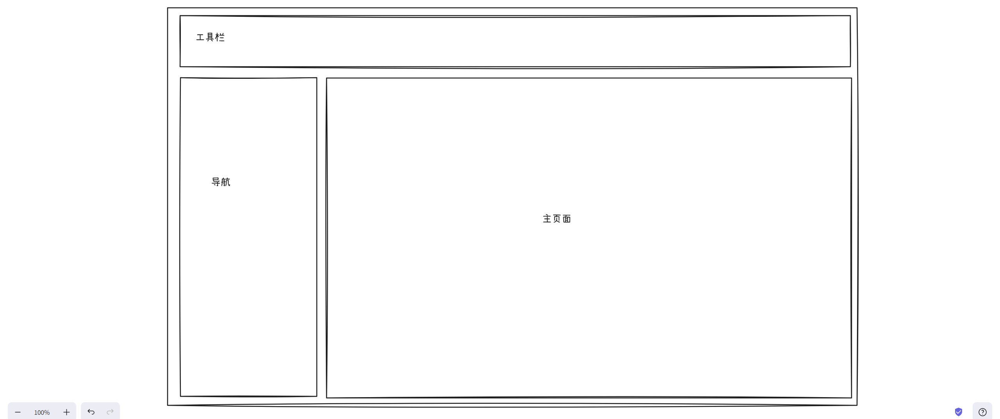

```html
stule="min-width: 1190px;" -- 当缩小到 一定宽度时，下面会出现滚动条
```

---

```html
<!DOCTYPE html>
<html lang="en">
<head>
    <meta charset="UTF-8">
    <title></title>
    <link rel="stylesheet" href="/static/css/bootstrap-5.3.8-dist/css/bootstrap.css">
    <style>
        body {
            margin: 0;
        }

        .page-header {
            height: 48px;
            min-width: 1190px;
            background-color: #6ea8fe;
        }

        .menus {
            width: 200px;
            position: absolute;
            left: 0;
            bottom: 0;
            top: 48px;
            background-color: red;
        }

        .content {
            position: absolute;
            left: 200px;
            top: 48px;
            bottom: 0;
            right: 0;
            min-width: 990px;
            background-color: yellow;
        }
    </style>
</head>
<body>
<div class="page-header"></div>
<div class="page-body">
    <div class="menus">菜单</div>
    <div class="content">内容</div>
</div>

</body>
</html>
```

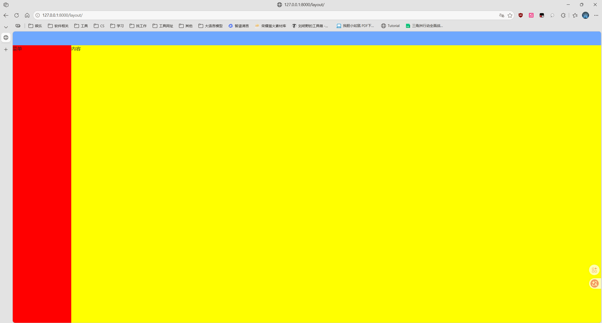

但是像上面这样写有问题：如果主页面部分有很多数据，那么会出现问题。

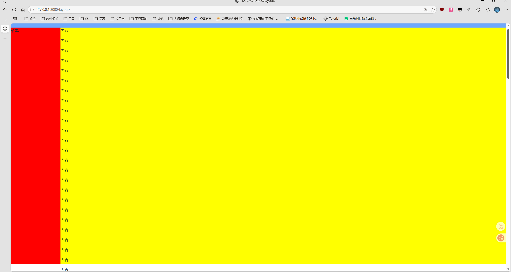如果将黄色块的颜色变成白色，又将左边导航的高度定死 -- 这是一类布局是这样写的。

```html
<!DOCTYPE html>
<html lang="en">
<head>
    <meta charset="UTF-8">
    <title></title>
    <link rel="stylesheet" href="/static/css/bootstrap-5.3.8-dist/css/bootstrap.css">
    <style>
        body {
            margin: 0;
        }

        .page-header {
            height: 48px;
            min-width: 1190px;
            background-color: #6ea8fe;
        }

        .menus {
            width: 200px;
            position: absolute;
            left: 0;
        {#bottom: 0;#} height: 500px;
            top: 48px;
            background-color: red;
        }

        .content {
            position: absolute;
            left: 200px;
            top: 48px;
            bottom: 0;
            right: 0;
            min-width: 990px;

        }
    </style>
</head>
<body>
<div class="page-header"></div>
<div class="page-body">
    <div class="menus">菜单</div>
    <div class="content">
        <p>sdadas</p>
        ...
        <p>sdadas</p>
    </div>
</div>

</body>
</html>
```

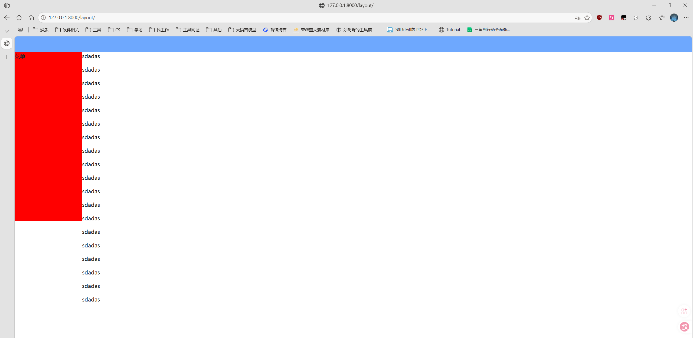

----

但我们觉得这样不好，我们想让左侧菜单永远存在，右边正文部分超过长度可以向下滚动。

```html
overflow: scroll; -- 溢出的时候出现滚轮
```

```html
<!DOCTYPE html>
<html lang="en">
<head>
    <meta charset="UTF-8">
    <title></title>
    <link rel="stylesheet" href="/static/css/bootstrap-5.3.8-dist/css/bootstrap.css">
    <style>
        body {
            margin: 0;
        }

        .page-header {
            height: 48px;
            min-width: 1190px;
            background-color: #6ea8fe;
        }

        .menus {
            width: 200px;
            position: absolute;
            left: 0;
            bottom: 0;
            top: 48px;
            background-color: red;
        }

        .content {
            position: absolute;
            left: 200px;
            top: 48px;
            bottom: 0;
            right: 0;
            min-width: 990px;
            background-color: gray;
            overflow: scroll;
        }
    </style>
</head>
<body>
<div class="page-header"></div>
<div class="page-body">
    <div class="menus">菜单</div>
    <div class="content">
        <p>sdadas</p>
        ...
        <p>f</p>
        <p>e</p>
        <p>d</p>
        <p>sdadas</p>
        <p>b</p>
        <p>a</p>
    </div>
</div>

</body>
</html>
```


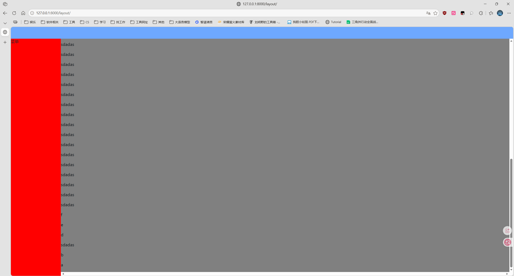

## 2.1 模板

下面就是主页面滚动 但是菜单永远在那个位置不变，以后自定义你的各部分内容即可。

```html
<!DOCTYPE html>
<html lang="en">
<head>
    <meta charset="UTF-8">
    <title></title>
    <style>
        body {
            margin: 0;
        }

        .page-header {
            height: 48px;
            min-width: 1190px;
            background-color: #6ea8fe;
        }

        .menus {
            width: 200px;
            position: absolute;
            left: 0;
            bottom: 0;
            top: 48px;
            background-color: red;
        }

        .content {
            position: absolute;
            left: 200px;
            top: 48px;
            bottom: 0;
            right: 0;
            min-width: 990px;
            background-color: gray;
            overflow: scroll;
        }
    </style>
</head>
<body>
<div class="page-header"></div>
<div class="page-body">
    <div class="menus">这里写你的菜单</div>
    <div class="content">
        <p>这里写你的主页面内容</p>
    </div>
</div>

</body>
</html>
```

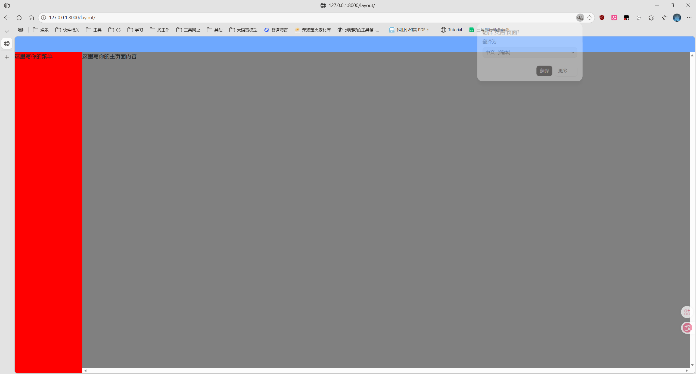

## 2.2 完成模板

```html
logo 要上下居中：给他的父标签加 line-height: 多少px;
logo 要左右居中：给自己加属性： text-align: center;
```

```css
/*layout.css*/

body {
    margin: 0;
}

.hide {
    display: none;
}

.left {
    float: left;
}

.right {
    float: right;
}

.page-header {
    height: 48px;
    min-width: 1190px;
    background-color: purple;
    line-height: 48px;
}

.page-header .logo {
    color: white;
    font-size: 18px;
    width: 200px;
    text-align: center;
    border-right: 1px solid #dddddd;
}

.page-header .rheaders a {
    display: inline-block;
    padding: 0 10px;
    color: white;
}

.page-header .rheaders a:hover {
    background-color: #0d6efd;
}

.page-header .avatar {
    padding: 0 20px;
}


.page-header .avatar img {
    border-radius: 50%;
}

.page-header .avatar .user-info {
    display: none;
    position: absolute;
    width: 150px;
    top: 48px;
    right: 0;
    border: 1px solid #dddddd;
    background-color: white;
    z-index: 100;
}

.page-header .avatar:hover .user-info {
    display: block;
}

.page-header .avatar .user-info a {
    display: block;
    margin-left: 10px;
}

.menus {
    width: 200px;
    position: absolute;
    left: 0;
    bottom: 0;
    top: 48px;
    background-color: #9eeaf9;
    border-right: 1px solid #dddddd;
}

.page-body .menus a {
    display: block;
    padding: 10px 10px;
    border-bottom: 2px solid #ffffff;
}

.content {
    position: absolute;
    left: 200px;
    top: 48px;
    bottom: 0;
    right: 0;
    min-width: 990px;
    overflow: scroll;
    z-index: 99;
}
```

```html
<!DOCTYPE html>
<html lang="en">
<head>
    <meta charset="UTF-8">
    <title></title>
    <link rel="stylesheet" href="/static/css/layout.css">
    <link rel="stylesheet" href="/static/css/bootstrap-5.3.8-dist/css/bootstrap.css">
    <link rel="stylesheet" href="/static/plugins/fontawesome-free-7.2.0-web/css/all.css">
</head>
<body>
<div class="page-header">
    <div class="logo left">这是logo</div>
	
    <div class="left">工具1</div>
    <div class="left">工具2</div>
    <div class="left">工具3</div>

    <div class="avatar right" style="position: relative;">
        
        <div class="user-info hide">
            <a>个人资料</a>
            <a>注销</a>
        </div>
    </div>
    <div class="rheaders right">
        <a><i class="fa-solid fa-comment-dots"></i> 消息</a>
        <a><i class="fa-solid fa-envelope"></i> 邮件</a>
    </div>

</div>

<div class="page-body">
    <div class="menus">
        <a><i class="fa-solid fa-school"></i> 班级管理 </a>
        <a><i class="fa-solid fa-chalkboard-user"></i> 教师管理</a>
        <a><i class="fa-solid fa-user-graduate"></i> 学生管理</a>
    </div>
    <div class="content">
        <div aria-label="breadcrumb" class="container-fluid navbar-light bg-light">
            <ol class="breadcrumb">
                <li class="breadcrumb-item"><a href="#">首页</a></li>
                <li class="breadcrumb-item"><a href="#">班级管理</a></li>
                <li class="breadcrumb-item active" aria-current="page">添加班级</li>
            </ol>
        </div>
    </div>
</div>

</body>
</html>
```

另外也要注意：shadow、modal这种类属性值、id属性值可能会与bootstrap里面的属性冲突，所以最好不要用这些。

经过修改后，以班级列表为例：只改了表面，内部还没改，看见样子即可。

```html
<!DOCTYPE html>
<html lang="en">
<head>
    <meta charset="UTF-8">
    <title></title>
    <style>
        .hide {
            display: none;
        }

        .shadowAdd {
            position: fixed;
            left: 0;
            top: 0;
            right: 0;
            bottom: 0;
            background-color: black;
            opacity: 0.4;
            z-index: 999;
        }

        .modalAdd {
            z-index: 1000;
            position: fixed;
            left: 50%;
            top: 50%;
            height: 300px;
            width: 500px;
            background-color: white;
            margin-left: -250px;
            margin-top: -150px;
        }
    </style>


    <link rel="stylesheet" href="/static/css/layout.css">
    <link rel="stylesheet" href="/static/css/bootstrap-5.3.8-dist/css/bootstrap.css">
    <link rel="stylesheet" href="/static/plugins/fontawesome-free-7.2.0-web/css/all.css">

</head>
<body>
<div class="page-header">
    <div class="logo left">这是logo</div>

    <div class="left">工具1</div>
    <div class="left">工具2</div>
    <div class="left">工具3</div>

    <div class="avatar right" style="position: relative;">
        
        <div class="user-info hide">
            <a>个人资料</a>
            <a>注销</a>
        </div>
    </div>
    <div class="rheaders right">
        <a><i class="fa-solid fa-comment-dots"></i> 消息</a>
        <a><i class="fa-solid fa-envelope"></i> 邮件</a>
    </div>

</div>

<div class="page-body">
    <div class="menus">
        <a><i class="fa-solid fa-school"></i> 班级管理 </a>
        <a><i class="fa-solid fa-chalkboard-user"></i> 教师管理</a>
        <a><i class="fa-solid fa-user-graduate"></i> 学生管理</a>
    </div>
    <div class="content">
        <div aria-label="breadcrumb" class="container-fluid navbar-light bg-light">
            <ol class="breadcrumb">
                <li class="breadcrumb-item"><a href="#">首页</a></li>
                <li class="breadcrumb-item"><a href="#">班级管理</a></li>
                {# <li class="breadcrumb-item active" aria-current="page">添加班级</li>#}
            </ol>
        </div>

        <div class="container-fluid">

            <a type="button" class="btn btn-primary btn-sm" href="/add/class/">添 加</a>
            <button type="button" class="btn btn-primary btn-sm" onclick="showModal();">模态框添加</button>

            <table class="table table-striped table-hover table-bordered border-primary" style="margin-top: 10px;">
                <thead>
                <tr>
                    <th>id</th>
                    <th>title</th>
                    <th>操作</th>
                </tr>
                </thead>
                <tbody>
                
                    <tr>
                        <td>{{ item.id }}</td>
                        <td>{{ item.title }}</td>
                        <td>
                            <a type="button" class="btn btn-primary btn-sm">详情</a>
                            <a type="button" class="btn btn-primary btn-sm"
                               href="/update/class?cid={{ item.id }}">编辑</a>
                            <a cid="{{ item.id }}" class="btn btn-primary btn-sm" type="button"
                               onclick="showUpdateModal(this);">模态编辑</a>
                            <a type="button" class="btn btn-primary btn-sm"
                               href="/delete/class?cid={{ item.id }}">删除</a>
                            <a cid="{{ item.id }}" class="btn btn-primary btn-sm" type="button"
                               onclick="ShowDeleteModal(this);" id="delete-modal">模态删除
                            </a>
                        </td>
                    </tr>
                
                </tbody>
            </table>
        </div>
    </div>
</div>


<!-- 新增数据 -- 遮罩层 模态框 -->
<div id="shadowAdd" class="shadowAdd hide">
</div>
<div id="modalAdd" class="modalAdd hide">
    <p>
        <label>
            班级名<input type="text" placeholder="班级名" name="title" id="title"/>
            <span id="error-text" style="color: red;"></span>
        </label>
    </p>

    <p>
        <button type="button" onclick="AjaxSend();">提 交</button>
        <button type="button" onclick="cancelModal();">取 消</button>
    </p>

</div>

<!-- 删除数据 -- 遮罩层 模态框 -->
<div id="shadow-delete" class="shadow hide">
</div>
<div id="modal-delete" class="modal hide">
    <p>
        {# <label>#}
        {# 班级名<input type="text" placeholder="班级名" name="title" id="title-delete"/>#}
        {# <span id="error-text-delete" style="color: red;"></span>#}
        {# </label>#}
        您正在执行删除操作，是否确认删除？
    </p>

    <p>
        <button type="button" onclick="DeleteAjaxSend();">提 交</button>
        <button type="button" onclick="DeleteCancelModal();">取 消</button>
    </p>

</div>

<!-- 编辑数据 -- 遮罩层 模态框 -->
<div id="shadow-update" class="shadow hide"></div>
<div id="modal-update" class="modal hide">
    <p>编辑班级信息</p>
    <p>
        <label>
            班级名<input type="text" placeholder="班级名" name="title" id="title-update"/>
            <input type="text" placeholder="班级名" name="title" id="title-update-id" style="display: none;"/>
            <span id="error-text-update" style="color: red;"></span>
        </label>
    </p>
    <p>
        <button type="button" onclick="updateAjaxSend();">提 交</button>
        <button type="button" onclick="updateCancelModal();">取 消</button>
    </p>
</div>

<script src="/static/js/jquery-4.0.0.min.js"></script>
<script>
    var DELETE_ID;

    /**
     * 新增班级
     */
    function showModal() {
        document.getElementById('shadowAdd').classList.remove('hide');
        document.getElementById('modalAdd').classList.remove('hide');
    }

    function AjaxSend() {
        $.ajax({
            url: '/modal/add/class/',
            type: 'post',
            data: {'title': $('#title').val()},
            success: function (response_data) {
                // 当服务端处理完毕，将数据返回到前端时该函数自动调用 response_data 是服务端返回的值
                // response_data = {status: true, code: 200, msg: 'Successfully insert data to trainee.class.'}
                // { 'status': false, 'code': 400, 'errors': '这个字段不能为空', }
                if (response_data.status) {
                    // 新增数据成功
                    // 跳转到 /class/list/
                    location.href = '/class/list/';
                } else {
                    // 新增数据失败
                    $("#error-text").text(response_data.errors)
                }
            }
        })
    }

    function cancelModal() {
        document.getElementById('shadowAdd').classList.add('hide');
        document.getElementById('modalAdd').classList.add('hide');
    }

    /**
     * 删除班级
     */
    function ShowDeleteModal(ths) {
        document.getElementById('shadow-delete').classList.remove('hide');
        document.getElementById('modal-delete').classList.remove('hide');
        DELETE_ID = $(ths).attr('cid');
    }


    function DeleteAjaxSend() {
        $.ajax({
            url: '/modal/delete/class?cid=' + DELETE_ID,
            type: 'get',
            data: {},
            success: function (response_data) {
                if (response_data.status) {
                    // 成功
                    location.reload();
                } else {
                    // 失败
                    alert(response_data.errors);
                }
            }
        })
    }

    function DeleteCancelModal() {
        document.getElementById('shadow-delete').classList.add('hide');
        document.getElementById('modal-delete').classList.add('hide');
    }

    /**
     * 编辑班级
     */
    function showUpdateModal(ths) {
        document.getElementById('shadow-update').classList.remove('hide');
        document.getElementById('modal-update').classList.remove('hide');

        /**
         * 获取当前标签
         * 获取当前标签的父标签
         * 获取当前标签的父标签的两个兄弟标签
         * <tr>
         *   <td>1</td> ---------------------------------------------------------------> 要找这两个标签
         *   <td>全栈一期</td> ---------------------------------------------------------> 要找这两个标签
         *   <td> ---------------------------------------------------------------------> 这是点击标签的父标签
         *       <button type="button">详情</button>                                             ^
         *       <button type="button" href="/update/class?cid=1">编辑</button>                  |
         *       <button cid="1" type="button" onclick="showUpdateModal();">模态编辑</button> -- 这是我们点击的那个标签
         *       <button type="button" href="/delete/class?cid=1">删除</button>
         *       <button cid="1" type="button" onclick="ShowDeleteModal();" id="delete-modal">模态删除
         *       </button>
         *   </td>
         * </tr>
         * 获取班级当前行的 id 当前班级名称 赋值给对话框中
         */

            // 当前标签 $(ths); 当前标签的父标签 $(ths).parent(); 前两个 $(ths).parent().prevAll();
            // 注意不能用$(ths).parent().siblings(),因为如果 $(ths).parent() 后面还有标签的话也会获取到，那就不对了.
            // 另外要注意 $(ths).parent().prevAll(); 获取到的 td 标签是从下往上的吗，即先获取了 <td>全栈一期</td> 再获取了 <td>1</td>
        var v = $(ths).parent().prevAll();
        var content = $(v[0]).text();
        $('#title-update').val(content);

        // 获取到班级ID
        var contentID = $(v[1]).text();
        $('#title-update-id').val(contentID);
    }

    function updateAjaxSend() {
        var cid = $('#title-update-id').val();
        var ctitle = $('#title-update').val();

        $.ajax({
            url: '/modal/update/class/',
            type: 'post',
            data: {'cid': cid, 'ctitle': ctitle},
            dataType: 'json',
            success: function (response_data) {
                if (response_data.status) {
                    // 成功
                    // JSON.parse('字符串'); // 将json字符串转换成对象
                    // JSON.stringify(json对象); // 将json对象转换成json串
                    // location.href = '/class/list/';
                    location.reload();  // 刷新当前页面
                } else {
                    // 失败
                    $('#error-text-update').text(response_data.errors);
                }
            }
        })
    }

    function updateCancelModal() {
        document.getElementById('shadow-update').classList.add('hide');
        document.getElementById('modal-update').classList.add('hide');
    }
</script>

</body>
</html>

```

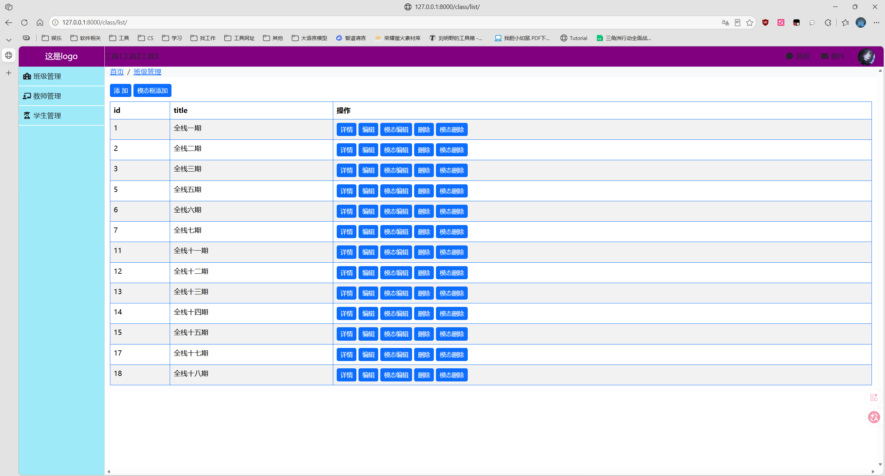

---

这样做，如果要应用到别的地方，那么如果这样写，每次都要手动复制过去，很麻烦。

## 2.3 模板的优化 -- 可继承

```html
<!DOCTYPE html>
<html lang="en">
<head>
    <meta charset="UTF-8">
    <title></title>

    <link rel="stylesheet" href="/static/css/layout.css">
    <link rel="stylesheet" href="/static/css/bootstrap-5.3.8-dist/css/bootstrap.css">
    <link rel="stylesheet" href="/static/plugins/fontawesome-free-7.2.0-web/css/all.css">
    
</head>
<body>
<div class="page-header">
    <div class="logo left">这是logo</div>

    <div class="left">工具1</div>
    <div class="left">工具2</div>
    <div class="left">工具3</div>

    <div class="avatar right" style="position: relative;">
        
        <div class="user-info hide">
            <a>个人资料</a>
            <a>注销</a>
        </div>
    </div>
    <div class="rheaders right">
        <a><i class="fa-solid fa-comment-dots"></i> 消息</a>
        <a><i class="fa-solid fa-envelope"></i> 邮件</a>
    </div>

</div>

<div class="page-body">
    <div class="menus">
        <a><i class="fa-solid fa-school"></i> 班级管理 </a>
        <a><i class="fa-solid fa-chalkboard-user"></i> 教师管理</a>
        <a><i class="fa-solid fa-user-graduate"></i> 学生管理</a>
    </div>
    <div class="content">
        <div aria-label="breadcrumb" class="container-fluid navbar-light bg-light myBrandNav">
            <ol class="breadcrumb">
                <li class="breadcrumb-item"><a href="#">首页</a></li>
                <li class="breadcrumb-item"><a href="#">班级管理</a></li>
                <li class="breadcrumb-item active" aria-current="page">添加班级</li>
            </ol>
        </div>

        <div class="container-fluid">
            
            
        </div>
    </div>
</div>



</body>
</html>
```

```html
body {
    margin: 0;
}

.hide {
    display: none;
}

.left {
    float: left;
}

.right {
    float: right;
}

.page-header {
    height: 48px;
    min-width: 1190px;
    background-color: purple;
    line-height: 48px;
}

.page-header .logo {
    color: white;
    font-size: 18px;
    width: 200px;
    text-align: center;
    border-right: 1px solid #dddddd;
}

.page-header .rheaders a {
    display: inline-block;
    padding: 0 10px;
    color: white;
}

.page-header .rheaders a:hover {
    background-color: #0d6efd;
}

.page-header .avatar {
    padding: 0 20px;
}


.page-header .avatar img {
    border-radius: 50%;
}

.page-header .avatar .user-info {
    display: none;
    position: absolute;
    width: 150px;
    top: 48px;
    right: 0;
    border: 1px solid #dddddd;
    background-color: white;
    z-index: 100;
}

.page-header .avatar:hover .user-info {
    display: block;
}

.page-header .avatar .user-info a {
    display: block;
    margin-left: 10px;
}

.menus {
    width: 200px;
    position: absolute;
    left: 0;
    bottom: 0;
    top: 48px;
    background-color: #9eeaf9;
    border-right: 1px solid #dddddd;
}

.page-body .menus a {
    display: block;
    padding: 10px 10px;
    border-bottom: 2px solid #ffffff;
}

.content {
    position: absolute;
    left: 200px;
    top: 48px;
    bottom: 0;
    right: 0;
    min-width: 990px;
    overflow: scroll;
    z-index: 99;
}

.page-body .content .myBrandNav {
    height: 35px;
}

.page-body .content .myBrandNav ol {
    line-height: 35px;
}
```

```html



    <style>
        .hide {
            display: none;
        }

        .shadow {
            left: 0;
            right: 0;
            top: 0;
            bottom: 0;
            position: fixed;
            background-color: black;
            opacity: 0.4;
            z-index: 999;
        }

        .modal {
            z-index: 1000;
            width: 400px;
            height: 300px;
            position: fixed;
            left: 50%;
            top: 50%;
            margin-left: -200px;
            margin-top: -250px;
            background-color: white;
        }
    </style>



    <a href="/add/student/">添 加</a>
    <button type="button" id="add-modal-student">模态框添加</button>

    <table border="1">
        <thead>
        <tr>
            <th>编号</th>
            <th>姓名</th>
            <th>所属班级</th>
            <th>操作</th>
        </tr>
        </thead>
        <tbody>
        
            <tr>
                <td>{{ item.id }}</td>
                <td>{{ item.name }}</td>
                <td>{{ item.title }}</td>
                <td>
                    <a href="">详情</a>
                    <a href="/update/student?sid={{ item.id }}">编辑</a>
                    <a class="updateButtonUpdate" cid="{{ item.class_id }}" sname="{{ item.name }}" sid="{{ item.id }}">模态框编辑</a>
                    <a href="/delete/student?sid={{ item.id }}">删除</a>
                </td>
            </tr>
        
        </tbody>
    </table>

    {# 新增学生 模态框 #}
    <div id="shadow" class="shadow hide"></div>
    <div id="modalAdd" class="modal hide">
        <h3>添加学生</h3>
        <p>
            <label for="addNameInput">姓 名</label>
            <input type="text" id="addNameInput" name="addName">
        </p>
        <span style="color: red;" id="errorInName"></span>

        <p>
            <label for="addClassChoice">班级</label>
            <select id="addClassChoice" name="selectClass">
                <option selected style="text-align: center;">---</option>
                
                    <option style="text-align: center;" value="{{ item.id }}">{{ item.title }}</option>
                
            </select>
            <span style="color: red;" id="errorInClassSelected"></span>
        </p>

        <p>
            <button type="button" id="addStudentSubmit">提 交</button>
            <button type="button" id="addStudentCancel">取 消</button>
        </p>
    </div>

    {# 编辑学生信息 模态框 #}
    <div id="shadowUpdate" class="shadow hide"></div>
    <div id="modalUpdate" class="modal hide">
        <h3>编辑学生信息</h3>
        <p>
            <label for="updateNameInput">姓 名</label>
            <input type="text" id="updateNameInput" name="updateName">
            <input type="text" id="updateNameInputId" name="updateNameId" style="display: none;">
        </p>
        <span style="color: red;" id="errorInNameUpdate"></span>

        <p>
            <label for="updateClassChoice">班级</label>
            <select id="updateClassChoice" name="selectClass">
                
                    <option style="text-align: center;" value="{{ item.id }}">{{ item.title }}</option>
                
            </select>
            <span style="color: red;" id="errorInClassSelectedUpdate"></span>
        </p>

        <p>
            <button type="button" id="updateStudentSubmit">提 交</button>
            <button type="button" id="updateStudentCancel">取 消</button>
        </p>
    </div>




    <script src="/static/js/jquery-4.0.0.min.js"></script>

    <script>
        // 当页面框架加载完毕执行
        $(function () {
            // 给 模态框新增学生绑定一个事件
            clickAddModalNewEvent();

            // 给 模态框编辑学生信息绑定一个事件
            clickUpdateModalNewEvent();
        })

        function clickAddModalNewEvent() {
            $('#add-modal-student').click(function () {
                // 只要点击相关标签就执行此函数体里面的内容
                $('#shadow,#modalAdd').removeClass('hide');
            });
            $('#addStudentSubmit').click(function () {
                // 点击模态框的提交按钮后执行此函数体内的代码
                $.ajax({
                    url: '/modal/add/student/',
                    type: 'POST',
                    dataType: 'json',
                    data: {
                        'name': $('#addNameInput').val(),
                        'class_id': $('#addClassChoice').val(),
                    },
                    success: function (res) {
                        if (res.status) {
                            // 成功添加
                            location.reload();
                        } else {
                            // 添加失败
                            if (res.code == 400) {
                                $('#errorInName').text(res.errors);
                            } else {
                                $('#errorInClassSelected').text(res.errors);
                            }
                        }
                    }
                })
            });

            $('#addStudentCancel').click(function () {
                // 点击模态框的取消按钮后执行此函数体内的代码
                document.getElementById('shadow').classList.add('hide');
                document.getElementById('modalAdd').classList.add('hide');
            });
        }

        function clickUpdateModalNewEvent() {
            // 弹出模态框
            $('.updateButtonUpdate').click(function () {
                $('#shadowUpdate,#modalUpdate').removeClass('hide');

                // 将残留的错误信息删掉
                $('#errorInNameUpdate').empty();
                $('errorInClassSelectedUpdate').text('');

                // 给输入框赋值
                // 当前标签
                var cid = $(this).attr('cid');
                var sname = $(this).attr('sname');
                var sid = $(this).attr('sid');

                $('#updateNameInputId').val(sid);
                $('#updateNameInput').val(sname);
                $('#updateClassChoice').val(cid);

            })

            // 点击取消让模态框消失
            $('#updateStudentCancel').click(function () {
                $('#shadowUpdate,#modalUpdate').addClass('hide');
            })

            $('#updateStudentSubmit').click(function () {
                // 输入好信息后发送Ajax请求到后端
                $.ajax({
                    url: '/modal/update/student/',
                    type: 'POST',
                    dataType: 'json',
                    data: {
                        'sname': $('#updateNameInput').val(),
                        'sid': $('#updateNameInputId').val(),
                        'cid': $('#updateClassChoice').val(),
                    },
                    success: function (data) {
                        if (data.status) {
                            location.reload();
                        } else {
                            $('#errorInNameUpdate').text(data.msg);
                        }
                    }
                })
            })

        }
    </script>


```

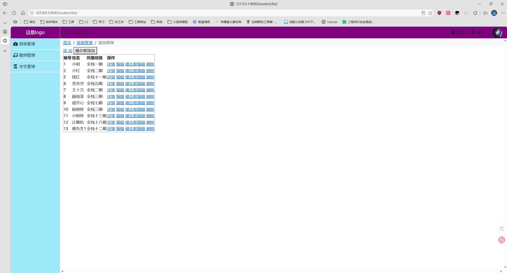

---

最后再修改一下：

`layout.html`:

```html
<!DOCTYPE html>
<html lang="en">
<head>
    <meta charset="UTF-8">
    <title></title>


    <link rel="stylesheet" href="/static/css/bootstrap-5.3.8-dist/css/bootstrap.css">
    <link rel="stylesheet" href="/static/plugins/fontawesome-free-7.2.0-web/css/all.css">
    <link rel="stylesheet" href="/static/css/layout.css">
    
</head>
<body>

<div class="my-page-header">
    <div class="my-logo my-left">
        <a class="navbar-brand" href="#">
             啥啥啥有限公司
        </a>
    </div>

    <div class="my-left my-tools-li">
        <a><i class="fa-solid fa-file"></i> 文件</a>
    </div>
    <div class="my-left my-tools-li">
        <a><i class="fa-solid fa-screwdriver-wrench"></i> 工具2</a>
    </div>
    <div class="my-left my-tools-li">
        <a><i class="fa-solid fa-calculator"></i> 工具3</a>
    </div>

    <div class="my-avatar my-right" style="position: relative;">
        
        <div class="my-user-info my-hide">
            <a type="button" class="btn my-before-hr-info" href="#">个人资料</a>
            <a type="button" class="btn my-before-hr-info" href="#">设置中心</a>
            <hr class="my-hr-user-info">
            <a class="btn my-below-hr-info">注销</a>
        </div>
    </div>
    <div class="my-rheaders my-right">
        <a><i class="fa-solid fa-comment-dots"></i> 消息</a>
        <a><i class="fa-solid fa-envelope"></i> 邮件</a>
    </div>

</div>

<div class="my-page-body">
    <div class="my-menus">
        <a class="btn"><i class="fa-solid fa-school"></i> 班级管理 </a>
        <a class="btn"><i class="fa-solid fa-chalkboard-user"></i> 教师管理</a>
        <a class="btn"><i class="fa-solid fa-user-graduate"></i> 学生管理</a>
    </div>
    <div class="my-content">
        <div aria-label="breadcrumb" class="container-fluid navbar-light bg-light myBrandNav">
            <ol class="breadcrumb">
                <li class="breadcrumb-item"><a href="#">首页</a></li>
                <li class="breadcrumb-item"><a href="#">班级管理</a></li>
                <li class="breadcrumb-item active" aria-current="page">添加班级</li>
            </ol>
        </div>

        <div class="container-fluid">
            
            
        </div>
    </div>
</div>



</body>
</html>
```

`layout.css`:

```css
body {
    margin: 0;
}

.my-hide {
    display: none;
}

.my-left {
    float: left;
}

.my-right {
    float: right;
}

.my-page-header {
    height: 48px;
    min-width: 1190px;
    background-color: purple;
    /*background-color: rgb(13,202,250);*/
    line-height: 48px;
}

.my-page-header .my-logo {
    color: white;
    font-size: 18px;
    width: 200px;
    text-align: center;
    border-right: 1px solid gray;
}

.my-page-header .my-rheaders a {
    display: inline-block;
    padding: 0 10px;
    color: white;
    border-radius: 5px;
}

.my-page-header .my-rheaders a:hover {
    background-color: #0d6efd;
}

.my-page-header .my-avatar {
    padding: 0 20px;
}


.my-page-header .my-avatar img {
    width: 40px;
    height: 40px;
    border-radius: 50%;
    margin-bottom: 4px;
}

.my-page-header .my-avatar .my-user-info {
    display: none;
    position: absolute;
    width: 150px;
    top: 50px;
    right: 18px;
    border: 1px solid #dddddd;
    background-color: white;
    z-index: 100;
    border-radius: 5px;
}

.my-page-header .my-avatar:hover .my-user-info {
    display: block;
}

.my-page-header .my-avatar .my-user-info .my-before-hr-info {
    display: block;
    height: 36px;
}

.my-page-header .my-avatar .my-user-info .my-hr-user-info {
    height: 1px;
    margin-top: 8px;
    margin-bottom: 1px;
}

.my-page-header .my-avatar .my-user-info .my-below-hr-info {
    display: block;
    margin-top: 1px;
}

.my-menus {
    width: 200px;
    position: absolute;
    left: 0;
    bottom: 0;
    top: 48px;
    background-color: #9eeaf9;
    border-right: 1px solid #dddddd;
}

.my-page-body .my-menus a {
    display: block;
    padding: 10px 10px;
    border-bottom: 2px solid #ffffff;
}

.my-content {
    position: absolute;
    left: 200px;
    top: 48px;
    bottom: 0;
    right: 0;
    min-width: 990px;
    overflow: scroll;
    z-index: 99;
}

.my-page-body .my-content .my-myBrandNav {
    height: 35px;
}

.my-page-body .my-content .myBrandNav ol {
    line-height: 35px;
}


.my-page-header .my-logo a img {
    width: 40px;
    height: 40px;
    border-radius: 50%;
    margin-right: 10px;
    margin-bottom: 4px;
}

.my-page-header .my-logo a {
    color: #31d2f2;
    font-size: 15px;
}

.my-page-header .my-tools-li a {
    display: inline-block;
    color: white;
    padding: 0 15px;
    border-radius: 5px;
}

.my-page-header .my-tools-li a:hover {

    background-color: #0d6efd;
}
```

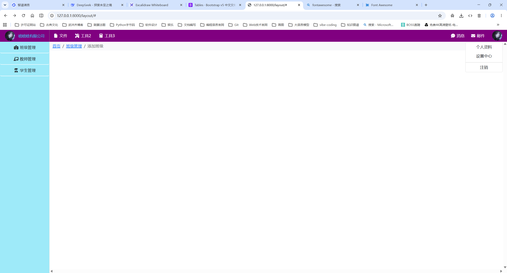

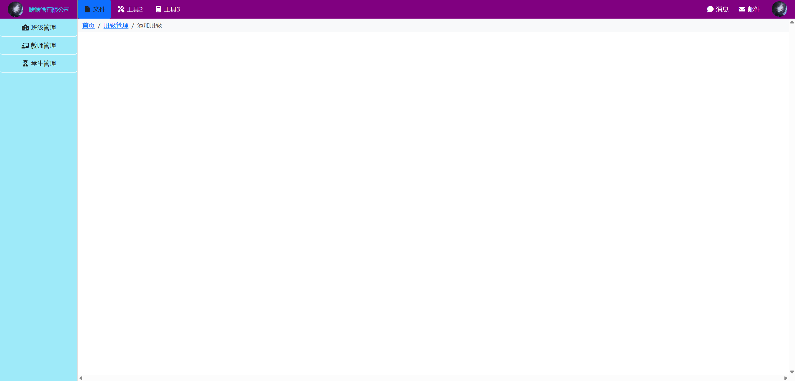

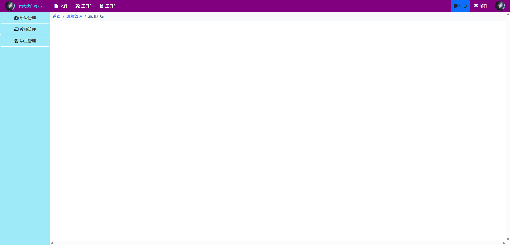

# 3. cookie

`cookie` 是**保存在用户浏览器端**的**键值对**。

cookie：

- 保存在浏览器端的键值对 
- 服务端可以向浏览器写 `cookie`
- 客户端每次发请求时都会携带 `cookie` 去

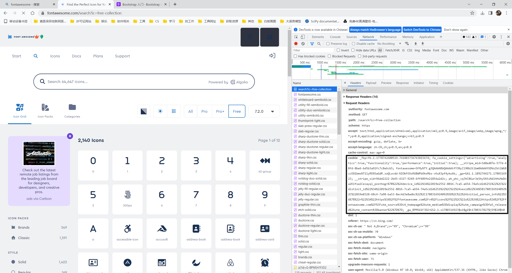

cookie 的应用：

1. 投票
2. 用户登录

## 3.1 cookie 小试牛刀

```python
# 视图函数
def login(request):
    if request.method == 'GET':
        return render(request, 'login.html')
    name = request.POST.get('name')
    password = request.POST.get('password')
    if name == 'jack' and password == '123456':
        # 登录成功
        obj = redirect('/class/list/')
        obj.set_cookie('ticket', 'a-random-string')
        return obj
    else:
        return render(request, 'login.html')
```

```python
# 视图函数 - 访问页面检查是否有 cookie 如果没有就不让访问
def class_list(request):
    # 去请求中的 cookie 中获取凭证 有凭证则允许访问 否则直接重定向回登录页面
    tk = request.COOKIES.get('ticket')
    if not tk:
        return redirect('/login/')

    # 连接数据库 获取所有数据
    ...
    return render(request, 'class_list.html', {'data': data})
```

```html
<!DOCTYPE html>
<html lang="en">
<head>
    <meta charset="UTF-8">
    <title>Login</title>
    <link rel="stylesheet" href="/static/css/bootstrap-5.3.8-dist/css/bootstrap.css">
    <link rel="stylesheet" href="/static/plugins/fontawesome-free-7.2.0-web/css/all.css">
</head>
<body>
<div class="container">
    {#<div class="card" style="width: 500px; margin: 0 auto;">#}
    <!-- 让 card 在 container 里面居中 上面的方式和下面的方式都可以  -->
    <div class="card mx-auto mt-5" style="width: 450px;">
        <div class="card-header">
            用户登录
        </div>
        <div class="card-body">
            <form action="/login/" method="post" novalidate>
                <div class="mb-3">
                    <label for="exampleInputEmail1" class="form-label">用户名</label>
                    <input type="text" class="form-control" id="exampleInputEmail1" name="name" placeholder="用户名">
                </div>
                <div class="mb-3">
                    <label for="exampleInputPassword1" class="form-label">密码</label>
                    <input type="password" class="form-control" id="exampleInputPassword1" name="password"
                           placeholder="密码">
                </div>
                <div class="text-end">
                    <button type="submit" class="btn btn-primary">提 交</button>
                </div>
            </form>
        </div>
    </div>
</div>
</body>
</html>
```

## 3.2 set_cookie 方法

```python
def set_cookie(
    self,
    key,
    value="",
    max_age=None,
    expires=None,
    path="/",
    domain=None,
    secure=False, # Https
    httponly=False,  # 只能在 Http 请求中传入 Js代码无法获取到
    samesite=None,
): 
# max_age: 设置超时时间 单位为秒
# expires参数: 可以写具体超时的日期
# path参数: 指定url才能访问set的cookie 默认为/,所有路径都能访问
# domain: 可以访问到cookie的域名
```

## 3.3 cookie签名

```python
def class_list(request):
    # # 去请求中的 cookie 中获取凭证 有凭证则允许访问 否则直接重定向回登录页面
    # tk = request.COOKIES.get('ticket')
    # if not tk:
    #     return redirect('/login/')

    tk = request.get_signed_cookie('ticket', salt='salt random string')
    print(tk)  # random string

    if not tk:
        return redirect('/login/')
    data = ...
    return render(request, 'class_list.html', {'data': data})
```

```python
def login(request):
    if request.method == 'GET':
        return render(request, 'login.html')
    name = request.POST.get('name')
    password = request.POST.get('password')
    if name == 'jack' and password == '123456':
        # 登录成功
        # redirect HttpResponse render 都有这种写法
        obj = redirect('/class/list/')
        # # max_age: 设置超时时间 单位为秒
        # # expires参数: 可以写具体超时的日期
        # # path参数: 指定url才能访问set的cookie 默认为/,所有路径都能访问
        # # domain: 可以访问到cookie的域名
        # obj.set_cookie(
        #     'ticket',
        #     'fd9s8ds955541gtjukjuiu1sa5d616a5sd6as165as16516f5e14fsfsdsfddfsytgn',
        #     max_age=10
        # )

        obj.set_signed_cookie(
            'ticket',
            'random string',
            salt='salt random string'
        )
        return obj
    else:
        return render(request, 'login.html')
```

也可以自定义签名。


