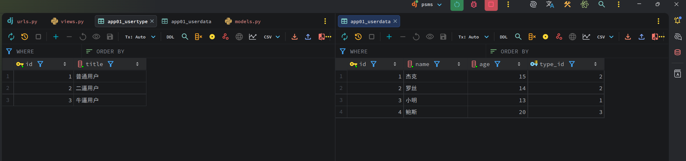
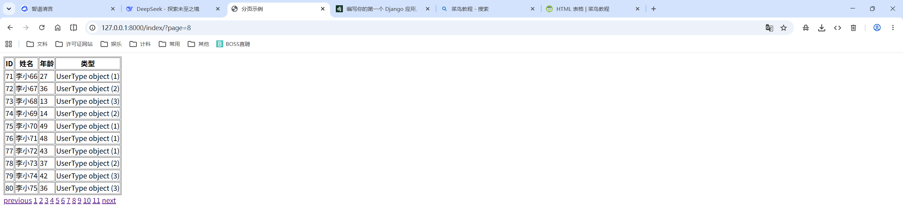
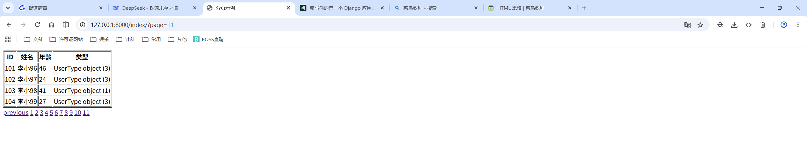
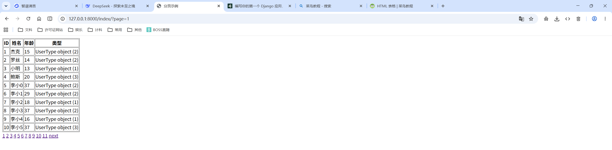

<h1 style="text-align: center;font-size: 40px; font-family: Source Code Pro;">day-07. Django</h1>

[TOC]

今日内容概要：

- `CBV`
- `Django ORM`
- 分页
  - `Django` 自带分页 但是有不好的地方
  - 自己写: 自定义分页

# 1. `CBV`

```python
path('login/', views.LoginView.as_view()),  # 特殊写法 就得这么写
```

```python
from django.shortcuts import render, HttpResponse
from django.views import View
from django.views.decorators.csrf import csrf_exempt
from django.utils.decorators import method_decorator


# Create your views here.

def home(request):
    return HttpResponse("Hello World")


# 类视图的 csrf 豁免: @method_decorator(csrf_exempt, name='dispatch')

@method_decorator(csrf_exempt, name='dispatch')
class LoginView(View):
	"""
    'get', -- 查找
    'post', -- 创建
    'put', -- 全部更新
    'patch', -- 局部更新
    'delete',
    'head',
    'options',
    'trace',
    """
    
    def get(self, request):
        """客户端发来的如果是 GET 请求, 执行此 get 方法"""
        return HttpResponse("Hello, get method.")
	
    def post(self, request):
        """客户端发来的如果是 POST 请求, 执行此 post 方法"""
        return HttpResponse("Hello, post method.")
```

在 View 这个父类内部，其实是优先去执行 dispatch 方法的,执行完dispatch后拿到方法然后做了一个反射：

```python
def dispatch(self, request, *args, **kwargs):
    # Try to dispatch to the right method; if a method doesn't exist,
    # defer to the error handler. Also defer to the error handler if the
    # request method isn't on the approved list.
    if request.method.lower() in self.http_method_names:
        handler = getattr(
            self, request.method.lower(), self.http_method_not_allowed
        )
    else:
        handler = self.http_method_not_allowed
    return handler(request, *args, **kwargs)
```

根据上述知识，我们可以这样写：

```python
@method_decorator(csrf_exempt, name='dispatch')
class LoginView(View):
    """
    'get', -- 查找
    'post', -- 创建
    'put', -- 全部更新
    'patch', -- 局部更新
    'delete',
    'head',
    'options',
    'trace',
    """

    def dispatch(self, request, *args, **kwargs):
        """这里起到了一个类似于装饰器的功能, 在执行 get/post 方法前后对函数行为进行一个修改，这在批量操作时很方便."""
        print('before')
        obj = super(LoginView, self).dispatch(request, *args, **kwargs)
        print('after')
        return obj

    def get(self, request):
        """客户端发来的如果是 GET 请求, 执行此 get 方法"""
        print('get')
        return HttpResponse("Hello, get method.")

    def post(self, request):
        """客户端发来的如果是 POST 请求, 执行此 post 方法"""
        return HttpResponse("Hello, post method.")
```

# 2. `Django ORM`

```python
from django.db import models


# Create your models here.


class UserType(models.Model):
    """
    用户类型
    """
    title = models.CharField(max_length=10, verbose_name='标题')


class UserData(models.Model):
    name = models.CharField(verbose_name='用户名', max_length=12)
    age = models.IntegerField(verbose_name='年龄')
    type = models.ForeignKey('UserType', on_delete=models.SET_NULL, verbose_name='用户类型', null=True)

```

```python
def home(request):
    # # 创建数据
    # models.UserType.objects.create(title='普通用户')
    # models.UserType.objects.create(title='二逼用户')
    # models.UserType.objects.create(title='牛逼用户')

    # models.UserData.objects.create(name='杰克', age=15, type_id=2)
    # models.UserData.objects.create(name='罗丝', age=14, type_id=2)
    # models.UserData.objects.create(name='小明', age=13, type_id=1)
    # models.UserData.objects.create(name='鲍斯', age=20, type_id=3)

    # # 获取数据
    # # 跨表操作
    # query_set = models.UserData.objects.all()
    # for obj in query_set:
    #     # obj.type 是 UserType object (2) 类型的数据
    #     # print(obj.name, obj.age, obj.type_id)  # 杰克 15 2
    #     print(obj.name, obj.age, obj.type.title)  # 小明 13 普通用户

    # obj = models.UserData.objects.all().first()  # obj 是一个 UserData 对象
    # print(obj.name, obj.age, obj.type.title)  # 杰克 15 二逼用户

    # # 反向查找 -- 跨表
    # obj = models.UserType.objects.all().first()
    # print(obj.id, obj.title, obj.userdata_set)  # 1 普通用户 app01.UserData.None
    # print(obj.id, obj.title, obj.userdata_set.all())  # 1 普通用户 <QuerySet [<UserData: UserData object (3)>]>
    # for user_data_obj in obj.userdata_set.all():  # obj.userdata_set.all(): 查找属于UserType类型的所有用户
    #     print(user_data_obj.id, user_data_obj.name, user_data_obj.age)  # 3 小明 13

    # res = models.UserType.objects.all()
    # for obj in res:
    #     print(obj.title, obj.userdata_set.filter(name='小明', age=13).first())
    # # # 上述运行结果入下:
    # # 普通用户 UserData object (3)
    # # 二逼用户 None
    # # 牛逼用户 None

    # # res 类型: 还是 QuerySet 类型,但是里面不再是一个个对象,而是一个个字典
    # # QuerySet[{'id': 1, 'name': 'jack'}, {'id': 2, 'rose': 'jack'},{'id': 3, 'name': 'xiaoming'}]
    # res = models.UserData.objects.all().values('id', 'name')
    #
    # # res 类型: 还是 QuerySet 类型,但是里面不再是一个个对象,而是一个个字典
    # # QuerySet[{'id': 1, 'name': 'jack'}, {'id': 2, 'rose': 'jack'},{'id': 3, 'name': 'xiaoming'}]
    # res = models.UserData.objects.values('id', 'name')

    # # <QuerySet [(1, '杰克'), (2, '罗丝'), (3, '小明'), (4, '鲍斯')]>
    # res = models.UserData.objects.values_list('id', 'name')
    # # <QuerySet [(1, '杰克'), (2, '罗丝'), (3, '小明'), (4, '鲍斯')]>
    # res = models.UserData.objects.all().values_list('id', 'name')

    # # 这里要注意: 要获取UserType, 不能用 type.title, 而是要用 type__title
    # # <QuerySet [{'id': 1, 'name': '杰克', 'type__title': '二逼用户'},
    # # {'id': 2, 'name': '罗丝', 'type__title': '二逼用户'}, ...]>
    # res = models.UserData.objects.values('id', 'name', 'type__title')

    return HttpResponse("Hello World")
```



# 3. 分页

分批获取数据：

```python
models.UserData.objects.all()[0:10]  # 类似于列表的切片 前闭后开
models.UserData.objects.all()[10:20]
```

## 3.1 `Django`自带分页

只适合做上一页下一页,要想实现只展示当前页码前后的几条数据 -- 是无法实现的，需要自己做二次开发。

并且只能在Django中开发，无法在其他的框架、语言中使用。

```python
def index(request):
    cur_page = request.GET.get('page', '1')
    # Django自带分页
    from django.core.paginator import Paginator, Page, PageNotAnInteger, EmptyPage
    query_set = models.UserData.objects.all()
    paginator = Paginator(query_set, per_page=10)
    # paginator.per_page: 每页显示多少条
    # paginator.count: 数据总条数
    # paginator.number_pages: 总页数
    # paginator.page_range: 总页数的索引范围, 如: (1, 10)
    # paginator.page: page 对象
    try:
        posts = paginator.page(number=cur_page)  # number 用于控制当前显示第几页
    except (PageNotAnInteger, EmptyPage):
        posts = paginator.page(1)
    # posts.has_next: 是否有下一页
    # posts.next_page_number: 下一页页码
    # posts.has_previous: 是否有上一页
    # posts.previous_page_number: 上一页页码
    # posts.object_list: 分页之后的数据列表
    # posts.number: 当前页
    # posts.paginator: paginator 对象
    return render(request, 'index.html', {'posts': posts})
```

```html
<!DOCTYPE html>
<html lang="en">
<head>
    <meta charset="UTF-8">
    <title>分页示例</title>
</head>
<body>

<table border>
    <thead>
    <tr>
        <th>ID</th>
        <th>姓名</th>
        <th>年龄</th>
        <th>类型</th>
    </tr>
    </thead>

    <tbody>
    
        <tr>
            <td>{{ item.id }}</td>
            <td>{{ item.name }}</td>
            <td>{{ item.age }}</td>
            <td>{{ item.type }}</td>
        </tr>
    
    </tbody>
</table>

<div>

    
        <a href="?page={{ posts.previous_page_number }}">previous</a>
    

    
        <a href="?page={{ page }}">{{ page }}</a>
    

    
        <a href="?page={{ posts.next_page_number }}">next</a>
    
</div>
</body>
</html>
```







## 3.2 自己开发分页

```python
from django.utils.safestring import mark_safe


class Pagination:
    """
    ┌─────────────────────────────────────────────────────────────────────────────────┐
    │ 自定义 bootstrap 分页组件                                                         │
    └─────────────────────────────────────────────────────────────────────────────────┘
    展示效果:
    ┌──────┬─────┬─────┬─────┬─────┬─────┬─────┬─────┬──────┐    ┌───────────────┬────┐
    │ Prev │  1  │  2  │  3  │  4  │  5  │  6  │  7  │ Next │    │  1            │ Go │
    └──────┴─────┴─────┴─────┴─────┴─────┴─────┴─────┴──────┘    └───────────────┴────┘

    如何使用:
    1. 在你的视图模块中:
        ```python
        #导入 Pagination 类
        from ... import Pagination


        def your_view(request):
            # 查询你的所有需要展示的数据
            need_show_objs = models.User.objects.all()
			
            # 分页
            paginator = Pagination(request, need_show_objs)

            return render(
                request,
                'your_show_html_files.html',
                {
                    'query_sets': paginator.query_sets,  # 这个值是必须的, 需要传到前端进行数据展示
                    'html_string': paginator.html,  # 这个是必须传的, 分页组件
                }
            )

```
    2. 在你的前端 HTML 文件中:
        ```html
        ...
    	<table>
    		在你想展示的地方循环展示数据.
    	</table>
        ...
            <div class="row">
                {{html_string}}
            </div>
        ...
    
        ```
    """
    
    def __init__(
            self,
            request,
            query_sets,
            page_size: int = 10,
            total_page_block: int = 7,
            page_prev: int = 3,
    ):
        """初始化一些数据
    
        Args:
            request (): 请求对象
            query_sets (): 获取到的所有符合条件的,需要分页的数据
            page_size (): 每一页展示多少条数据,默认 10 条
            total_page_block (): 一个分页条展示多少个页码块,默认 7 块
            page_prev (): 当前页码块前面要显示几块,通过 此参数和total_page_block 可以计算出当前页码块后面需要显示几块
                默认前面显示 3 块,后面显示 3 块,总共 7 块.
        """
        self.all_nums = query_sets.count()
        self.cur_page = int(request.GET.get('page', 1))
        self.page_size = page_size
        self.total_page_block = total_page_block
        self.page_prev = page_prev
        self.page_next = self.total_page_block - self.page_prev - 1
        self.start = (self.cur_page - 1) * self.page_size
        self.end = self.start + self.page_size
    
        # 计算一共有几页
        count = self.all_nums // self.page_size
        if self.all_nums % page_size == 0:  # 正好全部分页都有 page_size 条数据
            self.total_pages = count
        else:  # 最后一页不足 page_size 条数据
            self.total_pages = count + 1
    
        if self.cur_page < self.total_pages:
            # 前面的每一页都有 page_size 条数据
            self.query_sets = query_sets[self.start:self.end]
        else:
            # 最后一页可能不足 page_size 条数据, 需要另做计算
            self.query_sets = query_sets[self.start:self.all_nums]
    
    @property
    def html(self):
        # 计算前面需要展示几个分页块
        total_lst = [i + 1 for i in range(self.total_pages)]
    
        if self.total_pages <= self.total_page_block:
            # 总页数小于用户可点击的页数 直接将其全部返回
            show_lst = total_lst
        else:
            left_page = self.cur_page - self.page_prev
            right_need_add = 0
            if left_page <= 0:
                right_need_add = -left_page + 1
    
            left_need_add = 0
            right_page = self.cur_page + self.page_next
            if right_page > self.total_pages:
                left_need_add = right_page - self.total_pages
    
            left_offset = (left_page if left_page > 0 else 1) - left_need_add
            right_offset = (right_page if right_page <= self.total_pages else self.total_pages) + right_need_add
            show_lst = total_lst[left_offset - 1:right_offset]
    
        backend_str_lst = [
            '<div class="col-2"></div> <div class="col"> <ul class="pagination justify-content-sm-end">']
    
        second_str = '<li class="page-item disabled"><a class="page-link">Prev</a></li>' if self.cur_page == 1 else f'<li class="page-item"> <a class="page-link" href="?page={self.cur_page - 1}">Prev</a> </li>'
        backend_str_lst.append(second_str)
        for n in show_lst:
            if n == self.cur_page:
                cur_str = f'<li class="page-item active"><a class="page-link" href="?page={n}">{n}</a></li>'
            else:
                cur_str = f'<li class="page-item"><a class="page-link" href="?page={n}">{n}</a></li>'
            backend_str_lst.append(cur_str)
        end_str = '<li class="page-item disabled"><a class="page-link">Next</a></li>' \
            if self.cur_page == self.total_pages \
            else f'<li class="page-item"> <a class="page-link" href="?page={self.cur_page + 1}">Next</a> </li>'
        backend_str_lst.append(end_str)
    
        the_last_string = '''</ul></div> <div class="col-2"> 
        <form class="d-flex" role="search" method="GET" style="margin-left: 20px;">
        <input class="form-control me-2" type="search" placeholder="Search" aria-label="Search" name="page" value="1"/>
        <button class="btn btn-outline-success" type="submit">Go</button>
        </form>
        </div>'''
        backend_str_lst.append(the_last_string)
        # 将整个字符串拼接起来 传到后端
        html_string = ''.join(backend_str_lst)
        return mark_safe(html_string)
```


