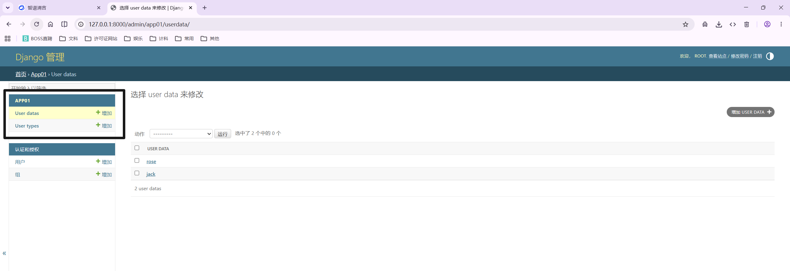
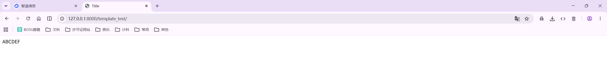
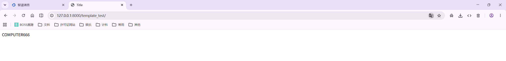
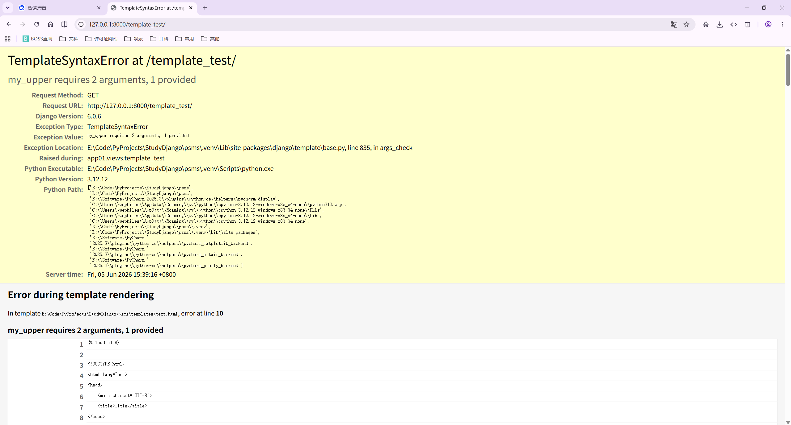
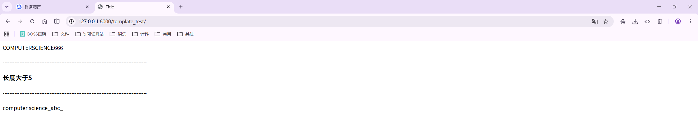
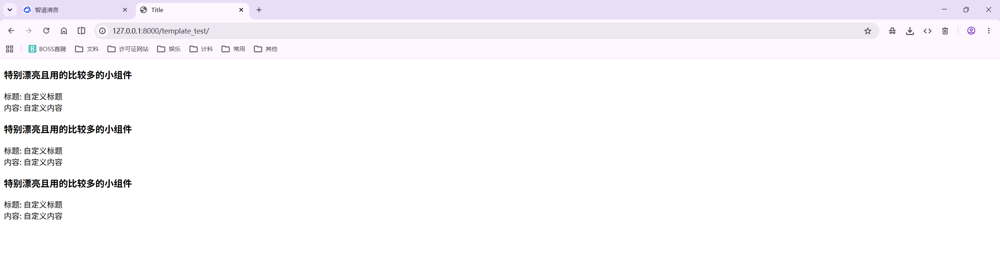
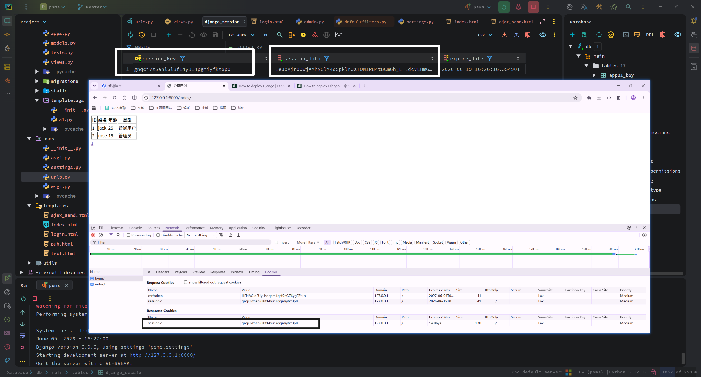

<h1 style="text-align: center;font-size: 40px; font-family: Source Code Pro;">day-09. Django</h1>

[TOC]

今日概要

- 模板引擎
  - `Django` 模板内置方法
  - 模板内自定义方法
- Session，cookie

# 0. 内容回顾

## 0.1 数据库操作

```txt
app
	models.py
		class Xy():
			xx = 字段(数据库的数据类型)
			
```

### 0.1.1 数据模型字段

```txt
字符串
    EmailField(CharField):  # 这个字段的验证会在 Django admin 中验证
    IPAddressField(Field)
    URLField(CharField)
    SlugField(CharField)
    UUIDField(Field)
    FilePathField(Field)
    FileField(Field)
    ImageField(FileField)
    CommaSeparatedIntegerField(CharField)
    
时间
	models.DateTimeField(null=True, unique_for_date='date')  # unique_for_date 局部创建索引
	
数字
	num = models.IntegerField()
    num = models.FloatField()
    num = models.DecimalField(max_digits=8,decimal_places=2)
	
枚举(Django):
    color_list = (
        (1, '黑色'),
        (2, '白色'),
        (3, '蓝色')
    )
    color = models.IntegerField(choices=color_list)

    1. 自己操作：
        自己取，自己用
    2. 给Django admin使用

    应用场景：选项固定

    PS: FK选项动态
```

补充：`Django admin`

```python
# app01/admin.py

from django.contrib import admin

# Register your models here.

from app01.models import *

admin.site.register(UserData)
admin.site.register(UserType)
```

```python
# urls.py

path('admin/', admin.site.urls),
```



### 0.1.2 字段参数

```txt
字段参数：
    null=True,
    default='1111',
    db_index=True,
    unique=True
	
    class Meta:
    	# 联合唯一索引
        # unique_together = (
        #     ('email','ctime'),
        # )
		
        # 联合索引
        # index_together = (
        #     ('email','ctime'),
        # )

Django Admin 提供的参数：
    verbose_name    Admin中显示的字段名称
    blank           Admin中是否允许用户输入为空
    editable        Admin中是否可以编辑
    help_text       Admin中该字段的提示信息
    choices         Admin中显示选择框的内容，用不变动的数据放在内存中从而避免跨表操作
                    如：gf = models.IntegerField(choices=[(0, '何穗'),(1, '大表姐'),],default=1)

    error_messages  自定义错误信息（字典类型），从而定制想要显示的错误信息；
                    字典健：null, blank, invalid, invalid_choice, unique, and unique_for_date
                    如：{'null': "不能为空.", 'invalid': '格式错误'}

    validators      自定义错误验证（列表类型），从而定制想要的验证规则
                    from django.core.validators import RegexValidator
                    from django.core.validators import EmailValidator,URLValidator,DecimalValidator,\
                    MaxLengthValidator,MinLengthValidator,MaxValueValidator,MinValueValidator
                    如：
                     test = models.CharField(
                        max_length=32,
                        error_messages={
                             'c1': '优先错信息1',
                             'c2': '优先错信息2',
                             'c3': '优先错信息3',
                         },
                         validators=[
                             RegexValidator(regex='root_\d+', message='错误了', code='c1'),
                             RegexValidator(regex='root_112233\d+', message='又错误了', code='c2'),
                             EmailValidator(message='又错误了', code='c3'), ]
a. 直接通过
    models.Userinfo.objects.create(....)
    -- ModelForm
b. 影响Django自带的管理工具admin
```

## 0.2 `csrf`

...

## 0.3 `xss`

...

## 0.4 cookie

放在用户浏览器端的很多键值对

服务端不要放敏感信息到 `cookie` 中 -- 防止用户修改


# 1. `Django` 模板引擎

## 1.1 函数

```python
def template_test(request):
    return render(request, 'text.html', {'name': 'abcdef'})
```

```html
<!DOCTYPE html>
<html lang="en">
<head>
    <meta charset="UTF-8">
    <title>Title</title>
</head>
<body>
{{ name|upper }}
</body>
</html>
```



## 1.2 模板中自定义函数 --> `simple_filter` 

1. 在任意 `app` 中创建 `templatetags` 目录（这个 `app` 必须注册上）

2. 创建一个任意 `.py` 文件

3. 在创建的 `.py` 文件中自定义函数|
   ```python
   # a1.py
   
   from django import template
   
   register = template.Library()
   
   
   @register.filter
   def my_upper(value):
       return value.upper()
   ```

   ```html
    <!-- 注意这里,这里要load一下 -->
   
   <!DOCTYPE html>
   <html lang="en">
   <head>
       <meta charset="UTF-8">
       <title>Title</title>
   </head>
   <body>
   {{ name|my_upper }}
   </body>
   </html>
   ```

   ----

   ```html
   from django import template
   
   register = template.Library()
   
   
   @register.filter
   def my_upper(value, arg):
       return value.upper() + arg
   ```

   ```python
   
   
   <!DOCTYPE html>
   <html lang="en">
   <head>
       <meta charset="UTF-8">
       <title>Title</title>
   </head>
   <body>
   {{ name|my_upper:"666" }}
   </body>
   </html>
   ```

   
   ```html
   
   
   <!DOCTYPE html>
   <html lang="en">
   <head>
       <meta charset="UTF-8">
       <title>Title</title>
   </head>
   <body>
   {{ name|my_upper: "666" }}  <!-- 注意这里加了一个空格 -->
   </body>
   </html>
   ```

   报错！
   

   > 注意: 最多只能加 2 个参数, 如果要加多个参数,需要这样实现:
   >
   > ```html
   > 
   > 
   > <!DOCTYPE html>
   > <html lang="en">
   > <head>
   >     <meta charset="UTF-8">
   >     <title>Title</title>
   > </head>
   > <body>
   > {{ name|my_upper:"a,b,c" }}
   > </body>
   > </html>
   > ```
   >
   > 
   >
   > ```python
   > from django import template
   > 
   > register = template.Library()
   > 
   > 
   > @register.filter
   > def my_upper(value, arg):
   >     a, b, c = arg.split(',')
   >     ...
   >     return value.upper()
   > ```

   ---

   ```html
   
   
   <!DOCTYPE html>
   <html lang="en">
   <head>
       <meta charset="UTF-8">
       <title>Title</title>
   </head>
   <body>
   {{ name|my_upper:"666" }}
   <h5>----------------------------------------------------------------------------------------------------</h5>
   
   </body>
   </html>
   ```

   ```python
   from django import template
   
   register = template.Library()
   
   
   @register.filter
   def my_upper(value, arg):
       return value.upper() + arg
   
   
   @register.simple_tag
   def my_lower(value, a1, a2, a3):
       return value.lower() + a1 + a2 + a3
   ```

   ----

   ```python
   #!/usr/bin/env python3
   # -*- coding: utf-8 -*-
   # @CreateTime : 2026/06/05 15:31
   # @Author     : wephiles@wephiles
   # @IDE        : PyCharm
   # @ProjectName: psms
   # @FileName   : psms/a1.py
   # @Description: This is description of this script.
   # @Interpreter: python 3.0+
   # @Motto      : You must take your place in the circle of life!
   # @AuthorSite : https://github.com/wephiles or https://gitee.com/wephiles
   
   # Copyright (c) 2026 wephiles.
   # This software is licensed under the MIT license.
   # See the LICENSE file for details.
   
   
   from django import template
   
   register = template.Library()
   
   
   @register.filter
   def my_upper(value, arg):
       return value.upper() + arg
   
   
   @register.simple_tag
   def my_lower(value, a1, a2, a3):
       return value.lower() + a1 + a2 + a3
   
   
   @register.filter
   def my_bool(value):
       if len(value) > 5:
           return True
       return False
   
   ```

   ```html
   
   
   <!DOCTYPE html>
   <html lang="en">
   <head>
       <meta charset="UTF-8">
       <title>Title</title>
   </head>
   <body>
   {{ name|my_upper:"666" }}
   
   <h5>--------------------------------------------------------------------------------------</h5>
     <!-- 只有 filter 才可以用 if 语句，simple_tag 不行 -->
       <h3>长度大于5</h3>
   
       <h3>长度小于等于5</h3>
   
   <h5>--------------------------------------------------------------------------------------</h5>
   
   
   
   </body>
   </html>
   
   ```

   

## 1.3 `include`

```python
def template_test(request):
    return render(request, 'text.html', {
        'name': 'ComputerScience',
        'title': '自定义标题',
        'content': '自定义内容',
    })
```

```html
# pub.html

<div>
    <h3>特别漂亮且用的比较多的小组件</h3>
    <div class="title">标题: {{ title }}</div>
    <div class="content">内容: {{ content }}</div>
</div>

# 正常页面 text.html
<!DOCTYPE html>
<html lang="en">
<head>
    <meta charset="UTF-8">
    <title>Title</title>
</head>
<body>





</body>
</html>
```



# 2. `Session`

cookie：保存到客户端浏览器的键值对

Session（会话）：

保存在服务器端的 数据（本质是键值对）

```json
{
	'这是一串随机字符串, 是服务端发送到浏览器的 cookie 的一个值': {
        'id': 12,
        'name': '张三',
        'email': 'xxxxxx',
    },
    '这又是一串随机字符串, 是服务端发送到浏览器的 cookie 的一个值': {
        'id': 13,
        'name': '李四',
        'email': 'yyyyy',
    },
}
```

其应用依赖于 cookie

其作用是保持会话（保持和用户之间的会话） 

好处：敏感信息不会直接给客户。



```python
urlpatterns = [
    # path('admin/', admin.site.urls),
    path('index/', views.index),
    path('login/', views.login),  # 基于 Session 的登录
]
```

```python
def login(request):
    if request.method == 'GET':
        return render(request, 'login.html')

    name = request.POST.get('name')
    password = request.POST.get('password')

    if name == 'abc' and password == '123456':
        # 登录成功 记录 Session

        # 1. 生成随机字符串
        # 2. 通过 cookie 发送到客户端浏览器
        # 3. 在服务端进行保存
        request.session['username'] = name
        request.session['email'] = 'email@qq.com'

        return redirect('/index/')
    return HttpResponse("False")
```

```python
def index(request):
    # 1. 获取客户端 cookie 中的随机字符串
    # 2. 去 Session 中查找有没有这个随机字符串
    # 3. 找这个随机字符串对应的 value 中查找是否有 username
    username = request.session.get('username')
    if username:
        return HttpResponse('登录成功')
    return redirect('/login/')
```

其他 Session操作：

```python
https://www.cnblogs.com/wupeiqi/articles/5246483.html
```

## 2.1 作业

```python
今日作业:  相亲网
	1. 登录，基于Session，装饰器
	
	2. 数据表：
		男生表：
			id    username  password
		
		女生表
			id    username  password
	
		男生女生关系表：
			nid  nid
			
	3. 功能：
		登录页：
			用户名：
			密码：
			性别：
			一周免登录：checkbox
			
			session[id]
			session[xingbie]
		
		查看异性列表：
			session[xingbie]
			
		查看与自己有染得异性姓名列表
```


