<h1 style="text-align: center;font-size: 40px; font-family: Source Code Pro;">day-10. Django</h1>

[TOC]

今日概要：

- 案例：约会网站
- 自关联
- 中间件

# 1. 约会网站1

```python
from django.db import models


class Boy(models.Model):
    nickname = models.CharField(max_length=10)
    username = models.CharField(max_length=15)
    password = models.CharField(max_length=64)

    class Meta:
        db_table = 'boy'
        verbose_name = '男生'
        verbose_name_plural = verbose_name


class Girl(models.Model):
    nickname = models.CharField(max_length=10)
    username = models.CharField(max_length=15)
    password = models.CharField(max_length=64)

    class Meta:
        db_table = 'girl'
        verbose_name = '女生'
        verbose_name_plural = verbose_name


class DateBoyToGirl(models.Model):
    boy = models.ForeignKey(to='Boy', to_field='id', on_delete=models.CASCADE)
    girl = models.ForeignKey(to='Girl', to_field='id', on_delete=models.CASCADE)

    class Meta:
        db_table = 'b2g'

```

```python
# urls.py


from django.contrib import admin
from django.urls import path

from app01.views import account, love

urlpatterns = [
    path('admin/', admin.site.urls),
    path('index/', love.index),
    path('others/', love.others),
    path('login/', account.login),
    path('logout/', account.logout),
]
```

```python
# views/coount.py

from django.shortcuts import render, HttpResponse, redirect

from app01 import models


def login(request):
    if request.method == 'GET':
        if request.session.get('user_info'):
            return redirect('/index/')
        return render(request, 'login.html')
    else:
        username = request.POST.get('username')
        password = request.POST.get('password')
        gender = request.POST.get('gender')
        remember = request.POST.get('rmb')
        obj = None
        if gender == '1':
            # 男
            obj = models.Boy.objects.filter(username=username, password=password).first()

        elif gender == '2':
            # 女
            obj = models.Girl.objects.filter(username=username, password=password).first()
        if obj is None:
            # 未登录成功
            return render(request, 'login.html', {'error': '用户名或密码错误'})
        else:
            # # 登录成功
            # request.session['user_id'] = obj.id
            # request.session['user_name'] = username
            # request.session['gender'] = gender
            # 也可以像下面这样写:
            request.session['user_info'] = {
                'user_id': obj.id,
                'username': username,
                'gender': gender,
                'nickname': obj.nickname,
            }
            return redirect('/index/')


def logout(request):
    # # 1. 注销登录 下面两个任意写一个就可以,但两个全部设置会出问题
    # request.session.clear()  # 只会删除 cookie 超时时间立即失效
    # request.session.delete(request.session.session_key)  # 删除的是数据库

    # # 2. 注销登录 失效 cookie + 删除数据库中 session
    # request.session.flush()

    # 3. 注销登录 -- Django自动处理 失效 cookie + 删除数据库 Session
    from django.contrib.auth import logout as auth_logout
    auth_logout(request)
    return redirect('/login/')
```

```python
# views/love.py

from django.shortcuts import render, HttpResponse, redirect

from app01 import models


def index(request):
    if not request.session.get('user_info'):
        return redirect('/login/')
    # 说明登录成功

    user_list = []
    gender_title = ''
    if request.session['user_info'].get('gender') == '1':
        # 是男生 查看女生列表
        gender_title = '女生列表'
        user_list = models.Girl.objects.all()
    elif request.session['user_info'].get('gender') == '2':
        # 是女生 查看男生列表
        gender_title = '男生列表'
        user_list = models.Boy.objects.all()

    # # 笔记：可以像下面这样获取数据然后展示在前端
    # #  但是也可以不这么写，render(request)的时候，已经将request对象传到模板了，也就是说前端可以直接拿到 request
    # cur_username = request.session['user_info'].get('username')
    # cur_nickname = request.session['user_info'].get('nickname')
    return render(
        request,
        'index.html',
        {
            'user_list': user_list,
            'gender_title': gender_title,
            # 'cur_username': cur_username,
            # 'nickname': cur_nickname
        }
    )


def others(request):
    if not request.session.get('user_info'):
        return redirect('/login/')
    # 获取和当前用户有关系的人
    current_uid = request.session['user_info'].get('user_id')
    current_gender = request.session['user_info'].get('gender')
    if current_gender == '1':
        # 当前用户是男性
        data = models.DateBoyToGirl.objects.filter(boy_id=current_uid).values('girl__nickname')
    elif current_gender == '2':
        # 当前用户是女性
        data = models.DateBoyToGirl.objects.filter(girl_id=current_uid).values('boy__nickname')
    return render(request, 'others.html', {'data': data})
```

index.html：

```html
<!DOCTYPE html>
<html lang="en">
<head>
    <meta charset="UTF-8">
    <title>Index</title>
</head>
<body>



<h2>{{ gender_title }}</h2>

<p><a href="/others/" style="text-decoration: none;">👉 和我有关系的异性</a></p>

<table border>
    <thead>
    <tr>
        <th>ID</th>
        <th>昵称</th>
        <th>用户名</th>
        <th>操 作</th>
    </tr>
    </thead>
    <tbody>
    
        <tr>
            <th>{{ item.id }}</th>
            <td>{{ item.nickname }}</td>
            <td>{{ item.username }}</td>
            <td>@mdo</td>
        </tr>
    
    </tbody>
</table>
</body>
</html>
```

login.html:

```html

<!DOCTYPE html>
<html lang="en">
<head>
    <meta charset="UTF-8">
    <title>Login</title>
</head>
<body>


<form action="/login/" method="post">
    
    <h1>Login</h1>
    <p>
        性别:
        男 <input type="radio" name="gender" value="1" checked="checked">
        女 <input type="radio" name="gender" value="2" checked="checked">
    </p>
    <p>
        账 户: <input type="text" name="username" placeholder="用户名">
    </p>
    <p>
        密 码: <input type="password" name="password" placeholder="密码">
    </p>

    <p>
        一月免登录: <input type="checkbox" name="rmb" value="11">
    </p>
    <button type="submit">提 交</button>
    <p>
        <span style="color: red;">{{ error }}</span>
    </p>
</form>
</body>
</html>
```

others.html:

```html
<!DOCTYPE html>
<html lang="en">
<head>
    <meta charset="UTF-8">
    <title>和我有关</title>
</head>
<body>



<h1>和我有关</h1>
<ul>
    
        
            <li>{{ item.boy__nickname }}</li>
        
            <li>{{ item.girl__nickname }}</li>
        
    
</ul>

</body>
</html>
```

user_header.html

```html
<h1>当前用户: <span style="color: blue;">{{ request.session.user_info.username }}</span></h1>
<a href="/logout/" style="color: red;">注销登录</a>
```

# 2. 约会网站2 -- 关于一种特殊的多对多关联表

```python
from django.db import models


class UserInfo(models.Model):
    nickname = models.CharField(max_length=10)
    username = models.CharField(max_length=12)
    password = models.CharField(max_length=10)

    choices = (
        (1, '男'),
        (2, '女'),
    )
    gender = models.SmallIntegerField(choices=choices)

    class Meta:
        db_table = 'userinfo'
        verbose_name = '用户信息'
        verbose_name_plural = verbose_name


# UserInfo.objects.filter(id=1).u2u_set().all()
# 不加 related_query_name='girl' 和 related_query_name='boy' --> 反向查找是无法查到的 因为 Django不知道要用哪个 id
# UserInfo.objects.filter(id=1).girl.all()
# UserInfo.objects.filter(id=1).boy.all()
class U2U(models.Model):
    # girl = models.ForeignKey('UserInfo', on_delete=models.CASCADE, related_query_name='girl')
    # boy = models.ForeignKey('UserInfo', on_delete=models.CASCADE, related_query_name='boy')
    # 也可以像下面这样写
    girl = models.ForeignKey('UserInfo', on_delete=models.CASCADE, related_name='girl')
    boy = models.ForeignKey('UserInfo', on_delete=models.CASCADE, related_name='boy')
    class Meta:
        db_table = 'u2u'
```

# 3. 反向关联

```python
# 反向查找:
# related_name = 'xxxx'
# 	user_set ---> xxxx
# related_query_name = 'xxxx'
# 	user_set ----> xxxx_set
```

```python
2. 补充自关联

	class UserInfo(models.Model):
        nickname = ...
        useranme = ...
        m = models.ManyToManyField('UserInfo')

    M2M自关联特性：
        obj = models.UserInfo.objects.filter(id=1).first()
        # from_userinfo_id
        obj.m            => select xx from xx where from_userinfo_id = 1

        # to_userinfo_id
        obj.userinfo_set => select xx from xx where to_userinfo_id = 1


    定义：
        # 前面列：男生ID
        # 后面列：女生ID

    应用：
        # 男生对象
        obj = models.UserInfo.objects.filter(id=1).first()
        # 根据男生ID=1查找关联的所有的女神
        obj.m.all()

        # 女生
        obj = models.UserInfo.objects.filter(id=4).first()
        # 根据女生ID=4查找关联的所有的男生
        obj.userinfo_set.all()
```

# 4. 自关联

```python
class Comment(models.Model):
    """新闻评论表"""
    news_id = models.IntegerField('新闻ID')
    content = models.CharField('评论内容', max_length=200)
    user = models.CharField('评论用户', max_length=20)
    reply = models.ForeignKey('self', on_delete=models.CASCADE, null=True, related_name='parent_comment')

	
"""
  新闻ID                          reply_id
1   1        别比比     root         null
2   1        就比比     root         null
3   1        瞎比比     shaowei      null
4   2        写的正好   root         null
5   1        拉倒吧     由清滨         2
6   1        拉倒吧1    xxxxx         2
7   1        拉倒吧2    xxxxx         5

------>
新闻1
    别比比
    就比比
        - 拉倒吧
            - 拉倒吧2
        - 拉倒吧1
    瞎比比
新闻2：
    写的正好

"""
```

# 5. 中间件

适用于对所有请求或一部分请求做批量处理。

> 也可以参考：[Python基础/Django笔记day-18](E:\Notes\markdowns\Python\Django\PythonWeb_2022\day18-DjangoDevelop.md)

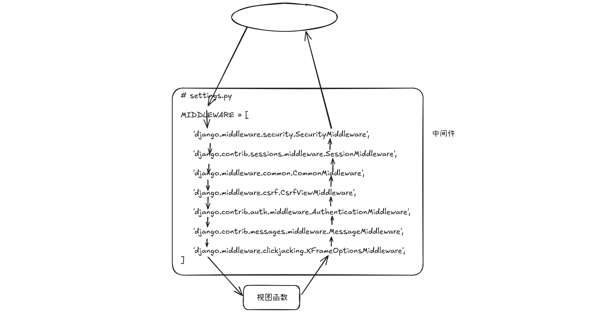

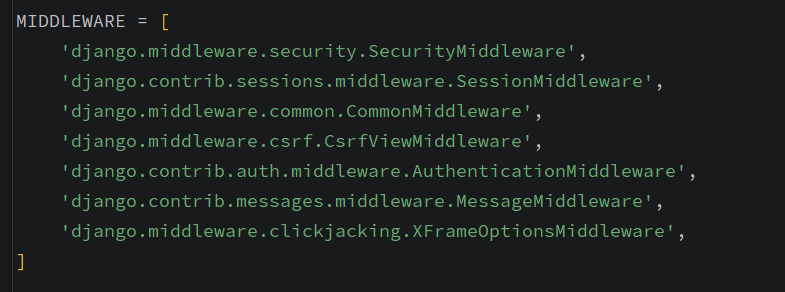

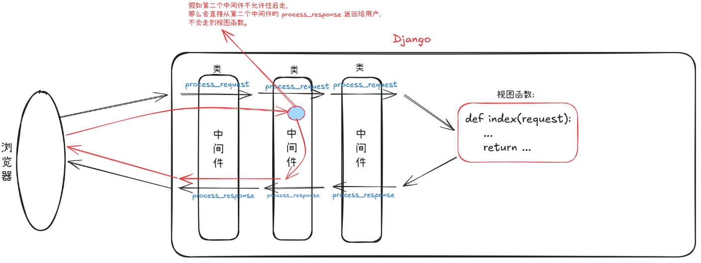

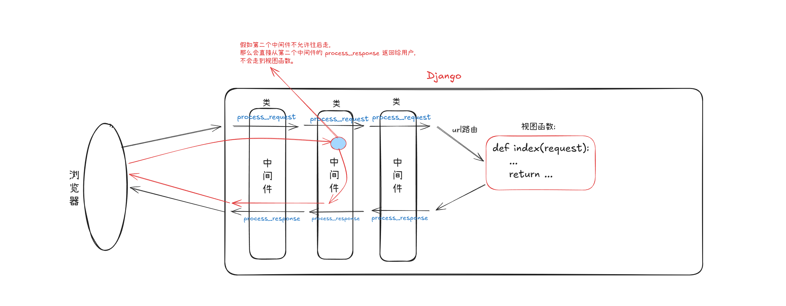


---

```python
from django.utils.deprecation import MiddlewareMixin


class MyMiddleware(MiddlewareMixin):
    """自定义中间件"""
    def process_request(self, request):
        返回None/HttpResponse(...)/redirect(...)/render(...)
    
    def process_response(self, request, response):
		必须有返回值
        return response
```

## 5.1 `peocess_view(self, request, callback, callback_args, callback_kwargs)`

```python
class myMiddleware(MiddlewareMixin):
	peocess_view(self, request, callback, callback_args, callback_kwargs):
        pass
    
```

```python
from django.utils.deprecation import MiddlewareMixin


class MyMiddleware1(MiddlewareMixin):
    def process_request(self, request):
        print('1 request')
        pass

    def process_response(self, request, response):
        print('1 response')
        return response

    def process_view(self, request, view_func, view_args, view_kwargs):
        print('1 view')


class MyMiddleware2(MiddlewareMixin):
    def process_request(self, request):
        print('2 request')
        pass

    def process_response(self, request, response):
        print('2 response')
        return response

    def process_view(self, request, view_func, view_args, view_kwargs):
        print('2 view')
```


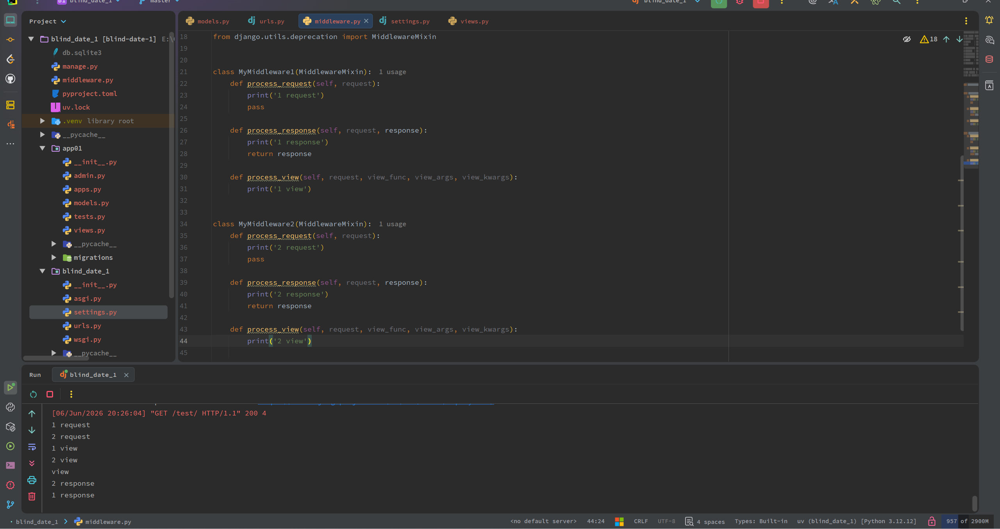

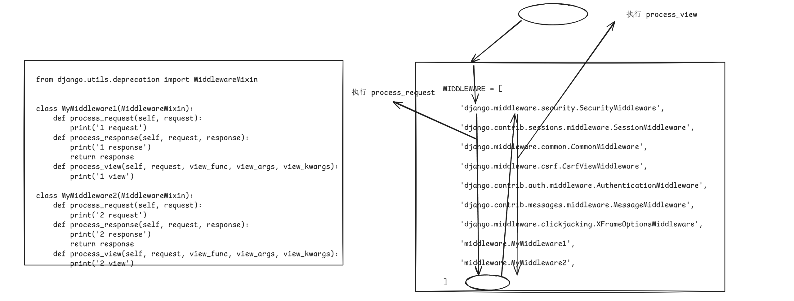


---

```python
# views.py

def test(request):
    print('view:', test)
    return HttpResponse('view')
```

```python
# middleware:

from django.utils.deprecation import MiddlewareMixin


class MyMiddleware1(MiddlewareMixin):
    def process_request(self, request):
        print('1 request')
        pass

    def process_response(self, request, response):
        print('1 response')
        return response

    def process_view(self, request, view_func, view_args, view_kwargs):
        print('1:', view_func, view_args, view_kwargs)
        print('1 view')


class MyMiddleware2(MiddlewareMixin):
    def process_request(self, request):
        print('2 request')

    def process_response(self, request, response):
        print('2 response')
        return response

    def process_view(self, request, view_func, view_args, view_kwargs):
        print('2:', view_func, view_args, view_kwargs)
        print('2 view')
```

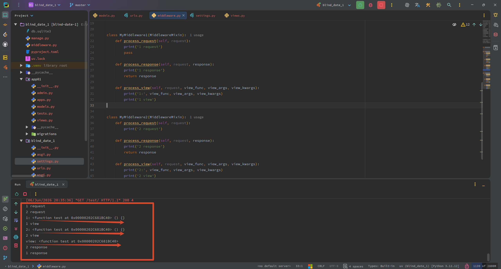

----

```python
from django.utils.deprecation import MiddlewareMixin


class MyMiddleware1(MiddlewareMixin):
    def process_request(self, request):
        print('1 request')
        pass

    def process_response(self, request, response):
        print('1 response')
        return response

    def process_view(self, request, view_func, view_args, view_kwargs):
        print('1:', view_func, view_args, view_kwargs)
        print('1 view')
        return view_func(request, *view_args, **view_kwargs)


class MyMiddleware2(MiddlewareMixin):
    def process_request(self, request):
        print('2 request')

    def process_response(self, request, response):
        print('2 response')
        return response

    def process_view(self, request, view_func, view_args, view_kwargs):
        print('2:', view_func, view_args, view_kwargs)
        print('2 view')
        response = view_func(request, *view_args, **view_kwargs)
        return response
```

```python
def test(request):
    print('view:', test)
    return HttpResponse('view')
```

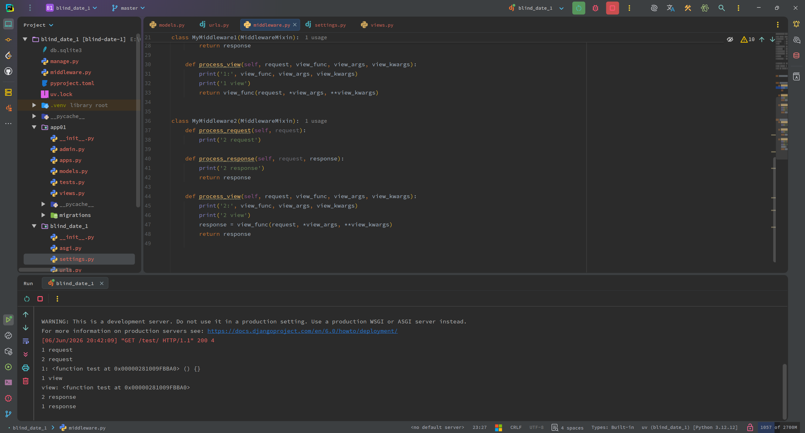

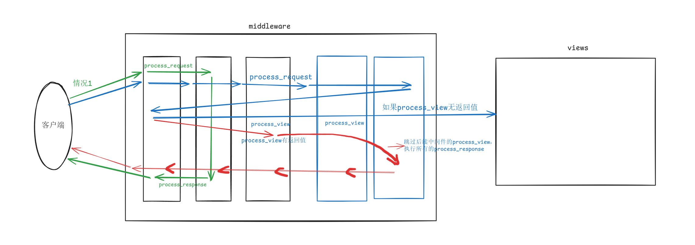

## 5.2 `process_exception`

```python
from django.shortcuts import render, HttpResponse


def test(request):
    print('view:', test)
    int('abc')
    return HttpResponse('view')
```

```python
from django.utils.deprecation import MiddlewareMixin


class MyMiddleware1(MiddlewareMixin):
    def process_request(self, request):
        print('1 request')
        pass

    def process_response(self, request, response):
        print('1 response')
        return response

    def process_view(self, request, view_func, view_args, view_kwargs):
        # print('1:', view_func, view_args, view_kwargs)
        print('1 view')
        # return view_func(request, *view_args, **view_kwargs)

    def process_exception(self, request, exception):
        print('m1: process_exception')


class MyMiddleware2(MiddlewareMixin):
    def process_request(self, request):
        print('2 request')

    def process_response(self, request, response):
        print('2 response')
        return response

    def process_view(self, request, view_func, view_args, view_kwargs):
        # print('2:', view_func, view_args, view_kwargs)
        print('2 view')
        # response = view_func(request, *view_args, **view_kwargs)
        # return response

    def process_exception(self, request, exception):
        print('m2: process_exception')
```

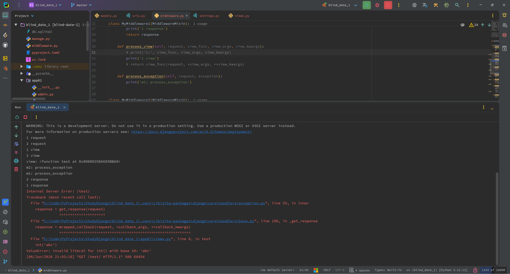

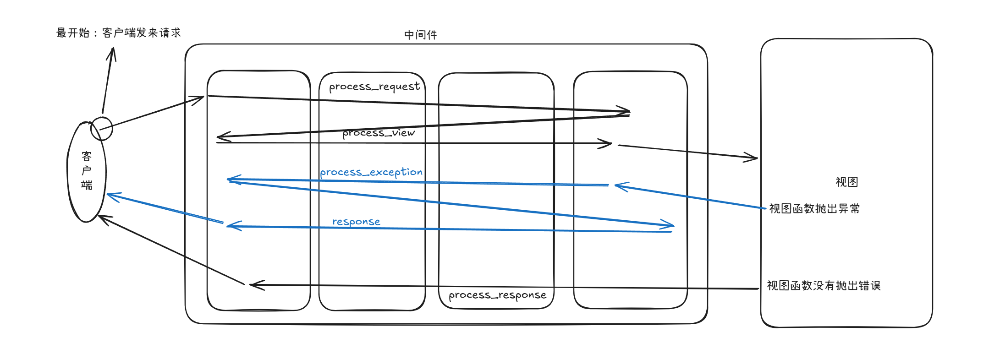

----

```python
from django.shortcuts import render, HttpResponse


def test(request):
    print('view:', test)
    int('abc')
    return HttpResponse('view')
```

```python
from django.shortcuts import HttpResponse
from django.utils.deprecation import MiddlewareMixin


class MyMiddleware1(MiddlewareMixin):
    def process_request(self, request):
        print('1 request')
        pass

    def process_response(self, request, response):
        print('1 response')
        return response

    def process_view(self, request, view_func, view_args, view_kwargs):
        # print('1:', view_func, view_args, view_kwargs)
        print('1 view')
        # return view_func(request, *view_args, **view_kwargs)

    def process_exception(self, request, exception):
        print('m1: process_exception')
        return HttpResponse('界面有错哦211111')


class MyMiddleware2(MiddlewareMixin):
    def process_request(self, request):
        print('2 request')

    def process_response(self, request, response):
        print('2 response')
        return response

    def process_view(self, request, view_func, view_args, view_kwargs):
        # print('2:', view_func, view_args, view_kwargs)
        print('2 view')
        # response = view_func(request, *view_args, **view_kwargs)
        # return response
        
    def process_exception(self, request, exception):
        print('m2: process_exception')
        return HttpResponse('界面有错哦')
```

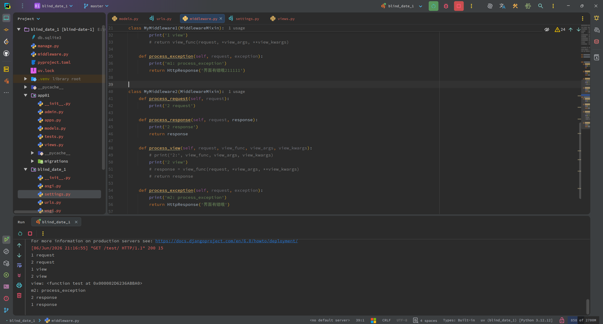

----

```python
from django.shortcuts import render, HttpResponse


def test(request):
    print('view:', test)
    int('abc')
    return HttpResponse('view')
```

```python
from django.shortcuts import HttpResponse
from django.utils.deprecation import MiddlewareMixin


class MyMiddleware1(MiddlewareMixin):
    def process_request(self, request):
        print('1 request')
        pass

    def process_response(self, request, response):
        print('1 response')
        return response

    def process_view(self, request, view_func, view_args, view_kwargs):
        # print('1:', view_func, view_args, view_kwargs)
        print('1 view')
        # return view_func(request, *view_args, **view_kwargs)

    def process_exception(self, request, exception):
        print('m1: process_exception')
        return HttpResponse('界面有错哦211111')


class MyMiddleware2(MiddlewareMixin):
    def process_request(self, request):
        print('2 request')

    def process_response(self, request, response):
        print('2 response')
        return response

    def process_view(self, request, view_func, view_args, view_kwargs):
        # print('2:', view_func, view_args, view_kwargs)
        print('2 view')
        # response = view_func(request, *view_args, **view_kwargs)
        # return response

    def process_exception(self, request, exception):
        print('m2: process_exception')
```

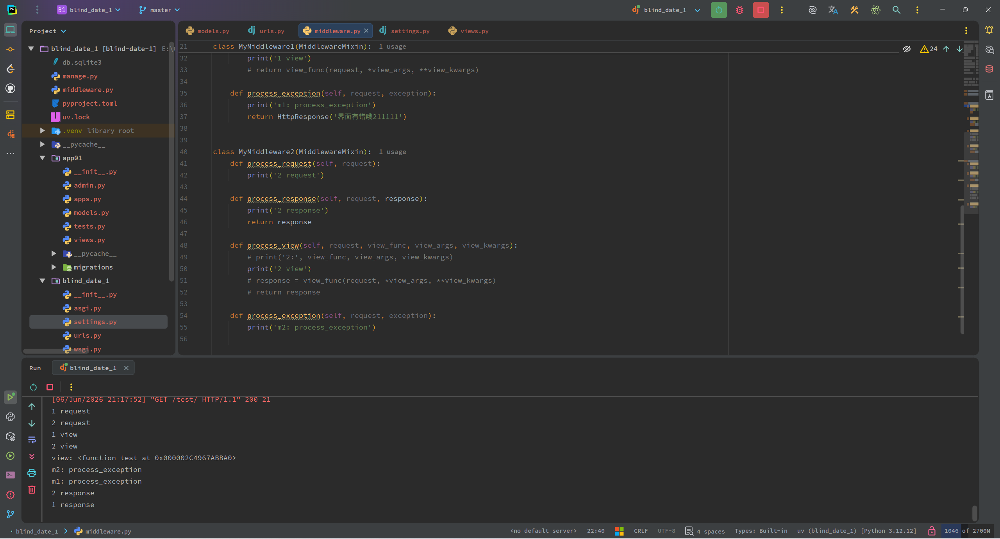

> [!Note]
>
> 和 `process_view` 处理逻辑差不多, 处理异常完毕后( 返回一个 `HttpResponse/render/redirect` 对象 ) 直接到最后一个中间件，依次向前执行 `process_response` 

## 5.3 `process_template_response`

```python
from django.shortcuts import render, HttpResponse


def test(request):
    print('view:', test)
    return HttpResponse('view')

```

```python
from django.shortcuts import HttpResponse
from django.utils.deprecation import MiddlewareMixin


class MyMiddleware1(MiddlewareMixin):
    def process_request(self, request):
        print('1 request')
        pass

    def process_response(self, request, response):
        print('1 response')
        return response

    def process_view(self, request, view_func, view_args, view_kwargs):
        # print('1:', view_func, view_args, view_kwargs)
        print('1 view')
        # return view_func(request, *view_args, **view_kwargs)

    # def process_exception(self, request, exception):
    #     print('m1: process_exception')
    #     return HttpResponse('界面有错哦211111')

    def process_template_response(self, request, response):
        print('m1: process_template_response')
        return response


class MyMiddleware2(MiddlewareMixin):
    def process_request(self, request):
        print('2 request')

    def process_response(self, request, response):
        print('2 response')
        return response

    def process_view(self, request, view_func, view_args, view_kwargs):
        # print('2:', view_func, view_args, view_kwargs)
        print('2 view')
        # response = view_func(request, *view_args, **view_kwargs)
        # return response

    # def process_exception(self, request, exception):
    #     print('m2: process_exception')

    def process_template_response(self, request, response):
        print('m2: process_template_response')
        return response
```

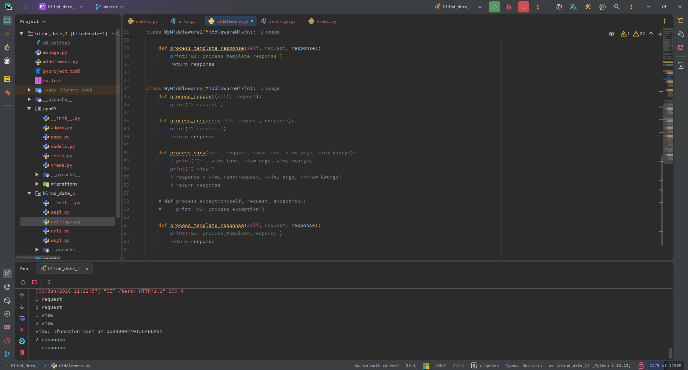

---

```python
from django.shortcuts import render, HttpResponse


class Foo:
    def __init__(self, req):
        self.req = req

    def render(self):
        return HttpResponse('......')


def test(request):
    obj = Foo(request)
    return obj

```

```python
from django.shortcuts import HttpResponse
from django.utils.deprecation import MiddlewareMixin


class MyMiddleware1(MiddlewareMixin):
    def process_request(self, request):
        print('1 request')
        pass

    def process_response(self, request, response):
        print('1 response')
        return response

    def process_view(self, request, view_func, view_args, view_kwargs):
        # print('1:', view_func, view_args, view_kwargs)
        print('1 view')
        # return view_func(request, *view_args, **view_kwargs)

    # def process_exception(self, request, exception):
    #     print('m1: process_exception')
    #     return HttpResponse('界面有错哦211111')

    def process_template_response(self, request, response):
        print('m1: process_template_response')
        return response


class MyMiddleware2(MiddlewareMixin):
    def process_request(self, request):
        print('2 request')

    def process_response(self, request, response):
        print('2 response')
        return response

    def process_view(self, request, view_func, view_args, view_kwargs):
        # print('2:', view_func, view_args, view_kwargs)
        print('2 view')
        # response = view_func(request, *view_args, **view_kwargs)
        # return response

    # def process_exception(self, request, exception):
    #     print('m2: process_exception')

    def process_template_response(self, request, response):
        """
        对视图函数的返回值有一定要求：
            视图函数返回值如果有 render 方法，此方法才执行
        """
        print('m2: process_template_response')
        return response
```

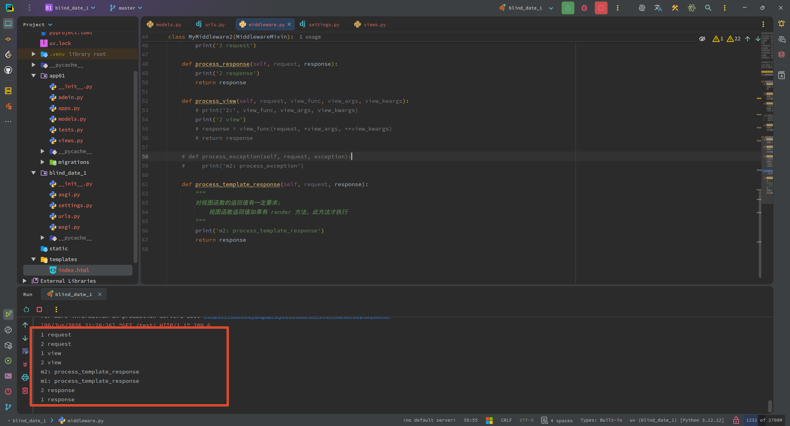

---

```python
from django.shortcuts import render, HttpResponse
from django.http import JsonResponse


class Foo:
    """作用: 将一部分业务代码放在这个类里面"""

    def __init__(self, req, status, message):
        self.req = req
        self.status = status
        self.message = message

    def render(self):
        # 这里写一些业务代码
        # self.req.POST.get('name')
        # ...
        # ...

        # 举例:
        #   这里处理接收到的Ajax请求
        ret_dict = {
            'status': self.status,
            'message': self.message
        }
        return JsonResponse(ret_dict)


def test(request):
    return Foo(request, True, '一些信息')
```

```python
from django.shortcuts import HttpResponse
from django.utils.deprecation import MiddlewareMixin


class MyMiddleware1(MiddlewareMixin):
    def process_request(self, request):
        print('1 request')
        pass

    def process_response(self, request, response):
        print('1 response')
        return response

    def process_view(self, request, view_func, view_args, view_kwargs):
        # print('1:', view_func, view_args, view_kwargs)
        print('1 view')
        # return view_func(request, *view_args, **view_kwargs)

    # def process_exception(self, request, exception):
    #     print('m1: process_exception')
    #     return HttpResponse('界面有错哦211111')

    def process_template_response(self, request, response):
        print('m1: process_template_response')
        return response


class MyMiddleware2(MiddlewareMixin):
    def process_request(self, request):
        print('2 request')

    def process_response(self, request, response):
        print('2 response')
        return response

    def process_view(self, request, view_func, view_args, view_kwargs):
        # print('2:', view_func, view_args, view_kwargs)
        print('2 view')
        # response = view_func(request, *view_args, **view_kwargs)
        # return response

    # def process_exception(self, request, exception):
    #     print('m2: process_exception')

    def process_template_response(self, request, response):
        """
        对视图函数的返回值有一定要求：
            视图函数返回值如果有 render 方法，此方法才执行
        """
        print('m2: process_template_response')
        return response
```

# 6. 知识点梳理(思维导图)

`Django`整个生命周期：

`Django`  的“执行周期”就是：**浏览器请求 → Web 服务器(`WSGI/ASGI`) → `Django` 中间件链 → `URL` 路由 → 视图(`View`) → 模型/模板 → 响应对象 → 中间件链(逆向) → Web 服务器 → 浏览器**。

...

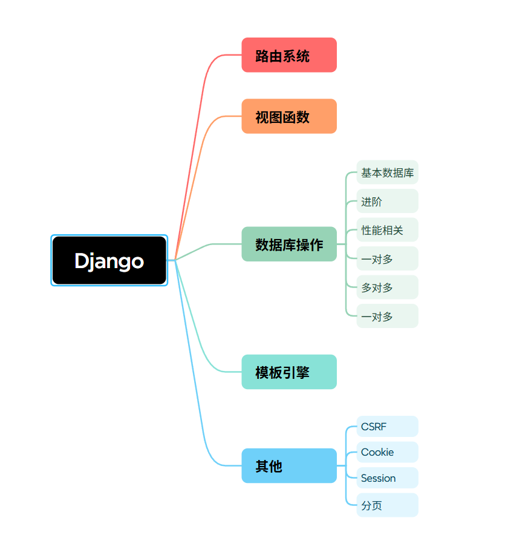

# 7. 补充 - `Django`请求的生命周期

**Web 框架的本质：socket**

`Django` 中没有 `socket`

`Django`： **别人的` socket + Django`** 配合

```python
WSGI:
    'cgi': CGIServer,
    'wsgiref': WSGIRefServer, ---> Django 用的就是这个
    ...
```

开发：`wsgiref + django`

生产：`uwsgi + django`

`Django` 处理流程:

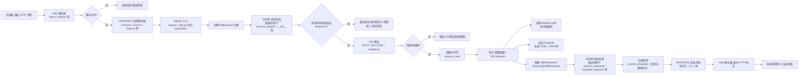


```python
from wsgiref.simple_server import make_server

def run_server(environ, start_response):
    environ: 请求相关的信息(请求头、请求体)
    Django框架开始
    中间件
    路由系统
    视图函数
    数据库
    模板引擎
    渲染
    start_response('200 OK', [('Content-Type', 'text/html'),])
    
    return [bytes('<h1>Hello, web!</h1>', encoding='utf-8'), ]


if __name__ == '__main__':
    httpd = make_server('127.0.0.1', 8000, run_server)
    httpd.serve_forever()
```

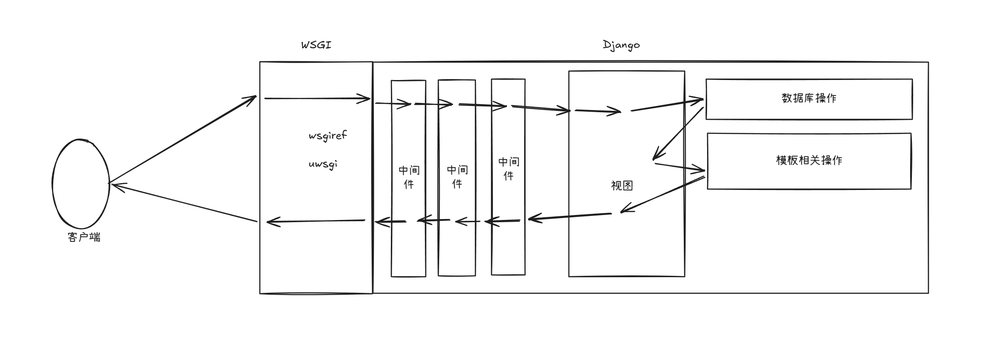

# 8. 补充 `MVC/MTV`

## 8.1 `MVC`

```python
models(数据模型(数据库操作)) views(HTML模板) controllers(逻辑处理)
```

## 8.2 `MTV`

```python
models(数据模型(数据库操作)) templates(HTML模板) views(逻辑处理)  ----> Django默认
```

# 9. 补充 关于 `__init__.py`

```python
关于 from django.shortcuts import HttpResponse VS. from django.http impoort HttpResponse

::::
    
    两者完全一模一样,因为在 django.shortcuts.py 中有这样一段代码:
        from django.http import (
            Http404,
            HttpResponse, ---->: 着重看这里
            HttpResponsePermanentRedirect,
            HttpResponseRedirect,
        )
    我们从 shortcuts 导入的 HttpResponse 其实就是 django.http.HttpResponse
```

有一个简单的示例：

```python
-root
	- main.py
    - package_a
    	- a.py
    - package_b
    	- b.py
```

```python
# a.py

from package_b.b import B_DATA
```

```python
# b.py

B_DATA = 'This is B_DATA from package_b.b'
```

```python
# main.py

from package_a.a import B_DATA

print(B_DATA)
```

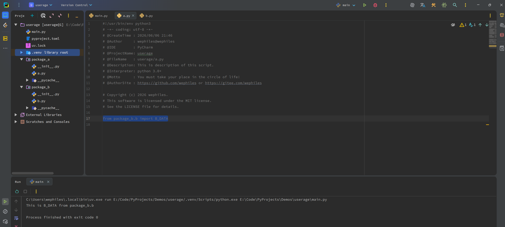


