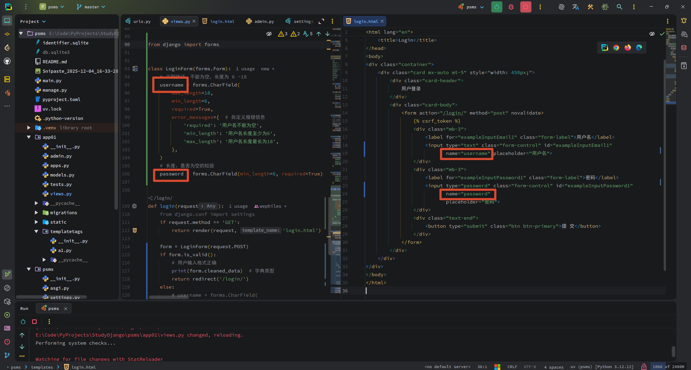
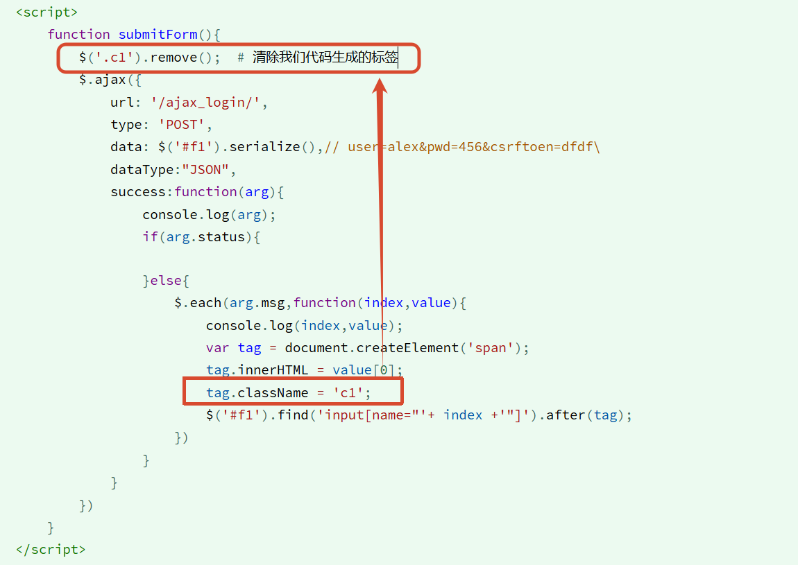

<h1 style="text-align: center;font-size: 40px; font-family: Source Code Pro;">day-11. Django</h1>

[TOC]

今日内容概要：

- Form验证
  - 对请求数据做验证


# 1. Form验证



```python
from django import forms


class LoginForm(forms.Form):
    # 正则验证：不能为空，长度为 6 - 18
    username = forms.CharField(
        max_length=18,
        min_length=6,
        required=True,
        error_messages={  # 自定义报错信息
            'required': '用户名不能为空',
            'min_length': '用户名长度至少为6',
            'max_length': '用户名长度最长为18',
        },
    )
    # 长度、是否为空的校验
    password = forms.CharField(min_length=6, required=True)


def login(request):
    from django.conf import settings
    if request.method == 'GET':
        return render(request, 'login.html')

    form = LoginForm(request.POST)
    if form.is_valid():
        # 用户输入格式正确
        print(form.cleaned_data)  # 字典类型
        return redirect('/login/')
    else:
        # username = forms.CharField(
        #         max_length=18,
        #         min_length=6,
        #         required=True,
        # ):
        # print(
        #     form.errors)  # <ul class="errorlist"><li>username<ul class="errorlist" id="id_username_error"><li>这个字段是必填项。</li></ul></li><li>password<ul class="errorlist" id="id_password_error"><li>确保该变量至少包含 6 字符(目前字符数 2)。</li></ul></li></ul>
        #
        # print(form.errors[
        #           'username'])  # form.errors 是一个对象, <ul class="errorlist" id="id_username_error"><li>这个字段是必填项。</li></ul>
        # print(form.errors[
        #           'password'])  # form.errors 是一个对象, <ul class="errorlist" id="id_password_error"><li>确保该变量至少包含 6 字符(目前字符数 2)。</li></ul>
        #
        # print(form.errors['username'][0])  # 这个字段是必填项。
        # print(form.errors['password'][0])  # 确保该变量至少包含 6 字符(目前字符数 3)。

        print(form.errors['username'][0])  # 用户名不能为空
        print(form.errors['password'][0])  # 这个字段是必填项。
        return render(request, 'login.html', {'form': form})
```

- 定义规则
  ```
  from django import forms
  
  class YourForm(forms.Form):
  	xx = forms.CharField(required=True, max_length=5, min_length=1, error_messages={'min_length' : '长度太短', })
  
  ```

- 使用
  ```
  request.POST --> 用户输入提交的所有数据
  
  form = YourForm(request.POST)
  
  ```

- 通过前端页面的标签的 `username` 属性和我们 Form 类中的字段名要一致
  

- `form.errors`: 所有的错误信息

- `form.cleaned_data`: 正确的信息

- `form.is_valid()`: 校验是否合法

# 2. Form 组件

> https://www.cnblogs.com/wupeiqi/articles/6144178.html

- 用户提交数据进行校验
  - form 表单提交 （刷新 失去上次内容）
  - Ajax 提交 （不刷新，上次内容自动保留）

-----

## 2.1 form的内部原理：

```python
from django.shortcuts import render, redirect
from django import forms


class LoginForm(forms.Form):
    username = forms.CharField(required=True)
    password = forms.CharField(widget=forms.PasswordInput, min_length=8)


def login(request):
    if request.method == 'GET':
        return render(request, 'login.html')

    form = LoginForm(request.POST)
    # 实例化 LoginForm 时候：
    #  1. 将类LoginForm的字段放到self.fields中
    #   self.fields = {
    #       'username': '正则表达式',
    #       'password': '正则表达式',
    #   }
    #  2.循环self.fields -- is_valid()
    #   for k,v in self.fields:
    #       k：username, password
    #       v: 正则表达式
    #       input_value = request.POST.get(k)
    if form.is_valid():
        print(form.cleaned_data)  # {'username': 'dsa', 'password': 'dasdsafdsgfrfg'}
        return redirect('/login/')
    print(form.errors)  # <ul class="errorlist"><li>password<ul class="errorlist" id="id_password_error"><li>Ensure this value has at least 8 characters (it has 1).</li></ul></li></ul>
    print(form.errors.as_json())  # {"password": [{"message": "Ensure this value has at least 8 characters (it has 1).", "code": "min_length"}]}
    print(form.errors.as_data())  # {'password': [ValidationError(['Ensure this value has at least 8 characters (it has 1).'])]}
    print(form.errors.as_ul())  # <ul class="errorlist"><li>password<ul class="errorlist" id="id_password_error"><li>Ensure this value has at least 8 characters (it has 1).</li></ul></li></ul>
    print(form.errors.as_text())
    # form.errors.as_text():
    # * password
    #   * Ensure this value has at least 8 characters (it has 1).
    return render(request, 'login.html')

```

```html
<!DOCTYPE html>
<html lang="en">
<head>
    <meta charset="UTF-8">
    <title>登录</title>
</head>
<body>
<h1>用户登录</h1>
<form action="/login/" method="post">
    
    <p>
        用户名: <input type="text" name="username">
    </p>

    <p>
        密 码: <input type="text" name="password">
    </p>

    <p>
        <button type="submit">提 交</button>
    </p>
</form>
</body>
</html>
```

------

```html
<!DOCTYPE html>
<html lang="en">
<head>
    <meta charset="UTF-8">
    <title>登录</title>
</head>
<body>
<h1>用户登录</h1>
<form action="/login/" method="post">
    
    <p>
        用户名: <input type="text" name="username">{{ form.errors.username.0 }}
    </p>

    <p>
        密 码: <input type="text" name="password">{{ form.errors.password.0 }}
    </p>

    <p>
        <button type="submit">提 交</button>
    </p>
</form>
</body>
</html>

```

```python
from django.shortcuts import render, redirect
from django import forms


class LoginForm(forms.Form):
    username = forms.CharField(required=True)
    password = forms.CharField(widget=forms.PasswordInput, min_length=8)


def login(request):
    if request.method == 'GET':
        return render(request, 'login.html')

    form = LoginForm(request.POST)
    # 实例化 LoginForm 时候：
    #  1. 将类LoginForm的字段放到self.fields中
    #   self.fields = {
    #       'username': '正则表达式',
    #       'password': '正则表达式',
    #   }
    #  2.循环self.fields -- is_valid()
    #   for k,v in self.fields:
    #       k：username, password
    #       v: 正则表达式
    #       input_value = request.POST.get(k)
    if form.is_valid():
        # print(form.cleaned_data)  # {'username': 'dsa', 'password': 'dasdsafdsgfrfg'}
        return redirect('https://www.baidu.com')
    # print(
    #     form.errors)  # <ul class="errorlist"><li>password<ul class="errorlist" id="id_password_error"><li>Ensure this value has at least 8 characters (it has 1).</li></ul></li></ul>
    # print(
    #     form.errors.as_json())  # {"password": [{"message": "Ensure this value has at least 8 characters (it has 1).", "code": "min_length"}]}
    # print(
    #     form.errors.as_data())  # {'password': [ValidationError(['Ensure this value has at least 8 characters (it has 1).'])]}
    # print(
    #     form.errors.as_ul())  # <ul class="errorlist"><li>password<ul class="errorlist" id="id_password_error"><li>Ensure this value has at least 8 characters (it has 1).</li></ul></li></ul>
    # print(form.errors.as_text())
    # # form.errors.as_text():
    # # * password
    # #   * Ensure this value has at least 8 characters (it has 1).
    return render(request, 'login.html', {'form': form})

```

## 2.2 Ajax 请求

```html
<script src="/static/jquery-4.0.0.min.js"></script>
<script>
    function submitForm() {
        $.ajax({
            url: '/ajax/login/',
            dataType: 'json',
            type: 'POST',
            data: $('#f1').serialize(),  // username=alex&password=123465&csrftoken=xxxxxx
            success: function (res) {
                console.log(res);
            }
        })
    }
</script>
```

```html
- Form提交
		class XXForm(Form):
			user = fields.CharField(min_length=8)
			email = fields.EmailField()
			password = fields.CharField()
			phone = fields.RegexField('139\d+')
		
		
		def login(request):
			if request.method == 'GET':
				return render(request,'login.html')
			else:
				obj = LoginForm(request.POST)
				if obj.is_valid():
					print(obj.cleaned_data)
					return redirect('http://www.baidu.com')
				return render(request,'login.html',{'obj': obj})
		
		<form id="f1" action="/login/" method="POST">
			
			<p>
				<input type="text" name="user" />{{ obj.errors.user.0 }}
			</p>
			<p>
				<input type="password" name="pwd" />{{ obj.errors.pwd.0 }}
			</p>
			<input type="submit" value="提交" />
		</form>
		
		======> 无法保留上次输入内容
		
		
	- Ajax提交
		class XXForm(Form):
			user = fields.CharField(min_length=8)
			email = fields.EmailField()
			password = fields.CharField()
			phone = fields.RegexField('139\d+')
		
		
		def login(request):
			return render(request,'login.html')
		
		def ajax_login(request):
			import json
			ret = {'status': True,'msg': None}
			obj = LoginForm(request.POST)
			if obj.is_valid():
				print(obj.cleaned_data)
			else:
				# print(obj.errors) # obj.errors对象
				ret['status'] = False
				ret['msg'] = obj.errors
			v = json.dumps(ret)
			return HttpResponse(v)
		
		<form id="f1" action="/login/" method="POST">
			
			<p>
				<input type="text" name="user" />
			</p>
			<p>
				<input type="password" name="pwd" />
			</p>
			<input type="submit" value="提交" />
		</form>
		
		
		
		<script src="/static/jquery-1.12.4.js"></script>
		<script>
			function submitForm(){
				$('.c1').remove();  # 清除我们代码生成的标签
				$.ajax({
					url: '/ajax_login/',
					type: 'POST',
					data: $('#f1').serialize(),// user=alex&pwd=456&csrftoen=dfdf\
					dataType:"JSON",                                                                  
					success:function(arg){                                                            
						console.log(arg);                                                             
						if(arg.status){                                                               
                                                                                                      
						}else{                                                                        
							$.each(arg.msg,function(index,value){                                    
								console.log(index,value);                                            
								var tag = document.createElement('span');                              
								tag.innerHTML = value[0];                                             
								tag.className = 'c1'; 
								$('#f1').find('input[name="'+ index +'"]').after(tag);
							})
						}
					}
				})
			}
		</script>
```



## 2.3 Form字段

```python
class MyForm(forms.Form):
    username = forms.CharField(required=True)  # required=True 是默认情况
    password = forms.CharField(widget=forms.PasswordInput, min_length=8)
    age = forms.IntegerField(
        min_value=10,
        max_value=100,
        error_messages={
            'required': '年龄不能为空',
            'invalid': '格式错误，必须是数字',
            'min_value': '必须大于10',
            'max_value': '必须小于100',
        }
    )
    email = forms.EmailField(required=False)  # 和 CharField 差不多
    url = forms.URLField()
    slug = forms.SlugField()  # 字母数字下划线
    id = forms.GenericIPAddressField()
    dt = forms.DateTimeField()
    d = forms.DateField()
    r = forms.RegexField(regex=r'这里是正则表达式', error_messages={'invalid': '格式错误'})  # 自定义正则表达式
    # 是否可为空 最长 最短 正则
```

```python
参数：
    验证：
        required
        error_messages
    生成HTML标签：
        widget=widgets.Select,  # ******** 用于指定生成怎样的HTML，select，text,input/.
        label='用户名',  # obj.t1.label
        disabled=False,  # 是否可以编辑
        label_suffix='--->',  # Label内容后缀
        initial='666',  # 在input框中显示默认值
        help_text='。。。。。。',  # 提供帮助信息
```


