<h1 style="text-align: center;font-size: 40px; font-family: '楷体';">Django开发 - day18</h1>

---

[TOC]

---

今日概要

- 登录
- 权限
- 上传下载`excel`
- 点击删除弹出弹出框

# 1. 管理员操作

## 1.1 后台得有一张表 得先有管理员相关的数据

```python
# models.py
class Admin(models.Model):
    name = models.CharField(
        verbose_name='用户名',
        max_length=32,
        blank=False,
        null=False,
    )

    password = models.CharField(
        verbose_name='密码',
        max_length=64,
        blank=False,
        null=False,
    )
```

## 1.2 增删改查 重置密码

`models.py`

```python
# models.py

class Admin(models.Model):
    name = models.CharField(
        verbose_name='用户名',
        max_length=32,
        blank=False,
        null=False,
    )

    password = models.CharField(
        verbose_name='密码',
        max_length=64,
        blank=False,
        null=False,
    )
```

`views.py`

```python
# views.py

class AdminAddForm(forms.ModelForm):
    # 自定义字段 不再表中 但是在前端确认密码的时候要用

    confirm_password = forms.CharField(
        widget=forms.PasswordInput(),
        required=True,
        label='确认密码'
    )

    class Meta:
        model = Admin
        fields = ['name', 'password', 'confirm_password']
        widgets = {
            # render_value=True,当输入密码和确认密码长度不一致的话不会清空已输入的密码
            'password': forms.PasswordInput(render_value=True),
        }

    def __init__(self, *args, **kwargs):
        super().__init__(*args, **kwargs)
        for name, field in self.fields.items():
            if not field.widget.attrs:
                field.widget.attrs = {'class': 'form-control', 'placeholder': field.label}
            else:
                field.widget.attrs['class'] = 'form-control'
                field.widget.attrs['placeholder'] = field.label

    def clean_password(self):
        password = self.cleaned_data['password']
        if len(password) < 8 or len(password) > 64:
            # Django 内部机制：一旦某个字段的 clean_<field> 方法抛出异常，Django 会认为该字段验证失败，
            # 不会将该字段的值放入 self.cleaned_data。也就是说，此时 self.cleaned_data 中没有 'password' 这个键。
            # 所以会导致在 clean_confirm_password 中报错:

            # 'password'
            # Request Method:	POST
            # Request URL:	http://127.0.0.1:8000/add/admin/
            # Django Version:	6.0.5
            # Exception Type:	KeyError
            # Exception Value:
            # 'password'
            # Exception Location:	E:\Code\PyProjects\employee_management\website\views.py, line 311, in clean_confirm_password
            # Raised during:	website.views.add_admin
            # Python Executable:	E:\Code\PyProjects\employee_management\.venv\Scripts\python.exe
            # Python Version:	3.14.2
            # Python Path:
            # ['E:\\Code\\PyProjects\\employee_management',
            #  'C:\\Program Files\\Python314\\python314.zip',
            #  'C:\\Program Files\\Python314\\DLLs',
            #  'C:\\Program Files\\Python314\\Lib',
            #  'C:\\Program Files\\Python314',
            #  'E:\\Code\\PyProjects\\employee_management\\.venv',
            #  'E:\\Code\\PyProjects\\employee_management\\.venv\\Lib\\site-packages']
            # Server time:	Fri, 15 May 2026 15:06:19 +0000
            raise ValidationError(f'密码长度为8-64')

        # md5 加密
        encrypted_pwd = md5_encrypt(password)
        return encrypted_pwd

    def clean_confirm_password(self):
        password = self.cleaned_data.get('password')
        # 注意 因为 Django 是根据 fields 列表顺序去清洗数据的,
        #   所以在此处 clean_password 函数已经将密码加密 所以此处的密码也是已经加密过的

        confirm_password = self.cleaned_data.get('confirm_password')
        if password and confirm_password:
            encrypted_confirm_pwd = md5_encrypt(confirm_password)
            if password != encrypted_confirm_pwd:
                raise ValidationError(f'两次输入的密码不同')

        # 此处返回什么 数据库就存储什么
        return confirm_password


class AdminEditForm(AdminAddForm):
    """假设我们的编辑字段只允许修改用户名"""

    class Meta:
        model = Admin
        fields = ['name']
        # exclude = ['password', 'confirm_password']  # 不需要写 exclude，因为父类显式字段不受 exclude 控制

    def __init__(self, *args, **kwargs):
        super().__init__(*args, **kwargs)

        # 可以不写下面这个 可能因为有些原因导致有这个字段
        if 'password' in self.fields:
            del self.fields['password']

        # 将不需要的字段删除
        # 注意 exclude 只会排除 ModelForm 自动生成的字段
        #   父类显示设置的字段无法通过 exclude 属性去控制
        if 'confirm_password' in self.fields:
            del self.fields['confirm_password']


class AdminResetForm(AdminAddForm):
    class Meta:
        model = Admin
        fields = ['password', 'confirm_password']
        widgets = {
            'password': forms.PasswordInput(),
        }

    def clean_password(self):
        """
        重写父类方法 -- 新密码不能与旧密码相同
        """
        password = self.cleaned_data['password']
        if len(password) < 8 or len(password) > 64:
            raise ValidationError(f'密码长度为8-64')
        ins_id = self.instance.pk
        # md5 加密
        encrypted_pwd = md5_encrypt(password)
        if Admin.objects.filter(id=ins_id, password=encrypted_pwd).exists():
            raise ValidationError('密码不能与旧密码相同!')
        return encrypted_pwd


def admin_list(request):
    query_sets = Admin.objects.all().order_by('id')
    return render(request, 'admin_list.html', {'query_sets': query_sets})


def add_admin(request):
    if request.method == 'GET':
        form = AdminAddForm()
        return render(request, 'add_admin.html', {'form': form})
    form = AdminAddForm(data=request.POST)
    if form.is_valid():
        form.save()
        return redirect('/admin/list/')
    else:
        return render(request, 'add_admin.html', {'form': form})


def edit_admin(request, aid):
    # 如果直接写 instance = Admin.objects.get(id=aid) -- Django会直接显示Django内部的错误页面

    if request.method == 'GET':
        instance = Admin.objects.filter(id=aid).first()
        if not instance:
            msg = [f'This is an error page!', f'The admin which id equals to {aid} does not exists!']
            return render(request, 'edit_admin_error.html', {'msg': msg})
        form = AdminEditForm(instance=instance)
        return render(request, 'edit_admin.html', {'form': form})
    form = AdminEditForm(data=request.POST, instance=Admin.objects.filter(id=aid).first())
    if form.is_valid():
        form.save()
        return redirect('/admin/list/')
    else:
        return render(request, 'edit_admin.html', {'form': form})


def delete_admin(request, aid):
    Admin.objects.filter(id=aid).delete()
    return redirect('/admin/list/')


def reset_admin_password(request, aid):
    """这里为了方便用了 edit_admin 这个 html 文件 其实可以抽象出一个修改的模板直接往里面传参 这里没写"""
    if request.method == 'GET':
        instance = Admin.objects.filter(id=aid).first()
        if not instance:
            msg = [f'This is an error page!', f'The admin which id equals to {aid} does not exists!']
            return render(request, 'reset_admin_error.html', {'msg': msg})
        # 注意: 为了不让在前端看到数据库存储的密码 这里可以不传 instance
        form = AdminResetForm()
        return render(request, 'edit_admin.html', {'form': form})
    form = AdminResetForm(data=request.POST, instance=Admin.objects.filter(id=aid).first())
    if form.is_valid():
        form.save()
        return redirect('/admin/list/')
    else:
        return render(request, 'edit_admin.html', {'form': form})

```

`urls.py`

```python
# urls.py

urlpatterns = [
    # 部门管理
    ...,

    # 用户管理
    ...,

    # 靓号管理
    ...,

    # 管理员操作
    path('admin/list/', views.admin_list),
    path('add/admin/', views.add_admin),
    path('edit/<int:aid>/admin/', views.edit_admin),
    path('delete/<int:aid>/admin/', views.delete_admin),
    path('admin/<int:aid>/reset/password/', views.reset_admin_password),
]
```

`base.html`

```html


<!DOCTYPE html>
<html lang="en">
<head>
    <meta charset="UTF-8">
    <title></title>
    
    <link rel="stylesheet" href="">
    <link rel="stylesheet" href="">
    <!--    <link rel="stylesheet" href="">-->
</head>
<body>

<nav class="navbar navbar-expand-lg bg-body-tertiary">
    <div class="container">
        <a class="navbar-brand" href="#">Navbar</a>
        <button class="navbar-toggler" type="button" data-bs-toggle="collapse" data-bs-target="#navbarSupportedContent"
                aria-controls="navbarSupportedContent" aria-expanded="false" aria-label="Toggle navigation">
            <span class="navbar-toggler-icon"></span>
        </button>
        <div class="collapse navbar-collapse" id="navbarSupportedContent">
            <ul class="navbar-nav me-auto mb-2 mb-lg-0">
                <li class="nav-item">
                    <a class="nav-link active" aria-current="page" href="#">Home</a>
                </li>
                <li class="nav-item">
                    <a class="nav-link" href="#">Link</a>
                </li>
                <li class="nav-item dropdown">
                    <a class="nav-link dropdown-toggle" href="#" role="button" data-bs-toggle="dropdown"
                       aria-expanded="false">
                        Dropdown
                    </a>
                    <ul class="dropdown-menu">
                        <li><a class="dropdown-item" href="#">Action</a></li>
                        <li><a class="dropdown-item" href="#">Another action</a></li>
                        <li>
                            <hr class="dropdown-divider">
                        </li>
                        <li><a class="dropdown-item" href="#">Something else here</a></li>
                    </ul>
                </li>
                <li class="nav-item">
                    <a class="nav-link disabled" aria-disabled="true">Disabled</a>
                </li>
            </ul>
            <form class="d-flex" role="search">
                <input class="form-control me-2" type="search" placeholder="Search" aria-label="Search"/>
                <button class="btn btn-outline-success" type="submit">Search</button>
            </form>
        </div>
    </div>
</nav>

<div class="container" style="margin-top: 10px;">
    
    

</div>


<script src=""></script>
<script src=""></script>
<script src=""></script>
</body>
</html>
```

`admin_list.html`

```html



管理员列表



<div class="card">
    <div class="card-header">
        管理员列表
    </div>
    <div class="card-body">
        <div>
            <nav class="navbar bg-body-tertiary row">
                <div class="col-9">
                    <a href="/add/admin/" class="btn btn-primary btn-sm">
                        <i class="fa-duotone fa-solid fa-square-plus"></i>
                        添加管理员
                    </a>
                </div>

                <div class="container col-3">
                    <form class="d-flex" role="search" action="#" method="GET">
                        <input class="form-control me-2" type="search" placeholder="搜索" aria-label="Search" name="q"
                               value="{{ search_data }}"/>
                        <button class="btn btn-outline-success" type="submit">
                            <i class="fa-classic fa-solid fa-magnifying-glass"></i>
                        </button>
                    </form>
                </div>
            </nav>
        </div>
        <table class="table table-bordered table-striped table-hover" style="margin-top: 22px;">
            <thead>
            <tr>
                <th scope="col">ID</th>
                <th scope="col">用户名</th>
                <th scope="col">密码</th>
                <th scope="col">操作</th>
            </tr>
            </thead>
            <tbody>
            
            <tr>
                <th scope="row">{{ obj.id }}</th>
                <td>{{ obj.name }}</td>
                <td> ********</td>

                <td>
                    <a href="#" class="btn btn-primary btn-sm">
                        详情
                    </a>

                    <a href="/edit/{{ obj.id }}/admin/" class="btn btn-primary btn-sm">
                        编辑
                    </a>
                    <a href="/admin/{{ obj.id }}/reset/password/" class="btn btn-primary btn-sm">
                        重置密码
                    </a>

                    <a href="/delete/{{ obj.id }}/admin/" class="btn btn-primary btn-sm">
                        删除
                    </a>
                </td>
            </tr>
            
            </tbody>
        </table>
    </div>
</div>

<nav aria-label="Page navigation example" style="margin-top: 20px;">
    <div class="row">
        <div class="col">
        </div>
        <div class="col-5">
            <ul class="pagination justify-content-sm-end">
                {{ html_string }}
            </ul>
        </div>
        <div class="col-2">
            <div class="container-fluid">
                <form class="d-flex" role="search" action="#" method="GET">
                    <input class="form-control me-2" type="search" placeholder="Search" aria-label="Search"
                           name="page" value="1"/>
                    <button class="btn btn-outline-success" type="submit">Go</button>
                </form>
            </div>
        </div>
    </div>
</nav>


```

`add_admin.html、edit_admin.py -- 我偷懒, 修改的html和添加的用了同一套html`

```html



靓号列表



<div class="card">
    <div class="card-header">
        新增用户
    </div>
    <div class="card-body">
        <form method="post" novalidate>
            
            <div>
                
                <label class="form-label">{{ field.label }}</label>
                {{ field }}
                <p style="color: red;">{{ field.errors.0 }}</p>
                
            </div>
            <button type="submit" class="btn btn-primary" style="margin-top: 20px;">提交</button>
        </form>
    </div>
</div>

```

# 2. 用户登录

## 2.1 补充:  `cookie` 和 `Session`

cookie 和 Session 是用户登录必备的.

我们向服务器发送的都是 `http/https` 请求

- `http`: 无状态 & 短链接
  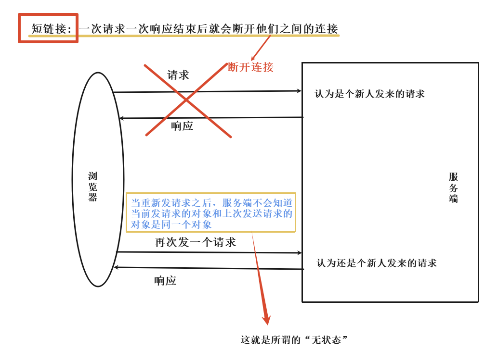

  由于短链接和无状态, 导致如果不用特殊手段(cookie 和 Session)来记住登录用户，会导致每次都需要登录(因为服务端每次都认为请求是新人发送的请求).

```python
http://127.0.0.1:8000/admin/list/
https://127.0.0.1:8000/admin/list/
```

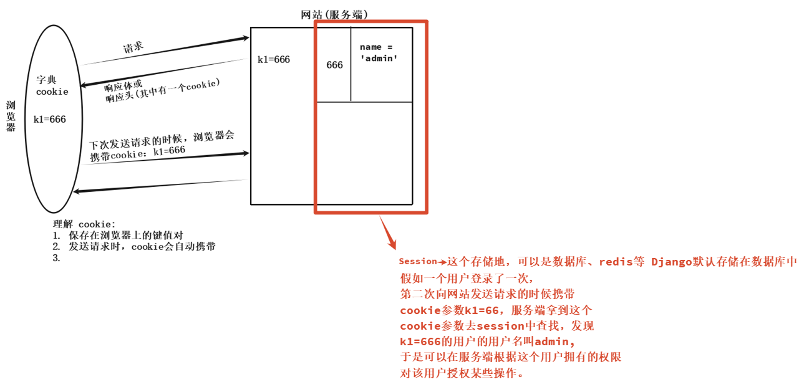

注意：如果有多个用户登录，cookie和Session的方式也不会出问题，只需要给新登录用户一个cookie，然后给他开辟一个Session，将新登录用户的cookie和Session中的用户信息存储下来即可。

## 2.2 管理员登录

`views.account.py`

```python
from django import forms

from django.shortcuts import render, redirect, HttpResponse
from django.conf import settings
from django.utils.safestring import mark_safe
from django.core.exceptions import ValidationError

# Create your views here.

from website.models import Department, EmployeeInfo, PrettyNumber, Admin
from utils.encrypt import md5_encrypt
from utils.my_form import BootStrapForm


class LoginForm(forms.Form):
    """因为不是对表做增删改查 所以使用 Form"""

    # # 笔记: 1. 可以这么加属性
    name = forms.CharField(label='用户名', widget=forms.TextInput(attrs={'class': 'form-control'}))
    password = forms.CharField(label='密码', widget=forms.PasswordInput(attrs={'class': 'form-control'}))

    # # 笔记: 2. 也可以这么加属性
    # username = forms.CharField(label='用户名', widget=forms.TextInput)
    # password = forms.CharField(label='密码', widget=forms.PasswordInput)
    #
    # def __init__(self, *args, **kwargs):
    #     """也可以这么加属性"""
    #     super().__init__(*args, **kwargs)
    #     for name, field in self.fields.items():
    #         if not field.widget.attrs:
    #             field.widget.attrs = {'class': 'form-control', 'placeholder': field.label}
    #         else:
    #             field.widget.attrs['class'] = 'form-control'
    #             field.widget.attrs['placeholder'] = field.label

    # # 警告: 3. 不可以这么加
    # #  普通 Form 继承自 forms.Form, Django 在构造 Form 类时，并不会去查找一个名为 widget 的类属性并自动应用到字段上。
    # username = forms.CharField(label='用户名', )
    # password = forms.CharField(label='密码', )
    # widget = {
    #     'username': forms.TextInput(attrs={'class': 'form-control'}),
    #     'password': forms.PasswordInput(attrs={'class': 'form-control'}),
    # }

    # # 警告: 3. 也不可以这么加
    # #  这个行为是 Django 框架专门为 ModelForm 实现的一个便捷功能，
    # #  目的是让你不用在字段定义时一个一个写 widget=，方便复用模型字段的同时自定义渲染控件。
    # username = forms.CharField(label='用户名', )
    # password = forms.CharField(label='密码', )
    #
    # class Meta:
    #     fields = ['username', 'password']
    #     widget = {
    #         'username': forms.TextInput(attrs={'class': 'form-control'}),
    #         'password': forms.PasswordInput(attrs={'class': 'form-control'}),
    #     }


class LoginFormSub(BootStrapForm):
    name = forms.CharField(label='用户名', widget=forms.TextInput, required=True)
    # render_value=True 密码输错后不删除密码
    password = forms.CharField(label='密码', widget=forms.PasswordInput(render_value=True), required=True)

    def clean_password(self):
        """对密码长度进行校验，返回加密后的密文"""
        password = self.cleaned_data.get('password')
        if not password:
            raise ValidationError('错误: 需要输入密码提交!')

        if len(password) < 8 or len(password) > 64:
            raise ValidationError('密码长度应为 8 - 64 位')
        return md5_encrypt(password)


class LoginModelFrom(forms.ModelForm):
    """也可以用 ModelForm 做"""

    class Meta:
        model = Admin
        fields = ['name', 'password']


def login(request):
    if request.method == 'GET':
        form = LoginFormSub()
        return render(request, 'login.html', {'form': form})
    form = LoginFormSub(request.POST)
    if form.is_valid():
        # 验证成功 -- 格式、长度等没问题
        # print(form.cleaned_data)  # {'username': 'master', 'password': '5707ede5dsagb86e1a934d30ef09a910'}

        # 去数据库校验用户名和密码是否正确 如果名字密码错误，那么返回空 否则返回对象
        # Admin.objects.filter(username='admin_username', password='encrypted_pwd').first()
        admin_obj = Admin.objects.filter(**form.cleaned_data).first()
        if not admin_obj:
            # 没有校验通过
            form.add_error('password', '用户名或密码错误')  # Form/modelForm都有这个添加错误到前端的语法
            return render(request, 'login.html', {'form': form})

        # 用户名和密码正确
        # 网站生成随机字符串 写进用户浏览器的 cookie 中 再写入到 Session 中
        
        # 这一句就已经将整个 cookie 和 Session 都做好了 在Session中写入了 info={'id': '12', 'name': '这是登录名',}
        request.session['info'] = {'id': admin_obj.id, 'name': admin_obj.name, }

        return redirect('/admin/list/')
    else:
        return render(request, 'login.html', {'form': form})

```

`urls.py`

```python
urlpatterns = [
    ...,
    # 用户登录
    path('login/', accounts.login),
]
```

`login.html`

```html
<!DOCTYPE html>
<html lang="en">
<head>
    <meta charset="UTF-8">
    <title>Title</title>
    <link rel="stylesheet" href="">
    <link rel="stylesheet" href="">

    <style>
        .account {
            width: 500px;
            /*height: 400px;*/
            border: 1px solid gray;
            border-radius: 10px;
            margin-left: auto;
            margin-right: auto;
            margin-top: 100px;
            padding: 20px 30px;
            /* 增加阴影 */
            /* 水平 垂直 阴影多大 颜色*/
            box-shadow: 5px -5px 5px #aaa;
        }

        .account h1 {
            text-align: center;
            margin-top: 5px;
        }
		
        h1 {
            margin-bottom: 20px;
        }
    </style>
</head>
<body>
<div class="account">
    <h3 style="text-align: center;">用户登录(不循环 Form 版)</h3>
    <div class="row" style="margin-left: 20px; margin-right: 20px;">
        <hr class="border border-danger opacity-20">
    </div>
    <form method="POST" novalidate>
        
        <div class="mb-3 row" style="margin-left: 20px; margin-right: 20px;">
            <label class="form-label">用户名</label>
            <!--            <input type="text" class="form-control">-->
            <!--此处不写循环是因为: 当前登录页面的字段比较少 没必要再写循环了-->
            {{ form.name }}
            <span style="color: red;">{{ form.username.errors.0 }}</span>
        </div>
        <div class="mb-3 row" style="margin-left: 20px; margin-right: 20px;">
            <label class="form-label">密码</label>
            <!--            <input type="password" class="form-control">-->
            {{ form.password }}
            <span style="color: red;">{{ form.password.errors.0 }}</span>
        </div>
        <div class="row" style="margin-left: 20px; margin-right: 20px;">
            <div class="mb-3 form-check">
                <input type="checkbox" class="form-check-input" id="exampleCheck1">
                <label class="form-check-label" for="exampleCheck1">记住密码</label>
            </div>
        </div>
        <div class="row" style="margin-left: 20px; margin-right: 20px;">
            <button type="submit" class="btn btn-primary" style="width: 70px;">提 交</button>
        </div>
    </form>
</div>
</body>
</html>

```

浏览器登录后：

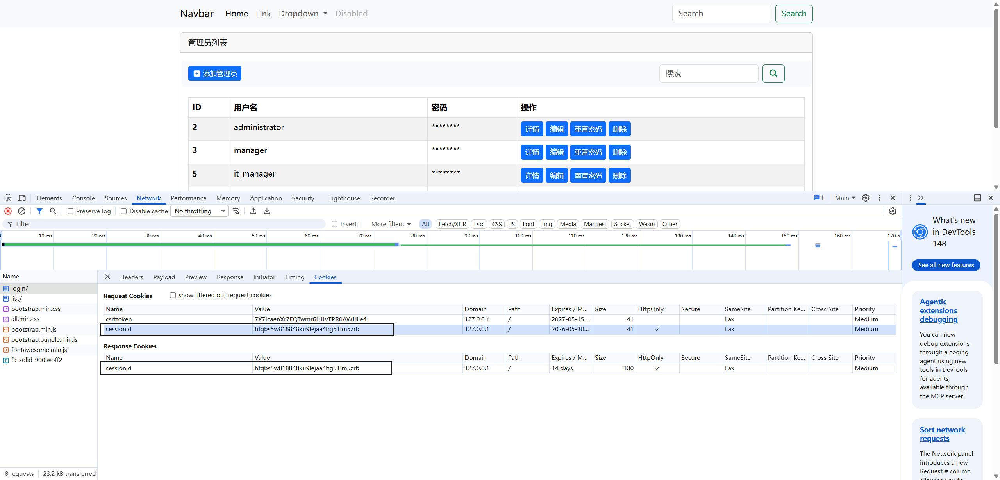

在数据库中，`Django`为我们建立了关于Session的数据库：

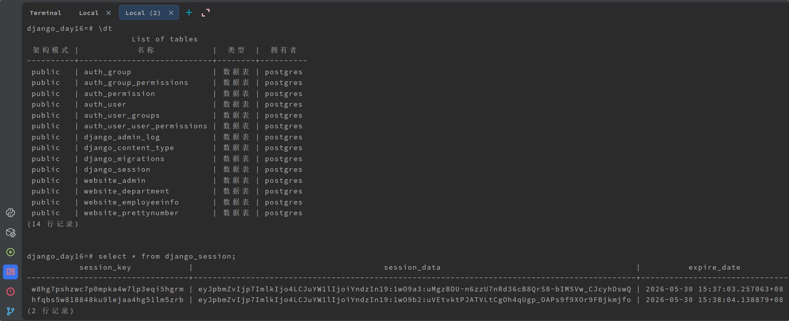

用另外一个浏览器再登录一次：

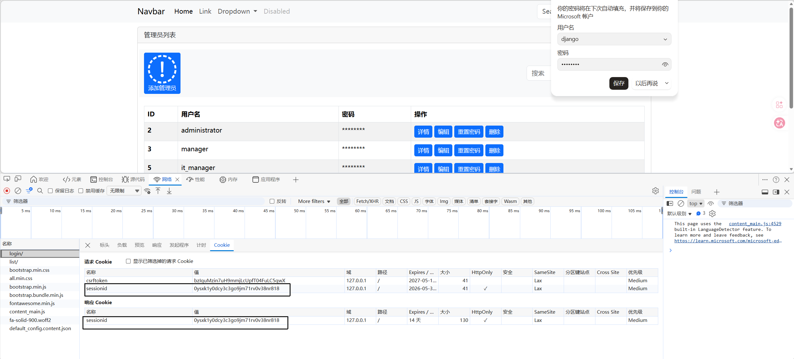

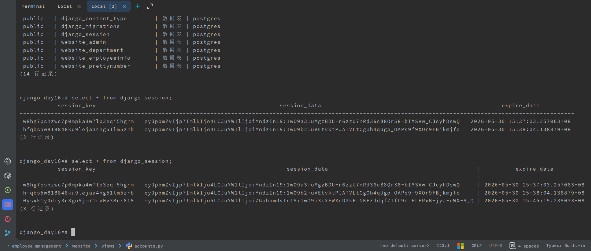

## 2.3 只要没有登录 任何请求都定位到登录界面

登录成功后：

- cookie：随机字符串
- Session：用户信息

在其他需要登录才能访问的页面中，都需要加入:

```python
# 获取用户发来请求的 cookie 随机字符串 拿着这个随机字符串看看 Session 中有没有
info = request.session.get('info')  # 这里的 info 就是我么在 登录视图 中自定义的 Session 的键
if not info:  # 说明没有登录
    return redirect('/login/')
```

例如：

```python
def admin_list(request):
    """检查用户是否已经登录 已登录，继续向下走 否则跳转到登录页面"""
    info = request.session.get('info')
    if not info:
        return redirect('/login/')
    query_sets = Admin.objects.all().order_by('id')
    return render(request, 'admin_list.html', {'query_sets': query_sets})
```

这样的话每个需要登录的页面所对应的视图函数都需要加这一段代码，比较 `low `并且要写很多次重复代码，效率低

## 2.4 `Django` 中间件

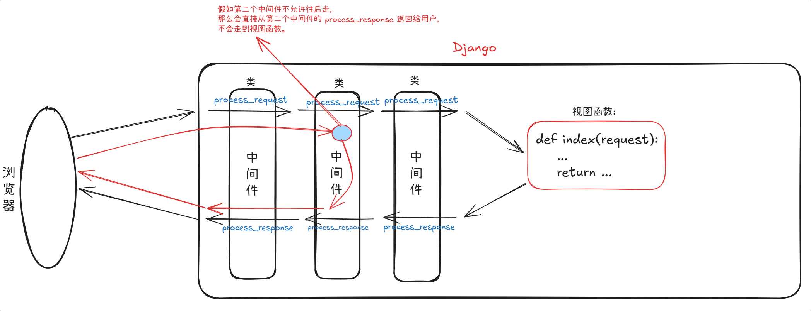

### 2.4.1 体验 Django 中间件

```python
# 写中间件

# app_name/middlewares/auth.py

from django.utils.deprecation import MiddlewareMixin


class M1(MiddlewareMixin):
    """中间件"""

    def process_request(self, request):
        print('M1 进来了')

    def process_response(self, request, response):
        print('m1 走了')
        return response

class M2(MiddlewareMixin):
    """中间件"""

    def process_request(self, request):
        print('M2 进来了')

    def process_response(self, request, response):
        print('M2 走了')
        return response
```

```python
# 在配置文件中设置

# settings.py

...

MIDDLEWARE = [
    'django.middleware.security.SecurityMiddleware',
    'django.contrib.sessions.middleware.SessionMiddleware',
    'django.middleware.common.CommonMiddleware',
    'django.middleware.csrf.CsrfViewMiddleware',
    'django.contrib.auth.middleware.AuthenticationMiddleware',
    'django.contrib.messages.middleware.MessageMiddleware',
    'django.middleware.clickjacking.XFrameOptionsMiddleware',
    
    'app_name.middlewares.auth.M1',
    'app_name.middlewares.auth.M2',
]

...

```

此时我们访问任何页面都会显示经过这两个中间件，比如我访问了 /num/list/：

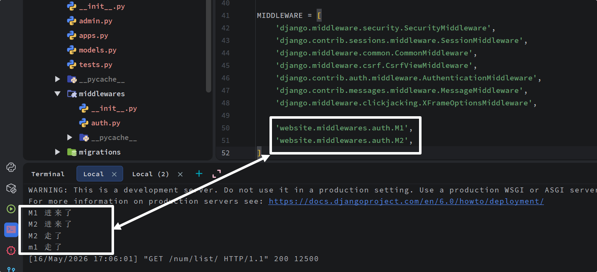

注意：

```python
class M1(MiddlewareMixin):
    """中间件"""

    def process_request(self, request):
        # 注意: process_request 方法如果没有返回值(None) 或返回了 None, 那么就继续往后走
        #   如果有返回值, HttpResponse/render/redirect, 那么就会直接给用户返回
        print('M1 进来了')
        return HttpResponse('无权访问')

    def process_response(self, request, response):
        print('m1 走了')
        return response
    
...
```

那么接下来我随便访问一个页面: 就会出现以下界面！并且没有访问 `M2` 这个中间件。

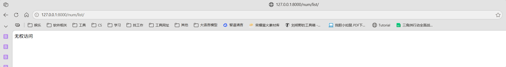

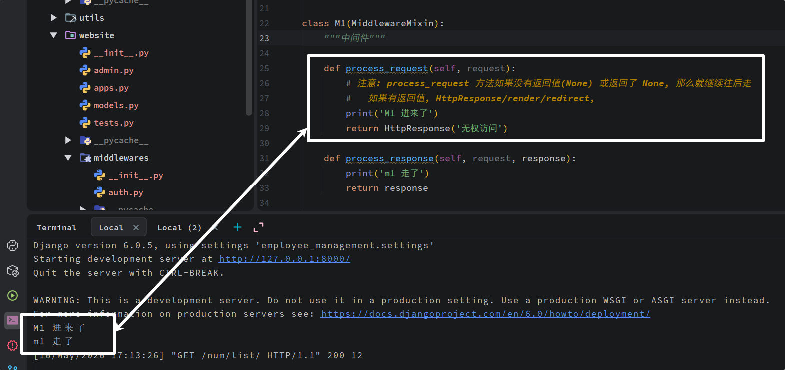

### 2.4.2 定义中间件

```python
# app_name/middlewares/my_middleware.py

from django.utils.deprecation import MiddlewareMixin
from django.shortcuts import HttpResponse, render, redirect


class YourMiddleware(MiddlewareMixin):
    """中间件"""

    def process_request(self, request):
        # 返回 None 或者 HttpResponse()/redirect()/render()
        ...

    def process_response(self, request, response):
        print('m1 走了')
        return response
```

### 2.4.3 使用中间件

在 `Django` 配置文件中

```python
# settings.py

...

MIDDLEWARE = [
    'django.middleware.security.SecurityMiddleware',
    'django.contrib.sessions.middleware.SessionMiddleware',
    'django.middleware.common.CommonMiddleware',
    'django.middleware.csrf.CsrfViewMiddleware',
    'django.contrib.auth.middleware.AuthenticationMiddleware',
    'django.contrib.messages.middleware.MessageMiddleware',
    'django.middleware.clickjacking.XFrameOptionsMiddleware',
    
    'app_name.middlewares.my_middleware.YourMiddleware',
    'app_name.middlewares.my_middleware.M2',
]

...
```

### 2.4.4 `process_request` 返回值

```python
如果没有返回值或显式返回None: 继续向后走
如果有返回值 HttpResponse(...)/redirect(...)/render(...), 则不再继续向后执行
```

## 2.5 实现登录校验

### 2.5.1 一个问题

我写了一个中间件并且在配置文件中注册好

```python
class AuthMiddleware(MiddlewareMixin):
    """中间件"""

    def process_request(self, request):
        # 读取当前访问的用户的 Session 信息
        info = request.session.get('info')
        if not info:
            return redirect('/login/')
        return None

    def process_response(self, request, response):
        return response
```

我没登录去访问 `/admin/list/`:

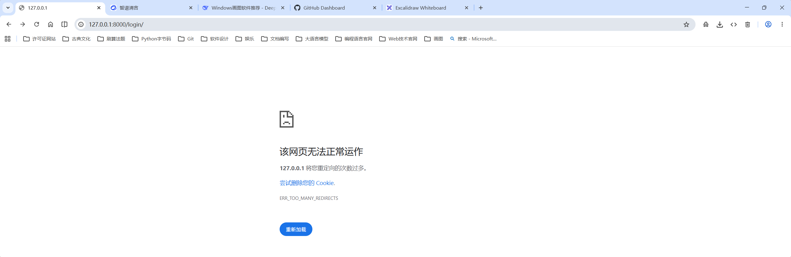

Django后台: 一堆 302 错误

```python
[16/May/2026 17:31:59] "GET /admin/list/ HTTP/1.1" 302 0
[16/May/2026 17:31:59] "GET /login/ HTTP/1.1" 302 0
[16/May/2026 17:31:59] "GET /login/ HTTP/1.1" 302 0
[16/May/2026 17:31:59] "GET /login/ HTTP/1.1" 302 0
[16/May/2026 17:31:59] "GET /login/ HTTP/1.1" 302 0
[16/May/2026 17:31:59] "GET /login/ HTTP/1.1" 302 0
[16/May/2026 17:31:59] "GET /login/ HTTP/1.1" 302 0
[16/May/2026 17:31:59] "GET /login/ HTTP/1.1" 302 0
[16/May/2026 17:31:59] "GET /login/ HTTP/1.1" 302 0
[16/May/2026 17:31:59] "GET /login/ HTTP/1.1" 302 0
[16/May/2026 17:31:59] "GET /login/ HTTP/1.1" 302 0
[16/May/2026 17:31:59] "GET /login/ HTTP/1.1" 302 0
[16/May/2026 17:31:59] "GET /login/ HTTP/1.1" 302 0
[16/May/2026 17:31:59] "GET /login/ HTTP/1.1" 302 0
[16/May/2026 17:31:59] "GET /login/ HTTP/1.1" 302 0
[16/May/2026 17:31:59] "GET /login/ HTTP/1.1" 302 0
[16/May/2026 17:31:59] "GET /login/ HTTP/1.1" 302 0
[16/May/2026 17:31:59] "GET /login/ HTTP/1.1" 302 0
[16/May/2026 17:31:59] "GET /login/ HTTP/1.1" 302 0
[16/May/2026 17:31:59] "GET /login/ HTTP/1.1" 302 0
[16/May/2026 17:32:00] "GET /login/ HTTP/1.1" 302 0
[16/May/2026 17:32:00] "GET /login/ HTTP/1.1" 302 0
[16/May/2026 17:32:00] "GET /login/ HTTP/1.1" 302 0
[16/May/2026 17:32:00] "GET /login/ HTTP/1.1" 302 0
[16/May/2026 17:32:00] "GET /login/ HTTP/1.1" 302 0
[16/May/2026 17:32:00] "GET /login/ HTTP/1.1" 302 0
[16/May/2026 17:32:00] "GET /login/ HTTP/1.1" 302 0
[16/May/2026 17:32:00] "GET /login/ HTTP/1.1" 302 0
[16/May/2026 17:32:00] "GET /login/ HTTP/1.1" 302 0
[16/May/2026 17:32:00] "GET /login/ HTTP/1.1" 302 0
[16/May/2026 17:32:00] "GET /login/ HTTP/1.1" 302 0
[16/May/2026 17:32:00] "GET /login/ HTTP/1.1" 302 0
[16/May/2026 17:32:00] "GET /login/ HTTP/1.1" 302 0
[16/May/2026 17:32:00] "GET /login/ HTTP/1.1" 302 0
[16/May/2026 17:32:00] "GET /login/ HTTP/1.1" 302 0
[16/May/2026 17:32:00] "GET /login/ HTTP/1.1" 302 0
[16/May/2026 17:32:00] "GET /login/ HTTP/1.1" 302 0
[16/May/2026 17:32:00] "GET /login/ HTTP/1.1" 302 0
[16/May/2026 17:32:00] "GET /login/ HTTP/1.1" 302 0
[16/May/2026 17:32:00] "GET /login/ HTTP/1.1" 302 0
[16/May/2026 17:32:05] "GET /login/ HTTP/1.1" 302 0
[16/May/2026 17:32:05] "GET /login/ HTTP/1.1" 302 0
[16/May/2026 17:32:05] "GET /login/ HTTP/1.1" 302 0
[16/May/2026 17:32:05] "GET /login/ HTTP/1.1" 302 0
[16/May/2026 17:32:05] "GET /login/ HTTP/1.1" 302 0
[16/May/2026 17:32:05] "GET /login/ HTTP/1.1" 302 0
[16/May/2026 17:32:05] "GET /login/ HTTP/1.1" 302 0
[16/May/2026 17:32:05] "GET /login/ HTTP/1.1" 302 0
[16/May/2026 17:32:05] "GET /login/ HTTP/1.1" 302 0
[16/May/2026 17:32:05] "GET /login/ HTTP/1.1" 302 0
[16/May/2026 17:32:05] "GET /login/ HTTP/1.1" 302 0
[16/May/2026 17:32:05] "GET /login/ HTTP/1.1" 302 0
[16/May/2026 17:32:06] "GET /login/ HTTP/1.1" 302 0
[16/May/2026 17:32:06] "GET /login/ HTTP/1.1" 302 0
[16/May/2026 17:32:06] "GET /login/ HTTP/1.1" 302 0
[16/May/2026 17:32:06] "GET /login/ HTTP/1.1" 302 0
[16/May/2026 17:32:06] "GET /login/ HTTP/1.1" 302 0
[16/May/2026 17:32:06] "GET /login/ HTTP/1.1" 302 0
[16/May/2026 17:32:06] "GET /login/ HTTP/1.1" 302 0
[16/May/2026 17:32:06] "GET /login/ HTTP/1.1" 302 0
```

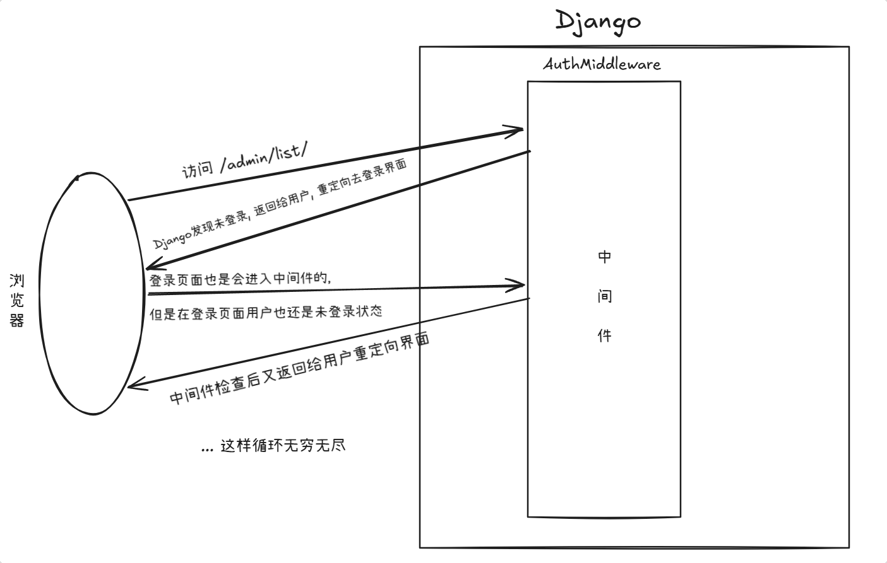

### 2.5.2 对于 2.5.1 问题的解决

```python
class AuthMiddleware(MiddlewareMixin):
    """中间件"""
	
    def process_request(self, request):
        # 排除那些不需要登录就能访问的网页
        # request.path_info = ''  # request.path_info: 获取用户当前请求的 url eg: /login/
        if request.path_info == '/login/':
            return None
        # 读取当前访问的用户的 Session 信息
        info = request.session.get('info')
        if not info:
            return redirect('/login/')
        return None

    def process_response(self, request, response):
        return response
```

# 3. 注销

```python
# urls.py
urlpatterns = [
    ...,
    path('logout/', accounts.logout),
	...
]

# views.py
def logout(request):
    """注销用户"""
    # 清除当前用户的Session
    request.session.clear()
    return redirect('/login/')

```

```html
# base.html



<!DOCTYPE html>
<html lang="en">
<head>
    <meta charset="UTF-8">
    <title></title>
    
    <link rel="stylesheet" href="">
    <link rel="stylesheet" href="">
    <!--    <link rel="stylesheet" href="">-->
</head>
<body>

<nav class="navbar navbar-expand-lg bg-body-tertiary">
    <div class="container">
        <a class="navbar-brand" href="#">Navbar</a>
        <button class="navbar-toggler" type="button" data-bs-toggle="collapse" data-bs-target="#navbarSupportedContent"
                aria-controls="navbarSupportedContent" aria-expanded="false" aria-label="Toggle navigation">
            <span class="navbar-toggler-icon"></span>
        </button>
        <div class="collapse navbar-collapse" id="navbarSupportedContent">
            <ul class="navbar-nav me-auto mb-2 mb-lg-0">
                <li class="nav-item">
                    <a class="nav-link active" aria-current="page" href="#">Home</a>
                </li>
                <li class="nav-item">
                    <a class="nav-link" href="#">Link</a>
                </li>
                <li class="nav-item dropdown">
                    <a class="nav-link dropdown-toggle" href="#" role="button" data-bs-toggle="dropdown"
                       aria-expanded="false">
                        Dropdown
                    </a>
                    <ul class="dropdown-menu">
                        <li><a class="dropdown-item" href="#">Action</a></li>
                        <li><a class="dropdown-item" href="#">Another action</a></li>
                        <li>
                            <hr class="dropdown-divider">
                        </li>
                        <li><a class="dropdown-item" href="#">Something else here</a></li>
                    </ul>
                </li>
                <li class="nav-item">
                    <a class="nav-link disabled" aria-disabled="true">Disabled</a>
                </li>
            </ul>
            <div class="btn-group">
                <button type="button" class="btn dropdown-toggle" data-bs-toggle="dropdown"
                        aria-expanded="false">
                    用户:{{Danger}}默认
                </button>
                <ul class="dropdown-menu">
                    <li><a class="dropdown-item" href="#">个人中心</a></li>
                    <li><a class="dropdown-item" href="#">账号设置</a></li>
                    <li><a class="dropdown-item" href="#">会员中心</a></li>
                    <li>
                        <hr class="dropdown-divider">
                    </li>
                    <li><a class="dropdown-item" href="/logout/">注销账号</a></li>
                </ul>
            </div>
        </div>
    </div>
</nav>

<div class="container" style="margin-top: 10px;">
    
    

</div>


<!-- 同时引入 bootstrap.min.js 和 bootstrap.bundle.min.js 可能会有冲突导致有些需要互动的元素出现bug-->
<!-- 引入 bootstrap.bundle.min.js 是为了能够实现 bootstrap 的某些元素的互动 -->
<!--<script src=""></script>-->
<script src=""></script>
<script src=""></script>
</body>
</html>
```

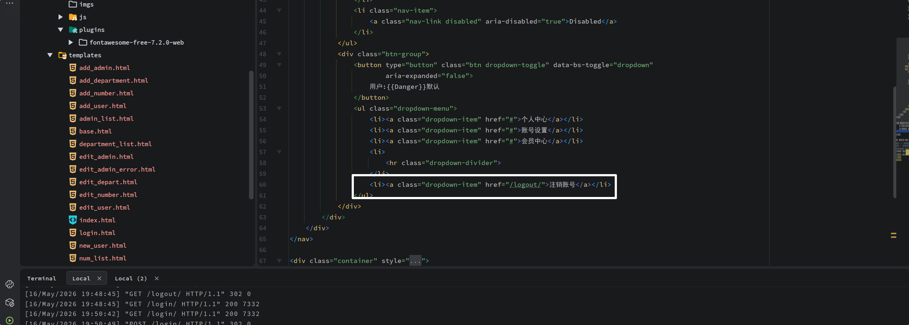

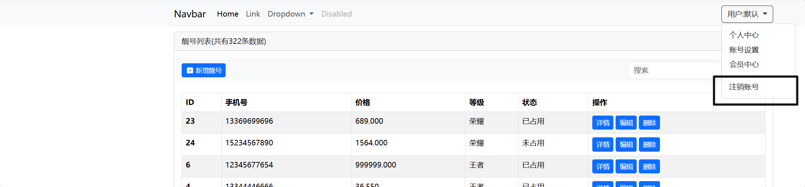

点击注销账号之后就会自动跳转到登录界面。

现在有个问题：某个用户登录成功后应该显示某个用户的登录信息，但是我们目前只是写死了我们的数据：

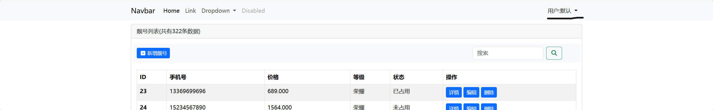

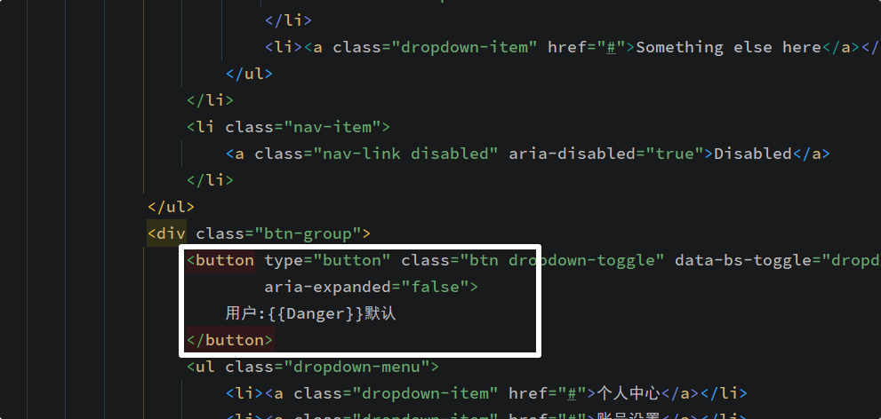


# 4. 当前用户

因为模板文件是通用的，所以可以直接在模板文件中这样写：

```html
<div class="btn-group">
    <button type="button" class="btn dropdown-toggle" data-bs-toggle="dropdown"
            aria-expanded="false">
        {{ request.session.info.name }}
    </button>
    <ul class="dropdown-menu">
        <li><a class="dropdown-item" href="#">个人中心</a></li>
        <li><a class="dropdown-item" href="#">账号设置</a></li>
        <li><a class="dropdown-item" href="#">会员中心</a></li>
        <li>
            <hr class="dropdown-divider">
        </li>
        <li><a class="dropdown-item" href="/logout/">注销账号</a></li>
    </ul>
</div>
```

注意：这里的 request 就是 render 函数的第一个参数 request，以前只是传过去, 现在才用到。

```python
def func(request)
	return render(request, 'login.html', {'form': form})
```

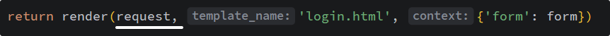

修改完毕后：

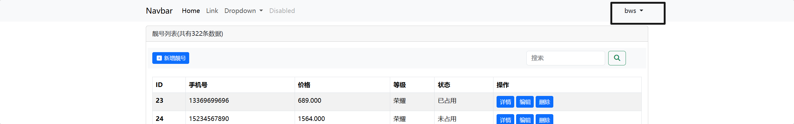


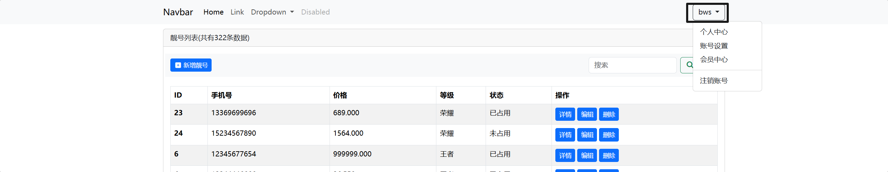

# 5. 图片验证码


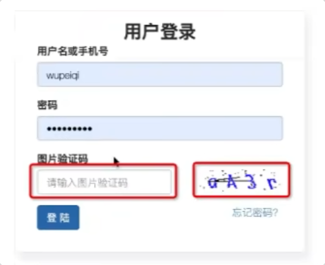

## 5.1 先写死图片

```html
# login.html

<form method="POST" novalidate>
        
        <div class="mb-3 row" style="margin-left: 20px; margin-right: 20px;">
            <label class="form-label">用户名</label>
            {{ form.name }}
            <span style="color: red;">{{ form.username.errors.0 }}</span>
        </div>
        <div class="mb-3 row" style="margin-left: 20px; margin-right: 20px;">
            <label class="form-label">密码</label>
            {{ form.password }}
            <span style="color: red;">{{ form.password.errors.0 }}</span>
        </div>

        <div class="mb-3 row" style="margin-left: 20px; margin-right: 20px;">
            <label class="form-label">图形验证码</label>
            <input type="text" class="form-control" placeholder="请输入验证码"
                   style="width: 320px; margin-right: 8px;">
            
        </div>

        <div class="row" style="margin-left: 20px; margin-right: 20px;">
            <div class="mb-3 form-check col">
                <input type="checkbox" class="form-check-input" id="exampleCheck1">
                <label class="form-check-label" for="exampleCheck1">记住密码</label>
            </div>
        </div>

        <div class="row" style="margin-left: 20px; margin-right: 20px;">
            <button type="submit" class="btn btn-primary" style="width: 70px;">提 交</button>
        </div>
    </form>
```

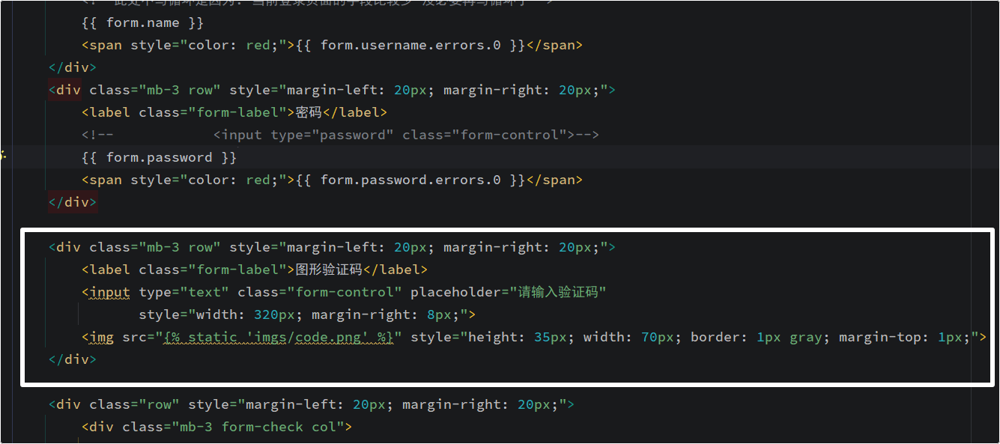

展示效果：

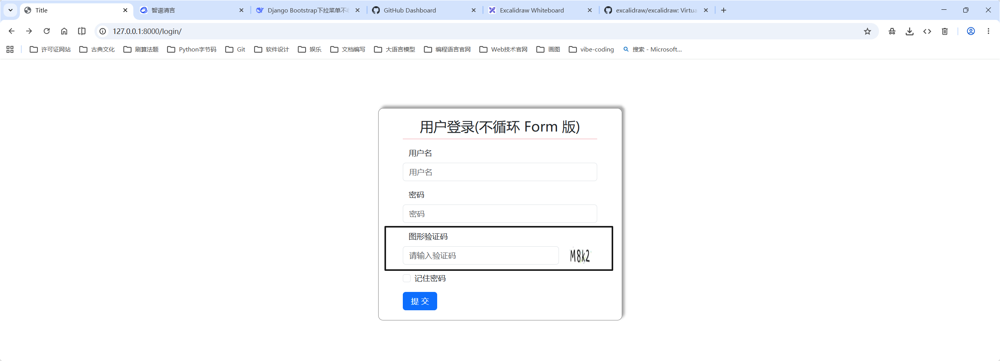

## 5.2 Python中生成图片

```bash
pip install pillow
```

```python
# 用 pillow 生成几张图片 -- 和 Django 没关系

from PIL import Image

# size 是图片的尺寸 宽 70, 高 35 像素, color 是颜色, (255, 255, 255) 是白色
img = Image.new(mode="RGB", size=(70, 35), color=(255, 255, 255))

# 将图片保存到本地
with open('test_code.png', 'wb') as fp:
    img.save(fp, format="png")
```

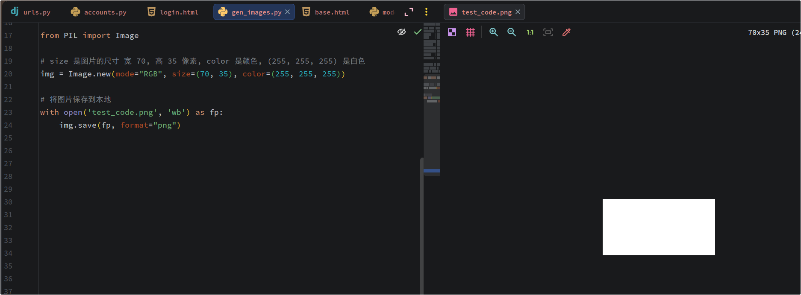

```python
from PIL import Image, ImageDraw, ImageFont

# size 是图片的尺寸 宽 70, 高 35 像素, color 是颜色, (255, 255, 255) 是白色
img = Image.new(mode="RGB", size=(70, 35), color=(255, 255, 255))

# 创建画笔
draw = ImageDraw.Draw(img, mode="RGB")

# # 画点
# # 第一个参数是位置 第二个参数是颜色
# draw.point([25, 10], fill='red')
# draw.point([35, 20], fill=(255, 255, 255))
#
# # 画线
# # 第一个参数是起始位置和结束位置 第二个参数是颜色
# draw.line((25, 10, 25, 20), fill='red')
# draw.line((35, 20, 45, 20), fill=(255, 255, 255))
#
# # 画圆
# # 第一个参数: 起始坐标和结束坐标
# # 第二个参数: 开始角度
# # 第三个参数: 结束角度
# # 第四个参数: 表示颜色
# draw.arc((10, 20, 10, 30), 0, 90, fill='red')

# 特殊字体文件
# 第一个参数: 表示字体文件路径给你
# 第二个参数: 表示字体大小
font = ImageFont.truetype(r'E:\Code\PyProjects\employee_management\fonts\Monaco.ttf', 28)

# 写入文本
# 第一个参数: 表示起始坐标
# 第二个参数: 表示写入内容
# 第三个参数: 表示颜色
# 第四个参数: 表示字体对象
draw.text((0, 0), '7y8u', 'red', font=font)

# 将图片保存到本地
with open('test_code_text_font.png', 'wb') as fp:
    img.save(fp, format="png")
```

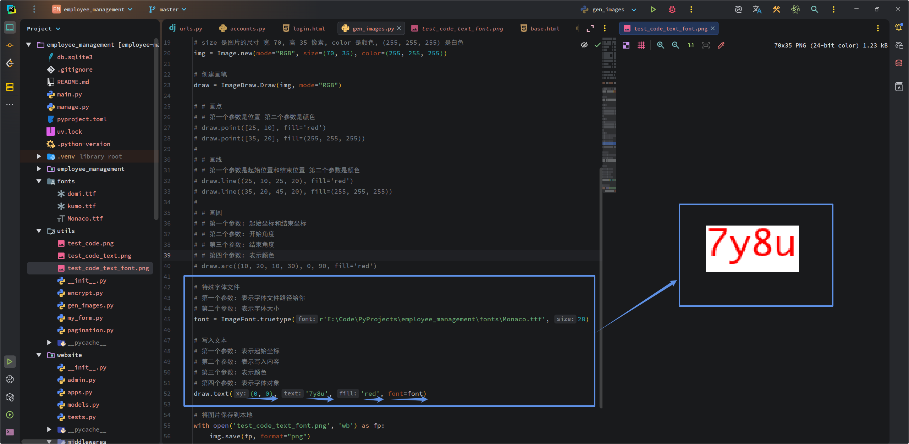

BUT!如果要生成类似下面这张图片这样的验证码，就得自己再向图片中画很多的点和线，非常麻烦。

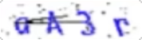

有现成的代码生成这种图片：参考武沛齐老师的博客[武沛齐老师的博客-博客园](https://www.cnblogs.com/wupeiqi/articles/5812291.html)

```python
import random
 
def check_code(width=120, height=30, char_length=5, font_file='kumo.ttf', font_size=28):
    code = []
    img = Image.new(mode='RGB', size=(width, height), color=(255, 255, 255))
    draw = ImageDraw.Draw(img, mode='RGB')
 
    def rndChar():
        """
        生成随机字母   
        :return:
        """
        return chr(random.randint(65, 90))
 
    def rndColor():
        """
        生成随机颜色
        :return:
        """
        return (random.randint(0, 255), random.randint(10, 255), random.randint(64, 255))
 
    # 写文字
    font = ImageFont.truetype(font_file, font_size)
    for i in range(char_length):
        char = rndChar()
        code.append(char)
        h = random.randint(0, 4)
        draw.text([i * width / char_length, h], char, font=font, fill=rndColor())
 
    # 写干扰点
    for i in range(40):
        draw.point([random.randint(0, width), random.randint(0, height)], fill=rndColor())
 
    # 写干扰圆圈
    for i in range(40):
        draw.point([random.randint(0, width), random.randint(0, height)], fill=rndColor())
        x = random.randint(0, width)
        y = random.randint(0, height)
        draw.arc((x, y, x + 4, y + 4), 0, 90, fill=rndColor())
 
    # 画干扰线
    for i in range(5):
        x1 = random.randint(0, width)
        y1 = random.randint(0, height)
        x2 = random.randint(0, width)
        y2 = random.randint(0, height)
 
        draw.line((x1, y1, x2, y2), fill=rndColor())
 
    img = img.filter(ImageFilter.EDGE_ENHANCE_MORE)
    return img,''.join(code)
 
 
if __name__ == '__main__':
    # 1. 直接打开
    # img,code = check_code()
    # img.show()
 
    # 2. 写入文件
    # img,code = check_code()
    # with open('code.png','wb') as f:
    #     img.save(f,format='png')
 
    # 3. 写入内存(Python3)
    # from io import BytesIO
    # stream = BytesIO()
    # img.save(stream, 'png')
    # stream.getvalue()
 
    # 4. 写入内存（Python2）
    # import StringIO
    # stream = StringIO.StringIO()
    # img.save(stream, 'png')
    # stream.getvalue()
```

## 5.3 生成验证码

`fonts 文件夹`

```python
- 项目根目录
	- ...
	- fonts
    	- domi.ttf
        - ...
```


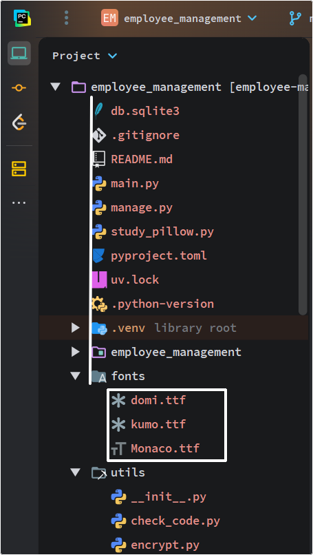

```python
# utils/check_code.py

import random
from PIL import Image, ImageDraw, ImageFont, ImageFilter


def check_code(
        width=120,
        height=35,
        char_length=5,
        # font_file=r'E:\Code\PyProjects\employee_management\fonts\kumo.ttf',
        font_file='./fonts/Monaco.ttf',
        font_size=28
):
    code = []
    img = Image.new(mode='RGB', size=(width, height), color=(255, 255, 255))
    draw = ImageDraw.Draw(img, mode='RGB')

    def rndChar():
        """
        生成随机字母
        :return:
        """
        return chr(random.randint(65, 90))

    def rndColor():
        """
        生成随机颜色
        :return:
        """
        # return (random.randint(0, 255), random.randint(10, 255), random.randint(64, 255))
        return random.randint(0, 255), random.randint(10, 255), random.randint(64, 255)

    # 写文字
    font = ImageFont.truetype(font_file, font_size)
    for i in range(char_length):
        char = rndChar()
        code.append(char)
        h = random.randint(0, 4)
        draw.text((i * width / char_length, h), char, font=font, fill=rndColor())

    # 写干扰点
    for i in range(40):
        draw.point([random.randint(0, width), random.randint(0, height)], fill=rndColor())

    # 写干扰圆圈
    for i in range(40):
        draw.point([random.randint(0, width), random.randint(0, height)], fill=rndColor())
        x = random.randint(0, width)
        y = random.randint(0, height)
        draw.arc((x, y, x + 4, y + 4), 0, 90, fill=rndColor())

    # 画干扰线
    for i in range(5):
        x1 = random.randint(0, width)
        y1 = random.randint(0, height)
        x2 = random.randint(0, width)
        y2 = random.randint(0, height)

        draw.line((x1, y1, x2, y2), fill=rndColor())

    img = img.filter(ImageFilter.EDGE_ENHANCE_MORE)
    return img, ''.join(code)


if __name__ == '__main__':
    pass
    # 1. 直接打开
    # img, code = check_code()
    # img.show()

    # 2. 写入文件
    # img,code = check_code()
    # with open('code.png','wb') as f:
    #     img.save(f,format='png')

    # 3. 写入内存(Python3)
    # from io import BytesIO
    # stream = BytesIO()
    # img.save(stream, 'png')
    # stream.getvalue()

    # 4. 写入内存（Python2）
    # import StringIO
    # stream = StringIO.StringIO()
    # img.save(stream, 'png')
    # stream.getvalue()
```

```python
# views.py


def image_code(request):
    """
    生成图形验证码图片
    注意: 这个视图函数对应的路由也不应该被中间件拦截, 因为即使我没登录也要看到图形验证码!
    """
    # 调用生成验证码的函数来生成图形验证码图片
    image_obj, code_string = check_code()

    # 将图片写入内存
    stream = BytesIO()
    image_obj.save(stream, format='png')

    return HttpResponse(stream.getvalue())
```

```python
# middlewares/auth.py


class AuthMiddleware(MiddlewareMixin):
    """中间件"""

    def process_request(self, request):
        # 排除那些不需要登录就能访问的网页
        # request.path_info = ''  # request.path_info: 获取用户当前请求的 url eg: /login/
        # 用户没登录的时候也要能看到图形验证码
        if request.path_info in {'/login/', '/image/code/'}:
            return None
        # 读取当前访问的用户的 Session 信息
        info = request.session.get('info')
        if not info:
            return redirect('/login/')
        return None

    def process_response(self, request, response):
        return response
```

```html
<form method="POST" novalidate>
    ...

    <div class="mb-3 row" style="margin-left: 20px; margin-right: 20px;">
        <label class="form-label">图形验证码</label>
        <input type="text" class="form-control" placeholder="请输入验证码" style="width: 270px; margin-right: 8px;">
        
    </div>
    ...
    </form>
```

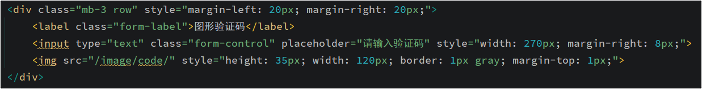

展示效果：

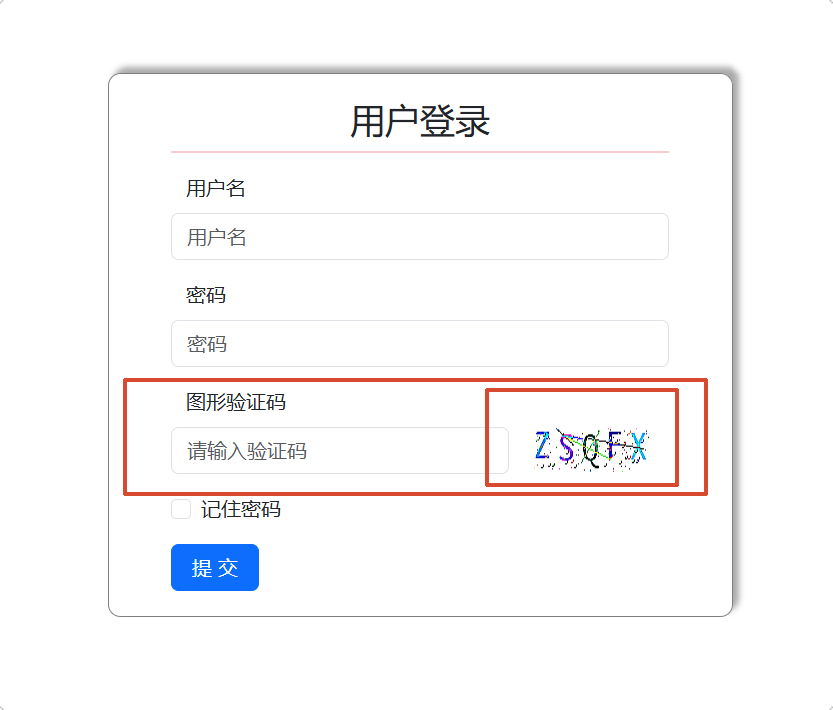

## 5.4 登录时验证验证码(Session)

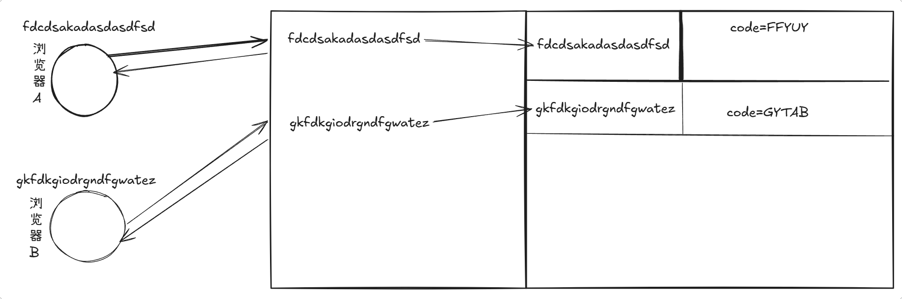

```python
# urls.py
urlpatterns = [
    ...,
    
    # 用户登录
    path('login/', accounts.login),
    path('logout/', accounts.logout),
    path('image/code/', accounts.image_code),
]

# accounts.py

class LoginFormSub(BootStrapForm):
    name = forms.CharField(label='用户名', widget=forms.TextInput, required=True)
    # render_value=True 密码输错后不删除密码
    password = forms.CharField(label='密码', widget=forms.PasswordInput(render_value=True), required=True)
    code = forms.CharField(
        widget=forms.TextInput(
            attrs={
                'style': "width: 270px; margin-right: 8px;",
            }
        ),
        required=True,
        label="请输入图形验证码"
    )

    def clean_password(self):
        """对密码长度进行校验，返回加密后的密文"""
        password = self.cleaned_data.get('password')
        if not password:
            raise ValidationError('错误: 需要输入密码提交!')

        if len(password) < 8 or len(password) > 64:
            raise ValidationError('密码长度应为 8 - 64 位')
        return md5_encrypt(password)

def login(request):
    if request.method == 'GET':
        form = LoginFormSub()
        return render(request, 'login.html', {'form': form})
    form = LoginFormSub(request.POST)
    if form.is_valid():
        # 验证成功 -- 格式、长度等没问题
        # print(form.cleaned_data)  # {'username': 'master', 'password': '5707ede5dsagb86e1a934d30ef09a910', 'code': 'xxxxx'}

        # 笔记: 如果这样写: user_input_code = form.cleaned_data.get('code'),
        #   那么在 admin_obj = Admin.objects.filter(**form.cleaned_data).first() 这行代码获取的 admin_obj 永远是空，
        #   那就永远无法通过校验

        # 这一步一定不会出错 因为如果 用户没有输入验证码 Django 直接会拦截请求 在前端展示错误信息
        user_input_code = form.cleaned_data.pop('code')
        # 校验图形验证码 -- request.session.get('image_code') 这个可能为空 因为 60 秒过期
        real_code = request.session.get('image_code')

        # 1. 检查验证码是否存在
        if not real_code or not request.session.get('image_code_created_time'):
            form.add_error('code', '请先获取验证码')
            return render(request, 'login.html', {'form': form})

        if request.session.get('image_code_created_time') and (
                time.time() - request.session.get('image_code_created_time')) > 60:
            # 如果验证码过期了
            request.session.pop('image_code', None)
            request.session.pop('image_code_created_time', None)
            form.add_error('code', '验证码已过期, 请刷新后重新输入')
            return render(request, 'login.html', {'form': form})

        # real_code 不为空，就要和用户输入的验证码进行比较了
        if real_code and user_input_code and (real_code.upper() != user_input_code.upper()):
            form.add_error('code', '验证码错误')
            return render(request, 'login.html', {'form': form})

        # 验证码正确，也立即销毁session 中的验证码 然后 校验账号密码
        request.session.pop('image_code', None)
        request.session.pop('image_code_created_time', None)
        
        if request.session.get('image_code_created_time'):
            del request.session['image_code_created_time']
        # 去数据库校验用户名和密码是否正确 如果名字密码错误，那么返回空 否则返回对象
        # Admin.objects.filter(username='admin_username', password='encrypted_pwd').first()
        admin_obj = Admin.objects.filter(**form.cleaned_data).first()
        if not admin_obj:
            # 没有校验通过
            form.add_error('password', '用户名或密码错误')  # Form/modelForm都有这个添加错误到前端的语法
            return render(request, 'login.html', {'form': form})

        # 用户名和密码正确

        # 网站生成随机字符串 写进用户浏览器的 cookie 中 再写入到 Session 中
        # 这一句就已经将整个 cookie 和 Session 都做好了 在Session中写入了 info={'id': '12', 'name': '这是登录名',}
        request.session['info'] = {'id': admin_obj.id, 'name': admin_obj.name, }

        # 设置 7 天免登录
        request.session.set_expiry(7 * 24 * 60 * 60)
        return redirect('/admin/list/')
    else:
        return render(request, 'login.html', {'form': form})

def image_code(request):
    """
    生成图形验证码图片
    注意: 这个视图函数对应的路由也不应该被中间件拦截, 因为即使我没登录也要看到图形验证码!
    """
    # 调用生成验证码的函数来生成图形验证码图片
    image_obj, code_string = check_code()

    # 笔记: 为了实现验证码的功能 在用户未登录之前就将图片验证码写入到当前用户的Session中
    #   后续用户输入用户名密码和验证码后就可以对验证码进行验证了

    # 注意: 给 session 设置 图形验证码创建时间 如果超时的话直接使验证码失效
    request.session['image_code'] = code_string
    request.session['image_code_created_time'] = time.time()

    # 将图片写入内存
    stream = BytesIO()
    image_obj.save(stream, format='png')

    return HttpResponse(stream.getvalue())
```

当然，上面的代码还有一些问题：

1. 多次写 `request.session.get('image_code_created_time'):` 效率低
2. 登录成功后应防止“会话固定攻击”
   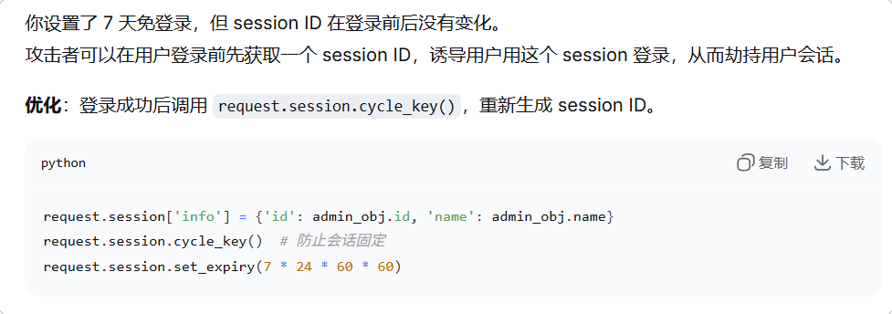

> [!Note]
>
> 注意：有时候我在代码框中写的视图函数的文件名是 `views.py`，但是在urls中却没有 `views` 这个模块，是因为我将 `Django` 自动生成的 `views.py` 进行了拆分, 拆分成 `views/users.py`、`views/accounts.py` 等。

```python
# todo: day18-2 2:19:00
```

> [!Note]
>
> 补充：关于字典的 dict.pop()方法：
>
> 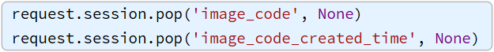
>
> 如果只有一个参数 `res = dict.pop(key='xxx')`
>
> - 如果 `'xxx'` 不在字典中, 那么这句代码会直接报错 `KeyError: 'xxx'`
> - 如果 `'xxx'` 在字典中, 那么 `res` 的值为 `dict['xxx']` 并且执行完这句代码以后字典中会直接删除 `key` 为 `'xxx'` 的键值对
>
> 如果有两个参数 `res = dict.pop('xxx', default_value)`
>
> - 如果字典中没有键为 `xxx` 的键值对, 则 `res=None`, 原字典不变
> - 如果字典中有键为`xxx` 的键值对, 则 `res=dict['xxx']`, 字典中删除 `key` 为 `'xxx'` 的键值对

# 6. Ajax 请求

浏览器向网站发送请求时, 都是以 URL 和 表单 的形式提交

- `GET`
- `POST`

特点：一点提交会刷新页面

除此之外，也可以基于 Ajax 向后台发送请求，但是不会刷新。

- 依赖 JQuery

- 编写 Ajax 代码
  ```js
  $.ajax({
  	url: "发送的地址",
  	type: "get/post",
  	data: {   // 传过去的参数
  		n1: 123,
  		n2: 456
  	},
      success: function(res){  // 如果发送成功执行的操作, 发送成功后后端返回的值为 res
          console.log(res);
      }
  })
  ```

## 6.1 专门写一个页面来测试 Ajax 请求

### 6.1.1 小测试 - 控制台打印

```python
# 路径
path('task/list/', tasks.task_list),

# 视图函数
def task_list(request):
    tasks_lists = [
        {'id': 1, 'name': '审批', 'approver': 'boss', },
        {'id': 2, 'name': '购买', 'approver': 'manager', },
        {'id': 3, 'name': '请假', 'approver': 'advance', },
    ]
    return render(request, 'task_list.html', {'tasks_lists': tasks_lists})
```

```html



管理员列表



<div class="card">
    <div class="card-header">
        任务列表
    </div>
    <div class="card-body">
        <div>
            <nav class="navbar bg-body-tertiary row">
                ...
                <div class="col">
                    <label>示例: Ajax 请求发送</label>
                    <input type="button" class="btn btn-primary" value="点击" onclick="clickMe();"/>
                </div>
                ...
            </nav>
        </div>
        <table class="table table-bordered table-striped table-hover" style="margin-top: 22px;">
            ...
        </table>
    </div>
</div>



<script type="text/javascript">
    function clickMe(){
        console.log('clickMe函数执行');
    }
</script>


```

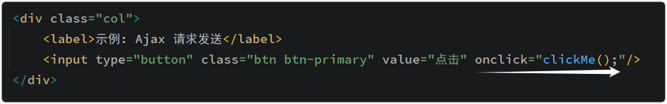

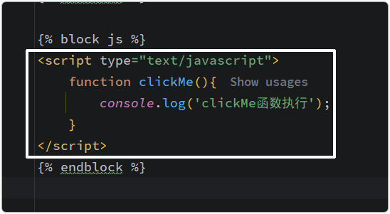

页面显示：

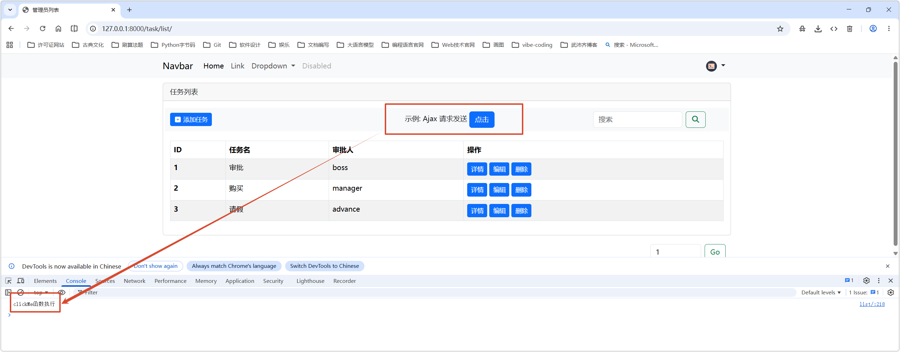

### 6.1.2 小测试 发送GET请求

```python
# 路由
path('task/list/', tasks.task_list),
path('task/ajax/', tasks.task_ajax),

# 视图
def task_list(request):
    tasks_lists = [
        {'id': 1, 'name': '审批', 'approver': 'boss', },
        {'id': 2, 'name': '购买', 'approver': 'manager', },
        {'id': 3, 'name': '请假', 'approver': 'advance', },
    ]
    return render(request, 'task_list.html', {'tasks_lists': tasks_lists})


def task_ajax(request):
    return HttpResponse('成功了')
```

```html
...
<div class="col">
    <label>示例: Ajax 请求发送</label>
    <input type="button" class="btn btn-primary" value="点击" onclick="clickMe();"/>
</div>
...


<script type="text/javascript">
    function clickMe() {
        $.ajax({  // 注意: 要使用 $.ajax: 要先将 JQuery 引入, 否则根本没有 $. 这种语法
            url: "/task/ajax/",
            type: "GET",
            data: {
                n1: 123,
                n2: 456
            },
            success: function (res) {
                console.log(res);
            }
        })
    }
</script>

```


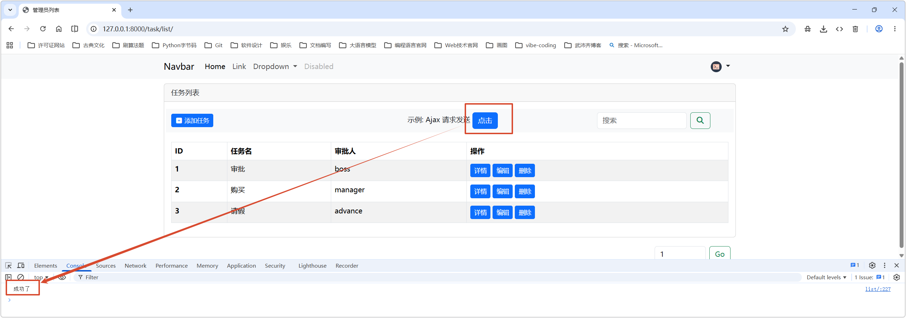

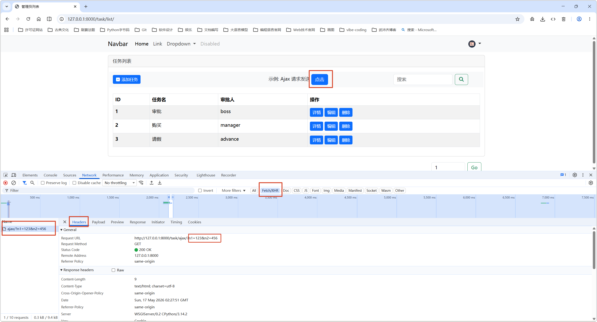

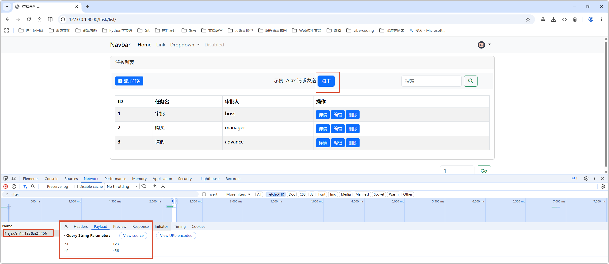

补充：

```python
def task_ajax(request):
    print(request.GET)
    return HttpResponse('成功了')
```

Django控制台打印：

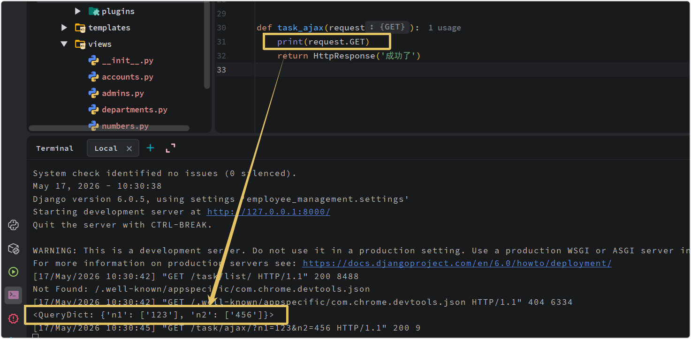

### 6.1.3 小测试 发送 POST 请求

如果将 get 请求简单的改为 post 请求会出错：
```html
<script type="text/javascript">
    function clickMe() {
        $.ajax({  // 注意: 要使用 $.ajax: 要先将 JQuery 引入, 否则根本没有 $. 这种语法
            url: "/task/ajax/",
            type: "post",
            data: {
                n1: 123,
                n2: 456
            },
            success: function (res) {
                console.log(res);
            }
        })
    }
</script>
```

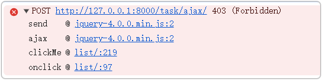

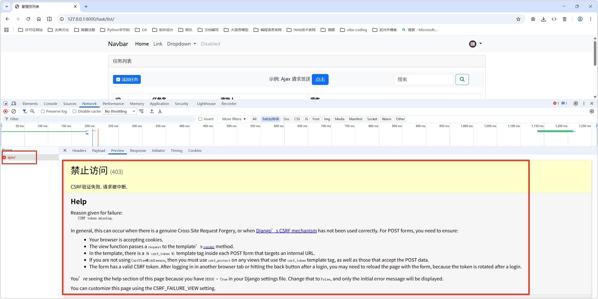

原因是：一般表单发送 `post` 请求时会携带 `csrf_token` ，但是通过 `Ajax` 去发送的可以不携带 `csrf_token`，也可以携带，但是需要去 请求头的 cookie 中去找`csrf_token`，比较复杂

简便方法：

```python
from django.views.decorators.csrf import csrf_exempt

# 免除 csrf_token
@csrf_exempt
def task_ajax(request):
    return HttpResponse(f'成功了')
```

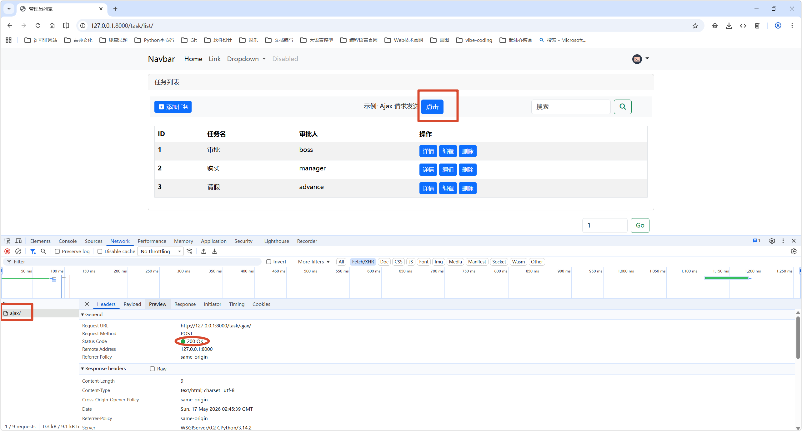

### 6.1.4 绑定事件 - `JQuery`

上述方式是通过 DOM 绑定事件的，也可以通过`JQuery`来绑定

```html
...
<div class="col">
    <label>示例: Ajax 请求发送</label>
    <input type="button" id="btn1" class="btn btn-primary" value="点击"/>
</div>
...


<script type="text/javascript">
    $(function () {
        // 页面框架加载完成之后代码自动执行
        bindBtn1Event();
    })

    function bindBtn1Event() {
        $("#btn1").click(function () {
            $.ajax({  // 注意: 要使用 $.ajax: 要先将 JQuery 引入, 否则根本没有 $. 这种语法
                url: "/task/ajax/",
                type: "post",
                data: {
                    n1: 123,
                    n2: 456
                },
                success: function (res) {
                    console.log(res);
                }
            })
        })
    }
</script>

```

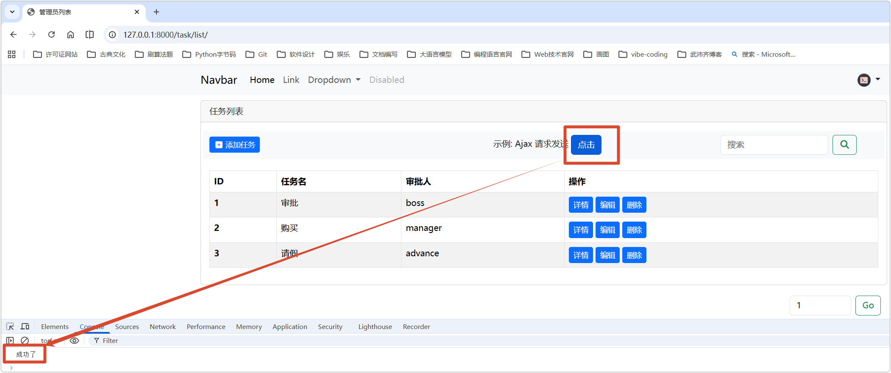

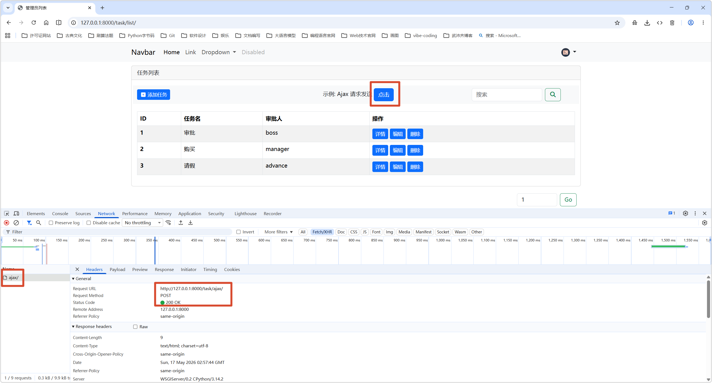

## 6.2 Ajax 请求的返回值

一般都会返回一个 `json` 格式

```python
@csrf_exempt
def task_ajax(request):
    res_dict = {
        'status': True,
        'code': 200,
        'data': [15, 26, 35, 7, 28, 9]
    }
    return HttpResponse(json.dumps(res_dict))
```

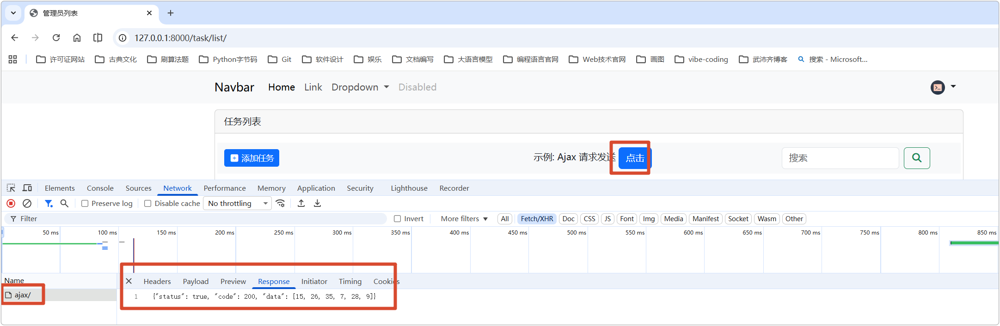

也可以这么写：

```python
from django.http import 

@csrf_exempt
def task_ajax(request):
    res_dict = {
        'status': True,
        'code': 200,
        'data': [15, 26, 35, 7, 28, 9]
    }
    return JsonResponse(res_dict)
```

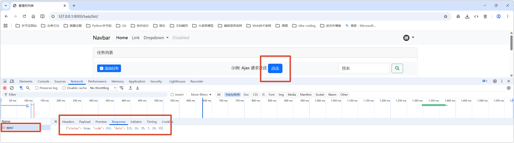

注意：如果我们按照上面的方式这样写，js拿到的res是一个字符串

```js
<script type="text/javascript">
    $(function () {
        // 页面框架加载完成之后代码自动执行
        bindBtn1Event();
    })

    function bindBtn1Event() {
        $("#btn1").click(function () {
            $.ajax({  // 注意: 要使用 $.ajax: 要先将 JQuery 引入, 否则根本没有 $. 这种语法
                url: "/task/ajax/",
                type: "post",
                data: {
                    n1: 123,
                    n2: 456
                },
                success: function (res) {
                    console.log(res);
                    // 此处无法进行 res.status 等操作
                }
            })
        })
    }
</script>
```

改成下面这样即可：

```js
<script type="text/javascript">
    $(function () {
        // 页面框架加载完成之后代码自动执行
        bindBtn1Event();
    })

    function bindBtn1Event() {
        $("#btn1").click(function () {
            $.ajax({  // 注意: 要使用 $.ajax: 要先将 JQuery 引入, 否则根本没有 $. 这种语法
                url: "/task/ajax/",
                type: "post",
                data: {
                    n1: 123,
                    n2: 456
                },

                // 写上 dataType: 'json', js 拿到字符串后会将字符串序列化为 json 格式的数据，
                // 如果不加这个 那么拿到的就是纯字符串 无法实现 res.status 等操作
                dataType: 'json',
                
                success: function (res) {
                    console.log(res);
                    console.log(res.status);
                    console.log(res.code);
                    console.log(res.data);
                }
            })
        })
    }
</script>
```

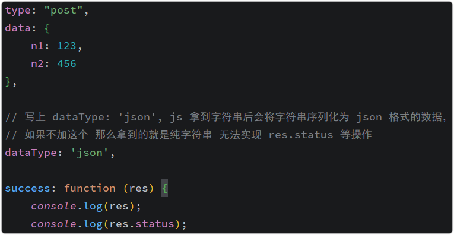


看浏览器中的结果：

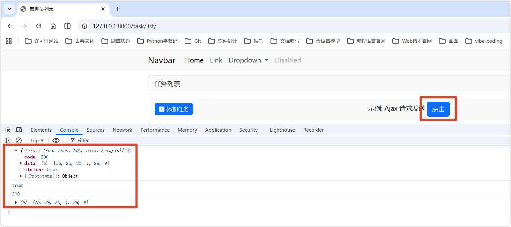

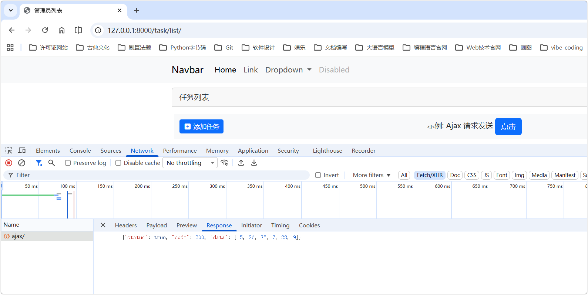

## 6.3 Ajax 示例二

```python
@csrf_exempt
def task_ajax(request):
    res_dict = {
        'status': True,
        'code': 200,
        'data': [15, 26, 35, 7, 28, 9]
    }
    print(request.POST)
    return JsonResponse(res_dict)
```

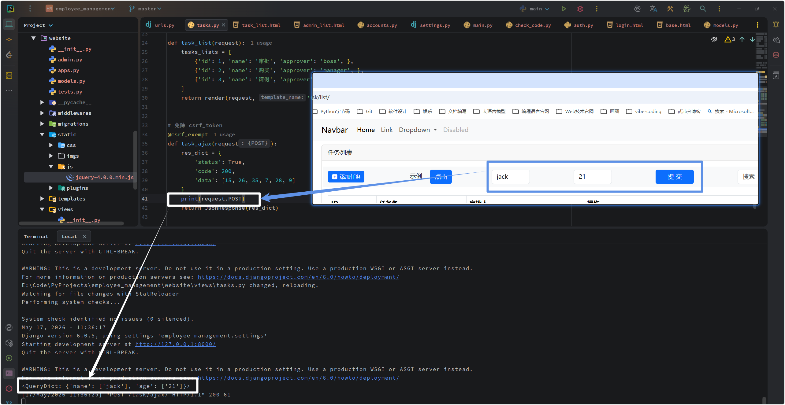

```js

<script type="text/javascript">
    $(function () {
        // 页面框架加载完成之后代码自动执行
        bindBtn1Event();
        bindBtn2Event();
    })

    function bindBtn1Event() {
        $("#btn1").click(function () {
            $.ajax({  // 注意: 要使用 $.ajax: 要先将 JQuery 引入, 否则根本没有 $. 这种语法
                url: "/task/ajax/",
                type: "post",
                data: {
                    n1: 123,
                    n2: 456
                },

                // 写上 dataType: 'json', js 拿到字符串后会将字符串序列化为 json 格式的数据，
                // 如果不加这个 那么拿到的就是纯字符串 无法实现 res.status 等操作
                dataType: 'json',

                success: function (res) {
                    console.log(res);
                    console.log(res.status);
                    console.log(res.code);
                    console.log(res.data);
                }
            })
        })
    }

    function bindBtn2Event() {
        $("#btn2").click(function () {
            $.ajax({
                url: "/task/ajax/",
                type: "post",
                data: {
                    name: $("#txtName").val(),
                    age: $("#txtAge").val()
                },
                dataType: 'json',
                success: function (res) {
                    console.log(res);
                    console.log(res.status);
                    console.log(res.code);
                    console.log(res.data);
                }
            })
        })
    }
</script>
```


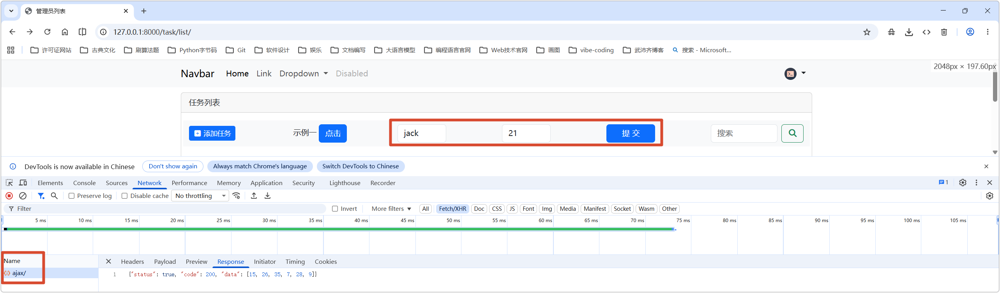

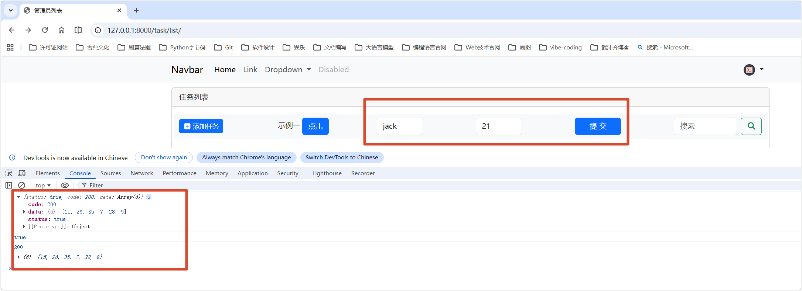

## 6.4 Ajax 示例三

```python
# 免除 csrf_token
@csrf_exempt
def task_ajax(request):
    res_dict = {
        'status': True,
        'code': 200,
        'data': [15, 26, 35, 7, 28, 9]
    }
    print(request.POST)
    return JsonResponse(res_dict)
```

```html

<div class="card">
    <div class="card-header">
        示例三
    </div>
    ...
        <form class="row" id="form3">
            <div class="col-1">
                <input type="text" placeholder="name" class="form-control" name="name"
                       style="width: 100px;"/>
            </div>
            <div class="col-1">
                <input type="text" placeholder="age" class="form-control" name="age"
                       style="width: 100px;"/>
            </div>
            <div class="col-1">
                <input type="text" placeholder="email" class="form-control" name="email"
                       style="width: 100px;"/>
            </div>
            <div class="col-1">
                <input type="text" placeholder="resume" class="form-control" name="resume"
                       style="width: 100px;"/>
            </div>
            <div class="col">
                <input type="button" class="btn btn-primary" value="提 交" id="btn3"
                       style="width: 100px;"/>
            </div>
        </form>
	...
</div>




<script type="text/javascript">
    $(function () {
        // 页面框架加载完成之后代码自动执行
        bindBtn1Event();
        bindBtn2Event();
        bindBtn3Event();
    })

    function bindBtn1Event() {
        // 看以前的笔记
    }

    function bindBtn2Event() {
        // 看以前的笔记
    }

    function bindBtn3Event() {
        $("#btn3").click(function () {
            $.ajax({
                url: "/task/ajax/",
                type: "post",
                data: $("#form3").serialize(),  // 自动将表单所有输入框的值获取到并打包，最后发送到后台
                dataType: 'json',
                success: function (res) {
                    console.log(res);
                    console.log(res.status);
                    console.log(res.code);
                    console.log(res.data);
                }
            })
        })
    }
</script>


```


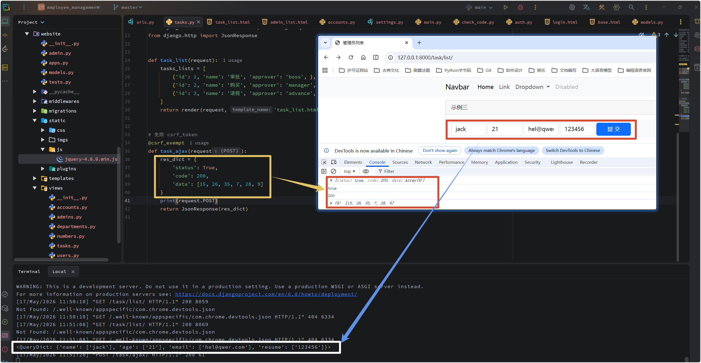

## 6.5 Ajax 案例 任务管理

```python
# 路由
path('task/add/', tasks.task_add),

@csrf_exempt
def task_add(request):
    # Ajax 发送过来的数据需要进行校验 (可以用 ModelForm 进行校验)
    form = TaskForm(data=request.POST)
    if form.is_valid():
        # 数据合法
        # 将新增数据添加到数据库
        form.save()

        # 返回操作结果给前端
        res_dict = {
            'status': True,
            'code': 200,
            'data': request.POST,
        }
        return JsonResponse(res_dict)
    # 数据不合法
    res_dict = {
        'status': False,
        'code': 400,
        'error': form.errors,
    }

    return HttpResponse(json.dumps(res_dict))
```

```html



管理员列表



<div class="card">
    <div class="card-header">
        表单
    </div>
    <div class="card-body">
        <div>
            <nav class="navbar bg-body-tertiary row">
                <form class="row" id="form-add" novalidate>
                    
                    <div class="col-6" style="margin-top: 5px;">
                        <div>
                            <label class="form-label">{{ field.label }}</label>
                            {{ field }}
                            <span style="color: red;" class="error-msg"></span>
                        </div>
                    </div>
                    
                    <div class="col" style="margin-top: 10px;">
                        <input type="button" class="btn btn-primary" value="提 交" id="btn-add"
                               style="width: 100px;"/>
                    </div>
                </form>
            </nav>
        </div>
    </div>
</div>

<div class="card" style="margin-top: 5px;">
    <div class="card-header">
        任务展示
    </div>
    <div class="card-body">
        <table class="table">
            <thead>
            <tr>
                <th scope="col">任务编号</th>
                <th scope="col">任务名</th>
                <th scope="col">详情</th>
                <th scope="col">级别</th>
                <th scope="col">负责人</th>
                <th scope="col">操作</th>
            </tr>
            </thead>
            <tbody>
            
            <tr>
                <th scope="row">{{item.id}}</th>
                <td>{{item.title}}</td>
                <td>{{item.detail}}</td>
                <td>{{item.get_level_display}}</td>
                <td>{{item.user}}</td>
                <td>
                    <a href="#" class="btn btn-primary btn-sm">
                        详情
                    </a>

                    <a href="/edit/{{ obj.id }}/admin/" class="btn btn-primary btn-sm">
                        编辑
                    </a>
                    <a href="/admin/{{ obj.id }}/reset/password/" class="btn btn-primary btn-sm">
                        重置密码
                    </a>

                    <a href="/delete/{{ obj.id }}/admin/" class="btn btn-primary btn-sm">
                        删除
                    </a>
                </td>
            </tr>
            
            </tbody>
        </table>
    </div>
</div>

<hr/>
<div class="card">
    <div class="card-header">
        Ajax 学习 -- 示例
    </div>
    <div class="card-body">
        <div>
            <nav class="navbar bg-body-tertiary row">
                <form class="row" id="form3">
                    <div class="col-1">
                        <input type="text" placeholder="name" class="form-control" name="name"
                               style="width: 100px;"/>
                    </div>
                    <div class="col-1">
                        <input type="text" placeholder="age" class="form-control" name="age"
                               style="width: 100px;"/>
                    </div>
                    <div class="col-1">
                        <input type="text" placeholder="email" class="form-control" name="email"
                               style="width: 100px;"/>
                    </div>
                    <div class="col-1">
                        <input type="text" placeholder="resume" class="form-control" name="resume"
                               style="width: 100px;"/>
                    </div>
                    <div class="col">
                        <input type="button" class="btn btn-primary" value="提 交" id="btn3"
                               style="width: 100px;"/>
                    </div>
                </form>
            </nav>
        </div>
    </div>
</div>




<script type="text/javascript">
    $(function () {
        // 页面框架加载完成之后代码自动执行
        bindBtn1Event();
        bindBtn2Event();
        bindBtn3Event();
        bindBtnAddEvent();
    })

    function bindBtn1Event() {
        ...
    }

    function bindBtn2Event() {
        ...
    }

    function bindBtn3Event() {
        ...
    }

    function bindBtnAddEvent() {
        $("#btn-add").click(function () {
            // // 这里实现在输入信息提交之前将所有的错误信息全都删除
            // $(".error-msg").text("");
            // 也可以像下面这样写
            $(".error-msg").empty();

            $.ajax({
                url: "/task/add/",
                type: "post",
                data: $("#form-add").serialize(),  // 自动将表单所有输入框的值获取到并打包，最后发送到后台
                dataType: 'json',
                success: function (res) {
                    if (res.status) {
                        alert("添加成功");
                    } else {
                        // 添加失败
                        $.each(res.error, function (name, error_data) {
                            // 循环错误信息
                            // 打印出 字段名 错误信息
                            console.log(name, error_data);

                            // 拼接每个输入字段的 id 值, 找到这个标签，然后再找到这个标签的下一个标签 -- 就是我们写的放错误信息的地方
                            // 找到后设置内容
                            // 如果只这样写 一旦某次出现错误信息 那么以后即使输入正确的信息 也会显示错误信息
                            // 要改这个bug，需要在每次输入信息之前将所有的错误信息全都删除
                            // 这样写:
                            // $(".error-msg").text("")
                            // $.ajax()
                            // ...
                            $("#id_" + name).next().text(error_data[0])
                        })
                    }
                }
            })
        })
    }

    // function clickMe() {  // 通过 DOM 的方式绑定事件
    //     $.ajax({  // 注意: 要使用 $.ajax: 要先将 JQuery 引入, 否则根本没有 $. 这种语法
    //         url: "/task/ajax/",
    //         type: "post",
    //         data: {
    //             n1: 123,
    //             n2: 456
    //         },
    //         success: function (res) {
    //             console.log(res);
    //         }
    //     })
    // }
</script>


```

补充：

Django 的 ModelForm 在生成字段输入框的时候，会自动生成一个 `id`: `id=id_字段名`

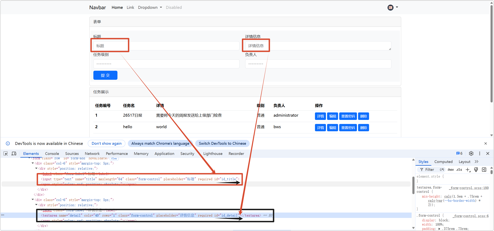

`$("#id_" + name).next()` -- 找到文本输入区域的下一个标签(就是下图中的 `<span>`)

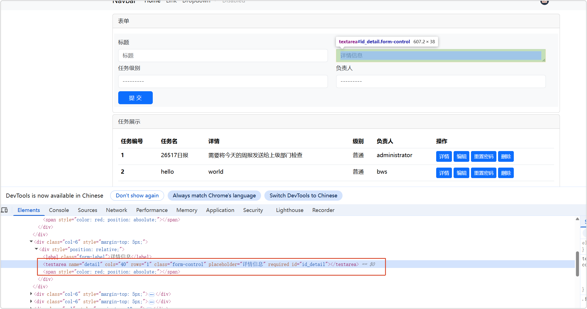

## 6.6 补充

关于数据库查找出来的对象：

```python
# 这样查找出来的是一个 QuerySet 对象，可以将其看作一个列表: [obj, obj, ...]
# <QuerySet [<TaskInfo: TaskInfo object (1)>, <TaskInfo: TaskInfo object (2)>, <TaskInfo: TaskInfo object (3)>]>
res = models.TaskInfo.objects.filter(...)

# 如果这样写，那么查找出来的也是一个QuerySet列表，列表里面是一个个字典 [{}, {}, {}, ...]
# <QuerySet [{'title': '26517日报', 'detail': '需要将今天的周报发送给上级部门检查'}, {'title': '下课', 'detail': '已经下课了，不要拖堂'}, ...]>
res = models.TaskInfo.objects.filter(...).values("id", "name", "age")
```


