<h1 style="text-align: center;font-size: 40px; font-family: '楷体';">Django开发 - day19</h1>

[TOC]

知识点回顾：

- 安装 `Django`

- 创建 `Django` 项目

- 创建和注册 `app`

- 配置静态文件、模板文件的路径

- 配置数据库相关操作

  - 可以使用 `Django` 默认的 `sqlite` 数据库 -- 使用`navicate` 查看数据库或者在`pycharm pro` 版中将`db.sqlite3`拖到数据库区域 然后点击链接数据库即可 因为此数据库是本地数据库 不需要密码和用户名即可连上 直接连接即可
    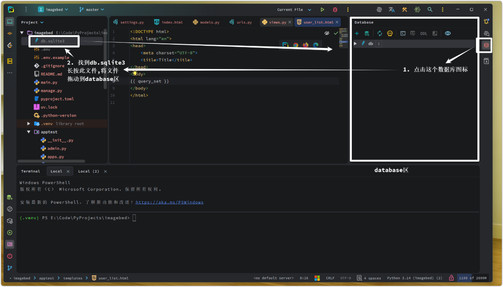
    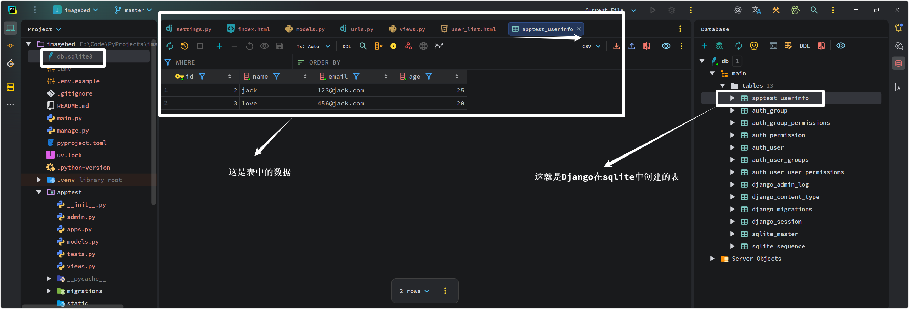

  - 如果链接`MySQL`的话需要安装`mysqlclient` -- `Django3` 需要安装

  - 自己先去数据库中创建一个数据库

  - 在 `settings.py` 中配置数据库
    ```
    DATABASES = {
        'default': {
            'ENGINE': 'django.db.backends.postgresql',  # 我用的是PostgreSQL
            'NAME': '你创建的数据库的名字',
            'USER': '你创建数据库时候的用户名',
            'PASSWORD': '你的数据库密码',
            'HOST': '127.0.0.1',
            'PORT': '5432',  # PostgreSQL默认端口为5432, MySQL默认端口为3306
        }
    }
    ```

  - 在 `models.py` 中编写数据表模型

  - 执行命令创建表
    ```
    >>>python manage.py makemigrations
    >>>python manage.py migrate
    ```

- `urls.py` -- 路由 写URL和视图函数的对应关系

- `views.py` -- 视图 写业务逻辑

- `templates/xxx.html` -- HTML模板

- `Form/ModelForm`组件，在增删改查的时候非常方便

  - 生成 HTML 标签(也可以生成默认值)
  - 请求数据进行校验
  - 保存到数据库（`ModelForm`）
  - 获取错误信息

- Cookie 和 Session -- 保存用户登录信息

- 中间件 -- 实现用户认证

  - `process-request`

- `ORM` 操作

- 分页组件

# 1.  Ajax 请求

在day18我们实现了使用Ajax提交表单，向数据库中添加数据，但是有一个问题：我们提交数据后，弹出一个弹窗提示我们保存成功，但是问题来了：**我们将弹窗关闭后，数据库列表并未更新，新增的数据并没有在数据列表中展示出来** -- 因为页面没有刷新，但是数据库的数据已经更新了。

## 1.1 添加数据成功自动刷新页面

添加`添加成功后页面自动刷新`:

```js

<script type="text/javascript">
    $(function () {
        // 页面框架加载完成之后代码自动执行
        bindBtnAddEvent();
    })

    
    function bindBtnAddEvent() {
        $("#btn-add").click(function () {
            $(".error-msg").empty();
            $.ajax({
                url: "/task/add/",
                type: "post",
                data: $("#form-add").serialize(), 
                dataType: 'json',
                success: function (res) {
                    if (res.status) {
                        alert("添加成功");
                        // 新增：添加成功后页面自动刷新
                        location.reload();
                    } else {
                        $.each(res.error, function (name, error_data) {
                            console.log(name, error_data);
                            $("#id_" + name).next().text(error_data[0])
                        })
                    }
                }
            })
        })
    }
</script>
```

## 1.2 分页

此处省略（复用以前的分页组件即可）

## 1.3 订单管理

### 1.3.1 表结构

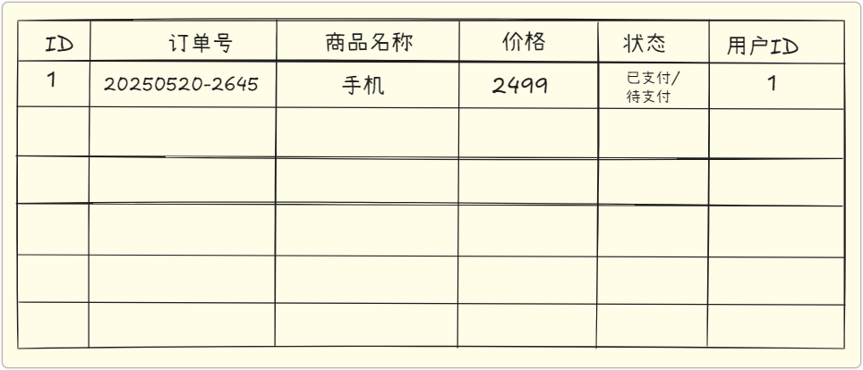

```python
class Order(models.Model):
    """订单表"""
    order_number = models.CharField(verbose_name='订单编号', max_length=64)  # 不是主键 是订单的编号
    commodity_name = models.CharField(verbose_name='商品名称', max_length=32)

    STATUS_CHOICES = (
        (1, '已支付'),
        (2, '未支付'),
    )
    status = models.SmallIntegerField(verbose_name='订单状态', choices=STATUS_CHOICES)
    price = models.DecimalField(verbose_name='价格', max_digits=10, decimal_places=2)
    user = models.ForeignKey(to='Admin', to_field='id', on_delete=models.CASCADE, verbose_name='用户')
```

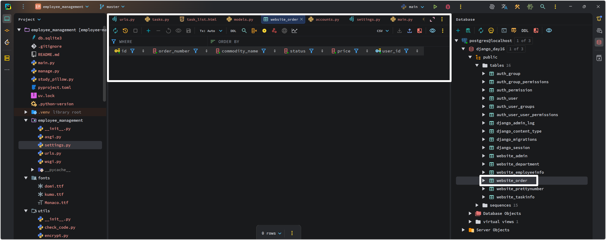

### 1.3.2 展示、新增 -- 在弹出的模态框中提交数据

```python
# 工具函数
# utils/gen_random_number.py

import string
import random


def gen_random_number(length: int):
    str_lst = []
    for i in range(length):
        str_lst.append(random.choice(string.digits))
    return ''.join(str_lst)
```

```python
# urls.py

# 我只写了一个路由和视图函数来实现订单的展示和增加, 可以再写一个专门用来新增的路由和视图函数
path('order/list/', orders.order_list),
```

```python
# views.py

from datetime import datetime

from django.shortcuts import render
from django.views.decorators.csrf import csrf_exempt
from django.http import JsonResponse
from django.conf import settings

from utils.my_form import BootStrapModelForm
from website.models import Order
from utils.gen_random_number import gen_random_number


class OrderModelForm(BootStrapModelForm):
    class Meta:
        model = Order
        fields = '__all__'
        exclude = ['order_number', 'user']


@csrf_exempt
def order_list(request):
    if request.method == 'GET':
        form = OrderModelForm()
        query_sets = Order.objects.all()
        zero_msg = '当前没有任何订单'
        data_dict = {}
        if query_sets.count() == 0:
            data_dict['zero_msg'] = zero_msg
        else:
            data_dict['query_sets'] = query_sets
        return render(request, 'order_list.html', {'data_dict': data_dict, 'form': form})

    # POST 请求
    form = OrderModelForm(request.POST)
    if form.is_valid():
        # 还需生成一个订单编号 后保存
        now = datetime.now().strftime('%Y%m%d')
        random_num = gen_random_number(settings.ORDER_NUMBER_LENGTH)
        form.instance.order_number = f'{now}-{random_num}'

        # 当前登录的用户是哪个, 那么 user 字段就存哪个用户的 ID -- 而不是让用户自己输入
        # 即: form.instance.user_id = 当前登录用户的ID --- 从 Session 中拿
        cur_user_id = request.session.get('info').get('id')
        form.instance.user_id = cur_user_id

        form.save()

        return JsonResponse(
            {
                'status': True,
                'code': 200,
                'message': 'success',
            }
        )

    return JsonResponse(
        {
            'status': False,
            'code': 404,
            'message': 'failed',
            'errors': form.errors,
        }
    )

```

```html
# order_list.html




...列表




<div class="card" style="margin-top: 5px;">
    <div class="card-header">
        任务展示
    </div>
    <div class="card-body">
        <div>
            <nav class="navbar bg-body-tertiary row">
                <div class="col-9">
                    <!-- Button trigger modal -->

                    <!-- 下面这种是利用bootstrap自带的弹出模态框的方法 方法一 (用bootstrap自带的js)-->
                    <!-- <button type="button" class="btn btn-primary btn-sm" data-bs-toggle="modal" data-bs-target="#exampleModal">-->

                    <!-- 自己写弹出模态框的相关操作 方法二(自己写 js) -->
                    <button type="button" class="btn btn-primary btn-sm" id="btn-modal-add">
                        新增订单
                    </button>
                </div>

                <div class="container col-3">
                    <form class="d-flex" role="search" action="#" method="GET">
                        <input class="form-control me-2" type="search" placeholder="搜索" aria-label="Search" name="q"
                               value="">
                        <button class="btn btn-outline-success" type="submit">
                            <i class="fa-classic fa-solid fa-magnifying-glass"></i>
                        </button>
                    </form>
                </div>
            </nav>
        </div>
        
        <table class="table">
            <thead>
            <tr>
                <th scope="col">ID</th>
                <th scope="col">订单编号</th>
                <th scope="col">商品名称</th>
                <th scope="col">订单状态</th>
                <th scope="col">价格</th>
                <th scope="col">用户</th>
                <th scope="col">操作</th>
            </tr>
            </thead>
            <tbody>
            
            <tr>
                <th scope="row">{{item.id}}</th>
                <td>{{item.order_number}}</td>
                <td>{{item.commodity_name}}</td>
                <td>{{item.get_status_display}}</td>
                <td>{{item.price}}</td>
                <td>{{item.user}}</td>
                <td>
                    <a href="#" class="btn btn-primary btn-sm">
                        详情
                    </a>

                    <a href="" class="btn btn-primary btn-sm">
                        编辑
                    </a>
                    <a href="" class="btn btn-primary btn-sm">
                        重置密码
                    </a>

                    <a href="" class="btn btn-primary btn-sm">
                        删除
                    </a>
                </td>
            </tr>
            
            </tbody>
        </table>
        

        
        <div class="card">
            <div class="card-body">
                {{data_dict.zero_msg}}
            </div>
        </div>
        
    </div>
</div>

<!-- Modal 添加订单的对话框 -->
<div class="modal fade" id="MyAddModal" tabindex="-1" aria-labelledby="exampleModalLabel"
     aria-hidden="true">
    <div class="modal-dialog">
        <div class="modal-content">
            <div class="modal-header">
                <h1 class="modal-title fs-5" id="exampleModalLabel">新增订单</h1>
                <button type="button" class="btn-close" data-bs-dismiss="modal"
                        aria-label="Close"></button>
            </div>
            <div class="modal-body">
                <form id="ModalForm">
                    
                    <div class="mb-3" style="margin-left: 20px; margin-right: 20px;">
                        <label class="form-label">{{field.label}}</label>
                        {{field}}
                        <span class="text-danger" id="error-in-modal"></span>
                    </div>
                    
                    <!-- <button type="submit" class="btn btn-primary">提交</button>-->
                </form>
            </div>
            <div class="modal-footer">
                <button type="button" class="btn btn-secondary" data-bs-dismiss="modal">取消
                </button>
                <button type="button" class="btn btn-primary" id="ModalSave">保存</button>
            </div>
        </div>
    </div>
</div>



<script type="text/javascript">
    // 页面框架加载完成之后执行此函数
    $(function () {
        bindBtnModalAdd();
        bindAddDataFormModalEvent();
    })

    // 点击按钮出现模态框
    function bindBtnModalAdd() {
        $("#btn-modal-add").click(function () {
            // 点击 id=btn-modal-add的元素后执行此函数体内的内容
            // 此函数的功能是显示模态框
            $("#MyAddModal").modal("show");
        })
    }

    // 用户输入信息后执行的操作
    function bindAddDataFormModalEvent() {
        // 点击按钮执行 Ajax 向后端发请求
        $("#ModalSave").click(function () {
            // 在用户输入前将所有的错误信息清空
            $("#error-in-modal").empty();
            $.ajax({
                "url": "/order/list/",
                "type": "POST",
                "data": $("#ModalForm").serialize(),
                "dataType": "json",
                "success": function (res_data) {
                    if (res_data.status) {
                        // 弹出框提示用户新增成功
                        alert("新增订单成功");

                        // 清空表单 $("#ModalForm")是一个Jquery对象 [0]就变成DOM对象, DOM才有.reset()功能
                        $("#ModalForm")[0].reset();

                        // 关闭模块对话框
                        $("#MyAddModal").modal("hide");

                        // 增添成功后刷新页面 前端表格就能正常展示新增过的数据了
                        location.reload();
                    } else {
                        // 添加订单失败 展示所有错误字段的信息
                        $.each(res_data.errors, function (name, error_data) {
                            $("#id_" + name).next().text(error_data[0]);
                        })
                    }
                }
            })
        })

    }
</script>


```

### 1.3.3 增加分页

```python
# urls.py

path('order/list/', orders.order_list),
```

```python
# views/orders.py

from datetime import datetime

from django.shortcuts import render
from django.views.decorators.csrf import csrf_exempt
from django.http import JsonResponse
from django.conf import settings

from utils.my_form import BootStrapModelForm
from website.models import Order
from utils.gen_random_number import gen_random_number
from utils.pagination import Pagination


class OrderModelForm(BootStrapModelForm):
    class Meta:
        model = Order
        fields = '__all__'
        exclude = ['order_number', 'user']


@csrf_exempt
def order_list(request):
    if request.method == 'GET':
        form = OrderModelForm()
        query_sets = Order.objects.all()
        zero_msg = '当前没有任何订单'
        data_dict = {}
        if query_sets.count() == 0:
            data_dict['zero_msg'] = zero_msg
        else:
            # 如果有数据 可以分页
            paginator = Pagination(request, query_sets)
            data_dict['query_sets'] =paginator.query_sets
            data_dict['html_string'] =paginator.html
        return render(request, 'order_list.html', {'data_dict': data_dict, 'form': form})

    # POST 请求
    form = OrderModelForm(request.POST)
    if form.is_valid():
        # 还需生成一个订单编号 后保存
        now = datetime.now().strftime('%Y%m%d')
        random_num = gen_random_number(settings.ORDER_NUMBER_LENGTH)
        form.instance.order_number = f'{now}-{random_num}'

        # 当前登录的用户是哪个, 那么 user 字段就存哪个用户的 ID -- 而不是让用户自己输入
        # 即: form.instance.user_id = 当前登录用户的ID --- 从 Session 中拿
        cur_user_id = request.session.get('info').get('id')
        form.instance.user_id = cur_user_id

        form.save()

        return JsonResponse(
            {
                'status': True,
                'code': 200,
                'message': 'success',
            }
        )

    return JsonResponse(
        {
            'status': False,
            'code': 404,
            'message': 'failed',
            'errors': form.errors,
        }
    )

```

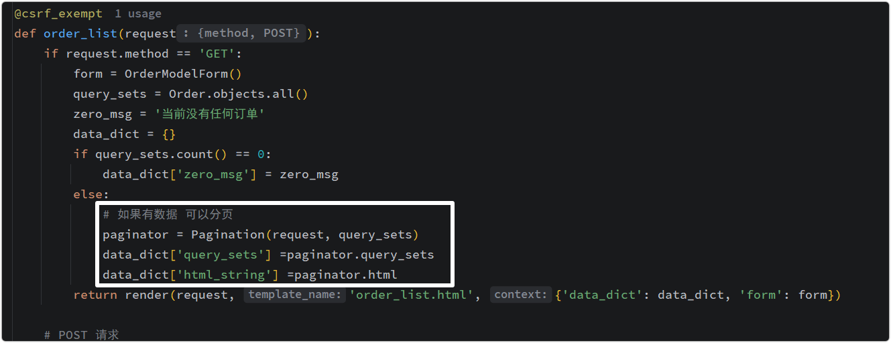

```html



管理员列表




<div class="card" style="margin-top: 5px;">
    <div class="card-header">
        任务展示
    </div>
    <div class="card-body">
        <div>
            <nav class="navbar bg-body-tertiary row">
                <div class="col-9">
                    <!-- Button trigger modal -->

                    <!-- 下面这种是利用bootstrap自带的弹出模态框的方法 方法一 (用bootstrap自带的js)-->
                    <!-- <button type="button" class="btn btn-primary btn-sm" data-bs-toggle="modal" data-bs-target="#exampleModal">-->

                    <!-- 自己写弹出模态框的相关操作 方法二(自己写 js) -->
                    <button type="button" class="btn btn-primary btn-sm" id="btn-modal-add">
                        新增订单
                    </button>
                </div>

                <div class="container col-3">
                    <form class="d-flex" role="search" action="#" method="GET">
                        <input class="form-control me-2" type="search" placeholder="搜索" aria-label="Search" name="q"
                               value="">
                        <button class="btn btn-outline-success" type="submit">
                            <i class="fa-classic fa-solid fa-magnifying-glass"></i>
                        </button>
                    </form>
                </div>
            </nav>
        </div>
        
        <table class="table">
            <thead>
            <tr>
                <th scope="col">ID</th>
                <th scope="col">订单编号</th>
                <th scope="col">商品名称</th>
                <th scope="col">订单状态</th>
                <th scope="col">价格</th>
                <th scope="col">用户</th>
                <th scope="col">操作</th>
            </tr>
            </thead>
            <tbody>
            
            <tr>
                <th scope="row">{{item.id}}</th>
                <td>{{item.order_number}}</td>
                <td>{{item.commodity_name}}</td>
                <td>{{item.get_status_display}}</td>
                <td>{{item.price}}</td>
                <td>{{item.user}}</td>
                <td>
                    <a href="#" class="btn btn-primary btn-sm">
                        详情
                    </a>

                    <a href="" class="btn btn-primary btn-sm">
                        编辑
                    </a>
                    <a href="" class="btn btn-primary btn-sm">
                        重置密码
                    </a>

                    <a href="" class="btn btn-primary btn-sm">
                        删除
                    </a>
                </td>
            </tr>
            
            </tbody>
        </table>
        
        <div class="row">
            {{data_dict.html_string}}
        </div>

        
        <div class="card">
            <div class="card-body">
                {{data_dict.zero_msg}}
            </div>
        </div>
        
    </div>
</div>

<!-- Modal 添加订单的对话框 -->
<div class="modal fade" id="MyAddModal" tabindex="-1" aria-labelledby="exampleModalLabel"
     aria-hidden="true">
    <div class="modal-dialog">
        <div class="modal-content">
            <div class="modal-header">
                <h1 class="modal-title fs-5" id="exampleModalLabel">新增订单</h1>
                <button type="button" class="btn-close" data-bs-dismiss="modal"
                        aria-label="Close"></button>
            </div>
            <div class="modal-body">
                <form id="ModalForm">
                    
                    <div class="mb-3" style="margin-left: 20px; margin-right: 20px;">
                        <label class="form-label">{{field.label}}</label>
                        {{field}}
                        <span class="text-danger" id="error-in-modal"></span>
                    </div>
                    
                    <!-- <button type="submit" class="btn btn-primary">提交</button>-->
                </form>
            </div>
            <div class="modal-footer">
                <button type="button" class="btn btn-secondary" data-bs-dismiss="modal">取消
                </button>
                <button type="button" class="btn btn-primary" id="ModalSave">保存</button>
            </div>
        </div>
    </div>
</div>



<script type="text/javascript">
    // 页面框架加载完成之后执行此函数
    $(function () {
        bindBtnModalAdd();
        bindAddDataFormModalEvent();
    })

    // 点击按钮出现模态框
    function bindBtnModalAdd() {
        $("#btn-modal-add").click(function () {
            // 点击 id=btn-modal-add的元素后执行此函数体内的内容
            // 此函数的功能是显示模态框
            $("#MyAddModal").modal("show");
        })
    }

    // 用户输入信息后执行的操作
    function bindAddDataFormModalEvent() {
        // 点击按钮执行 Ajax 向后端发请求
        $("#ModalSave").click(function () {
            // 在用户输入前将所有的错误信息清空
            $("#error-in-modal").empty();
            $.ajax({
                "url": "/order/list/",
                "type": "POST",
                "data": $("#ModalForm").serialize(),
                "dataType": "json",
                "success": function (res_data) {
                    if (res_data.status) {
                        // 弹出框提示用户新增成功
                        alert("新增订单成功");

                        // 清空表单 $("#ModalForm")是一个Jquery对象 [0]就变成DOM对象, DOM才有.reset()功能
                        $("#ModalForm")[0].reset();

                        // 关闭模块对话框
                        $("#MyAddModal").modal("hide");

                        // 增添成功后刷新页面 前端表格就能正常展示新增过的数据了
                        location.reload();
                    } else {
                        // 添加订单失败 展示所有错误字段的信息
                        $.each(res_data.errors, function (name, error_data) {
                            $("#id_" + name).next().text(error_data[0]);
                        })
                    }
                }
            })
        })

    }
</script>


```

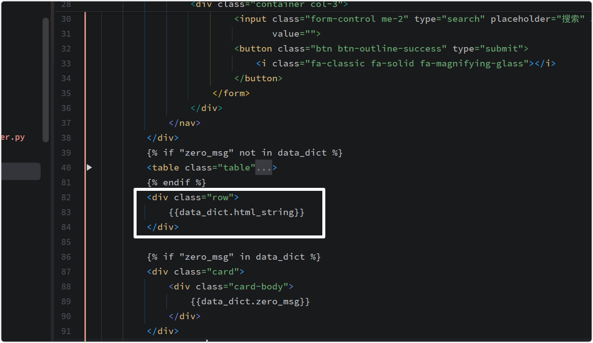

最终展示效果：

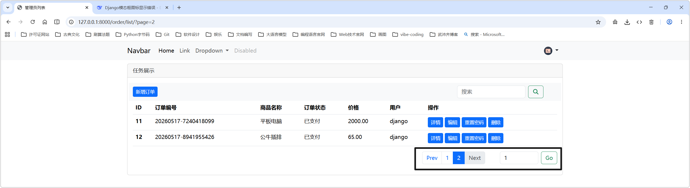

### 1.3.4 删除

删除时弹出一个弹出框确认，只有确认后才可删除。

```python
# urls.py

path('delete/order/', orders.delete_order),
```

```python
# 视图

def delete_order(request):
    # 删除订单
    oid = request.GET.get('oid')
    if oid:
        query_set = Order.objects.filter(id=oid)
        if query_set.exists():
            query_set.delete()
            return JsonResponse(
                {
                    'status': True,
                    'code': 200,
                    'messages': f'成功删除 ID={oid} 的订单.',
                }
            )
        else:
            return JsonResponse(
                {
                    'status': False,
                    'code': 300,
                    'error': f'ID={oid} 的订单不存在.',
                }
            )
    return JsonResponse(
        {
            'status': False,
            'code': 400,
            'error': '参数 "oid" 非法',
        }
    )
```

```html
# order_list.html




管理员列表




<div class="card" style="margin-top: 5px;">
    <div class="card-header">
        任务展示
    </div>
    <div class="card-body">
        <div>
            <nav class="navbar bg-body-tertiary row">
                <div class="col-9">
                    <!-- Button trigger modal -->

                    <!-- 下面这种是利用bootstrap自带的弹出模态框的方法 方法一 (用bootstrap自带的js)-->
                    <!-- <button type="button" class="btn btn-primary btn-sm" data-bs-toggle="modal" data-bs-target="#exampleModal">-->

                    <!-- 自己写弹出模态框的相关操作 方法二(自己写 js) -->
                    <button type="button" class="btn btn-primary btn-sm" id="btn-modal-add">
                        新增订单
                    </button>
                </div>

                <div class="container col-3">
                    <form class="d-flex" role="search" action="#" method="GET">
                        <input class="form-control me-2" type="search" placeholder="搜索" aria-label="Search" name="q"
                               value="">
                        <button class="btn btn-outline-success" type="submit">
                            <i class="fa-classic fa-solid fa-magnifying-glass"></i>
                        </button>
                    </form>
                </div>
            </nav>
        </div>
        
        <table class="table">
            <thead>
            <tr>
                <th scope="col">ID</th>
                <th scope="col">订单编号</th>
                <th scope="col">商品名称</th>
                <th scope="col">订单状态</th>
                <th scope="col">价格</th>
                <th scope="col">用户</th>
                <th scope="col">操作</th>
            </tr>
            </thead>
            <tbody>
            
            <tr oid="{{item.id}}">
                <th scope="row">{{item.id}}</th>
                <td>{{item.order_number}}</td>
                <td>{{item.commodity_name}}</td>
                <td>{{item.get_status_display}}</td>
                <td>{{item.price}}</td>
                <td>{{item.user.name}}</td>
                <td>
                    <a href="#" class="btn btn-primary btn-sm"> 详情 </a>
                    <a href="" class="btn btn-primary btn-sm"> 编辑 </a>
                    <input oid="{{item.id}}" class="btn btn-danger btn-sm modal-del-btn" id="DelModal" value="删除"
                           type="button">
                </td>
            </tr>
            
            </tbody>
        </table>
        
        <div class="row">
            {{data_dict.html_string}}
        </div>

        
        <div class="card">
            <div class="card-body">
                {{data_dict.zero_msg}}
            </div>
        </div>
        
    </div>
</div>

<!-- Modal 添加订单的对话框 -->
<div class="modal fade" id="MyAddModal" tabindex="-1" aria-labelledby="exampleModalLabel"
     aria-hidden="true">
    <div class="modal-dialog">
        <div class="modal-content">
            <div class="modal-header">
                <h1 class="modal-title fs-5" id="exampleModalLabel">新增订单</h1>
                <button type="button" class="btn-close" data-bs-dismiss="modal"
                        aria-label="Close"></button>
            </div>
            <div class="modal-body">
                <form id="ModalForm">
                    
                    <div class="mb-3" style="margin-left: 20px; margin-right: 20px;">
                        <label class="form-label">{{field.label}}</label>
                        {{field}}
                        <span class="text-danger" id="error-in-modal"></span>
                    </div>
                    
                    <!-- <button type="submit" class="btn btn-primary">提交</button>-->
                </form>
            </div>
            <div class="modal-footer">
                <button type="button" class="btn btn-secondary" data-bs-dismiss="modal">取消
                </button>
                <button type="button" class="btn btn-primary" id="ModalSave">保存</button>
            </div>
        </div>
    </div>
</div>

<!-- Modal 删除订单的对话框 -->
<div class="modal fade" id="DeleteOrderModal" tabindex="-1" aria-labelledby="exampleModalLabel" aria-hidden="true">
    <div class="modal-dialog modal-dialog-centered">
        <div class="modal-content">
            <div class="modal-header">
                <h1 class="modal-title fs-5">是否确认删除?</h1>
                <button type="button" class="btn-close" data-bs-dismiss="modal" aria-label="Close"></button>
            </div>
            <div class="modal-body">
                <p>删除后, 所有相关数据都会被删除, 无法恢复, 是否确认?</p>
            </div>
            <div class="modal-footer">
                <button type="button" class="btn btn-primary" data-bs-dismiss="modal">取 消</button>
                <button type="button" class="btn btn-danger" id="btnDeleteConfirm">确 定</button>
            </div>
        </div>
    </div>
</div>



<script type="text/javascript">
    // 声明全局变量 用于确认删除
    var DELETE_ID;

    // 页面框架加载完成之后执行此函数
    $(function () {
        bindBtnModalAdd();
        bindAddDataFormModalEvent();
        bindBtnDeleteModalEvent();
        bindBtnDeleteConfirmModalEvent();
    })

    // 点击按钮出现模态框
    function bindBtnModalAdd() {
        $("#btn-modal-add").click(function () {
            // 点击 id=btn-modal-add的元素后执行此函数体内的内容
            // 此函数的功能是显示模态框
            $("#MyAddModal").modal("show");
        })
    }

    // 用户输入信息后执行的操作
    function bindAddDataFormModalEvent() {
        // 点击按钮执行 Ajax 向后端发请求
        $("#ModalSave").click(function () {
            // 在用户输入前将所有的错误信息清空
            $("#error-in-modal").empty();
            $.ajax({
                "url": "/order/list/",
                "type": "POST",
                "data": $("#ModalForm").serialize(),
                "dataType": "json",
                "success": function (res_data) {
                    if (res_data.status) {
                        // 弹出框提示用户新增成功
                        alert("新增订单成功");

                        // 清空表单 $("#ModalForm")是一个Jquery对象 [0]就变成DOM对象, DOM才有.reset()功能
                        $("#ModalForm")[0].reset();

                        // 关闭模块对话框
                        $("#MyAddModal").modal("hide");

                        // 增添成功后刷新页面 前端表格就能正常展示新增过的数据了
                        location.reload();
                    } else {
                        // 添加订单失败 展示所有错误字段的信息
                        $.each(res_data.errors, function (name, error_data) {
                            $("#id_" + name).next().text(error_data[0]);
                        })
                    }
                }
            })
        })

    }

    function bindBtnDeleteModalEvent() {
        // 点击删除按钮后触发此函数

        // 弹出模态框
        $(".modal-del-btn").click(function () {
            // alert("确认要删除吗?");

            // 显示 确认删除 对话框
            $("#DeleteOrderModal").modal("show");

            // 获取当前行的ID并赋值给全局变量
            // $(this): 点击后, 表示当前点击的这个标签
            DELETE_ID = $(this).attr("oid");

        });
    }

    function bindBtnDeleteConfirmModalEvent() {
        $("#btnDeleteConfirm").click(function () {
            // 点击确认删除的确认按钮后, 将全局变量中存储的要删除的ID发送到后台
            // // 方法一
            // $.ajax({
            //     "url": "/delete/" + DELETE_ID + "/order/",  // ==> /delete/5/order/
            //     "type": "GET",
            //     "dataType": "json",
            //     "success": function (res_data) {}
            // })

            // 方法二
            $.ajax({
                "url": "/delete/order/",  // ==> /delete/order?oid=10
                "type": "GET",
                "data": {
                    "oid": DELETE_ID
                },
                "dataType": "json",
                "success": function (res_data) {
                    if (res_data.status) {
                        // // 删除成功
                        // alert("删除ID为" + DELETE_ID + "的订单成功");

                        // 将确认删除的模态框隐藏
                        $("#DeleteOrderModal").modal("hide");

                        // // 在页面上将当前这一行的数据删除掉 -- js -- 当前页数据越来越少
                        // $("tr[oid='" + DELETE_ID + "']").remove();

                        // 将 DELETE_ID 置空
                        DELETE_ID = null;

                        // 简单的在页面上删除已删除的数据 -- 刷新页面
                        location.reload();
                    } else {
                        // 删除失败
                        alert(res_data.error);
                    }
                }
            })
        })
    }
</script>


```

需要注意的一些地方：

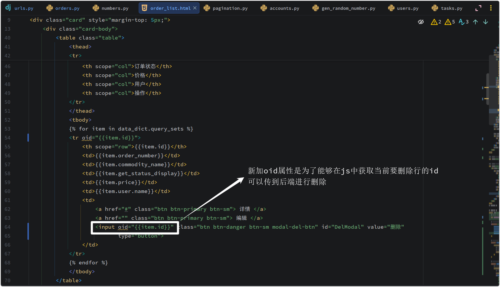

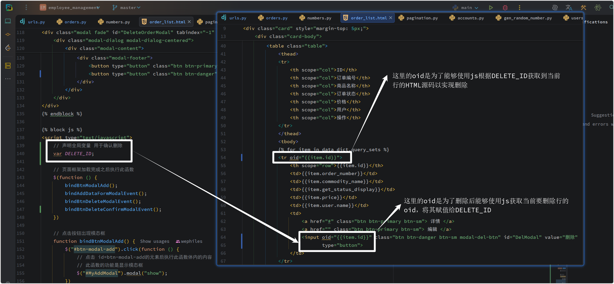

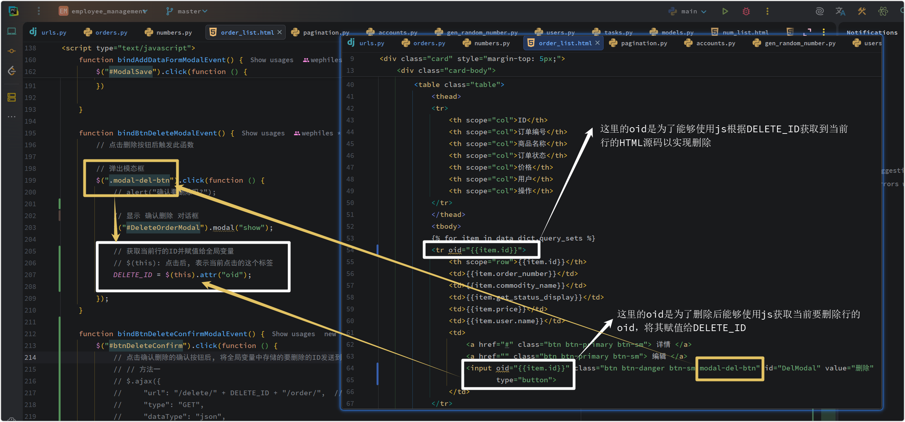

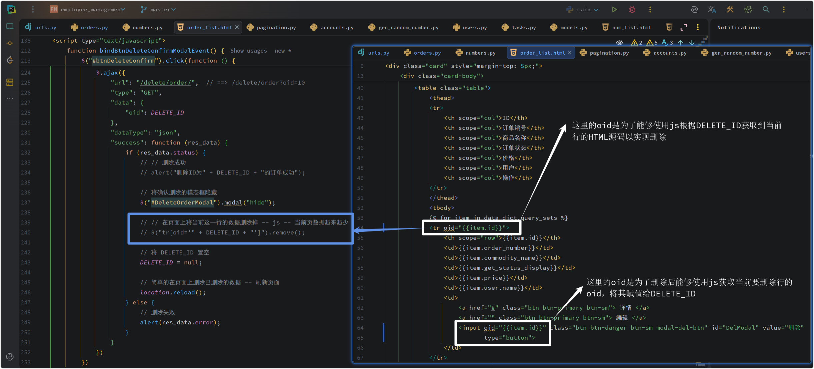

### 1.3.5 编辑

补充：

```python
# 获取到的是对象 -- 当前行的所有数据

row_obj = models.Order.objects.filter(id=uid).first()
row_obj.id
row_obj.name
...
```

```python
# 字典 {'id': 1, 'name': 'jack'}

row_dict = models.Order.objects.filter(id=uid).values('id', 'name').first()
```

---

```python
# queryset = [obj, obj, ...]

queryset = models.Order.objects.all()
```

```python
# queryset = [
#     {'id': 1, 'name': 'jack'}, 
#     {'id': 2, 'name': 'rose'}, 
#     ...,
#]

queryset = models.Order.objects.all().values('id', 'name')
```

```python
# queryset = [
#     (1, 'jack'), 
#     (2, 'rose'), 
#     ...,
#]

queryset = models.Order.objects.all().values_list('id', 'name')
```

```python
# 更新
v1 = models.Order.objects.filter(id=10)
v1.update(name="xxx")

# 也是更新 但是 .first() 后无法通过 .update() 更新
v2 = models.Order.objects.filter(id=10).first()
v2.name = "xxx"
v2.age = 16
...
```


注意：1.3.2，1.3.3，1.3.4上面的代码如果不加1.3.5 编辑(当前块)的话能够正常运行，但是如果加了编辑的话会出问题：

因为编辑和新增共用一套Form，这个Form由`/order/list/`这个路由传到前端界面上，会显示编辑、新增的模态框里面的输入框，但问题在于，我写了两个模态框，两个模态框共用一个Form导致同一个输入框的id值出现了两次(比如 字段为 status，那么status字段的输入框的id就是 `id_status`)，而js只会寻找第一个出现的id值对应的标签，所以想要在编辑页面展示当前正在编辑的那一行数据，会出现bug：点击编辑按钮后的输入框全都是空的，而此时如果再次点击新增按钮，会发现这些输入框是有值的！-- 因为我的删除模态框是写在编辑模态框前面的，所以删除的模态框有展示出来数据，但是编辑的没有展示出来。

要解决以上问题有两种方法：

- 编辑和删除共用同一个模态框，共用同一个Form
- 编辑和删除分别用不同的模态框，用不同的Form，/order/list/路由向前端传的时候分别将两个Form全都传入前端 （此次采用这种做法）

```python
# 路由

path('order/list/', orders.order_list),
path('add/order/', orders.add_order),
path('delete/order/', orders.delete_order),
path('order/detail/', orders.order_detail),
path('edit/order/', orders.edit_order),
```

```python
# 视图

from datetime import datetime

from django.shortcuts import render
from django.views.decorators.csrf import csrf_exempt
from django.views.decorators.http import require_POST
from django.http import JsonResponse
from django.conf import settings

from utils.my_form import BootStrapModelForm
from website.models import Order
from utils.gen_random_number import gen_random_number
from utils.pagination import Pagination


class OrderModelForm(BootStrapModelForm):
    class Meta:
        model = Order
        fields = '__all__'
        exclude = ['order_number', 'user']


class OrderModelFormAdd(OrderModelForm):
    def __init__(self, *args, **kwargs):
        super().__init__(*args, **kwargs)
        for name, field in self.fields.items():
            if not field.widget.attrs:
                field.widget.attrs = {'class': 'form-control', 'placeholder': field.label, 'id': f'id_{name}_add'}
            else:
                field.widget.attrs['class'] = 'form-control'
                field.widget.attrs['placeholder'] = field.label
                field.widget.attrs['id'] = f'id_{name}_add'


class OrderModelFormEdit(OrderModelForm):
    def __init__(self, *args, **kwargs):
        super().__init__(*args, **kwargs)
        for name, field in self.fields.items():
            if not field.widget.attrs:
                field.widget.attrs = {'class': 'form-control', 'placeholder': field.label, 'id': f'id_{name}_edit'}
            else:
                field.widget.attrs['class'] = 'form-control'
                field.widget.attrs['placeholder'] = field.label
                field.widget.attrs['id'] = f'id_{name}_edit'


def order_list(request):
    form_add = OrderModelFormAdd()
    form_edit = OrderModelFormEdit()
    query_sets = Order.objects.all()
    zero_msg = '当前没有任何订单'
    data_dict = {}
    if query_sets.count() == 0:
        data_dict['zero_msg'] = zero_msg
    else:
        # 如果有数据 可以分页
        paginator = Pagination(request, query_sets)
        data_dict['query_sets'] = paginator.query_sets
        data_dict['html_string'] = paginator.html
    return render(
        request,
        'order_list.html',
        {
            'data_dict': data_dict,
            'form_add': form_add,
            'form_edit': form_edit
        },
    )


@csrf_exempt
def add_order(request):
    form = OrderModelFormAdd(request.POST)
    if form.is_valid():
        # 还需生成一个订单编号 后保存
        now = datetime.now().strftime('%Y%m%d')
        random_num = gen_random_number(settings.ORDER_NUMBER_LENGTH)
        form.instance.order_number = f'{now}-{random_num}'

        # 当前登录的用户是哪个, 那么 user 字段就存哪个用户的 ID -- 而不是让用户自己输入
        # 即: form.instance.user_id = 当前登录用户的ID --- 从 Session 中拿
        cur_user_id = request.session.get('info').get('id')
        form.instance.user_id = cur_user_id

        form.save()

        return JsonResponse(
            {
                'status': True,
                'code': 200,
                'message': 'success',
            }
        )
    return JsonResponse(
        {
            'status': False,
            'code': 404,
            'message': 'failed',
            'errors': form.errors,
        }
    )


def delete_order(request):
    # 删除订单
    oid = request.GET.get('oid')
    if oid:
        query_set = Order.objects.filter(id=oid)
        if query_set.exists():
            query_set.delete()
            return JsonResponse(
                {
                    'status': True,
                    'code': 200,
                    'messages': f'成功删除 ID={oid} 的订单.',
                }
            )
        else:
            return JsonResponse(
                {
                    'status': False,
                    'code': 300,
                    'error': f'ID={oid} 的订单不存在.',
                }
            )
    return JsonResponse(
        {
            'status': False,
            'code': 400,
            'error': '参数 "oid" 非法',
        }
    )


@csrf_exempt
@require_POST  # 只允许 POST，GET 请求直接返回 405
def edit_order(request):
    oid = request.GET.get('oid')
    if oid:
        query_sets = Order.objects.filter(id=oid)
        if query_sets.exists():
            cur_row = query_sets.first()
            form = OrderModelFormEdit(request.POST, instance=cur_row)
            if form.is_valid():
                form.save()
                return JsonResponse(
                    {
                        'status': True,
                        'code': 200,
                        'message': 'successful',
                    }
                )
            else:
                return JsonResponse(
                    {
                        'status': False,
                        'code': 400,
                        'errors': form.errors,
                    }
                )
        return JsonResponse(
            {
                'status': False,
                'code': 300,
                'error': '数据不存在',

            }
        )
    return JsonResponse(
        {
            'status': False,
            'code': 400,
            'error': '非法参数: oid',
        }
    )


def order_detail(request):
    oid = request.GET.get('oid')
    if oid:
        query_sets = Order.objects.filter(id=oid)
        if query_sets.exists():
            # # 笔记: 实现方式一 自己序列化返回给前端
            # query_set = query_sets.first()
            # row_dict = {
            #     'commodity_name': query_set.commodity_name,
            #     'status': query_set.status,
            #     'price': query_set.price,
            # }
            # return JsonResponse(
            #     {
            #         'status': True,
            #         'code': 200,
            #         'data': row_dict,
            #         # 'data': query_set,  # 这样写是错误的 因为除了基本数据类型(list, dict)，对象是不支持序列化的
            #     }
            # )

            # # 笔记: 实现方式二
            row_dict = query_sets.values('commodity_name', 'status', 'price').first()
            return JsonResponse(
                {
                    'status': True,
                    'code': 200,
                    'data': row_dict,
                }
            )
        return JsonResponse(
            {
                'status': False,
                'code': 400,
                'error': f'您访问的数据不存在'
            }
        )
    return JsonResponse(
        {
            'status': False,
            'code': 400,
            'error': '非法参数: oid'
        }
    )

```

```html



管理员列表




<div class="card" style="margin-top: 5px;">
    <div class="card-header">
        任务展示
    </div>
    <div class="card-body">
        <div>
            <nav class="navbar bg-body-tertiary row">
                <div class="col-9">
                    <!-- Button trigger modal -->

                    <!-- 下面这种是利用bootstrap自带的弹出模态框的方法 方法一 (用bootstrap自带的js)-->
                    <!-- <button type="button" class="btn btn-primary btn-sm" data-bs-toggle="modal" data-bs-target="#exampleModal">-->

                    <!-- 自己写弹出模态框的相关操作 方法二(自己写 js) -->
                    <button type="button" class="btn btn-primary btn-sm" id="btn-modal-add">
                        新增订单
                    </button>
                </div>

                <div class="container col-3">
                    <form class="d-flex" role="search" action="#" method="GET">
                        <input class="form-control me-2" type="search" placeholder="搜索" aria-label="Search" name="q"
                               value="">
                        <button class="btn btn-outline-success" type="submit">
                            <i class="fa-classic fa-solid fa-magnifying-glass"></i>
                        </button>
                    </form>
                </div>
            </nav>
        </div>
        
        <table class="table">
            <thead>
            <tr>
                <th scope="col">ID</th>
                <th scope="col">订单编号</th>
                <th scope="col">商品名称</th>
                <th scope="col">订单状态</th>
                <th scope="col">价格</th>
                <th scope="col">用户</th>
                <th scope="col">操作</th>
            </tr>
            </thead>
            <tbody>
            
            <tr oid="{{item.id}}">
                <th scope="row">{{item.id}}</th>
                <td>{{item.order_number}}</td>
                <td>{{item.commodity_name}}</td>
                <td>{{item.get_status_display}}</td>
                <td>{{item.price}}</td>
                <td>{{item.user.name}}</td>
                <td>
                    <a href="#" class="btn btn-primary btn-sm"> 详情 </a>
                    <input oid="{{item.id}}" class="btn btn-primary btn-sm btn-edit-order-trigger" value="编辑"
                           type="button">
                    <input oid="{{item.id}}" class="btn btn-danger btn-sm modal-del-btn" id="DelModal" value="删除"
                           type="button">
                </td>
            </tr>
            
            </tbody>
        </table>
        
        <div class="row">
            {{data_dict.html_string}}
        </div>

        
        <div class="card">
            <div class="card-body">
                {{data_dict.zero_msg}}
            </div>
        </div>
        
    </div>
</div>

<!-- Modal 添加订单的对话框 -->
<div class="modal fade" id="MyAddModal" tabindex="-1" aria-labelledby="exampleModalLabel"
     aria-hidden="true">
    <div class="modal-dialog">
        <div class="modal-content">
            <div class="modal-header">
                <h1 class="modal-title fs-5" id="exampleModalLabel">新增订单</h1>
                <button type="button" class="btn-close" data-bs-dismiss="modal"
                        aria-label="Close"></button>
            </div>
            <div class="modal-body">
                <form id="ModalForm">
                    
                    <div class="mb-3" style="margin-left: 20px; margin-right: 20px;">
                        <label class="form-label">{{field.label}}</label>
                        {{field}}
                        <span class="text-danger" id="error-in-modal"></span>
                    </div>
                    
                    <!-- <button type="submit" class="btn btn-primary">提交</button>-->
                </form>
            </div>
            <div class="modal-footer">
                <button type="button" class="btn btn-secondary" data-bs-dismiss="modal">取消
                </button>
                <button type="button" class="btn btn-primary" id="ModalSave">保存</button>
            </div>
        </div>
    </div>
</div>

<!-- Modal 删除订单的对话框 -->
<div class="modal fade" id="DeleteOrderModal" tabindex="-1" aria-labelledby="exampleModalLabel" aria-hidden="true">
    <div class="modal-dialog modal-dialog-centered">
        <div class="modal-content">
            <div class="modal-header">
                <h1 class="modal-title fs-5">是否确认删除?</h1>
                <button type="button" class="btn-close" data-bs-dismiss="modal" aria-label="Close"></button>
            </div>
            <div class="modal-body">
                <p>删除后, 所有相关数据都会被删除, 无法恢复, 是否确认?</p>
            </div>
            <div class="modal-footer">
                <button type="button" class="btn btn-primary" data-bs-dismiss="modal">取 消</button>
                <button type="button" class="btn btn-danger" id="btnDeleteConfirm">确 定</button>
            </div>
        </div>
    </div>
</div>

<!-- Modal 修改订单的对话框 -->
<div class="modal fade" id="MyEditForm" tabindex="-1" aria-labelledby="exampleModalLabel"
     aria-hidden="true">
    <div class="modal-dialog">
        <div class="modal-content">
            <div class="modal-header">
                <h1 class="modal-title fs-5">修改订单信息</h1>
                <button type="button" class="btn-close" data-bs-dismiss="modal"
                        aria-label="Close"></button>
            </div>
            <div class="modal-body">
                <form id="EditOrderModalForm">
                    
                    <div class="mb-3" style="margin-left: 20px; margin-right: 20px;">
                        <label class="form-label">{{field.label}}</label>
                        {{field}}
                        <span class="text-danger" id="error-in-modal-edit"></span>
                    </div>
                    
                    <!-- <button type="submit" class="btn btn-primary">提交</button>-->
                </form>
            </div>
            <div class="modal-footer">
                <button type="button" class="btn btn-secondary" data-bs-dismiss="modal">取消
                </button>
                <button type="button" class="btn btn-primary" id="EditModalConfirm">保存</button>
            </div>
        </div>
    </div>
</div>



<script type="text/javascript">
    // 声明全局变量 用于确认删除
    var DELETE_ID;
    var EDIT_ID;

    // 页面框架加载完成之后执行此函数
    $(function () {
        bindBtnModalAdd();
        bindAddDataFormModalEvent();
        bindBtnDeleteModalEvent();
        bindBtnDeleteConfirmModalEvent();
        bindBtnEditEvent();  // 点击编辑按钮时调用此函数
        bindBtnEditConfirm();
    })

    // 点击按钮出现模态框
    function bindBtnModalAdd() {
        $("#btn-modal-add").click(function () {
            // // 如果新增和编辑共用一个Form且共用一个模态框
            // 清空对话框中的数据
            // $("ModalForm")[0].reset();
            // // 清空全局 EDIT_ID 变量
            // EDIT_ID = null;

            // 点击 id=btn-modal-add的元素后执行此函数体内的内容
            // 此函数的功能是显示模态框
            $("#MyAddModal").modal("show");
        })
    }

    // 用户输入信息后执行的操作
    function bindAddDataFormModalEvent() {
        // 点击按钮执行 Ajax 向后端发请求
        $("#ModalSave").click(function () {
            // 在用户输入前将所有的错误信息清空
            $("#error-in-modal").empty();
            $.ajax({
                "url": "/add/order/",
                "type": "POST",
                "data": $("#ModalForm").serialize(),
                "dataType": "json",
                "success": function (res_data) {
                    if (res_data.status) {
                        // 弹出框提示用户新增成功
                        alert("新增订单成功");

                        // 清空表单 $("#ModalForm")是一个Jquery对象 [0]就变成DOM对象, DOM才有.reset()功能
                        $("#ModalForm")[0].reset();

                        // 关闭模块对话框
                        $("#MyAddModal").modal("hide");

                        // 增添成功后刷新页面 前端表格就能正常展示新增过的数据了
                        location.reload();
                    } else {
                        // 添加订单失败 展示所有错误字段的信息
                        $.each(res_data.errors, function (name, error_data) {
                            $("#id_" + name + "_add").next().text(error_data[0]);
                        })
                    }
                }
            })
        })

    }

    function bindBtnDeleteModalEvent() {
        // 点击删除按钮后触发此函数

        // 弹出模态框
        $(".modal-del-btn").click(function () {
            // alert("确认要删除吗?");

            // 显示 确认删除 对话框
            $("#DeleteOrderModal").modal("show");

            // 获取当前行的ID并赋值给全局变量
            // $(this): 点击后, 表示当前点击的这个标签
            DELETE_ID = $(this).attr("oid");

        });
    }

    function bindBtnDeleteConfirmModalEvent() {
        $("#btnDeleteConfirm").click(function () {
            // 点击确认删除的确认按钮后, 将全局变量中存储的要删除的ID发送到后台
            // // 方法一
            // $.ajax({
            //     "url": "/delete/" + DELETE_ID + "/order/",  // ==> /delete/5/order/
            //     "type": "GET",
            //     "dataType": "json",
            //     "success": function (res_data) {}
            // })

            // 方法二
            $.ajax({
                "url": "/delete/order/",  // ==> /delete/order?oid=10
                "type": "GET",
                "data": {
                    "oid": DELETE_ID
                },
                "dataType": "json",
                "success": function (res_data) {
                    if (res_data.status) {
                        // // 删除成功
                        // alert("删除ID为" + DELETE_ID + "的订单成功");

                        // 将确认删除的模态框隐藏
                        $("#DeleteOrderModal").modal("hide");

                        // // 在页面上将当前这一行的数据删除掉 -- js -- 当前页数据越来越少
                        // $("tr[oid='" + DELETE_ID + "']").remove();

                        // 将 DELETE_ID 置空
                        DELETE_ID = null;

                        // 简单的在页面上删除已删除的数据 -- 刷新页面
                        location.reload();
                    } else {
                        // 删除失败
                        alert(res_data.error);
                    }
                }
            })
        })
    }

    function bindBtnEditEvent() {
        $(".btn-edit-order-trigger").click(function () {
            // // 如果新增和编辑共用一个Form且共用一个模态框
            // // 清空对话框中的数据
            // $("#EditOrderModalForm")[0].reset();

            // 点击编辑按钮后获取到当前的 oid
            var currentID = $(this).attr("oid");
            EDIT_ID = currentID;

            // 发送 Ajax 请求去后台获取当前行的相关数据
            $.ajax({
                "url": "/order/detail/",
                "type": "GET",
                "data": {"oid": currentID},
                "dataType": "json",
                "success": function (res_data) {
                    if (res_data.status) {
                        // 获取数据成功, 将从后端获取到的数据赋值给对话框里面的输入标签
                        $.each(res_data.data, function (name, value) {
                            $("#id_" + name + "_edit").val(String(value));
                        })
                        // 弹出编辑模态框
                        $("#MyEditForm").modal("show");
                    } else {
                        // 获取数据失败
                        alert(res_data.error);
                    }
                }
            })
        });
    }

    function bindBtnEditConfirm() {
        $("#EditModalConfirm").click(function () {
            $.ajax({
                "url": "/edit/order/" + "?oid=" + EDIT_ID,
                "type": "POST",
                "data": $("#EditOrderModalForm").serialize(),
                "dataType": "json",
                "success": function (res_data) {
                    if (res_data.status) {
                        alert("数据修改成功");
                        $("#MyEditForm").modal("hide");
                        EDIT_ID = null;
                        location.reload();
                    } else {
                        if (res_data.errors) {
                            $.each(res_data.errors, function (name, error_data) {
                                $("#id_" + name + "_edit").next().text(error_data[0]);
                            })
                        } else {
                            alert(res_data.error);
                        }
                    }
                }
            })
        });

    }
</script>


```

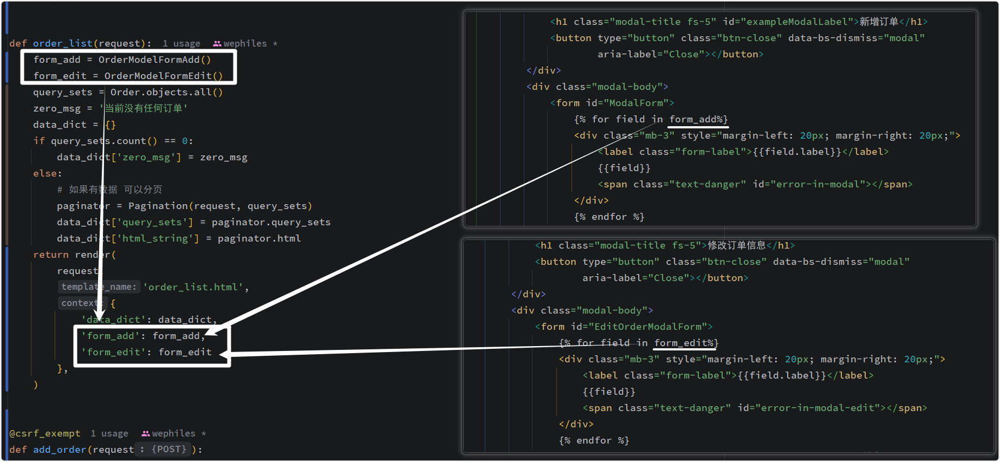

展示效果：

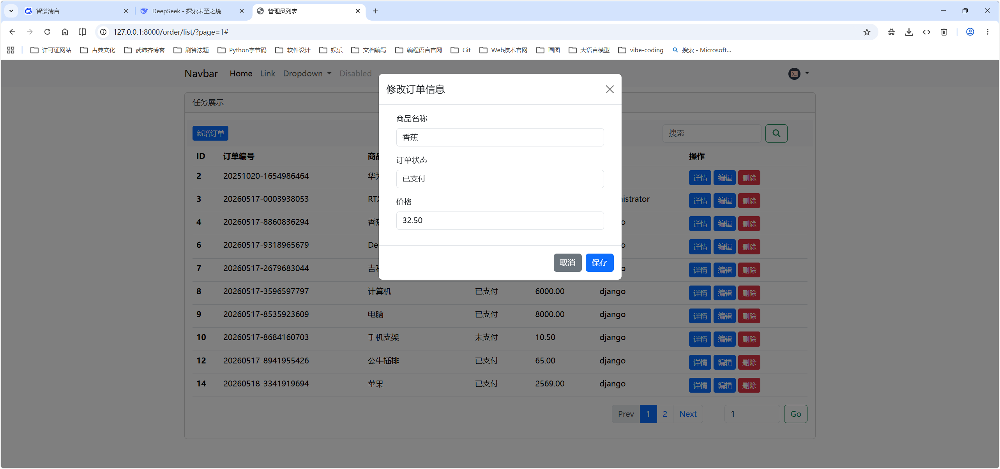

### 1.3.6 提取公共功能、优化

`Ajax代码可以抄写下面这些函数 -- 增删改查`

```js
<script type="text/javascript">
    // 声明全局变量 用于确认删除
    var DELETE_ID;
    var EDIT_ID;

    // 页面框架加载完成之后执行此函数
    $(function () {
        bindBtnModalAdd();
        bindAddDataFormModalEvent();
        
        bindBtnDeleteModalEvent();
        bindBtnDeleteConfirmModalEvent();
        
        bindBtnEditEvent();  // 点击编辑按钮时调用此函数
        bindBtnEditConfirm();
    })

    // 点击按钮出现模态框
    function bindBtnModalAdd() {
        $("#btn-modal-add").click(function () {
            // // 如果新增和编辑共用一个Form且共用一个模态框
            // 清空对话框中的数据
            // $("ModalForm")[0].reset();
            // // 清空全局 EDIT_ID 变量
            // EDIT_ID = null;

            // 点击 id=btn-modal-add的元素后执行此函数体内的内容
            // 此函数的功能是显示模态框
            $("#MyAddModal").modal("show");
        })
    }

    // 用户输入信息后执行的操作
    function bindAddDataFormModalEvent() {
        // 点击按钮执行 Ajax 向后端发请求
        $("#ModalSave").click(function () {
            // 在用户输入前将所有的错误信息清空
            $("#error-in-modal").empty();
            $.ajax({
                "url": "/add/order/",
                "type": "POST",
                "data": $("#ModalForm").serialize(),
                "dataType": "json",
                "success": function (res_data) {
                    if (res_data.status) {
                        // 弹出框提示用户新增成功
                        alert("新增订单成功");

                        // 清空表单 $("#ModalForm")是一个Jquery对象 [0]就变成DOM对象, DOM才有.reset()功能
                        $("#ModalForm")[0].reset();

                        // 关闭模块对话框
                        $("#MyAddModal").modal("hide");

                        // 增添成功后刷新页面 前端表格就能正常展示新增过的数据了
                        location.reload();
                    } else {
                        // 添加订单失败 展示所有错误字段的信息
                        $.each(res_data.errors, function (name, error_data) {
                            $("#id_" + name + "_add").next().text(error_data[0]);
                        })
                    }
                }
            })
        })

    }

    function bindBtnDeleteModalEvent() {
        // 点击删除按钮后触发此函数

        // 弹出模态框
        $(".modal-del-btn").click(function () {
            // alert("确认要删除吗?");

            // 显示 确认删除 对话框
            $("#DeleteOrderModal").modal("show");

            // 获取当前行的ID并赋值给全局变量
            // $(this): 点击后, 表示当前点击的这个标签
            DELETE_ID = $(this).attr("oid");

        });
    }

    function bindBtnDeleteConfirmModalEvent() {
        $("#btnDeleteConfirm").click(function () {
            // 点击确认删除的确认按钮后, 将全局变量中存储的要删除的ID发送到后台
            // // 方法一
            // $.ajax({
            //     "url": "/delete/" + DELETE_ID + "/order/",  // ==> /delete/5/order/
            //     "type": "GET",
            //     "dataType": "json",
            //     "success": function (res_data) {}
            // })

            // 方法二
            $.ajax({
                "url": "/delete/order/",  // ==> /delete/order?oid=10
                "type": "GET",
                "data": {
                    "oid": DELETE_ID
                },
                "dataType": "json",
                "success": function (res_data) {
                    if (res_data.status) {
                        // // 删除成功
                        // alert("删除ID为" + DELETE_ID + "的订单成功");

                        // 将确认删除的模态框隐藏
                        $("#DeleteOrderModal").modal("hide");

                        // // 在页面上将当前这一行的数据删除掉 -- js -- 当前页数据越来越少
                        // $("tr[oid='" + DELETE_ID + "']").remove();

                        // 将 DELETE_ID 置空
                        DELETE_ID = null;

                        // 简单的在页面上删除已删除的数据 -- 刷新页面
                        location.reload();
                    } else {
                        // 删除失败
                        alert(res_data.error);
                    }
                }
            })
        })
    }

    function bindBtnEditEvent() {
        $(".btn-edit-order-trigger").click(function () {
            // // 如果新增和编辑共用一个Form且共用一个模态框
            // // 清空对话框中的数据
            // $("#EditOrderModalForm")[0].reset();

            // 点击编辑按钮后获取到当前的 oid
            var currentID = $(this).attr("oid");
            EDIT_ID = currentID;

            // 发送 Ajax 请求去后台获取当前行的相关数据
            $.ajax({
                "url": "/order/detail/",
                "type": "GET",
                "data": {"oid": currentID},
                "dataType": "json",
                "success": function (res_data) {
                    if (res_data.status) {
                        // 获取数据成功, 将从后端获取到的数据赋值给对话框里面的输入标签
                        $.each(res_data.data, function (name, value) {
                            $("#id_" + name + "_edit").val(String(value));
                        })
                        // 弹出编辑模态框
                        $("#MyEditForm").modal("show");
                    } else {
                        // 获取数据失败
                        alert(res_data.error);
                    }
                }
            })
        });
    }

    function bindBtnEditConfirm() {
        $("#EditModalConfirm").click(function () {
            $.ajax({
                "url": "/edit/order/" + "?oid=" + EDIT_ID,
                "type": "POST",
                "data": $("#EditOrderModalForm").serialize(),
                "dataType": "json",
                "success": function (res_data) {
                    if (res_data.status) {
                        alert("数据修改成功");
                        $("#MyEditForm").modal("hide");
                        EDIT_ID = null;
                        location.reload();
                    } else {
                        if (res_data.errors) {
                            $.each(res_data.errors, function (name, error_data) {
                                $("#id_" + name + "_edit").next().text(error_data[0]);
                            })
                        } else {
                            alert(res_data.error);
                        }
                    }
                }
            })
        });

    }
</script>
```

### 1.3.7 小结

至此，基于Ajax + 对话框的形式实现的页面的增删改查

- 表单 实现增删改查
- Ajax 实现增删改查

## 1.4 图标数据展示

- highcharts，国外  `https://highcharts.com.cn/`
- echarts，国内 ：`https://echarts.apache.org/zh/index.html`

本案例用`echarts`

官网：`https://echarts.apache.org/zh/index.html`

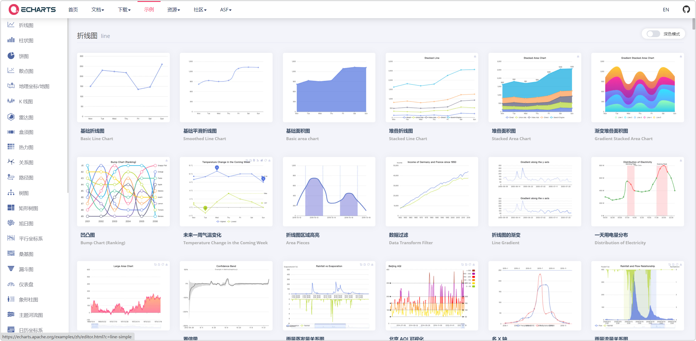

### 1.4.1 柱状图体验

```html




数据统计




<div class="card" style="margin-bottom: 10px;">
    <div class="card-header">
        折线图
    </div>
    <div class="card-body">


    </div>
</div>

<div class="row" style="margin-top: 10px;">
    <div class="col-8">
        <div class="card">
            <div class="card-header">
                柱状图
            </div>
            <div class="card-body">
                <div id="m2" style="width: 600px;height:400px;"></div>
            </div>
        </div>
    </div>
    <div class="col-4">
        <div class="card">
            <div class="card-header">
                饼图
            </div>
            <div class="card-body">
                <p class="card-text">突突突</p>
            </div>
        </div>
    </div>
</div>




<script src=""></script>
<script type="text/javascript">
    // 基于准备好的dom，初始化echarts实例
    var myChart = echarts.init(document.getElementById('m2'));

    // 指定图表的配置项和数据
    var option = {
        title: {
            text: 'ECharts 入门示例'
        },
        tooltip: {},
        legend: {
            data: ['销量']
        },
        xAxis: {
            data: ['衬衫', '羊毛衫', '雪纺衫', '裤子', '高跟鞋', '袜子']
        },
        yAxis: {},
        series: [
            {
                name: '销量',
                type: 'bar',
                data: [5, 20, 36, 10, 10, 20]
            }
        ]
    };
    // 使用刚指定的配置项和数据显示图表。
    myChart.setOption(option);
</script>



```

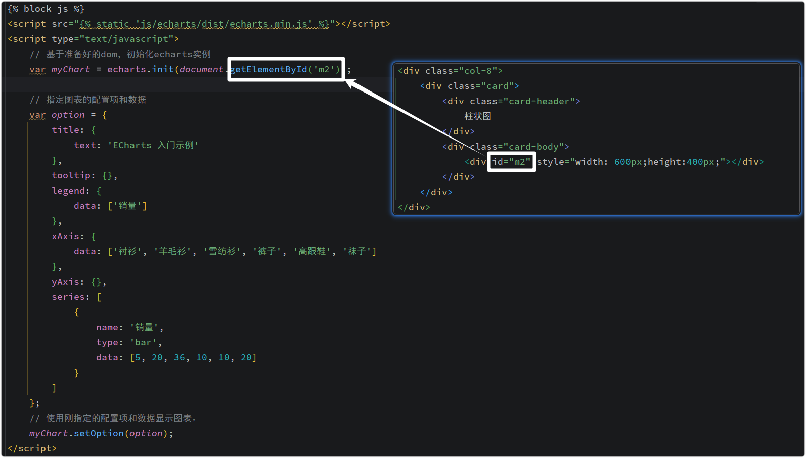

显示效果：

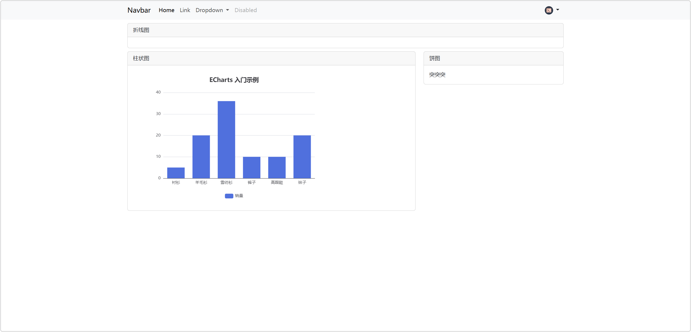

修改 option：

```html
<script type="text/javascript">
    // 基于准备好的dom，初始化echarts实例
    var myChart = echarts.init(document.getElementById('m2'));

    // 指定图表的配置项和数据
    var option = {
        title: {
            text: 'ECharts 入门示例 - 柱状图'
        },
        tooltip: {},
        legend: {
            data: ['销量']
        },
        xAxis: {
            data: ['衬衫', '羊毛衫', '雪纺衫', '裤子', '高跟鞋', '袜子', '帽子']
        },
        yAxis: {},
        series: [
            {
                name: '销量',
                type: 'bar',
                data: [5, 20, 36, 10, 10, 20, 100]
            }
        ]
    };
    // 使用刚指定的配置项和数据显示图表。
    myChart.setOption(option);
</script>
```

显示效果：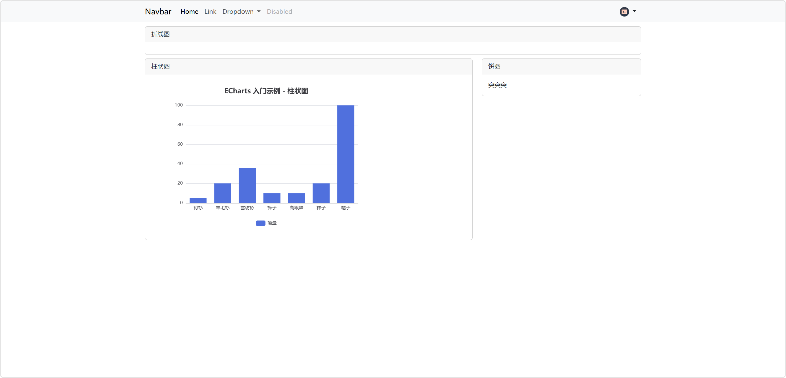

修改series和legend数据：

```html
<script type="text/javascript">
    // 基于准备好的dom，初始化echarts实例
    var myChart = echarts.init(document.getElementById('m2'));

    // 指定图表的配置项和数据
    var option = {
        title: {
            text: 'ECharts 入门示例 - 柱状图'
        },
        tooltip: {},
        legend: {
            data: ['销量', '业绩']  // 这个是图例
        },
        xAxis: {
            data: ['衬衫', '羊毛衫', '雪纺衫', '裤子', '高跟鞋', '袜子', '帽子']
        },
        yAxis: {},
        series: [
            {
                name: '销量',
                type: 'bar',  // bar 是柱状图
                data: [5, 20, 36, 10, 10, 20, 98]
            },
            {
                name: '业绩',
                type: 'bar',  // bar 是柱状图
                data: [5, 50, 25, 6, 6, 25, 68]
            },
        ]
    };
    // 使用刚指定的配置项和数据显示图表。
    myChart.setOption(option);
</script>
```

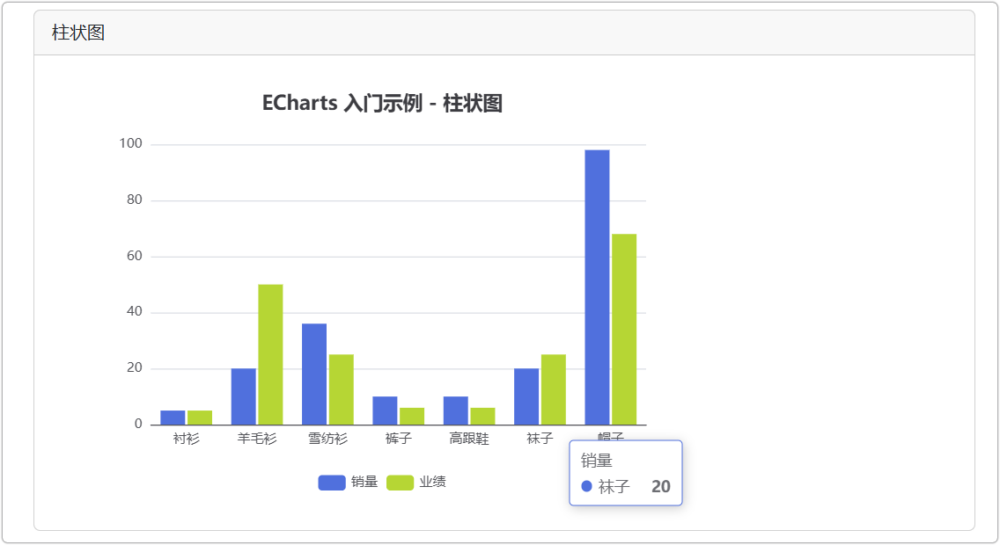

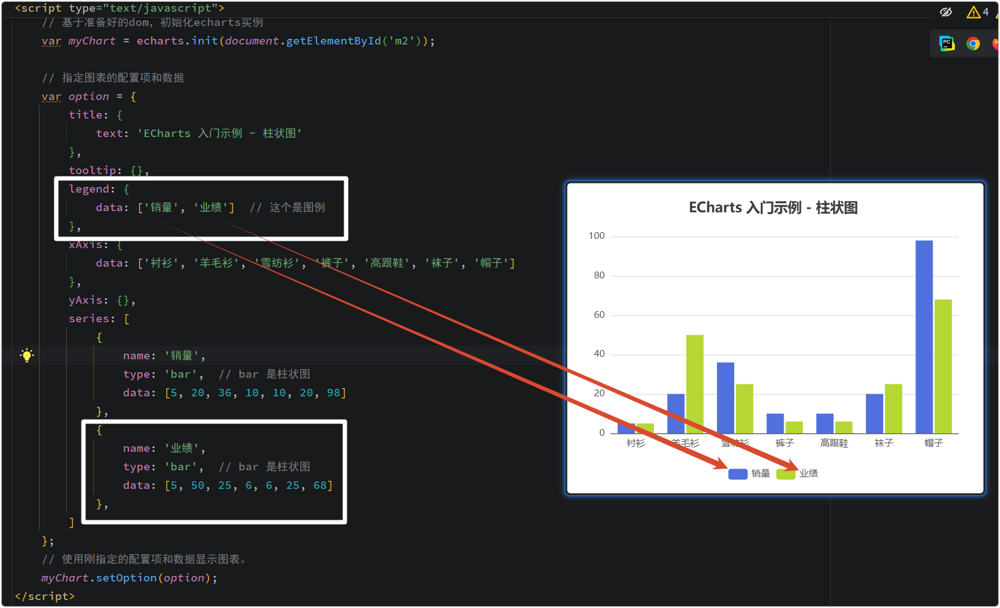

### 1.4.2 前端发送 Ajax 请求从后端获取数据

```python
# 数据统计
path('chart/list/', charts.chart_list),
path('chart/bar/', charts.chart_bar),
```

```python
def chart_list(request):
    return render(request, 'chart_list.html')


def chart_bar(request):
    """改造柱状图的数据"""
    legend = ['jack', 'rose']

    series = [
        {
            'name': 'jack',
            'type': 'bar',
            'data': [5, 20, 36, 10, 10, 20, 98]
        },
        {
            'name': 'rose',
            'type': 'bar',
            'data': [5, 50, 25, 6, 6, 25, 68]
        },
    ]

    x_axis = ['1月', '2月', '3月', '4月', '5月', '6月', '7月']

    return JsonResponse({
        'status': True,
        'data': {
            'legend': legend,
            'series': series,
            'x_axis': x_axis
        }
    })
```

```html




数据统计




<div class="card" style="margin-bottom: 10px;">
    <div class="card-header">
        折线图
    </div>
    <div class="card-body">


    </div>
</div>

<div class="row" style="margin-top: 10px;">
    <div class="col-8">
        <div class="card">
            <div class="card-header">
                柱状图
            </div>
            <div class="card-body">
                <div id="m2" style="width: 100%;height:400px;"></div>
            </div>
        </div>
    </div>
    <div class="col-4">
        <div class="card">
            <div class="card-header">
                饼图
            </div>
            <div class="card-body">
                <p class="card-text">突突突</p>
            </div>
        </div>
    </div>
</div>




<script src=""></script>
<script type="text/javascript">
    $(function () {
        initBar();
    })

    /**
     * 初始化柱状图
     */
    function initBar() {
        // 基于准备好的dom，初始化echarts实例
        var myChart = echarts.init(document.getElementById('m2'));

        // 指定图表的配置项和数据
        var option = {
            title: {
                text: '员工业绩汇总',
                subtext: '销售组',
            },
            tooltip: {},
            legend: {},
            xAxis: {},
            yAxis: {},
        };
        
        // 向后台发送请求获取数据
        $.ajax({
            url: '/chart/bar/',
            type: 'GET',
            dataType: 'json',
            success: function (res) {
                if (res.status) {
                    // 成功 将后台返回的数据更新到 option 中
                    console.log('成功');
                    option.legend.data = res.data.legend;
                    option.xAxis.data = res.data.x_axis;
                    option.series = res.data.series;

                    myChart.setOption(option);
                } else {
                    // 失败
                }
            }
        })


    }

</script>


```

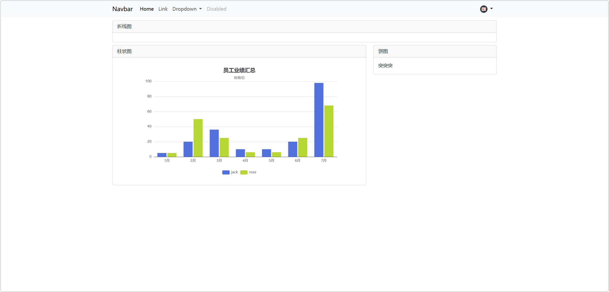

### 1.4.3 饼图

```python
path('chart/pie/', charts.chart_pie),
```


```python
def chart_pie(request):
    return JsonResponse({
        'status': True,
        'data': [
            {'value': 1048, 'name': 'IT部'},
            {'value': 735, 'name': '运营部'},
            {'value': 580, 'name': '新媒体'},
        ],
    })
```


```html




数据统计




<div class="card" style="margin-bottom: 10px;">
    <div class="card-header">
        折线图
    </div>
    <div class="card-body">


    </div>
</div>

<div class="row" style="margin-top: 10px;">
    <div class="col-8">
        <div class="card">
            <div class="card-header">
                柱状图
            </div>
            <div class="card-body">
                <div id="m2" style="width: 100%;height:400px;"></div>
            </div>
        </div>
    </div>
    <div class="col-4">
        <div class="card">
            <div class="card-header">
                饼图
            </div>
            <div class="card-body">
                <div id="m3" style="width: 100%; height: 400px;"></div>
            </div>
        </div>
    </div>
</div>




<script src=""></script>
<script type="text/javascript">
    $(function () {
        initBar();
        initPie();
    })

    /**
     * 初始化柱状图
     */
    function initBar() {
        // 基于准备好的dom，初始化echarts实例
        var myChart = echarts.init(document.getElementById('m2'));

        // 指定图表的配置项和数据
        var option = {
            title: {
                text: '员工业绩汇总',
                subtext: '销售组',
            },
            tooltip: {},
            legend: {},
            xAxis: {},
            yAxis: {},
        };

        // 向后台发送请求获取数据
        $.ajax({
            url: '/chart/bar/',
            type: 'GET',
            dataType: 'json',
            success: function (res) {
                if (res.status) {
                    // 成功 将后台返回的数据更新到 option 中
                    option.legend.data = res.data.legend;
                    option.xAxis.data = res.data.x_axis;
                    option.series = res.data.series;

                    myChart.setOption(option);
                } else {
                    // 失败
                }
            }
        })
    }

    /**
     * 初始化饼图
     */
    function initPie() {
        var chartDom = document.getElementById('m3');
        var myChart = echarts.init(chartDom);
        var option;

        option = {
            title: {
                text: '各部门销量占比',
                subtext: 'Fake Data',
                left: 'center'
            },
            tooltip: {
                trigger: 'item'
            },
            legend: {
                // orient: 'vertical',
                // left: 'left'
                bottom: 0, // 让图例显示在底部
            },
            series: [
                {
                    name: '销量',
                    type: 'pie',
                    radius: '50%',
                    emphasis: {
                        itemStyle: {
                            shadowBlur: 10,
                            shadowOffsetX: 0,
                            shadowColor: 'rgba(0, 0, 0, 0.5)'
                        }
                    }
                },
            ]
        };

        $.ajax({
            url: '/chart/pie/',
            type: 'GET',
            dataType: 'json',
            success: function (res) {
                if (res.status) {
                    option.series[0].data = res.data;
                    option && myChart.setOption(option);
                }
            }
        })
    }


</script>



```

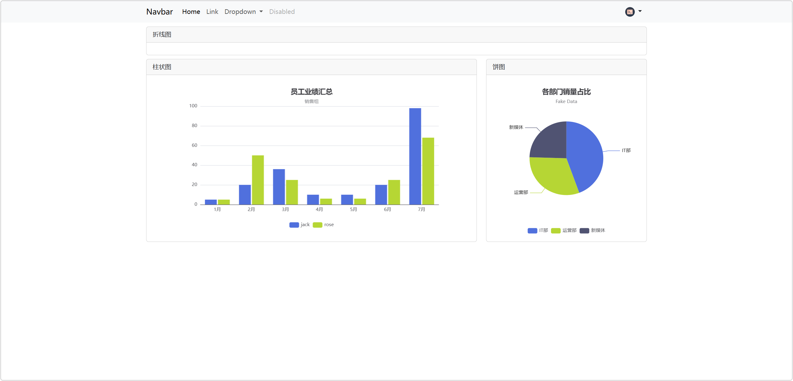

### 1.4.4 折线图

```python
path('chart/line/', charts.chart_line),
```

```python
def chart_line(request):
    return JsonResponse({
        'status': True,
        'data':[
                {
                    'name': 'A分公司',
                    'type': 'line',
                    'stack': 'Total',
                    'data': [120, 132, 101, 134, 90, 230, 210]
                },
                {
                    'name': 'B分公司',
                    'type': 'line',
                    'stack': 'Total',
                    'data': [220, 182, 191, 234, 290, 330, 310]
                },
                {
                    'name': 'C分公司',
                    'type': 'line',
                    'stack': 'Total',
                    'data': [150, 232, 201, 154, 190, 330, 410]
                },
            ],
    })
```


```html




数据统计




<div class="card" style="margin-bottom: 10px;">
    <div class="card-header">
        折线图
    </div>
    <div class="card-body">
        <div id="m1" style="width: 100%; height: 300px;"></div>

    </div>
</div>

<div class="row" style="margin-top: 10px;">
    <div class="col-8">
        <div class="card">
            <div class="card-header">
                柱状图
            </div>
            <div class="card-body">
                <div id="m2" style="width: 100%;height:400px;"></div>
            </div>
        </div>
    </div>
    <div class="col-4">
        <div class="card">
            <div class="card-header">
                饼图
            </div>
            <div class="card-body">
                <div id="m3" style="width: 100%; height: 400px;"></div>
            </div>
        </div>
    </div>
</div>




<script src=""></script>
<script type="text/javascript">
    $(function () {
        initBar();
        initPie();
        initLine();
    })

    /**
     * 初始化柱状图
     */
    function initBar() {
        // 基于准备好的dom，初始化echarts实例
        var myChart = echarts.init(document.getElementById('m2'));

        // 指定图表的配置项和数据
        var option = {
            title: {
                text: '员工业绩汇总',
                subtext: '销售组',
            },
            tooltip: {},
            legend: {},
            xAxis: {},
            yAxis: {},
        };

        // 向后台发送请求获取数据
        $.ajax({
            url: '/chart/bar/',
            type: 'GET',
            dataType: 'json',
            success: function (res) {
                if (res.status) {
                    // 成功 将后台返回的数据更新到 option 中
                    option.legend.data = res.data.legend;
                    option.xAxis.data = res.data.x_axis;
                    option.series = res.data.series;

                    myChart.setOption(option);
                } else {
                    // 失败
                }
            }
        })
    }

    /**
     * 初始化饼图
     */
    function initPie() {
        var chartDom = document.getElementById('m3');
        var myChart = echarts.init(chartDom);
        var option;

        option = {
            title: {
                text: '各部门销量占比',
                subtext: 'Fake Data',
                left: 'center'
            },
            tooltip: {
                trigger: 'item'
            },
            legend: {
                // orient: 'vertical',
                // left: 'left'
                bottom: 0, // 让图例显示在底部
            },
            series: [
                {
                    name: '销量',
                    type: 'pie',
                    radius: '50%',
                    emphasis: {
                        itemStyle: {
                            shadowBlur: 10,
                            shadowOffsetX: 0,
                            shadowColor: 'rgba(0, 0, 0, 0.5)'
                        }
                    }
                },
            ]
        };

        $.ajax({
            url: '/chart/pie/',
            type: 'GET',
            dataType: 'json',
            success: function (res) {
                if (res.status) {
                    option.series[0].data = res.data;
                    option && myChart.setOption(option);
                }
            }
        })
    }

    function initLine() {
        var chartDom = document.getElementById('m1');
        var myChart = echarts.init(chartDom);
        var option;

        option = {
            title: {
                text: '各部门业绩展示',
                subtext: '华南地区',
            },
            tooltip: {
                trigger: 'axis'
            },
            legend: {
                data: ['Email', 'Union Ads', 'Video Ads', 'Direct', 'Search Engine'],
            },
            // grid: {
            //     left: '3%',
            //     right: '4%',
            //     bottom: '3%',
            //     containLabel: true
            // },
            toolbox: {
                feature: {
                    saveAsImage: {}
                }
            },
            xAxis: {
                type: 'category',
                boundaryGap: false,
                data: ['Mon', 'Tue', 'Wed', 'Thu', 'Fri', 'Sat', 'Sun']
            },
            yAxis: {
                type: 'value'
            },

        };

        $.ajax({
            url: '/chart/line/',
            type: 'GET',
            dataType: 'json',
            success: function (res) {
                if (res.status) {
                    option.series = res.data;
                    option && myChart.setOption(option);
                }
            }
        })


    }

</script>



```


