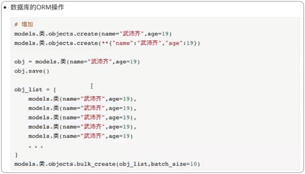
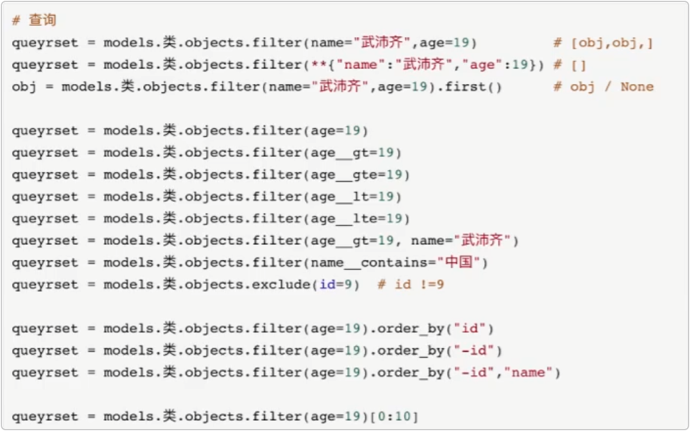
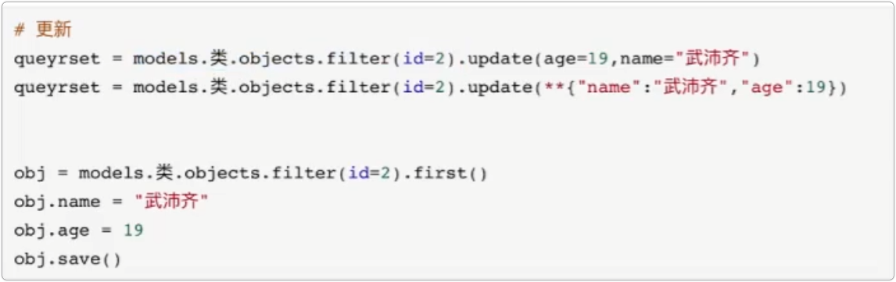
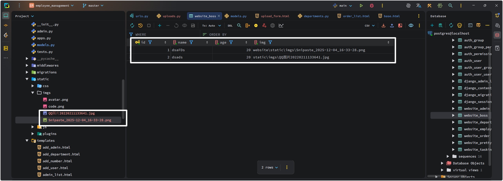

<h1 style="text-align: center;font-size: 40px; font-family: '楷体';">Django开发 - day20</h1>

[TOC]

# 1. 知识点复习

## 1.1 基础入门

- 编码：
  ```
  utf-8 unicode ascii gbk
  Python 3 默认解释器编码是 utf-8
  Python 2 默认解释器编码是 ascii
  ```

- 输入和输出
  ```
  print()
  input() --> 永远都是输入的是字符串类型
  ```

- 变量

- 异常处理【补充】
  ```python
  # 下面的代码有风险, 可能会报错
  data = input('请输入')
  res = int(data)
  print(res)
  ```

  ```python
  try:
      data = input('请输入')
      res = int(data)
      print(res)
  except Exception as e:
      print("出错了")
  ```

- 循环 break continue

- 字符串格式化

- 运算符

## 1.2 数据类型

- str
- list
- tuple
- int
- float
- set
- dict

## 1.3 函数

## 1.4 模块

## 1.5 面向对象

三大特性

- 封装
- 继承
- 多态

## 1.6 MySQL数据库

详细了解MySQL数据库：`https://www.bilibili.com/video/BV15R4y1b7y9?vd_source=2c9a5d5590d3759367594e264ff079c4`

[点击这里直接跳转](https://www.bilibili.com/video/BV15R4y1b7y9?vd_source=2c9a5d5590d3759367594e264ff079c4)

注意：SQL语句一定不要用字符串格式化去拼接！！！

## 1.7 前端

## 1.8 Django

批量创建







删除

```python
models.类.objects.filter(id=2).delete()
```

补充： Model操作 `https://www.cnblogs.com/wupeiqi/articles/6216618.html`

# 2. 文件上传

## 2.1 基本使用

```html
<div class="card" style="margin-bottom: 10px;">
    <div class="card-header">
        文件上传
    </div>
    <div class="card-body">
        <form method="post" enctype="multipart/form-data" action="/upload/file/">
            
            <input type="text" name="username"/>
            <input type="file" name="avatar"/>
            <input type="submit" value="提交"/>
        </form>
    </div>
</div>
```

```python
def upload_file(request):
    print(request.POST)  # 请求体中的数据
    # 请求发过来的文件, form 表单标签上加上属性 enctype="multipart/form-data" 传过来的才是真正的文件 否则上传的是文件名
    print(request.FILES)
    return HttpResponse("<h1>Upload new File</h1>")
```

## 2.2 保存文件

```python
path('file/list/', uploads.file_list),
path('upload/file/', uploads.upload_file),
```

```python
def file_list(request):
    return render(request, 'file_list.html')


def upload_file(request):
    # request.POST  # 请求体中的数据
    # 请求发过来的文件, form 表单标签上加上属性 enctype="multipart/form-data" 传过来的才是真正的文件 否则上传的是文件名
    # request.FILES  # <MultiValueDict: {'avatar': [<InMemoryUploadedFile: file_name.jpg (image/jpeg)>]}>

    file_obj = request.FILES.get('avatar')
    print(file_obj.name)  # 文件名 file_name.jpg
    with open(file_obj.name, 'wb') as fp:
        for chunk in file_obj.chunks():
            fp.write(chunk)

    return HttpResponse(f"<h1>Upload new File {file_obj.name}</h1>")
```

```html
<div class="card" style="margin-bottom: 10px;">
    <div class="card-header">
        文件上传
    </div>
    <div class="card-body">
        <form method="post" enctype="multipart/form-data" action="/upload/file/">
            
            <input type="text" name="username"/>
            <input type="file" name="avatar"/>
            <input type="submit" value="提交"/>
        </form>
    </div>
</div>
```

## 2.3 案例 批量文件数据

以 部门管理 为例

```python
path('add/depart/multi/', departments.add_depart_multi),
```

```python
def add_depart_multi(request):
    """批量上传"""
    file_obj = request.FILES.get('departFile')
    # 直接打开Excel文件并读取内容
    wb = load_workbook(file_obj)
    sheet = wb.worksheets[0]
    cell = sheet.cell(row=1, column=1)

    # 循环获取每一行数据 写入数据库
    for row in sheet.iter_rows(min_row=2):
        text = row[0].value
        if not Department.objects.filter(name=text).exists():
            Department.objects.create(name=text)

    # # 写入文件
    # with open(file_obj.name, 'wb') as fp:
    #     for chunk in file_obj.chunks():
    #         fp.write(chunk)
    return redirect('/depart/list/')
```

```html
<div class="card">
    <div class="card-header">
        批量上传
    </div>
    <div class="card-body">
        <div class="input-group">
            <form enctype="multipart/form-data" method="POST" action="/add/depart/multi/">
                
                <div class="row">
                    <div class="col-8">
                        <input type="file" class="form-control" name="departFile">
                    </div>
                    <div class="col-4">
                        <button class="btn btn-primary" type="submit" id="inputGroupFileAddon04">提交</button>
                    </div>
                </div>
            </form>
        </div>
    </div>
</div>
```

## 2.4 案例：混合数据（Form）

提交页面时：用户输入数据 + 文件（输入不能为空、报错）

- Form 生成 HTML 标签：`type=file`
- 表单的验证
- `form.cleaned_data` 获取数据 + 文件对象

```html



上传文件 - form 组件




<div class="container">
    <div class="card">
        <div class="card-header">
            混合数据上传
        </div>
        <div class="card-body">
            <form enctype="multipart/form-data" action="/upload/form/" method="post" novalidate>
                
                
                <div class="mb-3">
                    <label for="formFile" class="form-label">{{field.label}}</label>
                    {{field}}
                    <span style="color: #0a3622;">{{field.errors.0}}</span>
                </div>

                
                <button type="submit" class="btn btn-primary">提 交</button>
            </form>
        </div>
    </div>


</div>



```

```python
path('file/list/', uploads.file_list),
path('upload/file/', uploads.upload_file),
path('upload/form/', uploads.upload_form),
```

```
class Boss(models.Model):
    name = models.CharField(
        verbose_name='姓名',
        max_length=32,
    )
    age = models.SmallIntegerField(
        verbose_name='年龄',
    )
    img = models.CharField(verbose_name='头像', max_length=256)
```


```python
class FileUploadForm(BootStrapForm):
    name = forms.CharField(label='姓名', max_length=16)
    age = forms.IntegerField(label='年龄')
    img = forms.FileField(label='头像')

def upload_form(request):
    if request.method == 'GET':
        form = FileUploadForm()
        return render(request, 'upload_form.html', {'form': form})
    form = FileUploadForm(data=request.POST, files=request.FILES)
    if form.is_valid():
        print(form.cleaned_data)
        # # {'name': 'hello', 'age': 20, 'img': <InMemoryUploadedFile: data.png (application/vnd.openxmlformats-officedocument.spreadsheetml.sheet)>}
        # # 读取内容，自己处理每个字段的数据

        # 1. 读取文件内容, 写入到文件中，获取到文件路径
        image_obj = form.cleaned_data.get('img')
        file_path = os.path.join('website', 'static', 'imgs', image_obj.name)
        db_file_path = os.path.join('static', 'imgs', image_obj.name)
        with open(file_path, 'wb') as fp:
            for chunk in image_obj.chunks():
                fp.write(chunk)
        # 2. 将文件路径写入数据库
        Boss.objects.create(
            name=form.cleaned_data.get('name'),
            age=form.cleaned_data.get('age'),
            img=db_file_path,
            # 数据库直接从 /static/ 存起更容易拼接, 因为我们的真是图片地址应该是 http://127.0.0.1:8000/static/imgs/name.png
            # 可以看出来没有 app 的路径 所以此处存 db_file_path
        )

        return HttpResponse(f"<h1>Upload new File {form.cleaned_data['name']}</h1>")
    else:
        return render(request, 'upload_form.html', {'form': form})
```



注意：**目前而言**，所有的静态文件都只能放在 static 目录。

## 2.5 案例 上传文件(更简单的)

在Django中，一般有两个文件夹比较特殊 -- 

- static 目录： 存储静态文件的目录， css 、js 、项目所需要用到的图片

- media 用户上传的数据一般放在这个位置 -- 启用这个目录是需要做一些配置的

### 2.5.1 启用 media

在 `urls.py` 中进行配置：

```python
from django.urls import path, re_path
from django.conf import settings
from django.views.static import serve


urlpatterns = [
    re_path(r'^media(?P<path>.*)$', serve, {'document_root': settings.MEDIA_ROOT}, name='media'),
    其他的路由,
    ...,
]
```

在 settings.py 中配置：

```python
import os
...

MEDIA_ROOT = os.path.join(BASE_DIR, 'media')
MEDIA_URL = '/media/'
```

可直接在浏览器上访问地址：

```python
http://127.0.0.1:8000/media/1.png
```

---

```python
urlpatterns = [
    # path('admin/', admin.site.urls),
    re_path(r'^media(?P<path>.*)$', serve, {'document_root': settings.MEDIA_ROOT}, name='media'),
    ...
]
```

```python
def upload_form(request):
    if request.method == 'GET':
        form = FileUploadForm()
        return render(request, 'upload_form.html', {'form': form})
    form = FileUploadForm(data=request.POST, files=request.FILES)
    if form.is_valid():
        # print(form.cleaned_data)
        # # {'name': 'hello', 'age': 20, 'img': <InMemoryUploadedFile: data.png (application/vnd.openxmlformats-officedocument.spreadsheetml.sheet)>}
        # # 读取内容，自己处理每个字段的数据

        # 1. 读取文件内容, 写入到文件中，获取到文件路径
        image_obj = form.cleaned_data.get('img')
        # file_path = os.path.join('website', 'static', 'imgs', image_obj.name)
        # media_path = os.path.join(settings.MEDIA_ROOT, image_obj.name)  # 这样的话上传的是绝对路径
        media_path = os.path.join("media", image_obj.name)  # 这样的话上传的是相对
        with open(media_path, 'wb') as fp:
            for chunk in image_obj.chunks():
                fp.write(chunk)
        # 2. 将文件路径写入数据库
        Boss.objects.create(
            name=form.cleaned_data.get('name'),
            age=form.cleaned_data.get('age'),
            img=media_path,
            # 数据库直接从 /static/ 存起更容易拼接, 因为我们的真是图片地址应该是 http://127.0.0.1:8000/static/imgs/name.png
            # 可以看出来没有 app 的路径 所以此处存 db_file_path
        )
		
        return HttpResponse(f"<h1>Upload new File {form.cleaned_data['name']}</h1>")
    else:
        return render(request, 'upload_form.html', {'form': form})
```

```html
HTML文件同 ## 2.4 案例：混合数据（Form）
```

## 2.6 案例：混合上传文件数据（ModelForm）

```html



上传文件 - modal form 组件




<div class="container">
    <div class="card">
        <div class="card-header">
            混合数据上传
        </div>
        <div class="card-body">
            <form enctype="multipart/form-data" action="/upload/modelform/" method="post" novalidate>
                
                
                <div class="mb-3">
                    <label for="formFile" class="form-label">{{field.label}}</label>
                    {{field}}
                    <span style="color: #0a3622;">{{field.errors.0}}</span>
                </div>

                
                <button type="submit" class="btn btn-primary">提 交</button>
            </form>
        </div>
    </div>
</div>



```

```python
# models.py

class City(models.Model):
    name = models.CharField(
        verbose_name='姓名',
        max_length=32,
    )
    count = models.SmallIntegerField(
        verbose_name='人口',
    )

    # 本质上在数据库中也是 CharField，自动保存数据 upload_to 是自动上传的那个文件夹，但是这个文件夹不是乱写的，而是media下面的某个文件夹
    logo = models.FileField(verbose_name='logo', max_length=256, upload_to='city/')
```

```python
path('file/list/', uploads.file_list),
path('upload/file/', uploads.upload_file),
path('upload/form/', uploads.upload_form),
path('upload/modelform/', uploads.upload_modal_form),
```

```python
def upload_modal_form(request):
    if request.method == 'GET':
        form = FileUploadModalForm()
        return render(request, 'upload_modal_form.html', {'form': form})
    form = FileUploadModalForm(data=request.POST, files=request.FILES)
    if form.is_valid():
        # 自动保存文件到 media 并将上传的路径写入数据库
        form.save()
        return HttpResponse(f"<h1>Upload new File {form.cleaned_data['name']}</h1>")
    else:
        return render(request, 'upload_modal_form.html', {'form': form})
```

## 2.7 小结

- 自己手动去写
  ```python
  file_obj = request.FILES.get("name")
  ...
  ```

- Form 组件(表单验证)
  ```python
  request.POST
  file_obj = request.FILES.get('name')
  具体文件操作还是需要自己写
  ```

- ModalForm（表单验证+自动保存数据库+自动保存文件）
  ```python
  - media 文件夹
  - models.py -- 自定义文件要
  	img = models.FileField(verbose_name='xxx', max_length=256, upload_to='city/')
  ```

## 2.8 补充

关于 modalForm在前端显示图片：

```python
# 城市列表
path('city/list/', city.city_list),
```

```python
def city_list(request):
    querysets = City.objects.all()
    return render(request, 'city_list.html', {'querysets': querysets})
```

```python
class City(models.Model):
    name = models.CharField(
        verbose_name='姓名',
        max_length=32,
    )
    count = models.SmallIntegerField(
        verbose_name='人口',
    )

    # 本质上在数据库中也是 CharField，自动保存数据 upload_to 是自动上传的那个文件夹，但是这个文件夹不是乱写的，而是media下面的某个文件夹
    logo = models.FileField(verbose_name='logo', max_length=256, upload_to='city/')
```

```html



城市列表



<div class="card">
    <div class="card-header">
        城市列表
    </div>
    <div class="card-body">
        <div>
            <nav class="navbar bg-body-tertiary row">
                <div class="col-9">
                    <a href="" class="btn btn-primary btn-sm">
                        新增城市
                    </a>
                </div>

                <div class="container col-3">
                    <form class="d-flex" role="search" action="" method="GET">
                        <input class="form-control me-2" type="search" placeholder="搜索" aria-label="Search" name="q"
                               value="{{ search_data }}"/>
                        <button class="btn btn-outline-success" type="submit">
                            <i class="fa-classic fa-solid fa-magnifying-glass"></i>
                        </button>
                    </form>
                </div>
            </nav>
        </div>
        <table class="table table-bordered table-striped table-hover" style="margin-top: 22px;">
            <thead>
            <tr>
                <th scope="col">ID</th>
                <th scope="col">名称</th>
                <th scope="col">人口</th>
                <th scope="col">logo</th>
                <th scope="col">操作</th>
            </tr>
            </thead>
            <tbody>
            
            <tr>
                <th scope="row">{{ obj.id }}</th>
                <td>{{ obj.name }}</td>
                <td>{{ obj.count }}</td>
                <td>
                    
                </td>
                <td>
                    <a href="/num/list/" class="btn btn-primary btn-sm">
                        详情
                    </a>

                    <a href="/edit/{{ obj.id }}/number/" class="btn btn-primary btn-sm">
                        编辑
                    </a>

                    <a href="/delete/{{ obj.id }}/number/" class="btn btn-primary btn-sm">
                        删除
                    </a>
                </td>
            </tr>
            
            </tbody>
        </table>
    </div>
</div>

<nav aria-label="Page navigation example" style="margin-top: 20px;">
    <div class="row">
        {{ html_string }}
    </div>
</nav>


```

# 3 总结

课件：

```
https://github.com/wephiles/python_course_fork_wupeiqi
```

- Python基础 ✅
  ```
  【2020 python 3.9 全新教程【武沛齐单独录制】- 路飞学城&老男孩python全栈】https://www.bilibili.com/video/BV1m54y1r7zE
  ```

- 并发编程（进程线程协程）✅
  ```
  【彻底搞懂 python进程和线程】https://www.bilibili.com/video/BV1Ev411G7i3
  【asyncio到底是个啥？【python async await】】https://www.bilibili.com/video/BV1NA411g7yf
  武沛齐老师的博客 - 协程（知乎） - https://www.cnblogs.com/shaji/p/18804846
  ```
  
- MySQL数据库
  ```
  【MySQL数据库教程（2021最新版）】https://www.bilibili.com/video/BV15R4y1b7y9
  【7天MySQL魔鬼训练营（入门到高手）】https://www.bilibili.com/video/BV1DE411n7fU
  ```

- 前端开发
  ```
  【闭关4天学会前端开发（这次再学不会就放弃吧）】https://www.bilibili.com/video/BV1QE411j7bV
  ```

- `Django`开发知识点

  ```
  【15天django入门到放弃】https://www.bilibili.com/video/BV1zE411x7LG
  【【2020 最新python教程】第五部分：Django框架】https://www.bilibili.com/video/BV1JE411V7xk
  ```

- 项目开发
  ```
  任务管理平台
  【老男孩django项目实战：轻量级bug管理平台（自学必备，学完就出师）】https://www.bilibili.com/video/BV1uA411b77M
  ```

- 进阶项目（增删改查、权限）
  ```
  【CRM项目实战第一部分：rbac权限组件】https://www.bilibili.com/video/BV1DE41147b9
  【CRM项目实战第二部分：stark组件】https://www.bilibili.com/video/BV1YE411s7Ga
  【CRM项目实战第三部分：业务开发（完结）】https://www.bilibili.com/video/BV1eE411s7LT
  ```

- 前后端分离: `Django` + `DRF` + `Vue`

  ```
  【drf实战和源码剖析（django rest framework）】https://www.bilibili.com/video/BV1w94y1W7Sx
  【4天搞定django rest framework源码和实战】https://www.bilibili.com/video/BV1ZE411j7RK
  ```

- git版本控制&协同开发 + 任务管理平台
  ```
  【git实战（老男孩最新视频）】https://www.bilibili.com/video/BV19E411f76x
  ```

- 微信小程序 `Django` + `DRF`
  ```
  【入门到实战，讲讲公司的微信小程序【django+drf+小程序实战】】https://www.bilibili.com/video/BV1jC4y1s7QD
  ```

- 项目部署
  ```
  【入门到实战，讲讲公司的微信小程序【django+drf+小程序实战】】https://www.bilibili.com/video/BV1jC4y1s7QD
  (微信小程序课程有讲)
  ```

- 爬虫 + 数据分析
  ```
  【10天快速学会【爬虫】 +【 数据分析】实战】https://www.bilibili.com/video/BV1tE411F7do
  ```

- `celery`

  ```
  【快速搞定---异步框架celery】https://www.bilibili.com/video/BV1jg4y13718?vd_source=2c9a5d5590d3759367594e264ff079c4
  ```

- 迭代器  生成器 可迭代对象 ✅
  ```
  【15分钟彻底搞懂迭代器、可迭代对象、生成器【python迭代器】】https://www.bilibili.com/video/BV1BT4y1P7nn
  ```

- 装饰器 
  ```
  【【专题】彻底学会Python装饰器】https://www.bilibili.com/video/BV1Vv411x7hj
  【【python】装饰器超详细教学，用尽毕生所学给你解释清楚，以后再也不迷茫了！】https://www.bilibili.com/video/BV1Gu411Q7JV
  【30分钟搞定Python装饰器】https://www.bilibili.com/video/BV12ukRYCEz9
  ```

- `Golang`

  ```
  【69天，go开发全套教程【golang，连载中】】https://www.bilibili.com/video/BV1u5411W79w
  ```

- 面向对象
  ```
  【3天专题搞定 python面向对象（真的，再学不会就可以放弃OOP了）】https://www.bilibili.com/video/BV18E411V7ku
  ```

  


