<h1 style="text-align: center;">Python 基础</h1>

[TOC]

# 1. day-01 计算机基础和环境搭建

今日概要

- 计算机基础
- 学习编程的本质
- Python介绍
- Python环境搭建

## 1.1 计算机基础

### 1.1.1 基本概念

- 计算机的组成
  ```
  由多个硬件组合而成  常见的硬件有 CPU 硬盘 内存 网卡 显卡 显示器 机箱 电源 ...
  
  注意事项：机械地将计算机的硬件组合在一起 --> 计算机的硬件之间是无法协同工作的
  ```

- 操作系统
  ```
  用于协调计算机的各个硬件, 让硬件之间进行协同工作, 以完成某个目标
  - Windows --> 优点: 生态丰富；缺点: 慢，收费 【个人】
  - Linux --> 优点：资源占用少，免费（Linux做服务器）；缺点：生态比较欠缺，工具少，告别游戏 【企业服务器】
  - Mac --> 优点：生态比较丰富，工具差不多都有，用户体验和交互非常好；缺点：玩游戏也不是很好【】
  ```

- 软件 应用程序
  ```
  在安装上操作系统之后，我们会在自己电脑上安装一些常用的软件，例如QQ、杀毒、微信...
  
  这些软件：是由各大公司的程序员开发的
  
  以后肯定是写"软件" -- 一大堆的代码（一篇文章）
  ```

  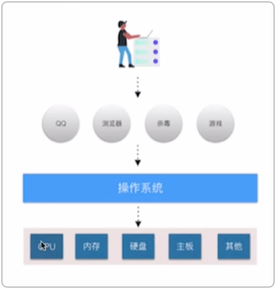

### 1.1.2 编程语言

软件，是由程序员使用编程语言开发出来的一大堆代码集合，全球的编程语言有 2500 多种，常见 `python java c c++ php ...`

作文，是由小学生使用汉语/英语/德语...写出来的一大堆文字集合

本质上学习编程语言是学习他的语法，根据语法再去编写相应的软件的功能。

- python中输出的语法规则
  ```
  print("hello world.")
  ```

- Go 语言中输出的规则
  ```
  fmt.println("hello world.")
  ```

### 1.1.3 编译器&解释器

编译器/解释器：就是一个翻译官，将代码翻译成计算机能够识别的命令。

```
A 使用 python 开发了一个软件                  B 使用 Go 开发了一个软件

	Python解释器                               Golang 编译器

		       操       作        系        统
		
             CPU    硬盘    网卡      内存     ...
```

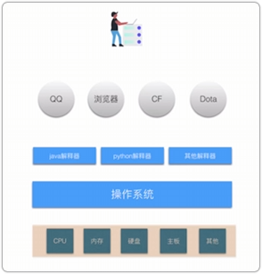

为什么有的叫解释器，有的叫编译器

- 解释器 实时翻译 拿到 1000 行代码后，解释一句交给操作系统一句
- 编译器 全文翻译 拿到 1000 行代码后，将其编译成一个临时文件（计算机能够识别的命令），在将文件交给操作系统去读取

```
python/JavaScript/PHP/Ruby   --> 解释型语言
C/C++/Java/Go                --> 编译型语言
```

## 1.2 学习编程的本质

学编程本质就是三件事

- 选择一门编程语言，在自己的电脑上安装此编程语言相关的编译器/解释器
- 学习编程语言的语法规则，根据语法规则 + 业务背景 设计并开发自己的软件（代码集合）、
- 使用编译器/解释器 去运行自己写的代码

## 1.3 Python 介绍

### 1.3.1 语言的分类

- 翻译的纬度

  - 解释型语言： Python，...
  - 编译型语言： C语言， ...

- 高低纬度

  - 低级编程语言：写出来的代码可以直接被计算机识别

    ```
    机器语言 01010101 00010101 01010110
    汇编语言 MOV       INC      ...
    ```

  - 高级编程语言：写出来的代码无法直接被计算机识别，但是可以通过某种方式将其转换为计算机可以识别的语言
    ```
    C C++ Java Python Ruby Golang PHP C# Rust  # 这种编程语言在编写代码时几乎是写英语作文
    交由相关编译器或解释器翻译成机器码，然后再交给计算机去执行
    ```

注意：现在基本都在使用高级编程语言

### 1.3.2 Python

python为何如此火爆...

### 1.3.3 python解释器种类

学编程本质就是三件事

- 选择一门编程语言，在自己的电脑上安装此编程语言相关的编译器/解释器 -- python解释器
- 学习编程语言的语法规则，根据语法规则 + 业务背景 设计并开发自己的软件（代码集合） -- 学习python语法
- 使用编译器/解释器 去运行自己写的代码 -- 使用python解释器运行自己的代码

由于Python太火了，很多公司都开发了python开发的python解释器（用来翻译python代码成为计算机能够识别的指令）

- `CPython` -- 主流，底层是由C语言开发出来的解释器
- `Jython`： 由 java 语言开发出来的Python解释器，方便让Java和python做代码集成
- `IronPython` 基于 C# 开发的解释器
- `RubyPython`
- `PyPy` 对 `Cpython`的优化，他的执行效率提高了 -- 引入了编译器的功能，本质上是对 python代码进行编译，再去执行编译后的代码

注意：我们常说的python解释器默认指的是`Cpython`解释器

### 1.3.4 `CPython` 解释器的版本

`CPython`的解释器主要有两大版本：

- `2.x`版本 目前最新的版本是 2.7.18, 2020后不再维护
- `3.x`版本 目前最新版是 3.14

## 1.4 环境搭建

### 1.4.1 安装Python解释器

...

### 1.4.2 安装`pycharm`

...

## 1.5 总结 & 作业

1. 了解硬件 操作系统 软件之间的关系
2. 了解常见的操作系统有哪些
3. 了解编译器和解释器的区别和作用
4. 编程语言的分类
5. 了解`Python`解释器的种类
6. 了解`Cpython`解释器的版本
7. 学会如何安装`python`解释器
8. 了解环境变量的作用
9. 了解`python`和`pycharm`的区别

## 1.6 作业

1．简述硬件＆操作系统＆软件（应系统）之间的关系。

```
计算机是由多个硬件组成，例如：CPU、硬盘、内存、卡、主板等。
操作系统则是安装在计算机上于协调各硬件进配合工作的，他将用户的一些为转化为计算机能够识别的命令，并协调各个硬件配合完成相关命令。软件，是由程序员开发并安装在操作系统的程序（本质上是堆的代码），例如：微信、QQ、毒霸等。
```

2.列举常见的操作系统都有哪些。

```
常见的操作系统有三类：
-win:win7、win10、xp等
-linux:centos、ubuntu、redhat 等。
-mac:Catalina、Mojave、Sierra 等。
```

3.简述编译器和解释器的区别和作用。

```
编译器和解释器的作用是将各编程语的代码进翻译，从而使得计算机能够识别并执。
解释器，实施翻译，对代码实边解释边执。
编译器，全翻译，将代码编译成临时件，再执临时件。
```

4.编程语言进行分类

```
解释的角度：编译型和解释性。
高低的角度：级编程语言和低级编程语言。
```

5.Python解释器的种类有哪些?

```
CPython、Jython、IronPython、PYpy等
```

6.CPython解释器的版本有哪些？你现在的是哪个版本？

```
2.x和3.x，目前课堂上使用的是最新的3.9.0版本。我自己使用的是 3.14.2 版本
```

7．系统环境变量的作是什么？

```
在将某个目录添加至环境变量后，如果在终端想要去运行此目录下的件，则只需要输入件名即可（无需再写前缀），系统会自动读取环境变量中的路径并自动拼接。
```

8.Python和Pycharm的区别是什么？

```
Python是解释器，用于将Python解释成计算机能够识别的命令。
PyCharm是IDE（类似编辑器），用于便快速的编写Python代码并实现运行Python代码的一个工具。
```

# 2. day-02 快速上手 

课程目标：学习python最基础的语法知识，可以用代码实现一些简单的功能

- 编码（密码本）
- 编程体验
- 输出
- 数据类型
- 变量
- 注释
- 输入
- 条件语句

## 2.1 编码（可以理解为密码本）

计算机中所有的数据本质上都是以0和1的组合来存储

在计算机中，最终会将中文转换成0100101010101001110...来存储在计算机硬盘上。

在计算机中有一个叫编码的东西(密码本)存储了文字和01010100101101...之间的关系，比如下面这样

```python
计    ->    01010100 01110101 10101100
算    ->    01011100 01110101 10101010
机    ->    00110100 01000101 10100010
```

在计算机中有很多种编码

```python
每种编码都有一套自己的密码本，都维护自己的一套规则
    utf-8编码:
        计    ->    01010100 01110101 10101100
        算    ->    01011100 01110101 10101010
        机    ->    00110100 01000101 10100010
    gbk编码
        计    ->    01010100 10110101
        算    ->    11010100 01110111
        机    ->    10110100 01000101
    所以使用不同的编码保存文件时，硬盘文件中存储的01编码也是不同的。
```

注意事项：在计算机中，以某个编码保存文件，以后就要以这个编码去打开文件。否则显示的全是乱码。

```python
以 UTF-8 编码保存 "计算机"   ->  01010100 01110101 10101100 01010100 01110101 10101100 01010100 01110101 10101100
以 GBK 编码打开             ->  全是乱码
```

## 2.2 编程

- 编码必须保持一致 保存和打开要一致 否则显示乱码
- 默认`python`解释器是以`UTF-8`编码的形式打开文件
- 建议：所有`python`代码文件都要以`utf-8`编码保存

## 2.3 输出

将结果或内容想要呈现给用户

- `print`输出的时候,默认尾部加换行符; 

- 想要不换行：
  ```
  print('这是输出内容', end="")
  ```

## 2.4 数据类型

### 2.4.1 引入

...

### 2.4.2 整形（int）

整形 整数 

```python
print(666)
print(666 + 10)
print(666 - 10)
print(666 * 2)
print(666 / 2)
print(666 % 2)
print(3 ** 2)
```

### 2.4.3 字符串（str）

```python
print('这是一个字符串')
print("这也是一个字符串")
print('''这是一个字符串''')
print("""这也是一个字符串""")
print("""这是一个多行字符串
这是第二行""")
print('''这也是一个多行字符串
这是第二行''')
print('a')  # 这也是一个字符串
print("a")  # 这也是一个字符串
print('')  # 空字符串
```

### 2.4.4 布尔类型（bool）

布尔值只有两个值： True/False

### 2.4.5 类型转换 & 练习题

转换成整形：

```python
int('666')  # 666
int('999')  # 999

int('jack')  # 报错

int(True)  # 1
int(False)  # 0
```

转换成字符串：

```python
str(666)
str(999)

str(False)  # 'False'
str(True)  # 'True'
```

转换成布尔类型：

只有 `0` 转换成 `bool` 类型是 `False`, 其他的整形转换成 `bool` 类型是 `True`

只有 `''`转换成 `bool` 类型是 `False`, 其他的字符串转换成 `bool` 类型是 `True`

```python
bool(0)  # False
bool(1)  # True
bool(-1)  # True

bool('')  # False
bool('a')  # True
```

### 2.4.6 练习题

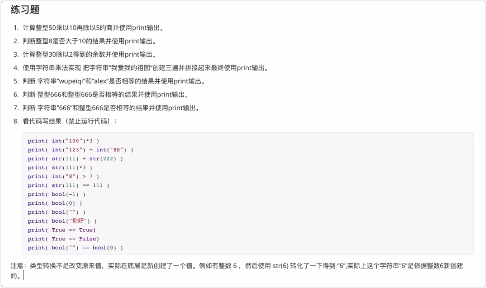

## 2.5 变量及其命名规范

### 2.5.1 变量的内存指向关系

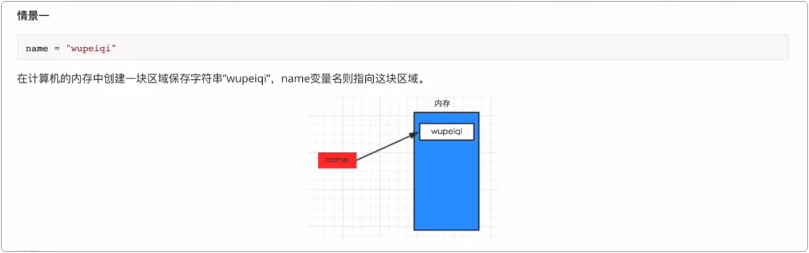

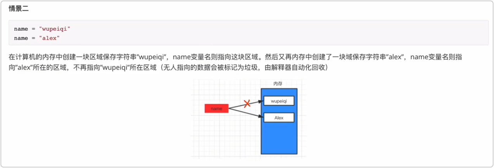

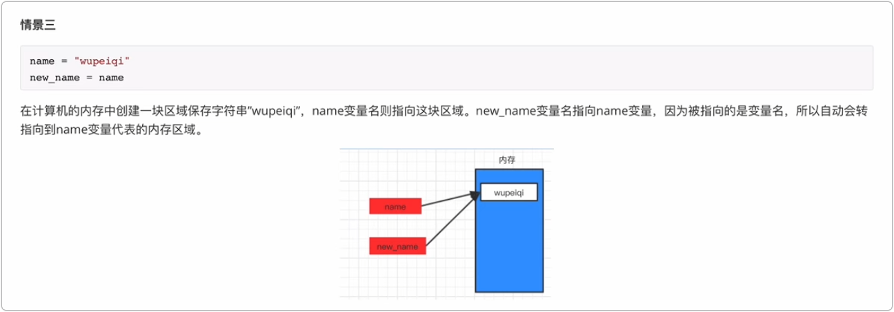

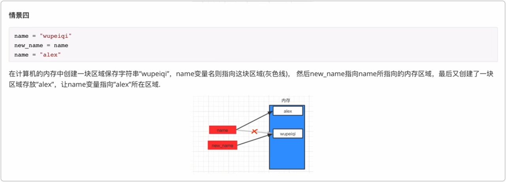

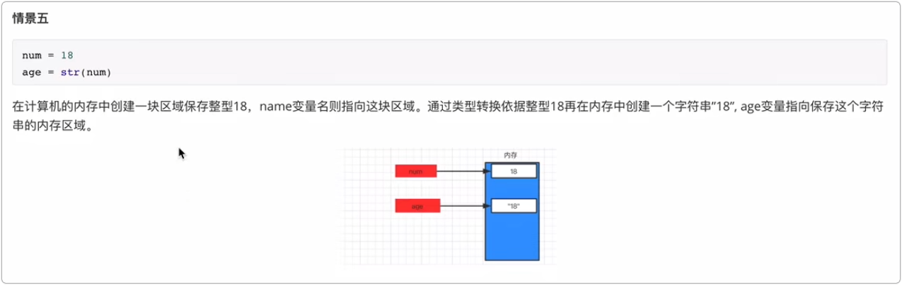

# 3. python 关键词及其语法

# 4. 编码

## 4.1 `ASCII` 编码

ASCII规定：用 1 个字节来表示字母和二进制的对应关系

`2 ** 8 = 256` 

## 4.2 `gb-2312`

1980 年

`gbk：1995年 -- 一个汉字 2 个字节`

在与二进制做对应关系时，有如下逻辑：

```python
- 单字节表示 用一个字节表示对应关系 2 ** 8 = 256
- 双字节表示 用两个字节表示对应关系 2 ** 16 = 65536
```

## 4.3 `unicode`

万国码 -- 为全球的每一个文字都分配一个码位（二进制表示）

- `Ucs2`

  ```
  用固定的 2 个字节来表示一个文字 -- 2 ** 16 = 65535
  ```

- `Ucs4`

  ```
  用固定的 4 个字节来表示一个文字 -- 2 ** 32 = 4294967296
  ```

`Ucs2 和 Ucs4` 都有缺点: 浪费存储空间

`unicode`的应用： 在文件存储和网络传输时，不会直接使用 `unicode`，而在内存中，很多语言会使用 `unicode`

## 4.4 `utf-8`

`utf-8` 是对`unicode`的压缩，用尽量少的二进制去与文字进行对应。

```
    unicode 码位范围     utf-8
    0000 ~ 007F         用 1 个字节表示
    0080 ~ 07FF         用 2 个字节表示
    0800 ~ FFFF         用 3 个字节表示
    10000 ~ 10FFFF      用 4 个字节表示
```

压缩的过程分两步

- 第一步：选择模板 根据`unicode`码位范围，选择模板（用几个字节去表示）
  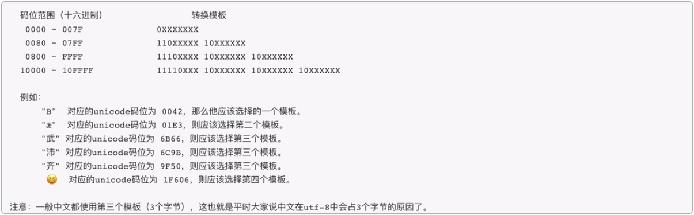

- 第二步：在模板中填入数据 先转换成二进制，再根据模板套数据
  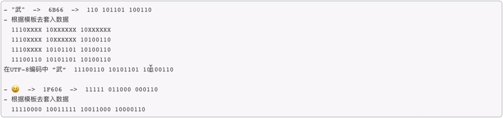

## 4.5 Python中的编码

```
字符串 str    "这是一个字符串"  -->  Unicode      -->  一般在内存
字节 byte     b"dsafdefs"    --> UTF-8 or GBK  --> 一般在网络或文件
```

```
v1 = "武"
v1.encode("utf-8")  # 将 unicode 转换成 utf-8
v1.encode("gbk")  # 将 unicode 转换成 gbk

不管是 utf-8 还是 gbk，在Python中统一称为字节，一般用于文件或网络
```

# 5. 数据类型

...

# 6. 列表

...

# 7. 集合

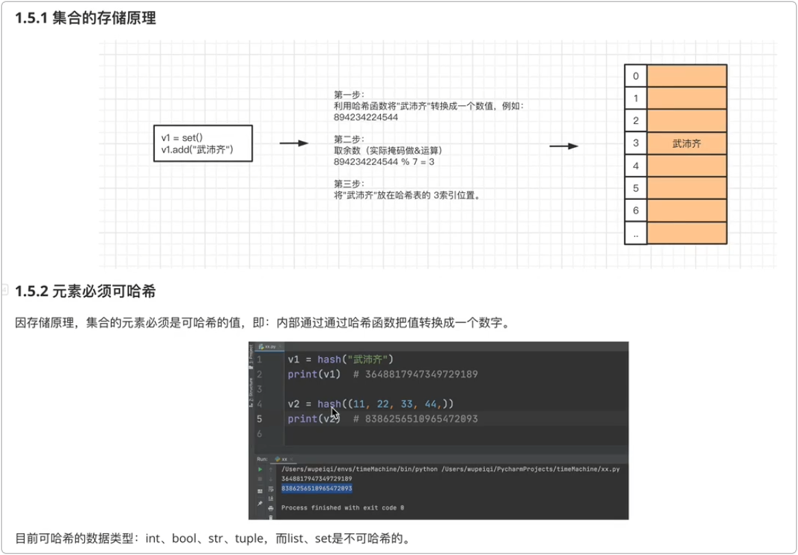

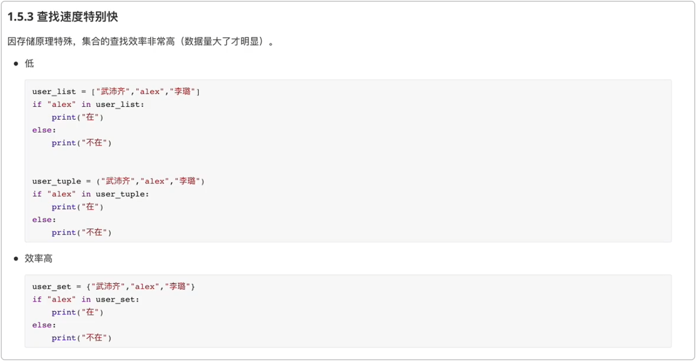


