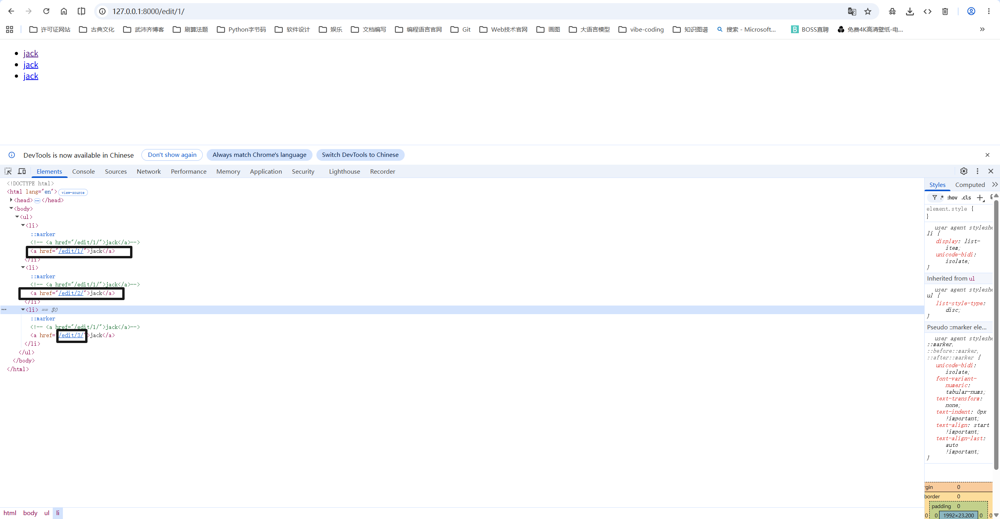
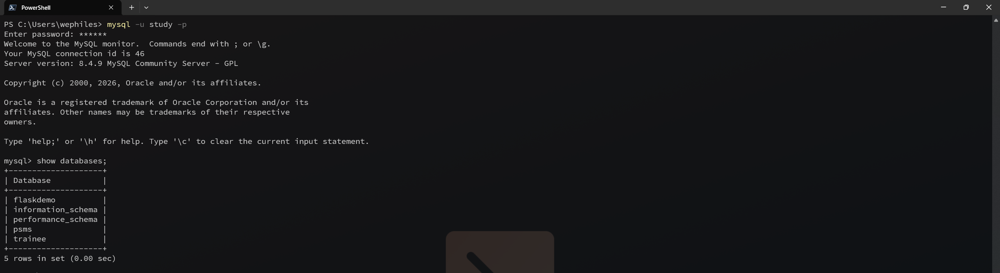
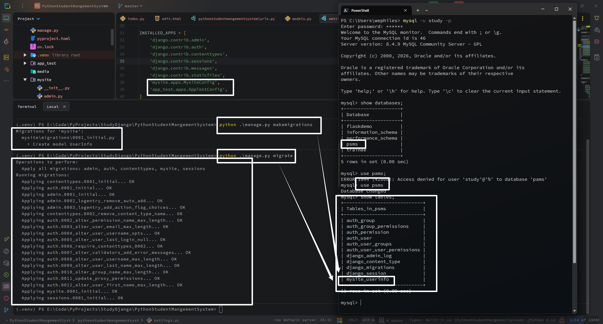
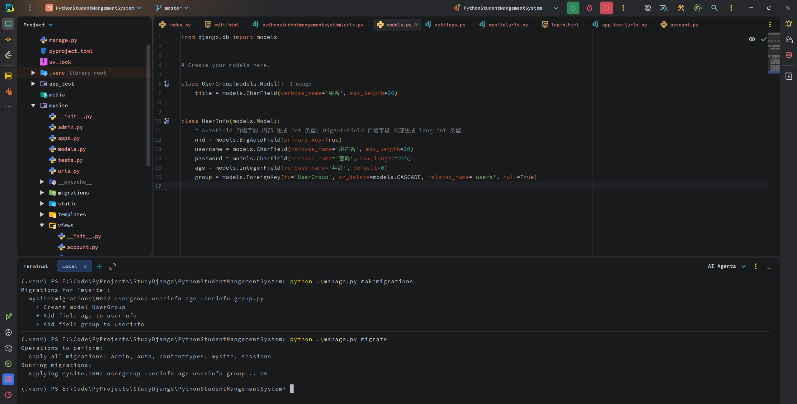
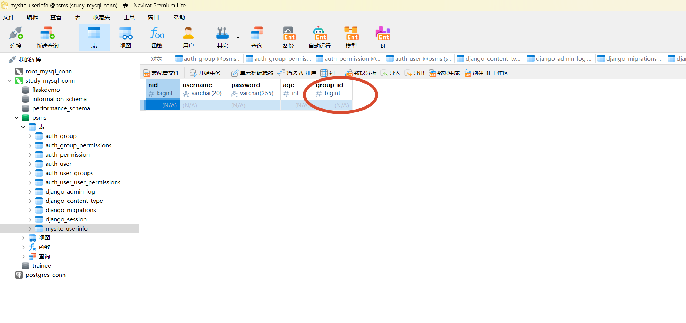
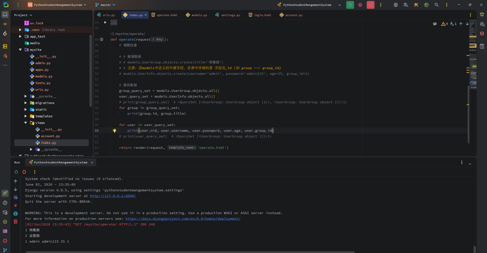

<h1 style="text-align: center;font-size: 40px; font-family: Source Code Pro;">day-06.Django</h1>

[TOC]

目前为止，我们的操作是非主流，没有用到强大的 `ORM`、`app`

`Django`

- 路由
- 视图
- 模板
- 原生 `ORM` (类 <--> 数据库表 ； 对象 <--> 数据行； `pymysql`连接数据库) -- 原生 `ORM` 也支持写 `SQL`

`Torando`

- 路由
- 视图
- 模板
- `pymysql` / `SQLAlchemy` 

`Flask`

- 路由
- 视图
- 模板（第三方组件）
- `pymysql` / `SQLAlchemy` 

今日概要：

- 路由系统
- 视图函数 `CBV` VS. `FBV` -- 留到下一天
- `ORM` 操作

# 1. 路由系统

## 1.1 新创建一个 `project` 并配置 `app`

```python
./project
	- mysite(app)
    	- admin.py --- Django自带后台管理相关配置
        - models.py --- 写类，Django根据类创建数据库表
        - tests.py --- 单元测试
        - views.py --- 视图函数 业务处理都在这儿
        - views\
        	- account.py
        	- user.py
```

补充：

```python
# 如果都写在一块会导致一个views里面很多函数和类 不好找 -- 全部分割到views文件夹下再将views.py删除即可
```

## 1.2 路由系统

```python
url --> 函数
```

```python
a. /index/ --> def index(request)
b. /add-user/(\w+)/(\w+)/ --> def add_user(request, a, b)
c. /add-user/(?P<a1>\w+)/(?P<a2>\w+)/ --> def add_user(request, a1, a2)
d. /add-user/(\w+)/(?P<a1>\w+)/ --> def add_user(request, *args, **kwargs)  ❌ 这种不行
```

路由：`add-userr/` 后面的斜杠 `/` 记得带上.

## 1.3  路由分发

两个`app`，分别为 `mysite`和`app_test`

主路由：

```
# 项目名称/urls.py

from django.contrib import admin
from django.urls import path, include

urlpatterns = [
    path('admin/', admin.site.urls),
    path('mysite/', include('mysite.urls')),  # 分发给 mysite 这个 app
    path('app_test/', include('app_test.urls')),  # 分发给 app_test 这个 app
]
```

子路由：

```python
# mysite/urls.py

from django.urls import path

from mysite.views import index

urlpatterns = [
    path('home/', index.home),
]
```

```python
# app_test.py

from django.urls import path

from mysite.views import index

urlpatterns = [
    path('home/', index.home),
]
```

## 1.4 给URL关系命名 - 给url取别名 -- 只有 Django里面有

```python
urlpatterns = [
    path('home/', index.home, name='home'),  # 以后通过 name 的值反找到 url
]
```

```python
def home(request):
    print(request.path_info)  # /mysite/home/
    print(reverse('home'))  # /mysite/home/
    return render(request, 'layout.html')
```

-----

----


```python
path('login/', index.login, name='login'),
```

```python
def login(request):
    print(request.POST.get('name'))
    print(request.POST.get('password'))
    return render(request, 'login.html')
```

```python
<!DOCTYPE html>
<html lang="en">
<head>
    <meta charset="UTF-8">
    <title>Login</title>
    <link rel="stylesheet" href="/static/css/bootstrap-5.3.8-dist/css/bootstrap.css">
    <link rel="stylesheet" href="/static/plugins/fontawesome-free-7.2.0-web/css/all.css">
</head>
<body>
<div class="container">
    <!-- {#<div class="card" style="width: 500px; margin: 0 auto;">#} -->
    <!-- 让 card 在 container 里面居中 上面的方式和下面的方式都可以  -->
    <div class="card mx-auto mt-5" style="width: 450px;">
        <div class="card-header">
            用户登录
        </div>
        <div class="card-body">
            <form action="" method="post" novalidate>
                <div class="mb-3">
                    <label for="exampleInputEmail1" class="form-label">用户名</label>
                    <input type="text" class="form-control" id="exampleInputEmail1" name="name" placeholder="用户名">
                </div>
                <div class="mb-3">
                    <label for="exampleInputPassword1" class="form-label">密码</label>
                    <input type="password" class="form-control" id="exampleInputPassword1" name="password"
                           placeholder="密码">
                </div>
                <div class="text-end">
                    <button type="submit" class="btn btn-primary">提 交</button>
                </div>
            </form>
        </div>
    </div>
</div>
</body>
</html>

```

----

----

```python
path('edit/<int:nid>/', index.edit, name='edit'),
```

```python
def edit(request, nid):
    a_li = [
        1, 2, 3
    ]
    return render(request, 'edit.html', {'a_li': a_li})
```

```python
<!DOCTYPE html>
<html lang="en">
<head>
    <meta charset="UTF-8">
    <title>Title</title>
</head>
<body>
<ul>
    
    <li>
        <!-- <a href="/edit/1/">jack</a>-->
        <a href="">jack</a>
    </li>
    
</ul>
</body>
</html>
```



## 1.4 路由之权限管理

假设我有很多的 url：

```python
path('index/a/', index.v_index, name='a1'),
path('index/b/dsdsas/dsada/dsadasd/dasdassd/dasasda', index.v_index, name='a2'),
path('index/b/dsas/dsdsaada/dsadasd/dasdassd/dasasda', index.v_index, name='a3'),
path('index/b/dsas/dsada/ddassadasd/dasdassd/dasasda', index.v_index, name='a4'),
path('index/b/dsas/dsada/dsadasd/dasdasassd/dasasda', index.v_index, name='a5'),
path('index/b/dsas/dsada/dsadasd/dasdassd/daassasda', index.v_index, name='a6'),
path('index/ccc/dsas/dsada/dsadasd/dasdassd/dasasda', index.v_index, name='a7'),
path('index/ddd/dsas/dsada/dsadasd/dasdassd/dasasda', index.v_index, name='a8'),
path('index/eee/dsas/dsada/dsadasd/dasdassd/dasasda', index.v_index, name='a9'),
```

每个用户都有不同的权限：

```python
用户A：
	path('index/a/', index.v_index, name='a1'),
    path('index/b/dsdsas/dsada/dsadasd/dasdassd/dasasda', index.v_index, name='a2'),
    path('index/b/dsas/dsdsaada/dsadasd/dasdassd/dasasda', index.v_index, name='a3'),
    
用户B：
	path('index/b/dsas/dsada/ddassadasd/dasdassd/dasasda', index.v_index, name='a4'),
    path('index/b/dsas/dsada/dsadasd/dasdasassd/dasasda', index.v_index, name='a5'),
    path('index/b/dsas/dsada/dsadasd/dasdassd/daassasda', index.v_index, name='a6'),
    path('index/ccc/dsas/dsada/dsadasd/dasdassd/dasasda', index.v_index, name='a7'),
    path('index/ddd/dsas/dsada/dsadasd/dasdassd/dasasda', index.v_index, name='a8'),
    path('index/eee/dsas/dsada/dsadasd/dasdassd/dasasda', index.v_index, name='a9'),
    
用户C:
    path('index/b/dsas/dsdsaada/dsadasd/dasdassd/dasasda', index.v_index, name='a3'),
    path('index/b/dsas/dsada/ddassadasd/dasdassd/dasasda', index.v_index, name='a4'),
    path('index/b/dsas/dsada/dsadasd/dasdasassd/dasasda', index.v_index, name='a5'),
    path('index/b/dsas/dsada/dsadasd/dasdassd/daassasda', index.v_index, name='a6'),
```

在存储的时候：

```python
用户A：
	index/a/
    index/b/dsdsas/dsada/dsadasd/dasdassd/dasasda
    index/b/dsas/dsdsaada/dsadasd/dasdassd/dasasda
    
用户B：
	index/b/dsas/dsada/ddassadasd/dasdassd/dasasda
    index/b/dsas/dsada/dsadasd/dasdasassd/dasasda
    index/b/dsas/dsada/dsadasd/dasdassd/daassasda
    index/ccc/dsas/dsada/dsadasd/dasdassd/dasasda
    index/ddd/dsas/dsada/dsadasd/dasdassd/dasasda
    index/eee/dsas/dsada/dsadasd/dasdassd/dasasda
    
用户C:
    index/b/dsas/dsdsaada/dsadasd/dasdassd/dasasda
    index/b/dsas/dsada/ddassadasd/dasdassd/dasasda
    index/b/dsas/dsada/dsadasd/dasdasassd/dasasda
    index/b/dsas/dsada/dsadasd/dasdassd/daassasda
```

如果此时 用户A 登录我的网站：

```python
def index(request):
    url_list = [
        'index/a/',
        'index/b/dsdsas/dsada/dsadasd/dasdassd/dasasda',
        'index/b/dsas/dsdsaada/dsadasd/dasdassd/dasasda',
    ]
    return render(request, ..., {'url_list': url_list})

-------------------------------------------------------------

<ul>
	
    	<li>
        	<a href="{{url}}">巴拉巴拉</a>
        </li>
    
</ul>
```

这样：存 url关系的时候，url看起来有点长

可以改成这样：

```python
用户A：
	a1
    a2
    a3
用户B：
	a4
    ...
    
用户C:
    ...
```


```python
def index(request):
    alia_list = [
        'a1', 
        'a2', 
        'a3'
    ]
    return render(request, ..., {'alia_list': alia_list})

-------------------------------------------------------------

<ul>
	
    	<li>
        	<a href="">巴拉巴拉</a>
        </li>
    
</ul>
```

也可以这样写：

```python
def index(request):
    alia_list = [
        'a1', 
        'a2', 
        'a3'
    ]
    
    url_list = []
    for alia in alia_list:
        url_list.append(reverse(alia))
    return render(request, ..., {'url_list': url_list})

-------------------------------------------------------------

<ul>
	
    	<li>
        	<a href="{{url}}">巴拉巴拉</a>
        </li>
    
</ul>
```

# 2. `ORM`

`Http` 请求中：

```python
url --> 视图 (模板+数据库) --> 返回给浏览器 --> 浏览器渲染
```

`ORM两个功能`

- 操作数据表
  - 创建表
  - 修改表
  - 删除表
- 操作数据行
  - 增
  - 删
  - 改
  - 查

## 2.1. 创建数据库、数据表、修改数据表


`Django ORM` 利用 `pymysql` 等第三方工具去连接数据库；

```python
Django 如果要连接 MySQL --  Django 默认使用 MySQLDB -- 但是 Python3 不支持 -- 需要我们自己指定默认连接MySQL的工具：pymysql
*****************************************************************************************************************
Django 默认连接 sqlite3 这个数据库
DATABASES = {
    'default': {
        'ENGINE': 'django.db.backends.sqlite3',
        'NAME': BASE_DIR / 'db.sqlite3',
    }
}
*****************************************************************************************************************
修改 Django 连接的数据库
# settings.py

DATABASES = {
    'default': {
        'ENGINE': 'django.db.backends.MySQL',
        'NAME': 'psms',
        'USER': 'study',
        'PASSWORD': '123456',
        'HOST': '127.0.0.1',
        'PORT': '3306',
    },
    # 额外配置（强烈建议添加）
    'OPTIONS': {
        'charset': 'utf8mb4',  # 指定字符集为 utf8mb4，支持 emoji 表情，避免乱码
        # 'init_command': "SET sql_mode='STRICT_TRANS_TABLES'", # 可选：设置 SQL 模式
    }
}

与此同时还要修改操作MySQL数据库的工具为pymysql
# 项目名/__init__.py

import pymysql

# 将 Django 默认的 MySQLDB 改成 pymysql

pymysql.install_as_MySQLdb()
```

 需要自己创建数据库

我创建的数据库为 `psms`



接下来就是使用ORM了：

```python
# mysite/models.py

from django.db import models


class UserInfo(models.Model):  # 写一个类就生成一张表 这里经过migrate后生成了 app名_userinfo 表
    # AutoField 自增字段 内部 生成 int 类型; BigAutoField 自增字段 内部生成 long int 类型
    nid = models.BigAutoField(primary_key=True)
    username = models.CharField(verbose_name='用户名', max_length=20)
    password = models.CharField(verbose_name='密码', max_length=255)
```

然后一定要将 app 都注册了：

```python
# settings.py

INSTALLED_APPS = [
    'django.contrib.admin',
    'django.contrib.auth',
    'django.contrib.contenttypes',
    'django.contrib.sessions',
    'django.contrib.messages',
    'django.contrib.staticfiles',
    'mysite.apps.MysiteConfig',  # 这是我注册的 app
    'app_test.apps.AppTestConfig',  # 这是另外一个我注册的 app
]
```

创建数据库表 -- 执行下面两个命令后数据库中的表就会自动生成！

注意：`Django`会默认生成主键，即使我们不手写 `nid = models.BigAutoField(primary_key=True)` 也会生成。

```python
python manage.py makemigrations
python manage.py migrate
```



- 修改表：直接在 models 定义的类里面修改(增加、删除等) 然后执行，增加列之前如果数据库里面已经有的话可能会有问题，在 `makemigrations` 的时候会提问，可以将新增列的null参数设为True或者给其设置默认值来解决。
  ```
  python manage.py makemigrations
  python manage.py migrate
  ```

连表：

```python
from django.db import models


# Create your models here.

class UserGroup(models.Model):
    title = models.CharField(verbose_name='组名', max_length=20)


class UserInfo(models.Model):
    # AutoField 自增字段 内部 生成 int 类型; BigAutoField 自增字段 内部生成 long int 类型
    nid = models.BigAutoField(primary_key=True)
    username = models.CharField(verbose_name='用户名', max_length=20)
    password = models.CharField(verbose_name='密码', max_length=255)
    age = models.IntegerField(verbose_name='年龄', default=0)
    group = models.ForeignKey(to='UserGroup', on_delete=models.CASCADE, related_name='users', null=True)
```





## 2.2 操作数据行

```python
def operate(request):
    # 增删改查

    # # 新增数据
    # # models.UserGroup.objects.create(title='销售部')
    # # 注意：在models中定义的外键字段，在表中存储的是 字段名_id (如 group --> group_id)
    # models.UserInfo.objects.create(username='admin', password='admin123', age=25, group_id=1)

    # 查找数据
    group_query_set = models.UserGroup.objects.all()
    user_query_set = models.UserInfo.objects.all()
    # print(group_query_set)  # <QuerySet [<UserGroup: UserGroup object (1)>, <UserGroup: UserGroup object (2)>]>
    for group in group_query_set:
        print(group.id, group.title)

    for user in user_query_set:
        print(user.nid, user.username, user.password, user.age, user.group_id)
    # print(user_query_set)  # <QuerySet [<UserGroup: UserGroup object (1)>]>

    return render(request, 'operate.html')
```

输出结果：

```python
1 销售部
2 运营部
1 admin admin123 25 1
```



```python
def operate(request):
    # 增删改查

    # # 新增数据
    # # models.UserGroup.objects.create(title='销售部')
    # # 注意：在models中定义的外键字段，在表中存储的是 字段名_id (如 group --> group_id)
    # models.UserInfo.objects.create(username='admin', password='admin123', age=25, group_id=1)

    # # 查找数据
    # # group_query_set 是一个 QuerySet 对象 内部是一个对象列表
    # group_query_set = models.UserGroup.objects.all()
    # user_query_set = models.UserInfo.objects.all()
    # # print(group_query_set)  # <QuerySet [<UserGroup: UserGroup object (1)>, <UserGroup: UserGroup object (2)>]>
    # for group in group_query_set:
    #     print(group.id, group.title)
    #
    # for user in user_query_set:
    #     print(user.nid, user.username, user.password, user.age, user.group_id)
    # # print(user_query_set)  # <QuerySet [<UserGroup: UserGroup object (1)>]>

    # ********************************** 查找数据 -- 加条件 **********************************
    # ================================== 相等 且 ============================================
    # group_query_set = models.UserGroup.objects.filter(id=1)
    # print(group_query_set)  # <QuerySet [<UserGroup: UserGroup object (1)>]>
    # group_query_set_1 = models.UserGroup.objects.filter(id=1).first()
    # print(group_query_set_1)  # UserGroup object (1)
    #
    # get_data = models.UserGroup.objects.filter(id=1, title="销售部")  # 找 id=1 并且 title=销售部的行
    # print(get_data)  # <QuerySet [<UserGroup: UserGroup object (1)>]>

    # ================================== 双下划线 =============================================
    # # 大于 小于
    # get_data = models.UserGroup.objects.filter(id__gt=1)
    # print(get_data)  # <QuerySet [<UserGroup: UserGroup object (2)>]>
    # get_data = models.UserGroup.objects.filter(id__lt=1)
    # print(get_data)  # <QuerySet []>

    # # 删除数据
    # models.UserGroup.objects.filter(id=2).delete()

    # 更新数据
    models.UserGroup.objects.filter(id=1).update(title='公关部')

    v = models.UserGroup.objects.filter(id=1).first()
    print(v.title)  # 公关部

    return render(request, 'operate.html')
```

单表：增删改查


