<h1 style="text-align: center; font-family: '楷体';">Flask 框架</h1>

`Flask` 是 `python`的一个`web`框架，可以基于它开发常见的`web`界面和`API`接口。

在以后的开发中应用场景：

```python
- 开发 API：给其他人提供API，提供服务，例：提供核心算法 （本节）
- 开发网站：给其他人提供 WEB网站，在平台上进行下单等操作 （下节）
```

# day-01. Flask

今日目标：

- 为调用者提供服务（不耗时）
- 为调用者提供服务（耗时）

## 1.1 不耗时版

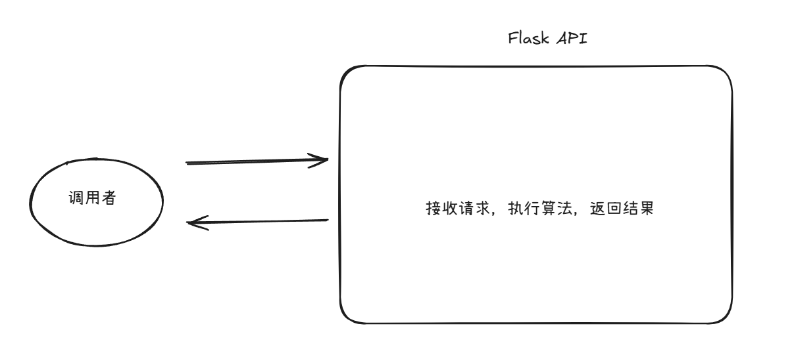

### 1.1.1 python 虚拟环境

我们安装的python解释器:

```python
C:\Program Files\Python314 ···· Python安装目录
	- python.exe ·············· Python解释器
	- Lib\ ···················· Python内置模块
    	- os.py
    	- random.py
        - queue.py
        - pathlib\
        - json\
        - logging\
        - ...
        - site-packages\ ······ 安装的第三方模块
        	- pip\
            - requests\
            - ...
    - Scripts\
    	- pip.exe
    	- pip3.14.exe
        - pip3.exe
```

我的虚拟环境：

```python
E:\Code\PyProjects\FlaskDemo\.venv
	- Scripts\
    	- python.exe
        - ...
    - Lib\ ························· 虚拟环境的Lib中没有内置模块了 -- 如果要用那么就要去系统解释器路径里面去找
    	- site-packages\ ··········· 我们在虚拟环境中安装的第三方模块 -- 和系统解释器里面的第三方模块没有任何关系
        	- flask\
        	- requests\ 
    		- ...
```

### 1.1.2 快速写一个网站

```python
from flask import Flask

app = Flask(__name__)  # 创建了一个Flask对象


# /index --> 执行 index 函数，在浏览器返回index的返回值
@app.route('/index')
def index():
    return 'index'


@app.route('/home')
def home():
    return 'home'


if __name__ == '__main__':
    app.run()
```

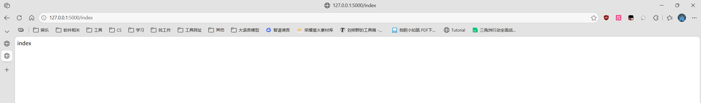


### 1.1.3 发送 POST 请求

```python
# Flask 服务端
from flask import Flask, request

app = Flask(__name__)  # 创建了一个Flask对象


# http://127.0.0.1:5000/index                         --> GET 执行 index 函数，在浏览器返回index的返回值
# http://127.0.0.1:5000/index?name=aaa&password=123   --> GET
# http://127.0.0.1:5000/index                         --> POST 会在请求体中带着数据

@app.route('/index', methods=['GET', 'POST'])
def index():
    # 获取 GET 请求的参数
    name = request.args.get('name')
    pwd = request.args.get('password')

    # 获取 POST 请求的参数
    title = request.form.get('title')
    info = request.form.get('info')
    print(name, pwd, title, info)
    return f'index page: name={name}, pwd={pwd}, title={title}, info={info}'


@app.route('/home')
def home():
    return 'home'


if __name__ == '__main__':
    app.run()
```

```python
# python  客户端 -- 用 Python发请求
import requests

res = requests.post(
    'http://127.0.0.1:5000/index?name=aaa&password=123',
    data={'title': '测试POST请求', 'info': '这是一个测试'}
)
print(res.text)
```

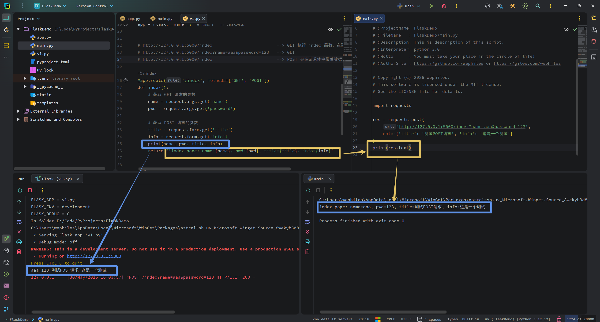

用 postman

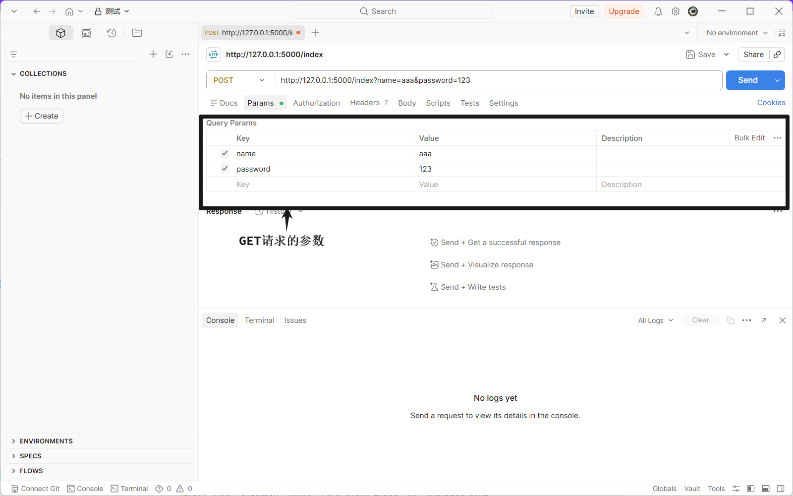

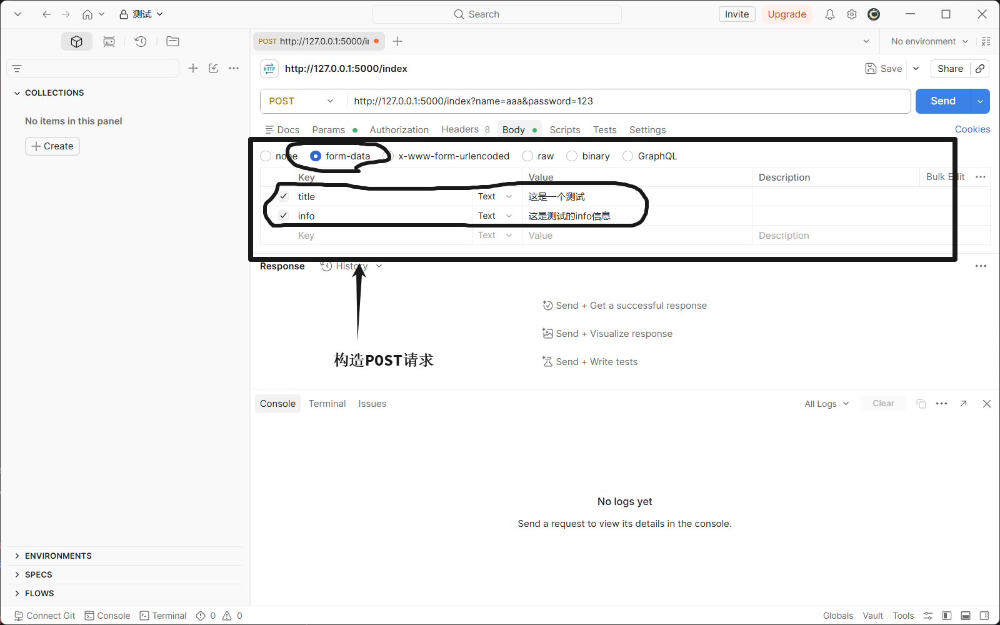

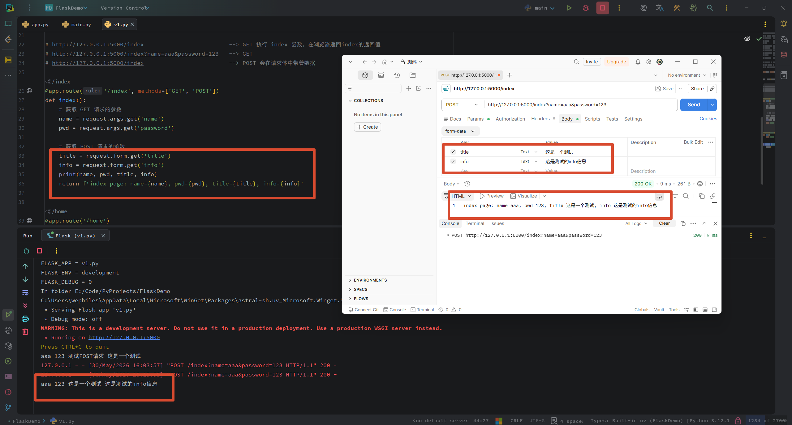

---

如果请求体是 json 格式：

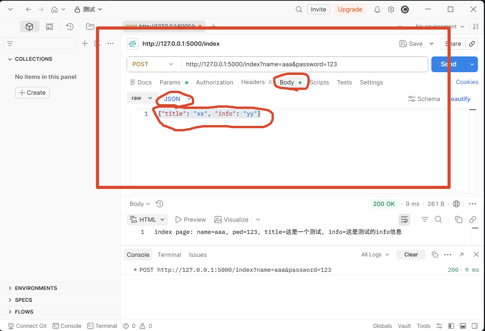

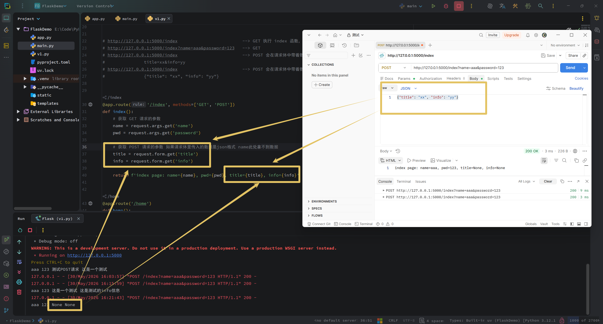

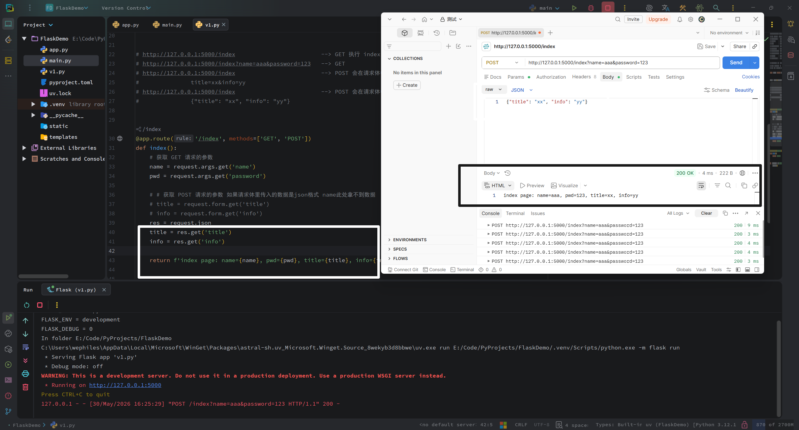

---

```python
@app.route('/index', methods=['GET', 'POST'])
def index():
    # # 获取 GET 请求的参数
    # name = request.args.get('name')
    # pwd = request.args.get('password')
    #
    # # # 获取 POST 请求的参数 如果请求体里传入的数据是json格式 name此处拿不到数据
    # # title = request.form.get('title')
    # # info = request.form.get('info')
    # res = request.json
    # title = res.get('title')
    # info = res.get('info')

    # 调用核心算法 （比如生成签名）

    # # 调用算法成功
    # return json.dumps({'status': True, 'data': 'dsojkjfosdjoufcsdsafessdfgsdgfvs'})
    #
    # # # 调用算法失败
    # # return json.dumps({'status': False, 'data': 'xxxxxx错误'})

    return jsonify({"status": True, "data": "dsojkjfosdjoufcsdsafessdfgsdgfvs"})
```

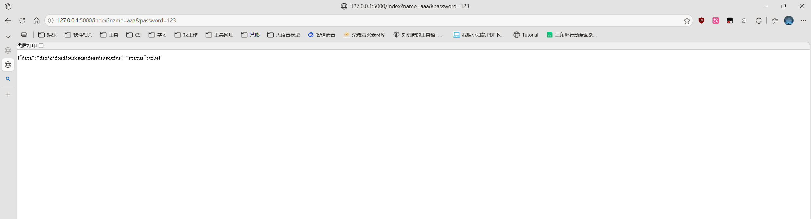

### 1.1.4 小案例 -- 根据参数返回sign值 -- 无校验版

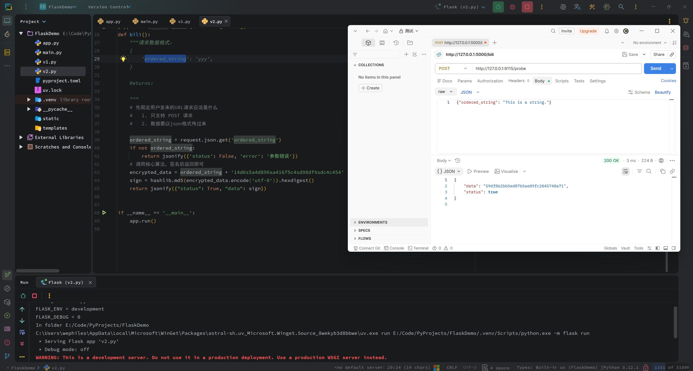

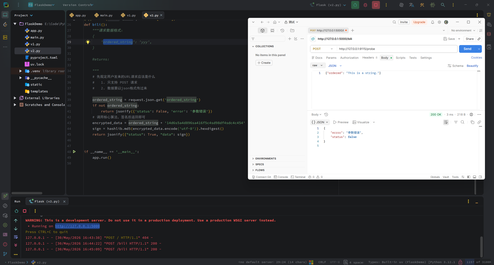

假如我是一个调用者，我要调用服务端的API：

```python
# 服务端

import hashlib

from flask import Flask, request, jsonify

app = Flask(__name__)  # 创建了一个Flask对象


@app.route('/bili', methods=['POST'])
def bili():
    """请求数据格式：
    {
        'ordered_string': 'yyy',
    }

    Returns:

    """
    # 先规定用户发来的URL请求应该是什么
    #   1. 只支持 POST 请求
    #   2. 数据要以 json 格式传过来

    ordered_string = request.json.get('ordered_string')
    if not ordered_string:
        return jsonify({'status': False, 'error': '参数错误'})
    # 调用核心算法，签名后返回即可
    encrypted_data = ordered_string + '14d6s5a4d896sa416f5c4sd98df4sdc4c454'
    sign = hashlib.md5(encrypted_data.encode('utf-8')).hexdigest()
    return jsonify({"status": True, "data": sign})


if __name__ == '__main__':
    app.run()
```


```python
# 客户端

import requests

res = requests.post(
    'http://127.0.0.1:5000/bili',
    json={'ordered_string': 'This is a string.'}
)
print(res.json())
```

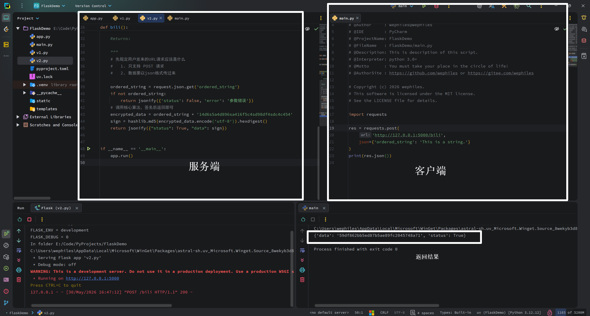

### 1.1.5 总结

直接提供 `API`，接收用户传来的参数，根据请求执行自己的核心算法（本例中是实现签名），直接返回给用户结果。

- 安装 `Flask`
- 编写路由和视图
- 接收用户请求 `GET/POST` 传入的数据
- 返回 `json` 数据

## 1.2 基于文件授权

```python
0bf22b8b-bf8b-4e11-bc14-2ce90526be95,李阳
bc3211d5-2e17-42e6-bde9-bc0e81edec8f,张三
219201e8-ddef-4397-8319-6951ff40c7be,李四
```

```python
import hashlib

from flask import Flask, request, jsonify

app = Flask(__name__)  # 创建了一个Flask对象


def get_token_dict():
    info_dict = {}
    with open('db.txt', 'r', encoding='utf-8') as fp:
        for line in fp:
            strip_line = line.strip()
            token_no_split, name_no_split = strip_line.split(',')
            token = token_no_split.strip()
            name = name_no_split.strip()
            info_dict[token] = name
    return info_dict


@app.route('/bili', methods=['GET', 'POST'])
def bili():
    """请求数据格式：
    {
        'ordered_string': 'yyy',
    }
    并且请求 URL 中需要携带 token
        /bili?token=balabala
    Returns:

    """

    token = request.args.get('token')
    if not token:
        return jsonify({'status': False, 'error': '认证失败'})

    # 校验 token 合法性
    user_dict = get_token_dict()
    if token in user_dict:
        ordered_string = request.json.get('ordered_string')
        if not ordered_string:
            return jsonify({'status': False, 'error': '参数错误'})
        # 调用核心算法，签名后返回即可
        encrypted_data = ordered_string + '14d6s5a4d896sa416f5c4sd98df4sdc4c454'
        sign = hashlib.md5(encrypted_data.encode('utf-8')).hexdigest()
        return jsonify({"status": True, "data": sign})
    else:
        return jsonify({'status': False, 'error': '认证失败'})


if __name__ == '__main__':
    app.run()
```

```python
import requests

res = requests.post(
    'http://127.0.0.1:5000/bili?token=balabalabala',
    json={'ordered_string': 'This is a string.'}
)
print(res.json())
```


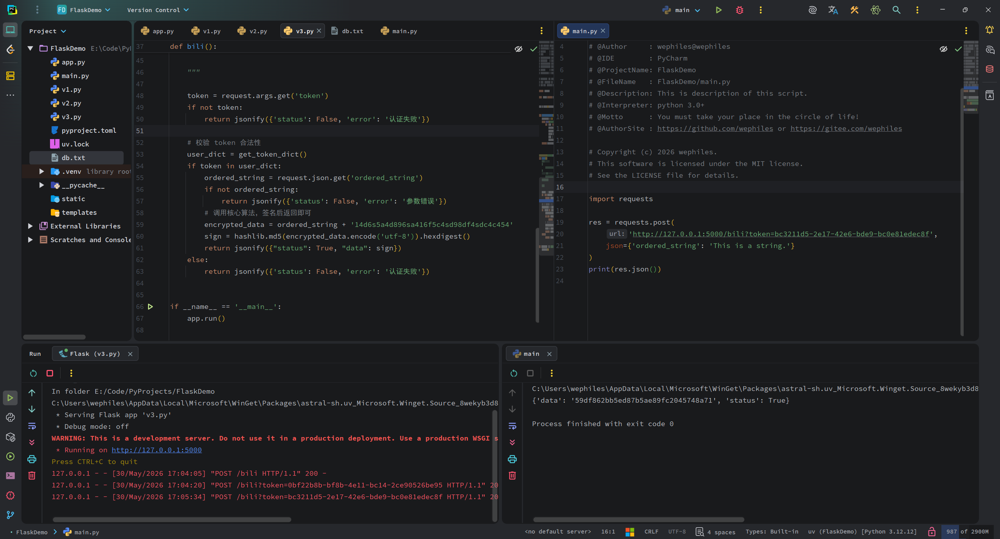

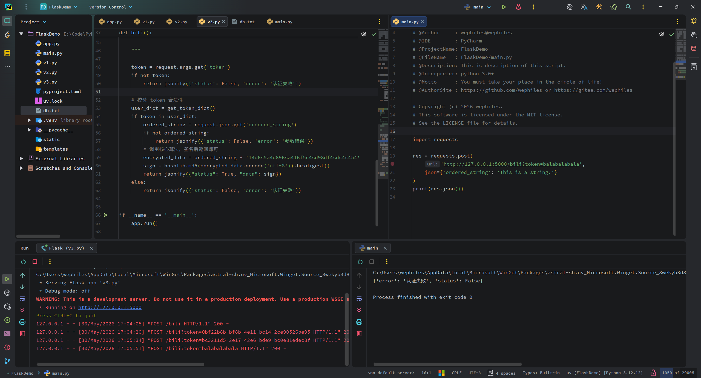

## 1.3 基于数据库授权

```python
import hashlib

import pymysql
from flask import Flask, request, jsonify

app = Flask(__name__)  # 创建了一个Flask对象


@app.route('/bili', methods=['GET', 'POST'])
def bili():
    """请求数据格式：
    {
        'ordered_string': 'yyy',
    }
    并且请求 URL 中需要携带 token
        /bili?token=balabala
    Returns:

    """

    token = request.args.get('token')
    if not token:
        return jsonify({'status': False, 'error': '认证失败'})

    # 校验 token 合法性
    conn = pymysql.connect(
        host='localhost',
        port=3306,
        user='study',
        password='123456',
        db='flaskdemo',
        charset='utf8'
    )
    cursor = conn.cursor(cursor=pymysql.cursors.DictCursor)
    cursor.execute('select * from user where token = %s', (token,))
    token_database = cursor.fetchone()
    cursor.close()
    conn.close()
    if token_database:
        ordered_string = request.json.get('ordered_string')
        if not ordered_string:
            return jsonify({'status': False, 'error': '参数错误'})
        # 调用核心算法，签名后返回即可
        encrypted_data = ordered_string + '14d6s5a4d896sa416f5c4sd98df4sdc4c454'
        sign = hashlib.md5(encrypted_data.encode('utf-8')).hexdigest()
        return jsonify({"status": True, "data": sign})
    else:
        return jsonify({'status': False, 'error': '认证失败'})


if __name__ == '__main__':
    app.run()
```

```python
import requests

res = requests.post(
    'http://127.0.0.1:5000/bili?token=这是token',
    json={'ordered_string': 'This is a string.'}
)
print(res.json())
```

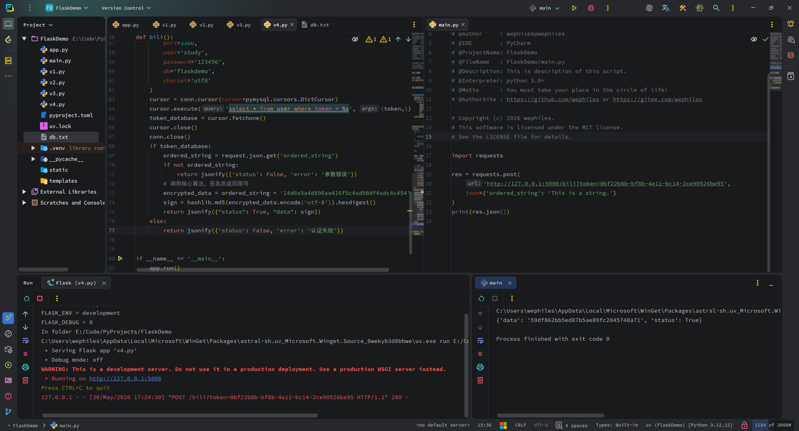

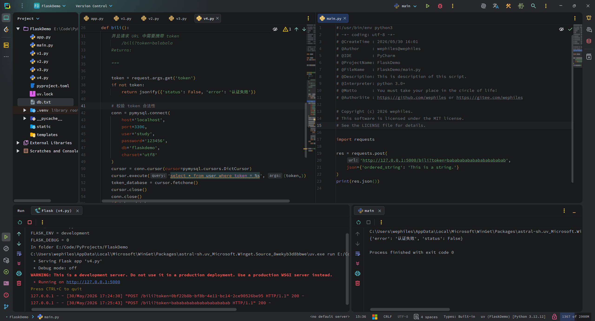

## 1.4 耗时版

### 1.4.1 补充不耗时 -- MySQL连接池

```python
pip install dbutils
```

```python
# settings.py

MYSQL_CONN_PARAMS = {
    'host': 'localhost',
    'port': 3306,
    'user': 'study',
    'password': '123456',
    'db': 'flaskdemo',
    'charset': 'utf8',
}
```

```python
import hashlib

import pymysql
from dbutils.pooled_db import PooledDB
from flask import Flask, request, jsonify

import settings

app = Flask(__name__)  # 创建了一个Flask对象

# 数据库连接池
POOL = PooledDB(
    creator=pymysql,  # 哪个模块连接数据库
    maxconnections=10,  # 连接池最大允许多少个连接，0和None表示不限制连接个数
    mincached=2,  # 初始化时，连接池中至少创建的空闲的连接，0表示不创建
    maxcached=3,  # 连接池中最多闲置的连接个数 0和 None不限制个数
    blocking=True,  # 连接池中如果没有可用链接，是否阻塞等待，True: 阻塞等待，False：不等待 然后报错
    setsession=[],  # 开始会话前执行的会话列表，如 ['select * from t1;']
    ping=0,
    **settings.MYSQL_CONN_PARAMS,
)


def find_one(sql, params):
    # conn = pymysql.connect(
    #     host='localhost',
    #     port=3306,
    #     user='study',
    #     password='123456',
    #     db='flaskdemo',
    #     charset='utf8'
    # )
    conn = POOL.connection()
    cursor = conn.cursor(cursor=pymysql.cursors.DictCursor)
    cursor.execute(sql, params)
    res = cursor.fetchone()
    cursor.close()
    conn.close()  # 此处现在不是关闭连接 而是将此连接交还给连接池
    return res


@app.route('/bili', methods=['GET', 'POST'])
def bili():
    """请求数据格式：
    {
        'ordered_string': 'yyy',
    }
    并且请求 URL 中需要携带 token
        /bili?token=balabala
    Returns:

    """

    token = request.args.get('token')
    if not token:
        return jsonify({'status': False, 'error': '认证失败'})

    # 校验 token 合法性
    token_database = find_one('select * from user where token=%s', (token,))
    if token_database:
        ordered_string = request.json.get('ordered_string')
        if not ordered_string:
            return jsonify({'status': False, 'error': '参数错误'})
        # 调用核心算法，签名后返回即可
        encrypted_data = ordered_string + '14d6s5a4d896sa416f5c4sd98df4sdc4c454'
        sign = hashlib.md5(encrypted_data.encode('utf-8')).hexdigest()
        return jsonify({"status": True, "data": sign})
    else:
        return jsonify({'status': False, 'error': '认证失败'})


if __name__ == '__main__':
    app.run()
```

```python
import requests

res = requests.post(
    'http://127.0.0.1:5000/bili?token=0bf22b8b-bf8b-4e11-bc14-2ce90526be95',
    json={'ordered_string': 'This is a string.'}
)
print(res.json())
```

### 1.4.2 耗时版

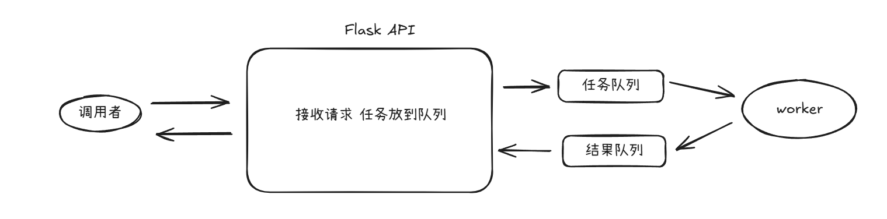

- 调用者：携带参数发送请求
- `API`：接收请求并为请求生成一个`任务ID`，接下来：返回给调用者+放到任务队列
- `worker`：等待`redis`队列（`List`），一旦接到任务，就执行并将结果返回到结果队列（Hash）
- 调用者：等待n秒后，携带任务ID再次发起请求，获取结果
- `API`：接收任务ID，根据ID去结果队列（`Hash`）中获取

补充：关于`redis`：

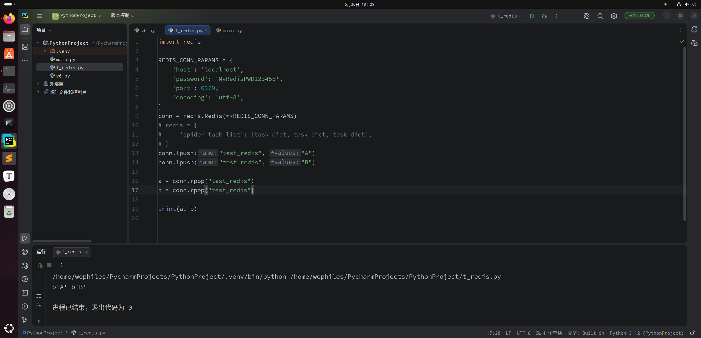

```python
import uuid
import json

import redis
from flask import Flask, request, jsonify

app = Flask(__name__)  # 创建了一个Flask对象


@app.route('/task', methods=['GET', 'POST'])
def task():
    """为简化，不鉴权了
    请求数据格式：
    {
        'ordered_string': 'yyy',
    }
    并且请求 URL 中需要携带 token
        /bili?token=balabala
    Returns:

    """
    ordered_string = request.json.get('ordered_string')
    if not ordered_string:
        return jsonify({'status': False, 'error': '参数错误'})

    # 1. 生成任务ID
    tid = uuid.uuid4()
    print(tid)
    # 2. 将任务放到 redis 队列中 -- 因为 redis 对于Windows的支持不怎么好 直接用 ubuntu
    task_dict = {
        'tid': str(tid),
        'data': ordered_string,
    }
    REDIS_CONN_PARAMS = {
        'host': 'localhost',
        'password': 'MyRedisPWD123456',
        'port': 6379,
        'encoding': 'utf-8',
    }
    conn = redis.Redis(**REDIS_CONN_PARAMS)
    # redis = {
    #     'spider_task_list': [task_dict, task_dict, task_dict],
    # }
    conn.lpush("spider_task_list", json.dumps(task_dict))

    # 3. 给用户返回
    return jsonify({"status": True, "data": tid, 'message': '正在处理中, 预计一分钟完成'})

    # # 调用核心算法，签名后返回即可
    # encrypted_data = ordered_string + '14d6s5a4d896sa416f5c4sd98df4sdc4c454'
    # sign = hashlib.md5(encrypted_data.encode('utf-8')).hexdigest()


if __name__ == '__main__':
    app.run()
```

```python
import requests

res = requests.post(
    'http://127.0.0.1:5000/task',
    json={'ordered_string': 'This is a string.'}
)
print(res.json())
```

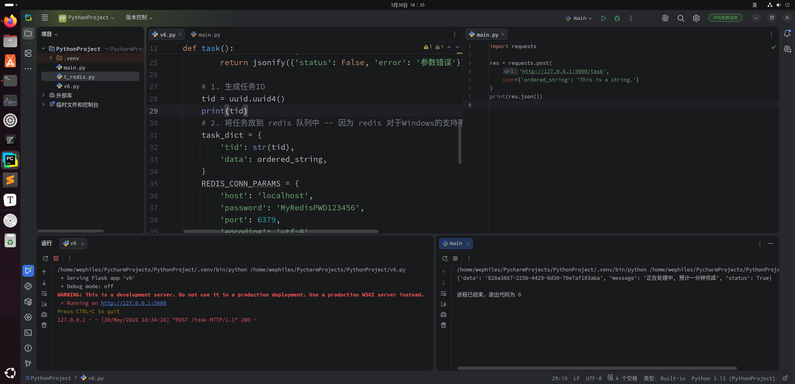

```python
# flask 服务端

import uuid
import json

import redis
from flask import Flask, request, jsonify

app = Flask(__name__)  # 创建了一个Flask对象


@app.route('/task', methods=['GET', 'POST'])
def task():
    """为简化，不鉴权了
    请求数据格式：
    {
        'ordered_string': 'yyy',
    }
    并且请求 URL 中需要携带 token
        /bili?token=balabala
    Returns:

    """
    ordered_string = request.json.get('ordered_string')
    if not ordered_string:
        return jsonify({'status': False, 'error': '参数错误'})

    # 1. 生成任务ID
    tid = uuid.uuid4()
    print(tid)
    # 2. 将任务放到 redis 队列中 -- 因为 redis 对于Windows的支持不怎么好 直接用 ubuntu
    task_dict = {
        'tid': str(tid),
        'data': ordered_string,
    }
    REDIS_CONN_PARAMS = {
        'host': 'localhost',
        'password': 'MyRedisPWD123456',
        'port': 6379,
        'encoding': 'utf-8',
    }
    conn = redis.Redis(**REDIS_CONN_PARAMS)
    # redis = {
    #     'spider_task_list': [task_dict, task_dict, task_dict],
    # }
    conn.lpush("spider_task_list", json.dumps(task_dict))

    # 3. 给用户返回
    return jsonify({"status": True, "data": tid, 'message': '正在处理中, 预计一分钟完成'})


@app.route('/result', methods=['GET', ])
def result():
    tid = request.args.get('tid')
    if not tid:
        return jsonify({'status': False, 'error': '参数错误'})
    REDIS_CONN_PARAMS = {
        'host': 'localhost',
        'password': 'MyRedisPWD123456',
        'port': 6379,
        'encoding': 'utf-8',
    }
    conn = redis.Redis(**REDIS_CONN_PARAMS)
    sign = conn.hget('spider_result_dict', tid)
    if not sign:
        return jsonify({'status': True, 'data': '', 'message': '未完成，清继续等待.'})

    sign = sign.decode('utf-8')
    # 拿到之后删除即可
    conn.hdel('spider_result_dict', tid)
    return jsonify({'status': True, 'data': sign})


if __name__ == '__main__':
    app.run()
```

```python
# worker

"""
去对列中获取任务，执行并写入到结果队列
"""

import time
import redis
import json
import hashlib

REDIS_CONN_PARAMS = {
    'host': 'localhost',
    'password': 'MyRedisPWD123456',
    'port': 6379,
    'encoding': 'utf-8',
}
conn = redis.Redis(**REDIS_CONN_PARAMS)


def get_task():
    # redis = {
    #     'spider_task_list': [task_dict, task_dict, task_dict],
    # }

    # brpop 是如果redis队列中没有数据那么会一直阻塞
    # timeout 是超时时间  如果超过 timeout 时间直接结束
    data = conn.brpop("spider_task_list", timeout=10)
    if not data:
        return None
    return data[1].decode('utf-8')


def run():
    while True:
        # 1. 去 redis 中获取task
        task_dict = get_task()
        if not task_dict:
            continue

        print(task_dict)

        # 2. 获取到了任务字典 -- 字符串类型 执行耗时操作
        time.sleep(5)
        task_dict = json.loads(task_dict)  # {'tid': str(tid), 'data': ordered_string}
        ordered_string = task_dict.get('data')
        tid = task_dict.get('tid')
        # 调用核心算法，签名后返回即可
        encrypted_data = ordered_string + '14d6s5a4d896sa416f5c4sd98df4sdc4c454'
        sign = hashlib.md5(encrypted_data.encode('utf-8')).hexdigest()

        # 写入到队列中 （redis的hash) -- 结果队列
        # redis = {'spider_result_dict': {'tid': 'abcekjfssjfeiokjsdkof'}}
        conn.hset('spider_result_dict', tid, sign)


run()
```

```python
# 客户端

import requests

# 第一次请求 因为比较耗时 所以要先等一下
res = requests.post(
    'http://127.0.0.1:5000/task',
    json={'ordered_string': '当前测试字符串'}
)

tid = res.json().get('data')

res = requests.get(
    f'http://127.0.0.1:5000/result?tid={tid}',
)
print('second:', res.json())
```

```python
# 测试 redis

import redis

REDIS_CONN_PARAMS = {
    'host': 'localhost',
    'password': 'MyRedisPWD123456',
    'port': 6379,
    'encoding': 'utf-8',
}
conn = redis.Redis(**REDIS_CONN_PARAMS)
# redis = {
#     'spider_task_list': [task_dict, task_dict, task_dict],
# }
conn.lpush("test_redis", "A")
# conn.lpush("test_redis", "B")

a = conn.brpop("test_redis", timeout=10)

print(a)
```

----

优化：将redis连接放到全局

连接redis也有连接池

```python
REDIS_CONN_PARAMS = {
    'host': 'localhost',
    'password': 'MyRedisPWD123456',
    'port': 6379,
    'encoding': 'utf-8',
}
REDIS_POOL = redis.ConnectionPool(
    host='localhost', 
    password='MyRedisPWD123456', 
    port=6379, 
    encoding='utf-8', 
    max_connections=100
)
conn = redis.Redis(connection_pool=REDIS_POOL)

...
```

# day-02. Flask 平台

基于 Flask 快速开发 某订单平台 ，实现平台下单后台自动执行。

- 简单目录结构 VS 蓝图
- 用户登陆和`session`
- 提交订单：视频`URL`，数量，写入数据库+写入`redis`队列
- 客户端，读取`redis` & 更新状态（正在执行）& 执行完毕

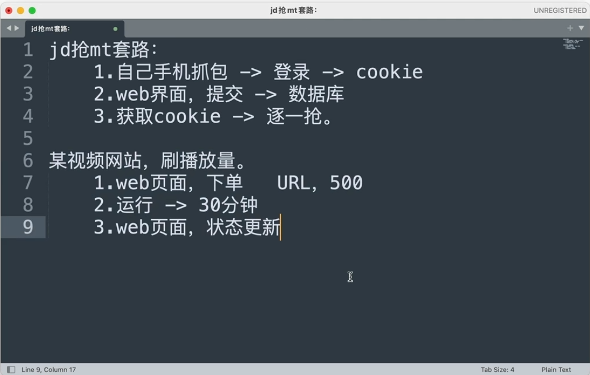


