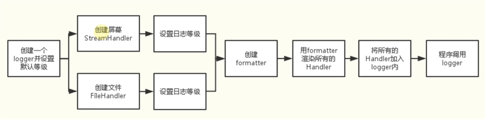
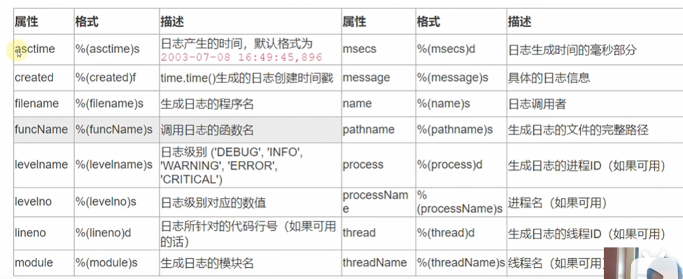

<h1 style="text-align: center;">logging 模块</h1>

# 一、初识 logging

```python
import logging


def main():
    # 默认的日志输出级别为 WARNING
    logging.debug("This is a/an debug message!")
    logging.info("This is a/an info message!")
    logging.warning("This is a/an warning message!")
    logging.error("This is a/an error message!")
    logging.critical("This is a/an critical message!")


if __name__ == "__main__":
    main()
```

控制台输出：

```console
WARNING:root:This is a/an warning message!
ERROR:root:This is a/an error message!
CRITICAL:root:This is a/an critical message!
```

# 二、logging 库日志级别

| 级别     | 级别数值 | 使用时机                                         |
| -------- | -------- | ------------------------------------------------ |
| DEBUG    | 10       | 详细信息，用于调试                               |
| INFO     | 20       | 程序正常运行过程中产生的一些信息                 |
| WARNING  | 30       | 警告用户，虽然程序在正常工作，但是有可能发生错误 |
| ERROR    | 40       | 由于更严重的问题，程序已经不能执行一些功能了     |
| CRITICAL | 50       | 严重错误，程序已无法继续运行                     |

默认的日志级别是 WARNING。

# 三、logging 的基础用法

## 3.1 基础使用

可以使用 `basicConfig()` 方法来指定日志输出级别。

```python
import logging


def main():
    # 指定日志输出级别
    logging.basicConfig(level=logging.DEBUG)
    logging.debug("This is a/an debug message!")
    logging.info("This is a/an info message!")
    logging.warning("This is a/an warning message!")
    logging.error("This is a/an error message!")
    logging.critical("This is a/an critical message!")


if __name__ == "__main__":
    main()
```

输出:

```console
DEBUG:root:This is a/an debug message!
INFO:root:This is a/an info message!
WARNING:root:This is a/an warning message!
ERROR:root:This is a/an error message!
CRITICAL:root:This is a/an critical message!
```

## 3.2 输出日志到文件

```python
import logging


def main():
    # 指定日志输出级别
    logging.basicConfig(filename="demo.log", level=logging.DEBUG)
    logging.debug("This is a/an debug message!")
    logging.info("This is a/an info message!")
    logging.warning("This is a/an warning message!")
    logging.error("This is a/an error message!")
    logging.critical("This is a/an critical message!")


if __name__ == "__main__":
    main()
```

运行上述程序后，会在当前目录下新建一个 `demo.log`文件，将日志信息保存进去 -- 默认是追加的.

下面是 `demo.log` 文件的数据

``` 
DEBUG:root:This is a/an debug message!
INFO:root:This is a/an info message!
WARNING:root:This is a/an warning message!
ERROR:root:This is a/an error message!
CRITICAL:root:This is a/an critical message!
```

另外，可以在 `basciConfig()` 方法中将 `filemode` 这个参数设置为 `'w'` 即可设置覆盖模式，例如：

```python
logging.basicConfig(filename="demo.log", filemode='w', level=logging.DEBUG)
```

## 3.3 输出变量

为了简洁起见，仅输出到控制台，并且只留一个 DEBUG 级别作为演示

```python
import logging


def main():
    logging.basicConfig(level=logging.DEBUG)
    logging.debug("姓名: %s，年龄：%d", "张三", 18)


if __name__ == "__main__":
    main()
```

输出：

```python
DEBUG:root:姓名: 张三，年龄：18
```

## 3.4 改变输出格式

```python
import logging


def main():
    logging.basicConfig(
        format="%(asctime)s | %(levelname)s | %(filename)s:%(lineno)s | %(message)s",
        datefmt="%Y-%m-%d %H:%M:%S",
        level=logging.DEBUG,
    )
    logging.debug("姓名: %s，年龄：%d.", "张三", 18)
    logging.info("This is info log.")
    logging.warning("This is warning log.")
    logging.error("This is error log.")
    logging.critical("This is critical log.")


if __name__ == "__main__":
    main()
```

输出：

```python
2025-12-23 21:02:09 | DEBUG | main.py:13 | 姓名: 张三，年龄：18.
2025-12-23 21:02:09 | INFO | main.py:14 | This is info log.
2025-12-23 21:02:09 | WARNING | main.py:15 | This is warning log.
2025-12-23 21:02:09 | ERROR | main.py:16 | This is error log.
2025-12-23 21:02:09 | CRITICAL | main.py:17 | This is critical log.
```

# 四、logging 高级应用

`logging` 采用了模块化设计，主要包含四种组件：

- `Loggers`: 记录器，提供应用程序代码能直接使用的接口 -- 一个记录器对应多个处理器
- `Handlers`：处理器，将记录器产生的日志发送至目的地
- `Filters`：过滤器，提供更好的粒度控制，决定哪些日志会被输出
- `Formatters`：格式化器，设置日志内容的组成结构和消息字段

logging 的整个工作流程：



## 4.1 Loggers 记录器

1. 提供应用程序的调用接口
   ```
   # logger 是单例的
   logger = logging.getLogger(__name__)
   ```

2. 决定日志记录的级别
   ```
   logger.setLevel()
   ```

3. 将日志内容传递到相关联的 handlers 中
   ```
   logger.addHandler() 和 logger.removeHandler()
   ```

## 4.2 Handlers 处理器

他们将日志分发到不同的目的地，可以是文件。标准输出、邮件或者通过 socket、http等协议发送到任何地方

- `StreamHandler`
  标准输出 `stdout`（如显示器）分发器
  创建方法: `sh = logging.StreamHandler(stream=None)`
- `FileHandler`
  将日志保存到磁盘文件的处理器。
  创建方法: `fh = logging.FileHandler(filename, mode='a', encoding=None, delay=False)`

`setFormatter()`：设置当前 handler 对象使用的消息格式。

处理器：

- `StreamHandler`
- `FileHandler`
- `BaseRotatingHandler`
- `RotatingFileHandler`
- `TimeRotatingFileHandler`
- `SocketHandler`
- `DatagramHandler`
- `SMTPHandler`
- `SysLogHandler`
- `NTEventLogHandler`
- `HTTPHandler`
- `WatchedFileHandler`
- `QueueHandler`
- `NullHandler`

## 4.3 Formatter 格式

Formatter 对象用来最终设置日志信息的顺序、结构和内容

其构造方法为 `ft = loggging.Formatter.__init__(fmt=None,dateformat=None,style=" %")`

`datafmt` 默认是 `%Y-%m-%d %H:%M:%S` 样式的

style 参数默认为百分号符 `%`，这表示 `%(<dictionary key>)s` 格式的字符串。



## 4.4 代码演示

```python
# demo 1
import logging


def main():
    # 使用编程的写法来使用一些高级的写法

    # 记录器
    logger = logging.getLogger()
    print(logger)  # <RootLogger root (WARNING)>
    print(type(logger))  # <class 'logging.RootLogger'>
    pass


if __name__ == "__main__":
    main()
```

```python
# demo 2
import logging


def main():
    # 使用编程的写法来使用一些高级的写法

    # 记录器
    logger = logging.getLogger()
    logger.setLevel(logging.DEBUG)
    print(logger)  # <RootLogger root (DEBUG)>
    print(type(logger))  # <class 'logging.RootLogger'>
    pass


if __name__ == "__main__":
    main()
```

```python
# demo 3
import logging


def main():
    # 使用编程的写法来使用一些高级的写法

    # 记录器
    logger = logging.getLogger(name="applog")
    logger.setLevel(logging.DEBUG)
    print(logger)  # <Logger applog (DEBUG)>
    print(type(logger))  # <class 'logging.Logger'>
    pass


if __name__ == "__main__":
    main()
```

```python
# demo 4
import logging


def main():
    # 使用编程的写法来使用一些高级的写法

    # 记录器
    logger = logging.getLogger(name="applog")
    logger.setLevel(
        logging.DEBUG
    )  # logger 先过滤一次日志级别, handler 再过滤一次日志级别

    # 处理器 handler
    console_handler = logging.StreamHandler()
    console_handler.setLevel(logging.DEBUG)

    file_handler = logging.FileHandler(
        filename="./logs.log",
        encoding="utf-8",
    )
    file_handler.setLevel(logging.INFO)

    # Formatter 格式 可以给不同的处理器设置不同的格式
    format_1 = logging.Formatter(
        fmt="%(asctime)s | %(levelname)s | %(filename)s:%(lineno)s | %(message)s",
    )
    format_2 = logging.Formatter(
        fmt="%(asctime)s | %(levelname)s | %(filename)s:%(lineno)s | %(message)s",
        datefmt="%Y/%m/%d %H:%M:%S",
    )

    # 给处理器设置格式
    console_handler.setFormatter(format_1)
    file_handler.setFormatter(format_2)

    # 将处理器添加到记录器中
    logger.addHandler(console_handler)
    logger.addHandler(file_handler)

    # 打印日志
    logger.debug("这是一个 debug 日志信息")
    logger.info("这是一个 info 日志信息")
    logger.warning("这是一个 warning 日志信息")
    logger.error("这是一个 error 日志信息")
    logger.critical("这是一个 critical 日志信息")
    pass


if __name__ == "__main__":
    main()
```

执行上述代码：

```python
# 在控制台输出：
2025-12-25 21:15:21,806 | DEBUG | main.py:44 | 这是一个 debug 日志信息
2025-12-25 21:15:21,806 | INFO | main.py:45 | 这是一个 info 日志信息
2025-12-25 21:15:21,806 | WARNING | main.py:46 | 这是一个 warning 日志信息
2025-12-25 21:15:21,806 | ERROR | main.py:47 | 这是一个 error 日志信息
2025-12-25 21:15:21,806 | CRITICAL | main.py:48 | 这是一个 critical 日志信息

# 在日志文件中输出：
2025/12/25 21:15:21 | INFO | main.py:45 | 这是一个 info 日志信息
2025/12/25 21:15:21 | WARNING | main.py:46 | 这是一个 warning 日志信息
2025/12/25 21:15:21 | ERROR | main.py:47 | 这是一个 error 日志信息
2025/12/25 21:15:21 | CRITICAL | main.py:48 | 这是一个 critical 日志信息
```

> [!Note]
>
> 如果只在 logger 上设置日志级别，handler 上不设置级别，那么输出级别以 logger 设置的级别为准
>
> 如果 logger 上不设置日志级别，且 handler 上不设置级别，那么默认级别为 warning
>
> **总之一句话，logger 默认的级别为 warning，先根据 logger 的级别过滤，再在过滤完的基础上根据 handler 的级别过滤日志。****

---

下面还有个小技巧：使用占位符，让日志的级别全都对齐：

```python
format = logging.Formatter(
    fmt="%(asctime)s | %(levelname)8s | %(filename)s:%(lineno)s | %(message)s",
)
```

下面是设置占位符后的打印效果：

```python
2025-12-25 21:22:07,523 |  WARNING | :46 | 这是一个 warning 日志信息
2025-12-25 21:22:07,523 |    ERROR | :47 | 这是一个 error 日志信息
2025-12-25 21:22:07,523 | CRITICAL | :48 | 这是一个 critical 日志信息
```

---

上面的是右对齐的，在8前面加个 `-`号，就可以左对齐了

```python
format = logging.Formatter(
    fmt="%(asctime)s | %(levelname)-8s | %(filename)s:%(lineno)s | %(message)s",
)
```

```python
2025-12-25 21:25:17,570 | WARNING  | :46 | 这是一个 warning 日志信息
2025-12-25 21:25:17,570 | ERROR    | :47 | 这是一个 error 日志信息
2025-12-25 21:25:17,570 | CRITICAL | :48 | 这是一个 critical 日志信息
```

----

```python
# demo 5
import logging


def main():
    # 使用编程的写法来使用一些高级的写法

    # 记录器
    logger = logging.getLogger(name="applog")
    logger.setLevel(
        logging.DEBUG
    )  # logger 先过滤一次日志级别, handler 再过滤一次日志级别

    # 处理器 handler
    console_handler = logging.StreamHandler()
    console_handler.setLevel(logging.DEBUG)
	
    file_handler = logging.FileHandler(
        filename="./logs.log",
        encoding="utf-8",
    )
    file_handler.setLevel(logging.INFO)

    # Formatter 格式 可以给不同的处理器设置不同的格式
    format_1 = logging.Formatter(
        fmt="%(asctime)s | %(levelname)-8s | %(filename)s:%(lineno)s | %(message)s",
    )
    format_2 = logging.Formatter(
        fmt="%(asctime)s | %(levelname)-8s | %(filename)s:%(lineno)s | %(message)s",
        datefmt="%Y/%m/%d %H:%M:%S",
    )

    # 给处理器设置格式
    console_handler.setFormatter(format_1)
    file_handler.setFormatter(format_2)

    # 将处理器添加到记录器中
    logger.addHandler(console_handler)
    logger.addHandler(file_handler)

    # 过滤器 -- 用于过滤处理器和记录器
    flt = logging.Filter("cn.cccb")
    logger.addFilter(flt)

    # 打印日志
    logger.debug("这是一个 debug 日志信息")
    logger.info("这是一个 info 日志信息")
    logger.warning("这是一个 warning 日志信息")
    logger.error("这是一个 error 日志信息")
    logger.critical("这是一个 critical 日志信息")
    pass


if __name__ == "__main__":
    main()
```

运行上述程序我们发现，不管是 控制台 还是 文件，都没有日志输出。-- 因为我们过滤了所有不是以 `cn.cccb` 开头的 `logger`

```python
flt = logging.Filter("cn.cccb")
logger.addFilter(flt)
```

我们将程序改一下，将 `logger` 的 `name` 参数改一下：

```python
# demo 6
import logging


def main():
    # 使用编程的写法来使用一些高级的写法

    # 记录器
    logger = logging.getLogger(name="cn.cccb.applog")
    logger.setLevel(
        logging.DEBUG
    )  # logger 先过滤一次日志级别, handler 再过滤一次日志级别

    # 处理器 handler
    console_handler = logging.StreamHandler()
    console_handler.setLevel(logging.DEBUG)

    file_handler = logging.FileHandler(
        filename="./logs.log",
        encoding="utf-8",
    )
    file_handler.setLevel(logging.INFO)

    # Formatter 格式 可以给不同的处理器设置不同的格式
    format_1 = logging.Formatter(
        fmt="%(asctime)s | %(levelname)-8s | %(filename)s:%(lineno)s | %(message)s",
    )
    format_2 = logging.Formatter(
        fmt="%(asctime)s | %(levelname)-8s | %(filename)s:%(lineno)s | %(message)s",
        datefmt="%Y/%m/%d %H:%M:%S",
    )

    # 给处理器设置格式
    console_handler.setFormatter(format_1)
    file_handler.setFormatter(format_2)

    # 将处理器添加到记录器中
    logger.addHandler(console_handler)
    logger.addHandler(file_handler)

    # 过滤器 -- 用于过滤处理器和记录器
    flt = logging.Filter("cn.cccb")
    logger.addFilter(flt)

    # 打印日志
    logger.debug("这是一个 debug 日志信息")
    logger.info("这是一个 info 日志信息")
    logger.warning("这是一个 warning 日志信息")
    logger.error("这是一个 error 日志信息")
    logger.critical("这是一个 critical 日志信息")
    pass


if __name__ == "__main__":
    main()

```

我们会发现无论是控制台还是文件都会打印出全部日志信息。

也可以给 处理器 加过滤器：

```python
import logging


def main():
    # 使用编程的写法来使用一些高级的写法

    # 记录器
    logger = logging.getLogger(name="cn.cccb.applog")
    logger.setLevel(
        logging.DEBUG
    )  # logger 先过滤一次日志级别, handler 再过滤一次日志级别

    # 处理器 handler
    console_handler = logging.StreamHandler()
    console_handler.setLevel(logging.DEBUG)

    file_handler = logging.FileHandler(
        filename="./logs.log",
        encoding="utf-8",
    )
    file_handler.setLevel(logging.INFO)

    # Formatter 格式 可以给不同的处理器设置不同的格式
    format_1 = logging.Formatter(
        fmt="%(asctime)s | %(levelname)-8s | %(filename)s:%(lineno)s | %(message)s",
    )
    format_2 = logging.Formatter(
        fmt="%(asctime)s | %(levelname)-8s | %(filename)s:%(lineno)s | %(message)s",
        datefmt="%Y/%m/%d %H:%M:%S",
    )

    # 给处理器设置格式
    console_handler.setFormatter(format_1)
    file_handler.setFormatter(format_2)

    # 将处理器添加到记录器中
    logger.addHandler(console_handler)
    logger.addHandler(file_handler)

    # 过滤器 -- 用于过滤处理器和记录器
    flt = logging.Filter("cn.cccb")
    # logger.addFilter(flt)
    file_handler.addFilter(flt)

    # 打印日志
    logger.debug("这是一个 debug 日志信息")
    logger.info("这是一个 info 日志信息")
    logger.warning("这是一个 warning 日志信息")
    logger.error("这是一个 error 日志信息")
    logger.critical("这是一个 critical 日志信息")
    pass


if __name__ == "__main__":
    main()
```

运行上述程序，发现控制台和文件都有日志输出。

但是，如果我们将 `logger = logging.getLogger(name="cn.cccb.applog")` 改为 `logger = logging.getLogger(name="applog")`后运行程序，会发现只有 控制台有日志输出，文件中没有日志输出：

```python
import logging


def main():
    # 使用编程的写法来使用一些高级的写法

    # 记录器
    logger = logging.getLogger(name="applog")
    logger.setLevel(
        logging.DEBUG
    )  # logger 先过滤一次日志级别, handler 再过滤一次日志级别

    # 处理器 handler
    console_handler = logging.StreamHandler()
    console_handler.setLevel(logging.DEBUG)

    file_handler = logging.FileHandler(
        filename="./logs.log",
        encoding="utf-8",
    )
    file_handler.setLevel(logging.INFO)

    # Formatter 格式 可以给不同的处理器设置不同的格式
    format_1 = logging.Formatter(
        fmt="%(asctime)s | %(levelname)-8s | %(filename)s:%(lineno)s | %(message)s",
    )
    format_2 = logging.Formatter(
        fmt="%(asctime)s | %(levelname)-8s | %(filename)s:%(lineno)s | %(message)s",
        datefmt="%Y/%m/%d %H:%M:%S",
    )

    # 给处理器设置格式
    console_handler.setFormatter(format_1)
    file_handler.setFormatter(format_2)

    # 将处理器添加到记录器中
    logger.addHandler(console_handler)
    logger.addHandler(file_handler)

    # 过滤器 -- 用于过滤处理器和记录器
    flt = logging.Filter("cn.cccb")
    # logger.addFilter(flt)
    file_handler.addFilter(flt)

    # 打印日志
    logger.debug("这是一个 debug 日志信息")
    logger.info("这是一个 info 日志信息")
    logger.warning("这是一个 warning 日志信息")
    logger.error("这是一个 error 日志信息")
    logger.critical("这是一个 critical 日志信息")
    pass


if __name__ == "__main__":
    main()
```

## 4.5 日志设置配置文件

```toml
# logging.conf 文件

[loggers]
keys = root, applog

[handlers]
keys=fileHandler, consoleHandler

[formatters]
keys=simpleFormatter

[logger_root]
level=DEBUG
handlers=consoleHandler

[logger_applog]
level=DEBUG
handlers=fileHandler,consoleHandler
qualname=applog
propagate=0

[handler_consoleHandler]
class=StreamHandler
args=(sys.stdout,)
level=DEBUG
formatter=simpleFormatter

[handler_filehanlder]
class=handlers.TimeRotatingFileHandler
args=('applog.log', 'midnight', 1, 0)
level=DEBUG
formatter=simpleFormatter

[formatter_simpleFormatter]
format=%(asctime)s | %(levelname)-8s | %(filename)s:%(lineno)s | %(message)s
datefmt=%Y/%m/%d %H:%M:%S
```

怎么使用上述配置文件呢？

```python
import logging
import logging.config


def main():
    # 使用配置文件的写法来使用一些高级的写法

    logging.config.fileConfig("./logging.conf")
    # 记录器
    root_logger = logging.getLogger()
    app_logger = logging.getLogger(name="applog")

    # 打印日志
    app_logger.debug("这是一个 debug 日志信息")
    app_logger.info("这是一个 info 日志信息")
    app_logger.warning("这是一个 warning 日志信息")
    app_logger.error("这是一个 error 日志信息")
    app_logger.critical("这是一个 critical 日志信息")

    root_logger.debug("这是一个 root-debug 日志信息")
    root_logger.info("这是一个 root-info 日志信息")
    root_logger.warning("这是一个 root-warning 日志信息")
    root_logger.error("这是一个 root-error 日志信息")
    root_logger.critical("这是一个 root-critical 日志信息")
    pass


if __name__ == "__main__":
    main()
```

> [!Note]
>
> 上述配置文件因为是我手抄的，所以有报错，以后有时间再改！

# 五、小型项目可以开箱即用的日志模块

```python
# log_config.py

import time
import functools
import logging
from enum import Enum
from pathlib import Path
from logging.handlers import TimedRotatingFileHandler
import sys
from typing import Union, Optional


class LogLevel(Enum):
    DEBUG = 'debug'
    INFO = 'info'
    WARNING = 'warning'
    ERROR = 'error'
    CRITICAL = 'critical'


_LEVEL_MAP = {
    LogLevel.DEBUG: logging.DEBUG,
    LogLevel.INFO: logging.INFO,
    LogLevel.WARNING: logging.WARNING,
    LogLevel.ERROR: logging.ERROR,
    LogLevel.CRITICAL: logging.CRITICAL,
}

# 使用集合记录已配置的logger，避免重复配置
_CONFIGURED_LOGGERS = set()


def setup_logger(
        name: str = __name__,
        log_file: str = './logs/app.log',
        log_level: LogLevel = LogLevel.INFO,
        log_format_file: str = '%(asctime)s | %(levelname)s | %(filename)s:%(funcName)s:Line %(lineno)d | %(message)s',
        log_format_console: str = '%(asctime)s | %(levelname)s | %(filename)s:%(funcName)s:Line %(lineno)d | %(message)s',
        log_file_open: bool = True,
        log_console_open: bool = True,
        log_file_level: Union[LogLevel, None] = None,
        log_console_level: Union[LogLevel, None] = None,
        when: str = 'midnight',  # 按天轮转
        backup_count: int = 30,  # 保留30天
) -> logging.Logger:
    """设置日志记录器
    如何使用：

    # ##############################################################
    from log_config import setup_logger, LogLevel
    my_logger = setup_logger(
        log_file='file.log',
        log_console_level=LogLevel.ERROR,
        log_file_level=LogLevel.DEBUG,
    )

    my_logger.info('这是一条 info 日志.')
    my_logger.error('这是一条 error 日志.')
    ...
    # ##############################################################

    Args:
        name ():
        log_file ():
        log_level ():
        log_format_file ():
        log_format_console ():
        log_file_open ():
        log_console_open ():
        log_file_level ():
        log_console_level ():
        when ():
        backup_count ():

    Returns:

    """
    # 创建 Logger
    logger: logging.Logger = logging.getLogger(name)

    # 如果已经配置过，直接返回现有的logger
    if name in _CONFIGURED_LOGGERS:
        return logger

    # 确保日志目录存在
    if log_file_open:
        log_path = Path(log_file)
        log_path.parent.mkdir(parents=True, exist_ok=True)

    # 设置logger级别为最宽松的，实际级别由handlers控制
    logger.setLevel(logging.DEBUG)

    # 清除现有的handlers（如果有的话）
    logger.handlers.clear()

    # 控制台 handler
    if log_console_open:
        console_handler = logging.StreamHandler(sys.stdout)
        console_handler.setFormatter(logging.Formatter(log_format_console))
        console_level = log_console_level if log_console_level is not None else log_level
        console_handler.setLevel(_LEVEL_MAP[console_level])
        logger.addHandler(console_handler)

    # File handler - 使用 TimedRotatingFileHandler 替代 FileHandler
    if log_file_open:
        try:
            # 创建按时间轮转的文件处理器
            file_handler = TimedRotatingFileHandler(
                filename=log_file,
                when=when,
                backupCount=backup_count,
                encoding='utf-8',
                delay=False,  # 立即打开文件
            )
            file_handler.setFormatter(logging.Formatter(log_format_file))
            file_level = log_file_level if log_file_level is not None else log_level
            file_handler.setLevel(_LEVEL_MAP[file_level])
            logger.addHandler(file_handler)
        except Exception as e:
            # 如果文件handler创建失败，只使用控制台handler
            print(f"Failed to create file handler: {e}")
            if not log_console_open:
                # 如果没有控制台handler，添加一个临时的
                fallback_handler = logging.StreamHandler(sys.stdout)
                fallback_handler.setFormatter(logging.Formatter(log_format_console))
                fallback_handler.setLevel(_LEVEL_MAP[log_level])
                logger.addHandler(fallback_handler)

    # 如果没有添加任何handler，添加一个NullHandler避免警告
    if not logger.handlers:
        logger.addHandler(logging.NullHandler())

    # 设置 propagate 为 False，避免日志重复输出
    logger.propagate = False

    # 记录已配置的logger
    _CONFIGURED_LOGGERS.add(name)

    return logger


# 装饰器版本，用于为函数添加日志记录
def log_function_call(
        logger: Optional[logging.Logger] = None,
        level: LogLevel = LogLevel.DEBUG,
        log_args: bool = True,
        log_result: bool = True
):
    """装饰器，用于记录函数调用
    如何使用：
    # #############################################################
    # Define function ...
    @log_function_call(logger=your_logger)
    def your_func():
        # do something  ...

    # Call function ...
    your_func()
    # #############################################################

    Args:
        logger: 日志记录器，如果为None则使用函数模块的logger
        level: 日志级别，默认为INFO
        log_args: 是否记录函数参数
        log_result: 是否记录函数返回值
    """

    def decorator(func):
        @functools.wraps(func)
        def wrapper(*args, **kwargs):
            # 获取logger
            _logger = logger or logging.getLogger(func.__module__)

            # 获取日志方法
            log_method = getattr(_logger, level.value)

            # 构建日志消息
            func_name = func.__name__
            args_info = ""

            if log_args:
                args_list = [repr(arg) for arg in args]
                kwargs_list = [f"{k} = {repr(v)}" for k, v in kwargs.items()]
                all_args = ", ".join(args_list + kwargs_list)
                args_info = f" 参数: {all_args}"

            # 记录开始
            log_method(f"开始调用函数: {func_name}, {args_info}")

            start_time = time.perf_counter()
            try:
                result = func(*args, **kwargs)
                elapsed_time = time.perf_counter() - start_time

                # 记录成功
                result_info = ""
                if log_result and result is not None:
                    result_str = repr(result)
                    if len(result_str) > 100:
                        result_str = result_str[:100] + "..."
                    result_info = f" 返回: {result_str}"

                log_method(f"函数 {func_name} 执行成功，耗时: {elapsed_time:.6f}秒, {result_info}")
                return result

            except Exception as e:
                elapsed_time = time.perf_counter() - start_time
                _logger.exception(f"函数 {func_name} 执行失败，耗时: {elapsed_time:.6f}秒，错误类型: {type(e).__name__}")
                raise

        return wrapper

    return decorator


if __name__ == '__main__':
    # 创建一个logger，控制台只输出ERROR及以上，文件记录DEBUG及以上
    my_logger = setup_logger(
        name='my_app',
        log_file='file.log',
        log_console_level=LogLevel.ERROR,  # 控制台只输出ERROR及以上
        log_file_level=LogLevel.DEBUG  # 文件记录DEBUG及以上
    )


    @log_function_call(logger=my_logger)
    def main():
        print('This is main function.')
        time.sleep(0.1)  # 添加一点延迟以便看到耗时
        return 42


    @log_function_call(logger=my_logger)
    def add_numbers(a, b=10):
        """测试函数"""
        result = a + b
        print(f"Result: {a} + {b} = {result}")
        return result


    @log_function_call(logger=my_logger)
    def test_error():
        raise RuntimeError()


    print("=== 控制台输出（只显示ERROR及以上）===")
    # 运行装饰器函数 - 这些DEBUG和INFO级别日志不会显示在控制台，但会记录到文件
    main()
    print()
    add_numbers(10, b=20)
    print()
    test_error()

    print("\n=== 直接调用logger方法 ===")
    # 这些日志也不会显示在控制台（因为级别低于ERROR），但会记录到文件
    my_logger.debug('这是一个 debug 信息')
    my_logger.info('这是一个 info 信息')
    my_logger.warning('这是一个 warning 信息')
    my_logger.error('这是一个 error 信息 - 这会显示在控制台')
    my_logger.critical('这是一个 critical 信息 - 这会显示在控制台')

    print("\n=== 检查日志文件 ===")
    print("请查看 file.log 文件，应该包含所有级别的日志（DEBUG及以上）")

# END

```


