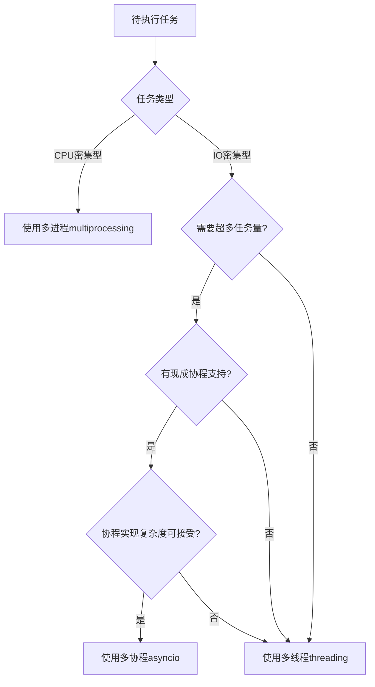
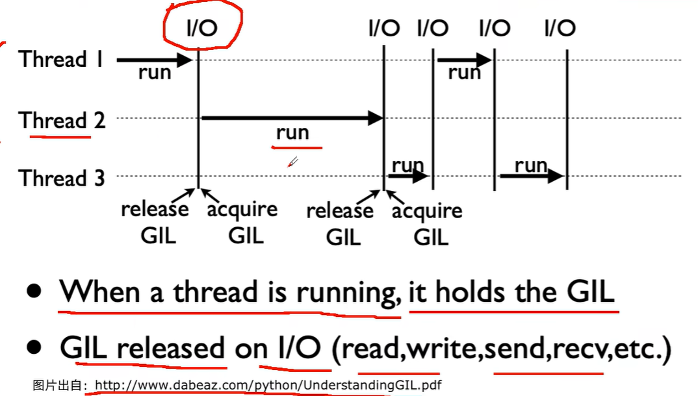
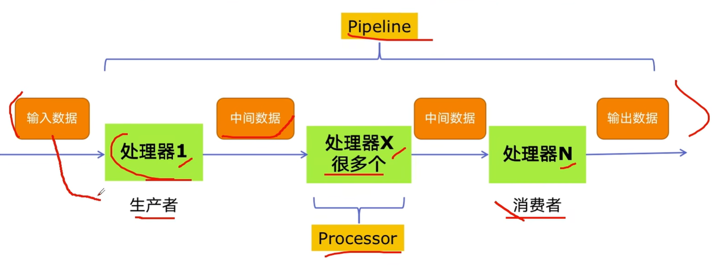
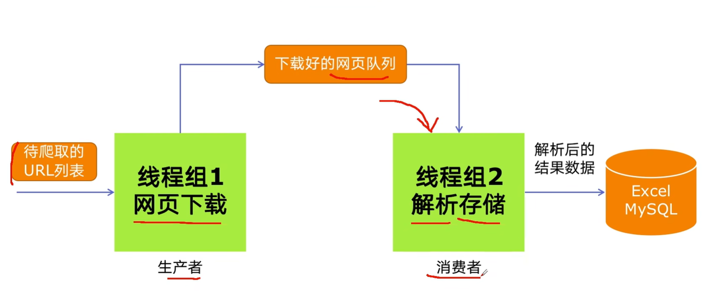
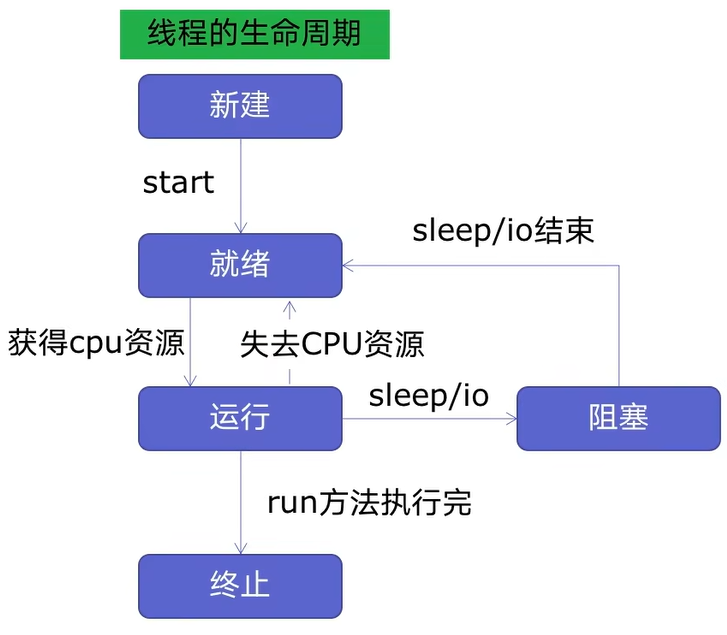
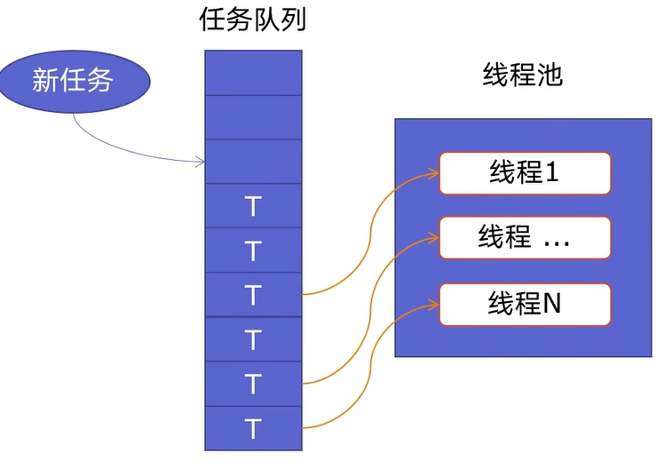
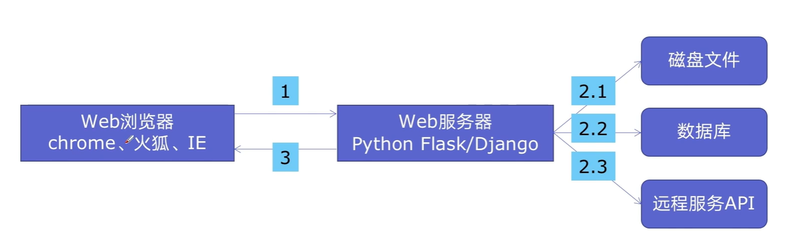
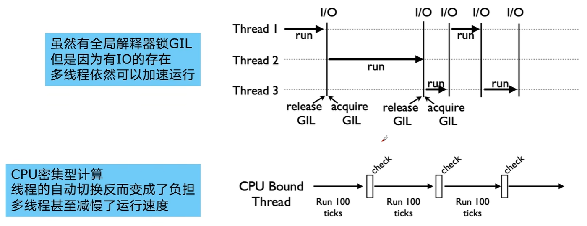
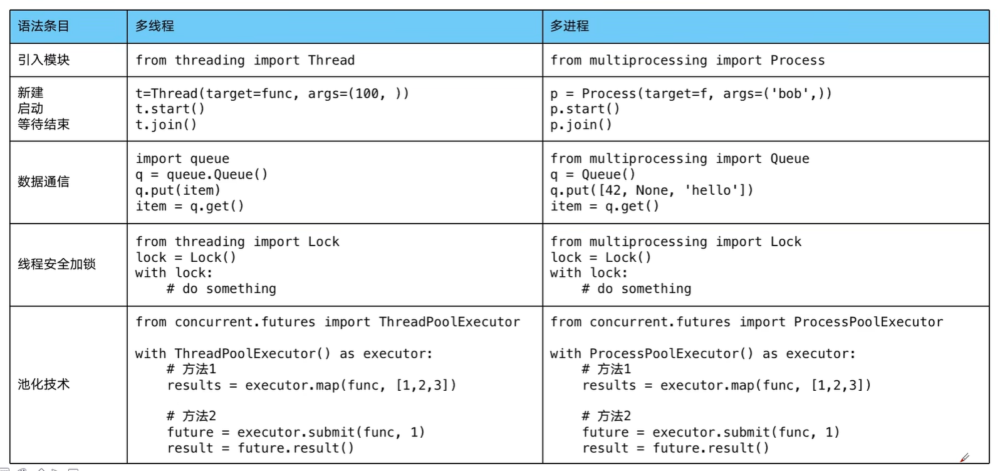
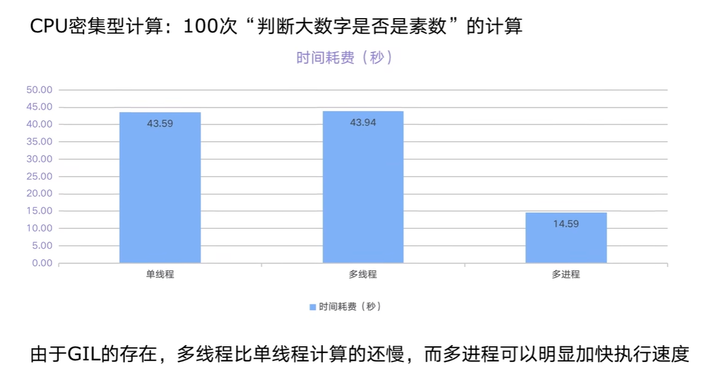

<h1 style="text-align: center;">python 并发</h1>

# 一、第一天

## 1.1 python对并发编程的支持：

```bash
1. 多线程 threading -- 利用CPU和IO可以同时执行的原理。
2. 多进程 multiprocessing -- 利用多核CPU的能力，真正的并行执行任务。
3. 异步IO asyncio -- 在单线程利用CPU和IO同时执行的原理，实现函数异步执行。
4. 使用Lock对资源加锁，防止冲突访问。
5. 使用Queue实现不同线程/进程之间的数据通信。
6. 使用线程池Pool/进程池Pool，简化线程/进程的任务提交、等待结束、获取结果。
7. 使用subprocess启动外部程序的进程，并进行输入输出交互。 
```

## 1.2 python并发编程有三种方式

- 多线程  `Thread` -- `threading`
- 多进程 `Process` -- `multiprocessing`
- 多协程 `Coroutine` -- `asyncio`

**注意**

- 一个进程中可以启动N个线程
- 一个线程中可以启动N个协程

### 1.2.1 CPU密集型计算 VS. IO密集型计算

- `CPU`密集型(`CPU-bound`) 
    也叫计算密集型，是指`I/O`在很短时间内可以完成，`CPU`需要大量的计算和处理，其特点是`CPU`占用率相当高。
    比如：压缩/解压缩、加密解密、正则表达式搜索等

- `IO`密集型(`I/O-bound`)
    是指系统运作大部分的状况是`CPU`在等待`I/O`的读/写操作，`CPU`占用率依然较低.
    比如：文件处理、网络爬虫、读写数据库等

### 1.2.2 多进程VS.多线程VS.多协程

- 多线程  `Thread` -- `threading`
    - **优点**：相较于进程，更加轻量级，占用资源少
    - **缺点**：
        1. 相比进程，多线程**只能并发执行**，不能利用多`CPU(GIL)`
        2. 相比协程，启动数目有限制，占用内存资源，有线程切换开销
    - **适用于**：`I/O`密集型计算，同时运行的任务数目要求不多
- 多进程 `Process` -- `multiprocessing`
    - **优点**：可以利用多核`CPU`并行运算
    - **缺点**：占用资源最多，可启动数目比线程少
    - **适用于**：`CPU`密集型计算
- 多协程 `Coroutine` -- `asyncio`
    - **优点**：内存开销最少，启动协程数量最多
    - **缺点**：支持的库有限制`(aiohttp VS. requests)`、代码实现复杂
    - **适用于**：`I/O`密集型计算、需要**超多任务运行**但是有现成库支持的场景

### 1.2.3 如何选择




## 1.3 全局解释器锁`GIL`

### 1.3.1 `python`速度慢的两大原因

1. `Python`是动态类型语言，边解释边执行。
2. `GIL`，无法利用多核`CPU`并发执行

### 1.3.2 `GIL`是什么

`全局解释器锁(Global Interpreter Lock, GIL)`：是计算机程序设计语言解释器用于同步线程的一种机制，它使得任何时刻只有一个线程在执行。

即使在多核心处理器上，使用`GIL`的解释器也只允许同一时间执行一个线程。

> 参考
>
> https://www.dabeaz.com/python/UnderstandingGIL.pdf



由于GIL的存在，即使电脑有多核CPU，单个时刻也只能使用一个，相比并发加速的C++/Java慢。

### 1.3.3 为什么会有`GIL`这个东西

简而言之，Python设计初期，为了规避并发问题引入了GIL，现在想去除却去不掉了。

引入GIL：解决多个线程之间数据完整性和状态同步问题。

**详解**

Python中对象的管理，是使用引用计数器进行的，引用数为0则释放对象；

GIL的好处：简化了Python对共享资源的管理。

### 1.3.4 怎样规避`GIL`带来的限制

1. 多线程threading机制依然是有用的，用于**I/O密集型计算**
    因为**在I/O期间，线程会释放GIL，实现CPU和IO的并行，因此多线程用于IO密集型计算依然可以大幅度提升速度。**
    但是，多线程用于CPU密集型计算时，只会更加拖慢速度。
2. 使用multiprocessing的多进程机制实现并行计算，利用多核CPU优势。
    为了应对GIL的问题，Python提供了multiprocessing

# 二、第二天

## 2.1 Python创建多线程的方法

1.准备一个函数

```python
def my_func(a, b):
    do_crawl(a, b)
```

2.创建一个线程

```python
import threading

t = threading.Thread(target=my_func, args=(100, 200))
```

3.启动线程

```python
t.start()
```

4.等待结束

```python
t.join()
```

## 2.2 改写爬虫程序，变成多线程爬去

普通爬虫

```python
import requests


urls: list[str] = [f"https://www.cnblogs.com/#p{i}" for i in range(1, 50 + 1)]


def my_func(url: str):
    r = requests.get(url)
    print(url, r.status_code, len(r.text))


my_func(urls[0])
```

多线程爬虫

```python
def multi_thread():
    threads = [threading.Thread(target=crawl, args=(url,)) for url in urls]
    for thread in threads:
        thread.start()

    for thread in threads:
        thread.join()
```

## 2.3 速度对比：单线程爬虫 VS. 多线程爬虫

```python
import threading
import time

import requests

urls: list[str] = [f"https://www.cnblogs.com/#p{i}" for i in range(1, 50 + 1)]


def crawl(url: str):
    r = requests.get(url)
    print(url, r.status_code, len(r.text))


def single_thread():
    print("单线程开始")
    for url in urls:
        crawl(url)
    print("单线程结束")


def multi_thread():
    print("多线程开始")
    threads = [threading.Thread(target=crawl, args=(url,)) for url in urls]
    for thread in threads:
        thread.start()

    for thread in threads:
        thread.join()
    print("多线程结束")


if __name__ == "__main__":
    start = time.time()
    single_thread()
    end = time.time()
    print(f"单线程耗时: {end - start}s")
    
    start = time.time()
    multi_thread()
    end = time.time()
    print(f"多线程耗时: {end - start}s")
```

运行结果

```python
单线程开始
...
单线程结束
单线程耗时: 54.75840616226196s

多线程开始
...
多线程结束
多线程耗时: 8.91602897644043s
```

## 2.4 `Python`实现生产者消费者模式多线程爬虫

### 2.4.1 多组件的`Pipeline`技术架构

复杂的事情一般都不会一下子做完，而是会分很多中加步骤一步步完成；




### 2.4.2 生产者消费者爬虫的架构



### 2.4.3 多线程数据通信的queue.Queue

`queue.Queue` 可以用于多线程之间的、线程安全的数据通信

```python
import queue

q = queue.Queue()

# 添加元素 - 阻塞
q.put(item)

# 获取元素 - 阻塞
item= q.get()

# 查看元素的多少
q.qsize()
# 判断是否为空
q.empty()
# 判断是否已满
q.full()
```

### 2.4.4 代码编写实现生产者消费者爬虫

```python
# 普通版本的爬虫

import requests
from bs4 import BeautifulSoup

urls: list[str] = [f"https://www.cnblogs.com/#p{i}" for i in range(1, 50 + 1)]


def crawl(url: str):
    r = requests.get(url)
    return r.text


def parse(html):
    # class="post-item-title"
    soup = BeautifulSoup(html, 'html.parser')
    links = soup.find_all('a', class_="post-item-title")
    return [(link['href'], link.get_text()) for link in links]


if __name__ == '__main__':
    for result in parse(crawl(urls[0])):
        print(result)
```

```python
# 生产者消费者的多线程爬虫
# ！！！ 注意，此版本没有正确关闭文件，不要轻易模仿

#!/usr/bin/env python3
# -*- coding: utf-8 -*-

import queue
import time
import random
import threading

import requests
from bs4 import BeautifulSoup


def crawl(url: str):
    r = requests.get(url)
    return r.text


def parse(html):
    # class="post-item-title"
    soup = BeautifulSoup(html, 'html.parser')
    links = soup.find_all('a', class_="post-item-title")
    return [(link['href'], link.get_text()) for link in links]


def do_crawl(url_queue: queue.Queue, html_queue: queue.Queue):
    """生产者"""
    while True:
        url = url_queue.get()  # 取一个url
        html = crawl(url)  # 爬虫 下载
        html_queue.put(html)
        print('Thread name:', threading.current_thread().name, 'crawl:', url, 'url queue size:', url_queue.qsize())
        time.sleep(random.randint(1, 2))


def do_parse(html_queue: queue.Queue, fout):
    """消费者"""
    while True:
        html = html_queue.get()
        results = parse(html)
        for result in results:
            fout.write(str(result) + '\n')
        print('Thread name:', threading.current_thread().name, 'results:', len(results), 'html queue size:', html_queue.qsize())
        time.sleep(random.randint(1, 2))


if __name__ == '__main__':
    urls: list[str] = [f"https://www.cnblogs.com/#p{i}" for i in range(1, 50 + 1)]

    url_queue = queue.Queue()
    html_queue = queue.Queue()
    for url in urls:
        url_queue.put(url)

    for idx in range(3):  # 启动三个生产者线程
        t = threading.Thread(target=do_crawl, args=(url_queue, html_queue), name=f'crawl_{idx}')
        t.start()
    fp = open('data_02_2.txt', 'w', encoding='utf-8')
    for idx in range(3):  # 启动两个消费者线程
        t = threading.Thread(target=do_parse, args=(html_queue, fp), name=f'parse_{idx}')
        t.start()
    pass

# __END__

```

## 2.5 线程安全问题以及Lock解决方案

### 2.5.1 线程安全概念

**线程安全**指的是某个函数、函数库在多线程环境中被调用时，能够正确地处理多个线程之间的共享变量，使程序功能正确完成。

由于**线程的执行随时会发生切换**，会造成不可预料的结果，出现线程不安全。

### 2.5.2 Lock用于解决线程安全问题

 **用法1**：`try-finally`

```python
import threading

lock = threading.Lock()

lock.acquire()
try:
    # do something···
finally:
    lock.release()
```

**用法2**：`with`

```python
import threading

lock = threading.Lock()

with lock:
    # do something···
```

### 2.5.3 实例代码演示问题并给出解决方案

```python
# 版本1 -- 有时候会出问题 有时候不会出问题
import threading


class Account:
    def __init__(self, balance):
        self.balance = balance


def draw(account, amount):
    """取钱"""
    if account.balance >= amount:
        print('线程', threading.current_thread().name, '取钱成功！')
        account.balance -= amount
        print('线程', threading.current_thread().name, '余额还有', account.balance)
    else:
        print('线程', threading.current_thread().name, '取钱失败，余额不足！')


if __name__ == '__main__':
    account = Account(1000)
    ta = threading.Thread(target=draw, args=(account, 800,), name='ta')
    tb = threading.Thread(target=draw, args=(account, 800,), name='tb')

    ta.start()
    tb.start()
```

```python
# 版本2 -- 一定会出问题
import threading
import time


class Account:
    def __init__(self, balance):
        self.balance = balance


def draw(account, amount):
    """取钱"""
    if account.balance >= amount:
        time.sleep(0.1)  # sleep 一定会导致当前线程阻塞 导致线程切换 于是多线程的错误会一直出现
        print('线程', threading.current_thread().name, '取钱成功！')
        account.balance -= amount
        print('线程', threading.current_thread().name, '余额还有', account.balance)
    else:
        print('线程', threading.current_thread().name, '取钱失败，余额不足！')


if __name__ == '__main__':
    account = Account(1000)
    ta = threading.Thread(target=draw, args=(account, 800,), name='ta')
    tb = threading.Thread(target=draw, args=(account, 800,), name='tb')

    ta.start()
    tb.start()
```

```python
# 版本3 -- Lock，不会出问题

import threading
import time

lock = threading.Lock()


class Account:
    def __init__(self, balance):
        self.balance = balance


def draw(acc, amount):
    """取钱"""
    with lock:
        if acc.balance >= amount:
            time.sleep(0.1)  # sleep 一定会导致当前线程阻塞 导致线程切换 于是多线程的错误会一直出现
            print('线程', threading.current_thread().name, '取钱成功！')
            acc.balance -= amount
            print('线程', threading.current_thread().name, '余额还有', acc.balance)
        else:
            print('线程', threading.current_thread().name, '取钱失败，余额不足！')


if __name__ == '__main__':
    account = Account(1000)
    ta = threading.Thread(target=draw, args=(account, 800,), name='ta')
    tb = threading.Thread(target=draw, args=(account, 800,), name='tb')

    ta.start()
    tb.start()
```

# 三、第三天

## 3.1 好用的线程池 `ThreadPoolExecutor`

### 3.1.1 线程池的原理



- 新建线程系统需要分配资源、终止线程系统需要回收资源
- 如果可以重用线程，则可以减去新建/终止的开销



### 3.1.2 使用线程池的好处

- 提升性能：因为减去了大量新建、终止线程的开销，重用了线程资源
- 适用场景：处理突发性大量请求或需要大量线程完成任务，但实际任务处理时间较短
- 防御功能：能有效避免系统因为创建线程过多，而导致系统负荷过大响应变慢等问题
- 代码优势：使用线程池的语法比自己新建线程执行线程更加简洁

### 3.1.3 ThreadPoolExecutor的使用语法

```python
from concurrent.futures import ThreadPoolExecutor, as_completed

# 方法一 map函数，很简单 注意map的结果和入参顺序是对应的
with ThreadPoolExecutor() as pool:
    results = pool.map(craw, urls)
    
    for result in results:
        print(result)
        
# 方法二 future模式，更强大 注意如果用as_completed顺序是不定的
with ThreadPoolExecutor() as pool:
    futures = [pool.submit(craw, url) for url in urls]
    
    for future in futures:
        print(future.result())
    for future in as_completed(futures):
        print(future.result())
```

### 3.1.4 使用线程池改造爬虫程序

```python
from concurrent.futures import ThreadPoolExecutor, as_completed

import requests
from bs4 import BeautifulSoup

urls: list[str] = [f"https://www.cnblogs.com/#p{i}" for i in range(1, 50 + 1)]


def crawl(url: str):
    r = requests.get(url)
    return r.text


def parse(html):
    # class="post-item-title"
    soup = BeautifulSoup(html, 'html.parser')
    links = soup.find_all('a', class_="post-item-title")
    return [(link['href'], link.get_text()) for link in links]


# craw
with ThreadPoolExecutor() as pool:
    htmls = pool.map(crawl, urls)
    htmls = list(zip(urls, htmls))
    for url, html in htmls:
        print(url, len(html))
print('crawl over.')

# parse
with ThreadPoolExecutor() as pool:
    futures = {}
    for url, html in htmls:
        future = pool.submit(parse, html)
        futures[future] = url

    for future, url in futures.items():
        print(url, future.result())
        for future in as_completed(futures):  # as_completed 的参数应该是一个列表 此处只遍历字典的key
        url = futures[future]  # 获取url
        print(url, future.result())
```

## 3.2 在`web`服务中使用线程池加速

### 3.2.1 `Web`服务的架构及特点



- `Web`后台服务的特点
    - `Web`服务对响应时间要求非常高，比如要求`200ms`返回
    - `Web`服务有大量的依赖`I/O`操作的调用，比如磁盘文件、数据库、远程`API`
    - `Web`服务经常需要处理几万人、几百万人的同时请求

### 3.2.2 使用线程池 `ThreadPoolExecutor` 加速

- 使用线程池`ThreadPoolExecutor`的好处：

    - 方便地将磁盘文件、数据库、远程`API`的`I/O`调用并发执行

    - 线程池的线程数目不会无限创建（导致系统挂掉），具有防御功能

### 3.2.3 用Flask实现Web服务并实现加速

```python
# 改进前

import json
import time

import flask

app = flask.Flask(__name__)


def read_file():
    time.sleep(0.1)
    return 'file_result'


def read_db():
    time.sleep(0.2)
    return 'db_result'


def read_api():
    time.sleep(0.3)
    return 'api_result'


@app.route('/')
def index():
    result_file = read_file()
    result_db = read_db()
    result_api = read_api()
    return json.dumps({
        'result_file': result_file,
        'result_db': result_db,
        'result_api': result_api,
    })


if __name__ == '__main__':
    app.run()
    
```

```python
# 改进后

import json
import time
from concurrent.futures import ThreadPoolExecutor

import flask

app = flask.Flask(__name__)
pool = ThreadPoolExecutor()


def read_file():
    time.sleep(0.1)
    return 'file_result'


def read_db():
    time.sleep(0.2)
    return 'db_result'


def read_api():
    time.sleep(0.3)
    return 'api_result'


@app.route('/')
def index():
    result_file = pool.submit(read_file)
    result_db = pool.submit(read_db)
    result_api = pool.submit(read_api)
    return json.dumps({
        'result_file': result_file.result(),
        'result_db': result_db.result(),
        'result_api': result_api.result(),
    })


if __name__ == '__main__':
    app.run()
```

# 四、第四天

## 4.1 使用多进程 `multiprocessing`加速程序的运行

### 4.1.1 有了多线程`threading`，为什么还要用多进程`multiprocessing`

如果遇到了CPU密集型计算，多线程反而会降低执行速度。



`multiprocessing`模块就是`Python`为了解决GIL缺陷引入的一个模块，原理是用**多进程**在多CPU上并行执行。

### 4.1.2 多进程`multiprocessing`知识梳理



### 4.1.3 单线程 多线程 多进程对比 - CPU密集计算速度



```python
import math
import time
from concurrent.futures import ThreadPoolExecutor, ProcessPoolExecutor

PRIMES_LST = [112272535095293] * 100


def is_prime(number):
    if number < 2:
        return False
    if number == 2:
        return True
    if number % 2 == 0:
        return False
    sqrt_num = int(math.floor(math.sqrt(number)))
    for i in range(3, sqrt_num + 1, 2):
        if number % i == 0:
            return False
    return True


def single_thread():
    for number in PRIMES_LST:
        is_prime(number)


def multi_thread():
    with ThreadPoolExecutor() as pool:
        pool.map(is_prime, PRIMES_LST)


def multiprocessing():
    with ProcessPoolExecutor() as pool:
        pool.map(is_prime, PRIMES_LST)


if __name__ == '__main__':
    start = time.time()
    single_thread()
    spend = time.time() - start
    print('单线程花费时间:', spend, 's')

    start = time.time()
    multi_thread()
    spend = time.time() - start
    print('多线程花费时间:', spend, 's')

    start = time.time()
    multiprocessing()
    spend = time.time() - start
    print('多进程花费时间:', spend, 's')
```

上述代码的运行结果：
```python
单线程花费时间: 18.74136233329773 s
多线程花费时间: 16.649887323379517 s
多进程花费时间: 3.9223663806915283 s
```

## 4.2 在Flask服务中使用进程池加速

```python
import flask
from concurrent.futures import ProcessPoolExecutor
import math
import json

process_pool = ProcessPoolExecutor()

app = flask.Flask(__name__)


def is_prime(number):
    if number < 2:
        return False
    if number == 2:
        return True
    if number % 2 == 0:
        return False
    sqrt_num = int(math.floor(math.sqrt(number)))
    for i in range(3, sqrt_num + 1, 2):
        if number % i == 0:
            return False
    return True


@app.route('/is_prime/<numbers>')
def api_is_prime(numbers):
    number_lst = [int(x) for x in numbers.split(',')]
    results = process_pool.map(is_prime, number_lst)
    return json.dumps(dict(zip(number_lst, results)))


if __name__ == '__main__':
    app.run()

```


