<h1 style="text-align: center;">Python 进程 & 线程</h1>

[TOC]


# day-01 线程

今日概要：

- 初识线程和进行
- 多线程开发
- 线程安全
- 线程锁
- 死锁
- 线程池

## 1.1 进程和线程

先来了解一下进程和线程。

类比：

- 一个工厂，至少有一个车间，一个车间中至少有一个工人，最终是工人在工作
- 一个程序，至少有一个进程，一个进程中至少有一个线程，最终是线程在工作

```python
一个串行执行的代码就是一个程序，在使用 python xx.py 运行时，内部就会创建一个进程(主进程)，在进程中会创建一个线程(主线程)，由线程逐行运行代码。
```


进程和线程：

```python
线程，是计算机中可以被CPU调度的最小单元（真正在工作）
进程，是计算机资源分配的最小单元（进程为线程提供资源）

一个进程中可以有多个线程，同一个进程中的线程可以共享次进程中的资源。
```


以前我们开发的程序中所有的行为都只能通过串行的形式运行，排队逐一执行，前面的未完成，后面也无法继续，例如：

```python
import time

result = 0
for i in range(100000000):
    result += 1
print(result)
```

```python
import time
import requests

url_list = [
    ('xxx.mp4', 'https://www.baidu.com'),
    ('yyy.mp4', 'https://www.sougou.com'),
    ('zzz.mp4', 'https://www.cnblogs.com/'),
]
start = time.time()

for file_name, url in url_list:
    res = requests.get(url)
    with open(file_name, mode='wb') as fp:
        fp.write(res.content)
print('花费时间:', time.time() - start)  # 运行结果：花费时间: 2.2724318504333496
```

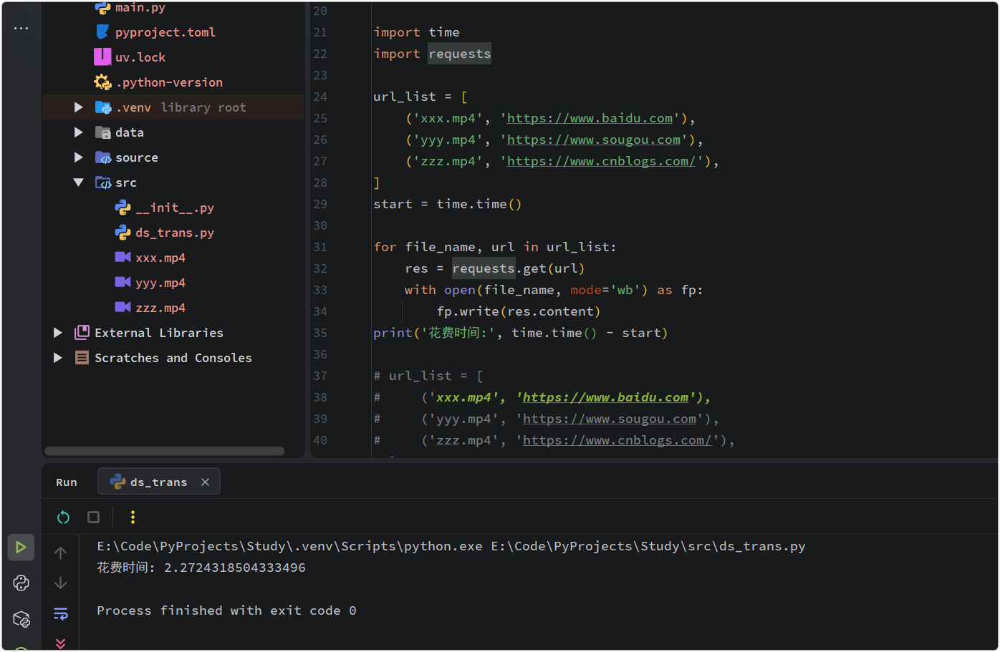

通过 进程 和 线程 都可以将串行的程序变为 并发，对于上述示例来说都是同时下载三个视频，这样很短的时间内就可以下载完成。

### 1.1.1 多线程

基于多线程对上述串行示例代码进行优化：

```python
import time
import requests
import threading

url_list = [
    ('xxx.mp4', 'https://www.baidu.com'),
    ('yyy.mp4', 'https://www.sougou.com'),
    ('zzz.mp4', 'https://www.cnblogs.com/'),
]


def task(file_name, video_url):
    res = requests.get(video_url)
    with open(file_name, mode='wb') as fp:
        fp.write(res.content)


start = time.time()

for name, url in url_list:
    # 创建线程，让每个线程都去执行 task 函数（参数不同）
    t = threading.Thread(target=task, args=(name, url))
    t.start()
print('花费时间:', time.time() - start)
```

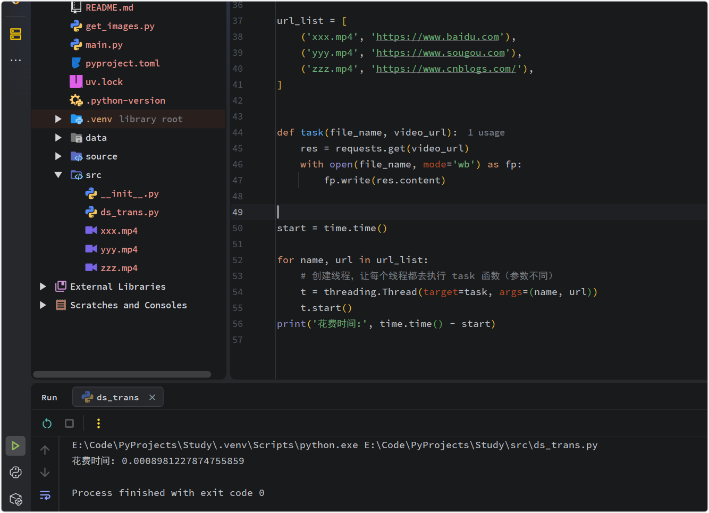

### 1.1.2 多进程

```python
import time
import requests
import multiprocessing

url_list = [
    ('xxx.mp4', 'https://www.baidu.com'),
    ('yyy.mp4', 'https://www.sougou.com'),
    ('zzz.mp4', 'https://www.cnblogs.com/'),
]


def task(file_name, video_url):
    res = requests.get(video_url)
    with open(file_name, mode='wb') as fp:
        fp.write(res.content)
    print(file_name, time.time())


if __name__ == '__main__':
    print('开始:', time.time())
    for name, url in url_list:
        # 进程创建之后，还会在进程中创建一个线程
        process = multiprocessing.Process(target=task, args=(name, url))
        process.start()
```

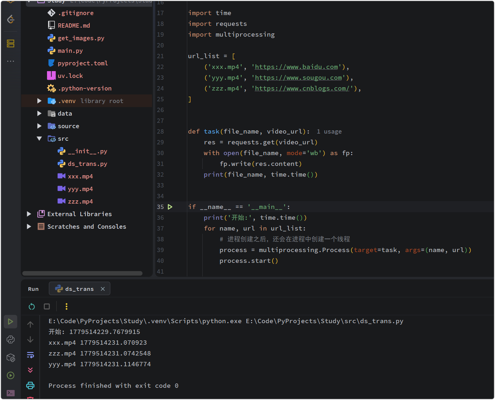

### 1.1.3 小结

多进程的开销比多线程要大。

## 1.2 GIL 锁

GIL，全局解释器锁（Global Interpreter Lock），是Cpython解释器特有的，让一个就进城中同一时刻只能有一个线程可以被CPU调用。

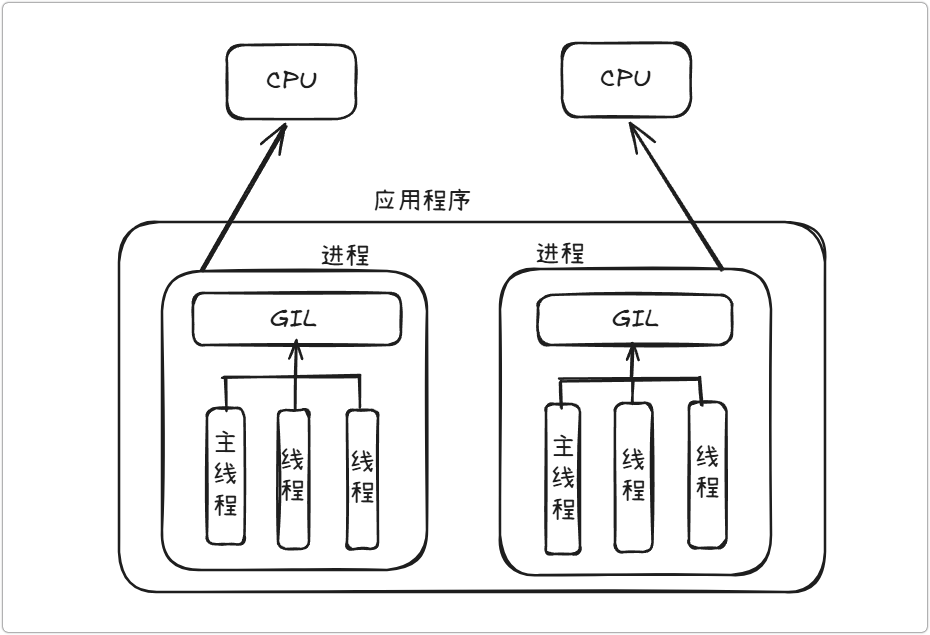

如果程序想利用计算机的多核优势，让CPU同时处理一些任务，适合用多进程开发（即使资源开销大）。

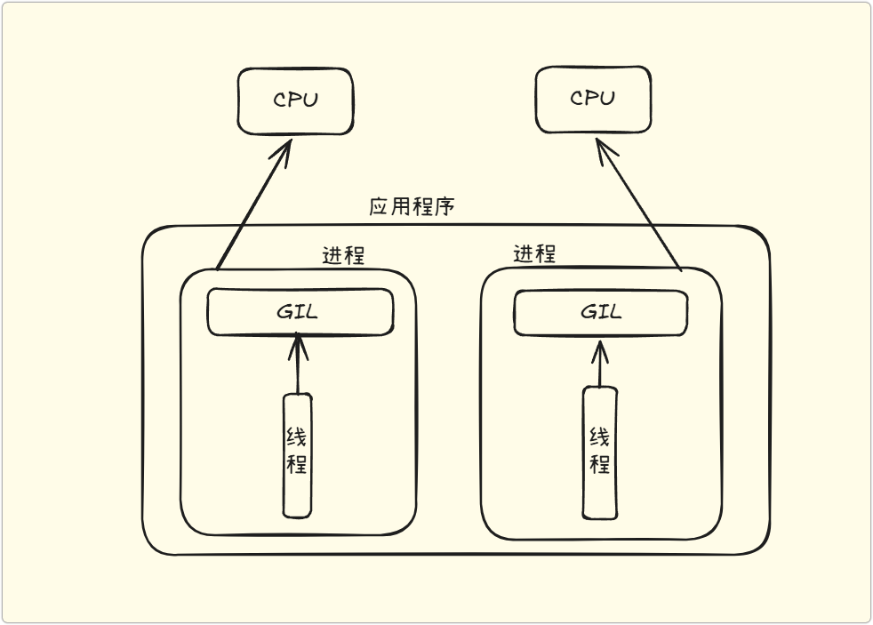

如果不利用计算机的多核优势，适合用多线程开发

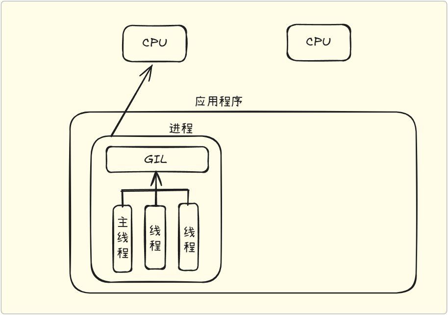

常见的程序开发中，计算机需要使用CPU多核优势，IO操作不需要利用CPU的多核优势，所以就有一句话：

- 计算密集型，用多进程，例如：大量的数据计算
- IO密集型，用多线程，例如：文件读写、网络数据传输

1. 计算密集型示例
   ```python
   # 串行处理
   import time
   
   start = time.time()
   
   res = 0
   for i in range(100000000):
   	res += i
   print(res)  # 4999999950000000
   
   print('耗时：', time.time() - start)  # 耗时： 4.250277996063232
   ```

   ```python
   # 多进程处理
   
   import time
   import multiprocessing
   
   
   def task(start, end, queue):
       res = 0
       for i in range(start, end):
           res += i
       queue.put(res)
   
   
   if __name__ == '__main__':
       queue = multiprocessing.Queue()
   
       start = time.time()
   
       # 100000000 / 2 = 50000000
       p1 = multiprocessing.Process(target=task, args=(0, 50000000, queue))
       p1.start()
   
       p2 = multiprocessing.Process(target=task, args=(50000000, 100000000, queue))
       p2.start()
   
       v1 = queue.get(block=True)
       v2 = queue.get(block=True)
       print(v1 + v2)  # 4999999950000000
       print('耗时：', time.time() - start)  # 耗时： 1.3907618522644043
   ```

2. IO密集型示例
   ```
   import time
   import requests
   import threading
   
   url_list = [
       ('xxx.mp4', 'https://www.baidu.com'),
       ('yyy.mp4', 'https://www.sougou.com'),
       ('zzz.mp4', 'https://www.cnblogs.com/'),
   ]
   
   
   def task(file_name, video_url):
       res = requests.get(video_url)
       with open(file_name, mode='wb') as fp:
           fp.write(res.content)
   
   
   start = time.time()
   
   for name, url in url_list:
       # 创建线程，让每个线程都去执行 task 函数（参数不同）
       t = threading.Thread(target=task, args=(name, url))
       t.start()
   print('花费时间:', time.time() - start)
   ```

当然，在程序开发过程中，多线程和多进程可以结合使用，例如：创建两个进程（建议与CPU个数相同），每个进程中创建3个线程

```python
import multiprocessing
import threading

def thread_task():
    pass


def task(start, end):
    t1 = threading.Thread(thread_task)
    t1.start()
    
    t2 = threading.Thread(thread_task)
    t2.start()
    
    t3 = threading.Thread(thread_task)
    t3.start()

    
if __name__ == '__main__':
    p1 = multiprocessing.Process(target=task, args=(0, 50000000))
    p1.start()

    p2 = multiprocessing.Process(target=task, args=(50000000, 100000000))
    p2.start()

```

## 1.3 多线程开发

```python
import threading

def task(arg):
    pass


# 创建一个 Thread 对象(线程)，并封装线程被CPU调度时应该执行的任务和关键参数
t = threading.thread(target=task, args=('xxx',))

# 线程准备就绪（等待 CPU 调度），代码继续向下执行
t.start()

print('继续执行...')  # 主线程执行完全部代码，不结束（等待子线程）
```

线程的常见方法：

- `t.start()`，当前线程准备就绪（等待CPU调度，具体时间由CPU来决定） -- 多次运行以下的代码 会发现每次输出的值是不同的

  ```python
  import threading
  
  loop = 100000000
  number = 0
  
  
  def _add(count):
      global number
      for i in range(count):
          number += 1
  
  t = threading.Thread(target=_add, args=(loop,))
  t.start()
  
  print(number)
  ```

- `t.join()`，等待当前线程的任务执行完毕后再向下继续执行

  ```python
  import threading
  
  number = 0
  
  def _add():
      global number
      for i in range(100000000):
          number += 1
          
  t = threading.Thread(target=_add)
  t.start()
  
  t.join()  # 主线程等待子线程中
  print(number)
  ```

  ```python
  import threading
  
  number = 0
  
  def _add():
      global number
      for i in range(100000000):
          number += 1
  
  
  def _sub():
      global number
      for i in range(100000000):
          number -= 1
          
          
  t1 = threading.Thread(target=_add)
  t2 = threading.Thread(target=_sub)
  
  t1.start()
  t1.join()  # t1 线程执行完毕，才继续往后走
  
  t2.start()
  t2.join()  # t2 线程执行完毕，才继续往后走
  
  print(number)     
  
  ```

  ```python
  import threading
  
  number = 0
  loop = 100000000
  
  def _add(count):
      global number
      for i in range(count):
          number += 1
  
  
  def _sub(count):
      global number
      for i in range(count):
          number -= 1
          
          
  t1 = threading.Thread(target=_add, args=(loop,))
  t2 = threading.Thread(target=_sub, args=(loop,))
  
  t1.start()
  t2.start()
  t1.join()  # t1 线程执行完毕，才继续往后走
  t2.join()  # t2 线程执行完毕，才继续往后走
  
  print(number)   # 这个 number 是多少是不确定的 -- 因为 number 的 +1操作 和 -1操作 没有原子化 
  ```

- `t.setDaemon(布尔值)`，守护线程（必须放在start之前）

  - `t.setDaemon(True)`，设置为守护线程，主线程执行完毕之后，子线程也自动关闭

  - `t.setDaemon(False)`，设置为非守护线程，主线程等待子线程，子线程执行完毕之后，主线程才结束（默认）

    ```python
    import threading
    import time
    
    def task(arg):
        time.sleep(1)
        print('任务')
    
        
    t = threading.Thread()
    # # t.setDaemon(True)  # 主线程结束之后马上终止主线程(子线程也立即终止)，不等待子线程完成
    # # 注意：Python3.10之后setDaemon方法已被弃用 现在直接设置属性即可
    t.daemon = True
    t.start()
    
    print('END')
    ```

- 线程名称的设置和获取
  ```python
  import threading
  
  
  def task(arg):
      # 获取当前执行此代码的线程
      name = threading.current_thread().name  # .getName方法已被弃用
      print(name)
  
  
  for i in range(10):
      t = threading.Thread(target=task, args=(11,))
      # 注意必须在 start 之前设置线程名
      t.name = f'线程巴拉巴拉-{i}'  # .setName方法已被弃用
      t.start()
  ```

- 自定义线程类,直接将线程需要做的事放到run方法中
  ```python
  import threading
  
  
  class MyThread(threading.Thread):
      def run(self):
          print('执行此线程', self._args)
  
  
  t = MyThread(args=(11, 22,))
  t.start()
  
  # 执行此线程 (11, 22)
  ```

  ```python
  import threading
  import requests
  
  
  class DownloadVideoExampleThread(threading.Thread):
      def run(self):
          file_name, url = self._args
          res = requests.get(url)
          with open(file_name, 'wb') as fp:
              fp.write(res.content)
  
  
  url_list = [
      ('xxx.mp4', 'https://www.baidu.com'),
      ('yyy.mp4', 'https://www.sougou.com'),
      ('zzz.mp4', 'https://www.cnblogs.com/'),
  ]
  
  for item in url_list:
      t = DownloadVideoExampleThread(args=item)
      t.start()
  ```

## 1.4 线程安全

### 1.4.1 线程安全

一个进程中可以有多个线程，且线程共享所有进程中的资源

多个线程同时去操作一个"东西"，可能会存在数据混乱的情况，例如：

```python
import threading

number = 0
loop = 100000000

def _add(count):
    global number
    for i in range(count):
        number += 1


def _sub(count):
    global number
    for i in range(count):
        number -= 1
        
        
t1 = threading.Thread(target=_add, args=(loop,))
t2 = threading.Thread(target=_sub, args=(loop,))

t1.start()
t2.start()
t1.join()  # t1 线程执行完毕，才继续往后走
t2.join()  # t2 线程执行完毕，才继续往后走

print(number)   # 这个 number 是多少是不确定的 -- 因为 number 的 +1操作 和 -1操作 没有原子化 
```

如何解决上述问题 -- 加锁

```python
import threading

number = 0
loop = 10000
lock = threading.RLock()


def _add(count):
    lock.acquire()  # 申请锁
    global number
    for i in range(count):
        number += 1
    lock.release()  # 释放锁


def _sub(count):
    lock.acquire()
    global number
    for i in range(count):
        number -= 1
    lock.release()


t1 = threading.Thread(target=_add, args=(loop,))
t2 = threading.Thread(target=_sub, args=(loop,))

t1.start()
t2.start()

t1.join()  # t1 线程执行完毕，才继续往后走
t2.join()  # t2 线程执行完毕，才继续往后走

print(number)
```

示例：

```python
import threading

import threading

num = 0


def task():
    global num
    for _ in range(10000000000):
        num += 1
    print(num)


for i in range(2):
    t = threading.Thread(target=task)
    t.start()
```

```python
import threading

num = 0
lock = threading.RLock()


def task():
    lock.acquire()  # 手动加锁释放锁
    global num
    for _ in range(10000):
        num += 1
    lock.release()
    print(num)


for i in range(2):
    t = threading.Thread(target=task)
    t.start()
```

```python
import threading

num = 0


def task():
    with threading.RLock() as lock:  # 上下文管理器用于加锁和释放锁
        global num
        for _ in range(10000):
            num += 1
    print(num)


for i in range(2):
    t = threading.Thread(target=task)
    t.start()
```

在开发的过程中，注意有些操作默认是线程安全的（内部集成了锁的机制），我们在使用时无需再通过锁处理，例如：

```python
import threading

data_list = []

lock = threading.RLock()


def task():
    print('开始')
    for i in range(10000):
        data_list.append(i)  # 这个操作是线程安全的
    print(len(data_list))


for i in range(2):
    t = threading.Thread(target=task)
    t.start()

```

官网：

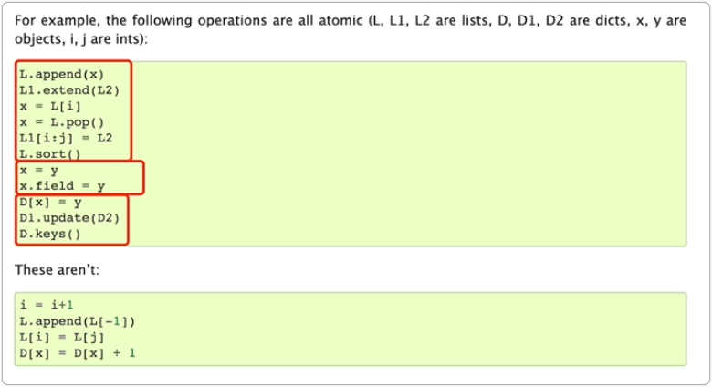


所以要多注意一些开发文档中是否标明线程安全。

### 1.4.2 补充 -- 智谱清言关于线程安全操作的解释（AI生成）

> [本地文件: thread_Safe_Operate](E:\Notes\markdowns\Python\MultiProcess_and_multiThread\thread_Safe_Operate.md)

## 1.5 线程锁

在程序中如果想要自己手动加锁，一般有两种：`Lock`和`RLock`

- `Lock` 同步锁 -- 不支持锁的嵌套

  ```python
  import threading
  
  number = 0
  lock = threading.Lock()
  
  
  def task():
      global number
  
      lock.acquire()
      for _ in range(100000):
          number += 1
      lock.release()
  
      print(number)
  
  
  for i in range(2):
      t = threading.Thread(target=task)
      t.start()
  ```

- `RLock` 递归锁 -- 支持锁的嵌套 -- 可重入的锁

  ```python
  import threading
  
  number = 0
  lock = threading.RLock()
  
  
  def task():
      global number
  
      lock.acquire()
      for _ in range(100000):
          number += 1
      lock.release()
  
      print(number)
  
  
  for i in range(2):
      t = threading.Thread(target=task)
      t.start()
  ```

`RLock`支持多次申请锁和多次释放，Lock不支持，例如：

```python
import threading
import time

lock = threading.RLock()


def task():
    lock.acquire()
    lock.acquire()
    print(123)
    lock.release()
    lock.release()


for i in range(2):
    t = threading.Thread(target=task)
    t.start()
```

```python
import threading
import time

lock = threading.RLock()


def task():
    lock.acquire()
    lock.acquire()
    print(123)
    lock.release()
    lock.release()


for i in range(2):
    t = threading.Thread(target=task)
    t.start()
```

## 1.6 死锁

死锁，由于竞争资源或者由于彼此通信而造成的一种阻塞现象

```python
import threading
import time

lock = threading.Lock()


def task():
    # 第一个抵达的线程进入并上锁，其他线程就需要在此等待
    lock.acquire() 
    # 第一个抵达的线程又要申请锁，但是此时锁已经被第一个线程拿到了，那么第一个线程就会一直等待有进程能释放(啥也不干，就硬等) -- 导致死锁
    lock.acquire()  
    print(123)
    lock.release()
    lock.release()


for i in range(2):
    t = threading.Thread(target=task)
    t.start()
```

```python
import threading
import time

lock1 = threading.Lock()
lock2 = threading.Lock()


def task1():
    lock1.acquire() 
    time.sleep(1)
    lock2.acquire()
    print(11)
    lock2.release()
    print(111)
    lock1.release()
    print(1111)

    
def task2():
    lock2.acquire() 
    time.sleep(1)
    lock1.acquire()
    print(22)
    lock1.release()
    print(222)
    lock2.release()
    print(2222)

t1 = threading.Thread(target=task1)
t1.start()

t2 = threading.Thread(target=task2)
t2.start()

# 上述代码可能产生死锁
```

## 1.7 线程池

`Python3`中官方才正式提供线程池

线程不是开的越多越好，开的多了可能会导致系统的性能更低了，例如：如下的代码是不推荐在项目开发中编写的


不建议：无限制地创建线程

```python
import threading

def task():
    pass

url_list = [f'https://www.baidu.com?page={i}' for i in range(300000)]
for url in url_list:
    t = threading.Thread(target=task, args=(url,))
    t.start()
```


建议: 使用线程池

- 示例1：
  ```python
  import time
  from concurrent.futures import ThreadPoolExecutor
  
  
  def task(video_url):
      print('开始执行任务', video_url)
      time.sleep(5)
  
  
  # 创建线程池 里面最多创建 max_workers 个线程
  pool = ThreadPoolExecutor(max_workers=10)
  
  url_list = [f'https://www.baidu.com?page={i}' for i in range(20)]
  
  for url in url_list:
      # 在线程池中提交一个任务，线程池如果有空闲进程，则分配一个线程去执行，执行完毕后再将线程交还给线程池，如果没有空闲线程，则等待
      pool.submit(task, url)
  
  print('END')
  ```

  ```python
  # 运行结果：
  开始执行任务 https://www.baidu.com?page=0
  开始执行任务 https://www.baidu.com?page=1
  开始执行任务 https://www.baidu.com?page=2
  开始执行任务 https://www.baidu.com?page=3
  开始执行任务 https://www.baidu.com?page=4
  开始执行任务 https://www.baidu.com?page=5
  开始执行任务 https://www.baidu.com?page=6
  开始执行任务 https://www.baidu.com?page=7
  开始执行任务 https://www.baidu.com?page=8
  开始执行任务END
   https://www.baidu.com?page=9
  开始执行任务开始执行任务 https://www.baidu.com?page=11开始执行任务 https://www.baidu.com?page=12
  
   https://www.baidu.com?page=10开始执行任务 
  https://www.baidu.com?page=13
  开始执行任务 开始执行任务 开始执行任务https://www.baidu.com?page=15https://www.baidu.com?page=14
   
  https://www.baidu.com?page=16
  开始执行任务开始执行任务 开始执行任务https://www.baidu.com?page=18  
  https://www.baidu.com?page=17https://www.baidu.com?page=19
  
  ```

  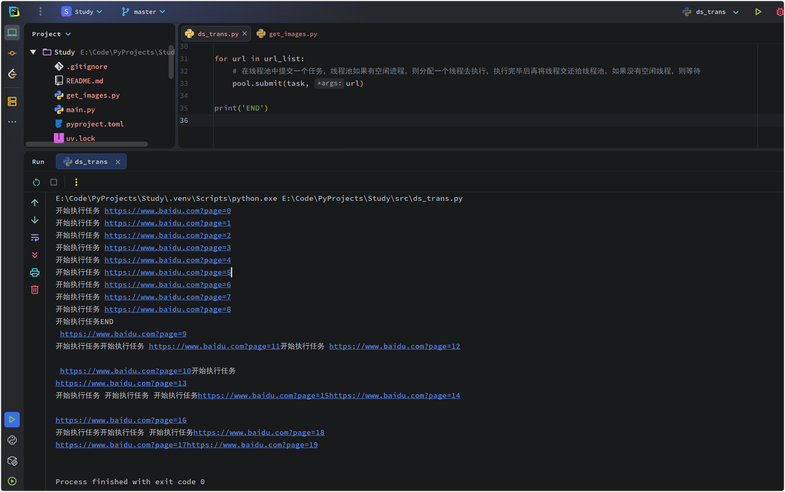

- 示例2：等待线程池的任务执行完毕
  ```python
  import time
  from concurrent.futures import ThreadPoolExecutor
  
  
  def task(video_url):
      print('开始执行任务', video_url)
      time.sleep(5)
  
  
  # 创建线程池 里面最多创建 max_workers 个线程
  pool = ThreadPoolExecutor(max_workers=10)
  
  url_list = [f'https://www.baidu.com?page={i}' for i in range(20)]
  
  for url in url_list:
      # 在线程池中提交一个任务，线程池如果有空闲进程，则分配一个线程去执行，执行完毕后再将线程交还给线程池，如果没有空闲线程，则等待
      pool.submit(task, url)
  
  print('【执行中...】')
  pool.shutdown(True)  # 等待线程池中的任务执行完毕后，再继续执行
  print('继续往下走')
  ```

  运行结果：

  ```python
  开始执行任务 开始执行任务https://www.baidu.com?page=0 
  https://www.baidu.com?page=1
  开始执行任务 https://www.baidu.com?page=2
  开始执行任务 https://www.baidu.com?page=3
  开始执行任务 https://www.baidu.com?page=4
  开始执行任务 https://www.baidu.com?page=5
  开始执行任务 https://www.baidu.com?page=6
  开始执行任务 https://www.baidu.com?page=7
  开始执行任务 https://www.baidu.com?page=8
  开始执行任务【执行中...】
   https://www.baidu.com?page=9
  开始执行任务开始执行任务开始执行任务  https://www.baidu.com?page=10 https://www.baidu.com?page=12
  https://www.baidu.com?page=11
  
  开始执行任务开始执行任务开始执行任务开始执行任务  https://www.baidu.com?page=13开始执行任务 开始执行任务  https://www.baidu.com?page=15https://www.baidu.com?page=16
  https://www.baidu.com?page=17https://www.baidu.com?page=18
  
  
  开始执行任务
   https://www.baidu.com?page=14
   https://www.baidu.com?page=19
  继续往下走
  ```

  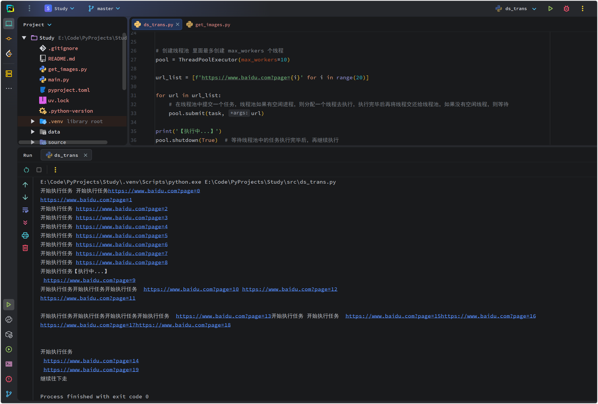

- 实例3：任务执行完毕后，再执行其他操作
  ```
  import time
  import random
  from concurrent.futures import ThreadPoolExecutor, Future
  
  
  def task(video_url):
      print('开始执行任务', video_url)
      time.sleep(2)
      return random.randint(0, 10)
  
  
  def done(response):
      print('线程创建后的返回值:', response.result)
  
  
  # 创建线程池 里面最多创建 max_workers 个线程
  pool = ThreadPoolExecutor(max_workers=10)
  
  url_list = [f'https://www.baidu.com?page={i}' for i in range(20)]
  
  for url in url_list:
      # 在线程池中提交一个任务，线程池如果有空闲进程，则分配一个线程去执行，执行完毕后再将线程交还给线程池，如果没有空闲线程，则等待
      future: Future = pool.submit(task, url)
      future.add_done_callback(done)
  
  # 可以做分工, 例如: task 专门下载,done 专门将下载的数据写入本地文件
  ```

- 示例4: 最终统一获取结果
  ```python
  import time
  import random
  from concurrent.futures import ThreadPoolExecutor, Future
  
  
  def task(video_url):
      print('开始执行任务', video_url)
      time.sleep(2)
      return random.randint(0, 10)
  
  
  future_list = []
  
  # 创建线程池 里面最多创建 max_workers 个线程
  pool = ThreadPoolExecutor(max_workers=10)
  
  url_list = [f'https://www.baidu.com?page={i}' for i in range(20)]
  
  for url in url_list:
      # 在线程池中提交一个任务，线程池如果有空闲进程，则分配一个线程去执行，执行完毕后再将线程交还给线程池，如果没有空闲线程，则等待
      future: Future = pool.submit(task, url)
      future_list.append(future)
  
  pool.shutdown(True)
  
  for fu in future_list:
      print(fu.result())
  ```

  运行结果:
  ```python
  开始执行任务 https://www.baidu.com?page=0
  开始执行任务 https://www.baidu.com?page=1
  开始执行任务 https://www.baidu.com?page=2
  开始执行任务 https://www.baidu.com?page=3
  开始执行任务 https://www.baidu.com?page=4
  开始执行任务 https://www.baidu.com?page=5
  开始执行任务 https://www.baidu.com?page=6
  开始执行任务 https://www.baidu.com?page=7
  开始执行任务 https://www.baidu.com?page=8
  开始执行任务 https://www.baidu.com?page=9
  开始执行任务 https://www.baidu.com?page=10
  开始执行任务开始执行任务开始执行任务 开始执行任务 https://www.baidu.com?page=11 开始执行任务开始执行任务 https://www.baidu.com?page=16 https://www.baidu.com?page=12
  
  https://www.baidu.com?page=13 
  https://www.baidu.com?page=15
  
  开始执行任务开始执行任务 https://www.baidu.com?page=18
  https://www.baidu.com?page=14开始执行任务
   https://www.baidu.com?page=19
   https://www.baidu.com?page=17
  6
  3
  9
  6
  1
  7
  10
  4
  10
  9
  4
  2
  9
  6
  10
  0
  2
  7
  2
  8
  ```

小案例: 基于线程池下载豆瓣的图片

```csv
# video.csv
26830711,用户名,https://xxxxx.com/ddjskoajdioasjdioajso-DSMG
...
```

```python
import os
import requests
from concurrent.futures import ThreadPoolExecutor


def download(file_name, image_url):
    res = request.get(
        url=image_url,
    	headers={...},
    )
    # 检查images目录是否存在,不存在的话创建images目录
    if not os.path.exists('images'):
        os.makedirs('images')
        
    file_path = os.path.join('images', file_name)
    
	# 将图片保存
    with open(file_path, 'wb') as fp:
        fp.write(res.content)


# 创建线程池 最多维护 10 个线程
pool = ThreadPoolExecutor(10)

with open('video.csv', mode='r', encoding='utf-8') as fp:
    for line in fp:
        nid,name,url = line.split(',')
        file_name = f'{name}.png'
        pool.submit(download, file_name, url)
    
```

```python
import os
import requests
from concurrent.futures import ThreadPoolExecutor


def download(image_url):
    res = requests.get(
        url=image_url,
        headers={...},
    )
    return res


def outer(file_name):
    # 此处是 闭包 的知识点
    def save(response):
        res = response.result()
        # 检查images目录是否存在,不存在的话创建images目录
        if not os.path.exists('images'):
            os.makedirs('images')

        file_path = os.path.join('images', file_name)

        # 将图片保存
        with open(file_path, 'wb') as fp:
            fp.write(res.content)

    return save


# 创建线程池 最多维护 10 个线程
pool = ThreadPoolExecutor(10)

with open('video.csv', mode='r', encoding='utf-8') as fp:
    for line in fp:
        nid, name, url = line.split(',')
        file_name = f'{name}.png'
        future = pool.submit(download, url)
        future.add_done_callback(outer(file_name))
```

## 1.8 扩展(单例模式)

面向对象 + 多线程相关的一个面试题:以后项目和源码中可能会用到


之前写一个类,每次执行 `类名()` 都会实例化一个类的对象

```python
class Foo:
    pass


obj1 = Foo()
obj2 = Foo()

print(obj1, obj2)  # <__main__.Foo object at 0x000001CBB22B4980> <__main__.Foo object at 0x000001CBB2142C10>
```


- 简单的实现单例模式
  ```python
  class Singleton:
      instance = None
  
      def __init__(self, name):
          self.name = name
  
      def __new__(cls, *args, **kwargs):
          # 返回空对象
          if cls.instance:
              return cls.instance
          cls.instance = object.__new__(cls)
          return cls.instance
  
  
  obj1 = Singleton('computer')
  obj2 = Singleton('science')
  
  print(obj1, obj2)  # <__main__.Singleton object at 0x0000020663F54980> <__main__.Singleton object at 0x0000020663F54980>
  ```

- 单例模式在多线程的情况下会出问题
  ```python
  import threading
  import time
  
  
  class Singleton:
      instance = None
  
      def __init__(self, name):
          self.name = name
  
      def __new__(cls, *args, **kwargs):
          # 返回空对象
          if cls.instance:
              return cls.instance
          time.sleep(0.1)
          cls.instance = object.__new__(cls)
          return cls.instance
  
  
  def task():
      obj = Singleton('x')
      print(obj)
  ```

  运行结果: 我们会发现这样的话单例模式会失效 -- 可以加锁

  ```python
  <__main__.Singleton object at 0x00000240EB1C5BE0>
  <__main__.Singleton object at 0x00000240EB052C10><__main__.Singleton object at 0x00000240EB16EC10><__main__.Singleton object at 0x00000240EB12BA80>
  
  <__main__.Singleton object at 0x00000240EB017E10><__main__.Singleton object at 0x00000240BFEA60F0>
  
  <__main__.Singleton object at 0x00000240EB0FCD10>
  
  <__main__.Singleton object at 0x00000240EB0FCF30><__main__.Singleton object at 0x00000240C02A1250>
  <__main__.Singleton object at 0x00000240EB0F0A50>
  ```

  加锁:

  ```python
  import threading
  import time
  
  lock = threading.RLock()
  
  
  class Singleton:
      instance = None
  
      def __init__(self, name):
          self.name = name
  
      def __new__(cls, *args, **kwargs):
          with lock:
              # 返回空对象
              if cls.instance:
                  return cls.instance
              time.sleep(0.1)
              cls.instance = object.__new__(cls)
              return cls.instance
  
  
  def task():
      obj = Singleton('x')
      print(obj)
  
  
  for i in range(10):
      t = threading.Thread(target=task)
      t.start()
  ```

- 还可以优化:  
  ```python
  import threading
  
  
  class Singleton:
      instance = None
      lock = threading.RLock()
  
      def __init__(self, name):
          self.name = name
  
      def __new__(cls, *args, **kwargs):
          with cls.lock:
              # 返回空对象
              if cls.instance:
                  return cls.instance
              cls.instance = object.__new__(cls)
              return cls.instance
  
  
  def task():
      obj = Singleton('x')
      print(obj)
  
  
  for i in range(10):
      t = threading.Thread(target=task)
      t.start()
  ```

- 还可以稍微优化一下性能
  ```python
  import threading
  
  
  class Singleton:
      instance = None
      lock = threading.RLock()
  
      def __init__(self, name):
          self.name = name
  
      def __new__(cls, *args, **kwargs):
          # 可以稍微提高性能 -- 如果在多线程以后想要再次使用这个单例,就可以减少一些加锁和释放锁的开销
          if cls.instance:
              return cls.instance
          with cls.lock:
              # 返回空对象
              if cls.instance:
                  return cls.instance
              cls.instance = object.__new__(cls)
              return cls.instance
  
  
  def task():
      obj = Singleton('x')
      print(obj)
  
  
  for i in range(10):
      t = threading.Thread(target=task)
      t.start()
  
  # 1000 行代码
  
  obj = Singleton('y')
  print(obj)
  ```

## 1.9 总结


# day-02 进程

今日概要:

- 多进程开发
- 进程之间的数据共享
- 进程锁
- 进程池
- 协程

## 1.1 多进程开发

进程是计算机中资源分配最小的单位,一个进程中可以有多个线程,同一个进程中的线程共享资源

进程与进程之间则是相互隔离

`Python` 中通过多进程可以利用CPU的多核优势,计算密集型操作适用于多进程.

### 1.1.1 进程介绍

```python
import multiprocessing

def task():
    pass

if __name__ == '__main__':
    p = multiprocessing.Process(target=task)
    p.start()
```

```python
import multiprocessing

def task(arg):
    pass

def run():
    p = multiprocessing.Process(target=task, args=('xxx',))
    p.start()

if __name__ == '__main__':
    run()
```


关于主进程和子进程:

每个python脚本运行时会创建一个进程(主进程),如果我们手动创建子进程:

- **fork 方法 **创建子进程: **子进程几乎拷贝父进程的所有资源** -- 子进程里面对资源的操作和主进程对资源的操作互不影响; 另外, 文件对象/线程锁等资源既会拷贝,又可以通过参数传递. 
  **以下的示例全都在`Linux`上运行(`fork`模式)**

  - 示例1
    ```python
    # Linux 系统上
    
    import multiprocessing
    
    
    def task():
        print(name)  # [] --> 注意:主进程中的name和子进程中的name是两份数据!!!
        
    
    name = []
    
    p = multiprocessing.Process(target=task)
    p.start()  
    ```

    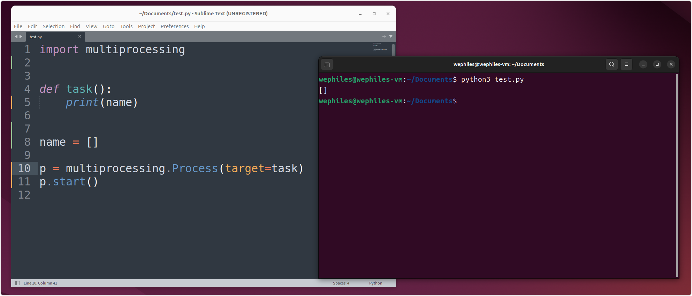

  - 示例2
    ```python
    import multiprocessing
    import time
    
    def task():
        name.append(123)
        
    
    name = []
    
    p = multiprocessing.Process(target=task)
    p.start()
    
    time.sleep(2)  # 为了确保子进程已执行完毕(确保 name.append(123) 已运行), 这样才能看出来子进程和主进程的name列表是两份
    
    print(name)  # []
    ```

    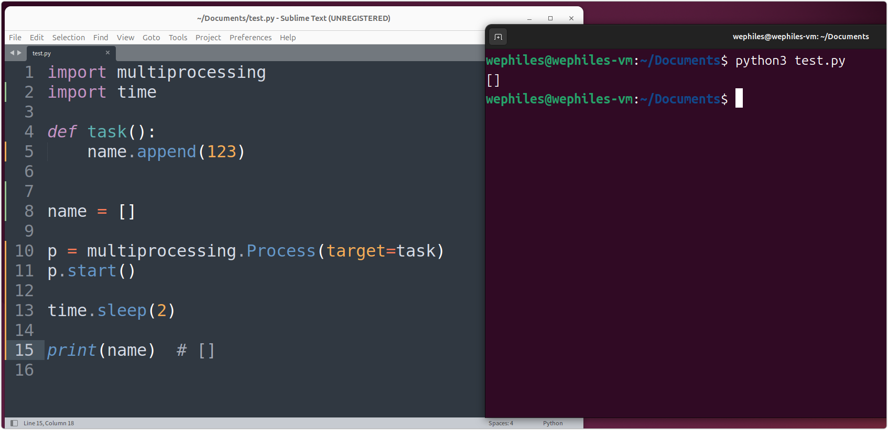

  - 示例3
    ```python
    import multiprocessing
    import time
    
    
    def task():
        print('子进程:', name)
    
    
    name = []
    name.append(123)
    
    # 创建子进程 -- 从主进程拷贝过来几乎所有资源
    p = multiprocessing.Process(target=task)
    p.start()
    
    time.sleep(2)
    print('主进程:', name)
    ```

    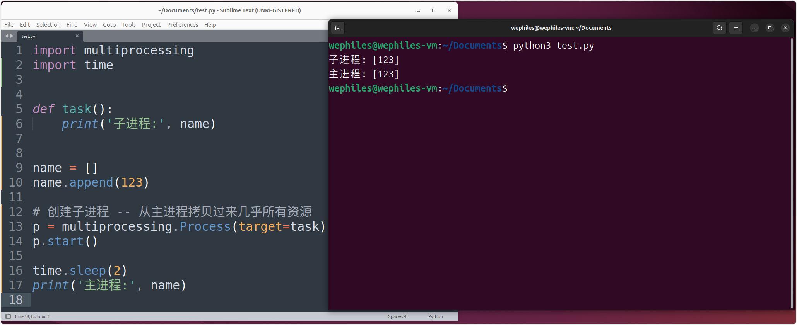

  - 案例4
    ```python
    import multiprocessing
    import time
    
    
    def task():
        print('子进程:', name)  # []
    
    
    name = []
    
    p = multiprocessing.Process(target=task)
    p.start()
    
    name.append(123)
    
    time.sleep(2)
    print('主进程:', name)  # [123]
    ```

    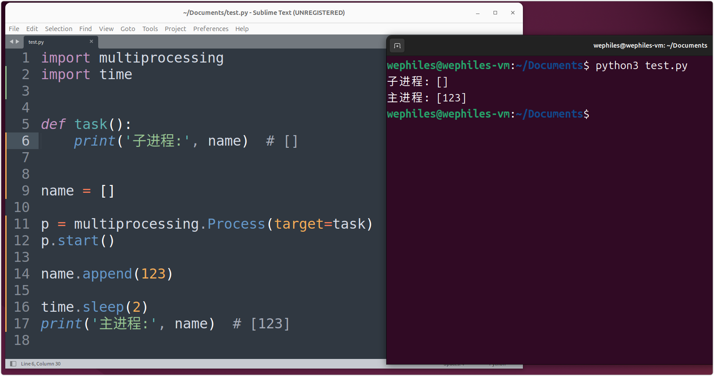

- `spawn`模式创建子进程: 不会拷贝主进程的资源 需要手动去传输一些必备的值, ⚠️⚠️⚠️**注意:spawn下对于一些特殊的(文件对象/锁),子进程不会拷贝这些对象，与此同时通过参数传递也不可以!!! -- 需要自己去子进程中再去重新创建一遍！**⚠️⚠️⚠️
  **以下示例全部都在Windows环境下测试:**

  - 示例1
    ```python
    import multiprocessing
    
    
    def task():
        print(name)
    
    
    if __name__ == '__main__':
        name = []
    
        p = multiprocessing.Process(target=task)
        p.start()
    ```

    这样会报错:
    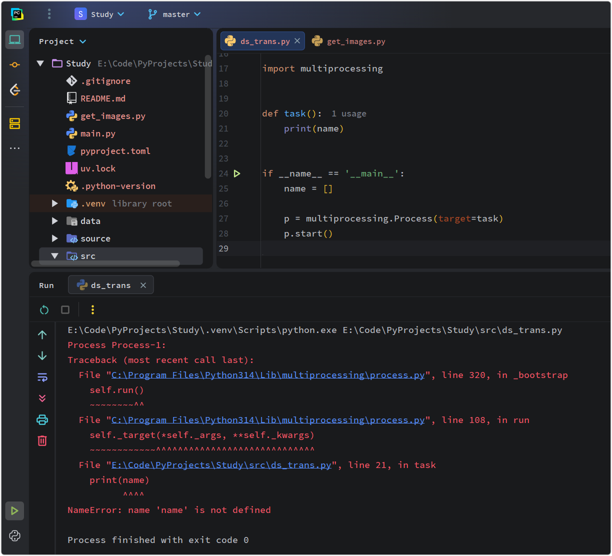

  - 示例2: 需要手动去传递资源
    ```python
    import multiprocessing
    
    
    def task(data):
        print(data)
    
    
    if __name__ == '__main__':
        name = []
    
        p = multiprocessing.Process(target=task, args=(name,))
        p.start()
    ```

    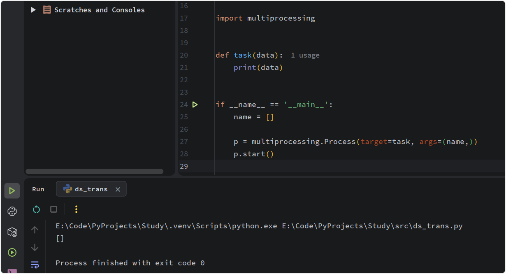

  - 示例3: 当通过参数传递过去后,也是复制一份(主进程和子进程也是两份数据)
    ```python
    import multiprocessing
    import time
    
    
    def task(data):
        print('son:', data)
        data.append(999)
    
    
    if __name__ == '__main__':
        name = []
    
        p = multiprocessing.Process(target=task, args=(name,))
        p.start()
    
        time.sleep(2)
    
        print('main:', name)
    ```

  - 示例4
    ```python
    import multiprocessing
    import time
    
    
    def task(fp, l):
        print(fp, l)
    
    
    if __name__ == '__main__':
        file_obj = open('a.txt')
        lock = multiprocessing.RLock()
    
        p = multiprocessing.Process(target=task, args=(file_obj, lock,))
        p.start()
    
        time.sleep(2)
        file_obj.close()
    ```

    报错：
    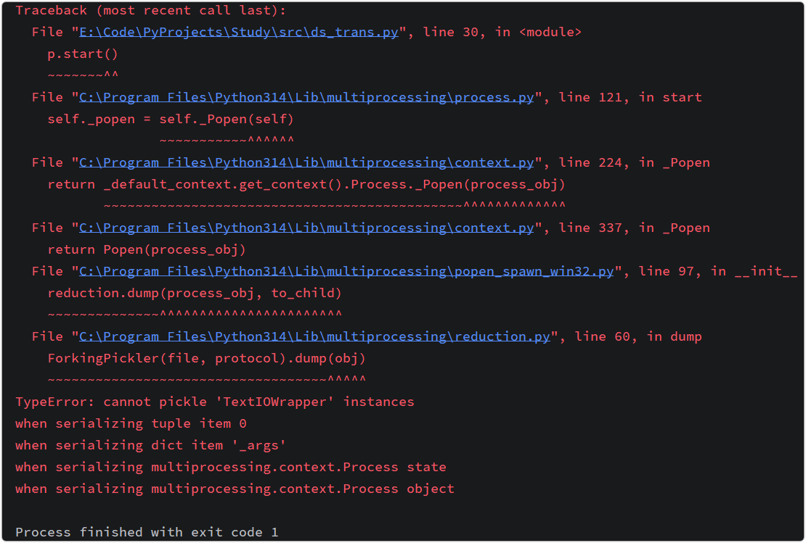

- forkserver -- 和 spqwn 一样,通过run方法去完成

------

### 1.1.2 补充:

关于在 `Python` 中基于 `multiprocessing` 模块操作的进程:

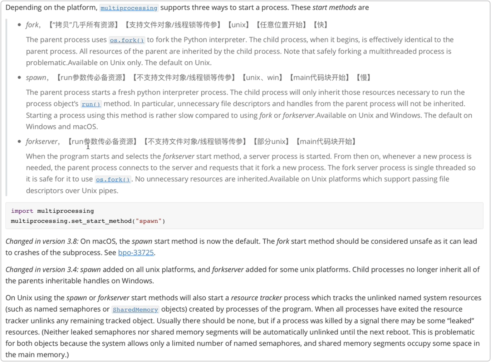

官方文档: https://docs.python.org/zh-cn/3.14/library/multiprocessing.html

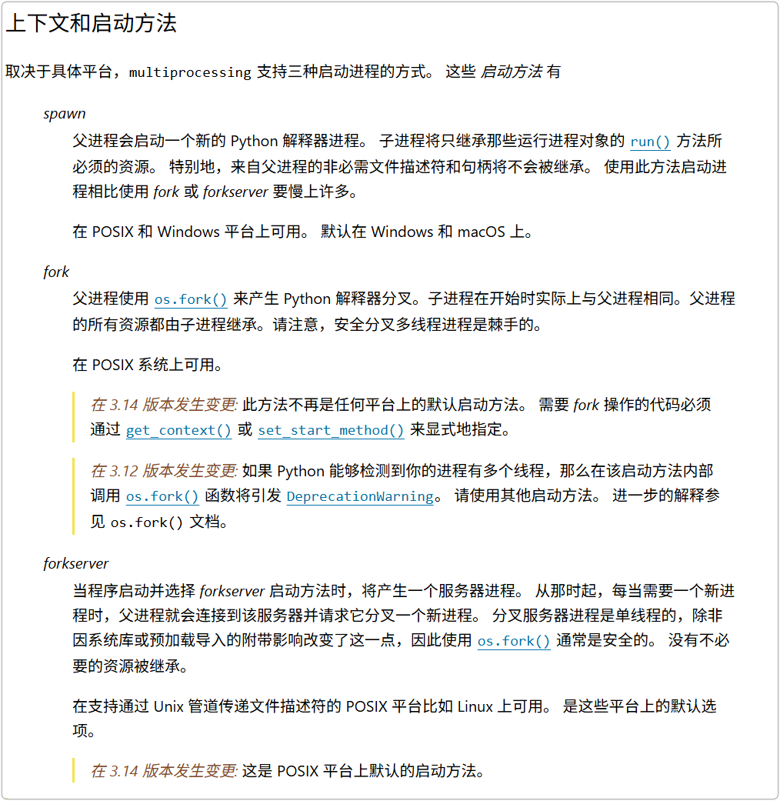

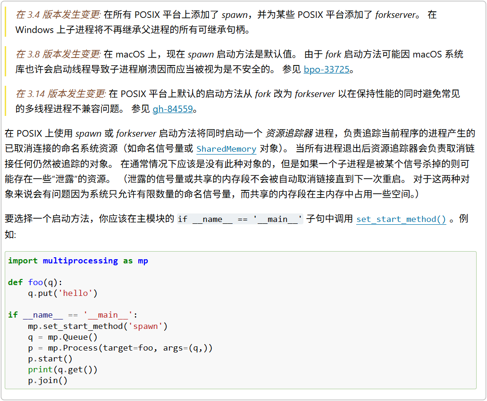

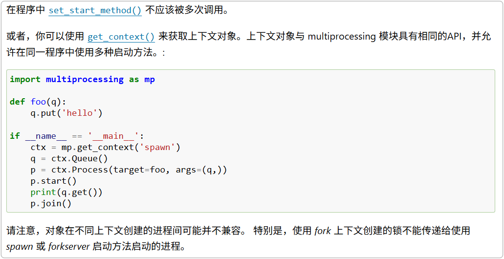

### 1.1.3 案例

案例1：

```python
# Linux(fork)

import multiprocessing
import time


def task():
    print(name)

    # 此时 file_object 已经写入了 abc\n
    file_object.write('def\n')  # 又写入了 def\n --> 现在子进程的进程空间中已经写入了 abc\ndef\n
    file_object.flush()  # 刷入硬盘  --> 硬盘中已经写入了 abc\ndef\n


if __name__ == '__main__':
    name = []
    file_object = open('x.txt', 'a+', encoding='utf-8')  
    file_object.write('abc\n')  # 写入内存，主进程在自己的进程空间（内存）中写入abc\n

    p = multiprocessing.Process(target=task,)  # 创建子进程，子进程完全拷贝主进程 转到 task 函数
    p.start()

    # 子进程结束后，task 函数结束，转到主进程，主进程在结束之间还会将自己的进程空间里的内容写入磁盘：将 abc\n 刷入磁盘
	
```

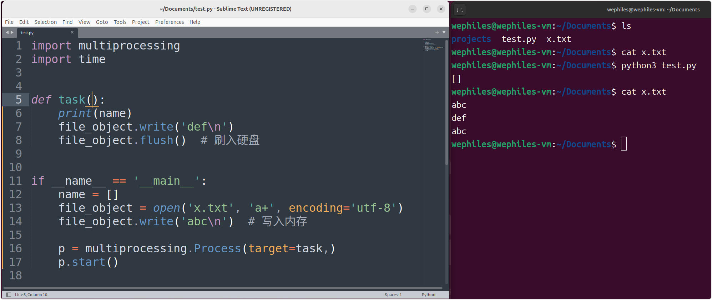

案例2：

```python
import multiprocessing
import time


def task():
    print(name)
    file_object.write('def\n')
    file_object.flush()


if __name__ == '__main__':
    name = []
    file_object = open('x.txt', 'a+', encoding='utf-8')  
    file_object.write('abc\n')
    file_object.flush()  # 刷入磁盘后，主进程释放进程空间

    p = multiprocessing.Process(target=task,)
    p.start()
```

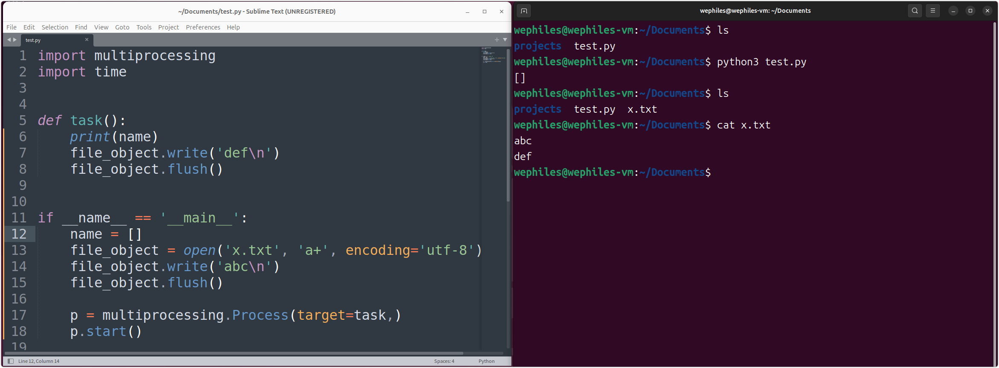

案例3：

```python
import time
import threading
import multiprocessing


def task():
    # 拷贝的锁是被申请走的状态
    # 问题：被谁申请走了呢？
    # 	被子进程中的主线程申请走了
    print(lock)
    
    # with lock:
    #     print('执行中...')
    
    # 如果将上面两行改成下面这两行后：print(666) 是可以执行的 -- 因为 lock 会锁住除了主线程之外的线程！！！
    lock.acquire()
	print(666)  # 这一句是可以执行的 -- 因为我们用的是 RLock

if __name__ == '__main__':
    name = []
    lock = threading.RLock()
    print('acquire前:', lock)
    lock.acquire()  # 申请锁 -- 被主进程中的主线程申请走了
    print('acquire后:', lock)

    p = multiprocessing.Process(target=task,)
    p.start()
```

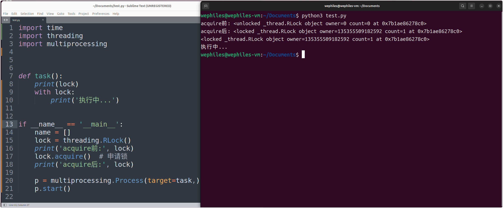

## 1.2 常用功能

进程的常见方法：

- `p.start()` 当前进程准备就绪，等待被CPU调度（工作单元其实是进程中的线程）

- `p.join()` 等待当前进程的任务执行完毕后再向下继续执行

  ```python
  # spawn:
  
  import time
  from multiprocessing import Process
  
  def task(arg):
      time.sleep(2)
      print('执行中...')
      
      
  if __name__ == '__main__':
      p = Process(target=task, args=('xxx',))
      p.start()
      p.join()
      
      print('继续执行...')
  ```

- `p.daemon = 布尔值`  ，守护进程（必须放在 start 之前）

  - `p.daemon = True` 设置为守护进程，主进程执行完毕之后，子进程也会关闭
  - `p.daemon = False` 设置为非守护进程，主进程等待子进程，子进程执行完毕后，主进程才结束

  ```python
  import time
  from multiprocessing import Process
  
  
  def task(arg):
      time.sleep(2)
      print('执行中...')
  
  
  if __name__ == '__main__':
      p = Process(target=task, args=('xxx',))
      p.daemon = True
      p.start()
  
      print('继续执行')
  ```

- 进程的名称设置和获取
  ```python
  import time
  import multiprocessing 
  
  
  def task(arg):
      time.sleep(2)
      print('name:', multiprocessing.current_process().name)
  
  
  if __name__ == '__main__':
      p = multiprocessing.Process(target=task, args=('xxx',))
      p.name = '哈哈哈哈'
      p.start()
  ```

  ```python
  import os
  import time
  import threading
  import multiprocessing
  
  
  def func():
      time.sleep(1)
  
  
  def task(arg):
      for i in range(10):
          threading.Thread(target=func).start()
  
      print('当前进程内的线程个数:', len(threading.enumerate()))
      print('当前进程内的线程:', threading.enumerate()[0:3])
  
      print('son:', os.getpid())  # 获取进程号
      # 获取 父进程的 进程ID
      print('son->parent:', os.getppid())
      print('name:', multiprocessing.current_process().name)
  
  
  if __name__ == '__main__':
      print('main:', os.getpid())  # 获取进程号
      p = multiprocessing.Process(target=task, args=('xxx',))
      p.name = '哈哈哈哈'
      p.start()
  ```

  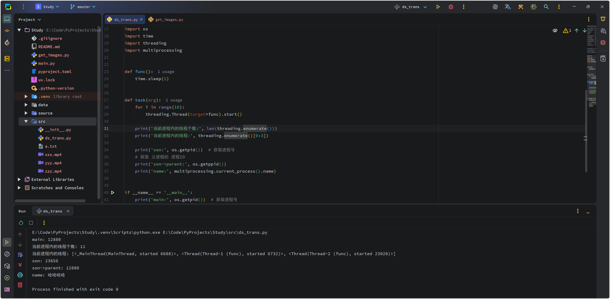

- 自定义进程类，直接将线程需要做的事写到run方法中
  ```python
  import multiprocessing
  
  
  class MyProcess(multiprocessing.Process):
      def run(self):
          print('执行此进程', self._args)
  
  
  if __name__ == '__main__':
      p = MyProcess(args=('xxx',))
      p.start()
      print('继续执行...')
  ```

- CPU个数 -- 一般 CPU 有几个核心，创建几个进程
  ```python
  import multiprocessing
  
  print(multiprocessing.cpu_count())
  ```

## 1.3 进程间数据的共享

进程是资源分配的最小单元，每个进程都维护自己独立的资源，不共享。

```python
import multiprocessing


def task(data):
    data.append(666)


if __name__ == '__main__':
    data_list = []
    p = multiprocessing.Process(target=task, args=(data_list,))
    p.start()
    p.join()
    
    print('主进程:', data_list)
```

如果想要让他们之间进行通信，则可以借助一些特殊的东西来实现。

### 1.3.1 共享内存


```python
from multiprocessing import Process, Value, Array


def func(n, m1, m2):
    n.value = 888
    m1.value = 'a'.encode('utf-8')
    m2.value = '数'
    
    
if __name__ == '__main__':
    num = Value('i', 666)
    v1 = Value('c')
    v2 = Value('u')
    
    p = Process(target=func, args=(num, v1, v2, ))
    p.start()
    p.join()
    
    print(num.value)  # 888
    print(v1.value)  # b'a'
    print(v2.value)  # '数'
```

```python
from multiprocessing import Process, Value, Array


def func(data_array):
    data_array[0] = 66666


if __name__ == '__main__':
    arr = Array('i', [1, 2, 3, 4])  # 和 C 中的数组一样，每个元素必须是 ‘i’(int) 并且长度不可变

    p = Process(target=func, args=(arr,))
    p.start()
    p.join()

    # <SynchronizedArray wrapper for <multiprocessing.sharedctypes.c_long_Array_4 object at 0x0000023B3762A440>>
    print(arr)
    
    print(arr[:])  # [66666, 2, 3, 4]
```

### 1.3.2 服务器进程


```python
from multiprocessing import Process, Manager


def func(d, l, s):
    d[1] = '1'
    d['2'] = 2
    d[0.25] = None
    l.reverse()
    s.add('a')
    s.add('b')

if __name__ == '__main__':
    with Manager() as manager:
        d = manager.dict()
        l = manager.list(range(10))
        s = manager.set()

        p = Process(target=func, args=(d, l, s))
        p.start()
        p.join()

        print(d)
        print(l)
        print(s)
```

输出结果：

```python
{1: '1', '2': 2, 0.25: None}
[9, 8, 7, 6, 5, 4, 3, 2, 1, 0]
{'a', 'b'}
```

### 1.3.3 交换

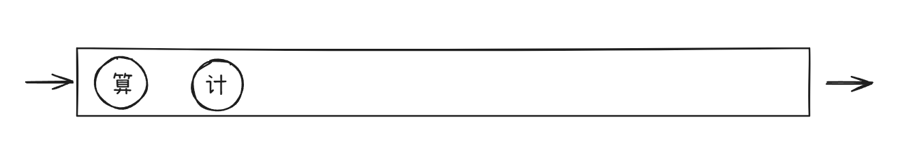


- **Queues**
  

  ```python
  from multiprocessing import Process, Queue
  
  
  def func(queue):
      queue.put([42, None, 'hello', 12.5])
  
  
  if __name__ == '__main__':
      # Queue 类几乎是 queue.Queue 类的克隆
      queue = Queue()
      p = Process(target=func, args=(queue,))
      p.start()
      print(queue.get())  # Queue 是线程安全的, 也是进程安全的, 任何放入多处理队列的对象都会被序列化。
      p.join()
  ```

  

- **Pipes**

  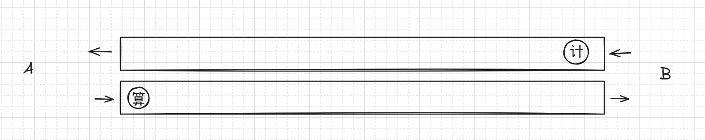

  ```python
  from multiprocessing import Process, Pipe
  
  def func(conn):
      conn.send([42, None, 'hello'])
      conn.close()
  
  if __name__ == '__main__':
      # Pipe（） 函数返回一对连接对象，这些对象通过默认为全双工（双向）管道连接。例如：
      parent_conn, child_conn = Pipe()
      p = Process(target=func, args=(child_conn,))
      p.start()
      print(parent_conn.recv())   # prints "[42, None, 'hello']" --> 阻塞 等待子进程发送数据
      p.join()
  ```

  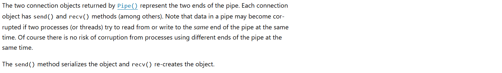

  ```python
  Pipe() 返回的两个连接对象代表管道的两端。每个连接对象都有 send() 和 recv() 方法（以及其他方法）。注意，如果两个进程（或线程）同时尝试从管道同一端读取或写入，管道中的数据可能会损坏。当然，同时使用管道不同端的进程不存在损坏风险。
  
  send() 方法序列化对象，recv() 重新创建对象。
  ```

上述都是 Python 内部提供的进程之间数据共享和交换的机制，作为了解即可，在项目开发中很少使用，后期项目中一般会借助第三方的一些工具来做资源的共享，比如：`MySQL`数据库、`redis`等。


## 1.4 进程锁

如果多个进程抢占式去做某个操作，为了防止操作出现问题，可以通过进程锁来避免。

```python
import time
from multiprocessing import Process, Value, Array, Lock


def func(n):
    n.value = n.value + 1


if __name__ == '__main__':

    num = Value('i', 0)
    for i in range(20):
        p = Process(target=func, args=(num,))
        p.start()
    time.sleep(1)
    print(num.value)  # 有时候打印 19，有时候打印 20
```

```python
import time
from multiprocessing import Process, Manager


def func(d):
    d[1] += 1


if __name__ == '__main__':
    with Manager() as manager:
        d = manager.dict()
        d[1] = 0
		
        procresses = []
        for i in range(20):
            p = Process(target=func, args=(d,))
            procresses.append(p)
            p.start()
        for p in procresses:
            p.join()
        time.sleep(1)
        print(d)
```

```python
import time
import multiprocessing

def task():
    # 假设文件中保存的内容就是一个值： 10
    with open('f1.txt', 'r', encoding='utf-8') as fp:
        current_num = int(fp.read())
        
    print('排队抢票了')
    time.sleep(1)
    
    current_num -= 1
    with open('f1.txt', 'w', encoding='utf-8') as fp:
        fp.write(str(current_num))
    

if __name__ == '__main__':
    for i in range(20):
        p = multiprocessing.Process(target=task,)
        p.start()

```

很显然，多进程在操作时就会出现问题，此时就需要锁介入

```python
import time
import multiprocessing


def task(lock):
    print('开始')
    lock.acquire()
    # 假设文件中保存的内容就是一个值： 10
    with open('f1.txt', 'r', encoding='utf-8') as fp:
        current_num = int(fp.read())

    print('排队抢票了')
    time.sleep(1)

    current_num -= 1
    with open('f1.txt', 'w', encoding='utf-8') as fp:
        fp.write(str(current_num))
    lock.release()


if __name__ == '__main__':
    lock = multiprocessing.RLock()  # 进程锁
    for i in range(20):
        p = multiprocessing.Process(target=task, args=(lock,))  # 进程锁是可以当参数传递进去的 但是线程锁不可以！！！
        p.start()
    
```

按照上面的操作在 mac 电脑上，spawn 启动方式有可能会报错，所以无论在什么情况下，应该像下面这样写：
```python
import time
import multiprocessing


def task(lock):
    print('开始')
    lock.acquire()
    # 假设文件中保存的内容就是一个值： 10
    with open('f1.txt', 'r', encoding='utf-8') as fp:
        current_num = int(fp.read())

    print('排队抢票了')
    time.sleep(1)

    current_num -= 1
    with open('f1.txt', 'w', encoding='utf-8') as fp:
        fp.write(str(current_num))
    lock.release()


if __name__ == '__main__':
    lock = multiprocessing.RLock()  # 进程锁
    processes = []
    for i in range(20):
        p = multiprocessing.Process(target=task, args=(lock,))  # 进程锁是可以当参数传递进去的 但是线程锁不可以！！！
        p.start()
        processes.append(p)
        
    for p in processes:
        p.join()
    
```


## 1.5 进程池

```python
import time
from concurrent.futures import ProcessPoolExecutor, ThreadPoolExecutor


def task(num):
    print('执行', num)
    time.sleep(2)


if __name__ == '__main__':
    pool = ProcessPoolExecutor(4)
    for i in range(10):
        pool.submit(task, i)
```

```python
import time
from concurrent.futures import ProcessPoolExecutor, ThreadPoolExecutor


def task(num):
    print('执行', num)
    time.sleep(2)


if __name__ == '__main__':
    pool = ProcessPoolExecutor(4)
    for i in range(10):
        pool.submit(task, i)
    # 等待进程池中的任务都执行完毕后，再继续往后执行
    pool.shutdown(True)
```

```python
import time
from concurrent.futures import ProcessPoolExecutor, ThreadPoolExecutor
import multiprocessing


def task(num):
    print('执行', num)
    time.sleep(2)
    return num


def done(response):
    print('done:', multiprocessing.current_process())
    time.sleep(1)
    print(response.result())
    time.sleep(1)


if __name__ == '__main__':
    pool = ProcessPoolExecutor(4)
    for i in range(10):
        future = pool.submit(task, i)
        future.add_done_callback(done)  # done 的调用由主进程处理(与线程池不同) 线程池：全部由子线程完成
    print('main:', multiprocessing.current_process())
    pool.shutdown(True)
```

注意：如果在进程池中要使用进程锁，则需要基于`Manager`中的`Lock`和`RLock`来实现

```python
import time
from concurrent.futures import ProcessPoolExecutor, ThreadPoolExecutor
import multiprocessing


def task(lock):
    print('开始')
    # lock.acquire()
    # lock.release()
    with lock:
        # 假设文件中保存的内容就是一个值： 10
        with open('f1.txt', 'r', encoding='utf-8') as fp:
            current_num = int(fp.read())

        print('排队抢票了')
        time.sleep(1)

        current_num -= 1
        with open('f1.txt', 'w', encoding='utf-8') as fp:
            fp.write(str(current_num))


if __name__ == '__main__':
    pool = ProcessPoolExecutor(4)
    # lock = multiprocessing.RLock()  # 不能使用
    manager = multiprocessing.Manager()
    lock = manager.RLock()
    for i in range(10):
        pool.submit(task, lock)
```

## 1.6 案例 - 计算每天用户访问情况

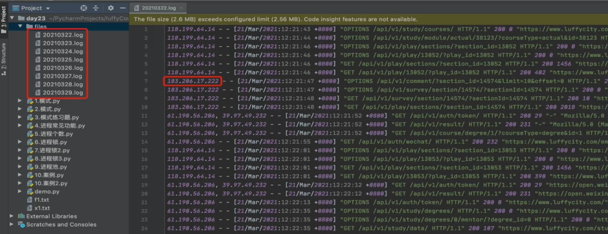

示例1：

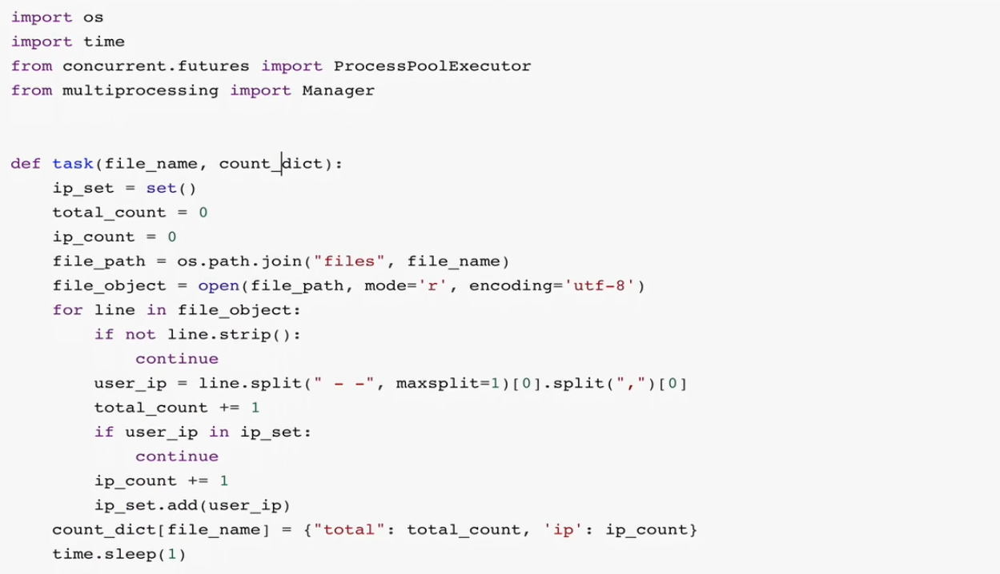

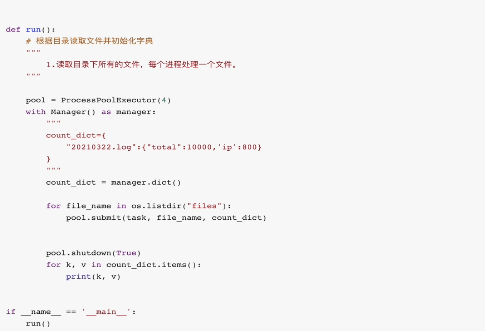

示例2：

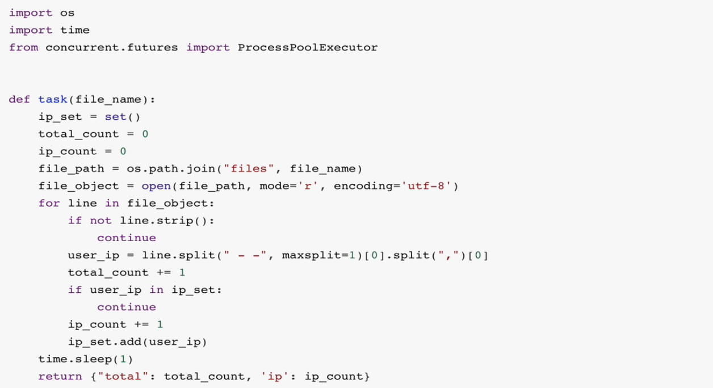

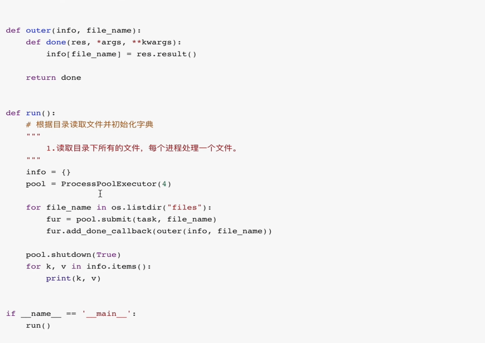

# day-03 协程

> 协程参考： https://zhuanlan.zhihu.com/p/137057192
>
> [asyncio到底是个啥？【python async await】](https://www.bilibili.com/video/BV1NA411g7yf)
>
> 刚开始学习爬虫时的协程相关的笔记：[单线程+异步协程](##单线程+异步协程)

暂时以了解为主。

计算机中提供了：线程、进程用于实现并发编程（真实存在）。

协程（Coroutine）：是程序员通过代码搞出来的一个东西（非真实存在）。

```python
协程也可以被称为微线程，是医用用户态内的上下文切换技术。
简而言之，其实就是通过一个线程实现代码快相互切换执行（来回跳着执行）。
```

例如：

```python
def func1():
    print(1)
    ...
    print(2)
    

def func2():
	print(3)
	...
    print(4)


func1()
func2()
```

上述代码是普通的函数定义和执行，按流程分别执行两个函数中的代码，并先后输出`1 2 3 4`

但如果介入协程技术那么就可以实现函数代码切换执行，最终输出：`1 3 2 4`


在python中有多种方式实现协程, 例如：

- `greenlet`

  ```python
  pip install greenlet
  ```

  ```python
  from greenlet import greenlet
  
  
  def func1():
      print(1)  # 第二步：输出 1
      gr2.switch()  # 第三步：切换到 func2 函数
      print(2)  # 第六步：输出 2
      gr2.switch()  # 第七步：切换到 func2 函数 从上次执行的位置继续向后执行
      
      
  def func2():
      print(3)  # 第四步： 输出3
      gr1.switch()  # 第五步：切换到 func1 函数从上次执行的位置继续向下执行
      print(4)  # 第八步： 输出 4 
      
      
  gr1 = greenlet(func1)
  gr2 = greenlet(func2)
  gr1.switch()  # 第一步 去执行 func1 函数
  ```

- `yield`

  ```python
  def func1():
      yield 1
      yield from func2()
      yield 2
      
  
  def func2():
  	yield 3
      yield 4
  
  
  f1 = func1()
  for item in f1:
      print(item)
  ```

虽然上述两种都实现了协程，但是这种编写代码的方式没什么意义。

这种来回切换执行，可能反倒让程序执行速度变慢（相较于串行）。


协程如何才能有意义？

> 不要让用户去手动切换，而是应该在遇到IO操作的时候能自动切换
>
> Python在3.4之后推出了`asyncio` 模块 + Python 3.5 推出 `async`、`await`语法，内部基于协程并且遇到IO请求自动化切换。

```python
import asyncio


async def func1():
    print(1)
    await asyncio.sleep(2)
    print(2)


async def func2():
    print(3)
    await asyncio.sleep(2)
    print(4)


tasks = [
    asyncio.ensure_future(func1()),
    asyncio.ensure_future(func2()),
]

loop = asyncio.get_event_loop()
loop.run_until_complete(asyncio.wait(tasks))
```

案例： 协程用于 爬虫

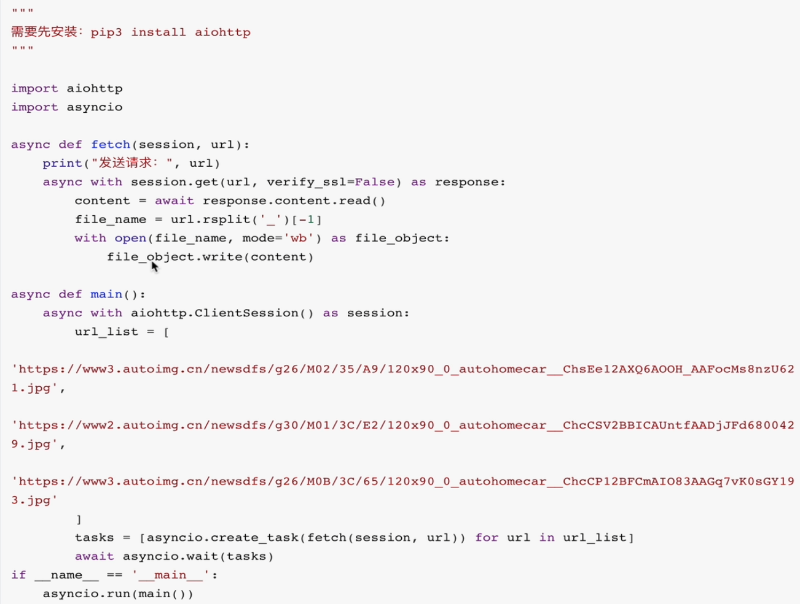


通过上述内容发现，在处理IO请求时，协程通过一个线程就可以实现并发操作。

# 总结

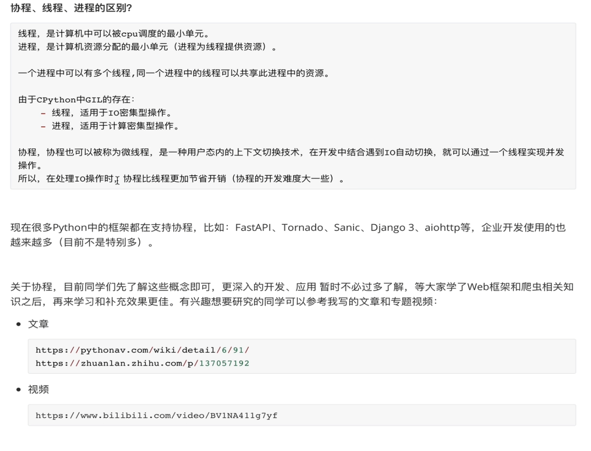


## 单线程+异步协程

**补充 - 最开始学爬虫时候协程相关**

event_loop:事件循环，相当于一个无限循环，可以把一些函数注册到这个事件循环上，当满足某些条件时，函数就会被循环执行。

coroutine:协程对象，我们可以将协程对象注册到时间循环中，他会被事件循环调用，我们可以使用async关键字来定义一个方法，这个方法不会立即执行，而是返回一个协程对象，只有当这个协程对象注册到事件循环总，事件循环启动后，这个协程对象对应的函数内部的语句才会被执行。

task:任务,他是对协程对象的进一步封装，包含了任务的各个状态

future:代表将来执行或者还没有执行的任务，实际上和task没有本质区别

async定义一个协程

await用于挂起阻塞方法的执行

下面代码展示了协程的测试：

```python
import asyncio


async def request(url):
    print("正在请求...", url)
    print("请求成功", url)
    return url


# 返回一个协程对象
x = request("http://httpbin.org/get")


# # 创建一个事件循环对象
# loop = asyncio.get_event_loop()
#
# # 将协程对象注册到loop，并启动loop
# loop.run_until_complete(x)

# # task的使用
# loop = asyncio.get_event_loop()
# # 基于loop创建了一个task对象
# task = loop.create_task(x)
# print(task)
# # 将任务对象注册到事件循环中并启动
# loop.run_until_complete(task)
# print(task)

# # future的使用
# loop = asyncio.get_event_loop()
# future = asyncio.ensure_future(x)
# print(future)
# loop.run_until_complete(future)
# print(future)


# 回调函数 当任务对象执行成功之后 将任务对象回调执行call_back这个函数
def callback_func(task):
    # 可以用result()函数返回协程对象的返回值 -- 即上面定义的request函数(注册后成为协程对象)的返回值
    # result返回的就是任务对象中封装的协程对象对应函数的返回值
    print(task.result())


# 绑定回调
loop = asyncio.get_event_loop()
future = asyncio.ensure_future(x)
# 将回调函数绑定到任务对象中
future.add_done_callback(callback_func)
loop.run_until_complete(future)
```

下面展示了多任务协程：

```python
import asyncio
import time


async def request(url):
    print("downloading...")
    # # 在异步协程中 如果出现同步模块相关代码 那么就无法实现异步
    # time.sleep(2)

    # 当在asyncio中遇到阻塞操作必须进行手动挂起
    await asyncio.sleep(2)

    print('over')
    return url + '-message'


urls = ['www.baidu.com',
        'www.sougou.com',
        'www.runoob.com',
        'www.firefox.com']

start = time.time()

# 任务列表 存放多个任务对象
future_list = []
for url in urls:
    c = request(url)
    future = asyncio.ensure_future(c)
    future_list.append(future)

loop = asyncio.get_event_loop()
# 必须将任务列表封装到wait方法中
loop.run_until_complete(asyncio.wait(future_list))

end = time.time()

print('time: ', end - start)
```

```python
import asyncio
import requests
import time
import aiohttp

# from website import index_bobo, index_jay, index_tom

urls = [
    'http://127.0.0.1:5000/bobo',
    'http://127.0.0.1:5000/jay',
    'http://127.0.0.1:5000/tom',
]

start = time.time()


async def get_page(url):
    print('downloading...', url)

    # # request发起的请求是基于同步的
    # response = requests.get(url)

    # 基于异步的网络请求模块发起请求 -- aiohttp
    async with aiohttp.ClientSession() as session:
        # 可能阻塞的操作必须await手动挂起
        # post get方法 headers params/data同requests
        async with await session.get(url) as response:
            # text()返回字符串形式的响应数据
            # read()返回二进制数据
            # json()返回json对象数据
            # 获取数据的时候也要挂起
            page_text = await response.text()
    print('over.', page_text)
    return url


futures = []

for url in urls:
    c = get_page(url)
    future = asyncio.ensure_future(c)
    futures.append(future)

loop = asyncio.get_event_loop()
loop.run_until_complete(asyncio.wait(futures))

end = time.time()


print('time: ', end-start)
```


