# 1. Django 入门

随着互联网的发展，网站和移动应用程序之间的界线不再清晰，它们都能够让用户以各种方式与数据交互。所幸，可以使用Django 来创建能同时作为动态网站和移动应用程序的项目。Django 是最流行的 Python Web 框架，提供了一系列旨在帮助开发交互式网站的工具。本章介绍如何使用 Django 来开发一个名为“学习笔记”（Learning Log）的项目。这是一个在线日志系统，让你能够记录针对哪些特定主题学到了哪些知识。我们将先为这个项目制定规范，再为使用的数据定义模型。我们将使用 Django 的管理系统来输入一些初始数据，然后编写视图和模板，让 Django 能够创建网页。Django 能够响应网页请求，还让你能够更轻松地读写数据库、管理用户，等等。第 19 章和第 20 章将改进“学习笔记”项目，再将其部署到活动的服务器上，让所有人都能够使用它。

## 1.1 建立项目

在着手开发像 Web 应用这样的大项目时，首先需要制定规范（spec），对项目的目标进行描述。确定要达成的目标后，就能着手找出为达成这些目标而需要完成的任务了。

本节将为“学习笔记”项目制定规范，并进入项目开发的第一个阶段，包括搭建虚拟环境以及构建 Django 项目框架。

### 1.1.1 制定规范

完整的规范要详细说明项目的目标，阐述项目的功能，讨论项目的外观和用户界面。与任何良好的项目规划书和商业计划书一样，规范应突出重点，帮助避免项目偏离轨道。这里不制定完整的项目规划，只列出一些明确的目标，以突出开发的重点。我们制定的规范如下：我们要编写一个名为“学习笔记”的 Web 应用程序，让用户能够记录感兴趣的主题，并在学习每个主题的过程中添加日志条目。“学习笔记”的主页对这个网站进行描述，并邀请用户注册或登录。用户登录后，可以创建新主题、添加新条目以及阅读既有的条目。在学习新主题时，记录学到的知识可有助于建立知识体系，研究技术主题时尤其如此。优秀的应用程序（如接下来将创建的应用程序）能让这个记录过程简单高效。

### 1.1.2 建立虚拟环境

使用 Django 之前，需要建立虚拟的工作环境。虚拟环境是系统的一个位置，你可在其中安装包，并将这些包与其他 Python 包隔离开来。将项目的库与其他项目分离是有益的，为了在第 20 章将“学习笔记”部署到服务器，这也是必须的。

为项目新建一个目录，将其命名为 learning_log，再在终端中切换到这个目录，并执行如下命令创建一个虚拟环境：

```python
python -m venv .venv
```

### 1.1.3 激活虚拟环境

```python
source .venv/bin/activate
```

注意：如果你使用的是 Windows 系统，请使用命令 ll_env\Scripts\activate（不包含 source）来激活这个虚拟环境。如果你使用的是 PowerShell，可能需要将Activate 的首字母大写。

要停止使用虚拟环境，可执行命令 deactivate：

```python
deactivate
```

### 1.1.4 安装 Django

```python
pip install django
```

pip 从各种地方下载资源，因此升级频繁。有鉴于此，每当你搭建新的虚拟环境后，都最好更新 pip。

### 1.1.5 在 Django 中创建项目

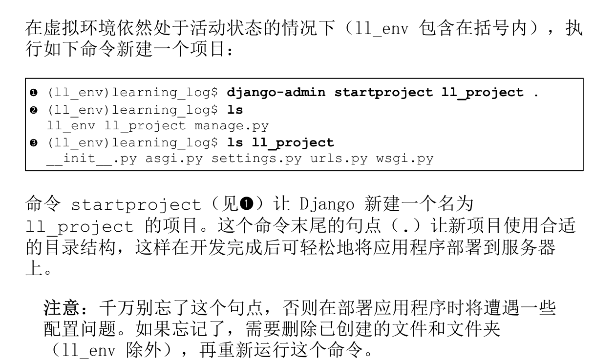

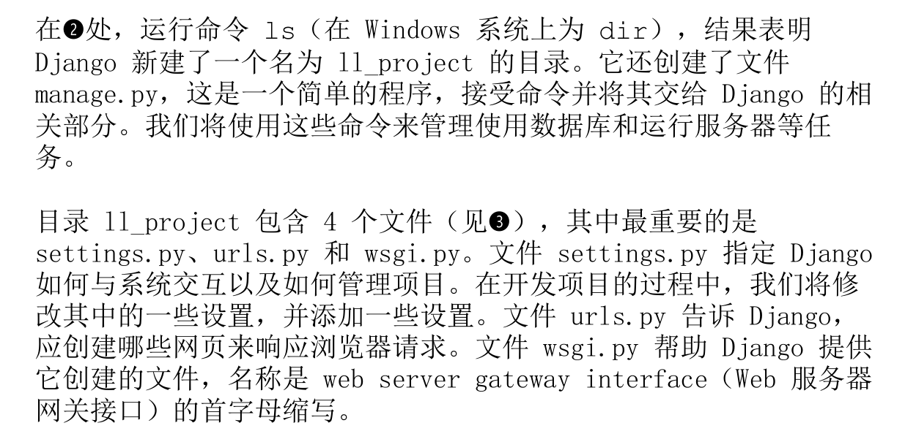

### 1.1.6 创建数据库

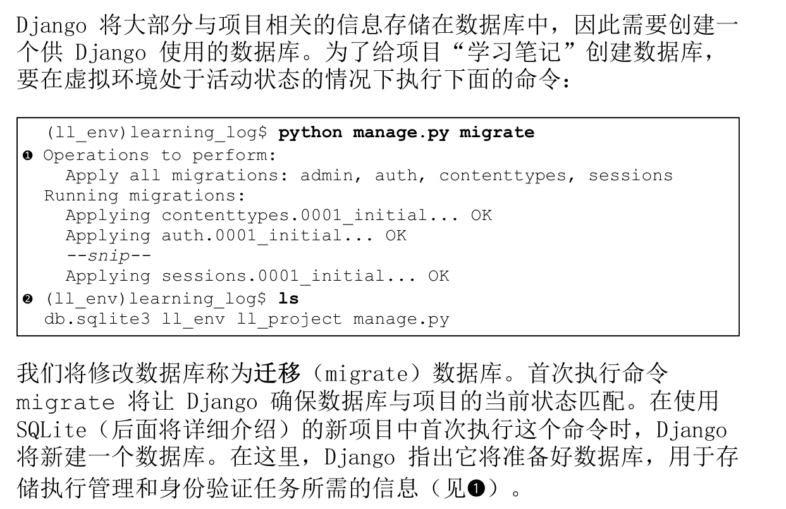

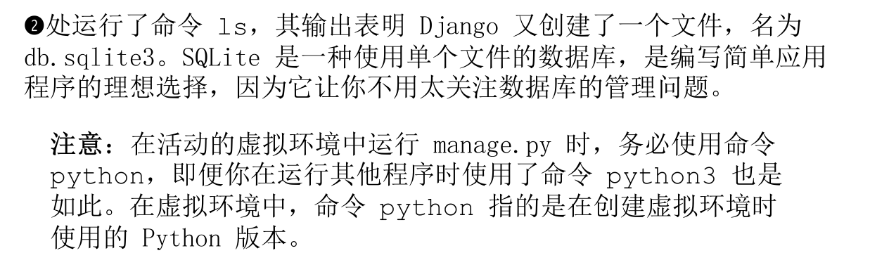

### 1.1.7 查看项目

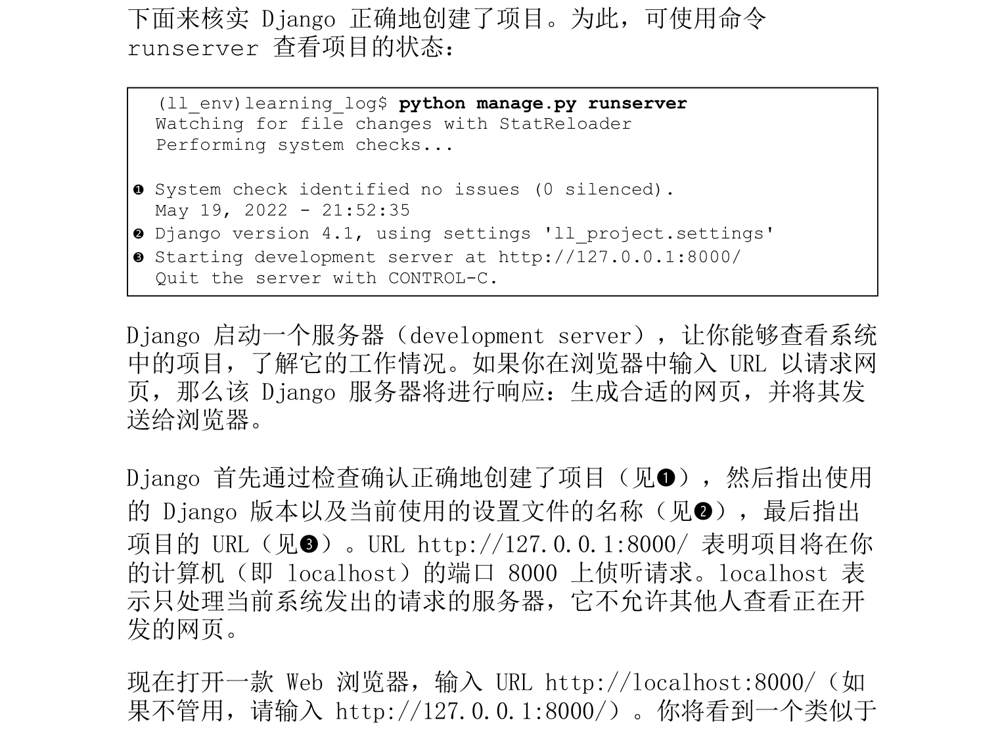

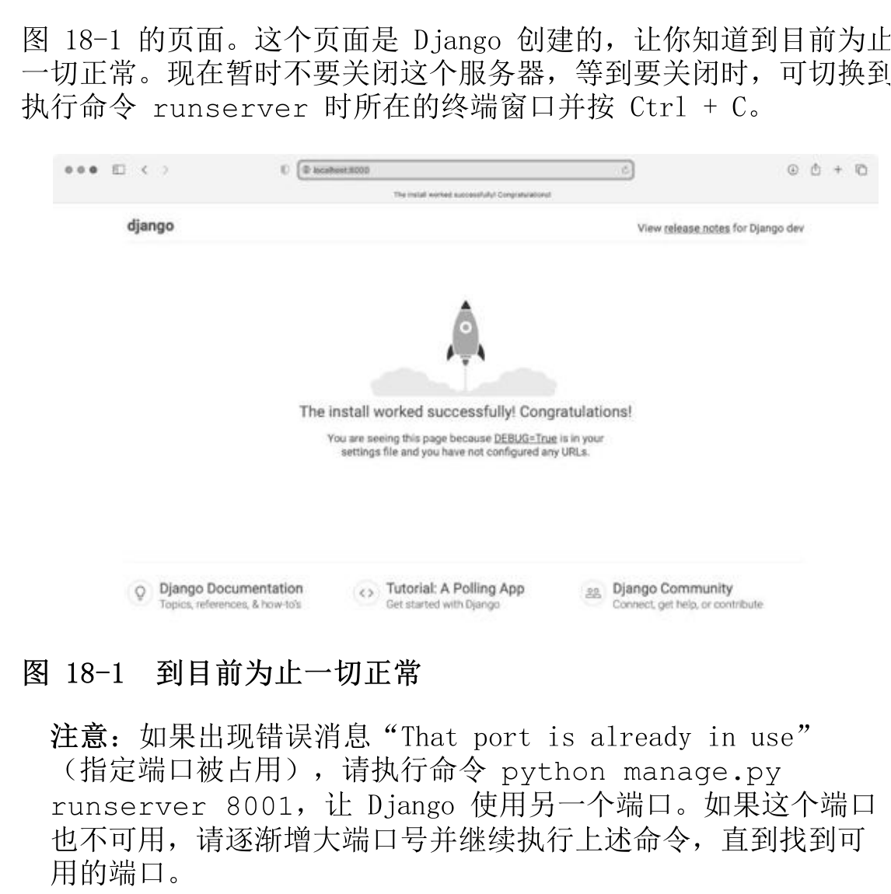

## 1.2 创建应用程序

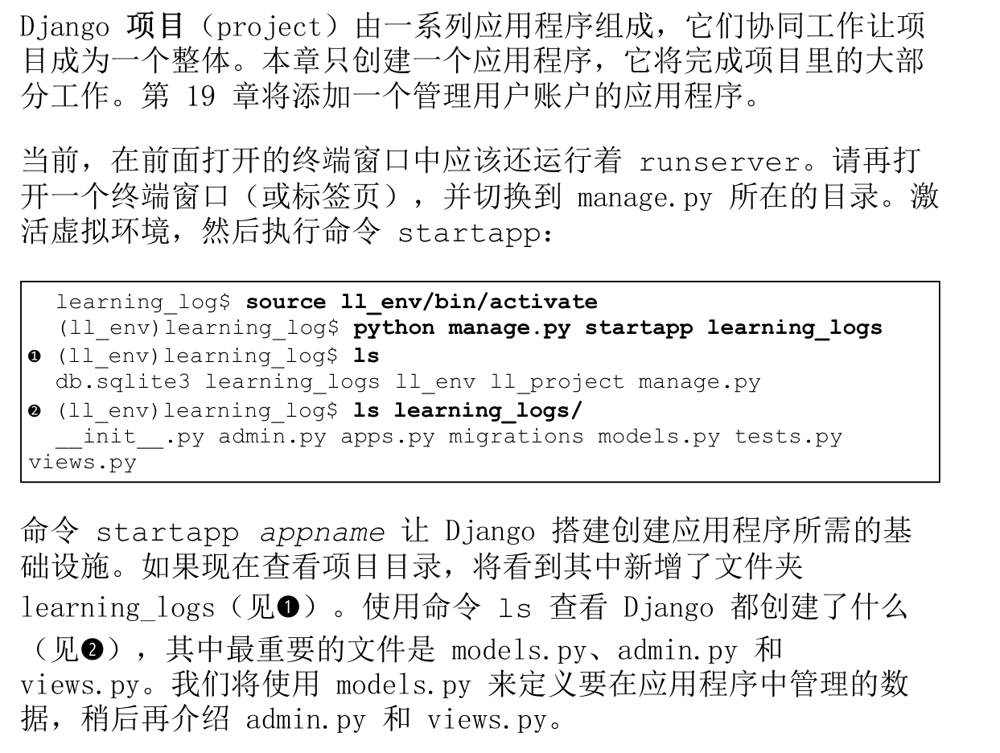

### 1.2.1 定义模型

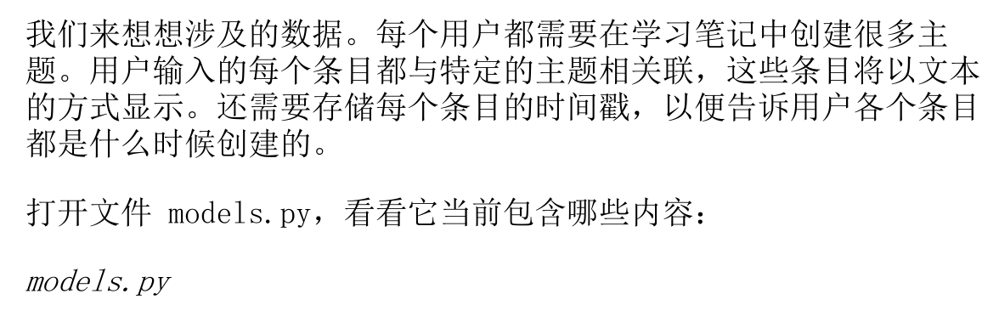

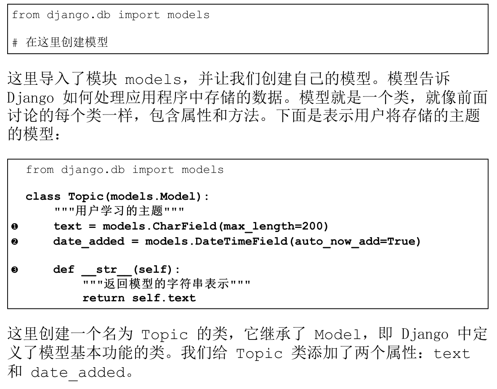

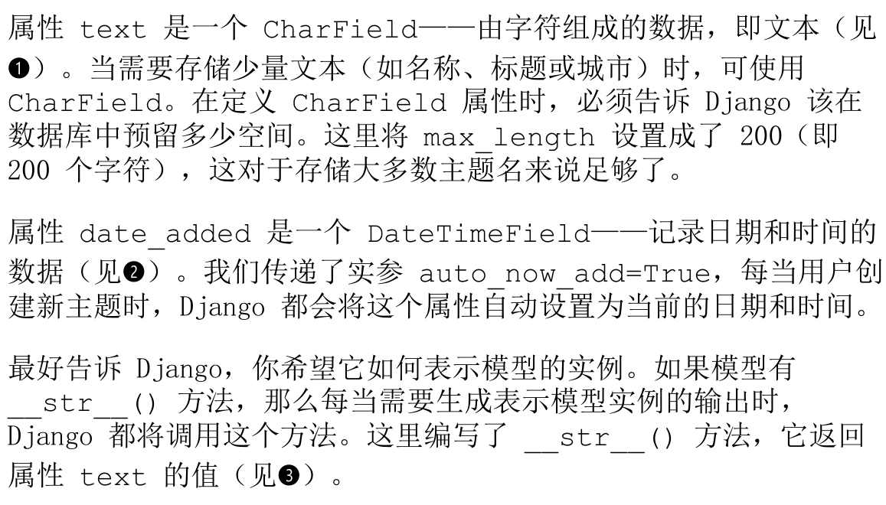

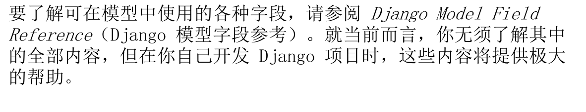

### 1.2.2 激活模型

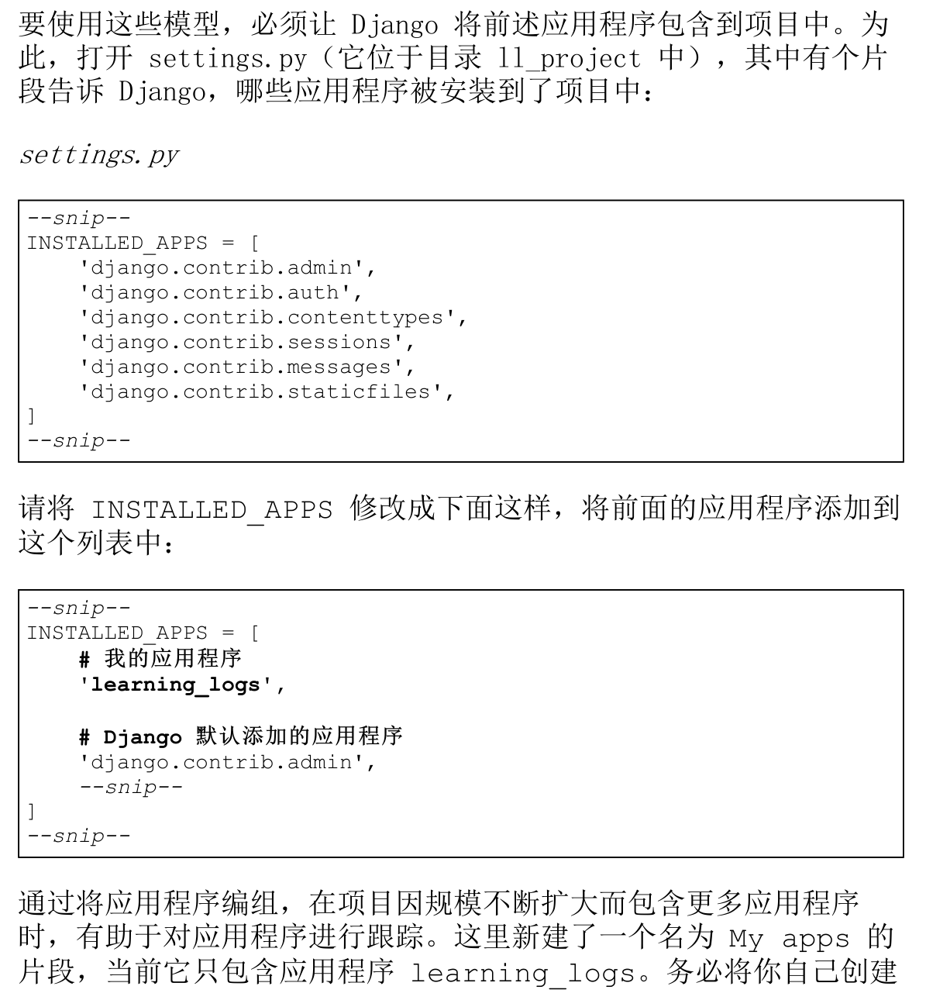

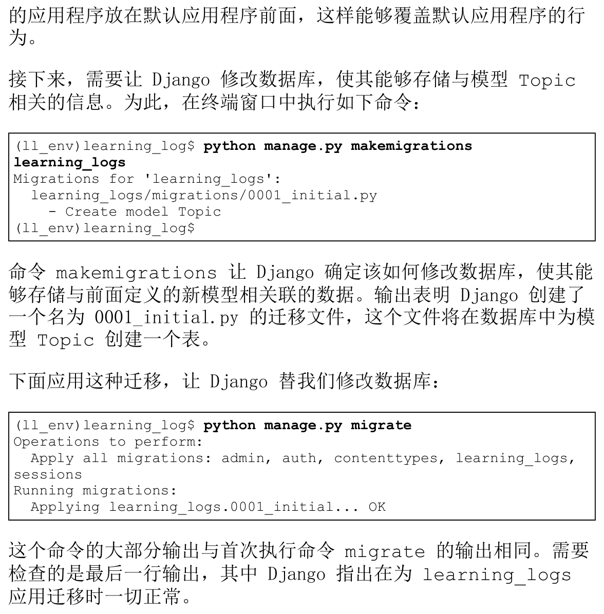

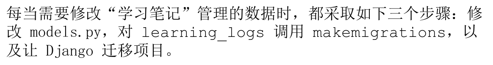

### 1.2.3 Django 管理网站

Django 提供的管理网站（admin site）让你能够轻松地处理模型。Django 管理网站仅供网站的管理员使用，普通用户不能使用。本节将建立管理网站，并通过它使用模型 Topic 来添加一些主题。

#### 1.2.3.1 创建超级用户

Django 允许创建具备所有权限的用户，即超级用户（superuser）。权限决定了用户可执行的操作。最严格的权限设置只允许用户阅读网站的公开信息。注册用户通常可阅读自己的私有数据，还可查看一些只有会员才能查看的信息。为了有效地管理项目，网站所有者通常需要访问网站存储的所有信息。优秀的管理员会小心地对待用户的敏感信息，因为用户对其访问的应用程序有极大的信任。 

要在 Django 中创建超级用户，请执行下面的命令并按提示做：

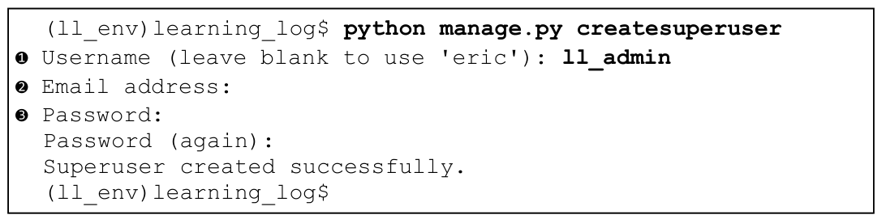

注意：可以对网站管理员隐藏一些敏感信息。例如，Django并不存储你输入的密码，而存储从该密码派生出的一个字符串，称为哈希值。每当你输入密码时，Django 都会计算其哈希值，并将结果与存储的哈希值进行比较。如果这两个哈希值相同，你就通过了身份验证。这样，即便黑客获得了网站数据库的访问权，也只能获取其中存储的哈希值，无法获取密码。在网站配置正确的情况下，几乎无法根据哈希值推导出原始密码。

#### 1.2.3.2 向管理网站注册模型

Django 自动在管理网站中添加了一些模型，如 User 和Group，如果要添加我们创建的模型，则必须手动注册。

在我们创建应用程序 learning_logs 时，Django 在models.py 所在的目录中创建了一个名为 admin.py 的文件：

```python
# admin.py

from django.contrib import admin

# Register your models here.

from .models import Topic

admin.site.register(Topic)
```

首先导入要注册的模型 Topic。models 前面的句点让 Django 在 admin.py 所在的目录中查找 models.py。admin.site.register() 让 Django 通过管理网站管理模型。

现在，使用超级用户账户访问管理网站：访问http://localhost:8000/admin/，并输入刚创建的超级用户的用户名和密码。将看到类似于图 18-2 所示的屏幕，这个网页不仅让你能够添加和修改用户和用户组，还可以管理与刚才定义的模型 Topic 相关的数据。

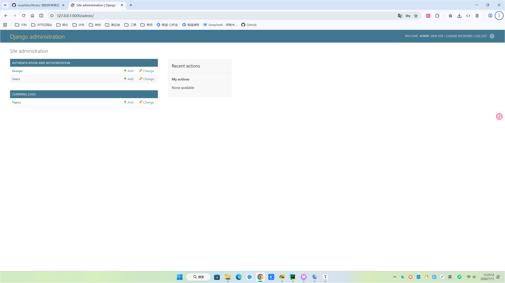

图 18-2 包含模型 Topic 的管理网站

注意：如果在浏览器中看到一条消息，指出访问的网页不可用，请确认在终端窗口中运行着 Django 服务器。如果没有，请激活虚拟环境，并执行命令 python manage.pyrunserver。在开发过程中，如果无法通过浏览器访问项目，首先应采取的故障排除措施是，先关闭所有打开的终端，再打开终端并执行命令 runserver。

#### 1.2.3.3 添加主题

向管理网站注册 Topic 后，我们来添加第一个主题。为此，单击 Topics 进入主题网页，它几乎是空的，因为还没有添加任何主题。单击 Add Topic，会出现一个用于添加新主题的表单。在第一个方框中输入 Python 并单击 Save，我们将回到主题管理页面，其中包含刚创建的主题。

下面再创建一个主题，以便有更多的数据可用。再次单击 AddTopic，并输入 Java。单击 Save 后将回到主题管理页面，再添加Python，其中会包含主题 Go、Java 和 Python。

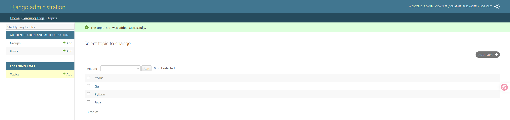

### 1.2.4 定义模型 Entry

要记录学到的Go、Java和Python知识，用户必须能够在学习笔记中添加条目。因此，需要定义相关的模型。每个条目都与特定的主题相关联，这种关系称为多对一关系，即多个条目可关联到同一个主题。

下面是模型 Entry 的代码，请将这些代码放在文件 models.py 中：

```python
from django.db import models


# Create your models here.

class Topic(models.Model):
    """用户学习的主题"""
    text = models.CharField(max_length=200)
    date_added = models.DateTimeField(auto_now_add=True)

    def __str__(self):
        """返回模型的字符串表示"""
        return self.text


class Entry(models.Model):
    """学到的有关某个主题的具体知识"""
    topic = models.ForeignKey(Topic, on_delete=models.CASCADE)
    text = models.TextField()
    date_added = models.DateTimeField(auto_now_add=True)

    class Meta:
        verbose_name_plural = 'entries'

    def __str__(self):
        """返回一个表示条目的简单字符串"""
        if len(self.text) > 100:
            return self.text[:100] + '...'
        return self.text
```

像 Topic 一样，Entry 也继承了 Django 基类 Model。第一个属性 topic 是个 ForeignKey 实例。外键（foreign key）是一个数据库术语，它指向数据库中的另一条记录，这里则是将每个条目关联到特定的主题。在创建每个主题时，都为其分配一个键（ID）。当需要在两项数据之间建立联系时，Django 就会使用与每项信息相关联的键。我们稍后将根据这些联系获取与特定主题相关联的所有条目。实参 on_delete=models.CASCADE 让Django 在删除主题的同时删除所有与之相关联的条目，这称为级联删除（cascading delete）。接下来是属性 text，它是一个 TextField 实例。这种字段的长度不受限制，因为我们不想限制条目的长度。属性date_added 让我们能够按创建顺序呈现条目，并在每个条目旁边放置时间戳。我们在 Entry 类中嵌套了 Meta 类。Meta 存储用于管理模型的额外信息。在这里，它让我们能够设置一个特殊属性，让Django 在需要时使用 Entries 表示多个条目。如果没有这个类，Django 将使用 Entrys 表示多个条目。`__str__()` 方法告诉 Django 在呈现条目时应显示哪些信息。条目包含的文本可能很长，因此让` __str__() `方法只返回 text 的前100 个字符。这里还添加了一个省略号，指出显示的并非完整的条目。

### 1.2.5 迁移模型 Entry

添加新模型后，需要再次迁移数据库。你将慢慢地对这个过程了如指掌：修改 models.py，执行命令 python manage.pymakemigrations app_name，再执行命令 python manage.pymigrate。

请使用如下命令迁移数据库并查看输出：

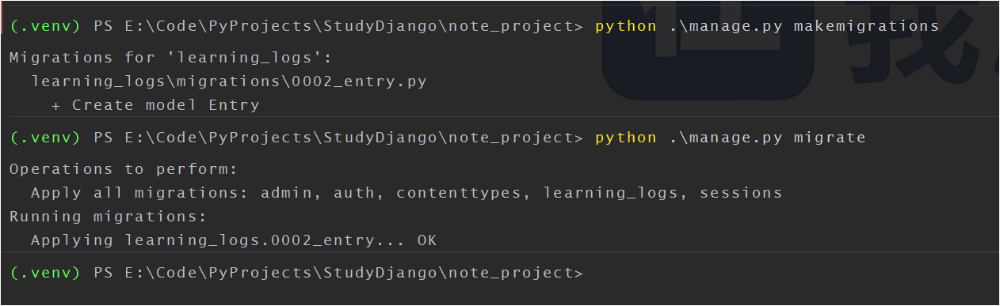

生成了新的迁移文件 0002_entry.py，它告诉 Django 如何修改数据库，使其能够存储与模型 Entry 相关的信息。然后执行命令 migrate，我们发现 Django 应用了该迁移且一切正常。

### 1.2.6 向管理网站注册 Entry

返回 http://localhost/admin/，将看到 Learning_Logs 下列出了Entries。单击 Entries 的 Add 链接，或者单击 Entries 再选择Add entry，将看到一个下拉列表，让我们选择要为哪个主题创建条目，还有一个用于输入条目的文本框。

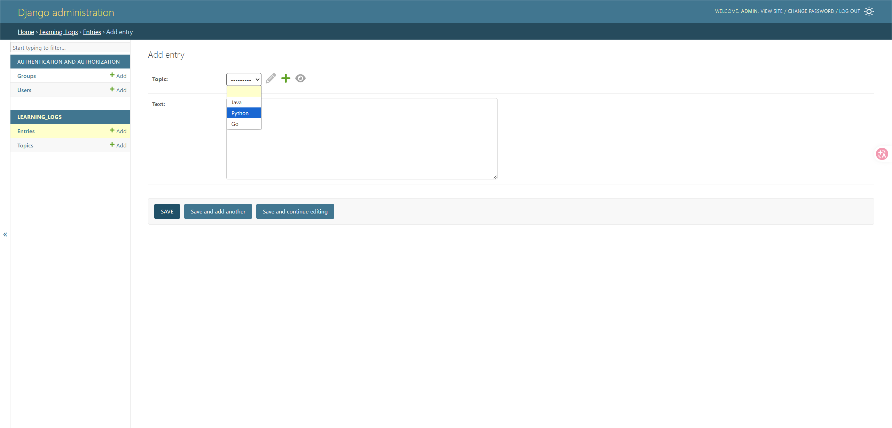

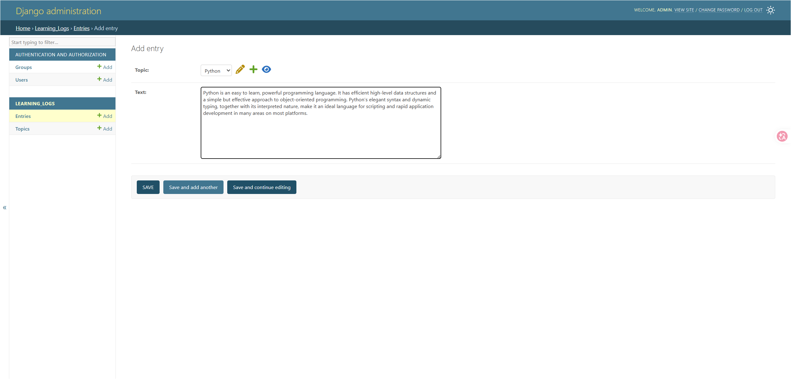

我添加的数据:

```python
Python is an easy to learn, powerful programming language. It has efficient high-level data structures and a simple but effective approach to object-oriented programming. Python’s elegant syntax and dynamic typing, together with its interpreted nature, make it an ideal language for scripting and rapid application development in many areas on most platforms.
```

可以添加其他的 Entry

### 1.2.7 Django shell

输入一些数据后，就可以通过交互式终端会话以编程的方式查看这些数据了。这种交互式环境称为 Django shell，是测试项目和排除故障的理想之地。下面是一个交互式 shell 会话的示例：

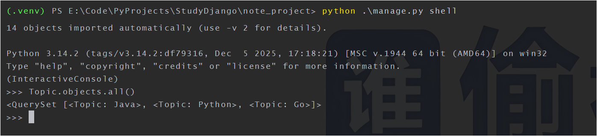

在活动的虚拟环境中执行时，命令 python manage.py shell 会启动 Python 解释器，让你能够探索存储在项目数据库中的数据。这里先导入模块 learning_logs.models 中的模型 Topic，再使用 Topic.objects.all() 方法获取模型 Topic 的所有实例，这将返回一个称为查询集（queryset）的列表。

可以像遍历列表一样遍历查询集。下面演示了如何查看分配给每个主题对象的 ID：

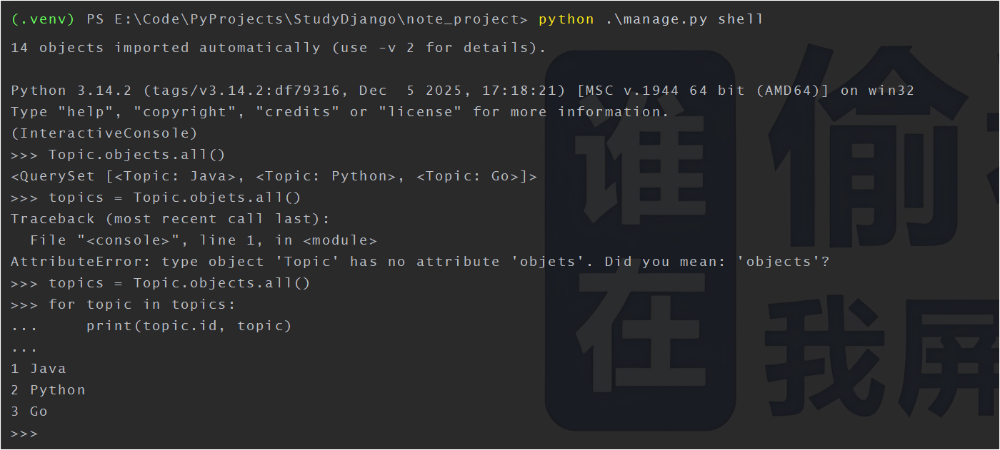

知道主题对象的 ID 后，就可以使用 Topic.objects.get() 方法获取该对象并查看其属性了。下面来看看主题 Chess 的属性 text和 date_added 的值：

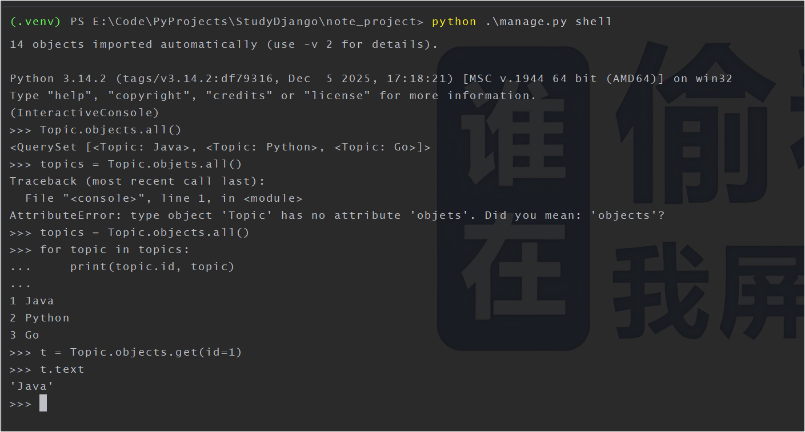

还可以查看与主题相关联的条目。前面给模型 Entry 定义了属性 topic。这是一个 ForeignKey，将条目与主题关联起来。利用这种关联，Django 能够获取与特定主题相关联的所有条目，如下所示：

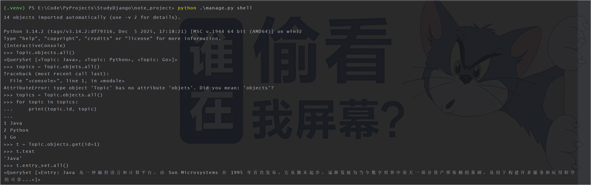

要通过外键关系获取数据，可使用相关模型的小写名称、下划线和单词 set。假设有模型 Pizza 和 Topping，而 Topping通过一个外键关联到 Pizza。如果有一个名为 my_pizza 的Pizza 对象，就可以使用代码 my_pizza.topping_set.all()来获取这张比萨的所有配料。

稍后在编写用户可请求的网页时，将使用这种语法。要确认代码能否获取所需的数据时，shell 很有帮助。如果代码在 shell 中的行为符合预期，那么它们在项目文件中也能正常工作。如果代码引发了错误或者获取的数据不符合预期，那么在简单的 shell 环境中排除故障要比在生成网页的文件中排除故障容易得多。我们不会太多地使用shell，但应继续使用它来熟悉对存储在项目中的数据进行访问的Django 语法。

每次修改模型后，都需要重启 shell，以便看到修改的效果。要退出shell 会话，可按 Ctr + D。如果你使用的是 Windows 系统，应先按Ctr + Z，再按回车键。

## 1.3 创建网页：学习笔记主页

使用 Django 创建网页的过程分为三个阶段：定义 URL，编写视图，以及编写模板。按什么顺序完成这三个阶段无关紧要，但在本项目中，总是先定义 URL 模式。URL 模式描述了 URL 的构成，让Django 知道如何将浏览器请求与网站 URL 匹配，以确定返回哪个网页。

每个 URL 都被映射到特定的视图。视图函数获取并处理网页所需的数据。视图函数通常使用模板来渲染网页，而模板定义网页的总体结构。为了明白其中的工作原理，我们来创建学习笔记的主页。这包括定义该主页的 URL，编写其视图函数，以及创建一个简单的模板。

因为我们只是要确保“学习笔记”按要求的那样工作，所以暂时让这个网页尽可能简单。确保 Web 应用程序能够正常运行后，设置样式可使其更有趣，但是中看不中用的应用程序毫无意义。就目前而言，主页只显示标题和简单的描述。

### 1.3.1 映射 URL

用户通过在浏览器中输入 URL 和单击链接来请求网页，因此需要确定项目需要哪些 URL。主页的 URL 最重要，它是用户用来访问项目的基础 URL。当前，基础 URL（http://localhost:8000/）返回默认的Django 网站，让我们知道正确地建立了项目。下面进行修改，将这个基础 URL 映射到“学习笔记”的主页。

```python
from django.contrib import admin
from django.urls import path, include
urlpatterns = [
path('admin/', admin.site.urls),
    
# 下面的这个 namespace 是可选的 -- 但为了项目结构的清晰和规范，通常也会在项目的 urls.py 中，通过 include() 函数的第二个参数显式指定命名空间。
path('', include('learning_logs.urls', namespace='learning_logs')),
]
```

这里导入了函数 include()，还添加了一行代码来包含 learning_logs.urls 模块。

learning_logs/urls.py:

```python
from django.urls import path, include

from . import views

# 告诉 Django：“这个应用下的所有 URL 名称都属于 learning_logs 这个命名空间”。
app_name = 'learning_logs'

urlpatterns = [
    path("", views.index, name='index'),
]
```

为了指出当前位于哪个 urls.py 文件中，在这个文件开头添加一个文档字符串。接下来，导入函数 path，因为需要使用它将URL 映射到视图。然后导入 views 模块，其中的句点让 Python 从当前 urls.py 模块所在的文件夹中导入 views。变量 app_name 让 Django 能够将这个 urls.py 文件与项目内其他应用程序中的同名文件区分开来。在这个模块中，变量urlpatterns 是一个列表，包含可在应用程序 learning_logs中请求的网页。

实际的 URL 模式是对 path() 函数的调用，这个函数接受三个实参。第一个是一个字符串，帮助 Django 正确地路由（route）请求。收到请求的 URL 后，Django 力图将请求路由给一个视图，并为此搜索所有的 URL 模式，以找到与当前请求匹配的。Django 忽略项目的基础 URL（http://localhost:8000/），因此空字符串（''）与基础 URL 匹配。其他 URL 都与这个模式不匹配。如果请求的 URL与任何既有的 URL 模式都不匹配，Django 将返回一个错误页面。

path() 的第二个实参指定了要调用 view.py 中的哪个函数。当请求的 URL 与前述正则表达式匹配时，Django 将调用view.py 中的 index() 函数（这个视图函数将在 18.3.2 节编写）。第三个实参将这个 URL 模式的名称指定为 index，让我们能够在其他项目文件中轻松地引用它。每当需要提供这个主页的链接时，都将使用这个名称，而不编写 URL。

### 1.3.2 编写视图

视图函数接受请求中的信息，准备好生成网页所需的数据，再将这些数据发送给浏览器。这通常是使用定义网页外观的模板实现的。

```python
from django.shortcuts import render

# Create your views here.


def index(request):
    return render(request, 'learning_logs/index.html')
```

当 URL 请求与刚才定义的模式匹配时，Django 将在文件 views.py中查找 index() 函数，再将对象 request 传递给这个视图函数。这里不需要处理任何数据，因此这个函数只包含调用 render() 的代码。这里向 render() 函数提供了两个实参：对象 request 和一个可用于创建网页的模板。下面来编写这个模板。

### 1.3.3 编写模板

模板定义网页的外观，而每当网页被请求时，Django 都将填入相关的数据。模板让你能够访问视图提供的任何数据。我们的主页视图没有提供任何数据，因此相应的模板非常简单。

在文件夹 learning_logs 中新建一个文件夹，并将其命名为templates。在文件夹 templates 中，再新建一个文件夹并将其命名为 learning_logs。这好像有点多余（在文件夹 learning_logs 中创建文件夹 templates，又在这个文件夹中创建文件夹learning_logs），但是建立了 Django 能够明确解读的结构，即使项目很大、包含很多应用程序时也是如此。在最里面的文件夹learning_logs 中，新建一个文件并将其命名为 index.html（这个文件的路径为learning_logs/templates/learning_logs/index.html），再在其中编写如下代码：

index.html:

```python
<!DOCTYPE html>
<html lang="en">
<head>
    <meta charset="UTF-8">
    <title>Title</title>
</head>
<body>
<p>Learning Log</p>
<p>Learning Log helps you keep track of your learning, for any
    topic you're
    interested in.
</p>
</body>
</html>
```

现在，如果请求这个项目的基础 URL http://localhost:8000/，将看到刚才创建的网页，而不是默认的 Django 网页。Django 接受请求的URL，发现该 URL 与模式 '' 匹配，因此调用 views.index() 函数。这将使用 index.html 包含的模板来渲染网页，

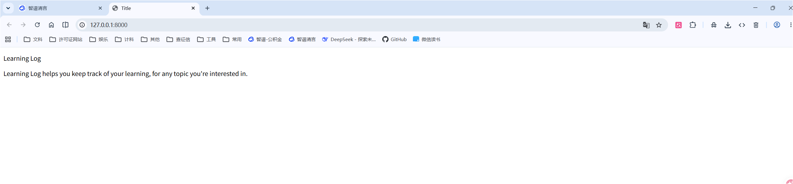

虽然创建网页的过程可能看起来很复杂，但将 URL、视图和模板分离的效果很好。这让我们能够分别考虑项目的不同方面，在项目很大时，可让各个参与者专注于自己最擅长的那个方面。例如，数据库专家专注于模型，程序员专注于视图代码，而前端专家专注于模板。

## 1.4 创建其他网页

制定好创建网页的流程后，就可以开始扩充“学习笔记”项目了。我们将创建两个显示数据的网页，其中一个列出所有主题，另一个显示特定主题的所有条目。对于每个网页，我们都将指定 URL 模式并且编写一个视图函数和一个模板。在此之前，先创建一个父模板，项目中的其他模板都将继承它。

### 1.4.1 模板集成

在创建网站时，一些通用元素会出现在所有网页中。在这种情况下，可编写一个包含通用元素的父模板，并让每个网页都继承父模板，而不是在每个网页中重复定义这些通用元素。这种方法不仅能够让你专注于开发每个网页的独特方面，还使得修改项目的整体外观容易得多。

#### 1.4.1.1 父模板

下面创建一个名为 base.html 的模板，并将其存储在 index.html 所在的目录中（路径为 learning_logs/templates/learning_logs/base.html）。

这个模板包含所有页面都有的元素，而其他模板都继承它。当前，所有页面都包含的元素只有顶端的标题。因为将在每个页面中包含这个模板，所以将这个标题设置为主页的链接：

```python
# base.html

<p>
    <a href="">Learning Log</a>
</p>



```

这个文件的第一部分创建一个包含项目名的段落，该段落也是主页的链接。为了创建该链接，使用一个模板标签。模板标签是用花括号和百分号（）表示的，实质是一小段代码，生成要在网页中显示的信息。这里的模板标签  生成一个 URL，该 URL 与 learning_logs/urls.py 中定义的名为 index 的 URL 模式匹配。在这个示例中，learning_logs 是一个命名空间，而 index 是该命名空间中一个名称独特的 URL 模式。这个命名空间来自在文件 learning_logs/urls.py 中赋给 app_name 的值。

在简单的 HTML 页面中，链接是使用锚标签 <a> 定义的：

```python
<a href="link_url">link text</a>
```

通过模板标签来生成 URL，能很容易地确保链接是最新的：只需修改 urls.py 中的 URL 模式，Django 就会在网页被请求时自动插入修改后的 URL。在这个项目中，每个网页都将继承base.html，因此从现在开始，每个网页都包含主页的链接。

我们在最后一行插入了一对块标签。这个块名为content，是一个占位符，其中包含的信息由子模板指定。子模板并非必须定义父模板中的每个块，因此在父模板中，可以使用任意多个块来预留空间，而子模板可根据需要定义相应数量的块。

注意：在 Python 代码中，几乎总是缩进四个空格。相比于Python 文件，模板文件的缩进层级更多，因此每个层级通常只缩进两个空格。

#### 1.4.1.2 子模板

现在需要重写 index.html，使其继承 base.html。为此，向 index.html 添加如下代码：

```python



    <p>Learning Log helps you keep track of your learning, for any topic you're interested in.
    </p>

```

如果将这些代码与原来的 index.html 进行比较，将发现标题Learning Log 没有了，取而代之的是指定要继承哪个模板的代码。子模板的第一行必须包含标签 ，让Django 知道它继承了哪个父模板。文件 base.html 位于文件夹learning_logs 中，因此父模板路径中包含 learning_logs。这行代码导入模板 base.html 的所有内容，让 index.html 能够指定要在 content 块预留的空间中添加的内容。

我们插入一个名为 content 的  标签，以定义content 块。不是从父模板继承的内容都在 content块中，在这里是一个描述项目“学习笔记”的段落。我们使用标签  指出内容定义的结束位置。在标签  中，并非必须指定块名，但如果模板包含多个块，指定块名有助于确定结束的是哪个块。模板继承的优点开始显现出来了：在子模板中，只需包含当前网页特有的内容。这不仅简化了每个模板，还使得网站修改起来容易得多。要修改多个网页共同包含的元素，只需修改父模板即可，所做的修改将传导到继承该父模板的每个页面。在包含数十乃至数百个网页的项目中，这种结构使得网站改进起来容易而快捷得多。

在大型项目中，通常有一个用于整个网站的父模板 base.html，且网站的每个主要部分都有一个父模板。每个部分的父模板都继承 base.html，而网站的每个网页都继承相应部分的父模板。这让你能够轻松地修改整个网站的外观、网站任何一部分的外观以及任何一个网页的外观。这种配置提供了一种效率极高的工作方式，让你乐意不断地去改进项目。

### 1.4.2 显示所有主题的页面

有了高效的网页创建方法后，就可专注于另外两个网页了：显示全部主题的网页以及显示特定主题中条目的网页。所有主题页面显示用户创建的所有主题，它是第一个需要使用数据的网页。

#### 1.4.2.1 URL 模式

首先，定义显示所有主题的页面的 URL。通常，使用一个简单的URL 片段来指出网页显示的信息；这里将使用单词 topics，因此 URL http://localhost:8000/topics/ 将返回显示所有主题的页面。下面演示了该如何修改 learning_logs/urls.py：

```python
from django.urls import path, include

from . import views

# 告诉 Django：“这个应用下的所有 URL 名称都属于 learning_logs 这个命名空间”。
app_name = 'learning_logs'

urlpatterns = [
    path("", views.index, name='index'),
    path('topics/', views.topics, name='topics'),
]
```


新的 URL 模式为 topics/。在 Django 检查请求的 URL 时，这个模式将与如下 URL 匹配：基础 URL 后面跟着 topics。既可在末尾包含斜杠，也可省略，但单词 topics 后面不能有其他任何东西，否则就会与该模式不匹配。URL 与该模式匹配的请求都将交给 views.py 中的 topics() 函数进行处理。

#### 1.4.2.2 视图

topics() 函数需要从数据库中获取一些数据，并将其交给给模板。需要在 views.py 中添加的代码如下：

```python
from django.shortcuts import render

# Create your views here.

from .models import Topic


def index(request):
    return render(request, 'learning_logs/index.html')


def topics(request):
    """显示所有的主题"""
    topics = Topic.objects.order_by('date_added')
    context = {'topics': topics}
    return render(request, 'learning_logs/topics.html',
                  context)
```

首先导入与所需数据相关联的模型。函数 topics()包含一个形参：Django 从服务器那里收到的 request 对象。我们查询数据库：请求提供 Topic 对象，并根据属性 date_added 进行排序。返回的查询集被赋给topics。

接下来，定义一个将发送给模板的上下文。上下文（context）是一个字典，其中的键是将用来在模板中访问数据的名称，而值是要发送给模板的数据。这里只有一个键值对，包含一组将在网页中显示的主题。在创建使用数据的网页时，调用了 render()，并向它传递对象 request、要使用的模板和字典 context。

#### 1.4.2.3 模板

显示所有主题的页面的模板接受字典 context，以便能够使用topics() 提供的数据。新建一个文件，将其命名为topics.html，并存储到 index.html 所在的目录中。下面演示了如何在这个模板中显示主题：

```python


    <p>Topics</p>
    <ul>
        
            <li>{{ topic.text }}</li>
        
            <li>No topics have been added yet.</li>
        
    </ul>

```

就像在主页模板中一样，先使用标签  来继承base.html，再开始定义 content 块。这个网页的主体是一个项目列表，其中列出了用户输入的主题。在标准 HTML 中，项目列表称为无序列表，用标签 <ul></ul> 表示。包含所有主题的项目列表始于起始标签 <ul>。

接下来，使用一个相当于 for 循环的模板标签，它遍历字典context 中的列表 topics。模板中使用的代码与Python 代码存在一些重要差别：Python 使用缩进来指出哪些代码行是 for 循环的组成部分；而在模板中，每个 for 循环都必须使用  标签来显式地指出结束位置。因此在模板中，循环类似于下面这样：

```python

	do something with each item

```

在循环中，要将每个主题转换为一个项目列表项。要在模板中打印变量，需要将变量名用双花括号括起。这些花括号不会出现在网页中，只是用于告诉 Django，我们使用了一个模板变量。因此每次循环时，代码 {{ topic.text }}都会被替换为当前主题的 text 属性。HTML 标签 <li></li> 表示一个项目列表项。在标签对 <ul></ul> 内部，位于标签 <li> 和</li> 之间的内容都是一个项目列表项。

我们还使用了模板标签 ，它告诉 Django在列表 topics 为空时该怎么办。这里会打印一条消息，告诉用户还没有添加任何主题。最后两行分别结束 for 循环和项目列表。

现在需要修改父模板，使其包含显示所有主题的页面的链接。为此，在 base.html 中添加如下代码：

```python
<!DOCTYPE html>
<html lang="en">
<head>
    <meta charset="UTF-8">
    <title>Title</title>
</head>
<body>
<p>
    <a href="">Learning Log</a>
    ——
    <a href="">Topics</a>
</p>



</body>
</html>
```

先在主页的链接后面添加一个连字符，再添加一个显示所有主题的页面的链接——使用的也是模板标签 。这行让 Django 生成一个与 learning_logs/urls.py中名为 topics 的 URL 模式匹配的链接。

现在刷新浏览器中的主页，将看到链接 Topics。如果单击这个链接，将看到类似于图 18-4 所示的网页。

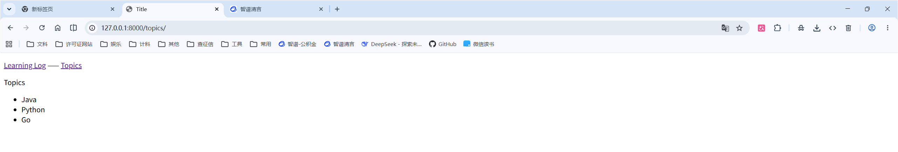

### 1.4.3 显示特定主题的页面

接下来，需要创建一个专注于特定主题的页面，用于显示该主题的名称及其所有条目。我们将定义一个新的 URL 模式，编写一个视图并创建一个模板。还将修改显示所有主题的网页，让每个项目列表项都变为链接：通过单击可显示相应主题的所有条目。

#### 1.4.3.1 URL模式

显示特定主题的页面的 URL 模式与前面的所有 URL 模式都稍有不同，因为它使用主题的 id 属性来指出请求的是哪个主题。如果用户要查看主题 Chess（其 id 为 1）的详细页面，URL 将为http://localhost:8000/topics/1/。下面是与这个 URL 匹配的模式，它应放在 learning_logs/urls.py 中：

learning_logs/urls.py

```python
from django.urls import path, include

from . import views

# 告诉 Django：“这个应用下的所有 URL 名称都属于 learning_logs 这个命名空间”。
app_name = 'learning_logs'

urlpatterns = [
    path("", views.index, name='index'),
    path('topics/', views.topics, name='topics'),
    path('topics/<int:tid>/', views.topic, name='topic'),
]
```

我们来详细研究这个 URL 模式中的字符串`'topics/<int:topic_id>/'`。这个字符串的第一部分（topics）让 Django 查找在基础 URL 后紧跟单词 topics 的URL，第二部分`（/<int:topic_id>/）`与在两个斜杠之间的整数匹配，并将这个整数赋给实参 topic_id。

当发现 URL 与这个模式匹配时，Django 将调用视图函数topic()，并将 topic_id 的值作为实参传递给它。在这个函数中，将使用 topic_id 的值来获取相应的主题。

#### 1.4.3.2 视图

topic() 函数需要从数据库中获取指定的主题以及与之相关联的所有条目（就像前面在 Django shell 中所做的一样）：

views.py

```python
❶ def topic(request, topic_id):
"""显示单个主题及其所有的条目"""
❷ topic = Topic.objects.get(id=topic_id)
❸ entries = topic.entry_set.order_by('-date_added')
❹ context = {'topic': topic, 'entries': entries}
❺ return render(request, 'learning_logs/topic.html',
context)
```

这是第一个除了 request 对象外，还包含另一个形参的视图函数。这个函数接受表达式 /<int:topic_id>/ 捕获的值，并将其赋给 topic_id（见❶）。然后，使用 get() 来获取指定的主题，就像前面在 Django shell 中所做的一样（见❷）。接下来，获取与该主题相关联的条目，并根据 date_added 进行排序（见❸）：date_added 前面的减号指定按降序排列，即先显示最近的条目。我们将主题和条目都存储到字典 context 中，再调用 render() 并向它传递 request 对象、模板 topic.html 和字典 context（见❺）。

注意：❷和❸处的代码称为查询，因为它们向数据库查询特定的信息。如果要在自己的项目中编写这样的查询，先在Django shell 中进行尝试大有裨益。比起先编写视图和模板，再在浏览器中检查结果，在 shell 中执行代码可更快获得反馈。

#### 1.4.3.3 模板

```python
 

❶ <p>Topic: {{ topic.text }}</p>
<p>Entries:</p>
❷ <ul>
❸ 
<li>
❹ <p>{{ entry.date_added|date:'M d, Y H:i' }}</p>
❺ <p>{{ entry.text|linebreaks }}</p>
</li>
❻ 
<li>There are no entries for this topic yet.</li>

</ul>

```

像这个项目的其他页面一样，这里也继承了 base.html。接下来，显示请求的主题的 text 属性（见❶）。为什么能够使用变量 topic 呢？因为它在字典 context 中。然后，定义一个显示每个条目的项目列表（见❷），并像前面显示所有主题一样遍历条目（见❸）。

每个项目列表项都将列出两项信息：条目的时间戳和完整的文本。列出时间戳（见❹）需要显示属性 date_added 的值。在Django 模板中，竖线（|）表示模板过滤器——在渲染过程中对模板变量的值进行修改的函数。过滤器 date: 'M d, Y H:i'以类似下面这样的格式显示时间戳：January 1, 2022 23:00。

接下来的一行显示当前条目的 text 属性。过滤器linebreaks（见❺）将包含换行符的长条目转换为浏览器能够理解的格式，以免显示为不间断的文本块。在❻处，使用模板标签  打印一条消息，告诉用户当前的主题还没有条目。

#### 1.4.3.4 将显示所有主题的页面中的每个主题都设置为链接

在浏览器中查看显示特定主题的页面之前，需要修改模板topics.html，让每个主题都链接到相应的网页，如下所示：

```python
--snip--

<li>
<a href="">
{{ topic.text }}</a>
</li>

--snip--
```

我们使用模板标签 url 根据 learning_logs 中名为 topic的 URL 模式生成了合适的链接。这个 URL 模式要求提供实参topic_id，因此在模板标签 url 中添加了属性 topic.id。现在，主题列表中的每个主题都是链接了，并且链接到显示相应主题的页面，如 http://localhost:8000/topics/1/。

现在刷新显示所有主题的页面，再单击其中的一个主题，将看到类似于下图所示的页面。

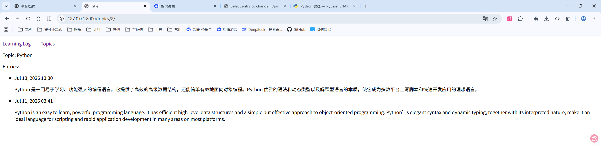

# 2. 用户账户

Web 应用程序的核心是让任何地方的任何用户都能够注册账户并使用它。本章将创建一些表单，让用户能够添加主题和条目并编辑既有的条目。你将了解到，Django 能够防范对基于表单的网页发起的常见攻击，让你无须花大量时间考虑应用程序的安全问题。

本章还将实现用户身份验证系统。我们将创建一个注册页面，供用户创建自己的账户，并让一些页面仅供已登录的用户访问。然后修改一些视图函数，使用户只能看到自己的数据。我们还将学习如何确保用户数据的安全。

## 2.1 让用户能够输入数据

在建立用于创建用户账户的身份验证系统之前，我们添加几个页面，让用户能够输入数据。用户将能够添加新主题，添加新条目，以及编辑既有的条目。

当前，只有超级用户能够通过管理网站输入数据。我们不想让用户与管理网站交互，因此将使用 Django 的表单创建工具来创建让用户能够输入数据的页面。

### 2.1.1 添加新主题

我们首先让用户能够添加新主题。在创建基于表单的页面时，方法几乎与前面创建网页时一样：定义 URL，编写视图函数，并且编写模板。一个主要差别是，需要导入包含表单的模块 forms.py。


